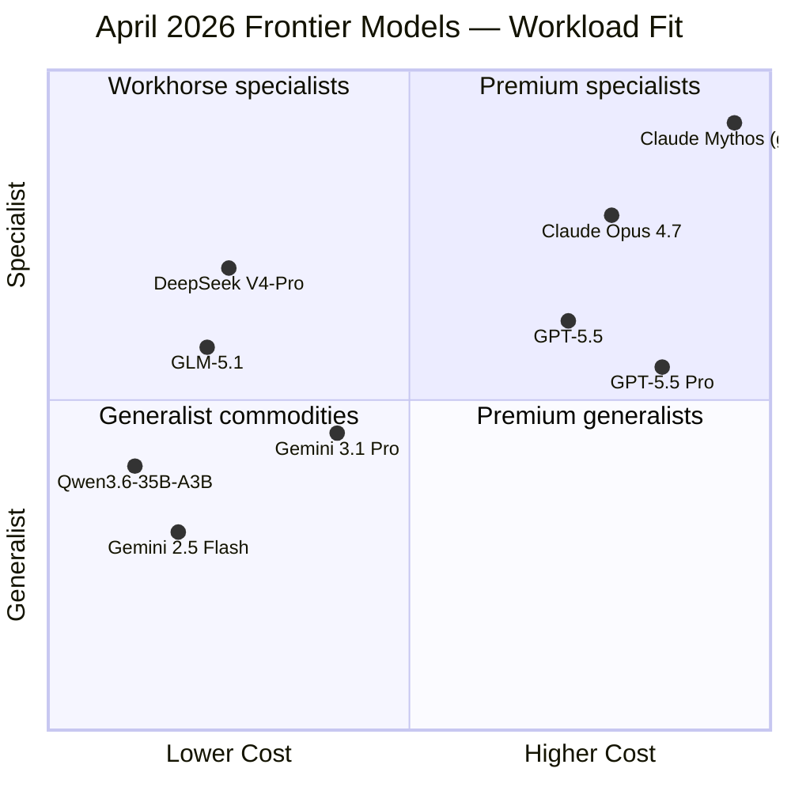
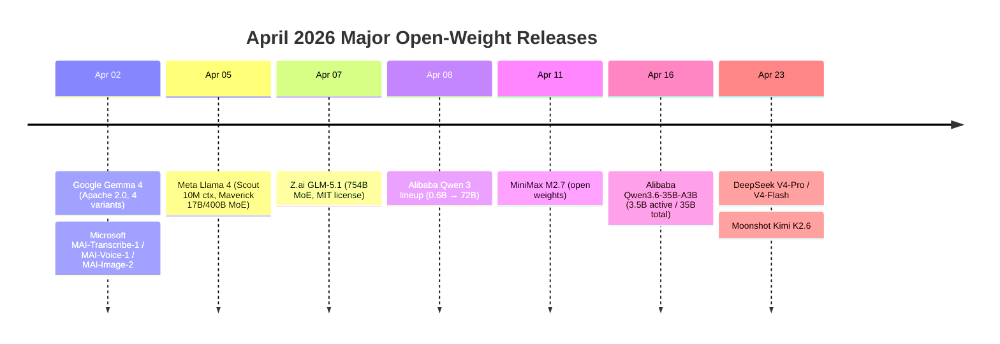
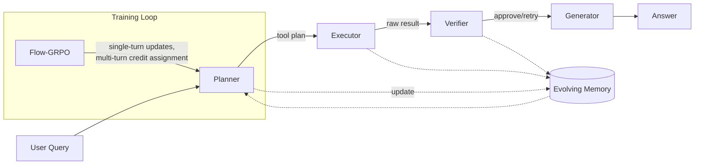
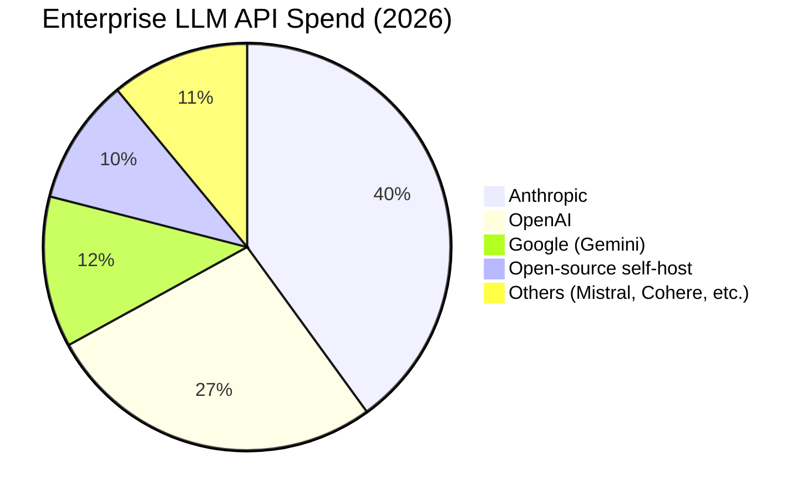
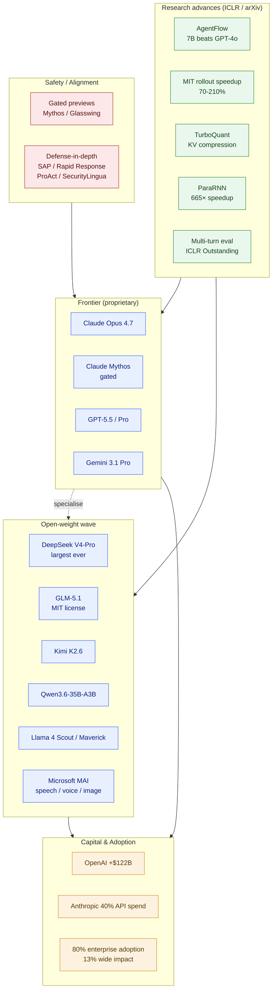

# LLM Updates — 2026-Apr-30

End-of-month snapshot of where large language models stood at the close of
April 2026. This refresh focuses on **what's newly verifiable** as April closed
out — the SWE-bench Pro standings, ICLR 2026 outstanding-paper picks, Stanford
AgentFlow's emergence as the small-model agent template, MIT's rollout-side
training acceleration, and the head-to-head positioning of Opus 4.7 / GPT-5.5 /
Gemini 3.1 Pro that crystallised in the last week of the month. Companion
context for the broad April release wave is in the prior section of this same
file's history; this version emphasises late-April benchmarks, research
results, and the state of competition rather than relisting launches.

---

## 1. The Frontier at Month-End: No Single Winner

By April 29–30, the three Western frontier proprietary models (Claude Opus 4.7
released Apr 16, GPT-5.5 released Apr 23, Gemini 3.1 Pro carried over from
February with cumulative updates) had been benchmarked extensively against
each other. The result is a *specialisation map*, not a leaderboard.

| Capability                      | Best Model           | Score / Note                          |
|---------------------------------|----------------------|---------------------------------------|
| SWE-bench Pro (coding agent)    | Claude Mythos (gated)| 77.8% — public Opus 4.7: 64.3%       |
| SWE-bench Pro, public-tier API  | Claude Opus 4.7      | 64.3% (vs GPT-5.5 58.6%, Gemini 54.2%)|
| Terminal / command-line tasks   | GPT-5.5              | 82.7% (vs Opus 69.4%, Gemini 68.5%)   |
| ARC-AGI-2 (abstract reasoning)  | GPT-5.5              | 85.0% (vs Gemini 77.1%, Opus 75.8%)   |
| Knowledge work (GDPVal-AA)      | Claude Opus 4.7      | 1,753 (vs GPT-5.4 1,674, Gemini 1,314)|
| 1M-token context, multimodal    | Gemini 3.1 Pro       | text+audio+image+video, MEDIUM thinking|
| Price/performance, multimodal   | Gemini 3.1 Pro       | leads on cost-per-task at par quality |

Two structural points are now clear:

1. **No model wins everywhere.** Selection is *workload-specific*: Opus 4.7
   for code engineering and tool orchestration, GPT-5.5 for agentic terminal
   automation and abstract reasoning, Gemini 3.1 Pro for cost-effective
   multimodal and ultra-long-context.
2. **The Mythos / Opus split is permanent for now.** Mythos sits ~13 points
   above public Opus 4.7 on SWE-bench Pro but stays gated through Project
   Glasswing for cyber-misuse reasons. The frontier is no longer a single
   public number.

Sources:
- [SWE-bench Pro Leaderboard 2026 — BenchLM](https://benchlm.ai/benchmarks/swePro)
- [SWE-Bench Pro Public Leaderboard — Scale](https://labs.scale.com/leaderboard/swe_bench_pro_public)
- [GPT-5.5 vs Opus 4.7 vs Gemini 3.1 Pro — Mohit Aggarwal / Medium](https://medium.com/@mohit15856/gpt-5-5-vs-claude-opus-4-7-vs-gemini-3-1-pro-vs-deepseek-v4-18dafdcf9b5e)
- [Each wins different races — Cogni Down Under / Medium](https://medium.com/@cognidownunder/openai-gpt-5-5-b6cf7e37668e)
- [Gemini 3.1 Pro model card — DeepMind](https://deepmind.google/models/model-cards/gemini-3-1-pro/)
- [Gemini 3.1 Pro launch — Google blog](https://blog.google/innovation-and-ai/models-and-research/gemini-models/gemini-3-1-pro/)
- [LM Council benchmark dashboard](https://lmcouncil.ai/benchmarks)

---

## 2. The Open-Source Wave That Closed the Month

April 2026's open-weight cadence was unusual: **five major Chinese-lab releases
inside three weeks**, plus Google's Gemma 4 and Microsoft's MAI multimodal
family. By month-end, the gap to proprietary models on coding has effectively
closed for many practical workloads.

What's *new* relative to the earlier April recap:

- **DeepSeek V4-Pro is now the largest open-weight model ever released**,
  overtaking Kimi K2.6 (1.1T) and GLM-5.1 (744B). V4-Flash ships alongside as
  the cost-tier variant.
- **Qwen3.6-35B-A3B** lands the most aggressive sparsity ratio of the
  generation — only 3.5B active parameters from a 35B total — squarely
  targeting H100-friendly self-hosting.
- **GLM-5.1's MIT license is the differentiator.** MoE at 744B params *and*
  permissive enough for enterprise fine-tuning and commercial deployment is
  rare; this is the first time it's been credibly open at frontier scale.
- **Kimi K2.6** focuses upgrades on agentic stability over long sessions
  rather than headline benchmark gains.
- **MiniMax M2.5** matches Claude Opus 4.6 at 80.2% / 80.8% on SWE-bench,
  another data point that the open–closed gap is, for many workloads, gone.
- **Arena Elo** for the open tier now clusters tightly: GLM-5 at 1451,
  Kimi K2.5 ~1448, GLM-4.7 ~1445 — human preference has converged.

Microsoft's MAI line is the structural surprise: not an LLM, but a complete
multimodal stack (transcription, voice, image) explicitly competing with
OpenAI/Google on Foundry pricing. MAI-Transcribe-1 reports 3.8% average WER
across 25 languages on FLEURS — beating Whisper-large-v3 across the board —
at roughly half the GPU cost. MAI-Voice-1 generates 60 s of expressive audio
in under one second on a single GPU.

Sources:
- [DeepSeek V4-Pro release coverage — AkitaOnRails](https://akitaonrails.com/en/2026/04/24/llm-benchmarks-parte-3-deepseek-kimi-mimo/)
- [Open-weight LLMs comparison — BentoML](https://www.bentoml.com/blog/navigating-the-world-of-open-source-large-language-models)
- [Best open-source LLMs hardware — Modemguides](https://www.modemguides.com/blogs/ai-infrastructure/best-open-source-llms-hardware-april-2026)
- [GLM-5.1 vs Qwen 3.6 vs Kimi K2.6 vs MiniMax — Atlas Cloud](https://www.atlascloud.ai/blog/guides/kimi-k2-6-vs-glm-5-1-vs-qwen-3-6-plus-vs-minimax-m2-7-coding-2026)
- [Microsoft MAI launch — Microsoft AI](https://microsoft.ai/news/today-were-announcing-3-new-world-class-mai-models-available-in-foundry/)
- [MAI-Transcribe / Voice / Image — Microsoft Foundry blog](https://techcommunity.microsoft.com/blog/azure-ai-foundry-blog/introducing-mai-transcribe-1-mai-voice-1-and-mai-image-2-in-microsoft-foundry/4507787)
- [Microsoft direct shot at OpenAI / Google — VentureBeat](https://venturebeat.com/technology/microsoft-launches-3-new-ai-models-in-direct-shot-at-openai-and-google)

---

## 3. ICLR 2026 (April 23–27, Rio): What Actually Won

The conference closed on April 27 — the outstanding-paper picks and the
oral-track signal point to where research consensus is heading.

**Outstanding papers:**

1. *Transformers are Inherently Succinct* — Bergsträßer, Cotterell,
   Widjaja Lin. A theoretical result on how compactly a Transformer can
   represent concepts versus alternative architectures (RNNs, etc.). It
   gives a sharper formal explanation for why Transformers dominate beyond
   "they parallelise well."
2. *Multi-turn LLM Evaluation* (anonymised in coverage). Designs a scalable
   evaluation for **multi-turn underspecified-instruction** settings, and
   measures a sharp degradation in real-world LLM aptitude that single-turn
   eval suites have been hiding. The committee called out experimental
   design and methodology specifically.
3. *The Polar Express: Optimal Matrix Sign Methods and their Application
   to the Muon Algorithm* — Amsel, Persson, Musco et al.

**Notable orals (LLM-relevant):**

- **AgentFlow** (Stanford, Lu et al.) — see §4.
- **ParaRNN** — parallel training of nonlinear RNNs, claiming a 665× speedup
  over the sequential approach. Revives the question of whether non-attention
  sequence models can be competitive at scale on training cost.
- **RASLIK** — reframes LLM unlearning as data selection.
- **TurboQuant** — KV-cache compression via PolarQuant rotation followed by
  a quantised Johnson–Lindenstrauss projection; significant memory cuts at
  near-zero quality loss, enabling longer context on the same hardware.

The two structural takeaways:

- *Multi-turn underspecified eval* is now the credibility benchmark — labs
  that only publish single-turn numbers are increasingly suspect.
- *Architecture pluralism* is back on the table. Theoretical succinctness
  results plus credible non-Transformer parallelism (ParaRNN) plus hybrid
  attention/state-space designs (Qwen3-Next, Kimi Linear, Nemotron 3) make
  "Transformer wins everything forever" the weaker bet than it was six
  months ago.

Sources:
- [ICLR 2026 outstanding papers — ICLR Blog](https://blog.iclr.cc/2026/04/23/announcing-the-iclr-2026-outstanding-papers/)
- [ICLR 2026 papers — Lambda summary](https://lambda.ai/blog/iclr-2026-12-papers)
- [ICLR 2026 site](https://iclr.cc/)
- [Apple at ICLR 2026](https://machinelearning.apple.com/research/iclr-2026)
- [ParaRNN — Paper Digest highlights](https://www.paperdigest.org/2026/02/iclr-2026-papers-highlights/)

---

## 4. AgentFlow: The Small-Model Agent Result That Reframes 2026

Stanford's **AgentFlow** (Lu et al., ICLR 2026 Oral, top 1.1%) is the result
worth lingering on. It's the strongest data point yet that *agentic
scaffolding can substitute for raw model scale*, and it shipped right as the
April model wave was being absorbed.

Headline numbers (7B backbone):

- **+14.9%** on search reasoning vs top baselines
- **+14.0%** on agentic tasks
- **+14.5%** on math reasoning
- **+4.1%** on scientific reasoning

Across these, the 7B AgentFlow surpasses GPT-4o on search, agent, and math
benchmarks — a model two generations and ~50× the parameters older.

The technical argument worth absorbing:

- Most tool-using agents train *one* policy on the full conversation context.
  This collapses on long-horizon, sparse-reward problems because
  credit-assignment fights everything else the policy has to do.
- AgentFlow splits responsibility across **four cooperating modules** —
  planner / executor / verifier / generator — coordinated by an evolving
  memory. Only the planner is trained inside the loop.
- **Flow-GRPO** turns multi-turn credit assignment into a sequence of
  single-turn policy updates, side-stepping the long-horizon RL pathologies.
- Online RL with Flow-GRPO yields +17.2%; replacing it with offline SFT
  collapses to **−19.0%**. The gain is from *training-in-the-flow*, not
  from supervision.

For practitioners: 2026's agent stack is converging on this pattern —
cooperating specialised modules with one trainable planner, not a single
giant model self-orchestrating.

Sources:
- [AgentFlow — Stanford project page](https://agentflow.stanford.edu/)
- [In-the-Flow Agentic System Optimization — arXiv 2510.05592](https://arxiv.org/abs/2510.05592)
- [AgentFlow — GitHub](https://github.com/lupantech/AgentFlow)
- [Stanford AgentFlow coverage — MarkTechPost](https://www.marktechpost.com/2025/10/08/stanford-researchers-released-agentflow-in-the-flow-reinforcement-learning-rl-for-modular-tool-using-ai-agents/)
- [Awesome AI Agent Papers 2026](https://github.com/VoltAgent/awesome-ai-agent-papers)

---

## 5. Training-Side Win: MIT's Rollout Acceleration

Most April training-efficiency work targeted inference. MIT's late-April
result targets **RL training itself** and is a meaningful one.

The observation: in reasoning-LLM RL training, **the rollout phase
(generating candidate answers) consumes up to 85% of total wall-clock**,
while the actual policy update is cheap. Hu, Yang, and Han (Song Han's group)
introduced a method that trains a **smaller predictor model** alongside the
main reasoner to anticipate rollouts; the larger model only verifies.

Reported acceleration: **70%–210% across multiple reasoning LLMs trained on
real-world datasets**, with accuracy preserved.

Implications:

- The economics of reasoning-model training shift. RL post-training has been
  the major cost driver of the 2025–2026 wave; cutting rollout 2–3× cuts the
  largest line item.
- Combined with TurboQuant (inference-side KV memory reduction) and the
  small-model-agent results from AgentFlow, the field's compute curve is
  bending in three places at once: training rollout, inference KV memory, and
  *required parameter count for a given task*.

Sources:
- [New method increases LLM training efficiency — MIT News (Feb)](https://news.mit.edu/2026/new-method-could-increase-llm-training-efficiency-0226)
- [MIT EECS coverage](https://www.eecs.mit.edu/new-method-could-increase-llm-training-efficiency/)
- [Leaner-and-faster while still learning — MIT News (Apr 9)](https://news.mit.edu/2026/new-technique-makes-ai-models-leaner-faster-while-still-learning-0409)

---

## 6. Safety, Alignment, and Jailbreaks at Month-End

April 1 saw a comprehensive jailbreak-survey paper drop, and the picture from
recent empirical work is bleak in the short term, but the defensive toolkit
has gotten more interesting.

**The bad news.** Empirical jailbreak success rates against frontier models
in 2024–2026 still range from ~65% (simple multi-turn) to ~99% (automated
fuzzing). Prompt-input filters degrade benign performance enough to be
unattractive in production. The April Microsoft Security disclosure of a
one-prompt attack class that breaks alignment in production reinforced the
"models can be jailbroken" baseline.

**The newer defensive ideas.**

- **In-decoding safety probing (SAP)** — preserves alignment under benign
  fine-tuning, where prior approaches regressed.
- **Rapid response** (MATS) — fine-tunes a small input classifier on a few
  observed jailbreaks; reduces in-distribution success rate >240×, OOD >15×.
- **ProAct** — proactive defence that returns *spurious responses* that look
  successful to the attacker but contain no harmful content. Disrupts
  automated-fuzzing pipelines whose feedback loop assumes plausible outputs
  signal real success.
- **SecurityLingua** — security-aware prompt compression as a jailbreak
  defence layer.
- **Safety-knowledge-neuron interpretability** — locates the small set of
  components implementing the "is this query safe?" classification, building
  on the Superficial Safety Alignment Hypothesis from earlier in April.

The strategic shift: nobody at the frontier is shipping single-layer safety
anymore. Anthropic ships Mythos *gated* and Opus 4.7 with cyber-misuse
classifiers; OpenAI shipped GPT-5.5 with its strongest preparedness review to
date; Microsoft ships MAI behind Foundry-side controls. **Defence in depth is
no longer a slogan; it's the default deployment pattern.**

Sources:
- [Jailbreak Attacks and Defenses survey (Apr 2026)](https://www.preprints.org/frontend/manuscript/f6f71860ac6a9f5e0b7e64d013096864/download_pub)
- [Jailbreaking LLMs & VLMs — arXiv 2601.03594](https://arxiv.org/html/2601.03594v1)
- [In-decoding safety-awareness probing — arXiv 2601.10543](https://arxiv.org/html/2601.10543v1)
- [Rapid Response — MATS](https://www.matsprogram.org/research/rapid-response-mitigating-llm-jailbreaks-with-a-few-examples)
- [Jailbreaking Jailbreaks (ProAct) — OpenReview](https://openreview.net/forum?id=pq6rx9r6Aj)
- [SecurityLingua — OpenReview](https://openreview.net/forum?id=tybbSo6wba)
- [Unraveling LLM Jailbreaks via Safety Knowledge Neurons — EACL 2026](https://aclanthology.org/2026.eacl-long.83.pdf)

---

## 7. Capital, Adoption, and the Vendor Map

April's market data points anchor a re-shaped landscape.

- **OpenAI raised $122 billion** during April. Anthropic is reportedly
  considering a public listing. Vendor consolidation pressure is now the
  default base case.
- **Enterprise LLM adoption** crossed 80% (from <5% in 2023), but only ~13%
  of adopters report enterprise-wide impact. The "deployment value" gap is
  the actual binding constraint, not model capability.
- **Spend share has rotated.** Per Menlo Ventures (late 2025, persisting in
  Q2 2026): Anthropic ~40% of enterprise LLM API spend, OpenAI ~27%, down
  from OpenAI's ~50% in 2023.
- **Agentic AI ≈ 17% of total AI value** today, projected to roughly double
  by 2028. Gartner projects **40% of enterprise applications** will ship
  task-specific AI agents by year-end 2026, up from <5% a year ago.

Sources:
- [Enterprise Agentic AI Landscape 2026 — Kai Waehner](https://www.kai-waehner.de/blog/2026/04/06/enterprise-agentic-ai-landscape-2026-trust-flexibility-and-vendor-lock-in/)
- [LLM Enterprise Adoption Statistics 2026 — index.dev](https://www.index.dev/blog/llm-enterprise-adoption-statistics)
- [Agentic AI in 2026 — CIO](https://www.cio.com/article/4107315/agentic-ai-in-2026-more-mixed-than-mainstream.html)
- [State of AI Agents 2026 — Arcade](https://blog.arcade.dev/5-takeaways-2026-state-of-ai-agents-claude)
- [LLM news April 2026 — Fazm](https://fazm.ai/blog/llm-news-april-2026)

---

## 8. Cross-cutting Picture (Visual Summary)

---

## 9. Five Things That Are Actually New This Month

If you only track five shifts from April 2026:

1. **Specialisation, not dominance.** Opus 4.7, GPT-5.5, and Gemini 3.1 Pro
   each win clearly distinct workloads. Single-model strategies underperform
   multi-model routing for any non-trivial enterprise.
2. **Open-weight saturation at the frontier.** DeepSeek V4-Pro is the largest
   open-weight model ever, GLM-5.1 ships at 754B under MIT, and Arena Elo
   among open models has converged inside a 6-point band. The relevant axis
   is no longer "is open-weight competitive" but "self-host or API."
3. **Small-model + scaffolding beats big-model on agentic tasks.**
   AgentFlow's 7B-backbone result (ICLR Oral) is the strongest existence
   proof of the year. Combined with MIT's rollout speedup, the cost curve
   for capable agents bends sharply downward.
4. **Multi-turn underspecified evaluation is the new credibility test.**
   ICLR's outstanding-paper choice forces the field to publish on the
   setting that mirrors real product use.
5. **Safety has bifurcated permanently.** Gated previews for high-risk
   capability (Mythos / Glasswing), defence-in-depth at the public surface
   (Opus 4.7 cyber classifiers, SAP, ProAct, Rapid Response). Single-layer
   alignment is no longer a credible posture.

---

*Generated 2026-04-30 (America/Los_Angeles, end-of-day). Information current
as of the sources listed; benchmark numbers reflect provisional April 29
SWE-bench Pro / LM Council snapshots. Vendor announcements have not all been
independently reproduced.*
