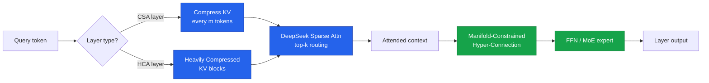
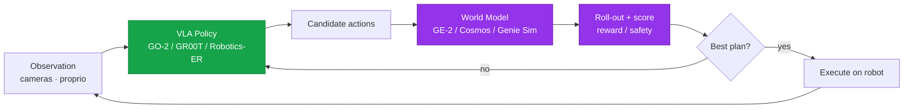
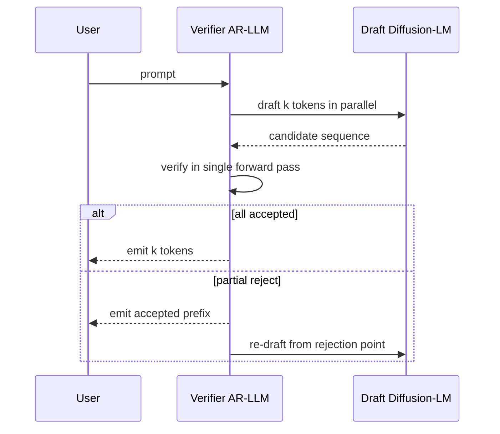
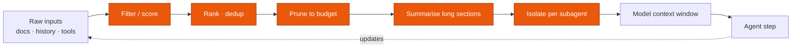
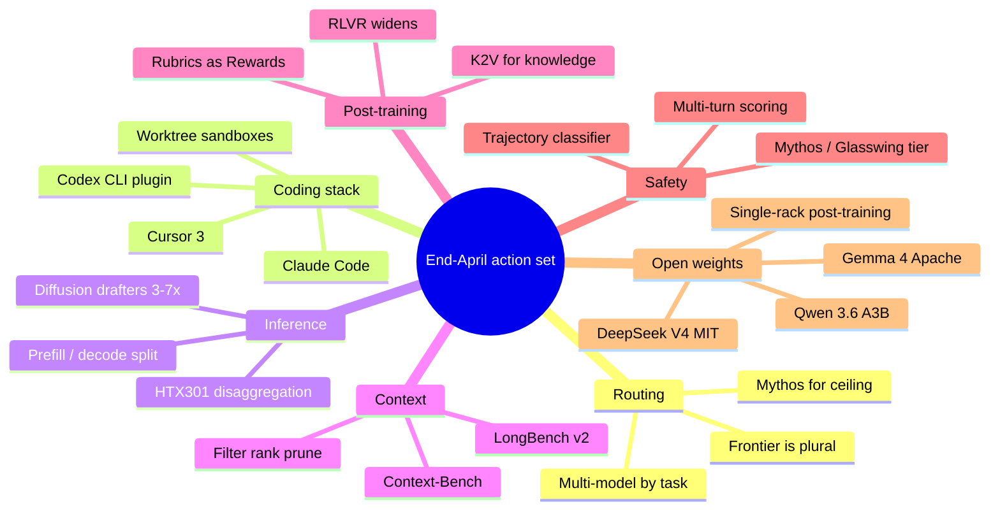

# LLM Updates — 2026-Apr-30

A late-night refresh, written end-of-day Thursday April 30 (LA time).
This pass is deliberately *complementary* to the earlier briefings filed
today — it indexes on items that haven't been written up here yet, or that
deserve a deeper architectural read. Headlines: **DeepSeek V4-Pro's hybrid
attention** is the most interesting open-weight architecture shipped this
year; **AI coding harnesses are converging into one stack** (Cursor 3,
Codex CLI, Claude Code now interoperate); **Skymizer's HTX301** ships a
disaggregated prefill/decode compute design; **AGIBOT's GO-2 / GE-2** make
"VLA + world model" a concrete recipe; **diffusion-as-drafter speculative
decoding** is the new cheap inference win; and **context engineering** has
graduated from a craft skill to a benchmarked discipline.

---

## 1. Frontier model leaderboard at end-of-April

The April release wave settled into a clear three-way race, with one open
weight crashing into the top tier. The pricing column matters: it's the
cleanest read on which lab is willing to subsidise inference for share.

| Model              | Released   | Headline strength                     | Reference benchmark           | API price (in / out, /M tok) |
|--------------------|------------|---------------------------------------|-------------------------------|------------------------------|
| GPT-5.5 / Pro      | Apr 23–24  | Top overall + agent execution         | AAII 60 · Terminal-Bench 82.7%| $5 / $30                     |
| Claude Opus 4.7    | Apr 16     | Coding · long-horizon autonomy        | SWE-Bench Pro **64.3%**       | $5 / $25                     |
| Gemini 3.1 Pro     | Apr (rolling) | Cheap multimodal · 2M context      | GPQA Diamond **94.3%**        | $2 / $12                     |
| DeepSeek V4-Pro    | Apr 24     | Open-weight frontier                   | competitive on math/code      | open weights (MIT)           |
| Claude Mythos      | gated      | Reasoning ceiling (HLE 64.7%)         | HLE                           | restricted-access only       |

Two readings:

1. **No single model wins all tasks.** GPT-5.5 leads the AAII composite;
   Opus 4.7 leads coding; Gemini 3.1 Pro is the price/multimodal play;
   DeepSeek V4-Pro is the open-weight option that actually competes; and
   Mythos is the gated capability ceiling. Multi-vendor routing isn't a
   nice-to-have anymore — it's the only way to use the frontier well.
2. **Benchmark contamination is a first-order problem.** OpenAI flagged
   training-data contamination for SWE-bench Verified across all frontier
   models; SWE-bench Pro is being treated as the successor. Expect this
   pattern (older benchmark loses signal → new benchmark replaces it) to
   accelerate as benchmarks become marketing surface.

Sources:
- [Introducing GPT-5.5 — OpenAI](https://openai.com/index/introducing-gpt-5-5/)
- [GPT-5.5 model docs — OpenAI Developers](https://developers.openai.com/api/docs/models/gpt-5.5)
- [Claude Opus 4.7 — Anthropic](https://www.anthropic.com/news/claude-opus-4-7)
- [Claude Opus 4.7 vs Gemini 3.1 Pro — DataCamp](https://www.datacamp.com/blog/claude-opus-4-7-vs-gemini-3-1-pro)
- [Frontier Model Showdown — DEV Community](https://dev.to/om_shree_0709/gpt-55-vs-claude-opus-47-vs-gemini-31-pro-the-frontier-model-showdown-4mji)
- [SWE-Bench Pro Leaderboard — Scale](https://labs.scale.com/leaderboard/swe_bench_pro_public)
- [LLM Benchmarks 2026 — llm-stats](https://llm-stats.com/benchmarks)

---

## 2. DeepSeek V4-Pro: the open-weight architecture worth studying

DeepSeek V4-Pro and V4-Flash dropped on April 24 under MIT license. The
weights matter, but the **architecture matters more** — V4 is the cleanest
demonstration to date that a serious open lab can ship original
inference-side innovations, not just scale clones.

What's actually new:

- **Hybrid attention: CSA + HCA interleaved.** Compressed Sparse Attention
  (CSA) compresses every *m* tokens of KV cache into a single learned
  entry, then DeepSeek Sparse Attention (DSA) routes each query to the
  top-*k* compressed entries. Heavily Compressed Attention (HCA) pushes
  the compression further on selected layers. The net effect at 1M
  context: **27% of single-token inference FLOPs** and **10% of KV cache**
  versus DeepSeek V3.2.
- **Manifold-Constrained Hyper-Connections (mHC).** Replaces vanilla
  residual connections with a constrained hyper-connection that improves
  signal-propagation stability across deep stacks without the
  expressivity cost of pure normalisation tricks.
- **Muon optimizer at 33T-token scale.** Faster convergence and better
  training stability than AdamW at this scale. V4-Pro is the first
  trillion-token-class run to publicly use Muon end-to-end.
- **Two-model release strategy.** V4-Pro (1.6T total / 49B active) for
  ceiling, V4-Flash (284B total / 13B active) for cost. The gap between
  open-weight frontier and proprietary frontier on benchmarks enterprises
  actually run is now in single digits.

The strategic read: DeepSeek's V3 → V4 jump narrowed the
hardware-efficiency gap with proprietary frontier labs. The Muon +
hybrid-attention combination is reproducible by any serious lab; expect
copies inside Qwen, GLM, MiniMax, Kimi within a quarter.

Sources:
- [DeepSeek-V4-Pro on Hugging Face](https://huggingface.co/deepseek-ai/DeepSeek-V4-Pro)
- [DeepSeek V4 Preview — DeepSeek API Docs](https://api-docs.deepseek.com/news/news260424)
- [DeepSeek V4-Pro architecture review — buildfastwithai](https://www.buildfastwithai.com/blogs/deepseek-v4-pro-review-2026)
- [DeepSeek V4 — felloai breakdown](https://felloai.com/deepseek-v4/)
- [DeepSeek V4 signals new phase — CFR](https://www.cfr.org/articles/deepseek-v4-signals-a-new-phase-in-the-u-s-china-ai-rivalry)

---

## 3. The AI coding harness has converged into one stack

The first week of April broke the wall between coding agents. Cursor 3
shipped parallel agent tabs, isolated cloud VMs, and `/worktree` for
branch isolation. OpenAI published an official Codex plugin that runs
*inside* Anthropic's Claude Code. Early adopters now run all three
together. The differentiator is no longer *what* the agent can do — it's
*where* you prefer to sit.

The picture below is the industry-wide stack as of end-April. The four
layers (surface → harness → model → execution) are now interchangeable
along each row, and most production teams are mixing across rows.

Pragmatic implications:

- **Pick the harness for the hooks, not the brand.** Claude Code, Codex
  CLI, and Aider all expose comparable subagent / MCP / hook surfaces.
  The interesting differentiation is the slash-skill / hook ecosystem
  around each.
- **Pick the model per task, not per harness.** The best workflow at
  end-April runs Opus 4.7 for refactor + long-horizon coding, GPT-5.5 for
  agentic execution and terminal work, Gemini 3.1 Pro for cheap
  multimodal prep, DeepSeek V4-Pro for offline / private / air-gapped
  work.
- **Sandbox is the layer that determines blast radius.** Cursor's cloud
  VMs and Claude Code's worktree-per-agent are the two patterns that
  scaled. Both isolate destructive operations from the user's working
  tree — the right default for parallel agents.

Sources:
- [Cursor, Claude Code, Codex merging — The New Stack](https://thenewstack.io/ai-coding-tool-stack/)
- [AI Coding Assistants April 2026 — DigitalApplied](https://www.digitalapplied.com/blog/ai-coding-assistants-april-2026-cursor-copilot-claude)
- [Best AI Coding Agents 2026 — MightyBot](https://mightybot.ai/blog/coding-ai-agents-for-accelerating-engineering-workflows/)
- [AI Coding Harness comparison — thoughts.jock.pl](https://thoughts.jock.pl/p/ai-coding-harness-agents-2026)
- [We Tested 15 AI Coding Agents (2026) — Morph](https://www.morphllm.com/ai-coding-agent)

---

## 4. Skymizer HTX301: disaggregated prefill / decode goes mainstream

Skymizer Taiwan unveiled the **HTX301** inference card on April 23 with
**HyperThought**, a software/hardware co-design that runs **700B-parameter
models on a single PCIe card**, no GPU cluster, no liquid cooling.

The trick is acknowledging what every production inference team already
knows: LLM inference is two different problems welded together.

- **Prefill** processes the input prompt. It is *compute-bound* — heavy
  matmul, embarrassingly parallel, what a GPU was designed for.
- **Decode** generates tokens one at a time. It is
  *memory-bandwidth-bound* — the model has to be fetched from HBM for
  every token, and almost no FLOPs go to waste.

A single accelerator that's good at both is a compromise. HyperThought
splits them: HTX301 is purpose-built for decode, while existing GPUs
continue to handle prefill. The strategic implication is that the next
generation of inference clusters won't be homogeneous — they'll be
*disaggregated*, with prefill nodes and decode nodes scaled independently
based on workload mix.

This is consistent with how DeepMind, Together, and Anthropic have been
architecting their inference fleets internally; what's new is that the
recipe is now packaged for enterprises as a buyable card, not a paper.

Sources:
- [Skymizer HTX301 / HyperThought announcement — Manila Times](https://www.manilatimes.net/2026/04/23/tmt-newswire/pr-newswire/skymizer-taiwan-inc-unveils-breakthrough-architecture-enabling-ultra-large-llm-inference-on-a-single-card/2326985)
- [LLM inference disaggregation primer — NVIDIA](https://developer.nvidia.com/blog/applying-mixture-of-experts-in-llm-architectures/)

---

## 5. Embodied AI in April: VLA + World Model is now a concrete recipe

Beyond Motubrain (covered earlier today), three more April releases
locked the "VLA + world model" combination as the dominant 2026 robotics
stack. The shape: a Vision-Language-Action policy generates short-horizon
actions, a learned world model rolls them forward in simulation for
reward / safety scoring, and a planner picks the best plan to execute.

- **AGIBOT GO-2 + GE-2 (Apr 17).** GO-2 is the ViLLA (Vision-Language-
  Latent-Action) embodied foundation model, with Action Chain-of-Thought
  bridging plan and execution. GE-2 is the *world action model* —
  interactive virtual worlds where GO-2's plans get rolled out at high
  speed for evaluation. Genie Sim 3.0 generates digital twins from
  natural-language descriptions for sim-to-real transfer.
- **Gemini Robotics-ER 1.6 (Apr 14).** DeepMind's spatial-reasoning model,
  with new instrument-reading capability developed with Boston Dynamics
  (Spot can now read analog gauges).
- **NVIDIA GR00T N1.7 Early Access (Apr 17).** A 3B-parameter open VLA
  built on a Cosmos-Reason2-2B backbone with a 32-layer DiT for low-level
  motor control. The Cosmos world-models library crossed 2M downloads in
  April.

The pattern recurs across labs: a policy that's fast enough to run on the
robot, paired with a world model that's accurate enough to use for
evaluation rather than execution. The world model isn't a substitute for
the real world — it's a cheap simulator that lets you reject bad plans
without putting the robot at risk.

Sources:
- [AGIBOT GO-2 / GE-2 / Genie Sim 3.0 — PRNewswire](https://www.prnewswire.com/news-releases/agibot-unveils-new-generation-of-embodied-ai-robots-and-models-accelerating-real-world-deployment-of-physical-ai-302746174.html)
- [Gemini Robotics-ER 1.6 — winbuzzer](https://winbuzzer.com/2026/04/16/google-deepmind-gemini-robotics-er-1-6-autonomous-industrial-inspections-xcxwbn/)
- [NVIDIA Physical AI for National Robotics Week](https://blogs.nvidia.com/blog/national-robotics-week-2026/)
- [Top 10 Physical AI Models 2026 — MarkTechPost](https://www.marktechpost.com/2026/04/28/top-10-physical-ai-models-powering-real-world-robots-in-2026/)
- [Gemini Robotics 1.5 — Google DeepMind](https://deepmind.google/blog/gemini-robotics-15-brings-ai-agents-into-the-physical-world/)

---

## 6. Diffusion-as-drafter: cheap inference wins this quarter

The diffusion-LM thread has been simmering since 2024. Three pieces of
work in April finally made the inference-time story compelling:

- **DiffuSpec** (training-free): pretrained diffusion LM produces
  multi-token drafts in a single forward pass, verified by a standard
  autoregressive model. Up to **3× wall-clock speedup**, no retraining
  required.
- **Self-Speculative Decoding (SSD)** for diffusion LLMs: same model
  drafts and verifies, no auxiliary draft model. **Up to 3.46× speedup**
  with output identical to standard stepwise decoding on LLaDA / Dream.
- **Speculative Diffusion Decoding** (NAACL 2025, deployed widely in
  April 2026): discrete diffusion drafts, parallelised drafting and
  verification, reports up to **7.2× speedup** versus standard generation
  and **1.75×** versus prior speculative decoding.

Why this matters operationally: the marginal cost of an additional
inference token is dropping again, after a year of being roughly flat.
For agentic workloads (long generations, structured outputs, tool calls)
the speedup compounds. Expect this to land in production stacks at
hyperscalers within two quarters.

Sources:
- [Self-Speculative Decoding for Diffusion LLMs — arXiv 2510.04147](https://arxiv.org/abs/2510.04147)
- [DiffuSpec — OpenReview](https://openreview.net/forum?id=u2pAPZZCmN)
- [Speculative Diffusion Decoding — arXiv 2408.05636](https://arxiv.org/abs/2408.05636)
- [Speculative Diffusion Decoding — ACL Anthology](https://aclanthology.org/2025.naacl-long.601/)
- [Self-Speculative Decoding — OpenReview](https://openreview.net/forum?id=rKJ7A30lQQ)

---

## 7. Context engineering becomes a benchmarked discipline

"Context engineering" used to be a slack-channel term. As of April it has
its own benchmark family and its own production-systems literature.
Three artefacts to know:

- **Context-Bench (Letta, Apr 2026).** Evaluates an agent's ability to
  chain file operations, trace entity relationships, and manage
  multi-step retrieval. Even the best frontier models cap at **~74%
  accuracy** — meaning 1-in-4 multi-step lookups still drift or lose
  state. The benchmark is now the reference for agent memory work.
- **LongBench v2.** Real-world multi-task long-context evaluation, 8K to
  2M words. Where LongBench v1 measured needle-in-haystack, v2 measures
  *useful work* — multi-hop QA, summarisation, code over a repository.
- **LV-Eval.** Five length levels (16K → 256K) with confusing-fact
  insertion and keyword-recall metrics, designed to penalise models that
  pattern-match instead of reasoning over context.

The conceptual shift: long context is not the same as good context. The
working hypothesis across production teams is that **filtering, ranking,
pruning, summarising, and isolating** information are first-class
operations, not preprocessing tricks. Anthropic's own research has
flagged that contexts above 100K tokens routinely *degrade* reasoning
quality — bigger windows are not free.

Sources:
- [Context-Bench — Letta](https://www.letta.com/blog/context-bench)
- [LongBench v2](https://longbench2.github.io/)
- [LV-Eval — OpenReview](https://openreview.net/forum?id=WQwy1rW60F)
- [LLM context problem 2026 — LogRocket](https://blog.logrocket.com/llm-context-problem-strategies-2026/)
- [Best long-context LLMs — SiliconFlow](https://www.siliconflow.com/articles/en/top-LLMs-for-long-context-windows)

---

## 8. RLVR widens its frontier: rubrics, agents, knowledge

Reinforcement Learning with Verifiable Rewards has been the default
post-training recipe for math/code/formal-proof since DeepSeek-R1. April
2026 produced three shifts that broaden the recipe.

- **Rubrics as Rewards (RaR).** Extends RLVR beyond automatically
  verifiable domains by using *rubric-based* feedback — a structured
  checklist scored by a judge model. Bridges the gap between
  pure-verifier domains (math) and judgment-heavy domains (writing,
  diagnosis, design review).
- **Agentic RL surveys consolidate.** "The Landscape of Agentic
  Reinforcement Learning for LLMs" was updated April 17 with a clean
  reframing: agentic RL replaces the degenerate single-step MDPs of
  classic LLM-RL with **temporally extended, partially observable MDPs**.
  Credit assignment over multi-step trajectories is the central
  unsolved problem.
- **Knowledge-to-Verification (K2V).** Closes the gap between
  knowledge-heavy queries and verifiable rewards by automatically
  extracting verifiable sub-claims from a knowledge-intensive answer,
  then verifying each sub-claim against retrieval. Fixes the "TTS
  doesn't help on knowledge tasks" failure mode flagged earlier this
  year.

The strategic read: RLVR is no longer a math/code-only technique. The
methods to make rubrics and retrieval-checkable claims into reliable
reward signals are now in arXiv-paper-shape, which means production
teams can ship them this quarter.

Sources:
- [Rubrics as Rewards — OpenReview](https://openreview.net/forum?id=c1bTcrDmt4)
- [The Landscape of Agentic RL for LLMs (Apr 17 update) — arXiv 2509.02547](https://arxiv.org/abs/2509.02547)
- [Knowledge-to-Verification — OpenReview](https://openreview.net/forum?id=EVS7SeKBqI)
- [RLVR explained — Promptfoo](https://www.promptfoo.dev/blog/rlvr-explained/)
- [RLVR: definitions, methods, caveats — Medium / Adnan Masood](https://medium.com/@adnanmasood/rlvr-explained-reinforcement-learning-with-verifiable-rewards-examples-risks-and-faqs-89815659bd76)
- [awesome-RLVR — GitHub](https://github.com/opendilab/awesome-RLVR)

---

## 9. Adversarial robustness: large reasoners as autonomous attackers

A Nature Communications paper this month is the most uncomfortable
safety result of April. Four open reasoning models (DeepSeek-R1, Gemini
2.5 Flash, Grok 3 Mini, Qwen3 235B) were used as **autonomous adversary
agents**, conducting multi-turn conversations against nine deployed
target models. Aggregate **jailbreak success rate: 97.14%**.

Two qualifiers:

- Claude 4 Sonnet was the most resistant single target, scoring the
  highest harm score in only **2.86%** of trials.
- The attack pattern with the highest real-world success rate is
  **gradual escalation across turns** — each step appears benign in
  isolation, with the harmful payload assembled across the conversation.
  This is a multi-turn-state problem, not a prompt-engineering problem.

The implication for deployed systems: classifier defenses that score each
prompt independently miss the attack. Effective defenses need to score
the *trajectory* — accumulating concern as a conversation drifts toward
restricted capability. This is exactly what MOSAIC and Project Glasswing-
style deployments are doing for the gated-cyber tier; the same
discipline now needs to land at public-API tier.

Sources:
- [Large reasoning models as autonomous jailbreak agents — Nature Communications](https://www.nature.com/articles/s41467-026-69010-1)
- [Repello AI — Claude jailbreaking 2026 study](https://repello.ai/blog/claude-jailbreak)
- [Single line of code jailbreaks 11 models — CyberPress](https://cyberpress.org/single-line-of-code-can-jailbreak-11-ai-models-including-chatgpt-claude-and-gemini/)

---

## 10. Open-weight wave: five major drops in three weeks

The April open-weight tempo was unusual even by 2026 standards. Five
significant drops landed inside three weeks.

| Date    | Model                 | Lab           | Notable                                              |
|---------|-----------------------|---------------|------------------------------------------------------|
| Apr 2   | Gemma 4 (4 variants)  | Google DM     | Apache 2.0 · 26B MoE · 14 GB · 85 tok/s consumer    |
| Apr 7   | GLM-5.1 (open weights)| Z.ai          | 744B total · prior closed flagship now open         |
| Apr 16  | Qwen 3.6-35B-A3B      | Alibaba       | A3B = 3B active · efficiency play                   |
| Apr 23  | DeepSeek V4-Pro/Flash | DeepSeek      | 1.6T MoE · hybrid attention · MIT                   |
| Apr 23  | (MiniMax M2.7 weights)| MiniMax       | competitive on coding/agentic                        |

The benchmark gap between best open-weight and best proprietary on
enterprise-relevant evaluations has narrowed to single digits. This
matters less for "can I replace GPT-5.5" (you can't, fully) and more for:

- **Air-gapped deployments** finally have a credible frontier-grade
  option (DeepSeek V4-Pro under MIT).
- **Fine-tuning economics** flip: you can now SFT / SimPO / GRPO a
  Gemma 4 or Qwen 3.6 starting point and reach production quality on a
  single-rack budget. The *frontier-lab pretraining cost* is no longer
  the bottleneck; the post-training pipeline is.
- **Hardware procurement** rebalances toward inference (HTX301-style)
  and away from training-only clusters.

Sources:
- [New Open Source LLM Releases April 2026 — Fazm](https://fazm.ai/blog/new-open-source-llm-releases-april-2026)
- [Open-source LLM leaderboard 2026 — Vellum](https://www.vellum.ai/open-llm-leaderboard)
- [Best Open-Source LLMs April 2026 — Modemguides](https://www.modemguides.com/blogs/ai-infrastructure/best-open-source-llms-hardware-april-2026)
- [LLM Coding Benchmark April 2026 (DeepSeek V4 / Kimi / MiMo) — AkitaOnRails](https://akitaonrails.com/en/2026/04/24/llm-benchmarks-parte-3-deepseek-kimi-mimo/)

---

## 11. End-of-month synthesis: what to act on

Compact summary of what this April moved, calibrated for an engineering
team planning Q3:

1. **Treat model selection as a router problem.** The frontier is
   plural — GPT-5.5 / Opus 4.7 / Gemini 3.1 Pro / DeepSeek V4-Pro / Mythos
   each win different rows. Build the router before you commit to any
   single vendor.
2. **Adopt the converged coding harness, not a single tool.** Cursor 3
   for IDE, Claude Code or Codex CLI for terminal, MCP for tools, isolated
   sandboxes for execution. The pieces are interoperable now.
3. **Plan for disaggregated inference.** If you serve at scale, the
   prefill/decode split (HTX301 pattern) is where the next 2–5×
   cost-per-token improvement comes from.
4. **Treat context engineering as a first-class discipline.** Instrument
   filter / rank / prune / summarise / isolate. Long-context window size
   is necessary but not sufficient.
5. **Push RLVR beyond math/code.** Rubrics-as-Rewards and K2V make
   verifier-style training tractable in domains you previously couldn't
   touch. Pilot one judgment-heavy workflow this quarter.
6. **Score conversations, not prompts.** The Nature Communications
   97.14% multi-turn jailbreak result raises the bar for safety
   deployments — trajectory-level scoring is now the floor, not the
   ceiling.
7. **Update procurement assumptions for open weights.** With DeepSeek V4
   under MIT and Gemma 4 under Apache, the "open is two generations
   behind" assumption is wrong for many workloads. Re-run the
   build-vs-buy math.

---

*Generated 2026-04-30 (America/Los_Angeles, late evening). This pass
deliberately complements earlier briefings filed today — it is weighted
toward architectural detail (DeepSeek V4 hybrid attention, HTX301
disaggregation, diffusion-as-drafter) and operational shifts (coding
harness convergence, context engineering as discipline, RLVR widening)
that those passes summarised but did not unpack. Pricing and benchmark
numbers reflect end-of-day April 30 snapshots and may be restated as
labs publish system cards.*
