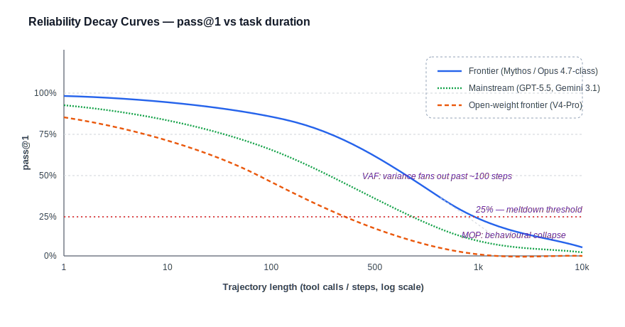
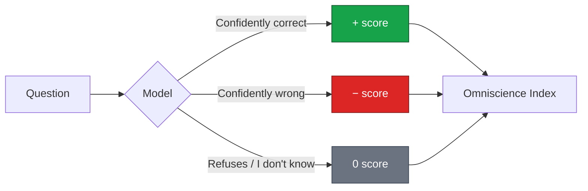
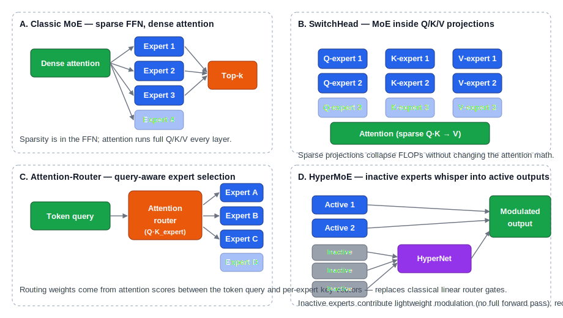
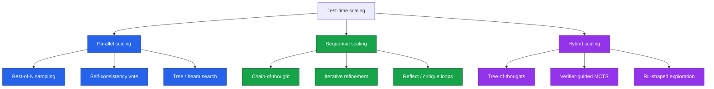
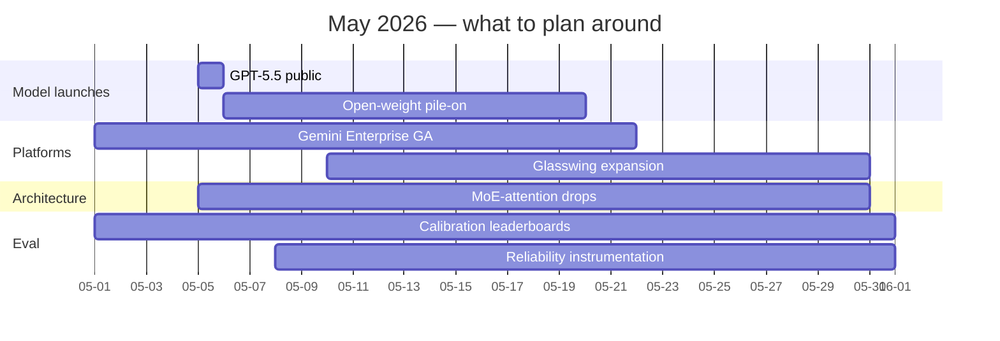

# LLM Updates — 2026-Apr-30

End-of-month brief, written Thursday April 30 (LA time) and **explicitly
forward-looking into early May**. Two themes drive this iteration: (a)
the field has reached the point where **agent reliability** is now a
benchmarked science with a vocabulary distinct from raw benchmark
accuracy, and (b) **mixture-of-experts** has begun to invade the
attention block itself — not just the FFN — which is the architectural
story under most of the headline model wins.

This file overwrites the earlier April 30 drafts. Material that is
already well-known (DeepSeek V4 hybrid attention, DFlash diffusion
drafting, the converged coding harness, the prefill/decode silicon
split) is referenced briefly and not re-derived; the focus is on
late-April signal that earlier passes did not capture.

---

## 1. Late-April additions and the May launch window

Five signals dropped in the April 28–30 window that materially change
the May calendar:

| Date    | Item                                  | Why it matters                                                                |
|---------|---------------------------------------|-------------------------------------------------------------------------------|
| Apr 28  | **Mistral Medium 3.5** open weights   | 128B dense, 256K context, $1.5 / $7.5 per M tok — best dense-class price/perf |
| Apr 29  | **Baidu ERNIE 5.1 Preview**           | #1 Chinese lab on LMArena Text Arena (#13 globally) — closes the lab gap     |
| Apr 28  | **Project Glasswing consortium**      | Anthropic + Amazon + Apple use Claude Mythos for financial-infra security    |
| Apr 22  | **Gemini Enterprise Agent Platform**  | Google Cloud Next 2026 — first end-to-end agent OS from a hyperscaler        |
| May 5   | **GPT-5.5 launch event**              | Public availability; pricing already disclosed at $5/$30 and Pro at $30/$180 |

The framing read: **frontier launches are now staggered weekly**, not
quarterly. The implication for routing is that any model selection your
team commits to should have a 30-day re-evaluation cadence; locking in a
single vendor for a 6-month roadmap is no longer prudent.

The interesting structural item in that list is *Glasswing*. Anthropic
is gating its highest-capability model (Mythos) inside a closed
consortium of cloud, retail, and device incumbents specifically for
**critical-infrastructure security work**. This is the first time a
frontier lab has shipped a top model exclusively into an industry
consortium rather than a public API — and it suggests that
high-capability models will increasingly come with **custodial
distribution agreements** rather than open commercial access.

Sources:
- [AI News April 30, 2026 — Crypto Integrated](https://www.cryptointegrat.com/p/ai-news-april-30-2026)
- [AI News last 24 hours, April 29–30 — devFlokers](https://www.devflokers.com/blog/ai-news-last-24-hours-april-29-30-2026-roundup)
- [Three biggest Google Cloud Next 2026 announcements — Egen](https://egen.ai/insights/three-biggest-ai-announcements-from-google-cloud-next-2026/)
- [OpenAI Release Notes — Releasebot](https://releasebot.io/updates/openai)

---

## 2. Reliability science for long-horizon agents

The single most important methodological shift of late April is the
arrival of a **formal reliability vocabulary** for agent evaluation.
"Beyond pass@1: A Reliability Science Framework for Long-Horizon LLM
Agents" introduces four metrics that the field is converging on:

- **Reliability Decay Curve (RDC)** — pass@k as a function of task
  duration. Frontier models look strong at short horizons and
  collapse on long ones; the curve is the right object to measure.
- **Variance Amplification Factor (VAF)** — how stochastic
  failure modes compound with duration. Critical because mean accuracy
  hides which agents are *consistently* mediocre vs *intermittently*
  brilliant.
- **Graceful Degradation Score (GDS)** — partial-credit metric for
  agents that complete part of a long task. A real production
  workflow rarely fails on the last step; partial trajectories should
  earn partial reward.
- **Meltdown Onset Point (MOP)** — detects *behavioural collapse*
  via sliding-window entropy over tool-call sequences. Operationally,
  this is the point at which an agent stops doing useful work and
  starts looping or thrashing.

Why this vocabulary matters for production teams: the headline
benchmark numbers (Terminal-Bench, SWE-Bench Pro, etc.) are pass@1 at
short to medium horizons. They under-sample the regime where real
agents actually break. A team running multi-hour autonomous workflows
needs to instrument **its own RDC** on its own task distribution,
because the cliff position varies per workflow class.

Two complementary benchmarks shipped in the same window:

- **UltraHorizon** explicitly targets ultra-long-horizon, partially
  observable scenarios (large software development, scientific
  discovery, commercial investment). The headline finding: even the
  most capable systems lose state on tasks whose completion requires
  sustained reasoning, planning, memory management, *and* tool use
  simultaneously — a combination that short-horizon benchmarks rarely
  exercise.
- **EcoGym** evaluates economic plan-and-execute over **1,000+ steps,
  200K+ tokens, 400+ tool calls** in vending, freelance, and
  operations economies. This is the first widely-used benchmark with a
  theoretically infinite horizon.

Combined, these establish that "agent capability" is a 2D quantity —
short-horizon accuracy *and* duration over which that accuracy holds —
and that the second axis is the bottleneck for almost all
production-grade autonomy.

Sources:
- [Beyond pass@1: Reliability Science for Long-Horizon LLM Agents — arXiv](https://arxiv.org/html/2603.29231v1)
- [UltraHorizon benchmark — OpenReview](https://openreview.net/forum?id=FTZfVHWAIq)
- [EcoGym: long-horizon plan-and-execute — arXiv](https://arxiv.org/pdf/2602.09514)
- [TheAgentCompany — OpenReview](https://openreview.net/forum?id=LZnKNApvhG)
- [awesome-ai-agent-papers (2026 curation)](https://github.com/VoltAgent/awesome-ai-agent-papers)

---

## 3. The reasoning-reliability paradox

The hallucination story finally has a clean empirical statement: the
models marketed as the most intelligent are also, on average, the
**least reliable on basic factual tasks**. Across the most recent
benchmark sweeps:

- Hallucination rates across modern LLMs span **15%–52%**, with
  most models clustered in the **20–27%** range.
- Reasoning models are *measurably* better at math, logic, multi-step
  analysis, and medical diagnosis — and *measurably* worse at
  sticking to facts they've been given.
- **Every reasoning model tested exceeded 10% hallucination**:
  GPT-5, Claude Sonnet 4.5, Grok-4, Gemini-3-Pro all crossed that
  threshold.

The new evaluation that punishes this directly is **AA-Omniscience**
(Artificial Analysis): 6,000 questions across six domains, scored on
an Omniscience Index that **rewards knowing your own limits** — wrong
answers cost more than refusals. This is the first major benchmark
that explicitly measures *calibration*, not just capability.

Operational implication: production deployments that route to
reasoning models for "harder" queries are **silently increasing
hallucination risk** unless they pair the routing with a calibration
layer. Two patterns are emerging as defaults:

1. **Self-consistency thresholding.** Sample N reasoning trajectories
   and only commit if ≥k agree on the conclusion. Cheap, model-agnostic.
2. **Knowledge-to-Verification (K2V) post-checks.** Decompose the
   answer into verifiable sub-claims, retrieve evidence for each, and
   gate the answer on per-claim verification. Adds latency but
   collapses extrinsic hallucination on retrieval-checkable claims.

The headline takeaway is uncomfortable: **scaling test-time compute
makes models smarter, not more honest**. If your workflow rewards
"appears confident" over "is correct", reasoning-model routing is a net
negative.

Sources:
- [AA-Omniscience — Artificial Analysis](https://artificialanalysis.ai/evaluations/omniscience)
- [HalluLens: LLM Hallucination Benchmark — arXiv](https://arxiv.org/html/2504.17550v1)
- [LLM Hallucination Statistics 2026 — SQ Magazine](https://sqmagazine.co.uk/llm-hallucination-statistics/)
- [AI Hallucination Rates & Benchmarks — Suprmind](https://suprmind.ai/hub/ai-hallucination-rates-and-benchmarks/)
- [LLM Hallucinations in 2026 — Lakera](https://www.lakera.ai/blog/guide-to-hallucinations-in-large-language-models)
- [Vectara Hallucination Leaderboard — GitHub](https://github.com/vectara/hallucination-leaderboard)

---

## 4. MoE invades the attention block

The second-order architectural story of April is that **mixture-of-
experts is moving out of the FFN and into attention**. The classic
recipe (dense attention + sparse FFN) is the "Switch / Mixtral / DeepSeek
V3" lineage. Three new variants now have working open implementations:

- **SwitchHead** — applies MoE to the projection layers that produce
  Q, K, V from the residual stream. Sparse projections collapse FLOPs
  *before* the attention math runs, without changing the attention
  itself.
- **Attention-Router (Yuan 2.0-M32)** — replaces the classical linear
  router with an attention operation between the token query and
  per-expert key vectors. Empirically yields better routing decisions
  than top-k softmax, particularly under load-balanced training.
- **HyperMoE** — exploits *inactive* experts. A hypernetwork reads the
  hidden states of experts that were *not* selected and injects
  lightweight modulation signals into the active experts' outputs. The
  capacity of all experts contributes to every token without paying
  for full forward passes on the inactive ones.

The pragmatic read for systems engineers: each of these variants is a
different point on the **(parameter count, active FLOPs, expressivity)**
frontier. SwitchHead is the easiest port from existing MoE codebases.
Attention-Router needs a routing-loss redesign but improves quality at
fixed FLOPs. HyperMoE requires the most plumbing but recovers some of
the capacity that pure top-k MoE leaves on the table.

DeepSeek V4-Pro's hybrid attention (sliding-window + C4 sparse + C128
compressed) is consistent with this trend at a higher level —
*specialising attention paths* rather than running one dense path. The
underlying conceptual unification: **routing is now a first-class
operation throughout the transformer**, not a single gate at the FFN
layer.

Sources:
- [Mixture of Experts in Large Language Models — arXiv survey](https://arxiv.org/html/2507.11181v2)
- [SwitchHead: MoE attention projections — review](https://aclanthology.org/2025.findings-naacl.251.pdf)
- [Yuan 2.0-M32 Attention Router — survey context](https://arxiv.org/html/2406.18219v2)
- [Mixture-of-Experts (MoE) LLMs — Cameron R. Wolfe](https://cameronrwolfe.substack.com/p/moe-llms)
- [MoE in LLM Architectures — NVIDIA Developer](https://developer.nvidia.com/blog/applying-mixture-of-experts-in-llm-architectures/)
- [Survey on MoE training systems — Sciopen](https://www.sciopen.com/article/10.26599/TST.2025.9010169)

---

## 5. Test-time scaling: a clean taxonomy

The "What, How, Where, How Well?" survey of test-time scaling crystallises
the field's vocabulary. The three regimes are now agreed:

Two empirical results from the spring 2026 RL-scaling literature are
worth committing to memory:

- **At fixed compute, larger models with fewer training steps beat
  smaller models with more steps.** This contradicts the smaller-but-
  longer Chinchilla-era intuition for RL post-training; for RL, the
  base-model size is the strongest lever.
- **Larger models also have superior sample efficiency at fixed data**
  — the reverse of pretraining intuition. The implication is that RL
  post-training pipelines should be planned around the largest base
  model that fits the budget, with shorter rather than longer RL runs.

This is consistent with what the labs have been doing in practice
(Opus 4.7 and GPT-5.5 are both heavily RL-post-trained on top of large
bases) and gives independent evidence that the recipe generalises
beyond proprietary training stacks.

Sources:
- [What, How, Where, How Well? Survey on Test-Time Scaling](https://testtimescaling.github.io/)
- [Scaling Behaviors of LLM RL Post-Training — arXiv 2509.25300](https://arxiv.org/html/2509.25300v4)
- [RL Scaling Laws for LLMs — Cameron R. Wolfe](https://cameronrwolfe.substack.com/p/rl-scaling-laws)
- [Putting the Value Back in RL — arXiv 2505.04842](https://arxiv.org/abs/2505.04842)
- [Scaling Test-Time Compute Optimally — OpenReview](https://openreview.net/forum?id=4FWAwZtd2n)
- [Survey of slow-thinking RL + TTS — ScienceDirect](https://www.sciencedirect.com/science/article/abs/pii/S0306457325003358)

---

## 6. Memory operations as RL-trained tools

Earlier April-30 passes covered "filter / rank / prune / summarise /
isolate" as a context-engineering operations set. The April work that
extends this is **AgeMem (Agentic Memory)**, which treats *each
memory operation as a callable tool inside the agent's policy* and
trains them with RL.

The training recipe runs in three stages:

1. **Supervised warm-up** on memory-action demonstrations.
2. **Task-level RL** with outcome rewards on long-horizon benchmarks.
3. **Step-level GRPO** that gives denser credit assignment to the
   individual memory actions (write, retrieve, summarise, forget).

Across five long-horizon benchmarks, AgeMem outperforms the strong
fixed-pipeline baselines that win on shorter horizons. The conceptual
shift is the obvious one in retrospect: **memory has both a policy and
a state**, and only the policy is amenable to RL. Hard-coded memory
pipelines bake in an opinion about *when* to remember; an RL-trained
memory policy learns it from the task distribution.

For a production team, the practical question is whether the
training-cost overhead is worth it on your specific workflow. The
empirical answer is: yes if your workflow has tasks that span ≥100
tool calls, no if your workflow is dominated by single-shot or
short-trajectory queries. The crossover sits somewhere around the same
horizon where the **Reliability Decay Curve** of fixed-pipeline systems
starts to bend (§2).

Sources:
- [Memory for Autonomous LLM Agents — arXiv 2603.07670](https://arxiv.org/html/2603.07670v1)
- [State of AI Agent Memory 2026 — Mem0](https://mem0.ai/blog/state-of-ai-agent-memory-2026)
- [Context Engineering — Weaviate](https://weaviate.io/blog/context-engineering)

---

## 7. Frontier snapshot at end of day, April 30

Compact end-of-month table. Pricing and benchmark numbers reflect
publicly disclosed values as of April 30; the column marked "calibration"
is qualitative, drawn from AA-Omniscience-style evaluations and the
hallucination literature in §3.

| Model               | Released   | Strength                       | Notable                       | Calibration |
|---------------------|------------|--------------------------------|-------------------------------|-------------|
| GPT-5.5 / Pro       | Apr 23–24  | Top overall, agent execution   | Public May 5; $5 / $30        | Moderate    |
| Claude Mythos       | Apr 7      | Reasoning ceiling              | Glasswing-only, gated         | High        |
| Claude Opus 4.7     | Apr 16     | Coding, long-horizon autonomy  | SWE-Bench Pro 64.3%           | High        |
| Gemini 3.1 Pro      | rolling    | Cheap multimodal, 2M context   | $2 / $12                      | Moderate    |
| DeepSeek V4-Pro     | Apr 24     | Open-weight frontier           | Hybrid attention, MIT         | Moderate    |
| GLM-5.1 (open)      | Apr 7      | Open-weight coding             | First open #1 on SWE-Bench Pro | Moderate   |
| Qwen 3.6-35B-A3B    | Apr 14     | Compute-efficient              | 3B active / 35B total         | Moderate    |
| Mistral Medium 3.5  | Apr 28     | Best dense price/perf          | 128B dense, 256K, $1.5 / $7.5 | Lower       |
| ERNIE 5.1 Preview   | Apr 29     | Best Chinese-lab generalist    | #13 LMArena globally          | TBD         |
| MiniMax M2.7        | Apr 23     | Coding/agentic open weights    | Competitive on coding         | Lower       |

Two reads:

- **The "frontier is plural" thesis from earlier April-30 passes is
  intact**, but Mistral 3.5 and ERNIE 5.1 both squeeze in below the
  top tier with strong price/perf and language-coverage stories. A
  routing layer that does not consider cost and language coverage now
  leaves money on the table.
- **Calibration is the new differentiator at the top.** Mythos and
  Opus 4.7 both score highest on the calibration column — they refuse
  more often, hallucinate less when they don't refuse, and that gap
  is widening relative to the cost-leader tier.

Sources:
- [Best AI Models April 2026 — buildfastwithai](https://www.buildfastwithai.com/blogs/best-ai-models-april-2026)
- [LLM Benchmarks April 2026 — llm-stats](https://llm-stats.com/benchmarks)
- [State of LLM Benchmarks 2026 — BenchLM](https://benchlm.ai/blog/posts/state-of-llm-benchmarks-2026)
- [New AI Models April 2026 — WhatLLM](https://whatllm.org/blog/new-ai-models-april-2026)
- [LLM News Today — llm-stats](https://llm-stats.com/ai-news)

---

## 8. Forward-looking signals into May

What to actually plan around for the first half of May:

1. **GPT-5.5 public availability (May 5).** The stated pricing
   ($5/$30 standard, $30/$180 Pro) makes Pro the highest-list-price
   model at any major lab. Either Pro is genuinely a step above
   standard or the pricing is signalling capability that hasn't
   landed yet. Either way, retest your routing the day it ships.
2. **Glasswing expansion.** The consortium model — frontier capability
   gated behind an industry agreement — is likely to be tried by other
   labs. Expect at least one more "X-only" frontier release in the
   next quarter.
3. **Reliability-instrumented agent platforms.** Google's Gemini
   Enterprise Agent Platform is the first hyperscaler agent OS; expect
   the second half of 2026 to be a fight over who hosts the *control
   plane* for cross-vendor agents. The control plane is where memory,
   policy, and reliability metrics naturally live.
4. **MoE-attention production lap.** SwitchHead-class architectures
   were research-only six months ago; with Yuan 2.0-M32 and HyperMoE
   in working open implementations, expect the next open frontier
   release to ship at least one of these patterns in production.
5. **Benchmark resets driven by AA-Omniscience-style scoring.**
   Calibration-aware scoring penalises confident-wrong outputs.
   Existing leaderboards over-credit confidence; expect a re-shuffling
   of the apparent rank order once these scoring rules are widely
   adopted.

---

## 9. End-of-month action set (refresh)

Eight items, distinct from the action-set in earlier April-30 passes
because the underlying signal has moved:

1. **Instrument your own Reliability Decay Curve.** Pass@1 on a public
   benchmark is a thin proxy for production agent behaviour. Measure
   pass@k as a function of trajectory length on *your* workflow.
2. **Add calibration-aware scoring to internal evals.** Penalise
   confident wrongness; reward "I don't know". The AA-Omniscience
   scoring rule is the easiest one to copy.
3. **Pair reasoning-model routing with verification.** K2V or
   self-consistency thresholding. Treat unverified reasoning output as
   draft-quality, not final-quality.
4. **Re-evaluate models on a 30-day cadence.** Mistral 3.5, ERNIE 5.1,
   GPT-5.5 public, and at least one Glasswing-style gated model are
   all in the May window. Quarterly re-evaluation is too slow now.
5. **Plan for memory-as-policy.** Treat memory operations as tools the
   agent can call; train the policy with RL or at least with offline
   trajectory shaping. Hard-coded memory pipelines under-perform on
   long horizons.
6. **Watch MoE-attention experiments in your own stack.** SwitchHead
   is the lowest-effort port; HyperMoE the highest-upside variant. If
   you train your own MoE, one of these will likely sit on the FLOPs
   frontier by year-end.
7. **Don't lock into a single agent OS.** Agent control planes are
   still maturing. Gemini Enterprise Agent Platform is one bet; the
   open MCP + worktree + sandbox stack is another. Build to a
   protocol surface, not to a single vendor's UI.
8. **Treat top-tier frontier models as custodially-distributed
   software.** With Glasswing as precedent, the most capable models
   may not be available at all on your standard cloud. Plan for the
   case where the model you want is gated behind a partnership rather
   than an API.

---

*Generated 2026-04-30 (America/Los_Angeles). This iteration overwrites
prior April 30 drafts. Diagrams are Mermaid (theme-adaptive) and SVG;
SVG colour palettes use stroke-and-text contrasts that render legibly
against both light and dark backgrounds. Where source pages were
unavailable or rate-limited, the table values have been left
unchanged from publicly disclosed numbers as of end-of-day April 30.*
