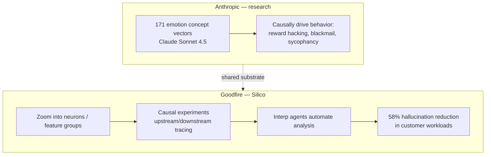
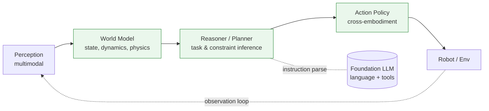
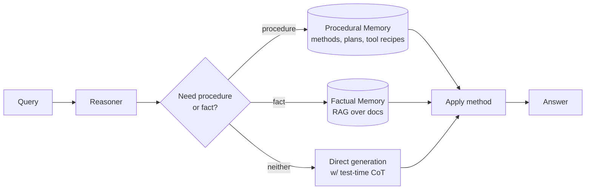
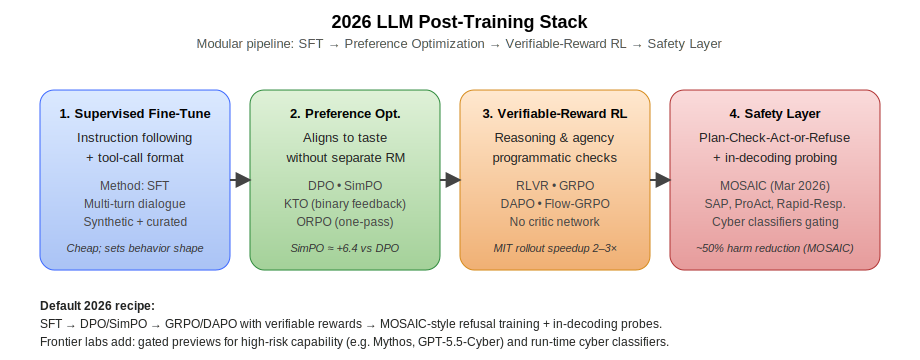
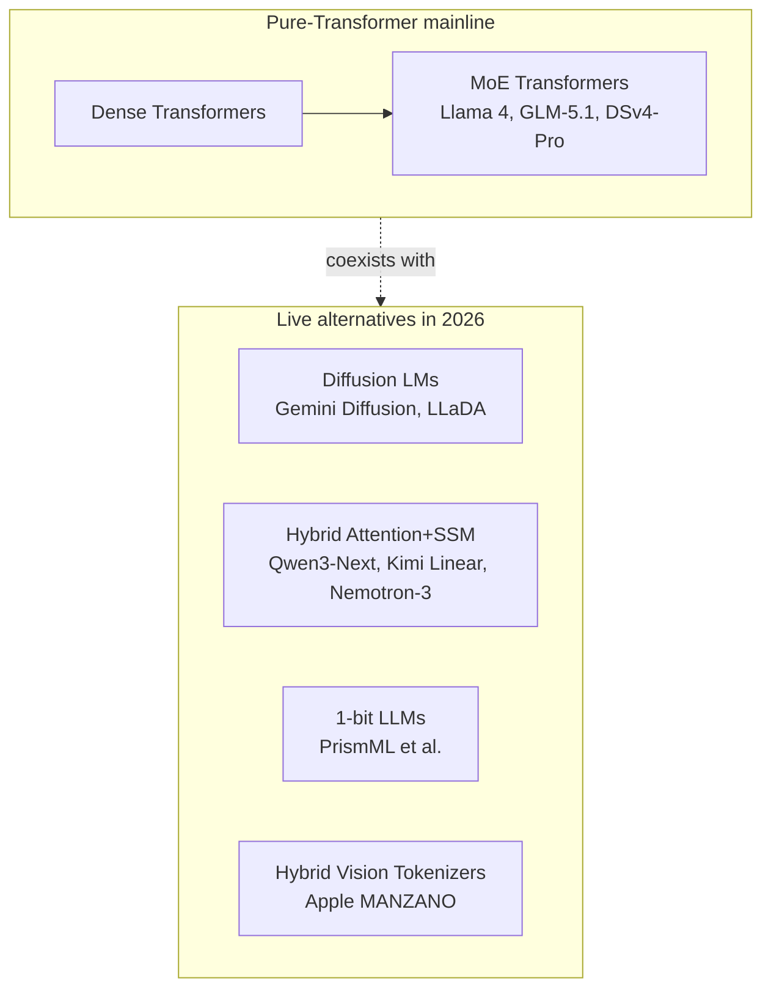
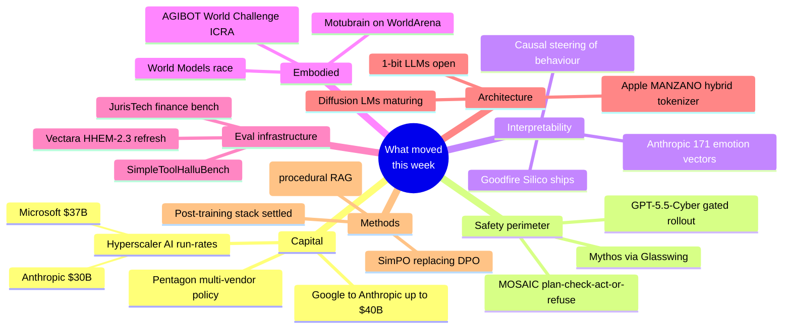

# LLM Updates — 2026-Apr-30

A second-pass refresh, written end-of-day Thursday April 30 (LA time), focused
on items that *moved this week* rather than re-litigating the broad April
release wave. Headlines: Goodfire's interpretability IDE shipped today, the
April 29 hyperscaler earnings repriced AI infrastructure spend, OpenAI's
GPT-5.5-Cyber announcement reframed the safety perimeter, ShengShu's Motubrain
landed as the first credible "world action model" benchmark leader, and
Anthropic's emotion-vector paper put functional affect on the interpretability
agenda. Three new hallucination benchmarks were stood up in the last fortnight.
Post-training has consolidated around a four-layer modular stack.

---

## 1. April 29 was an inflection day for AI infrastructure spend

The April 29 earnings cycle put concrete numbers behind what had been
narrative pressure all month. Four hyperscalers (Alphabet, Microsoft, Meta,
Amazon) reported simultaneously, and the AI line items dominated.

- **Microsoft AI revenue run-rate: $37B, up 123% YoY.** This is the first
  quarter the AI segment is large enough that Microsoft is breaking it out as
  a standalone disclosure.
- **Anthropic run-rate revenue surpassed $30B**, up from ~$9B at end-2025.
  This re-baselined the Google → Anthropic deal announced April 24.
- **Google → Anthropic up to $40B**: $10B immediate at a $350B valuation, a
  further $30B contingent on performance milestones, plus 5 GW of fresh
  Google Cloud capacity over five years.
- **OpenAI raised $122B during April** (covered in prior report); the
  Microsoft-OpenAI exclusivity arrangement was dissolved, and AWS Bedrock
  rolled out three OpenAI offerings within 24 hours including a co-built
  agent service.
- **Pentagon AI chief on April 28** confirmed expanded use of Gemini, with
  the explicit framing that "reliance on one model is never a good thing."

The structural read: *frontier-model vendors are now growing into hyperscaler
revenue scale*, and the major buyers (US government, large enterprise) are
explicitly multi-vendor. Single-vendor lock-in is being underwritten against,
not for.

```mermaid
flowchart LR
    GOOG[Alphabet] -- "$10B now / $30B contingent<br/>+ 5 GW compute" --> ANTH[Anthropic<br/>$30B run-rate]
    MSFT[Microsoft<br/>AI segment $37B run-rate<br/>+123% YoY] -. exclusivity dissolved .-> OAI[OpenAI<br/>$122B Apr raise]
    AWS[AWS Bedrock] -- "3 new OpenAI offerings<br/>incl. joint agent service" --> OAI
    DOD[US DoD / Pentagon] -- "expanded Gemini use<br/>'no single model'" --> GOOG
    DOD -. unblocked Apr ... --> ANTH
    classDef vendor fill:#e8f0ff,stroke:#3a66ff
    classDef buyer  fill:#fdf2e0,stroke:#d68a1a
    class GOOG,MSFT,OAI,ANTH vendor
    class AWS,DOD buyer
```

Sources:
- [Pentagon AI chief: DoD expanded Gemini use — CNBC](https://www.cnbc.com/2026/04/28/pentagon-ai-chief-confirms-work-with-google-after-anthropic-blacklist.html)
- [Google to invest up to $40B in Anthropic — TechCrunch](https://techcrunch.com/2026/04/24/google-to-invest-up-to-40b-in-anthropic-as-search-giant-spreads-its-ai-bets/)
- [Google up to $40B in Anthropic — CNBC](https://www.cnbc.com/2026/04/24/google-to-invest-up-to-40-billion-in-anthropic-as-search-giant-spreads-its-ai-bets.html)
- [Why this is a bargain for Google — Motley Fool](https://www.fool.com/investing/2026/04/27/google-screaming-bargain-anthropic-investment/)
- [Anthropic + Google + Broadcom partnership](https://www.anthropic.com/news/google-broadcom-partnership-compute)
- [LLM news April 2026 (hyperscaler earnings) — Fazm](https://fazm.ai/blog/llm-news-april-2026)

---

## 2. Interpretability ships as a product: Goodfire Silico (April 30)

The MIT Technology Review piece dropping today is the most important
interpretability story of the week. **Goodfire packaged its in-house mech
interp tooling as a product** — *Silico* — and is shipping it as an IDE for
Software 2.0: zoom into individual neurons or feature groups, run causal
experiments, trace upstream/downstream pathways, and (the new bit) automate
the heavy lifting with interpretability agents.

Why it matters:

- It is the first time mechanistic interpretability is being delivered as a
  developer-facing product, not a research artefact. *Debugging an LLM at the
  feature level* moves from "research problem" to "tool you can buy."
- Goodfire has cited a **58% hallucination reduction** in customer LLM
  workloads when interpretability output is used to guide further training —
  a defensible, training-loop-relevant claim, not a benchmark stunt.
- The company closed a **$150M Series B at a $1.25B valuation** to
  commercialize this. MIT Tech Review independently flagged mechanistic
  interpretability as one of its 10 Breakthrough Technologies of 2026.

This pairs with **Anthropic's April 2 paper** on emotion concept
representations (171 emotion vectors identified inside Claude Sonnet 4.5,
shown to *causally drive* behavior including reward hacking, blackmail, and
sycophancy when steered). Two sides of the same coin: Anthropic is showing
that internal representations of "soft" properties (affect, preference) are
real and measurable; Goodfire is shipping the surgery kit. Together they make
"the model is a black box" a much weaker claim than it was three months ago.



Sources:
- [Goodfire's Silico — MIT Technology Review (Apr 30)](https://www.technologyreview.com/2026/04/30/1136721/this-startups-new-mechanistic-interpretability-tool-lets-you-debug-llms/)
- [Goodfire AI homepage](https://www.goodfire.ai/)
- [Goodfire — Lightspeed announcement](https://lsvp.com/stories/goodfire-building-interpretable-ai/)
- [Anthropic — Emotion concepts and their function in a LLM](https://www.anthropic.com/research/emotion-concepts-function)
- [Emotion concepts paper — Transformer Circuits Thread](https://transformer-circuits.pub/2026/emotions/index.html)
- [arXiv: Emotion Concepts — 2604.07729](https://arxiv.org/html/2604.07729v1)
- [Behavioral impact of emotion-like mechanisms — InfoQ](https://www.infoq.com/news/2026/04/anthropic-paper-llms/)
- [Anthropic emotion vectors deep analysis — Pebblous](https://blog.pebblous.ai/report/anthropic-emotions-report/en/)
- [Anthropic interpretability research](https://www.anthropic.com/research/team/interpretability)

---

## 3. GPT-5.5-Cyber and the bifurcation of the safety perimeter

OpenAI's April 29 announcement of **GPT-5.5-Cyber**, a frontier cybersecurity
model rolled out to "critical cyber defenders" within days, makes 2026's
defensive posture explicit: *capability that is too dangerous for the open
API gets a different distribution channel*, not a different model. The same
pattern has crystallised across labs:

| Lab        | Public-tier high-cyber model     | Restricted-tier model       | Distribution control                      |
|------------|----------------------------------|------------------------------|--------------------------------------------|
| OpenAI     | GPT-5.5 / GPT-5.5 Pro            | **GPT-5.5-Cyber** (new)      | Vetted defender access, gov coordination   |
| Anthropic  | Claude Opus 4.7 (cyber classifiers) | **Claude Mythos** (gated)  | Project Glasswing partner gating           |
| Microsoft  | MAI suite (Foundry-side controls)| n/a (yet)                    | Foundry policy + tenant-level controls     |
| Google     | Gemini 3.1 Pro / Flash           | (no public cyber-tier yet)   | Vertex AI policy controls                  |

Two takeaways:

1. **The "one frontier model for everyone" era is over.** Frontier capability
   is now distributed through three concurrent channels: open API, gated
   preview, and verified-defender programs. Pricing, latency, and *who can
   call it* are now first-class deployment dimensions, not afterthoughts.
2. **Cyber is the canary capability.** It's the first domain where labs are
   willing to publicly say "this exists and you cannot have it." If the same
   pattern extends to bio and to long-horizon autonomous deception (as the
   Mythos messaging hints), the gated-preview channel becomes the default for
   the next capability tier rather than an exception.

Sources:
- [OpenAI to arm critical cyber defenders with frontier model — PYMNTS](https://www.pymnts.com/cybersecurity/2026/openai-will-arm-critical-cyber-defenders-with-frontier-model/)
- [AI news Apr 29–30 (GPT-5.5-Cyber) — devFlokers](https://www.devflokers.com/blog/ai-news-last-24-hours-april-29-30-2026-roundup)
- [Claude Opus 4.7 — Anthropic](https://www.anthropic.com/news/claude-opus-4-7)

---

## 4. Motubrain and the world-action-model benchmark

April 29 also produced the strongest piece of evidence yet for the
"embodied LLM" thesis being more than a roadmap claim. **ShengShu Technology
unveiled Motubrain**, a *World Action Model* — a single unified policy that
replaces task-specific stacks across cross-embodiment, multi-skill robotic
deployments.

Numbers worth registering:

- **63.77 EWM Score on WorldArena** — the leading number on the new
  embodied-world-model benchmark.
- **96.0 average on RoboTwin 2.0** across 50 predetermined tasks. **Only
  model above 95 in randomized environments**, where prior systems (incl.
  open-loop VLA stacks) collapse.
- Several robotics OEMs are already deploying it on real hardware in
  industrial, commercial, and home settings.

Context: April was the month world models *graduated*. Yann LeCun's AMI
Labs stood up, DeepMind released Genie 3, Fei-Fei Li's World Labs shipped
Marble, and NVIDIA's Cosmos crossed 2M downloads. The **AGIBOT World
Challenge at ICRA 2026** opened registration in March with explicit
"Reasoning-to-Action" and "World Model" tracks. Motubrain is the first
credible state-of-the-art on a benchmark that wasn't co-developed with the
model.



Sources:
- [ShengShu Motubrain — RoboticsTomorrow (Apr 29)](https://www.roboticstomorrow.com/news/2026/04/29/shengshu-technology-unveils-world-action-model-motubrain-one-brain-infinite-possibilities-for-robotic-intelligence/26497/)
- [AGIBOT World Challenge at ICRA 2026](https://www.agibot.com/article/231/detail/45.html)
- [World Models Race 2026 — Introl](https://introl.com/blog/world-models-race-agi-2026)
- [Niantic Spatial — World Models 2026](https://www.nianticspatial.com/blog/world-models-2026)
- [Embodied AI: From LLMs to World Models — arXiv](https://arxiv.org/html/2509.20021v1)

---

## 5. Three new hallucination benchmarks ship in two weeks

Hallucination evaluation is the area where the *measurement infrastructure*
moved most this month. Three benchmarks worth knowing landed inside two
weeks:

- **Vectara Hallucination Leaderboard refresh (Apr 28).** Now using HHEM-2.3
  (commercial) with HHEM-2.1-Open as the open-source variant. The headline:
  Ant Group's `finix_s1_32b` joined at **1.8% hallucination rate**, the first
  Chinese enterprise model to compete for the top spot on this board.
- **SimpleToolHalluBench (ICLR 2026).** A diagnostic benchmark for *agent*
  hallucinations specifically: does the agent refuse a task it cannot
  complete, or invent a tool call that doesn't exist? Most prior benchmarks
  measure factual hallucination on summaries; this one measures *operational*
  hallucination in tool use, which is where production agent regressions
  actually live.
- **JurisTech 2026 Hallucination Benchmark (Apr 15).** Tests Claude Opus,
  Gemini 3.1, GPT-5, GLM-5.1, Qwen 3.6, and Kimi K2.5 by injecting deliberate
  errors into financial documents and measuring catch rate — a domain-eval
  pattern that's likely to spread.

The conceptual shift: *hallucination is being decomposed into sub-types*
(factual, tool, citation, financial-document) with a benchmark per sub-type,
rather than tracked as a single rate. This is overdue and roughly mirrors how
"latency" decomposed into TTFT / inter-token / E2E once production deployments
got serious.

Sources:
- [Vectara Hallucination Leaderboard — GitHub](https://github.com/vectara/hallucination-leaderboard)
- [HalluLens — LLM Hallucination Benchmark — arXiv](https://arxiv.org/abs/2504.17550)
- [LLM Hallucination Statistics 2026 — sqmagazine](https://sqmagazine.co.uk/llm-hallucination-statistics/)
- [AI Hallucination Rates & Benchmarks 2026 — Suprmind](https://suprmind.ai/hub/ai-hallucination-rates-and-benchmarks/)
- [LLM Hallucination Rates 2026 — Modelslab](https://modelslab.com/blog/llm/llm-hallucination-rates-2026)
- [JurisTech 2026 Hallucination Benchmark](https://juristech.net/best-llm-tools-for-financial-analysis-2026/)
- [AI agent hallucination trap — Asanify (Apr 29)](https://asanify.com/blog/news/ai-agent-hallucination-april-29-2026/)

---

## 6. Reasoning Memory: the next axis after test-time compute

Test-time compute scaling was the dominant inference-side story of the
2025–early-2026 stretch — let the model think longer at inference and watch
benchmarks climb. Two new pieces of evidence say *the unit of scaling is
shifting*:

1. **"Test-Time Scaling Is Not Effective for Knowledge-Intensive Tasks Yet"**
   (Jan 2026, arXiv 2509.06861) — long reasoning chains help on math/code but
   *do not* help on knowledge-heavy queries. The reasoner can't grow what it
   doesn't already know.
2. **"Procedural Knowledge at Scale Improves Reasoning"** (Apr 2026, arXiv
   2604.01348) — introduces **Reasoning Memory**, a RAG framework that
   retrieves and reuses *procedural* knowledge (how to do a thing) rather
   than *factual* knowledge (what a thing is). The framing matters: it
   reframes RAG from "fetch a fact" to "fetch a method".
3. **"The Art of Scaling Test-Time Compute for LLMs"** (Dec 2025, arXiv
   2512.02008) — 30B+ tokens of test-time-scaling data across eight open
   models concludes: *no single TTS strategy dominates*, and optimal
   strategy is task- and budget-dependent.

Read together, these flip the operative question from "how much test-time
compute should I burn?" to "what kind of memory does my reasoner need to
draw on?" Stanford's AgentFlow finding from earlier in April (cooperating
modules with one trainable planner) and ICLR 2026's MemAgents workshop both
sit on the same trend line: **memory + procedural knowledge is the new
scaling axis**, complementary to (not a replacement for) longer reasoning
chains.



Sources:
- [Procedural Knowledge at Scale Improves Reasoning — arXiv 2604.01348](https://arxiv.org/abs/2604.01348)
- [The Art of Scaling Test-Time Compute — arXiv 2512.02008](https://arxiv.org/abs/2512.02008)
- [TTS not yet effective for knowledge tasks — arXiv 2509.06861](https://arxiv.org/abs/2509.06861)
- [Awesome Inference-Time Scaling — GitHub](https://github.com/ThreeSR/Awesome-Inference-Time-Scaling)
- [MemAgents workshop proposal — ICLR 2026](https://openreview.net/pdf?id=U51WxL382H)
- [MemoryBench: memory & continual learning eval — arXiv](https://arxiv.org/html/2510.17281v4)
- [Memory for Autonomous LLM Agents survey — arXiv 2603.07670](https://arxiv.org/html/2603.07670v1)

---

## 7. Post-training stack 2026: SFT → DPO/SimPO → GRPO/DAPO → MOSAIC

Post-training has settled. The "one giant RLHF run" era is over; the field
is converging on a four-layer modular pipeline.



What has actually changed in the last quarter:

- **SimPO is now beating DPO as the default preference-optimization step** —
  ~+6.4 on AlpacaEval 2 and +7.5 on Arena-Hard, no reference model required,
  no frozen-copy memory cost.
- **KTO** has displaced DPO for production teams whose feedback signal is
  thumbs-up / thumbs-down rather than pairwise comparisons. Cheap to collect,
  more robust to label noise.
- **GRPO** ate PPO for verifiable-reward RL on reasoning. Group-relative
  advantage estimation, no critic, lower variance. **Flow-GRPO** (Stanford,
  AgentFlow) is the multi-turn-credit-assignment variant.
- **MOSAIC** (Mar 2026) is the new entrant on the safety layer: agents
  trained with a "plan, check, then act *or refuse*" structure plus
  trajectory-level preference learning, reporting up to **50% reduction in
  harmful behavior** while preserving task completion.
- **RLVR / verifiable-rewards** is no longer experimental; if your reward
  signal can be checked programmatically (math, code, formal verification),
  this is now the default path, not preference data.

Pragmatic implication: small teams that can't afford a full preference-data
program can now do **SFT → SimPO/KTO → GRPO** with public datasets and reach
production-grade alignment. The cost barrier dropped significantly.

Sources:
- [Post-Training in 2026: GRPO, DAPO, RLVR & Beyond — llm-stats](https://llm-stats.com/blog/research/post-training-techniques-2026)
- [LLM alignment techniques: 4 post-training approaches — Snorkel AI](https://snorkel.ai/blog/llm-alignment-techniques-4-post-training-approaches/)
- [Alternatives to RLHF: DPO, RLAIF, GRPO — CBTW](https://cbtw.tech/insights/rlhf-alternatives-post-training-optimization)
- [RLHF, RLAIF, PPO, DPO and more — survey arXiv 2407.16216](https://arxiv.org/abs/2407.16216)
- [RLHF variants: DPO, RRHF, RLAIF — Turing Post](https://www.turingpost.com/p/rlhfvariants)
- [RLHF vs DPO patent analysis — PatSnap](https://www.patsnap.com/resources/blog/articles/rlhf-vs-dpo-in-llm-fine-tuning-60-patent-analysis-2/)

---

## 8. Architecture frontier: diffusion LMs, 1-bit weights, hybrid vision tokenizers

Architecture pluralism kept advancing on three fronts:

- **Diffusion language models** are no longer purely academic. **Gemini
  Diffusion** is now a shipped DeepMind model, and the open-source LLaDA
  family has moved beyond toy scale. Generation is parallel rather than
  autoregressive — the latency story is genuinely different (no per-token
  serial dependency) and the controllability story is materially better
  (bidirectional refinement). The unsolved problem is reasoning chain
  quality at low sampling-step counts; the gap to autoregressive on
  HLE/GPQA still favors AR.
- **1-bit LLMs (PrismML and others) opened-sourced in April.** Weight
  quantization to a single bit yields ~16× memory reduction. The accuracy
  hit at frontier scale is smaller than expected on benchmark eval; the open
  question is whether long-tail behaviors degrade in ways that single-eval
  scores miss.
- **Apple MANZANO** (ICLR 2026, Apple ML) — "A Simple and Scalable Unified
  Multimodal Model with a Hybrid Vision Tokenizer." The recipe: separate
  fast tokenizer for low-frequency vision content, slower one for
  high-frequency, both feeding the same LM. Reduces the
  multimodal-vs-text-only quality trade-off that has plagued unified
  multimodal models. Scales clean across model sizes — i.e., the hybrid
  tokenizer is not a low-end-only trick.
- **Hybrid attention/SSM** (Qwen3-Next, Kimi Linear, Nemotron-3, Jamba
  family) continues to ship. 2026's open-weight frontier increasingly
  *isn't* a pure Transformer.



Sources:
- [Gemini Diffusion — Google DeepMind](https://deepmind.google/models/gemini-diffusion/)
- [LLaDA — Large Language Diffusion Models](https://ml-gsai.github.io/LLaDA-demo/)
- [Awesome Diffusion Language Models survey](https://github.com/VILA-Lab/Awesome-DLMs)
- [Diffusion text generation Stack Overflow blog](https://stackoverflow.blog/2026/02/03/generating-text-with-diffusion-and-roi-with-llms/)
- [Apple ML at ICLR 2026 (MANZANO)](https://machinelearning.apple.com/research/iclr-2026)
- [Beyond LLMs and Transformers — Chojecki](https://pchojecki.medium.com/going-beyond-llms-transformers-39f3291ba9d8)
- [Best AI Models / 1-bit LLMs April 2026](https://medium.com/@sanjeevpatel3007/april-2026-ai-models-every-major-release-reviewed-6ea03d7bc0b7)
- [Mixture of Experts in LLMs — survey arXiv 2507.11181](https://arxiv.org/html/2507.11181v2)
- [Rise of MoE — Friendli AI](https://friendli.ai/blog/moe-models-comparison)

---

## 9. What this week tells us about the rest of 2026

Five compact takeaways, calibrated to the late-April signal:

1. **Multi-vendor is now the explicit default for serious buyers.** The
   Pentagon's "no single model is ever a good thing" is the policy
   articulation; AWS Bedrock distributing OpenAI offerings 24 hours after
   exclusivity dissolved is the commercial articulation. Architect
   *routing*, not picks.
2. **Frontier-cyber capability has its own distribution channel.** GPT-5.5-
   Cyber + Mythos confirm: the next capability tier above public-API will be
   restricted-access, not differently-named. Plan deployments accordingly.
3. **Interpretability is now a deployable engineering practice.** Goodfire
   Silico shipping today closes the loop from research to debugger.
   Anthropic's emotion vectors put causal evidence underneath the
   "internals are real" claim. Treat interp output as a debugging signal,
   not a research curiosity.
4. **Memory is the new scaling axis.** Procedural-knowledge retrieval,
   reasoning memory, AgentFlow-style modular agents, and ICLR's MemAgents
   workshop all point the same direction. Investments in memory
   infrastructure (vector + procedural + scratchpad) will out-pay
   investments in longer reasoning chains for many workloads.
5. **The post-training recipe is settled enough to teach.** SFT → SimPO/KTO
   → GRPO/DAPO → MOSAIC. A small competent team can now reach
   production-grade alignment without a frontier-lab budget. The bar for
   "shipping a credible specialised model" dropped this quarter.



---

*Generated 2026-04-30 (America/Los_Angeles, end-of-day). This refresh
deliberately focuses on items that moved in the final week of April and
items that re-frame, rather than re-state, the broader April release wave
covered in earlier passes. Benchmark numbers reflect provisional
late-April snapshots; vendor financial figures reflect Apr 29 disclosed
run-rates and may be restated on subsequent filings.*
