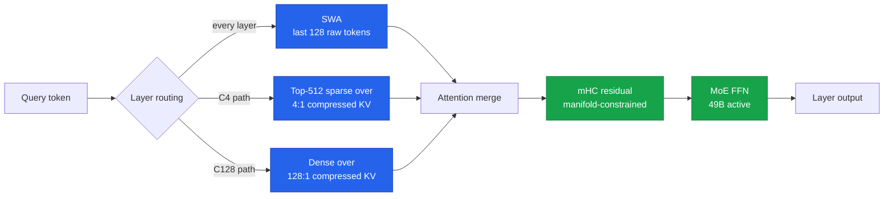
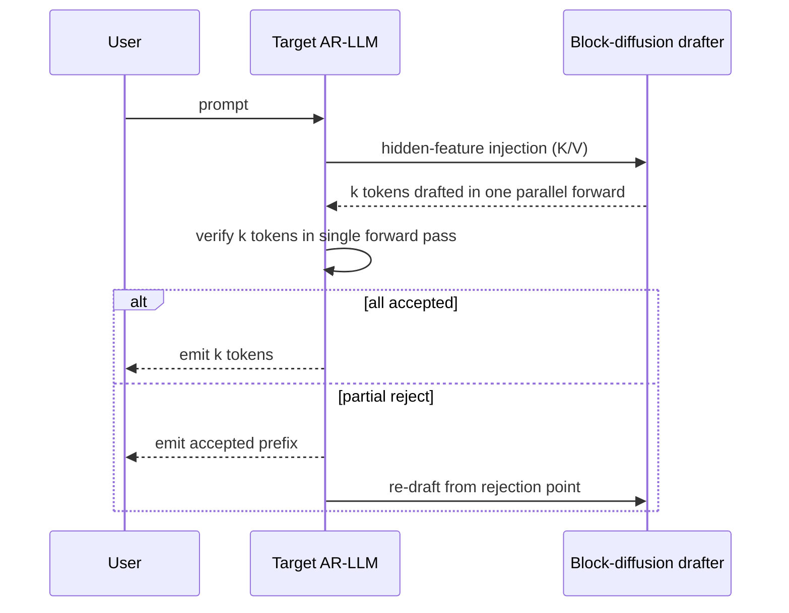
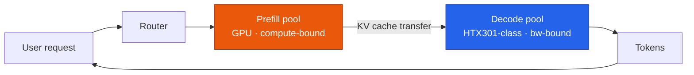
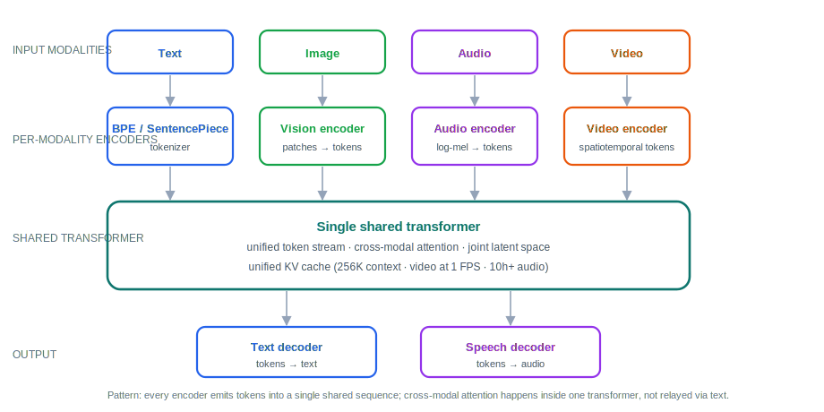
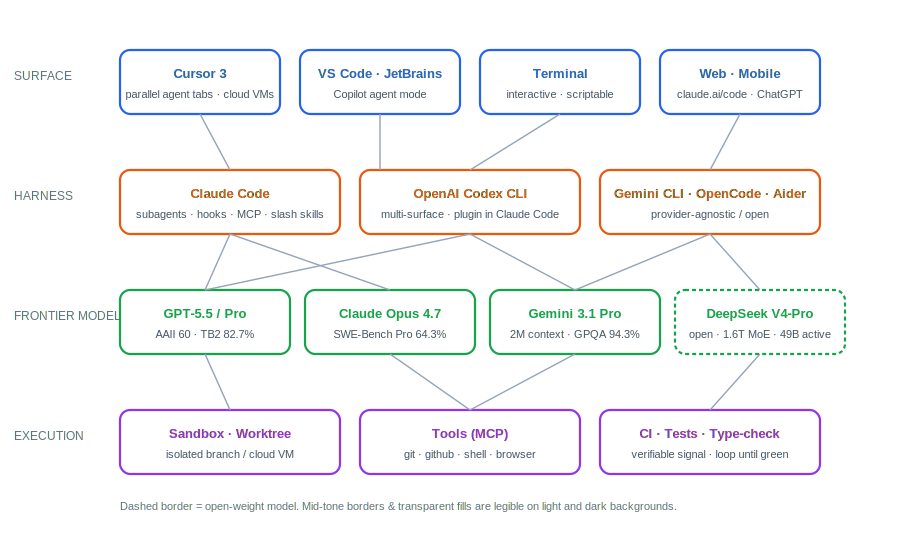
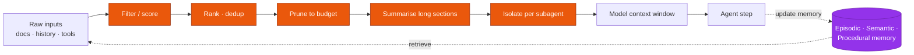
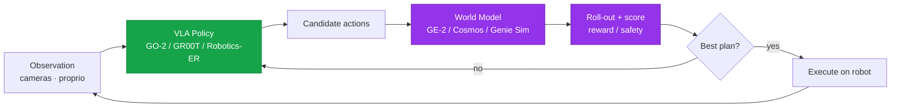
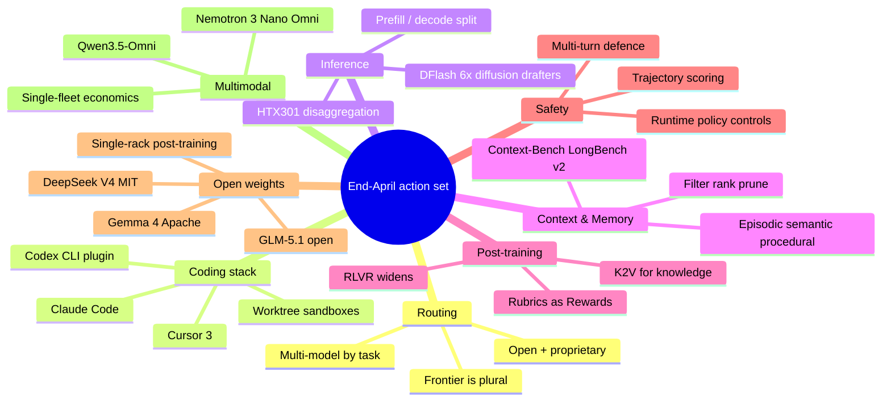

# LLM Updates — 2026-Apr-30

End-of-month consolidated brief, written Thursday April 30 (LA time). This
pass overwrites the earlier April 30 file with a refreshed read of the
state of the field at month-close. The headline thesis: April 2026 was
the month the **frontier became plural** (five labs ship credible
top-tier models, with one open-weight in the mix), the month the
**inference economy bifurcated** (decode-optimised silicon and diffusion
drafters arrived together), and the month **memory and context
engineering crystallised into a benchmarked production discipline**.

---

## 1. Snapshot: where the frontier sits at April 30

April produced four headline drops in a single window — GPT-5.5 (Apr
23–24), Claude Opus 4.7 (Apr 16), DeepSeek V4-Pro / V4-Flash (Apr 24),
GLM-5.1 open weights (Apr 7) — with Gemini 3.1 Pro continuing on a
rolling track. No single model wins everything, and the price column is
the cleanest read on which lab is willing to subsidise inference for
share.

| Model              | Released   | Headline strength                       | Key benchmark                  | API price (in / out, /M tok) |
|--------------------|------------|-----------------------------------------|--------------------------------|------------------------------|
| GPT-5.5 / Pro      | Apr 23–24  | Top overall · agent execution           | AAII 60 · Terminal-Bench 82.7% | $5 / $30                     |
| Claude Opus 4.7    | Apr 16     | Coding · long-horizon autonomy          | SWE-Bench Pro **64.3%**        | $5 / $25                     |
| Gemini 3.1 Pro     | rolling    | Cheap multimodal · 2M context           | GPQA Diamond **94.3%**         | $2 / $12                     |
| DeepSeek V4-Pro    | Apr 24     | Open-weight frontier · hybrid attention | competitive on math/code       | open weights (MIT)           |
| GLM-5.1 (open)     | Apr 7      | First open-weight #1 on SWE-Bench Pro   | SWE-Bench Pro 58.4% (9-day #1) | open weights                 |
| Claude Mythos      | gated      | Reasoning ceiling                       | HLE 64.7% · agentic blend 100  | restricted access            |

Two operational reads:

1. **Multi-vendor routing is the floor, not the ceiling.** GPT-5.5 leads
   the AAII composite; Opus 4.7 leads coding; Gemini 3.1 Pro is the
   price/multimodal play; DeepSeek V4-Pro is the open-weight option that
   actually competes on coding and math; Mythos is the gated capability
   ceiling. Pick the harness; route the model per task.
2. **Benchmark contamination is now a first-order problem.** OpenAI
   flagged training-data contamination on SWE-Bench Verified across all
   frontier models; SWE-Bench Pro is the de-facto successor and the
   numbers there are 20+ points lower for the same models — exactly the
   gap you'd expect when contamination drains.

Sources:
- [Introducing GPT-5.5 — OpenAI](https://openai.com/index/introducing-gpt-5-5/)
- [GPT-5.5 review — buildfastwithai](https://www.buildfastwithai.com/blogs/gpt-5-5-review-2026)
- [Claude Opus 4.7 — Anthropic](https://www.anthropic.com/news/claude-opus-4-7)
- [SWE-Bench Pro Leaderboard — Scale](https://labs.scale.com/leaderboard/swe_bench_pro_public)
- [Best AI Models April 2026 — buildfastwithai](https://www.buildfastwithai.com/blogs/best-ai-models-april-2026)
- [LLM Benchmarks April 2026 — llm-stats](https://llm-stats.com/benchmarks)
- [New AI Models April 2026 — WhatLLM](https://whatllm.org/blog/new-ai-models-april-2026)

---

## 2. DeepSeek V4-Pro: hybrid attention is the inference-side recipe of the year

DeepSeek-V4 dropped April 24 under MIT license — V4-Pro at 1.6T total /
49B active, V4-Flash at 284B total / 13B active. The weights matter, but
the **architecture matters more**. V4 is the cleanest demonstration to
date that an open lab can ship original inference-side innovation, not
just scale clones. Three things to internalise:

- **Hybrid attention (every layer).** Every layer combines **SWA**
  (sliding window over the last 128 raw tokens) with one of two compressed
  pathways: **C4** (top-512 sparse attention over a 4:1-compressed KV
  cache) or **C128** (dense attention over a 128:1-compressed KV cache).
  CSA + DSA + HCA are the implementation pieces. At 1M context, V4-Pro
  uses **27% of single-token inference FLOPs and 10% of the KV cache** of
  V3.2.
- **Manifold-Constrained Hyper-Connections (mHC).** Replaces vanilla
  residual connections with a constrained hyper-connection that improves
  signal-propagation stability across very deep stacks without the
  expressivity cost of pure normalisation tricks.
- **Muon optimizer at 33T-token scale.** Faster convergence and better
  training stability than AdamW; V4-Pro is the first
  trillion-token-class run to publicly use Muon end-to-end.

The strategic read: V3 → V4 narrowed the hardware-efficiency gap with
proprietary frontier labs. The Muon + hybrid-attention combination is
reproducible by any serious lab; expect copies inside Qwen, GLM, MiniMax,
Kimi within a quarter.

Sources:
- [DeepSeek-V4-Pro on Hugging Face](https://huggingface.co/deepseek-ai/DeepSeek-V4-Pro)
- [DeepSeek V4 Preview — DeepSeek API Docs](https://api-docs.deepseek.com/news/news260424)
- [Inside DeepSeek V4: Hybrid Attention — dasroot](https://dasroot.net/posts/2026/04/deepseek-v4-hybrid-attention-massive-contexts/)
- [DeepSeek V4 Day 0 — LMSYS](https://www.lmsys.org/blog/2026-04-25-deepseek-v4/)
- [Why DeepSeek's V4 matters — MIT Technology Review](https://www.technologyreview.com/2026/04/24/1136422/why-deepseeks-v4-matters/)
- [DeepSeek V4 model card (PDF)](https://fe-static.deepseek.com/chat/transparency/deepseek-V4-model-card-EN.pdf)

---

## 3. DFlash: diffusion-as-drafter goes mainstream

The diffusion-LM thread has been simmering since 2024. April was the
month it crossed the inference-economics threshold. DFlash — published
February 2026, viral demo April 7, ported to Qwen3.6-27B late April —
delivers **>6× lossless acceleration** versus standard autoregressive
decoding and **~2.5× over EAGLE-3**, the prior speculative-decoding
state-of-the-art.

The mechanism is the right one to study: instead of asking a tiny
diffusion model to reason from scratch, **the drafter is conditioned on
deep features extracted from the target model**. Hidden features from
uniformly-sampled target layers are projected and injected directly into
every draft layer's K/V projections. The drafter inherits the target's
deep reasoning and contributes parallel speed.

Three companion threads landed alongside it: **DiffuSpec** (training-free
diffusion drafter, ~3× speedup), **Self-Speculative Decoding for
Diffusion LLMs** (single model drafts and verifies, up to 3.46× on
LLaDA / Dream), and **Speculative Diffusion Decoding** (NAACL 2025,
deployed widely in April, up to 7.2× speedup vs standard generation).

Why this matters operationally: the marginal cost of an additional
inference token is dropping again, after a year of being roughly flat.
For agentic workloads (long generations, structured outputs, tool calls)
the speedup compounds. Expect DFlash-style stacks in production at
hyperscalers within two quarters.

Sources:
- [DFlash: Block Diffusion for Flash Speculative Decoding — arXiv](https://arxiv.org/html/2602.06036v1)
- [DFlash on GPU Cloud — Spheron](https://www.spheron.network/blog/dflash-block-diffusion-speculative-decoding-gpu-cloud/)
- [DFlash Block Diffusion 6x — RITS / NYU Shanghai](https://rits.shanghai.nyu.edu/ai/dflash-block-diffusion-delivers-6x-faster-llm-inference/)
- [Luce DFlash on Qwen3.6-27B — RITS](https://rits.shanghai.nyu.edu/ai/luce-dflash-brings-2x-speculative-decoding-to-qwen3-6-27b-on-a-single-rtx-3090/)
- [Self-Speculative Decoding for Diffusion LLMs — OpenReview](https://openreview.net/pdf?id=rKJ7A30lQQ)
- [DiffuSpec — OpenReview](https://openreview.net/forum?id=u2pAPZZCmN)
- [SpecDiff-2 — arXiv 2511.00606](https://arxiv.org/abs/2511.00606)

---

## 4. Inference economy bifurcates: prefill vs decode hardware

April was also the month the prefill/decode split moved from internal
hyperscaler architecture to a buyable enterprise product. **Skymizer
HTX301** (Apr 23) ships a PCIe card purpose-built for **decode**, paired
with the **HyperThought** software layer; existing GPUs continue to
handle **prefill**. The pitch is running 700B-parameter models on a
single PCIe card without a cluster.

The reason this works as an architectural primitive:

- **Prefill** processes the input prompt — it is *compute-bound*, heavy
  matmul, embarrassingly parallel — exactly what GPUs were designed for.
- **Decode** generates one token at a time — it is
  *memory-bandwidth-bound*; the model has to stream from HBM for every
  token, and almost no FLOPs go to waste.

A single accelerator that's good at both is a compromise. Disaggregating
them lets you scale the two pools independently against your real
workload mix.

This is consistent with how DeepMind, Together, and Anthropic have
architected inference fleets internally; the new bit is the recipe is
shipping as a product, not a paper. Combined with diffusion drafters
(§3), the inference cost curve is bending again.

Sources:
- [Skymizer HTX301 / HyperThought — Manila Times](https://www.manilatimes.net/2026/04/23/tmt-newswire/pr-newswire/skymizer-taiwan-inc-unveils-breakthrough-architecture-enabling-ultra-large-llm-inference-on-a-single-card/2326985)
- [LLM inference disaggregation primer — NVIDIA](https://developer.nvidia.com/blog/applying-mixture-of-experts-in-llm-architectures/)

---

## 5. The omni-modal turn: one transformer for text, image, audio, video

Multimodal in April stopped meaning "vision tower bolted to a text LM"
and started meaning **a single transformer trained from scratch on mixed
modalities**. Two reference points:

- **Qwen3.5-Omni (Alibaba).** Native Thinker-Talker architecture, 256K
  context, processes 10+ hours of audio and 400+ seconds of 720p video at
  1 FPS in a single computational pipeline. Open weights.
- **NVIDIA Nemotron 3 Nano Omni.** A 30B hybrid MoE that natively takes
  text, image, video, and audio inputs and maintains a unified multimodal
  context across agent loops — built explicitly for multimodal agent
  reasoning rather than per-modality tasks.

The architectural pattern across the omni-modal generation:

Why this shape wins: every modality-specific encoder produces tokens that
flow into a single shared transformer with a unified KV cache. The
agent's *reasoning* is genuinely cross-modal — it can attend over a
video frame and an audio clip in the same step — rather than relayed
through a text bottleneck. The pricing implication is the same as on the
text side: a single fleet serves every modality, so the marginal cost of
adding modalities to a workflow drops sharply.

Sources:
- [Qwen3.5-Omni release — MarkTechPost](https://www.marktechpost.com/2026/03/30/alibaba-qwen-team-releases-qwen3-5-omni-a-native-multimodal-model-for-text-audio-video-and-realtime-interaction/)
- [Qwen3-Omni on GitHub](https://github.com/QwenLM/Qwen3-Omni)
- [Nemotron 3 Nano Omni — NVIDIA Developer](https://developer.nvidia.com/blog/nvidia-nemotron-3-nano-omni-powers-multimodal-agent-reasoning-in-a-single-efficient-open-model/)
- [Omni-LLMs: Unified Multimodal Transformers — Emergent Mind](https://www.emergentmind.com/topics/omni-large-language-models-omni-llms)

---

## 6. The coding harness has converged into one stack

The first week of April broke the wall between coding agents. Cursor 3
shipped parallel agent tabs, isolated cloud VMs, and `/worktree` for
branch isolation. OpenAI published an official Codex plugin that runs
*inside* Anthropic's Claude Code. Early adopters now run all three
together. The differentiator is no longer *what* the agent can do — it's
*where* you prefer to sit.

The picture below is the industry-wide stack as of end-April. The four
layers (surface → harness → model → execution) are now interchangeable
along each row, and most production teams are mixing across rows.

Pragmatic implications:

- **Pick the harness for the hooks, not the brand.** Claude Code, Codex
  CLI, and Aider all expose comparable subagent / MCP / hook surfaces.
  The differentiation is the slash-skill / hook ecosystem around each.
- **Pick the model per task, not per harness.** The dominant end-April
  workflow runs Opus 4.7 for refactor + long-horizon coding, GPT-5.5 for
  agentic execution and terminal work, Gemini 3.1 Pro for cheap
  multimodal prep, DeepSeek V4-Pro for offline / private / air-gapped
  work.
- **Sandbox is the layer that determines blast radius.** Cursor's cloud
  VMs and Claude Code's worktree-per-agent are the two patterns that
  scaled. Both isolate destructive operations from the user's working
  tree — the right default for parallel agents.

Sources:
- [Cursor, Claude Code, Codex merging — The New Stack](https://thenewstack.io/ai-coding-tool-stack/)
- [AI Coding Assistants April 2026 — DigitalApplied](https://www.digitalapplied.com/blog/ai-coding-assistants-april-2026-cursor-copilot-claude)
- [Best AI Coding Agents 2026 — MightyBot](https://mightybot.ai/blog/coding-ai-agents-for-accelerating-engineering-workflows/)
- [Best LLM for Coding 2026 — WhatLLM](https://whatllm.org/best-llm-for-coding)
- [Terminal-Bench Hard — Artificial Analysis](https://artificialanalysis.ai/evaluations/terminalbench-hard)

---

## 7. Memory and context engineering crystallise into a discipline

"Context engineering" used to be a slack-channel term. As of April it has
its own benchmark family, its own production literature, and a sized
market ($6.27B in 2026, projected $28.45B by 2030 at 35% CAGR per Mem0's
state-of-the-field). Three pieces of furniture to know:

- **Multi-layer memory architectures are now the default.** Episodic
  memory (interaction history), semantic memory (structured facts about
  users / entities / preferences), and procedural memory (learned
  workflows). LinkedIn's Cognitive Memory Agent and Mem0's stack are the
  reference implementations.
- **Selective memory beats full-context for production economics.**
  Mem0's selective pipeline takes a 6-percentage-point accuracy hit
  versus full-context in exchange for **91% lower p95 latency** (1.44s
  vs 17.12s) and **90% fewer tokens**. The graph variant Mem0g closes
  the accuracy gap to <5 points at 2.59s p95.
- **Benchmarks finally exist.** Context-Bench (Letta) for agent
  multi-step retrieval, LongBench v2 for real-world long-context work,
  LV-Eval with confusing-fact insertion to penalise pattern-matching.
  Even frontier models cap around 74% on Context-Bench — meaning roughly
  1-in-4 multi-step lookups still drift or lose state.

Conceptual shift: long context is not the same as good context. The
working hypothesis across production teams is that **filter, rank,
prune, summarise, isolate** are first-class operations, not preprocessing
tricks. Anthropic's own research has flagged that contexts above 100K
tokens routinely *degrade* reasoning quality — bigger windows are not
free.

Sources:
- [State of AI Agent Memory 2026 — Mem0](https://mem0.ai/blog/state-of-ai-agent-memory-2026)
- [Context Engineering — Weaviate](https://weaviate.io/blog/context-engineering)
- [LinkedIn Cognitive Memory Agent — InfoQ](https://www.infoq.com/news/2026/04/linkedin-cognitive-memory-agent/)
- [ICLR 2026 MemAgents Workshop](https://iclr.cc/virtual/2026/workshop/10000792)
- [Context-Bench — Letta](https://www.letta.com/blog/context-bench)
- [LongBench v2](https://longbench2.github.io/)

---

## 8. RLVR widens its frontier: rubrics, agents, knowledge

Reinforcement Learning with Verifiable Rewards has been the default
post-training recipe for math/code/formal-proof since DeepSeek-R1. April
2026 produced three shifts that broaden the recipe out of the
verifier-only domains:

- **Rubrics as Rewards (RaR).** Extends RLVR beyond automatically
  verifiable domains by using *rubric-based* feedback — a structured
  checklist scored by a judge model. Bridges pure-verifier domains
  (math) and judgment-heavy domains (writing, diagnosis, design review).
- **Agentic RL formalisation.** "The Landscape of Agentic Reinforcement
  Learning for LLMs" (updated Apr 17) reframes the problem cleanly:
  agentic RL replaces the degenerate single-step MDPs of classic LLM-RL
  with **temporally extended, partially observable MDPs**. Credit
  assignment over multi-step trajectories is the central unsolved
  problem.
- **Knowledge-to-Verification (K2V).** Closes the gap between
  knowledge-heavy queries and verifiable rewards by automatically
  extracting verifiable sub-claims from a knowledge-intensive answer,
  then verifying each sub-claim against retrieval. Fixes the "test-time
  scaling doesn't help on knowledge tasks" failure mode flagged earlier
  this year.

The strategic read: RLVR is no longer a math/code-only technique. The
methods to make rubrics and retrieval-checkable claims into reliable
reward signals are now in arXiv-paper-shape, which means production
teams can ship them this quarter.

Sources:
- [Rubrics as Rewards — OpenReview](https://openreview.net/forum?id=c1bTcrDmt4)
- [The Landscape of Agentic RL for LLMs — arXiv 2509.02547](https://arxiv.org/abs/2509.02547)
- [Knowledge-to-Verification — OpenReview](https://openreview.net/forum?id=EVS7SeKBqI)
- [RLVR explained — Promptfoo](https://www.promptfoo.dev/blog/rlvr-explained/)
- [awesome-RLVR — GitHub](https://github.com/opendilab/awesome-RLVR)

---

## 9. Adversarial robustness: reasoning models as autonomous attackers

The most uncomfortable safety result of April: a **Nature
Communications** paper demonstrating that four open reasoning models
(DeepSeek-R1, Gemini 2.5 Flash, Grok 3 Mini, Qwen3 235B) used as
**autonomous adversary agents** against nine deployed targets achieved an
aggregate **97.14% jailbreak success rate**.

Two qualifiers worth keeping in mind:

- Claude 4 Sonnet was the most resistant single target — it received the
  highest harm score in only **2.86%** of trials.
- The attack pattern with the highest real-world success is **gradual
  multi-turn escalation (Crescendo)**: each step appears benign in
  isolation, with the harmful payload assembled across the conversation.
  Single-prompt classifiers miss this entirely.

Implication for deployed systems: classifier defences that score each
prompt independently miss the attack. Effective defences need to score
the *trajectory* — accumulating concern as a conversation drifts toward
restricted capability — and combine model-level safety training with
runtime controls (policy engines, tool authorisation, behavioural
monitoring). The redteams.ai write-up frames it bluntly: model-level
safety is a useful layer but not a reliable defence.

Sources:
- [Large reasoning models as autonomous jailbreak agents — Nature Communications](https://www.nature.com/articles/s41467-026-69010-1)
- [Same paper, PMC mirror](https://pmc.ncbi.nlm.nih.gov/articles/PMC12881495/)
- [LLM Jailbreaking in 2026 — redteams.ai](https://redteams.ai/blog/llm-jailbreaking-2026)
- [When models outthink their safety — arXiv 2510.21285](https://arxiv.org/html/2510.21285v4)
- [AI Jailbreak Techniques 2026 — 15 Research Lab](https://www.15researchlab.com/blog/ai-jailbreak-techniques-2026/)

---

## 10. The open-weight wave — five major drops in three weeks

April's open-weight tempo was unusual even by 2026 standards.

| Date    | Model                 | Lab           | Notable                                              |
|---------|-----------------------|---------------|------------------------------------------------------|
| Apr 2   | Gemma 4 (4 variants)  | Google DM     | Apache 2.0 · 26B MoE · 14 GB · 85 tok/s consumer    |
| Apr 7   | GLM-5.1 open weights  | Z.ai          | 744B total · first open-weight #1 on SWE-Bench Pro  |
| Apr 16  | Qwen 3.6-35B-A3B      | Alibaba       | A3B = 3B active · efficiency play                   |
| Apr 23  | DeepSeek V4-Pro/Flash | DeepSeek      | 1.6T MoE · hybrid attention · MIT                   |
| Apr 23  | MiniMax M2.7 weights  | MiniMax       | competitive on coding/agentic                        |

The benchmark gap between best open-weight and best proprietary on
enterprise-relevant evaluations has narrowed to single digits. Three
operational consequences:

- **Air-gapped deployments** finally have a credible frontier-grade
  option (DeepSeek V4-Pro under MIT).
- **Fine-tuning economics** flip: SFT / SimPO / GRPO over a Gemma 4 or
  Qwen 3.6 starting point reaches production quality on a single-rack
  budget. The frontier-lab pretraining cost is no longer the bottleneck;
  the post-training pipeline is.
- **Hardware procurement** rebalances toward inference (HTX301-style)
  and away from training-only clusters.

Sources:
- [New Open Source LLM Releases April 2026 — Fazm](https://fazm.ai/blog/new-open-source-llm-releases-april-2026)
- [Open-source LLM leaderboard 2026 — Vellum](https://www.vellum.ai/open-llm-leaderboard)
- [Best Open-Source SLMs 2026 — BentoML](https://www.bentoml.com/blog/the-best-open-source-small-language-models)

---

## 11. Embodied AI: VLA + world model becomes the dominant 2026 robotics stack

April locked in the **VLA + world model** combination as the dominant
robotics recipe. The shape: a Vision-Language-Action policy generates
short-horizon actions, a learned world model rolls them forward in
simulation for reward / safety scoring, and a planner picks the best
plan to execute.

- **AGIBOT GO-2 + GE-2 (Apr 17).** GO-2 is the ViLLA (Vision-Language-
  Latent-Action) embodied foundation model, with Action Chain-of-Thought
  bridging plan and execution. GE-2 is the *world action model* — fast
  interactive virtual worlds where GO-2's plans get rolled out for
  evaluation. Genie Sim 3.0 generates digital twins from natural-language
  descriptions for sim-to-real transfer.
- **Gemini Robotics-ER 1.6 (Apr 14).** DeepMind's spatial-reasoning
  model, with new instrument-reading capability developed with Boston
  Dynamics (Spot can now read analog gauges).
- **NVIDIA GR00T N1.7 Early Access (Apr 17).** A 3B-parameter open VLA
  built on a Cosmos-Reason2-2B backbone with a 32-layer DiT for low-level
  motor control. The Cosmos world-models library crossed 2M downloads in
  April.

The pattern recurs across labs: a policy fast enough to run on the
robot, paired with a world model accurate enough to use for *evaluation*
rather than execution. The world model is not a substitute for the real
world — it's a cheap simulator that lets you reject bad plans without
putting the robot at risk.

Sources:
- [AGIBOT GO-2 / GE-2 / Genie Sim 3.0 — PRNewswire](https://www.prnewswire.com/news-releases/agibot-unveils-new-generation-of-embodied-ai-robots-and-models-accelerating-real-world-deployment-of-physical-ai-302746174.html)
- [Gemini Robotics-ER 1.6 — winbuzzer](https://winbuzzer.com/2026/04/16/google-deepmind-gemini-robotics-er-1-6-autonomous-industrial-inspections-xcxwbn/)
- [NVIDIA Physical AI for National Robotics Week](https://blogs.nvidia.com/blog/national-robotics-week-2026/)
- [Top 10 Physical AI Models 2026 — MarkTechPost](https://www.marktechpost.com/2026/04/28/top-10-physical-ai-models-powering-real-world-robots-in-2026/)

---

## 12. Small language models: edge-grade is now production-grade

While the frontier got plural, the small-model floor moved up sharply.
Phi-4, Gemma 3, Llama 3.3, and Qwen 3 variants under 10B params now
deliver 80–90% of GPT-4-class quality on focused tasks at a fraction of
the cost, on a single GPU (A10G / L4 / RTX 4090) or even on-device.

What's actually shipping in production at the SLM tier:

- **Grouped query attention + RoPE + GGUF quantisation** as the standard
  efficiency stack for edge inference. Combined, they shrink KV-cache
  pressure, cut model size 3–4× with minimal accuracy loss, and run on
  consumer hardware.
- **Distilled / synthetic-data SFT** as the dominant training recipe at
  the SLM tier — Phi-4 in particular is the canonical example of a small
  model trained on tightly curated synthetic data outperforming much
  larger models on focused benchmarks.
- **Ollama / llama.cpp deployment patterns** for offline / private
  workflows. The "small model on the laptop, frontier model on the API
  for hard cases" pattern is now mainstream rather than experimental.

The procurement read: for any workflow where 80–90% of GPT-4 quality is
sufficient, the right answer is no longer "use the cheapest API". The
right answer is now "self-host an SLM and route to the frontier on
escalation."

Sources:
- [Top 10 Small Language Models 2026 — Intuz](https://www.intuz.com/blog/best-small-language-models)
- [SLM Complete Guide 2026 — Calmops](https://calmops.com/ai/small-language-models-slm-complete-guide-2026/)
- [Phi-4 vs Gemma 3 vs Llama 3.3 — Meta-Intelligence](https://www.meta-intelligence.tech/en/insight-slm-enterprise)
- [Best Open-Source SLMs 2026 — BentoML](https://www.bentoml.com/blog/the-best-open-source-small-language-models)
- [Best Small AI Models with Ollama 2026 — Local AI Master](https://localaimaster.com/blog/small-language-models-guide-2026)

---

## 13. End-of-month synthesis: what to act on

Compact summary of what April moved, calibrated for an engineering team
planning Q3:

1. **Treat model selection as a router problem.** The frontier is plural
   — GPT-5.5 / Opus 4.7 / Gemini 3.1 Pro / DeepSeek V4-Pro / GLM-5.1 /
   Mythos each win different rows. Build the router before you commit to
   any single vendor.
2. **Adopt the converged coding harness, not a single tool.** Cursor 3
   for IDE, Claude Code or Codex CLI for terminal, MCP for tools,
   isolated sandboxes for execution. The pieces are interoperable now.
3. **Plan for disaggregated inference.** If you serve at scale, the
   prefill/decode split (HTX301 pattern) plus diffusion drafters
   (DFlash) are where the next 2–6× cost-per-token improvement comes
   from.
4. **Treat memory and context as infrastructure, not preprocessing.**
   Filter / rank / prune / summarise / isolate, and architect episodic /
   semantic / procedural memory layers explicitly. Long-context window
   size is necessary but not sufficient.
5. **Push RLVR beyond math/code.** Rubrics-as-Rewards and K2V make
   verifier-style training tractable in domains you previously couldn't
   touch. Pilot one judgment-heavy workflow this quarter.
6. **Score conversations, not prompts.** The 97.14% multi-turn jailbreak
   result raises the safety floor — trajectory-level scoring + runtime
   policy controls are now the minimum viable defence.
7. **Update procurement assumptions for open weights.** With DeepSeek V4
   under MIT, Gemma 4 under Apache, and GLM-5.1 open, the "open is two
   generations behind" assumption is wrong for many workloads. Re-run
   the build-vs-buy math.
8. **Default to omni-modal where you have multimodal needs.** Single-
   transformer omni models (Qwen3.5-Omni, Nemotron 3 Nano Omni) collapse
   the per-modality fleet into one — the right architecture if any of
   your workflows touch more than one modality.

---

*Generated 2026-04-30 (America/Los_Angeles). This is an end-of-month
consolidated brief, written to be self-contained — pricing and benchmark
numbers reflect end-of-day April 30 snapshots and may be restated as
labs publish system cards. Diagrams are Mermaid (theme-adaptive) and
SVG with stroke-and-text colours chosen to render legibly in both light
and dark modes.*
