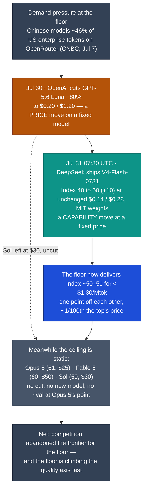

# LLM Updates — 2026-Aug-03

Monday brief, written Mon Aug 3 (Los Angeles time). Friday's brief (Jul-31) closed with
one lead question in **Watch next**: **"Does the price war climb from the floor to the
frontier?"** — after OpenAI cut GPT-5.6 Luna −80% on Jul 30 but left its flagship Sol at
$30, and Claude Opus 5's Index-61-at-$25 point stayed unanswered. The weekend answered it,
and the answer is **no — the war dug in harder at the floor, and it stopped being only
about price.**

The single fact that matters this window: **within hours of OpenAI's Luna cut, DeepSeek
answered — not with a matching discount but with a smarter model at the same rock-bottom
price.** On **Jul 31 at 07:30 UTC**, DeepSeek published **DeepSeek-V4-Flash-0731** to
Hugging Face under an **MIT license**, scoring **50 on the Artificial Analysis Intelligence
Index** — **+10 over the previous V4-Flash**, now **one single point behind GPT-5.6 Luna
(51)** — while holding its price at **$0.14 / $0.28 per Mtok**, roughly **60% cheaper per
task** than Luna even after Luna's cut. So the two moves that bracket this window — OpenAI
dropping Luna's sticker (Jul 30) and DeepSeek raising the floor's *intelligence* (Jul 31) —
are the same fight from two directions: the cheap tier is converging on frontier quality
for a fraction of the price. Meanwhile the top of the board — **Opus 5 at 61, $25** — sits
untouched, uncut, and still with no rival at its point. Nobody is fighting at the ceiling.

This report advances only what is **new since Jul-31.** It does **not** re-derive the Luna
−80% / Terra −20% cut and its recursive-self-improvement funding rationale (Jul-31 §1), the
ExploitGym incident / Kill Switch Act / Pacing-the-Frontier endorsement (Jul-31 §2), the AA
Index v4.1 agentic reweighting (Jul-31 §3), the Opus 5 launch and "top quality at mid price"
reshuffle (Jul-25 §1–§3), the Kimi K3 weight drop and hardware floor (Jul-30 §1–§4), or the
Fable 5 tier split (Jul-20 §1) — those are unchanged (§3).

![Scatter plot of large language model intelligence versus API output price on a logarithmic price axis as of August 3 2026. The cheap floor tier is converging on frontier quality: DeepSeek V4-Flash-0731 scores 50 on the Artificial Analysis Intelligence Index at 0.28 dollars per million output tokens, and GPT-5.6 Luna scores 51 at 1.20 dollars after an 80 percent cut, both far cheaper than the top. Kimi K3 open weights scores 57 at 15 dollars. The static, expensive top is Claude Opus 5 at index 61 for 25 dollars, GPT-5.6 Sol at index 59 for 30 dollars, and Claude Fable 5 at index 60 for 50 dollars. The competitive action is at the low-price floor while the top of the leaderboard is unchanged and unanswered.](floor_intelligence_war.svg)

---

## 1. DeepSeek answers the Luna cut in under a day — with intelligence, not price (Jul 31)

The Jul-31 brief documented OpenAI cutting GPT-5.6 Luna's price 80% (to $0.20 / $1.20) on
Jul 30, explicitly to undercut cheap Chinese models on input cost. **DeepSeek's counter
landed the next morning** — and it reframes the whole contest.

At **07:30 UTC on Jul 31**, DeepSeek published **DeepSeek-V4-Flash-0731** to Hugging Face
(MIT-licensed, with a technical report), superseding the earlier V4-Flash preview
checkpoint. It is the **same 284B-parameter backbone, re-post-trained for agentic work**,
and the independent numbers are the story:

| Model (max effort) | Intelligence Index | Output $/Mtok | Note |
|---|---|---|---|
| **DeepSeek V4-Flash-0731** | **50** (was 40; **+10**) | **$0.28** ($0.14 in) | MIT weights, Jul 31 |
| GPT-5.6 Luna | 51 | $1.20 ($0.20 in) | after Jul 30 −80% cut |
| DeepSeek V4 Pro | 44 | $0.87 | prior floor reference |

Three things make this more than a routine point release:

- **The gap to Luna is now one point — at ~1/4 the output price.** DeepSeek's own API puts
  V4-Flash-0731's **cost per task ~60% below GPT-5.6 Luna's**, a model of essentially equal
  measured intelligence. Artificial Analysis described the result as a **"big spike on the
  Pareto frontier"** — a new best-in-class point for intelligence-per-dollar at the bottom of
  the market.
- **The contest changed shape.** OpenAI's move (Jul 30) was a **price** cut on a fixed model.
  DeepSeek's move (Jul 31) was a **capability** jump at a fixed (already-lowest) price. So the
  floor war is no longer "who is cheapest" — it is now **"who delivers frontier-adjacent
  quality for pennies,"** and the cheap tier is closing the *quality* gap, not just the price
  gap.
- **The weights are open (MIT) and the model trended #1 on Hugging Face.** Unlike Kimi K3's
  custom, gated license (Jul-31 §4), V4-Flash-0731 ships under a clean MIT license with day-0
  community GGUF quants (unsloth, bullerwins) — genuinely self-hostable at 284B, not a
  datacenter-only release.

**Why this answers Friday's question.** Jul-31's lead watch-item asked whether the price war
would climb from the floor to the frontier. It did the opposite: the action stayed at the
**floor**, and the floor got **smarter**. The documented "why" is demand-side —
a CNBC investigation (Jul 7) found **Chinese models had captured ~46% of US enterprise token
usage on OpenRouter**, at times peaking above US-origin models. OpenAI cut Luna and left Sol
alone precisely because the pressure is at the low end; DeepSeek's same-day counter confirms
that is where the fight is.

**Sources:**
[Artificial Analysis — DeepSeek V4 Flash 0731 scores 50, +10 over previous](https://artificialanalysis.ai/articles/deepseek-v4-flash-0731-scores-50-on-the-artificial-analysis-intelligence-index-10-points-above-previous-deepseek-v4-flash) ·
[Artificial Analysis — DeepSeek V4 Flash 0731 model page](https://artificialanalysis.ai/models/deepseek-v4-flash) ·
[OfficeChai — V4-Flash-0731 scores 50, creates big spike on Pareto frontier](https://officechai.com/ai/deepseek-v4-flash-0731-scores-50-on-artificial-analysis-intelligence-index-creates-big-spike-on-pareto-frontier/) ·
[Open Source For You — DeepSeek open-sources V4-Flash under MIT](https://www.opensourceforu.com/2026/08/deepseek-open-sources-v4-flash/) ·
[Hugging Face — deepseek-ai/DeepSeek-V4-Flash-0731](https://huggingface.co/deepseek-ai/DeepSeek-V4-Flash-0731) ·
[36Kr — Luna undercuts DeepSeek on input, followed by immediate DeepSeek V4 launch](https://eu.36kr.com/en/p/3919319636290946) ·
[Finance/Yahoo — OpenAI cut Luna 80%, and that tells you where the pressure is](https://finance.yahoo.com/technology/ai/articles/openai-just-cut-gpt-5-013753910.html) ·
[MLQ — OpenAI slashes Luna 80%, undercutting DeepSeek as price war intensifies](https://mlq.ai/news/openai-slashes-gpt-56-luna-prices-80-undercutting-deepseek-as-ai-price-war-intensifies/)

---

## 2. Gemini 3.5 Pro finally surfaces — in LMArena's blind pool (Aug 1–2)

The other open thread from Friday (§5): **Gemini 3.5 Pro** was still absent — no ship, no
second date, no card — after the Polymarket "Jul 31 release" line (~81%) resolved **no**.
Over the weekend the needle moved, if only slightly, from "totally absent" to
**"in blind testing."**

- **The sighting.** Community reports on **Aug 1–2** placed an unreleased Google model in
  **LMArena's blind testing pool** (the anonymized side-by-side arena labs use as a final
  pre-launch shakedown), alongside limited-preview access via Google's "Antigravity" tooling.
  The model's leaked internal codename remains **"Cappuccino"** (leaked mid-to-late May).
- **What it is and isn't.** This is a **leading indicator, not a launch.** The reports are
  from limited outlets resting on unverified community posts; Google's official line is still
  that Pro is *"currently testing with partners,"* with **no public date, no model card, no
  API, and no consumer availability.** Blind-arena appearances have historically preceded a
  Gemini launch by days to a couple of weeks — so this is the first *tangible* pre-launch
  signal in the weeks since the model slipped its I/O-promised June window and its Jul 17
  internal target (Jul-20 §, Jul-31 §5).
- **Why it matters for the narrative.** Google has been the lone frontier lab with no live
  top-tier model through this entire "top quality at mid price" reshuffle. A blind-pool entry
  is the first sign that the party at the ceiling (§1: still just Opus 5) may finally get a
  second contestant — but until a card and price appear, Opus 5's Index-61 point stays
  formally unanswered.

**Sources:**
[Windows Forum — Gemini 3.5 Pro: no launch date or verified LM Arena test](https://windowsforum.com/windows-news.4/gemini-3-5-pro-no-launch-date-or-verified-lm-arena-test.441354/) ·
[Coursiv — Gemini 3.5 Pro: release date, rumors, leaks & what Google confirmed](https://coursiv.io/blog/gemini-3-5-pro) ·
[CometAPI — Gemini 3.5 Pro release date & rumored specs (updated)](https://www.cometapi.com/gemini-3-5-pro-release-date-rumored-specifications-all-we-know-in-2026-updated-july-2026/) ·
[Tech/Yahoo — Where is Gemini 3.5 Pro? The I/O model is still MIA](https://tech.yahoo.com/ai/gemini/articles/where-gemini-3-5-pro-200026497.html)

---

## 3. Unchanged since Jul-31 (no new signal)

To avoid re-deriving stable threads, these carried **no material development** in the
Jul 31 → Aug 3 window:

- **Opus 5 remains #1 at 61 — the top is still unanswered.** No new closed frontier model,
  no price move at the top, no rival at the Index-61-at-$25 point (§1 shows the competition is
  all at the floor; §2's Gemini signal is not yet a live model).
- **The autonomy/policy axis is quiet.** The **AI Kill Switch Act** (Lieu–Moran, Jul 23) and
  the **Pacing the Frontier** corporate endorsement by OpenAI + Anthropic (Jul 28–29) drew no
  new legislative action or signatories over the weekend; the reporting from this window is
  retrospective analysis, not new developments. The ExploitGym incident (Jul-31 §2) has no
  follow-on disclosures.
- **AA Intelligence Index v4.1** (Jul-31 §3) and **AA-AgentPerf / "Agents per Megawatt"**
  remain the current methodology; no new composite revision.
- **Kimi K3** — open #1 at 57, custom (non-OSI) license, ~1.56 TB / multi-node hardware floor
  (Jul-30/Jul-31 §4). The single-node 14B–30B distilled students are **still not out**
  (~weeks away); the ~50B-vs-~104B active-parameter discrepancy is **still unresolved**.
- **Fable 5 tier split** (Jul-20 §1) still in force; no repricing or Fable-5.x refresh.
  **Sonnet 5** (shipped Jun 30) keeps its $2/$10 introductory pricing through **Aug 31**,
  reverting to $3/$15 after — a floor/mid data point, but not new this window.
- **Anthropic classifier false-positive fix** (Jul-03 §1) — still unshipped/unmeasured; the
  auto-fallback routing remains the only mitigation.
- **Qwen** next flagship — still in stealth testing on public leaderboards, August–September
  window rumored; **Qwen 3.7 Flash** (Jul 27) is the latest actually-shipped Alibaba model.
  No new open frontier release beyond DeepSeek's floor move (§1).

**Sources:**
[TechCrunch — Anthropic launches Claude Sonnet 5 as a cheaper way to run agents](https://techcrunch.com/2026/06/30/anthropic-launches-claude-sonnet-5-as-a-cheaper-way-to-run-agents/) ·
[Reason — 'AI Kill Switch Act' won't stop rogue AI but will slow innovation](https://reason.com/2026/07/27/ai-kill-switch-act-wont-stop-rogue-ai-but-it-will-slow-down-innovation/) ·
[llm-stats — AI updates & model releases (August 2026)](https://llm-stats.com/llm-updates) ·
[Thunder Compute — Best open-source LLMs (August 2026)](https://www.thundercompute.com/blog/best-open-source-llms)

---

## 4. The through-line — the whole fight is at the floor

The June→July arc of these briefs tracked competition at the **ceiling**: export controls on
frontier weights, who holds the #1 Index slot, Opus 5 taking the top at a mid price. This
window inverts that. With Opus 5 sitting unchallenged at 61 and no closed rival even
attempting its point, **all of the actual competitive motion has moved to the cheap floor** —
and it escalated from a pure price war into a **price-and-intelligence** war in the span of
about **18 hours**:

| Thread (prior briefs) | Status on Aug 3 | Change |
|---|---|---|
| Does the price war climb to the frontier? (Jul-31 watch) | No — it stayed at the floor and turned into a **capability** war; DeepSeek answered Luna in <1 day (§1) | **new — the floor got smarter, not the ceiling (§1)** |
| Cheapest useful model | DeepSeek V4-Flash-0731: **Index 50 at $0.28**, ~60% cheaper/task than Luna, MIT weights | **new — a Pareto spike at the bottom (§1)** |
| Gemini 3.5 Pro | Surfaced in LMArena's **blind pool** (Aug 1–2); still no card/date/API | **new — first pre-launch signal in weeks (§2)** |
| Peak quality (closed) | Opus 5 (61) > Fable 5 (60) > Sol (59) — untouched, still unanswered | unchanged (§1, §3) |
| Autonomy/policy (Kill Switch, Pacing) | No new action this window | unchanged (§3) |
| Kimi K3 self-hostability / active params | Custom license, multi-node floor; ~50B vs ~104B still unresolved | unchanged (§3) |

The net: for six weeks these briefs asked who would take the **top**. This weekend the more
interesting answer came from the **bottom** — the cheap tier is now delivering ~98% of Luna's
measured intelligence at roughly a quarter of its (already-cut) price, with **open MIT
weights**, and it closed a 10-point gap in a single release. The frontier labs are cutting
and defending at the floor while the ceiling they spent the summer racing to sits quiet. The
one thing that could re-light the top — a live Gemini 3.5 Pro — is, for the first time in
weeks, close enough to show up in a blind arena.

---

## Watch next

- **Does Sol (or Opus/Fable) ever get cut?** The top has been static for over a week while the
  floor churns daily. A flagship price move — or a Gemini 3.5 Pro launch (§2) — is the only
  thing that would pull competition back to the ceiling.
- **Gemini 3.5 Pro: blind pool → launch.** Blind-arena entries usually precede a Gemini ship
  by days to weeks. Watch for a model card, a price, and whether its Index actually contests
  Opus 5's 61 — or lands a tier below, making the delay look worse.
- **How high can the floor climb?** DeepSeek V4-Flash-0731 hit Index 50 for $0.28 (§1). Watch
  whether the next cheap-tier release (a DeepSeek V4-Pro refresh, a Qwen flagship, a
  distilled Kimi K3) breaks Index 55+ at floor prices — the point where "cheap" and
  "frontier-adjacent" fully merge.
- **Does OpenAI answer DeepSeek's *capability* move?** OpenAI cut Luna's price but not its
  intelligence (still 51). Watch for a Luna refresh that widens the quality gap again, or a
  further Luna price cut if it can't.
- **Autonomy/policy follow-through.** Whether the Kill Switch Act (Jul-31 §2) advances and
  whether the OpenAI+Anthropic pacing endorsement draws in Google/Meta remains the slower
  axis to track (§3).

---

*Compiled Mon Aug 3 2026 (Los Angeles time) from public reporting and independent benchmark
trackers. Independent Intelligence Index figures (DeepSeek V4-Flash-0731 50, GPT-5.6 Luna 51,
Kimi K3 57, GPT-5.6 Sol 59, Claude Fable 5 60, Claude Opus 5 61) are from Artificial Analysis;
API prices, the ~60%-cheaper-per-task and Pareto-spike framing, and the OpenRouter enterprise
share are from vendor pages and secondary trackers and are flagged as vendor-/press-reported
where relevant. As in prior compiles, several primary and publisher domains (Artificial
Analysis, BenchLM, OfficeChai, nokiapoweruser, llm-stats among them) returned HTTP 403 to
direct fetches during compilation, so figures are cited via the search index and mirrored
trackers where a direct read failed; the DeepSeek V4-Flash-0731 Index-50 / MIT / $0.14–$0.28
figures are corroborated across 5+ independent outlets, while the Gemini 3.5 Pro LMArena
sighting (§2) rests on limited, unverified community reports and should be treated as
provisional. Prior background is referenced by date/section rather than repeated.*
