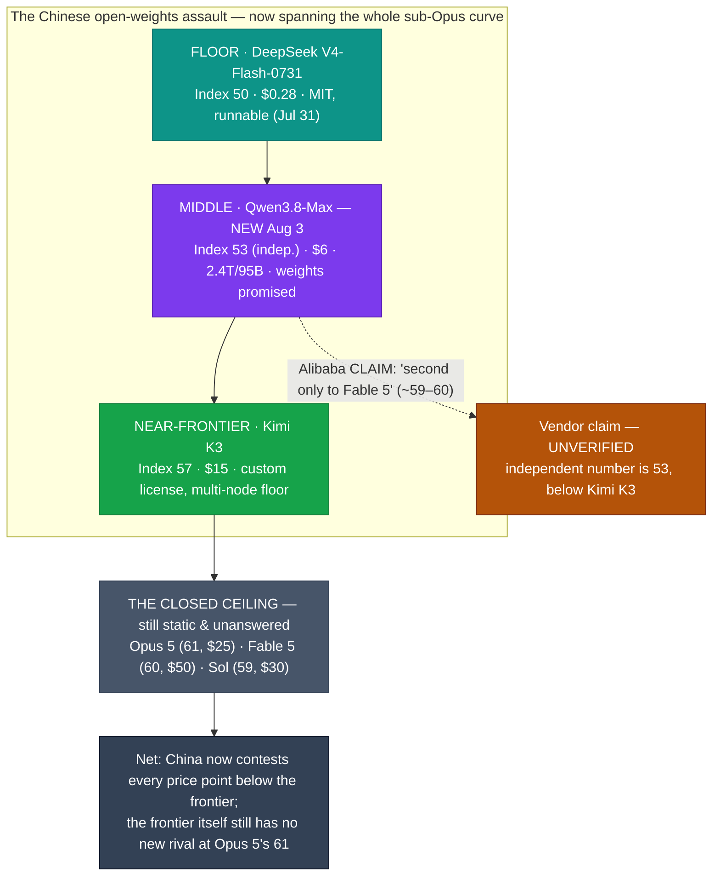

# LLM Updates — 2026-Aug-04

Tuesday brief, written Tue Aug 4 (Los Angeles time). Monday's brief (Aug-03) closed with a
map that had two live clusters and an empty gap between them: a **cheap floor** (DeepSeek
V4-Flash-0731 at Index 50 / $0.28, GPT-5.6 Luna at 51 / $1.20) and an **expensive, static
top** (Opus 5 at 61 / $25, Fable 5 at 60 / $50, Sol at 59 / $30), with **nothing in the
middle** and all competitive motion at the floor. It also left one specific watch-item open:
**the Qwen next flagship, "still in stealth testing… August–September window rumored."**

The single fact that matters this window: **that flagship shipped, and it landed squarely in
the empty middle.** On **Mon Aug 3** (some trackers log Aug 2), Alibaba released
**Qwen3.8-Max** — a **2.4-trillion-parameter MoE (~95B active), 1M-context, text+vision**
model — priced at **$2 / $6 per Mtok** and scoring a **preliminary 53 on the Artificial
Analysis Intelligence Index.** That point — Index 53 at $6 — sits **between** the floor and
the ceiling, in the exact gap Monday's map showed empty. Alibaba's shares rose **~5% (ADR to
$128.45), Hong Kong +7%** on the news.

But the more interesting fact is the **gap between the claim and the measurement.** Alibaba
positioned Qwen3.8-Max as **"second only to Fable 5"** — which would imply an Index near
59–60, above Opus 5, Sol, and Kimi K3. The independent number so far is **53** — which places
it **below Kimi K3's 57**, mid-pack, not #2. As of this compile **no third party had
verified the vendor's ranking,** and the promised open weights had **not** yet appeared on
Hugging Face. So the headline is real (the middle is no longer empty), but the vendor's
framing of it is not yet supported by independent data.

This report advances only what is **new since Aug-03.** It does **not** re-derive the
DeepSeek V4-Flash-0731 Pareto spike and the Luna −80% cut (Aug-03 §1, Jul-31 §1), the AA
Index v4.1 agentic reweighting (Jul-31 §3), the Opus 5 "top quality at mid price" reshuffle
(Jul-25 §1–§3), the Kimi K3 weight drop / hardware floor (Jul-30 §1–§4), or the Fable 5 tier
split (Jul-20 §1) — those are unchanged (§4).

![Scatter plot of large language model intelligence versus API output price on a logarithmic price axis as of August 4 2026. Alibaba's new Qwen3.8-Max lands in the previously-empty middle of the map at an independent Artificial Analysis Intelligence Index of 53 for 6 dollars per million output tokens, between the ultra-cheap floor and the expensive top. The cheap floor holds DeepSeek V4-Flash-0731 at index 50 for 0.28 dollars and GPT-5.6 Luna at index 51 for 1.20 dollars. The near-frontier open model Kimi K3 sits at index 57 for 15 dollars. The static expensive top is Claude Opus 5 at index 61 for 25 dollars, GPT-5.6 Sol at index 59 for 30 dollars, and Claude Fable 5 at index 60 for 50 dollars. Alibaba's own unverified claim of second only to Fable 5 is shown as a hollow marker near index 59 to 60, far above the independently measured point.](qwen_fills_the_middle.svg)

---

## 1. Qwen3.8-Max ships — the empty middle of the map gets a contestant (Aug 3)

The Aug-03 brief flagged the Qwen flagship as the one big open-weights item still in stealth.
It landed on **Monday Aug 3**, and it is a genuinely new point on the map rather than another
floor move.

**What it is:**

| Attribute | Qwen3.8-Max |
|---|---|
| Architecture | 2.4-trillion-parameter Mixture-of-Experts, **~95B active per token** |
| Context / output | **1,000,000-token** context; 131,072-token max output |
| Modality | text + vision input, text output |
| Price (Alibaba/QwenCloud) | **$2.00 in / $6.00 out** per Mtok |
| Independent intelligence | **Index 53** (Artificial Analysis, preliminary) |
| Announced → shipped | previewed **Jul 19**, API-live **Aug 3** |

**Why this is the story, not a footnote:**

- **It fills the gap Monday's map showed empty.** Aug-03 framed the market as a cheap floor
  (~$0.28–$1.20) and an expensive top (~$25–$50) with nothing between. Qwen3.8-Max at
  **Index 53 for $6** sits in the middle: **cheaper per task than Opus 5 / Sol / Fable 5**,
  and **smarter than the pure floor** (DeepSeek 50, Luna 51, GLM-5.2 51). For the first time
  in weeks there is a serious contestant in the mid-price band.
- **On independent numbers it is mid-pack, not #2.** An Index of 53 ranks **below Kimi K3
  (57)** — so among open-weights models it is the **#2 Chinese open flagship, not the
  leader**, and well behind the closed top (Opus 5 61, Fable 5 60, Sol 59). Third-party
  head-to-heads back this up: on one aggregator's benchmark set **Kimi K3 wins 6 of 8**
  (DeepSWE, FrontierSWE, GPQA, HLE, MLS-Bench, Terminal-Bench) while Qwen3.8-Max takes 2
  (MMMU-Pro, PerceptionBench); a StackPerf coding test put **Kimi 83 vs Qwen 80.**
- **Its own vendor claim is much bigger — and unverified (see §3 gap).** Alibaba described it
  as **"second only to Fable 5"** and said it "ranks higher than Kimi K3 on some benchmarks."
  That would put it near Index 59–60. The independent 53 does not support that framing, and
  no third party had verified the vendor ranking at compile time. Alibaba **had not published
  a single benchmark table** of its own to back the claim.
- **The market treated it as a real event.** Alibaba's NY-listed ADRs climbed **~5%** (to
  $128.45) and Hong Kong shares closed **~7%** higher on Aug 3, read as a signal for Alibaba
  Cloud's AI trajectory ahead of its Aug 17 earnings.

**Sources:**
[Artificial Analysis — Qwen3.8-Max model page (Index 53)](https://artificialanalysis.ai/models/qwen3-8-max) ·
[Bloomberg — Alibaba's Qwen3.8-Max claims benchmark scores rivaling Anthropic](https://www.bloomberg.com/news/articles/2026-08-03/alibaba-drops-another-china-ai-model-with-breakthrough-performance) ·
[CNBC — Alibaba shares rally after unveiling Qwen3.8-Max](https://www.cnbc.com/2026/08/03/alibaba-ai-model-qwen-rival-anthropic.html) ·
[InfotechLead — Alibaba launches 2.4T-parameter Qwen3.8-Max](https://infotechlead.com/artificial-intelligence/alibaba-launches-2-4-trillion-parameter-qwen3-8-max-ai-model-challenging-moonshot-and-openai-97480) ·
[MarkTechPost — Qwen releases Qwen3.8-Max, most capable in the Qwen family](https://www.marktechpost.com/2026/08/03/alibaba-qwen-releases-qwen3-8-max/) ·
[Developers Digest — Qwen 3.8 Max ships: 2.4T MoE, 1M context, $2/$6, open weights next week](https://www.developersdigest.tech/blog/qwen-3-8-max-release-2026) ·
[llm-stats — Kimi K3 vs Qwen3.8-Max head-to-head](https://llm-stats.com/models/compare/kimi-k3-vs-qwen3.8-max) ·
[IBTimes — Alibaba shares surge over 5% on Qwen3.8-Max](https://www.ibtimes.com.au/alibaba-shares-surge-over-5-new-qwen-38-max-ai-model-boosts-investor-confidence-cloud-growth-1873494)

---

## 2. Open weights: a promise with a recently-broken precedent (Aug 3)

Alibaba's framing leaned on **open weights** — but as of this compile that is a **pledge, not
a shipment**, and Qwen's own recent history is the reason to hold the skepticism.

- **What was promised.** Open weights for **both** Qwen3.8-Max (2.4T) **and a smaller
  Qwen3.8-27B checkpoint**, on **Hugging Face and ModelScope**, targeted for **"next week."**
  The 27B sibling matters: unlike Kimi K3's multi-node datacenter floor (Jul-30 §4), a 27B
  model is genuinely runnable on a single workstation — the "open **and** runnable" combination
  that most Chinese frontier open weights have lacked.
- **What actually shipped: nothing yet.** At compile time there was **no Hugging Face
  repository, no license text, and no model card** for the 3.8 weights. Careful trackers
  called this out directly — "until there is a Hugging Face repo and a license, treat
  open-weight 3.8 as a promise, not a plan." Alibaba also used the careful term
  *"open-weight"*: no training data, no full training code, no confirmed OSI-approved license.
- **Why the precedent cuts against the pledge.** Qwen 3 and 3.5 shipped under permissive
  **Apache-2.0** and were runnable within a week or two — Alibaba's reputation as an
  open-weights "good actor." **That pattern broke with Qwen 3.7 (May 2026), which shipped
  proprietary / API-only.** So "open weights next week" is a promise from a vendor that broke
  the same promise one generation ago. Until the repo and a license appear, the runnable-27B
  story is unconfirmed.

**Why it matters.** The mid-tier point (§1) is real on the API today; the *open-weights*
part of the pitch — the part that would make Qwen3.8 a self-hostable mid-tier default, and
the 27B a workstation-class option — is the part still outstanding. It is the first thing to
verify this week (Watch next).

**Sources:**
[Developers Digest — open weights (Qwen3.8-Max + 27B) promised next week](https://www.developersdigest.tech/blog/qwen-3-8-max-release-2026) ·
[latent.space (AINews) — Qwen 3.8 Max (2.4T) and 27B, new open-weights models for coding and Cowork](https://www.latent.space/p/ainews-qwen-38-max24t-and-27b-new) ·
[Techsy — Qwen3.8: 2.4T parameters, open weights, no benchmarks (or license) yet](https://techsy.io/en/blog/qwen-3-8) ·
[InsiderLLM — Qwen 3.8 & Kimi K3: open in name, closed in practice](https://insiderllm.com/guides/open-weights-you-cant-run/) ·
[Models.dev — Qwen3.8-Max specs & pricing](https://models.dev/models/alibaba/qwen3.8-max/)

---

## 3. The claim-vs-measurement gap — read the vendor number skeptically

The one thing worth isolating from §1, because it is a recurring pattern these briefs track:
**the distance between what Alibaba said and what the independent tracker measured.**

| | Placement | Implied Index | Verified? |
|---|---|---|---|
| **Alibaba's claim** | "second only to **Fable 5**"; "higher than Kimi K3 on some benchmarks" | ~59–60 (above Opus 5, Sol, Kimi K3) | **No** — no vendor benchmark table published |
| **Artificial Analysis (preliminary)** | mid-pack, below Kimi K3 | **53** | independent; flagged preliminary, full eval pending |

- The two readings disagree by roughly **6–7 Index points** — the difference between "#2 model
  in the world" and "#2 *Chinese open* model, mid-pack overall." That is not a rounding
  difference; it is the difference between the marketing story and the map.
- The honest current status is **"Index 53, preliminary, verification pending"**: some
  trackers already show 53, while others note no fully-verified third-party score exists yet
  and Arena Code/WebDev previews (where Qwen shows well) are not the same as a composite Index.
- **This is why §1 leads with the measured point, not the claim.** The pattern — a strong
  vendor ranking that independent evaluation trims once it lands — has repeated across this
  summer's launches; Qwen3.8-Max is the latest instance, and the prudent read until AA
  finalizes is the **53**, not the "second only to Fable 5."

**Sources:**
[felloAI — best open-source models: Qwen3.8-Max claims to trail only Fable 5, unverified](https://felloai.com/best-open-source-ai-models/) ·
[BenchLM — best Chinese models (Kimi K3 leads; Qwen3.8-Max unverified)](https://benchlm.ai/best/chinese-models) ·
[Forbes — Alibaba unveils its largest model yet as China closes the gap](https://www.forbes.com/sites/gabrielalinzainescu/2026/08/03/alibaba-unveils-its-largest-ai-model-yet-as-china-closes-the-gap/) ·
[a2aprotocol — Qwen3.8-Max vs GLM-5.2 vs Kimi K3 vs DeepSeek V4-Flash](https://a2aprotocol.ai/insights/qwen-38-max-vs-glm-52-vs-kimi-k3-vs-deepseek-v4-flash)

---

## 4. Unchanged since Aug-03 (no material development)

- **Gemini 3.5 Pro edged one notch closer — still not a launch.** Aug-03 placed an unreleased
  Google model in LMArena's **blind pool**. Over Aug 3–4, community posts said Gemini 3.5 Pro
  is now **"live on the Arena"** with a release that "seems imminent" — but this still rests on
  limited, unverified reports, and Google has published **no date, no model card, no API, and
  no pricing.** It remains a leading indicator, not a live model contesting Opus 5's Index-61
  point. (Google's shipped model this cycle is still the cheaper **Gemini 3.6 Flash**, Jul 21.)
- **The top is still uncut.** No flagship price move: **Opus 5 stays $5/$25, Sol stays $30,
  Fable 5 stays $50.** The Aug-03 watch-item "does the top ever get cut?" is still **no** — all
  price and capability motion remains below the frontier.
- **DeepSeek V4-Flash-0731** (Index 50, $0.28, MIT weights) remains the Pareto spike at the
  floor (Aug-03 §1); no follow-on release or price change this window.
- **Kimi K3** — open #1 at Index 57, custom (non-OSI) license, multi-node hardware floor
  (Jul-30/Jul-31 §4). Qwen3.8-Max (§1) does **not** displace it as the top open model on
  independent numbers. The single-node 14B–30B distilled Kimi students are **still not out**;
  the ~50B-vs-~104B active-parameter question is **still unresolved.**
- **Autonomy/policy axis quiet.** The **AI Kill Switch Act** (Lieu–Moran, Jul 23) and the
  **Pacing the Frontier** OpenAI+Anthropic endorsement (Jul 28–29) drew no new signatories or
  legislative action; reporting this window is retrospective.
- **Fable 5 tier split** (Jul-20 §1) still in force. **Sonnet 5** keeps its **$2/$10**
  introductory pricing through **Aug 31** (reverts to $3/$15 after). **Anthropic classifier
  false-positive fix** (Jul-03 §1) still unshipped.

**Sources:**
[AiBattle (X) — "Gemini 3.5 Pro is now live on the Arena… release seems imminent"](https://x.com/AiBattle_/status/2083071686039961860) ·
[Windows Forum — Gemini 3.5 Pro: no launch date or verified LM Arena test](https://windowsforum.com/windows-news.4/gemini-3-5-pro-no-launch-date-or-verified-lm-arena-test.441354/) ·
[BenchLM — OpenAI API pricing (August 2026): Sol/Terra/Luna, top uncut](https://benchlm.ai/openai/api-pricing) ·
[llm-stats — AI updates & model releases (August 2026)](https://llm-stats.com/llm-updates) ·
[LLM Gateway — release timeline (Qwen3.8-Max added Aug 3)](https://llmgateway.io/timeline)

---

## 5. The through-line — the Chinese open-weights assault now brackets the whole board

For six weeks these briefs tracked the **ceiling**; Aug-03 reported all competition had moved
to the **floor**, with an empty middle. This window, the middle filled — and the filler was,
once again, a **Chinese open-weights** model. Step back and the shape is now clear:
**three Chinese open(-ish) flagships bracket the entire price curve below Opus 5**, while the
closed frontier sits untouched above them.

| Thread (prior briefs) | Status on Aug 4 | Change |
|---|---|---|
| Qwen next flagship (Aug-03 watch) | Shipped **Aug 3** — Qwen3.8-Max, 2.4T/95B, $2/$6, **Index 53** (§1) | **new — landed in the empty middle (§1)** |
| The empty mid-tier ($1.50–$20) | Now has a contestant at Index 53 / $6 (§1) | **new — gap filled (§1, §5)** |
| Vendor claim vs independent | Alibaba: "2nd only to Fable 5"; AA preliminary: **53**, below Kimi K3 (§3) | **new — a ~6–7-pt gap to watch (§3)** |
| Open + runnable | 27B checkpoint + Max weights **promised**, none shipped; Qwen 3.7 precedent broke (§2) | **new — a pledge, not a plan (§2)** |
| Gemini 3.5 Pro | Blind pool → "live on Arena, imminent"; still no card/date/API (§4) | small advance (§4) |
| Peak quality (closed) | Opus 5 (61) > Fable 5 (60) > Sol (59) — untouched, uncut, unanswered | unchanged (§4) |
| Cheapest useful model | DeepSeek V4-Flash-0731: Index 50 at $0.28, MIT weights | unchanged (§4) |
| Autonomy/policy | No new action this window | unchanged (§4) |

The net: Monday's map had a hole in the middle and China owned the floor. Tuesday, China
**also** owns the middle — Qwen3.8-Max slots a near-frontier-adjacent model into the
mid-price band, so the cheap floor, the mid-tier, and the near-frontier open slot are now
**all Chinese open(-ish) releases** (DeepSeek / Qwen / Kimi). The closed labs still hold the
very top — Opus 5's 61 has no answer — but everything beneath it is increasingly a Chinese
open-weights contest. The two cautions that keep this from being a clean "China takes the
middle" story are that the **independent Index (53) is well below the vendor claim** (§3), and
the **open weights that would make it self-hostable have not actually shipped** (§2).

---

## Watch next

- **Do the Qwen3.8 weights actually ship — and under what license?** The whole "open, runnable
  mid-tier" thesis rests on the promised Hugging Face / ModelScope drop of Qwen3.8-Max **and
  the 27B**. Watch for the repos, the license text (Apache-2.0 like Qwen 3.5, or something
  gated like 3.7?), and whether the 27B is genuinely workstation-runnable.
- **Does Artificial Analysis finalize Qwen3.8-Max above or below 53?** The preliminary 53
  contradicts Alibaba's "second only to Fable 5." Watch whether the full eval moves it up
  toward the claim or confirms a mid-pack placement below Kimi K3 (§3).
- **Gemini 3.5 Pro: "live on Arena" → an actual card.** Arena appearances have preceded a
  Gemini ship by days to weeks. Watch for a model card, price, and whether its Index finally
  contests Opus 5's 61 — the only move that would pull competition back to the ceiling (§4).
- **Does anyone answer at the frontier?** The top has been static for ~10 days while every new
  release lands below it. A flagship price cut or a genuine Index-61+ challenger remains the
  missing event.
- **Autonomy/policy follow-through.** Whether the Kill Switch Act advances and the
  OpenAI+Anthropic pacing endorsement draws in Google/Meta remains the slower axis (§4).

---

*Compiled Tue Aug 4 2026 (Los Angeles time) from public reporting and independent benchmark
trackers. Independent Intelligence Index figures (Qwen3.8-Max 53 preliminary, DeepSeek
V4-Flash-0731 50, GPT-5.6 Luna 51, GLM-5.2 51, Kimi K3 57, GPT-5.6 Sol 59, Claude Fable 5 60,
Claude Opus 5 61) are from Artificial Analysis; the Qwen3.8-Max specs ($2/$6, 2.4T/95B, 1M
context), the "second only to Fable 5" positioning, the open-weights-next-week pledge, and the
~5%/~7% Alibaba share move are vendor-/press-reported and flagged as such. As in prior
compiles, many primary and publisher domains (Artificial Analysis, Bloomberg, CNBC,
Investing.com, Dataconomy, Kingy, TrendingTopics, Models.dev among them) returned HTTP 403 to
direct fetches during compilation, so figures are cited via the search index and mirrored
trackers where a direct read failed. The Qwen3.8-Max Index-53 / $2–$6 / 2.4T figures are
corroborated across 5+ independent outlets; the "second only to Fable 5" ranking is the
vendor's own and **unverified** by any third party as of this compile; the Gemini 3.5 Pro
"live on Arena" report (§4) rests on limited, unverified community posts and should be treated
as provisional. Prior background is referenced by date/section rather than repeated.*
