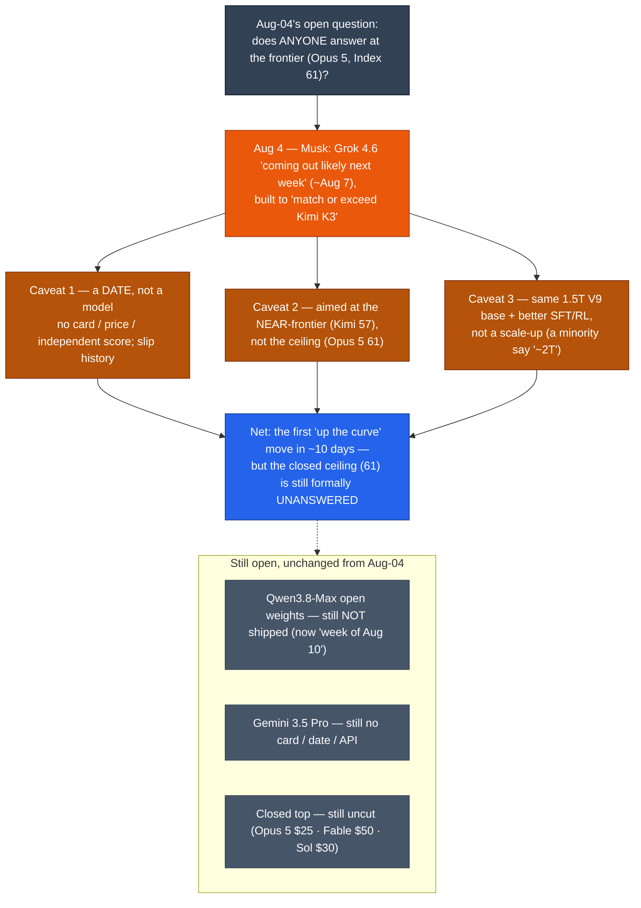

# LLM Updates — 2026-Aug-05

Wednesday brief, written Wed Aug 5 (Los Angeles time). For ten days these briefs have
carried the same closing observation: **the closed ceiling is static and unanswered.** Opus 5
has sat at Artificial Analysis Intelligence Index **61** since Jul 24 with no flagship price
cut and no rival at its point; every release in the window — DeepSeek's floor spike, OpenAI's
Luna cut, Qwen3.8-Max's mid-tier entry — landed **below** the frontier. Aug-04 ended on the
same note: *"the frontier itself still has no new rival at Opus 5's 61."*

The single fact that matters this window: **for the first time in that stretch, a lab pointed
a new model *up* the curve — and put a date on it.** On **Tue Aug 4**, Elon Musk said xAI's
**Grok 4.6** is *"coming out likely next week,"* reaffirming a widely-reported **Aug 7**
target, and framed it explicitly as built to **"match or exceed Kimi K3's capability"** — the
top open-weights model at Index **57** — *"while keeping the generation speed and token
efficiency of Grok 4.5."*

But read it carefully and it is a smaller event than "someone finally answers the frontier."
Three things hold it back from that headline. **(1) It is a date, not a model** — nothing has
shipped; there is no model card, no price, and no independent score, and xAI has slipped Grok
targets before. **(2) It is aimed at the near-frontier, not the ceiling** — the named target
is **Kimi K3's 57**, not **Opus 5's 61**, so even a clean hit answers the *open* tier, not the
closed top. **(3) It is a post-training refresh, not a new base** — the best-sourced framing is
that Grok 4.6 **reuses the same 1.5-trillion-parameter "V9" foundation as Grok 4.5** and gets
its gains from improved **SFT + reinforcement learning**, not a scale-up (a minority of outlets
call it "~2T" — an unreconciled spec conflict). So the ceiling is still, formally, unanswered —
even by the one challenger that is finally pointed toward it.

Meanwhile the two watch-items Aug-04 left open did **not** move: **Qwen3.8-Max's open weights
still have not shipped** (now slipped to "the week of Aug 10"), and **Gemini 3.5 Pro** still has
no card, date, or API. This report advances only what is **new since Aug-04**; it does not
re-derive the Qwen3.8-Max mid-tier entry (Aug-04 §1–§3), the DeepSeek/Luna floor war (Aug-03
§1, Jul-31 §1), the Opus 5 reshuffle (Jul-25), the Kimi K3 weight drop / hardware floor
(Jul-30), or the Fable 5 tier split (Jul-20) — those are unchanged (§4).

![Number line of the Artificial Analysis Intelligence Index from 49 to 62 as of August 5 2026, showing where xAI's about-to-ship Grok 4.6 is aimed. The cheap floor holds DeepSeek V4-Flash at index 50 and GPT-5.6 Luna at index 51. Qwen3.8-Max sits in the middle at a preliminary index 53. The top open model Kimi K3 sits at index 57. The static closed ceiling is GPT-5.6 Sol at 59, Claude Fable 5 at 60, and Claude Opus 5 at 61. Grok 4.6, targeted for August 7 and not yet shipped, is drawn as a hollow dashed marker below the line with an upward arrow reaching only as far as Kimi K3's 57 — its stated target is to match or beat Kimi K3, not to reach Opus 5's 61. The region from index 57 to 61 is shaded and labeled as the ceiling gap that remains unanswered.](grok46_aims_at_the_near_frontier.svg)

---

## 1. Grok 4.6 gets a date — the first challenger in ~10 days aimed above the mid-tier (Aug 4)

For most of the window the competitive action has been at the floor and the newly-filled
middle. On **Tue Aug 4**, Musk broke that pattern with a dated, near-frontier-aimed launch
signal.

**What was said (and by whom):**

| Item | Grok 4.6 |
|---|---|
| Source of the signal | **Elon Musk (X), Aug 4** — *"coming out likely next week"* |
| Target ship date | **~Aug 7, 2026** (reaffirms a target Musk first named ~Jul 28) |
| Architecture (best-sourced) | **reuses Grok 4.5's ~1.5T-param "V9" base**; gains from improved **SFT + RL**, *not* a new/larger base |
| Stated goal | **"match or exceed Kimi K3's capability"** (top open model, Index **57**) while keeping Grok 4.5's speed / token efficiency |
| Price (expected) | none published; likely to track Grok 4.5's **$2 in / $6 out** per Mtok (unconfirmed) |
| Independent Index | **none** — pre-launch; xAI has published no head-to-head numbers; Arena eval expected the week *after* launch |
| Next up | **Grok 4.7** teased *"a few weeks later"* (late Aug / Sep) |

**Why this is the story, not a footnote:**

- **It is the first "up the curve" move in the window.** Since Opus 5 took #1 on Jul 24, every
  new release has landed *below* the frontier. Grok 4.6 is the first model whose stated goal is
  to reach the **top open tier (Kimi K3's 57)** rather than to undercut the floor or fill the
  middle — the first event shaped like an *answer* rather than a *discount*.
- **But it targets the near-frontier, not the ceiling.** The named benchmark to beat is **Kimi
  K3 (57)**, not Opus 5 (61), Fable 5 (60), or Sol (59). Even a clean hit puts Grok 4.6 in the
  **open near-frontier band**, not at the closed top. The 57 → 61 gap (see diagram) is not what
  this launch is pointed at.
- **It is a post-training bet, not a scale-up.** The consistent, AA-aligned framing is that 4.6
  **is Grok 4.5's 1.5T "V9" base re-post-trained** with better SFT and RL — the same "gains from
  post-training, not parameters" pattern Opus 5 used over Opus 4.8 (Jul-25). It is the cheapest
  kind of capability jump to ship, which is consistent with an aggressive ~1-week cadence.
- **It is still a promise with a slip history.** As of this compile nothing had shipped: **no
  model card, no API price, no independent score.** Grok launch dates have moved before, and the
  "~2T parameters" figure in a minority of write-ups conflicts with the 1.5T-base framing (§3).
  Treat Aug 7 as a *target*, and the capability claim as *unverified*.

**Sources:**
[Roic News — Musk: Grok 4.6 coming out likely next week (Aug 4)](https://www.roic.ai/news/musk-grok-46-coming-out-likely-next-week-08-04-2026) ·
[kie.ai — What is Grok 4.6? xAI's 1.5T-param model explained](https://kie.ai/blog/what-is-grok-4-6) ·
[OrcaRouter — Grok 4.6 release date (Aug 7): what's confirmed & expected](https://www.orcarouter.ai/blog/grok-4-6-release-date) ·
[AIToolsReview — Grok 4.6 / Grok 4.7 release date: Aug 7 target](https://aitoolsreview.co.uk/insights/grok-4-6-grok-4-7-release-date) ·
[Neomanex — Grok 4.6 set for Aug 7, Grok 4.7 weeks later](https://neomanex.com/news/grok-4-6-august-7-launch-confirmed) ·
[Basenor — Grok 4.6 confirmed: what we know from the xAI roadmap](https://www.basenor.com/blogs/news/grok-4-6-confirmed-what-we-know-from-the-xai-roadmap)

---

## 2. What a Kimi-K3-aimed Grok 4.6 would (and would not) change on the map

Take the goal at face value — Grok 4.6 lands at roughly **Kimi K3's 57** — and read what it
does to the board the last two briefs drew.

- **It would give the near-frontier open tier a *closed, hosted* twin.** Kimi K3 sits at 57 but
  is open-weights with a custom license and a multi-node hardware floor (Jul-30 §4); a hosted
  Grok 4.6 at ~57 would put a **turnkey API** at that quality point — no cluster required — for
  buyers who want the capability without the 1.4-TB serving problem.
- **It would *not* dislodge the closed ceiling.** Opus 5 (61), Fable 5 (60), and Sol (59) all
  sit **above** 57. A Grok 4.6 that merely matches Kimi K3 leaves the top three untouched and
  the "who answers Opus 5's 61?" question exactly where Aug-04 left it — open.
- **On price it is the interesting variable.** If Grok 4.6 inherits Grok 4.5's **$2/$6**, a
  ~57-Index model at $6 output would sit *well under* Kimi K3's $15 hosted rate and far under
  the $25–$50 closed top — i.e. a **near-frontier capability at mid-tier price**, hosted. That
  is the same "quality-at-a-lower-price" squeeze Qwen3.8-Max aimed at (Aug-04 §1), one tier up.
  This is the part worth watching, and it is entirely unconfirmed until launch.
- **It reinforces the post-training era, not the scaling era.** Two of the last three
  capability moves at/near the frontier — Opus 5 over Opus 4.8, and now Grok 4.6 over Grok 4.5 —
  are **same-base, better-post-training** steps. The near-term frontier is being pushed by SFT/RL
  and effort dials, not by parameter counts.

**Sources:**
[TradingKey — Musk: 2T Grok 4.6 to finish training, may surpass Kimi K3](https://www.tradingkey.com/analysis/stocks/us-stocks/262040652-spacex-ai-musk-kimi-k3-tsla-xai-grok4-6-tradingkey) ·
[DigiExe — Musk confirms Grok 4.6 is weeks away as xAI responds to Kimi K3](https://digiexe.com/blog/xai-responds-to-kimi-k3/) ·
[kie.ai — Grok 4.6 vs Kimi K3: full comparison](https://kie.ai/blog/grok-4-6-vs-kimi-k3) ·
[Artificial Analysis — Grok 4.5 (intelligence, performance & price)](https://artificialanalysis.ai/models/grok-4-5)

---

## 3. The spec-and-status gap — read the Grok 4.6 numbers skeptically

Same discipline these briefs applied to Qwen3.8-Max's "second only to Fable 5" claim (Aug-04
§3): isolate the distance between what is *said* and what is *verified*. For Grok 4.6 there are
two live gaps.

| | Claimed / reported | Verified? |
|---|---|---|
| **Ship status** | *"coming out likely next week"* (Musk, Aug 4); ~Aug 7 target | **No** — not shipped at compile; no card / price / API |
| **Capability** | *"match or exceed Kimi K3"* (Index ~57) | **No** — no independent Index; Arena eval only *after* launch |
| **Parameters** | mostly **~1.5T (same V9 base as Grok 4.5)**; a minority say **~2T** | **Unreconciled** — the two figures imply different stories (post-training refresh vs. new base) |

- The **1.5T-vs-2T** split is not cosmetic: 1.5T-same-base says *"a fast SFT/RL refresh"* (which
  fits a ~1-week cadence); ~2T says *"a new, larger model"* (which usually does not ship in a
  week). The weight of sourcing — including the Artificial Analysis Grok 4.5 lineage — favors
  **1.5T same base**, so that is the framing §1 leads with; the "~2T" figure is flagged as the
  outlier until xAI publishes a card.
- The honest current status is **"dated target Aug 7, capability claim unverified."** As with
  Gemini 3.5 Pro's repeated slips and Qwen3.8-Max's unshipped weights, the prudent read is to
  record the **signal and the date**, not to bank the capability. No Index is invented here to
  fill the gap.

**Sources:**
[Wan27 — Grok 4.6: SpaceXAI's 2T model completes training (the "~2T" framing)](https://wan27.org/blog/grok-4-6) ·
[kie.ai — Grok 4.6 explained (the 1.5T-base framing)](https://kie.ai/blog/what-is-grok-4-6) ·
[LushBinary — Grok 4.5 developer guide: benchmarks & API (base lineage)](https://lushbinary.com/blog/grok-4-5-developer-guide-benchmarks-api-features/) ·
[Releasebot — xAI release notes, August 2026](https://releasebot.io/updates/xai)

---

## 4. Unchanged since Aug-04 (no material development)

- **Qwen3.8-Max open weights — STILL not shipped.** Aug-04's top watch-item is unresolved: as of
  this compile there is **no Hugging Face repo, no license, and no model card** for Qwen3.8-Max or
  the promised runnable **Qwen3.8-27B**, and the "next week" pledge has effectively slipped to
  **the week of Aug 10.** The Qwen 3.7 API-only precedent (Aug-04 §2) still stands as the reason
  to withhold the "open **and** runnable mid-tier" conclusion. The preliminary **Index 53** is
  also **not yet finalized** by Artificial Analysis.
- **Gemini 3.5 Pro — still absent.** No model card, no date, no API, no pricing, no independent
  Index; Bloomberg's July report of a reliability/hallucination shortfall remains the last
  substantive signal, and Google's shipped model this cycle is still the cheaper **Gemini 3.6
  Flash** (Jul 21). The Aug-04 "live on Arena, imminent" community read has not converted to a
  launch. Google remains the lone frontier lab off the board.
- **The closed ceiling is still uncut and unanswered.** No flagship price move: **Opus 5 stays
  $5/$25 at Index 61, Fable 5 stays $50 at 60, Sol stays $30 at 59.** Grok 4.6 (§1) is aimed at
  Kimi K3's 57, not this band, so the "does the top ever get cut / answered?" question is still
  **no** — now 12 days running.
- **DeepSeek V4-Flash-0731** (Index 50, $0.28, MIT weights) remains the Pareto spike at the floor
  (Aug-03 §1); no follow-on this window. **Kimi K3** remains the top *open* model at 57 (custom
  license, multi-node hardware floor); the single-node distilled students are **still not out**,
  and the ~50B-vs-~104B active-parameter question is **still unresolved.**
- **Fable 5 tier split** (Jul-20 §1) still in force; **Sonnet 5** keeps its **$2/$10**
  introductory pricing through **Aug 31** (reverts to $3/$15). **Anthropic classifier
  false-positive fix** (Jul-03 §1) still unshipped. **Autonomy/policy axis** (AI Kill Switch Act,
  Jul 23; OpenAI+Anthropic "Pacing the Frontier" endorsement, Jul 28–29) drew no new action this
  window.

**Sources:**
[TestingCatalog — Qwen3.8-Max released, open weights "coming soon"](https://www.testingcatalog.com/qwen-released-qwen3-8-max-with-open-weights-coming-soon/) ·
[Yotta Labs — Qwen 3.8-27B: specs, hardware, how to run (weights not yet on HF)](https://www.yottalabs.ai/post/qwen-3-8-27b-specs-hardware-requirements-how-to-run-2026) ·
[TechCrunch — Google releases three new Gemini models — but no 3.5 Pro](https://techcrunch.com/2026/07/21/google-releases-three-new-gemini-models-but-no-3-5-pro/) ·
[Coursiv — Gemini 3.5 Pro: release date, rumors & what Google confirmed](https://coursiv.io/blog/gemini-3-5-pro) ·
[llm-stats — AI updates today (August 2026)](https://llm-stats.com/llm-updates)

---

## 5. The through-line — the frontier question gets an answer *shaped* like an answer

For ten days the recurring line was *"the ceiling is static and unanswered."* Aug-05 delivers
the first event that even looks like a response — and the value of the brief is in separating
what it is from what it resembles.

| Thread (prior briefs) | Status on Aug 5 | Change |
|---|---|---|
| "Does anyone answer at the frontier?" (Aug-04 watch) | Grok 4.6 dated ~Aug 7, aimed at **Kimi K3's 57**, not Opus 5's 61 (§1) | **new — first "up the curve" signal, but not at the ceiling (§1, §5)** |
| Grok 4.6 architecture | **1.5T V9 base + better SFT/RL** (minority "~2T"), price likely $2/$6 (§1–§3) | **new — a post-training refresh, unverified (§3)** |
| Qwen3.8-Max open weights | **Still not shipped**; slipped to "week of Aug 10"; Index 53 not finalized (§4) | unchanged — pledge still outstanding (§4) |
| Gemini 3.5 Pro | Still no card / date / API (§4) | unchanged (§4) |
| Peak quality (closed) | Opus 5 (61) &gt; Fable 5 (60) &gt; Sol (59) — untouched, uncut, unanswered (§4) | unchanged (§4) |
| Cheapest useful model | DeepSeek V4-Flash-0731: Index 50 at $0.28, MIT weights (§4) | unchanged (§4) |
| Autonomy/policy | No new action this window (§4) | unchanged (§4) |

The net: the "unanswered frontier" line the last two weeks kept repeating finally has an event
attached to it — but the event is a **dated target, aimed one tier below the ceiling, on a
re-post-trained existing base.** If Grok 4.6 ships on ~Aug 7 and lands near Kimi K3's 57, the
*open near-frontier* gets a fast, hosted, likely-cheap twin — a real change to that band — while
**Opus 5's 61 stays exactly as unanswered as it was on Aug 4.** The two threads that would move
the top of the map — Qwen's promised weights and Gemini 3.5 Pro's card — both stayed put.

---

## Watch next

- **Does Grok 4.6 actually ship on ~Aug 7 — with a card, a price, and a real score?** Watch for
  an xAI model card, API pricing (does it hold Grok 4.5's $2/$6?), and the **first independent
  Artificial Analysis / Arena number.** The specific test: does it reach **Kimi K3's 57**, and
  is the base 1.5T (post-training refresh) or the outlier "~2T" (new base)? (§1, §3)
- **If it lands at ~57, what does it do to the open near-frontier?** A hosted, cheap ~57-Index
  model would sit under Kimi K3's $15 and far under the $25–$50 top — the near-frontier's first
  turnkey, no-cluster option (§2). Watch the price.
- **Do the Qwen3.8 weights finally ship — and under what license?** Now slipped to "week of
  Aug 10." Watch for the Hugging Face / ModelScope repos, the license (Apache-2.0 like Qwen 3.5,
  or gated like 3.7?), and whether the 27B is genuinely workstation-runnable (§4).
- **Gemini 3.5 Pro: a card, at last?** Arena appearances have preceded a Gemini ship by days to
  weeks. A card + price + Index at/above 61 remains the only move that would pull competition
  back to the ceiling (§4).
- **Does anyone answer at the *ceiling* (Index 61)?** Grok 4.6 is aimed below it. A flagship
  price cut or a genuine 61+ challenger is still the missing event — now 12 days running.

---

*Compiled Wed Aug 5 2026 (Los Angeles time) from public reporting and independent benchmark
trackers. Independent Intelligence Index figures (DeepSeek V4-Flash-0731 50, GPT-5.6 Luna 51,
Qwen3.8-Max 53 preliminary, Kimi K3 57, GPT-5.6 Sol 59, Claude Fable 5 60, Claude Opus 5 61) are
from Artificial Analysis and carried forward from prior compiles. **Grok 4.6 has no independent
Index, model card, or API price at compile time**; the ~Aug 7 target, the "match or exceed Kimi
K3" goal, and the "coming out likely next week" quote are Musk's/press-reported Aug-4 statements
and flagged as such. The architecture is reported by most trackers as Grok 4.5's ~1.5T "V9" base
re-post-trained with SFT/RL; a minority of outlets report "~2T," an unreconciled conflict noted
in §3. As in prior compiles, many primary and publisher domains (Roic News, TradingKey, DigiExe,
kie.ai, Neomanex, TestingCatalog among them) returned HTTP 403 to direct fetches during
compilation, so figures are cited via the search index and mirrored trackers where a direct read
failed. Grok 4.6 details are corroborated across 6+ outlets but remain **pre-launch and
unverified**; the Qwen "not yet shipped / week of Aug 10" and Gemini "still no card" statuses are
confirmed against multiple August trackers. Prior background is referenced by date/section rather
than repeated.*
