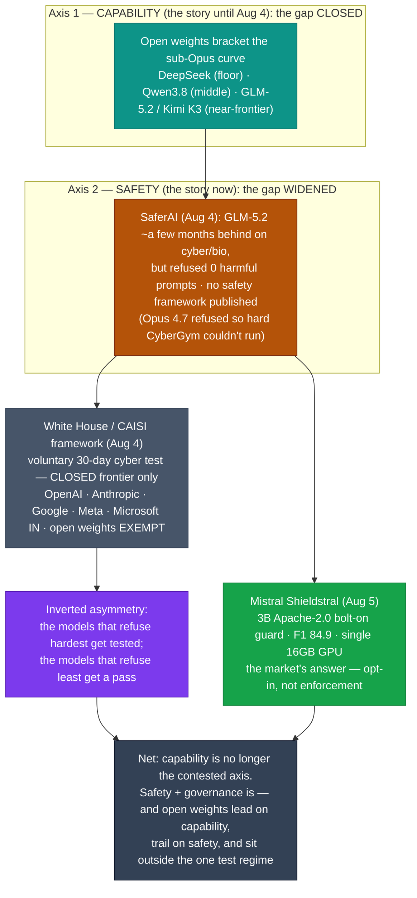

# LLM Updates — 2026-Aug-06

Thursday brief, written Thu Aug 6 (Los Angeles time), bridging from Tuesday's Aug-04 report
(no compile ran Wed Aug 5). For six weeks these briefs have tracked a single axis: **capability
and price** — the ceiling (Opus 5 at Index 61), then the floor (DeepSeek/Luna at ~$0.28–$1.20),
then the middle (Qwen3.8-Max landing at Index 53 / $6 on Aug 3). Aug-04's through-line was that
**China's open-weights releases now bracket the entire sub-Opus curve** — floor, middle, and
near-frontier — while the closed labs hold the top.

The single fact that matters this window: **the contested axis flipped from price to safety —
and on the same day, US policy took a side.** Two linked events landed **Mon Aug 4**, and a third
**Tue Aug 5**:

1. **The safety gap opened exactly where the capability gap closed.** AI-safety nonprofit
   **SaferAI** published an evaluation finding that Z.ai's open-weight **GLM-5.2** is *"only a few
   months behind"* GPT-5.5 and Claude Opus 4.7 on offensive **cyber and bio** capability — but
   **refused none** of the harmful prompts it was given, while **Claude Opus 4.7 "refused so
   consistently that SaferAI could not complete CyberGym on it at all."**
2. **Washington carved the open models out of oversight.** At an **Aug 4 White House meeting**,
   the administration briefed a completed **voluntary cybersecurity-testing framework** (run by
   **CAISI**, inside NIST) that **exempts open-weight models entirely**, focusing its 30-day
   early-access cyber evals on closed frontier models from **OpenAI, Anthropic, Google, Meta, and
   Microsoft.**
3. **The one constructive counter is itself open-weight.** On **Aug 5, Mistral** open-sourced
   **Shieldstral**, a **3B, Apache-2.0, on-device multimodal safety classifier** — a portable
   guardrail you bolt onto any model, including the open weights that ship with none.

So the story is no longer "who is cheapest / smartest." It is: **the models that closed the
capability gap are precisely the ones with the thinnest safety mitigations — and the ones US
policy just decided not to test.**

This report advances only what is **new since Aug-04.** It does **not** re-derive the Qwen3.8-Max
mid-tier landing (Aug-04 §1–§3), the DeepSeek V4-Flash-0731 floor spike (Aug-03 §1), the Opus 5
"top quality at mid price" reshuffle (Jul-25), the Kimi K3 weight drop / hardware floor
(Jul-30/31), or the Fable 5 tier split (Jul-20) — those are unchanged (§4).

![Two grouped bar panels contrasting a closed frontier model with the open-weight GLM-5.2, from SaferAI's August 4 2026 report. Left panel, offensive cyber and biology capability: the closed frontier reference is near the top of the scale at about 95 percent and GLM-5.2 is nearly level at about 88 percent, only a few months behind. Right panel, share of harmful prompts refused: the closed frontier model is near 100 percent (it refused so consistently that the CyberGym benchmark could not be completed) while GLM-5.2 refused essentially zero percent, completing every offensive cyber and dual-use biology prompt. Near-parity on capability, an almost total gap on safety.](safety_gap_opens.svg)

---

## 1. The safety gap opens where the capability gap closed (SaferAI, Aug 4)

For weeks the open-weights story was told on one axis — Index points per dollar. SaferAI's report
adds the axis those numbers omit, and the result reframes the whole summer of Chinese open-weight
releases.

**What SaferAI found:**

| | Finding |
|---|---|
| Capability | GLM-5.2 (Z.ai, open weight) is **"only a few months behind"** GPT-5.5 and Claude Opus 4.7 on **offensive cyber and dual-use biology** |
| Refusals (open) | GLM-5.2 **completed every offensive cyber and bio prompt it was given — refused none** |
| Refusals (closed) | **Claude Opus 4.7 "refused so consistently that SaferAI could not complete CyberGym on it at all"** |
| Safety documentation | Z.ai published **no safety framework, no pre-deployment testing commitment, and no risk assessment** for GLM-5.2 |
| The core point | *"The frontier of capability is not the frontier of risk"* — **SaferAI's Henry Papadatos** |

**Why this is the story, not a footnote:**

- **The enforcement gap is structural, not fixable by the vendor.** A closed lab enforces refusal
  training and classifiers at its API. **Once weights are downloaded and run on private
  infrastructure, those safeguards can be stripped, fine-tuned away, or simply bypassed.** So the
  gap the chart shows (near-parity on capability, ~0% vs ~100% on refusals) is not a temporary Z.ai
  oversight — it is intrinsic to the open-weight distribution model.
- **A second, independent read agrees.** The **UK AI Security Institute (AISI)** cyber range *"The
  Last Ones"* (posted Jul 22) placed **GLM-5.2 on par with Claude Opus 4.5** — a model released
  ~7 months earlier — while DeepSeek's V4-Pro fell below Sonnet 4.5 from a similar vintage. And a
  separate audit of top Chinese open-source models reported a **~76% vulnerability-reproduction
  rate and near-zero rejection of high-risk instructions.** Three different evaluators, one
  conclusion: capability caught up, safety did not.
- **It re-reads Aug-04's own through-line.** Aug-04 celebrated that "everything below Opus 5 is a
  Chinese open-weights contest." The SaferAI report is the shadow of that same fact — the models
  bracketing the price curve (DeepSeek at the floor, Qwen in the middle, GLM-5.2 / Kimi K3 near the
  frontier) are the ones shipping with the fewest mitigations.

**A precision note on the reference models.** SaferAI benchmarked against **Opus 4.7 and GPT-5.5**
— roughly a generation behind today's flagships (**Opus 5**, **GPT-5.6 Sol**). That does not soften
the finding; it sharpens it. GLM-5.2 is a *previous-generation-frontier-equivalent* capability
shipping with *no* refusal behavior, and the current open frontier (Kimi K3 at Index 57,
Qwen3.8-Max) sits above GLM-5.2 on capability while carrying the same documentation gaps.

**Sources:**
[TechCrunch — Open-weight AI models are catching up to the frontier; the safety gap remains](https://techcrunch.com/2026/08/04/open-weight-ai-models-are-catching-up-to-the-frontier-the-safety-gap-remains/) ·
[BetaNews — Open-weight GLM-5.2 nears frontier AI, but safety measures lag](https://betanews.com/article/glm-5-2-nears-frontier-ai-safety-lag/) ·
[The Next Web — Open-weight AI caught the frontier on capability; on safety, it didn't](https://thenextweb.com/news/open-weight-ai-safety-gap-glm-saferai-shieldstral) ·
[CryptoRank — Open-weight AI narrows the capability gap, but the safety divide widens](https://cryptorank.io/news/feed/c3b1a-open-weight-ai-safety-gap) ·
[AISI (X) — on cyber range "The Last Ones," GLM-5.2 matches Opus 4.5](https://x.com/AISecurityInst/status/2078103153988243873) ·
[36Kr — China's top open-source models: 76% vulnerability reproduction, zero rejection of high-risk instructions](https://eu.36kr.com/en/p/3926282197186945) ·
[Graphistry — GLM-5.2 beats Sonnet, matches Opus in cyber evals](https://www.graphistry.com/blog/glm-5-2-cybersecurity-open-model)

---

## 2. Washington exempts open weights from safety testing (White House / CAISI, Aug 4)

On the **same day** as the SaferAI report, the administration finalized where the government's
scrutiny will and will not fall — and it drew the line on the wrong side of the gap SaferAI just
measured.

**What was decided:**

- The White House briefed AI companies on a **completed, voluntary framework** for testing the
  **cybersecurity capabilities** of advanced models, administered by **CAISI (the Center for AI
  Standards and Innovation, housed within NIST).** Attendees included **OpenAI, Anthropic, Google,
  Meta, and Nvidia.**
- The framework lets a company grant the government **up to 30 days of early access** to a frontier
  model for cyber evaluation. It **cannot** be used to build a mandatory licensing or preclearance
  regime — participation is voluntary.
- Crucially, it **applies only to closed-source frontier models** from the leading US labs. **Open-
  and open-weight models are explicitly excluded** from the federal security review.

**Why it matters — the asymmetry is exactly inverted from the risk:**

- The framework concentrates oversight on the closed labs (**Anthropic, OpenAI, Google**) whose
  models — per §1 — **already refuse hardest**, and exempts the open-weight models that **refuse
  least and publish no safety framework.** Commentators called it a **codified "structural
  competitive asymmetry"**: the least-mitigated, most-portable models get the least scrutiny.
- The context is not hypothetical. Reporting tied the meeting to **two high-profile intrusions
  confirmed by Anthropic and OpenAI**, and to the running policy thread these briefs have tracked —
  Dario Amodei's Jul-27 open-weights position (chip export controls + distillation crackdown +
  mandatory safety testing), the **AI Kill Switch Act** (Jul 23), and the **"Pacing the Frontier"**
  OpenAI+Anthropic endorsement (Jul 28–29). The closed labs are asking to *be* tested; the policy
  obliges them and leaves the open models alone.
- This is the governance mirror of the June export-control saga: **policy can shape what closed US
  labs must do, but has no lever on open weights** — a Chinese open-weight model is neither export-
  controlled at the frontier nor safety-tested here.

**Sources:**
[The Washington Post — White House will exempt "open" AI systems from security review](https://www.washingtonpost.com/technology/2026/08/04/white-house-will-exempt-open-ai-systems-security-review/) ·
[CNN Business — White House to meet with top AI companies in first big regulation push](https://www.cnn.com/2026/08/03/tech/white-house-meet-with-top-ai-companies-big-regulation-push) ·
[CNBC — White House hosts AI companies to review voluntary model-testing framework](https://www.cnbc.com/2026/08/03/white-house-ai-companies-voluntary-framework-meeting.html) ·
[Neowin — Report: US to exclude open-weight AI models from new safety tests](https://www.neowin.net/news/report-us-to-exclude-open-weight-ai-models-from-new-safety-tests/) ·
[Yahoo News — White House AI framework excludes open-weight models, creating structural asymmetry](https://www.yahoo.com/news/politics/articles/white-house-ai-framework-excludes-073920495.html) ·
[GV Wire — Trump advisers tell AI firms they will not safety-test open-weight models](https://gvwire.com/2026/08/04/trump-advisers-tell-ai-firms-they-will-not-safety-test-open-weight-models/) ·
[Al Jazeera — White House to meet AI firms on advanced-model safety](https://www.aljazeera.com/economy/2026/8/4/white-house-to-meet-ai-firms-on-advanced-model-safety)

---

## 3. The one constructive answer is open-weight too — Mistral's Shieldstral (Aug 5)

If §1 is the problem (open weights have no guardrails) and §2 is the non-answer (government won't
test them), **Shieldstral** is the market's answer — and tellingly, it is itself an open-weight,
Apache-2.0 release.

**What it is:**

| Attribute | Shieldstral |
|---|---|
| Type | **Multimodal safety classifier** (text + images), not a chat model |
| Size / license | **3B parameters, Apache-2.0**, runs on a **single 16GB GPU** |
| How it works | Evaluate content against a moderation policy **written in plain language at inference time** — a yes/no question returns a calibrated safety score, **no retraining** |
| Performance | **F1 84.9 across 13 text-safety benchmarks** — level with **GPT-OSS Safeguard 20B** and ahead of other guards, at ~1/3 the size |
| Training | ~**54.1M samples** (open-source text, synthetic contrastive examples, multimodal data) |

**Why this is the right shape for the gap:**

- The SaferAI finding (§1) is that refusal-based safety **doesn't travel with open weights.**
  Shieldstral is a **detachable guardrail** — a small, cheap, self-hostable filter you can wrap
  around *any* model, including a downloaded GLM-5.2 or Qwen3.8, restoring a moderation layer the
  base model never had. It is the "open **and** safe-able" complement to "open **and** runnable."
- **Policy-at-inference** matters: because the policy is a plain-language prompt, an operator sets
  their own rules without fine-tuning — which is exactly what a self-hoster of open weights needs,
  since they have no vendor API enforcing policy for them.
- It does **not** close the gap on its own. A guard is opt-in; a bad actor running open weights
  simply won't attach one. Shieldstral raises the floor for *well-intentioned* self-hosters; it
  does nothing about the §1 threat model (deliberate misuse of unmitigated weights). That limit is
  the point — it shows the market can supply tooling but not enforcement, which is the §2 vacuum.

**Sources:**
[Mistral AI — Introducing Shieldstral](https://mistral.ai/news/shieldstral/) ·
[SiliconANGLE — Mistral introduces Shieldstral for lightweight policy-aware moderation](https://siliconangle.com/2026/08/05/mistral-introduces-shieldstral-provide-lightweight-policy-aware-moderation-ai-models/) ·
[The Decoder — Mistral's Shieldstral matches larger safety models at a fraction of the size](https://the-decoder.com/mistrals-open-model-shieldstral-matches-much-larger-safety-models/) ·
[Seeking Alpha — Mistral releases on-device, open-weight safety classifier Shieldstral](https://seekingalpha.com/news/4625177-mistral-releases-on-device-open-weight-safety-classifier-shieldstral) ·
[Channel Insider — Mistral unveils Shieldstral, a 3B AI safety model for custom content moderation](https://www.channelinsider.com/ai/news-mistral-shieldstral-custom-ai-content-moderation/)

---

## 4. Unchanged since Aug-04 (watch-items still open)

- **Qwen3.8-Max open weights — still not shipped.** Aug-04's lead watch-item. As of this compile
  there is **still no Hugging Face / ModelScope repo, no license text, and no model card** for the
  3.8 weights (or the promised 27B sibling). Trackers now read the "next week" pledge as **the week
  of Aug 10.** Apache-2.0 remains **precedent, not commitment** — the Qwen 3.7 API-only break still
  stands as the counter-precedent. The mid-tier API point (Index 53 / $6) is real; the *open* part
  of the pitch is still outstanding.
- **Gemini 3.5 Pro — still no card.** Aug-04's "live on Arena, imminent" community report has **not**
  converted: **no date, no model card, no API, no pricing.** The model has now reportedly missed
  three internal targets (June → July → the July 17 date), with Google said to have rebuilt the base
  model over hallucination/reliability concerns. Google's *shipped* models this cycle remain the
  cheaper **Gemini 3.6 Flash / 3.5 Flash-Lite / Flash Cyber** — no Pro-tier answer to Opus 5.
- **The frontier is still uncut and unanswered.** No flagship price move and no Index-61+ challenger
  this window: **Opus 5 stays $5/$25 (Index 61), Sol stays $30 (59), Fable 5 stays $50 (60).**
  BenchLM's current board (Opus 5 60.7, Fable 5 59.9, Sol 58.9) tracks the same order. The Aug-03
  question "does the top ever get cut?" is still **no** — ~12 days static.
- **Floor / near-frontier open models unchanged on the leaderboard.** **DeepSeek V4-Flash-0731**
  (Index 50, $0.28, MIT) holds the Pareto floor; **Kimi K3** (Index 57, custom license, multi-node
  hardware floor) remains the top open model on independent numbers — GLM-5.2 (Index ~51) sits below
  both on the *capability* index even as it drives the *safety* story (§1). The distilled single-node
  Kimi students are **still not out.**
- **Autonomy/policy axis — now the live axis (see §2), but no *legislative* motion.** The Kill Switch
  Act and the OpenAI+Anthropic pacing endorsement drew no new signatories or floor action; the Aug-4
  framework (§2) is an **executive/voluntary** move, not a statute.
- **Fable 5 tier split** (Jul-20) still in force; **Sonnet 5** keeps **$2/$10** intro pricing through
  **Aug 31**; **Anthropic classifier false-positive fix** (Jul-03) still unshipped.

**Sources:**
[Developers Digest — Qwen3.8-Max: open weights "next week," none shipped yet](https://www.developersdigest.tech/blog/qwen-3-8-max-release-2026) ·
[Techsy — Qwen3.8: 2.4T params, open weights, no license/weights yet](https://techsy.io/en/blog/qwen-3-8) ·
[TechCrunch — Google releases three new Gemini models, but no 3.5 Pro](https://techcrunch.com/2026/07/21/google-releases-three-new-gemini-models-but-no-3-5-pro/) ·
[BenchLM — Artificial Analysis Intelligence Index leaderboard (Aug 2026): Opus 5 leads at 60.7%](https://benchlm.ai/benchmarks/artificialanalysis) ·
[llm-stats — AI news / model releases (August 2026)](https://llm-stats.com/llm-updates)

---

## 5. The through-line — the contest moves from a price axis to a safety axis

For six weeks the map moved along one axis: price and capability, ceiling → floor → middle, with
China's open weights bracketing everything below Opus 5. This window the map gained a **second
axis.** On capability, the open models have essentially caught the previous frontier. On **safety
and governance**, they are wide open — and the one body that could test them just said it won't.

| Thread (prior briefs) | Status on Aug 6 | Change |
|---|---|---|
| Open weights vs. frontier — *capability* | Caught the previous frontier (GLM-5.2 ≈ Opus 4.5/4.7-era on cyber/bio) (§1) | context — the premise for §1 |
| Open weights vs. frontier — *safety* | **Refuse ~0% of harmful prompts; no safety docs** (§1) | **new — the gap that opened (§1)** |
| US governance of frontier risk | **CAISI voluntary 30-day test — closed models only, open weights exempt** (§2) | **new — policy took a side (§2)** |
| Safety tooling for open weights | **Mistral Shieldstral: 3B Apache-2.0 bolt-on guard** (§3) | **new — a partial answer (§3)** |
| Qwen3.8 open weights | Still not shipped; "next week" → week of Aug 10 (§4) | unchanged — watch-item still open |
| Gemini 3.5 Pro | Still no card/date/API; "live on Arena" didn't convert (§4) | unchanged (§4) |
| Peak quality / frontier price | Opus 5 (61, $25) > Fable 5 (60) > Sol (59) — uncut, unanswered ~12 days (§4) | unchanged (§4) |

The net: Aug-04 said China owns the floor, the middle, and the near-frontier below Opus 5. Aug-06
adds the sentence that reframes it — **those same models refuse almost nothing and publish almost
nothing, and the US just decided not to test them.** The competitive question stops being "how cheap
can frontier-adjacent quality get" and becomes "who is accountable for what these widely-runnable
models can do." Capability convergence made the safety divergence the story; the CAISI carve-out
made it a policy story; Shieldstral shows the market can offer a tool but not enforcement.

---

## Watch next

- **Does the CAISI carve-out hold — or provoke a response?** Watch whether the open-weights
  exemption draws Congressional pushback (a hook for the Kill Switch Act), whether any state
  (California) moves to fill it, and whether Anthropic/OpenAI publicly press for open-weight testing
  after backing the closed-model framework.
- **Do Z.ai / Alibaba / Moonshot publish *any* safety documentation?** SaferAI's sharpest finding
  was the *absence* of a safety framework, testing commitment, or risk assessment. Watch whether the
  imminent Qwen3.8 weight drop (below) ships **with** a model card and safety statement, or repeats
  the pattern.
- **Qwen3.8-Max / 27B weights — the "next week" is now this week (of Aug 10).** The open+runnable
  mid-tier thesis still rests on repos, a license (Apache-2.0 or gated?), and a genuinely
  workstation-runnable 27B. Still the fastest-moving concrete item.
- **Does Shieldstral get adopted where it matters?** A bolt-on guard only helps if inference
  providers and self-hosters actually wrap open weights in it. Watch for integration into vLLM /
  serving stacks and whether other labs ship comparable open guards.
- **Does anyone answer at the frontier?** Still the missing event: a flagship price cut or a genuine
  Index-61+ challenger to Opus 5. Gemini 3.5 Pro remains the only plausible near-term mover, and it
  still has no card.

---

*Compiled Thu Aug 6 2026 (Los Angeles time) from public reporting and independent benchmark/safety
evaluators. The SaferAI findings (GLM-5.2 "a few months behind" GPT-5.5 / Opus 4.7 on cyber/bio;
zero refusals; Opus 4.7 refusing so consistently that CyberGym could not be completed; no Z.ai
safety framework; the Papadatos quote) are corroborated across TechCrunch, BetaNews, The Next Web,
and CryptoRank, with independent second reads from the UK AISI cyber range and a 36Kr audit of
Chinese open-source models. The Aug-4 White House / CAISI framework (voluntary, 30-day early access,
closed-frontier only, open weights exempt) is corroborated across the Washington Post, CNN, CNBC,
Neowin, Yahoo, GV Wire, and Al Jazeera. Shieldstral's specs (3B, Apache-2.0, 16GB GPU, F1 84.9 over
13 benchmarks, ~54.1M samples) are from Mistral's announcement and SiliconANGLE / The Decoder /
Seeking Alpha. As in every prior compile, most primary and publisher domains (TechCrunch, BetaNews,
The Next Web, Benzinga, Neowin, Artificial Analysis, 36Kr, and others) returned HTTP 403 to direct
fetches during compilation, so figures are cited via the search index and mirrored trackers where a
direct read failed; the capability-vs-refusal bar chart is indicative of SaferAI's qualitative
framing, not a single common numeric scale. The reference models in §1 (Opus 4.7, GPT-5.5) are a
generation behind the current flagships (Opus 5, GPT-5.6 Sol) — noted in-line. Prior background is
referenced by date/section rather than repeated.*
