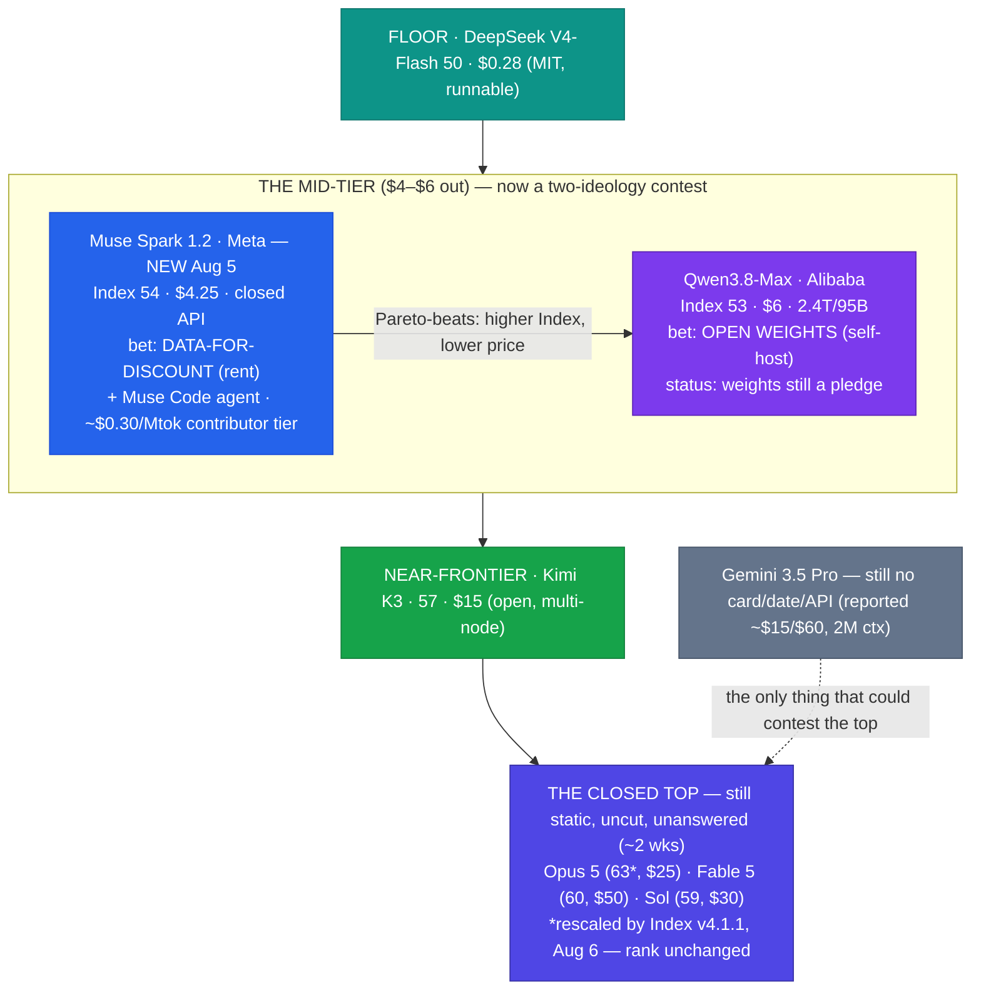

# LLM Updates — 2026-Aug-07

Friday brief, written Fri Aug 7 (Los Angeles time). Tuesday's brief (Aug-04) closed with a
map in which the **mid-price band had finally been filled** — by Alibaba's **Qwen3.8-Max**
(independent Index 53 at $6), landing in the gap between a cheap Chinese floor and a static
closed top. The through-line was blunt: **China now brackets the whole sub-Opus curve** —
floor (DeepSeek), middle (Qwen), near-frontier (Kimi K3) — while the closed frontier sits
untouched above. Tuesday left four things open: (1) do the Qwen3.8 **open weights** actually
ship; (2) does Artificial Analysis finalize Qwen above or below **53**; (3) does **Gemini 3.5
Pro** turn its "live on Arena" rumor into a model card; (4) does **anyone answer at the
frontier**.

The single fact that matters this window: **the mid-tier that Qwen filled on Monday got a US
contestant by Wednesday — and it wins on the numbers.** On **Wed Aug 5**, Meta's
Superintelligence Labs shipped **Muse Spark 1.2** (its third model in four months) at an
Artificial Analysis Intelligence Index of **54**, priced **$1.25 / $4.25 per Mtok** — a point
that sits **above and to the left of Qwen3.8-Max (53 / $6)**, i.e. it **Pareto-dominates** the
Chinese entrant: a higher independent Index at a lower price, two days later. Meta shipped it
alongside **Muse Code**, a terminal coding **agent** (its Claude Code / Codex answer), and
did so as a **closed, cloud-only** product with a novel **data-for-discount "contributor"
tier** — which matters because Meta is the company that made **open weights** mainstream with
Llama, and has now inverted that playbook in the exact band Qwen is trying to win with open
weights.

The second fact worth isolating: on **Thu Aug 6**, Artificial Analysis pushed **Intelligence
Index v4.1.1** — a grader/methodology **patch**, not a capability event — which nudged
absolute scores up a few points (Opus 5 now reads **63**, up from 61) while leaving the
**rankings intact**. Every number in prior briefs was v4.1; this brief flags where the scale
moved so the comparison stays honest.

This report advances only what is **new since Aug-04.** It does **not** re-derive the
Qwen3.8-Max launch and the claim-vs-measurement gap (Aug-04 §1–§3), the DeepSeek V4-Flash
Pareto spike (Aug-03 §1), the Opus 5 "top quality at mid price" reshuffle (Jul-25), the Kimi
K3 weight drop / hardware floor (Jul-30), or the Fable 5 tier split (Jul-20) — those are
unchanged (§4).

![Scatter plot of large language model intelligence versus API output price on a logarithmic price axis as of August 7 2026. The mid-price band Qwen3.8-Max filled on August 3 now has a second entrant: Meta's Muse Spark 1.2, released August 5, at Intelligence Index 54 for 4.25 dollars per million output tokens. It sits up and to the left of Qwen3.8-Max at index 53 for 6 dollars, so it Pareto-dominates the Chinese entrant with a higher Index at a lower price. Muse Code's contributor tier trades your code for training at about 0.30 dollars per million tokens, shown as a hollow marker far left. The two mid-tier entrants embody opposite strategies: Qwen is a promised open-weights model, Muse Spark 1.2 is a closed cloud-only API. The cheap floor holds DeepSeek V4-Flash at index 50 for 0.28 dollars and GPT-5.6 Luna at index 51 for 1.20 dollars. Kimi K3 sits at index 57 for 15 dollars. The static closed top is led by Claude Opus 5, rescaled to index 63 under Index v4.1.1 on August 6, at 25 dollars, still uncut and unanswered.](the_middle_gets_contested.svg)

---

## 1. Meta answers the middle — Muse Spark 1.2 Pareto-beats Qwen3.8-Max (Aug 5)

Two days after Alibaba planted Qwen3.8-Max in the empty mid-tier, **Meta Superintelligence
Labs shipped Muse Spark 1.2** — and it lands in the same band a notch higher and a dollar
cheaper.

**What it is:**

| Attribute | Muse Spark 1.2 |
|---|---|
| Vendor / lineage | Meta Superintelligence Labs; **3rd model in ~4 months** (Muse Spark 1.0 → 1.1 → 1.2) |
| Positioning | Proprietary, **closed / cloud-only** — **no public weights** |
| Independent intelligence | **Index 54** (Artificial Analysis, v4.1) — **+3 over Muse Spark 1.1 (51)**, +11 over 1.0 (43) |
| Price (Meta Model API) | **$1.25 in / $4.25 out** per Mtok · cached input **$0.15** |
| Coding benches | **Terminal-Bench 2.1 82.9%** (from 76.2) · **DeepSWE v1.1 59.3%** (from 53.0) |
| Shipped | **Wed Aug 5, 2026** |

**Why it is the story, not another mid-tier footnote:**

- **It Pareto-dominates Qwen3.8-Max.** Muse Spark 1.2 is **Index 54 at $4.25** output; Qwen3.8-Max
  is **Index 53 at $6**. That is a **higher independent Index at a ~29% lower output price** —
  a strictly better point on the map, delivered **two days after** the Chinese entrant. The
  "China owns the middle" framing from Aug-04 held for exactly 48 hours before a US closed lab
  put a better point in the same band.
- **It is a coding-first release with a real bench jump.** The 1.1→1.2 gain is concentrated on
  agentic coding (Terminal-Bench +6.7, DeepSWE +6.3), which is the workload the AA Index v4.1
  reweighting (Jul-31) rewards — so a coding upgrade shows up as an Index gain. Muse Spark 1.2
  now sits effectively level with **GPT-5.5 (55)** and **Grok 4.5 (54)**, just behind the
  Kimi-K3 / closed-top cluster.
- **It is closed, not open.** Meta — the Llama open-weights standard-bearer — shipped this as a
  metered API with **no weights** (continuing the Muse Spark 1.1 pivot flagged Jul-15). So the
  mid-tier is now a contest between an **open-weights pledge** (Qwen, §4) and a **closed API**
  (Meta), and on today's numbers the closed API is ahead. The self-hostable-mid-tier prize is
  still unclaimed because Qwen's weights haven't shipped (§4).

**Sources:**
[Artificial Analysis — Muse Spark 1.2 model page](https://artificialanalysis.ai/models/muse-spark-1-2) ·
[MarkTechPost — Meta releases Muse Code (beta), powered by Muse Spark 1.2](https://www.marktechpost.com/2026/08/05/meta-superintelligence-labs-releases-muse-code/) ·
[VentureBeat — Meta enters the AI coding wars with Muse Spark 1.2 and Muse Code](https://venturebeat.com/orchestration/meta-enters-the-ai-coding-wars-with-muse-spark-1-2-and-muse-code-with-persistent-async-background-agents) ·
[AiCybr — Meta Muse Code & Muse Spark 1.2: verified benchmarks & pricing](https://aicybr.com/blog/meta-muse-code-muse-spark-1-2-complete-guide) ·
[OrcaRouter — Muse Spark 1.2 & Muse Code: Meta's 3rd model in 4 months](https://www.orcarouter.ai/blog/meta-muse-spark-1-2-explained) ·
[Kingy — Muse Code benchmarks: Meta's 82.9% vs verified scores](https://kingy.ai/blog/muse-code-muse-spark-1-2-benchmarks-verified/)

---

## 2. Muse Code and the "data-for-discount" tier — Meta inverts its own Llama playbook (Aug 5)

The model is only half the release. Meta shipped it inside **Muse Code**, a terminal coding
**agent**, and priced it with a mechanism that is the actual strategic news.

- **Muse Code is an agent, not just a model.** It is a beta terminal CLI — Meta's direct answer
  to **Claude Code / OpenAI Codex** — giving Muse Spark 1.2 repository access, planning, tool
  use, worktrees, logging and crash recovery. Its distinctive design: **session-persistent
  async background agents** that stay alive across a session (rather than being spawned per
  task, avoiding redundant context-gathering and cutting steering overhead) plus an
  **append-only event log** for exact crash recovery. It is a product-layer move into the
  coding-agent wars, not only a leaderboard entry.
- **The "contributor" tier is the news.** Two prices: a **standard tier** ($1.25 / $4.25,
  cached $0.15) where prompts/completions are **not** used for training; and a **contributor
  tier** at roughly **$0.30 per Mtok total (~12× cheaper)** in exchange for **permission to
  train on your code**. This is a genuinely new commercial primitive: **pay with your data
  instead of dollars**.
- **It is the inversion of the Llama strategy.** Meta made open weights mainstream — free
  weights in exchange for ecosystem mindshare. Muse Code keeps the flywheel logic but swaps
  both sides of the trade: **cheap closed tokens in exchange for training data.** The company
  that competed by giving models away is now competing on **discounts and data**, in the same
  mid-tier band where Qwen is competing on **openness**. Same price zone, opposite ideologies.

**Why it matters.** The mid-tier is no longer a single-model story; it is a two-model contest
between two opposed ecosystem bets. And the data-for-discount tier reframes "cheap mid-tier
model" as a **privacy/IP decision** for buyers — the sticker price ($0.30/Mtok) is only cheap
if your code is not itself the asset you are trying to protect.

**Sources:**
[The Decoder — the company that made open weights mainstream now competes on discounts](https://the-decoder.com/the-company-that-made-open-weights-mainstream-now-competes-on-discounts/) ·
[BigGo Finance — Meta launches Muse Code: persistent background agents + a data-sharing tier](https://finance.biggo.com/news/202608052250_Meta_launches_Muse_Code_AI_coding_agent) ·
[Developers Digest — Meta ships Muse Code & Muse Spark 1.2: a 12× cheaper contributor tier](https://www.developersdigest.tech/blog/meta-muse-code-spark-1-2-release) ·
[Ecorpit — Muse Code contributor tier: cost vs. code confidentiality](https://ecorpit.com/meta-muse-code-contributor-tier-cost-vs-code-confidentiality-2026/) ·
[Verdent — what is Meta Muse Code? Features, pricing & Claude Code comparison](https://www.verdent.ai/guides/agents/what-is-muse-code)

---

## 3. Benchmark plumbing: Intelligence Index v4.1.1 rescales the map (Aug 6)

A methodology note that every number in these briefs now depends on. On **Thu Aug 6**,
Artificial Analysis shipped **Intelligence Index v4.1.1** — a **patch**, explicitly not a new
axis like the v4.1 agentic reweighting (Jul-31).

- **What changed:** upgraded **grader models** and refreshed one component benchmark (latest
  **τ³-Banking**). The stated goal was to keep the existing evaluation set reliable, not to
  re-rank the field.
- **What it did to scores:** absolute numbers drifted **up** with more robust grading. **Opus 5
  now reads 63** (from 61); AA characterized most movements as **under a point** with
  **rankings largely unchanged**, and singled out **Muse Spark 1.2 as the largest single mover
  (+2.7)**. So the leaderboard shape is the same; the y-axis just shifted up a few points.
- **Why it is here and not buried:** these briefs have quoted v4.1 numbers for weeks (Opus 5
  61, Fable 5 60, Sol 59, Kimi K3 57, Qwen 53, Muse Spark 1.2 54). Under v4.1.1 those read a
  couple points higher without any model getting smarter. **When this brief cites a v4.1.1
  number (Opus 5 63) it says so; when it reuses a prior v4.1 number for continuity it keeps the
  v4.1 value and flags the gap.** The one thing that did **not** change is the ordering — Opus
  5 is still #1 and still uncut (§4).

**Sources:**
[Artificial Analysis — Launching v4.1.1 of the Intelligence Index](https://artificialanalysis.ai/articles/artificial-analysis-intelligence-index-v4-1-1) ·
[Artificial Analysis — changelog](https://artificialanalysis.ai/changelog) ·
[Artificial Analysis Intelligence Index (evaluation page)](https://artificialanalysis.ai/evaluations/artificial-analysis-intelligence-index)

---

## 4. Unchanged / still-open since Aug-04 (watch-items)

- **Qwen3.8 open weights — still a pledge, still unshipped.** Tuesday's top watch-item. As of
  Aug 7 there is **no Hugging Face / ModelScope repo, no license text, and no model card** for
  Qwen3.8-Max or the promised **27B** sibling; the model remains **QwenCloud-only.** The
  "next week" window (≈Aug 10) is now imminent, so this should resolve within days — the
  precedent (Qwen 3/3.5 Apache-2.0 vs Qwen 3.7 API-only) still cuts both ways. Until a repo and
  license appear, the **open, self-hostable mid-tier** that would beat Meta's closed-API bet
  (§1–§2) does **not** exist.
- **Qwen3.8-Max Index — still preliminary 53, still below Kimi K3.** No third party moved it
  toward Alibaba's "second only to Fable 5" claim (Aug-04 §3). The v4.1.1 patch (§3) rescaled
  it slightly with everything else but did not change its rank; it remains **#2 Chinese open
  entrant, not #1**, and now sits **below Meta's Muse Spark 1.2** on both Index and price.
- **Gemini 3.5 Pro — still no model card.** Aug-04's "live on Arena, imminent" has not become a
  launch. Google's line as of this window is still **"testing with partners"**; there is **no
  official card, price, or API.** Reported (unofficial) specs are unchanged: **~2M-token
  context, Deep Think reasoning, ~$15 / $60 per Mtok.** Google's only shipped model this cycle
  remains the cheaper **Gemini 3.6 Flash** (Jul 21). It is still a leading indicator, not a
  contestant at Opus 5's point.
- **The top is still uncut and unanswered.** No flagship price move and no new Index-63+
  challenger: **Opus 5 stays $5/$25 (Index 63 on v4.1.1), Sol $30, Fable 5 $50.** Every release
  this window (Muse Spark 1.2, and the pending Qwen weights) landed **below** the frontier. The
  standing question — *does anyone answer at the ceiling?* — is still **no**, now ~2 weeks running.
- **Floor & near-frontier static.** **DeepSeek V4-Flash-0731** (Index 50, $0.28, MIT) unchanged
  at the floor; **Kimi K3** (Index 57, $15, custom license, multi-node hardware floor) still the
  top **open** model — Muse Spark 1.2 does not displace it (it is closed, and lower Index). The
  single-node distilled Kimi students are **still not out**.
- **Autonomy / policy axis quiet.** The **AI Kill Switch Act** (Lieu–Moran, Jul 23) and the
  **Pacing the Frontier** OpenAI+Anthropic endorsement (Jul 28–29) drew no new signatories or
  legislative action this window. **Sonnet 5** keeps its **$2/$10** intro pricing through
  **Aug 31**; the **Anthropic classifier false-positive fix** (Jul-03) is still unshipped.

**Sources:**
[AIToolsReview — Gemini 3.5 Pro: what's confirmed, benchmarks & pricing (Aug 2026)](https://aitoolsreview.co.uk/insights/gemini-3-5-pro) ·
[eesel AI — Gemini 3.5 Pro pricing (2026): the real numbers](https://www.eesel.ai/blog/gemini-3-5-pro-pricing) ·
[TestingCatalog — Qwen released Qwen3.8-Max with open weights "coming soon"](https://www.testingcatalog.com/qwen-released-qwen3-8-max-with-open-weights-coming-soon/) ·
[Yotta Labs — Qwen 3.8-Max: release date, specs, and how to access it](https://www.yottalabs.ai/post/qwen-3-8-max-release-date-specs-how-to-access-2026) ·
[felloAI — best AI models in August 2026](https://felloai.com/best-ai-models/) ·
[LLM Gateway — release timeline (Muse Spark 1.2 added Aug 5)](https://llmgateway.io/timeline)

---

## 5. The through-line — the mid-tier becomes a two-ideology contest, the top stays a monopoly

For six weeks these briefs tracked the **ceiling**; then the action moved to the **floor**
(Aug-03); then Qwen filled the **middle** (Aug-04) and the story became "China brackets the
whole sub-Opus curve." This window flips that read in two moves. First, the middle stopped
being a Chinese solo: **Meta put a strictly better point (Index 54 / $4.25) into the same band
Qwen just claimed (53 / $6)**. Second — and more durable — the two mid-tier entrants are not
just competing on a scatter plot, they are competing on **what an AI ecosystem is for**: Qwen
bets on **open weights you self-host**, Meta bets on **cheap closed tokens (or your code) you
rent**. The band Qwen filled is now the sharpest open-vs-closed proxy fight on the board.

| Thread (prior briefs) | Status on Aug 7 | Change |
|---|---|---|
| The mid-tier ($4–$6) | Two-model contest: Muse Spark 1.2 (54/$4.25) **Pareto-beats** Qwen3.8-Max (53/$6) (§1) | **new — US answer, wins the numbers (§1)** |
| Meta's strategy | Closed Muse Spark 1.2 + Muse Code agent + **data-for-discount** contributor tier (§2) | **new — Llama playbook inverted (§2)** |
| Coding-agent wars | Meta enters with **Muse Code** (Claude Code / Codex rival), persistent async agents (§2) | **new (§2)** |
| AA Intelligence Index | **v4.1.1** patch (Aug 6): grader upgrade, scores +few pts, **rankings intact** (§3) | **new — scale shift, not capability (§3)** |
| Qwen3.8 open weights | Still **no repo / license / card**; Aug-10 window imminent (§4) | unchanged — pending |
| Qwen3.8-Max Index | Still **53 (prelim)**, below Kimi K3 and now below Muse Spark 1.2 (§4) | unchanged |
| Gemini 3.5 Pro | Still **no card / date / API**; "testing with partners" (§4) | unchanged |
| Peak quality (closed) | Opus 5 **#1, uncut, unanswered** (Index 63 on v4.1.1) (§4) | unchanged |
| Autonomy / policy | No new action this window (§4) | unchanged |

The net: the "China takes the middle" story from Tuesday lasted two days. The middle is now a
**contested band with two opposite ecosystem bets**, and the better *point* today belongs to a
**US closed** model, not the Chinese open-weights pledge — precisely because those weights
still have not shipped. Above it, nothing moved: the closed top is a two-week monopoly with a
single hypothetical challenger (Gemini 3.5 Pro) that still has no model card. The whole board's
motion remains **below** Opus 5's line.

---

## Watch next

- **Qwen3.8 weights — ship or slip (≈Aug 10).** The single highest-leverage item. If the
  Max weights **and** the runnable 27B land under a permissive license, the open bet re-takes
  the mid-tier from Meta's closed API; if they slip or ship API-only (the Qwen 3.7 precedent),
  Meta's data-for-discount point stands as the mid-tier default (§1–§2, §4).
- **Does the data-for-discount tier get imitated — or regulated?** Meta's "pay with your code"
  contributor tier (§2) is a new commercial primitive; watch whether OpenAI/Google copy it and
  whether enterprise IP/privacy pushback (or policy) constrains it.
- **Gemini 3.5 Pro: card, or another slip.** Still the only thing that could pull competition
  back to the ceiling. Watch for an actual model card + price and whether its Index reaches
  Opus 5's 63 (§4).
- **Does anyone answer at the frontier?** Two weeks static. A flagship price cut or a genuine
  Index-63+ challenger remains the missing event (§4).
- **Muse Spark 1.2 under v4.1.1.** It was the largest rescale mover (+2.7, §3); watch where the
  finalized v4.1.1 number lands relative to the closed top and whether the coding-bench gains
  hold on independent agentic evals.

---

*Compiled Fri Aug 7 2026 (Los Angeles time) from public reporting and independent benchmark
trackers. Independent Intelligence Index figures are from Artificial Analysis: Muse Spark 1.2
54 (v4.1) / largest v4.1.1 rescale mover +2.7, Muse Spark 1.1 51, Qwen3.8-Max 53 (preliminary),
Kimi K3 57, DeepSeek V4-Flash-0731 50, GPT-5.6 Luna 51, GLM-5.2 51, GPT-5.6 Sol 59, Claude
Fable 5 60, and Claude Opus 5 61 under v4.1 / 63 under v4.1.1 (Aug 6). Muse Spark 1.2 specs
($1.25/$4.25, cached $0.15, Terminal-Bench 2.1 82.9, DeepSWE v1.1 59.3, closed/no-weights,
shipped Aug 5) and the Muse Code agent + ~$0.30/Mtok "contributor" data-sharing tier are
vendor-/press-reported and flagged as such. The Gemini 3.5 Pro figures (~$15/$60, ~2M context,
Deep Think) are unofficial reporting — Google has published no model card, price, or API. As in
prior compiles, many primary and publisher domains (Artificial Analysis, VentureBeat, The
Decoder, DataNorth, BenchLM, Medium, Bloomberg, CNBC among them) returned egress-blocked or
HTTP 403 to direct fetches during compilation, so figures are cited via the search index and
mirrored trackers where a direct read failed; the Muse Spark 1.2 / Muse Code figures are
corroborated across 5+ independent outlets. The v4.1.1 rescale is a grading-methodology change,
not a capability change — rankings are unchanged. Prior background is referenced by
date/section rather than repeated.*
