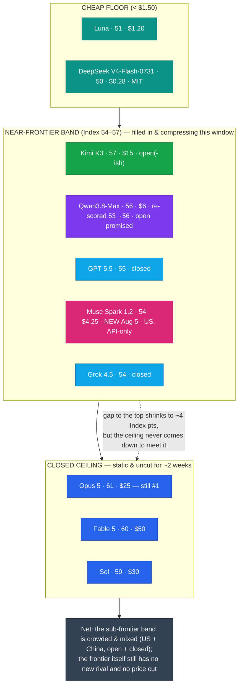

# LLM Updates — 2026-Aug-08

Friday brief, written Fri Aug 8 (Los Angeles time). Trace the arc of the last three briefs:
**Aug-03** mapped a market split into a **cheap floor** (~$0.28–$1.20) and an **expensive,
static top** (Opus 5 61 / $25, Fable 5 60 / $50, Sol 59 / $30) with **nothing in the middle**.
**Aug-04** reported that the empty middle got its first contestant — Alibaba's **Qwen3.8-Max**,
landing at a **preliminary Index 53** for $6 — and left two things open: whether Artificial
Analysis would finalize that 53 up or down, and whether anyone would ever answer at the
frontier.

The single fact that matters this window: **the near-frontier band is no longer a single
point — it is a crowd, and it is compressing toward a ceiling that still has not moved.** Two
developments did the crowding, and they cut against Aug-04's framing in an interesting way:

1. **Qwen3.8-Max was re-scored *upward*, 53 → 56.** Artificial Analysis said the original 53
   runs were hit by **intermittent issues on the endpoint being tested**; a re-run on
   Alibaba's public API landed the model at **56** — level with Claude Opus 4.8, ahead of
   every Google, Meta, and xAI model, and now only **~1 point behind** open-weights leader
   Kimi K3 (57). The Aug-04 watch-item resolved *toward* Alibaba's claim, not away from it.
2. **Meta shipped Muse Spark 1.2 (Aug 5) at Index 54 — bundled with a Claude-Code-style
   terminal agent, Muse Code.** It is Meta's **third model in four months** (1.0 = 43 in
   April → 1.1 = 51 in July → 1.2 = 54), and it is a **US, API-only, no-open-weights** entrant
   crowding the exact same band as the Chinese open models.

So the near-frontier band (roughly **Index 54–57**) now holds Muse Spark 1.2 (54), GPT-5.5
(55), Qwen3.8-Max (56), Grok 4.5 (54), and Kimi K3 (57) — all sitting **just below** a closed
ceiling (Sol 59, Fable 60, Opus 61) that has had **no price cut and no Index-61+ challenger
for ~2 weeks.** Aug-04's clean "China owns everything below the frontier" story is complicated:
the mid/near-frontier band is now a **mixed US-plus-China cluster**, not a Chinese monopoly.

This report advances only what is **new since Aug-04.** It does **not** re-derive the DeepSeek
V4-Flash-0731 Pareto spike and the Luna −80% cut (Aug-03 §1, Jul-31 §1), the AA Index v4.1
agentic reweighting (Jul-31 §3), the Opus 5 "top quality at mid price" reshuffle (Jul-25
§1–§3), the Kimi K3 weight drop / hardware floor (Jul-30 §1–§4), the Meta metered-API pivot
(Jul-15 §2), or the Fable 5 tier split (Jul-20 §1) — those are unchanged (§4).

![Scatter plot of large language model intelligence versus API output price on a logarithmic price axis as of August 8 2026. The near-frontier band between Intelligence Index 54 and 57 has filled with contestants sitting just below a closed ceiling that has not moved in about two weeks. Alibaba's Qwen3.8-Max was re-scored upward from 53 to 56 after Artificial Analysis blamed intermittent endpoint issues for the original run, shown by an arrow rising from index 53 to 56 at 6 dollars per million output tokens. Meta's new Muse Spark 1.2 enters at index 54 for 4.25 dollars output, bundled with a terminal coding agent called Muse Code, and is a US model with no open weights. The open-weight near-frontier model Kimi K3 sits at index 57 for 15 dollars. The cheap floor holds DeepSeek V4-Flash-0731 at index 50 for 0.28 dollars and GPT-5.6 Luna at index 51 for 1.20 dollars. The static, expensive closed ceiling is GPT-5.6 Sol at index 59 for 30 dollars, Claude Fable 5 at index 60 for 50 dollars, and Claude Opus 5 at index 61 for 25 dollars, still number one and still uncut.](near_frontier_band_crowds.svg)

---

## 1. Qwen3.8-Max re-scored 53 → 56 — the Aug-04 watch-item resolves toward the claim (Aug 4–7)

Aug-04 §3 isolated a **6–7-point gap** between Alibaba's vendor claim ("second only to Fable
5," implying Index ~59–60) and the independent **preliminary 53**, and made "does AA finalize
above or below 53?" the top watch-item. It finalized **above**.

- **What changed.** Artificial Analysis re-ran the evaluation and now scores **Qwen3.8-Max at
  56** on the Intelligence Index (v4.1). AA attributed the earlier **53** to **intermittent
  issues on the endpoint being tested**; the re-run was conducted on Alibaba's **public API**.
- **Where 56 places it.** The score is **level with Claude Opus 4.8 (max)** and **ahead of
  every model from Google, Meta, and xAI.** Only the closed top-tier (Anthropic's Opus 5 /
  Fable 5, OpenAI's Sol) and **Kimi K3 (57.1)** now sit above it. So Qwen3.8-Max is the **#2
  open(-ish) flagship, ~1 point behind Kimi**, not the ~4-point gap Aug-04 measured.
- **The claim-vs-measurement gap narrowed, but did not close.** At 56, Qwen is still **~3–4
  points below** the "second only to Fable 5" framing (~59–60). The honest read is that the
  vendor was **closer to right than Aug-04's 53 suggested** — the re-score moved the number
  toward the claim — but the "#2 in the world" headline is still not supported: Qwen sits in a
  crowded near-frontier band, not alone in second.
- **The cheaper-and-nearly-as-good angle holds.** Independent coverage frames it as
  "Qwen3.8-Max catches Opus 4.8, but **Kimi K3 still scores higher for ~25% less** per task" —
  i.e. within the open-weights race, Kimi remains the value leader on the Index even after
  Qwen's bump.

**Why it matters.** This is the second time this summer a Chinese flagship's *independent*
number moved up after launch-week caveats (rather than a vendor claim being trimmed down). The
prudent read is now **Index 56, verified on the public API** — carry that forward, not the
preliminary 53.

**Sources:**
[officechai — Qwen3.8-Max scores 56 on AA Intelligence Index, ahead of all US firms except Anthropic and OpenAI](https://officechai.com/ai/qwen-3-8-max-scores-56-on-artificial-analysis-intelligence-index-ahead-of-all-us-companies-except-anthropic-and-openai/) ·
[The Decoder — Qwen3.8-Max catches Claude Opus 4.8 but Kimi K3 still scores higher for 25% less](https://the-decoder.com/qwen3-8-max-catches-claude-opus-4-8-but-kimi-k3-still-scores-higher-for-25-percent-less/) ·
[Seoul Economic Daily — Alibaba says Qwen3.8-Max catches up to Kimi K3](https://en.sedaily.com/international/2026/08/04/alibaba-unveils-qwen-38-max-says-it-catches-up-to-kimi-k3) ·
[Kingy AI — Qwen3.8-Max benchmarks vs Kimi K3 & DeepSeek V4-Flash](https://kingy.ai/blog/qwen3-8-max-benchmarks-specs-kimi-k3-deepseek-v4-flash/) ·
[Trilogy AI — Qwen3.8-Max benchmark: how it compares with Kimi K3](https://trilogyai.substack.com/p/qwen-38-max-benchmark-how-it-compares) ·
[Yotta Labs — Qwen 3.8 benchmarks: what's actually verified so far](https://www.yottalabs.ai/post/qwen-3-8-benchmarks-what-is-verified-2026)

---

## 2. Meta ships Muse Spark 1.2 + Muse Code — a US, API-only entrant crowds the band (Aug 5)

The Jul-15 brief (§2) flagged Meta's pivot: the former Llama open-weights champion now ships
**metered, hosted, no-open-weights** models via the Meta Model API. Aug 5 was the next step,
and it came as a **pair** — a model and a coding-agent product.

**The model — Muse Spark 1.2:**

| Attribute | Muse Spark 1.2 |
|---|---|
| Intelligence | **Index 54** (Artificial Analysis launch figure; one AA model page lists 57 — see caveat) |
| Price | **$1.25 in / $4.25 out** per Mtok (unchanged from 1.1) |
| Weights | **API-only — no open-weights release** (continues the Jul-15 pivot) |
| Cadence | Meta's **3rd model in 4 months**: 1.0 = 43 (Apr) → 1.1 = 51 (Jul) → 1.2 = 54 |
| Cost-efficiency | **~$0.40 per Intelligence Index task** — among the cheapest at its level (vs $0.51 GPT-5.6 Terra, $0.86 Kimi K3, $1.18 GPT-5.5) |

- **Where 54 places it.** It ties **Grok 4.5 (54)**, sits just under **GPT-5.5 (55)**, and lands
  in the **same near-frontier band** (54–57) as Qwen3.8-Max (56) and Kimi K3 (57) — but
  **below** the closed ceiling (Sol 59, Fable 60, Opus 61). AA framed it as putting Meta "next
  to SpaceXAI in a tie for third place" among the labs it tracks.
- **The +3 in a month is the story of the cadence, not the ceiling.** Meta gained **8 Index
  points in three months** (Jul-15 §2) and another **+3** now. It is closing distance fast at
  a **fixed low price** — the classic "cheapest at each intelligence level" play — but has not
  reached the frontier.
- **This is why Aug-04's framing needs an asterisk.** Aug-04 concluded the entire sub-Opus
  curve was **Chinese open weights** (DeepSeek / Qwen / Kimi). Muse Spark 1.2 is a **US model
  with closed weights** sitting right in that band. The near-frontier is a **mixed cluster**,
  and the "efficiency" axis is now contested by a US lab too.

**The product — Muse Code (beta):**

- **Meta's answer to Claude Code / OpenAI Codex / Google's Antigravity CLI** — the first
  coding-specific product out of Meta Superintelligence Labs, a **terminal coding agent**
  powered by Muse Spark 1.2. Ships in beta for macOS and Linux.
- **Technique angle worth flagging:** Meta says Muse Spark 1.2 was **co-trained with the
  harness itself** (model and agent scaffold trained together rather than a model dropped into
  a generic loop), it **coordinates multiple persistent subagents** per task, and it keeps a
  **local append-only event log** of every model call, tool run, approval, and edit that Meta
  calls **"replay-exact and restart-safe."** Reporting also notes a **~12× cheaper contributor
  tier** for the agent product.
- **Why it matters.** The frontier competition is increasingly **model + agent harness as one
  product**, not a raw model on a leaderboard. Co-training the model with its own coding
  harness is the architecture story here — the same direction the closed labs took with their
  first-party CLIs.

**Caveat (scraping ambiguity).** AA's launch announcement and multiple outlets report Muse
Spark 1.2 at **Index 54**; one AA model-page scrape surfaced **57**. Treat **54** as the
launch composite (it is the figure in AA's own announcement and the "$0.40/task" cost note);
the 57 is unreconciled and may reflect a later re-run or a variant. Flagged, not resolved.

**Sources:**
[Meta AI Research — Introducing Muse Code and Muse Spark 1.2](https://research.meta.ai/blog/introducing-muse-code-and-muse-spark-1-2) ·
[Artificial Analysis (X) — "Muse Spark 1.2 scores 54… tie for third place"](https://x.com/ArtificialAnlys/status/2085116732231028882) ·
[Artificial Analysis (X) — Muse Spark 1.2 cost-efficiency ($0.40/Index task)](https://x.com/ArtificialAnlys/status/2085116738023399710) ·
[officechai — Meta releases Muse Spark 1.2, jumps to Index 54](https://officechai.com/ai/meta-releases-muse-spark-1-2-jumps-to-score-of-54-on-artificial-analysis-intelligence-index/) ·
[MarkTechPost — Meta releases Muse Code (beta), a terminal coding agent](https://www.marktechpost.com/2026/08/05/meta-superintelligence-labs-releases-muse-code/) ·
[The Register — Meta wants to get inside your terminal with its new coding agent](https://www.theregister.com/ai-and-ml/2026/08/06/meta-wants-to-get-inside-your-terminal-with-its-new-coding-agent/5283717) ·
[Forbes — Meta launches Muse Code, powered by Spark 1.2](https://www.forbes.com/sites/jonmarkman/2026/08/06/meta-launches-muse-code-a-new-ai-coding-agent-powered-by-spark-12/) ·
[Developers Digest — Muse Code + Spark 1.2: a terminal agent with a 12× cheaper contributor tier](https://www.developersdigest.tech/blog/meta-muse-code-spark-1-2-release) ·
[daily.dev — Meta releases Muse Spark 1.2, its third model in four months](https://daily.dev/posts/meta-releases-muse-spark-1-2-its-third-model-in-four-months-w7fg7hcmv)

---

## 3. The shape of the board — a compressing near-frontier band under a frozen ceiling

Put the two new points on the map with the standing ones and the pattern is clear: the
**distance between the best sub-frontier model and the closed top has shrunk to ~4 Index
points**, and that gap is now filled with a *crowd*, not a gap.

| Tier | Models (Index · $/Mtok out) | Weights |
|---|---|---|
| **Closed ceiling (static ~2 wks)** | Opus 5 (61 · $25) · Fable 5 (60 · $50) · Sol (59 · $30) | closed |
| **Near-frontier band (54–57) — crowded** | Kimi K3 (57 · $15) · **Qwen3.8-Max (56 · $6, re-scored ↑)** · GPT-5.5 (55) · **Muse Spark 1.2 (54 · $4.25, NEW)** · Grok 4.5 (54) | mixed: Kimi/Qwen open(-ish), Muse Spark **closed**, others closed |
| **Cheap floor (<$1.50)** | Luna (51 · $1.20) · DeepSeek V4-Flash-0731 (50 · $0.28, MIT) | mixed |

- **The compression is the trend.** On Aug 3 the middle was empty and the nearest sub-ceiling
  point was Kimi at 57 with a 4-point gap to Opus. That gap has not widened — instead it has
  **filled in underneath**: four or five models now sit within 3 points of Kimi, all within
  ~4 points of the closed top. Buyers who don't need the absolute frontier have more real
  options at a fraction of the ceiling's price than at any point this summer.
- **The ceiling is the immovable object.** Every new release this window landed **below 57**.
  Opus 5 stays #1 at **61 / $25**, uncut; Fable 5 **$50**, Sol **$30** — no flagship price
  move, no Index-61+ challenger. The Aug-03/Aug-04 watch-item "does anyone answer at the
  frontier?" is still **no**, now for **~2 weeks**.
- **The framing correction from Aug-04.** The near-frontier is **not** all-Chinese-open. It is
  a **mixed cluster** — two open(-ish) Chinese models (Kimi, Qwen), one closed US model (Muse
  Spark 1.2), plus closed GPT-5.5 and Grok 4.5. The competitive axis below the frontier is
  **price-per-intelligence**, and both US and Chinese labs are pushing it.

---

## 4. Unchanged since Aug-04 (no material development)

- **Qwen3.8 open weights — still not shipped.** The Aug-04 "pledge, not a shipment" status
  holds. The drop for **Qwen3.8-Max + the Qwen3.8-27B** on Hugging Face / ModelScope is now
  scheduled for the **week of Aug 10**; at compile time there is still **no repository and no
  published license**. Qwen 3.5/3.6 shipped Apache-2.0 — but Qwen 3.7 broke the pattern
  (API-only), so the license remains the open question. Still the top thing to verify.
- **Gemini 3.5 Pro — still absent.** No model card, no API entry (stable or preview), no
  pricing, no date as of Aug 8. Reported specs unchanged (2M-token context, strengthened Deep
  Think, ~$15/$60). Google's shipped model this cycle remains **Gemini 3.6 Flash** (Jul 21);
  Gemini 3.5 Flash scores **50** on the Index, Gemini 3.1 Pro Preview **46** — the gap the Pro
  must close at GA is unchanged. Google is still the lone frontier lab off the board.
- **The top is still uncut.** Opus 5 **$5/$25** (identical to Opus 4.8), Sol **$30**, Fable 5
  **$50**. No flagship price move; the "half price" framing still refers to Opus 5 vs Fable 5,
  not a cut to Opus 5 itself.
- **DeepSeek V4-Flash-0731** (Index 50, $0.28, MIT) remains the Pareto floor (Aug-03 §1); no
  follow-on this window.
- **Kimi K3** — open #1 at **57.1**, custom (non-OSI) license, multi-node hardware floor
  (Jul-30 §4). Qwen's re-score to 56 brings it to **~1 point behind** but does not displace it.
  The single-node 14B–30B distilled Kimi students are **still not out.**
- **Sonnet 5** keeps its **$2/$10** introductory pricing through **Aug 31** (reverts to $3/$15).
  **Anthropic classifier false-positive fix** (Jul-03 §1) still unshipped. **Autonomy/policy
  axis** (AI Kill Switch Act; OpenAI+Anthropic "Pacing the Frontier" endorsement) drew no new
  action this window.

**Sources:**
[testingcatalog — Qwen released Qwen3.8-Max with open weights coming soon](https://www.testingcatalog.com/qwen-released-qwen3-8-max-with-open-weights-coming-soon/) ·
[explainx.ai — Qwen3.8-Max coding & Cowork: still no weights (August 2026)](https://www.explainx.ai/blog/qwen3-8-max-coding-cowork-august-2026) ·
[Digital Applied — Qwen3.8 open weights: check this before downloading](https://www.digitalapplied.com/blog/qwen3-8-open-weights-checklist-before-download) ·
[AIToolsReview — Gemini 3.5 Pro: what's confirmed, benchmarks & pricing (August 2026)](https://aitoolsreview.co.uk/insights/gemini-3-5-pro) ·
[OrcaRouter — Gemini 3.5 Pro on Arena: release-date reality check](https://www.orcarouter.ai/blog/gemini-3-5-pro-release-date) ·
[The Register — Anthropic debuts Opus 5 at half the price of its Fable sibling](https://www.theregister.com/ai-and-ml/2026/07/25/anthropic-debuts-opus-5-at-half-the-price-of-its-fable-sibling/5278630) ·
[Digital Applied — AI API pricing, August 2026: cuts, promos, and traps](https://www.digitalapplied.com/blog/ai-api-pricing-august-2026-cuts-promos-tracker) ·
[llm-stats — AI updates & model releases (August 2026)](https://llm-stats.com/llm-updates)

---

## 5. The through-line — the market compresses from below, not from the top

For six weeks these briefs tracked whether anyone could **answer the ceiling**. This window
gives the clearest "no" yet — and reframes where the action actually is. Nobody is pushing the
frontier *up* or pulling its *price* down. Instead, the whole field is **compressing from
below**: model after model piles into the **54–57 near-frontier band** at a **fraction of the
ceiling's price**, so the practical gap between "good enough" and "the best" keeps shrinking
even though the best hasn't budged.

| Thread (prior briefs) | Status on Aug 8 | Change |
|---|---|---|
| AA finalize Qwen3.8-Max (Aug-04 watch) | **Re-scored 53 → 56** (endpoint-issue re-run); level w/ Opus 4.8, ~1 pt behind Kimi (§1) | **resolved — moved up toward the claim (§1)** |
| A new frontier-adjacent release | **Meta Muse Spark 1.2 (Aug 5), Index 54, + Muse Code agent** (§2) | **new — but from the US, API-only (§2)** |
| "China owns everything below the top" (Aug-04 §5) | Near-frontier band is now a **mixed US+China / open+closed cluster** (§2, §3) | **revised — not a Chinese monopoly (§3)** |
| Model + agent as one product | Meta co-trains Muse Spark 1.2 **with the Muse Code harness** (§2) | **new — architecture/technique angle (§2)** |
| Does anyone answer at the frontier? | **No** — no Index-61+ model, no flagship price cut, ~2 weeks static (§3, §4) | unchanged — still open (§3) |
| Qwen3.8 open weights + license | **Still not shipped**; now targeted week of Aug 10 (§4) | unchanged — still pending (§4) |
| Gemini 3.5 Pro | **Still no card / API / date** (§4) | unchanged (§4) |
| Cheapest useful model | DeepSeek V4-Flash-0731: 50 / $0.28 / MIT | unchanged (§4) |

The net: Monday the middle was empty; Tuesday it had one Chinese point; **Friday it is a
crowded, mixed band pressed right up against the ceiling.** The two forces to watch are now
opposite in direction — **everything below the frontier is racing up and getting cheaper**,
while **the frontier itself sits perfectly still.** The first lab to either cut a flagship
price or ship an Index-62+ model breaks the two-week stalemate; until then, the smart-money
story is the shrinking premium for "the very best."

---

## Watch next

- **Do the Qwen3.8 weights actually ship the week of Aug 10 — and under what license?** The
  "open, runnable mid-tier" thesis still rests entirely on the promised Hugging Face /
  ModelScope drop of Qwen3.8-Max **and the 27B**. Watch for the repos, the license text
  (Apache-2.0 like 3.5/3.6, or gated like 3.7?), and whether the 27B is genuinely
  workstation-runnable. Now overdue by a week.
- **Does Meta's cadence continue — and does Muse Spark cross into the ceiling?** Three models
  in four months (+8 then +3 Index) is the fastest climb on the board. Watch whether a Muse
  Spark 1.3 / larger variant reaches the 59–61 band, and whether Muse Code's "co-trained
  harness" approach shows up in coding-agent benchmarks against Claude Code / Codex.
- **Gemini 3.5 Pro — the still-missing ceiling contestant.** The only unshipped model that
  could plausibly land at Index 61+. Watch for a model card, price, and a real API entry — its
  absence is now the single biggest overhang at the frontier.
- **Does the ceiling ever move?** Two weeks static. The first flagship price cut **or** the
  first Index-62+ model is the event that ends the "compress from below" regime — and neither
  has happened.
- **Autonomy/policy follow-through.** The Kill Switch Act and the OpenAI+Anthropic pacing
  endorsement remain the slower axis; no new signatories or legislative action this window.

---

*Compiled Fri Aug 8 2026 (Los Angeles time) from public reporting and independent benchmark
trackers. Independent Intelligence Index figures (Qwen3.8-Max 56 — re-scored from a
preliminary 53 that AA attributed to endpoint issues; Muse Spark 1.2 54 at launch, with one AA
model page showing 57; Kimi K3 57.1; GPT-5.5 55; Grok 4.5 54; GPT-5.6 Sol 59; Claude Fable 5
60; Claude Opus 5 61; DeepSeek V4-Flash-0731 50; GPT-5.6 Luna 51; Gemini 3.5 Flash 50) are
from Artificial Analysis. Muse Spark 1.2 pricing ($1.25/$4.25), the ~$0.40/Index-task
cost-efficiency figure, the "3rd model in 4 months" cadence, and the Muse Code product details
(terminal agent, co-trained harness, persistent subagents, replay-exact event log, ~12× cheaper
contributor tier) are vendor-/press-reported and flagged as such. As in prior compiles, many
primary and publisher domains (Artificial Analysis, The Decoder, officechai, BenchLM among
them) returned HTTP 403 / egress-blocked errors to direct fetches during compilation, so
figures are cited via the search index and mirrored trackers where a direct read failed. The
Muse Spark 1.2 launch score is reported as 54 by AA's own announcement and multiple outlets; a
single AA model-page reference to 57 is noted but unreconciled. The Qwen3.8-Max 56 re-score is
corroborated across multiple outlets. Prior background is referenced by date/section rather
than repeated.*
