# LLM Updates — 2026-Aug-09

Sunday brief, written Sun Aug 9 (Los Angeles time). The last four briefs tracked one question
from four angles: **does anyone answer the frontier?** Aug-03 mapped a split market (cheap
floor, static expensive top, empty middle). Aug-04 filled the middle with Qwen3.8-Max. Aug-08
showed the near-frontier band (Index 54–57) getting **crowded** and compressing toward a
ceiling (Sol 59 / Fable 60 / Opus 61) that had **not moved in ~2 weeks** — and it closed with
one loose end it could not reconcile: Muse Spark 1.2 reading **54 at launch but 57 on one AA
model page.**

The single fact that matters this window is quiet but consequential: **the ceiling's *number*
went up, but by a change of ruler, not a change of model.** On **Aug 6, Artificial Analysis
shipped Intelligence Index v4.1.1** — a *patch*, not a new benchmark set — and it did two
things at once:

1. It **re-numbered the whole board upward** by a small amount (Opus 5 now reads **~63**, Fable
   5 **~62**), while leaving the **ordering completely unchanged** and — crucially — leaving
   **prices and models untouched.** AA's own summary: *"most models move by less than a point…
   the same models hold the top of the leaderboard."*
2. It **resolved the exact loose end Aug-08 flagged.** The one model that moved materially is
   **Muse Spark 1.2 (+2.7 points), now 57** — the *largest single increase* in the patch. The
   "54 vs 57" the Friday brief could not reconcile was simply **v4.1 (54) vs v4.1.1 (57).** No
   mystery, no re-run of the model — a grader change.

So the six-week story survives the re-numbering intact: **nobody answered the frontier this
window either.** No new model shipped (Aug 6–9), no flagship price was cut, and the leaderboard
order is the same as Friday. What changed is the *measuring stick*, and the one model it
flattered most is a **US, API-only** entrant. This brief is about **what a methodology patch
does and does not tell you** — and it explicitly does **not** re-derive the Muse Spark 1.2 /
Muse Code launch (Aug-08 §2), the Qwen3.8-Max 53→56 re-score (Aug-08 §1), the DeepSeek Pareto
spike (Aug-03 §1), the Opus 5 reshuffle (Jul-25), or the Kimi K3 weight drop (Jul-30).

![Slopegraph of Artificial Analysis Intelligence Index scores before and after the v4.1.1 patch released August 6 2026. The left column shows v4.1 scores carried through the August 8 brief; the right column shows v4.1.1 scores now published. Claude Opus 5 rises from 61 to about 63 and stays number one; Claude Fable 5 rises from 60 to about 62; GPT-5.6 Sol rises from 59 to about 60; Kimi K3 moves from 57 to about 58. Meta's Muse Spark 1.2 makes the single largest move, rising 2.7 points from 54 to 57, so its right-hand endpoint lands exactly where Kimi K3 sat before the patch. Artificial Analysis states most models moved less than a point and only Muse Spark 1.2 moved materially, so the roughly two-point lift at the top is finer rounding and snapshot noise rather than a capability jump. The ordering is unchanged and no new model and no price cut occurred.](index_ruler_moved_slopegraph.svg)

---

## 1. Intelligence Index v4.1.1 (Aug 6) — a grader patch, not a new race (the Aug-08 brief missed it)

The Aug-08 brief carried its numbers on **v4.1** and stated "AA Index v4.1 current." That was
already one patch behind: AA had shipped **v4.1.1 on Aug 6**. This brief incorporates it. It is
a **patch release**, not a re-weighting — the nine evaluations and their weights are the same
v4.1 agentic set (Jul-31 §3): GDPval-AA v2, τ³-Banking, Terminal-Bench v2.1, SciCode, AA-LCR,
AA-Omniscience, Humanity's Last Exam, GPQA Diamond, CritPt.

**What actually changed — two things, both about *grading*, not the questions:**

- **The grader models were upgraded.** Three of the free-response evals — **Humanity's Last
  Exam, AA-LCR, and AA-Omniscience** — are now graded by **GPT-5.6 Luna (medium)**, replacing
  the previous graders **GPT-4o, Qwen3-235B-A22B-2507, and Gemini 3 Flash Preview**
  respectively. In other words, the model-as-judge that scores the leaderboard was itself
  updated to a current-generation model. (Worth sitting with: the ranking of frontier models
  now depends on a frontier-ish model doing the grading.)
- **τ³-Banking was updated to v1.0.1** (Sierra's latest upstream), with an *improved grader
  pipeline that resolves correctness errors in trajectories that recover from "unhappy
  paths."* Previously, a model that hit an error and then recovered could be mis-scored; the
  fix credits the recovery. Models good at error-recovery in agentic banking tasks benefit
  most.

**The net effect AA reports:** *"The effect on scores is small: most models move by less than a
point on the Intelligence Index. However, there was one notable exception: the largest increase
occurred for Muse Spark 1.2 (xhigh), +2.7 points… and the same models hold the top of the
leaderboard."* All published AA scores now use v4.1.1.

**Why it matters.** Three things follow, and they cut against a naive reading of the new
numbers:

1. **The ceiling's higher number is mostly a ruler artifact.** Opus 5 reads **~63** now vs the
   **61** the Aug-08 brief printed — but AA says the true per-model delta is **under a point**
   for everything at the top. The Friday brief's integer "61" simply rounded a v4.1 value that
   the patch nudged; it is **not** a capability jump and **not** a new model. Anyone comparing
   "63 today" to "61 on Friday" as if the frontier advanced would be reading rounding as
   progress.
2. **Muse Spark 1.2 is the one real mover — and it was the biggest beneficiary of a grading
   change, not a model update.** Meta did not ship a new Muse Spark this window; the same Aug-5
   model gained **+2.7** purely from the grader/τ³ patch. That is a genuine effect (better
   error-recovery credit and a stronger grader flattered it more than its peers), but it means
   its climb from **54 → 57 is part-capability, part-methodology.** On the current ruler, a
   **US, API-only** model now sits at **57** — exactly where open-weight leader **Kimi K3** sat
   before the patch (the slopegraph endpoint that lands on Kimi's old line).
3. **It resolves Aug-08's own caveat.** The Friday brief flagged Muse Spark as "AA launch
   figure 54; one AA model page lists 57 — unreconciled." The reconciliation is trivial in
   hindsight: **54 was v4.1, 57 is v4.1.1.** Carry **57** forward as the current number.

**Sources:**
[Artificial Analysis — Launching v4.1.1 of the Intelligence Index](https://artificialanalysis.ai/articles/artificial-analysis-intelligence-index-v4-1-1) ·
[Artificial Analysis (X) — "updated to v4.1.1… upgrades grader models, brings latest τ³-Banking"](https://x.com/ArtificialAnlys/status/2085458318269759746) ·
[Artificial Analysis — Intelligence Index (evaluation page, now v4.1.1)](https://artificialanalysis.ai/evaluations/artificial-analysis-intelligence-index) ·
[Artificial Analysis — Muse Spark 1.2 model page (57)](https://artificialanalysis.ai/models/muse-spark-1-2) ·
[Artificial Analysis — changelog](https://artificialanalysis.ai/changelog) ·
[Artificial Analysis — τ³-Banking leaderboard](https://artificialanalysis.ai/evaluations/tau3-banking)

---

## 2. The re-numbered board — same order, higher absolute figures, wide mirror-to-mirror spread

Here is the board translated onto the current ruler, with the Aug-08 (v4.1) figures alongside
so the shift is visible. Treat the v4.1.1 column as **approximate**: AA's headline figures and
third-party mirrors disagree at the decimal, and only two numbers are firm (Muse Spark's +2.7
→ 57, and AA's statement that everything else moved <1 pt).

| Tier | Model | v4.1 (Aug-08 brief) | v4.1.1 (current) | Weights | Note |
|---|---|---|---|---|---|
| **Closed ceiling** | Opus 5 | 61 | **~63** (63.1 on one mirror) | closed | still #1; <1-pt true delta |
| | Fable 5 | 60 | **~62** (62.1) | closed | |
| | Sol (GPT-5.6) | 59 | **~60** | closed | |
| **Near-frontier band** | Kimi K3 | 57.1 | **~58** (one source 60) | open(-ish) | open #1; mirror spread widest here |
| | Qwen3.8-Max | 56 | **56** (AA v4.1.1 not yet re-published) | open *promised* | carry 56; verify on re-publish |
| | GPT-5.5 | 55 | **~55** | closed | |
| | **Muse Spark 1.2** | 54 | **57** (**+2.7, the one real move**) | closed (US, API-only) | biggest patch beneficiary |
| | Grok 4.5 | 54 | **~54–55** | closed | |
| **Cheap floor** | Luna (GPT-5.6) | 51 | **~51** | closed | now also the *grader* for 3 evals |
| | DeepSeek V4-Flash-0731 | 50 | **~50** | MIT | Pareto floor |

- **The order is intact.** Opus 5 → Fable 5 → Sol at the top; the 54–58 band below; the floor
  at 50–51. v4.1.1 shifted *levels*, not *ranks*.
- **"Who is #1" is now leaderboard-dependent — and the mirrors disagree more than the patch
  moved anything.** On **AA v4.1.1**, Opus 5 leads (~63). On the **LLM Stats composite (Aug 7
  snapshot)**, **GPT-5.6 Sol is #1 at 57.2**, ahead of Opus 5 (56.5) and Fable 5 (56.3) — a
  *different* composite (blends public benchmarks, live API measurements, price, and arena)
  that flips the top two. BenchLM's headline still shows "Opus 5 leads at 60.7%" (a v4.1-era
  figure not yet patched). **The dispersion between trackers (~3 pts at the top, and a flipped
  #1) is now larger than v4.1.1's own effect** — a reminder that a single decimal from any one
  index is noise, and the *shape* (a static top, a crowded 54–58 band, a cheap floor) is the
  signal.
- **Qwen3.8-Max is the gap in the patch.** At compile time, an AA v4.1.1 figure for Qwen was
  not clearly re-published (some trackers show no fresh AA number); carry the **56** from the
  Aug-08 re-score and re-verify once its v4.1.1 line appears. This is the one near-frontier cell
  that is genuinely unresolved on the new ruler.

**Sources:**
[BenchLM — Artificial Analysis Intelligence Index leaderboard (Aug 2026)](https://benchlm.ai/benchmarks/artificialanalysis) ·
[LLM Stats — leaderboard / updates (Aug 7 snapshot)](https://llm-stats.com/llm-updates) ·
[Swfte — AI Model Leaderboard, August 2026](https://www.swfte.com/ai/leaderboard) ·
[Fenxi — Opus 5 vs GPT-5.6 Sol vs Fable 5 vs Kimi K3 (2026)](https://fenxi.fr/en/blog/claude-opus-5-vs-gpt-5-6-sol-vs-fable-5-vs-kimi-k3-which-ai-model-2026/) ·
[Artificial Analysis — Kimi K3 model page](https://artificialanalysis.ai/models/kimi-k3) ·
[DataLearner — AA Quality Index leaderboard](https://www.datalearner.com/en/leaderboards/external/aa-quality-index)

```mermaid
flowchart TB
    P["Intelligence Index v4.1.1 &#183; PATCH shipped Aug 6<br/>(same 9 evals, same weights as v4.1 &#8212; only grading changed)"]:::patch
    P --> G["Grader models upgraded:<br/>HLE, AA-LCR, AA-Omniscience now graded by<br/>GPT-5.6 Luna (medium) &#8212; replacing<br/>GPT-4o / Qwen3-235B / Gemini 3 Flash"]:::change
    P --> T["tau3-Banking &#8594; v1.0.1 (Sierra):<br/>fixes mis-scoring of trajectories that<br/>recover from 'unhappy paths'"]:::change
    G --> E["Effect (per AA):<br/>most models move &lt; 1 pt;<br/>top order unchanged (Opus 5 still #1)"]:::effect
    T --> E
    E --> M["ONE material move:<br/>Muse Spark 1.2 +2.7 &#8594; 57<br/>(US, API-only &#8212; biggest patch beneficiary;<br/>reaches Kimi K3's pre-patch slot)"]:::muse
    E --> N["Ceiling NUMBER rises (Opus ~61&#8594;63)<br/>but by RULER, not model:<br/>no new model, no price cut, order intact"]:::net
    M --> N

    classDef patch fill:#7c3aed,stroke:#5b21b6,color:#ffffff;
    classDef change fill:#0ea5e9,stroke:#0369a1,color:#ffffff;
    classDef effect fill:#0d9488,stroke:#0f766e,color:#ffffff;
    classDef muse fill:#db2777,stroke:#9d174d,color:#ffffff;
    classDef net fill:#334155,stroke:#0f172a,color:#ffffff;
```

---

## 3. Unchanged since Aug-08 (no material development this weekend)

- **Qwen3.8 open weights — the deadline is now *this coming week*, and it is still a pledge.**
  Aug-08 put the drop for **Qwen3.8-Max + Qwen3.8-27B** at "week of Aug 10." That window
  **starts tomorrow.** As of Sun Aug 9 there is **still no repository on the Qwen org page**,
  **no license text**, and **no model card**. Some coverage now says the weights are *intended*
  under **Apache-2.0** (matching Qwen 3.5/3.6, unlike the API-only Qwen 3.7) — but that remains
  *reported intent*, not a shipped license. This is the **single biggest verifiable event on
  the near-term calendar**: watch for the actual repos, the license, and whether the 27B is
  genuinely workstation-runnable. Now overdue by a week and about to be tested.
- **Gemini 3.5 Pro — still absent.** No model card, no API entry (stable or preview), no
  pricing, no date as of Aug 9. Google's position (Jul 21) remains "testing with partners"; the
  GA target has slipped past June, July, and a widely-reported Jul 17 date. Google's shipped
  model this cycle is still **Gemini 3.6 Flash** (Jul 21). Still the lone frontier lab off the
  board, and the only unshipped model that could plausibly land at the top of the ruler.
- **No new model shipped Aug 6–9.** The most recent frontier release remains **Muse Spark 1.2
  (Aug 5)**; no OpenAI, Anthropic, xAI, or Google launch this weekend. The "does anyone answer
  the frontier?" watch-item is **still open** — now for **~2.5 weeks** since Opus 5 (Jul 24).
- **The top is still uncut on price.** Opus 5 **$5/$25**, Sol **$30**, Fable 5 **$50**. The
  v4.1.1 re-numbering changed no price. **Muse Spark 1.2** stays **$1.25/$4.25**; its
  ~$0.40/Index-task efficiency now buys a **57** rather than a 54 — a better deal on paper, from
  the ruler, not a price move.
- **The floor and the open leader hold.** DeepSeek V4-Flash-0731 (~50, $0.28, MIT) is still the
  Pareto floor; Kimi K3 (~58 on the new ruler) is still the open #1 with its multi-node
  hardware floor and single-node distilled students still unshipped.
- **Sonnet 5** keeps **$2/$10** intro pricing through **Aug 31** (reverts to $3/$15). The
  **Anthropic classifier false-positive fix** (Jul-03 §1) is still unshipped. The
  **autonomy/policy axis** (AI Kill Switch Act; OpenAI+Anthropic "Pacing the Frontier"
  endorsement) drew **no new action** this window.

**Sources:**
[Digital Applied — Qwen3.8 open weights: check this before downloading](https://www.digitalapplied.com/blog/qwen3-8-open-weights-checklist-before-download) ·
[Developers Digest — Qwen3.8-Max ships; open weights next week](https://www.developersdigest.tech/blog/qwen-3-8-max-release-2026) ·
[explainx.ai — Qwen3.8-Max: still no weights (August 2026)](https://www.explainx.ai/blog/qwen3-8-max-coding-cowork-august-2026) ·
[Coursiv — Gemini 3.5 Pro: release date, rumors & what Google confirmed](https://coursiv.io/blog/gemini-3-5-pro) ·
[fello AI — Best AI models in August 2026](https://felloai.com/best-ai-models/) ·
[llm-stats — LLM news today (August 2026)](https://llm-stats.com/ai-news) ·
[The Register — Anthropic debuts Opus 5 at half the price of its Fable sibling](https://www.theregister.com/ai-and-ml/2026/07/25/anthropic-debuts-opus-5-at-half-the-price-of-its-fable-sibling/5278630)

---

## 4. The through-line — when the frontier is frozen, watch the ruler

For six weeks the briefs asked whether anyone could push the ceiling *up* or pull its price
*down*. The answer this weekend is still **no** — and the interesting twist is *how* the
answer arrived. The ceiling's headline number **did** rise (Opus 5 to ~63), which could read
like motion. It isn't. **AA changed the measuring stick, not the market.** The graders got
better, τ³-Banking learned to credit error-recovery, and the whole board floated up a point —
except **Muse Spark 1.2**, which floated up **three**, purely because a US, API-only model
happened to be the biggest beneficiary of a grading fix.

That is the lesson worth carrying: **in a frozen frontier, the number that moves is often the
ruler.** Two independent signals confirm the market itself is static — (1) **no model shipped**
Aug 6–9, and (2) **no price changed.** Meanwhile the **cross-tracker spread is now wider than
the patch's effect**: AA says Opus 5 #1 at ~63, LLM Stats says Sol #1 at 57.2, BenchLM still
shows a v4.1-era 60.7. When the trackers disagree by more than any real model moved, the honest
read is the *shape*, not the decimal — and the shape is unchanged from Friday: a **static top**,
a **crowded 54–58 band** (now with a US closed model sharing the top of it), and a **cheap
floor**.

| Thread (prior briefs) | Status on Aug 9 | Change |
|---|---|---|
| Muse Spark "54 vs 57" (Aug-08 §2 caveat) | **Resolved: 54 = v4.1, 57 = v4.1.1** (+2.7 grader patch) (§1) | **resolved — a ruler change, not a re-run (§1)** |
| Does anyone answer the frontier? | **No** — no new model Aug 6–9, no price cut; ~2.5 wks static (§3) | unchanged — still open (§3) |
| Is the "frozen ceiling at 61" real? | Ceiling now reads **~63**, but by **methodology**, not a model (§1) | **re-numbered — same order, no capability gain (§1)** |
| Qwen3.8 open weights + license | **Still not shipped**; window starts **tomorrow**; Apache-2.0 reported as intent (§3) | unchanged — imminent, now testable (§3) |
| Gemini 3.5 Pro | **Still no card / API / date** (§3) | unchanged (§3) |
| Which tracker is authoritative? | AA (Opus #1), LLM Stats (Sol #1), BenchLM (v4.1-era) disagree by >the patch (§2) | **new caveat — read the shape, not the decimal (§2)** |
| Cheapest useful model | DeepSeek V4-Flash-0731 (~50 / $0.28 / MIT) | unchanged (§3) |

The net: on Friday the ceiling was "frozen at 61 for two weeks." This weekend it reads "63" —
and it is **still frozen**, because the only thing that moved was the ruler. The events that
would actually break the two-and-a-half-week stalemate — a flagship price cut, an Index-62+
*model* (on any consistent ruler), or the Qwen weights actually landing — have **not**
happened. The first of those is now genuinely on the clock: **the Qwen window opens tomorrow.**

---

## Watch next

- **Qwen3.8 weights — the window opens tomorrow (Aug 10).** The "open, runnable mid-tier"
  thesis rests entirely on this drop. Watch for the actual **Hugging Face / ModelScope repos**,
  the **license** (Apache-2.0 as reported-intent, or gated like 3.7?), a **v4.1.1 AA line for
  Qwen** (the one near-frontier cell still unresolved on the new ruler), and whether the **27B**
  is genuinely workstation-runnable. This is the most concrete near-term event on the board.
- **Does the ceiling ever move for real?** ~2.5 weeks with no new model and no price cut. The
  first flagship price cut **or** the first Index-62+ *model* (not a re-numbering) ends the
  "frozen frontier" regime. Neither has happened.
- **Gemini 3.5 Pro — the still-missing contestant.** The only unshipped model that could
  plausibly top the current ruler. Its absence is the single biggest overhang at the frontier.
- **Does Muse Spark's +2.7 hold up in independent coding benchmarks?** The patch flattered
  Meta's model most; watch whether Muse Code's "co-trained harness" (Aug-08 §2) shows the same
  strength in third-party agentic-coding tests, or whether the +2.7 was mostly the τ³-Banking
  recovery-credit fix.
- **Tracker convergence.** Watch whether LLM Stats / BenchLM / others re-baseline onto v4.1.1
  and whether the "who's #1" disagreement (Opus vs Sol) narrows — or whether the frontier is
  now genuinely too close to call across methodologies.

---

*Compiled Sun Aug 9 2026 (Los Angeles time) from public reporting and independent benchmark
trackers. The lead development — Artificial Analysis Intelligence Index **v4.1.1**, a patch
shipped **Aug 6** — is corroborated across AA's own announcement, its X post, and its changelog:
it upgrades grader models (HLE, AA-LCR, AA-Omniscience now graded by GPT-5.6 Luna medium,
replacing GPT-4o / Qwen3-235B-A22B-2507 / Gemini 3 Flash Preview) and updates τ³-Banking to
v1.0.1, with the reported net effect "most models move <1 pt; largest increase Muse Spark 1.2
+2.7; same models hold the top." Absolute v4.1.1 figures shown for the top of the board
(Opus 5 ~63 / 63.1, Fable 5 ~62 / 62.1, Sol ~60, Kimi K3 ~58) are **approximate**: only Muse
Spark's +2.7 → 57 and AA's "<1 pt for everything else" statement are firm, and mirrors disagree
at the decimal (LLM Stats' Aug-7 composite ranks Sol #1 at 57.2 over Opus 5 56.5; BenchLM still
shows a v4.1-era 60.7). Qwen3.8-Max's v4.1.1 line was not clearly re-published at compile time;
the Aug-08 re-score of 56 is carried forward and flagged for re-verification. As in every prior
compile, many primary and publisher domains (Artificial Analysis, BenchLM, fello AI, OrcaRouter
among them) returned egress-blocked / HTTP-403 errors to direct fetches, so figures are cited
via the search index and mirrored trackers where a direct read failed. Prior background is
referenced by date/section rather than repeated.*
