# LLM Updates — 2026-Aug-11

Tuesday brief, written Tue Aug 11 (Los Angeles time). The last three briefs traced one arc:
**Aug-03** split the market into a **cheap floor** and an **expensive, static top** with **nothing
in the middle**; **Aug-04** put Alibaba's Qwen3.8-Max into that middle; **Aug-08** reported the
middle had become a **crowd** — a compressing **near-frontier band (Index 54–57)** pressed up
against a **frozen closed ceiling** (Sol 59 / Fable 60 / Opus 61) — and characterized Meta, on the
strength of Muse Spark 1.2 + Muse Code, as a **"US, API-only, no-open-weights"** entrant continuing
its Jul-15 pivot away from open source.

**That last characterization was overtaken by events within three days.** The single fact that
matters this window: **Meta shipped an *open*, Apache-2.0, on-device model — Muse Glimmer 30B
(Aug 10) — reversing the "Meta quit open weights" read exactly as Alibaba let its own open-weights
promise lapse.** The lab everyone had written off for open source delivered the open release; the
lab that *promised* one missed its window. Two developments define the window, and both cut against
Aug-08's framing:

1. **Meta released Muse Glimmer 30B (Aug 10) under Apache-2.0** — a dense 30B multimodal model
   **distilled from the closed Muse Spark**, purpose-built for **agentic** work, that runs on a
   **single 24 GB consumer GPU**. This makes Meta's strategy a deliberate **two-track fork**, not a
   one-way pivot to closed: a **closed, hosted, frontier-adjacent** flagship (Spark 1.2) *and* an
   **open, on-device** distilled child (Glimmer). It is Meta's **fourth model in ~four months.**
2. **Qwen3.8's promised open weights missed their window.** Aug-08's top watch-item — "do the
   Qwen3.8 weights ship the week of Aug 10, and under what license?" — resolved **negative**: the
   week passed with **no Hugging Face / ModelScope repository, no license text, and no new date.**

Meanwhile the **closed ceiling did not move** for a third straight brief: **no Index-62+ model, no
flagship price cut** — now static for **~2.5 weeks.** The Aug-08 question "does anyone answer at the
frontier?" is still **no.**

This report advances only what is **new since Aug-08.** It does **not** re-derive the Qwen3.8-Max
re-score to 56 (Aug-08 §1), the Muse Spark 1.2 launch at 54 + Muse Code (Aug-08 §2), the
near-frontier-band compression map (Aug-08 §3), the DeepSeek V4-Flash-0731 Pareto floor (Aug-03
§1), the Luna −80% cut (Jul-31 §1), the Kimi K3 open-weights release / hardware floor (Jul-30), or
the Opus 5 "top quality at mid price" reshuffle (Jul-25) — those are unchanged (§4).

![Diagram of Meta's two-track model strategy as of August 11 2026. From a root labelled Meta Superintelligence Labs, two branches fork. The left, closed and hosted, is Muse Spark 1.2 (Aug 5): Intelligence Index 54, priced 1.25 in / 4.25 out per million tokens, API-only with no open weights, bundled with the Muse Code terminal agent, aimed at the frontier-adjacent band. The right, open and on-device, is new this window: Muse Glimmer 30B (Aug 10) under Apache-2.0, a dense 30-billion-parameter multimodal model distilled from Muse Spark, scoring 35 on the Intelligence Index (well above the median of 9 for open models its size), 256k context, purpose-built for agentic tool use, leading MCP-Atlas at 75.5 and AIME-2026 at 94.7. An arrow from Spark to Glimmer is labelled logit distillation, closed teacher to 30B student. Below Glimmer is its on-device inference stack: 4-bit quantization shrinking it from about 55 GB to under 20 GB to fit a single 24 GB consumer GPU, plus a DFlash 16-token block speculative-decoding drafter giving a 3.1x decode speedup on an RTX 5090. A dashed box at lower left notes the irony of the window: Alibaba's Qwen promised to open Qwen3.8-Max and a 27B during the week of August 10, but the window passed with no repository, no license, and no new date, so the open-weights momentum came from Meta, the lab written off as having quit open source, not from Qwen, which had promised it.](meta_two_track_fork.svg)

---

## 1. Meta ships Muse Glimmer 30B (Aug 10) — an *open*, Apache-2.0, on-device agentic model

Aug-08 §2 read Muse Spark 1.2 + Muse Code as Meta "continuing the Jul-15 pivot" to **metered,
hosted, no-open-weights** models, and folded Meta into the closed camp. **Three days later Meta
released open weights** — and not under the restrictive Llama Community License it always used
before, but under a **permissive Apache-2.0** license that places almost no restriction on
commercial use or derivatives. Outlets framed it exactly as a reversal: *The Register* — "Zuck
rekindles open weights Llama drama"; VentureBeat — "Meta returns to open source"; AI Business —
"Meta reverses course."

**The model — Muse Glimmer 30B:**

| Attribute | Muse Glimmer 30B |
|---|---|
| License | **Apache-2.0** — Meta's first; every prior Meta open release used the Llama Community License |
| Architecture | **Dense 30B**, multimodal (**text + vision in, text out**), with a dedicated perception encoder |
| Origin | **Distilled from the closed Muse Spark** (logit distillation) — a "student" of the hosted flagship |
| Intelligence | **Index 35 (high)** on Artificial Analysis — vs a **median of ~9** for open models its size |
| Context | **256k tokens**; knowledge cutoff **Jan 2026** |
| Focus | **Purpose-built agentic** — tool-call orchestration, scheduling, document work, code assist |
| Hardware | Fits **one 24 GB consumer GPU** (4-bit ≈ **<20 GB**) or a Mac — **no network call** |
| Availability | Hugging Face (`meta-models/Muse-Glimmer-30B`), Ollama, vLLM recipes; BF16 + GGUF k-quants + ExecuTorch builds + the DFlash drafter |

- **Where it's strong — and where it isn't.** Glimmer is tuned for **agent loops**, and the
  benchmarks reflect that: it **leads its size class** on **MCP-Atlas** (multi-step tool-call
  orchestration) at **75.5** — vs 54.2 for Gemma4-31B and 62.5 for Qwen3.6-27B — and posts
  **DeepSearch-QA 74.6, Gaia2 43.3, SWE-Bench Pro 51.2, AIME-2026 94.7.** But it **trails**
  Qwen3.6-27B on **computer-use / terminal** work: **OSWorld-Verified 65.9 vs 75.6**,
  TerminalBench 2.1 60.7, SWE-Bench Verified 77.2. The honest read: **best-in-class open model for
  tool orchestration and reasoning at 30B; not the leader for GUI/terminal control.**
- **This is not a return to the *old* Meta play.** Llama was a big open model competing on raw
  capability. Glimmer is a **small, distilled, on-device agent brain** — a different bet: put a
  capable-enough agent **on the user's own hardware, privately, for free**, and keep the
  frontier-adjacent intelligence **hosted and paid** (Spark). That is the two-track structure the
  diagram above makes explicit.

**Why it matters.** The open-weights story this summer had been **all-China** (DeepSeek, Qwen,
Kimi). Aug-08 already complicated "China owns the near-frontier"; this window complicates "China
owns *open*." The most consequential open release of the window is a **US, Apache-2.0, on-device**
model — and it is aimed squarely at the **on-device agent** niche none of the Chinese giants
(2.4T–2.8T-parameter flagships) target.

**Sources:**
[Meta AI Research — Introducing Muse Glimmer: an open agentic model that runs on your device](https://research.meta.ai/blog/introducing-muse-glimmer-open-agentic-model) ·
[VentureBeat — Meta returns to open source with Muse Glimmer, an Apache-2.0 30B for agents](https://venturebeat.com/technology/meta-returns-to-open-source-with-muse-glimmer-an-apache-2-0-licensed-30b-parameter-ai-model-optimized-for-agents-available-now) ·
[The Register — Zuck rekindles open weights Llama drama with Muse Glimmer](https://www.theregister.com/ai-and-ml/2026/08/10/zuck-rekindles-open-weights-llama-drama-with-muse-glimmer/5285666) ·
[MarkTechPost — Meta AI releases Muse Glimmer: a 30B open-weights agentic model that runs on one consumer GPU](https://www.marktechpost.com/2026/08/10/meta-ai-releases-muse-glimmer/) ·
[Artificial Analysis — Muse Glimmer (high): benchmarks and analysis](https://artificialanalysis.ai/models/muse-glimmer) ·
[Neowin — Meta releases Muse Glimmer, a 30B open agentic AI model that runs locally on PCs](https://www.neowin.net/news/meta-releases-muse-glimmer-a-30b-open-agentic-ai-model-that-runs-locally-on-pcs/) ·
[AI Business — Meta reverses course with open-weight Muse Glimmer](https://aibusiness.com/agentic-ai/meta-reverses-course-with-open-weight-muse-glimmer) ·
[orcarouter — Muse Glimmer vs Gemma4-31B vs Qwen3.6-27B: who's ahead?](https://www.orcarouter.ai/blog/muse-glimmer-explained)

---

## 2. The technique story — how a 30B model earns a seat *inside* a real agent loop

Glimmer is the clearest **on-device-agentic architecture** case study of the summer, and it is the
"techniques/architectures" content worth extracting from the window. An agent loop makes **many
sequential model calls per task**; latency, not just quality, decides whether a local model is
usable. Meta's answer stacks three techniques:

1. **Distillation, not from-scratch training.** Pre-training used **logit distillation on Muse
   Spark's outputs** (learn the teacher's full output distribution, not just hard labels).
   Mid-training added **longer-context, agent-heavy data with richer reasoning traces**;
   post-training combined **SFT + on-policy distillation + RL** across general, reasoning, coding,
   and agentic domains. The result is a small model that inherits the closed flagship's behavior on
   the trajectories that matter for agents.
2. **4-bit quantization to fit the GPU.** A 30B model needs **>55 GB at full precision**; Meta
   compresses weights to **~4-bit**, shrinking the language model to **under 20 GB** — inside a
   **24 GB** consumer card's budget.
3. **DFlash block speculative decoding to hit interactive speed.** Glimmer ships with a small
   companion **"drafter," DFlash**, that proposes a **block of 16 tokens at once**; the main 30B
   model then **verifies the whole block in a single parallel forward pass** instead of generating
   token-by-token. Meta reports **3.1× decode speedup on an RTX 5090**, **1.8× on an Apple M5 Max**,
   **1.5× on an M4 Max**.

```mermaid
flowchart LR
    subgraph TRAIN["TRAINING — distil a closed teacher into a small student"]
      SPARK["Muse Spark 1.2<br/>(closed, hosted teacher)"]:::teacher
      SPARK -->|"logit distillation<br/>(full output distribution)"| PRE["Pre-train 30B student"]:::step
      PRE --> MID["Mid-train:<br/>long-context, agent-heavy traces"]:::step
      MID --> POST["Post-train:<br/>SFT + on-policy distill + RL<br/>(reasoning · coding · agentic)"]:::step
      POST --> GLIM["Muse Glimmer 30B<br/>(open, Apache-2.0)"]:::open
    end
    subgraph SERVE["ON-DEVICE SERVING — earn a seat in the agent loop"]
      GLIM --> Q["4-bit quantization<br/>~55 GB → &lt; 20 GB"]:::serve
      Q --> D["DFlash drafter proposes<br/>a 16-token block"]:::serve
      D --> V["30B verifies the block in<br/>ONE parallel forward pass"]:::serve
      V --> SPD["3.1× decode / RTX 5090<br/>(1.8× M5 Max · 1.5× M4 Max)"]:::win
      SPD --> LOOP["fast enough for a real<br/>local agent loop — no network call"]:::win
    end

    classDef teacher fill:#2563eb,stroke:#1e40af,color:#ffffff;
    classDef open fill:#16a34a,stroke:#15803d,color:#ffffff;
    classDef step fill:#6366f1,stroke:#4338ca,color:#ffffff;
    classDef serve fill:#0d9488,stroke:#0f766e,color:#ffffff;
    classDef win fill:#7c3aed,stroke:#5b21b6,color:#ffffff;
```

**Why it matters.** The recipe is the point: the on-device frontier is being reached **by
distilling closed teachers into small students and pairing them with quantization + speculative
decoding**, not by training small models from scratch. It's the mirror image of the closed labs'
"model + agent harness as one product" (Aug-08 §2) — here the harness runs **locally**, and the
model was **shrunk to fit it**. Note the honesty caveat: the **35 Index / benchmark leads are
strong *for 30B*** but sit **far below** the 54–61 hosted band — this is a **fit-on-your-laptop**
model, not a frontier one.

**Sources:**
[Meta AI Research — Muse Glimmer: distillation + on-device serving (DFlash)](https://research.meta.ai/blog/introducing-muse-glimmer-open-agentic-model) ·
[explainx.ai — Muse Glimmer: Meta's 30B open model runs on 24 GB VRAM](https://explainx.ai/blog/meta-muse-glimmer-open-weight-30b-agentic-model-2026) ·
[kingy.ai — Muse Glimmer 30B: benchmarks, hardware & how to run](https://kingy.ai/blog/muse-glimmer-30b-benchmarks-hardware-run/) ·
[vLLM Recipes — meta-models/Muse-Glimmer-30B](https://recipes.vllm.ai/meta-models/Muse-Glimmer-30B) ·
[Moor Insights & Strategy — Muse Glimmer and recapturing the spark of Llama with open weights](https://moorinsightsstrategy.com/field-notes/metas-muse-glimmer-and-recapturing-the-spark-of-llama-with-open-weights/)

---

## 3. Qwen3.8's open weights missed the Aug-10 window — the Aug-08 watch-item resolves *negative*

Aug-08 §4 carried, as the **top thing to verify**, whether Qwen3.8-Max + Qwen3.8-27B would land on
Hugging Face / ModelScope **the week of Aug 10**, and under **what license** (Apache-2.0 like
3.5/3.6, or gated like 3.7). As of this compile (Tue Aug 11): **the week has passed, a Hugging Face
search for "qwen3.8" still turns up no official repository, no license has been named, and Alibaba
has not given a new date.**

- **Status: pledge lapsed, not fulfilled.** This is now the **second consecutive brief** the drop
  has slipped (Aug-04 "pledge, not a shipment" → Aug-08 "targeted week of Aug 10" → Aug-11
  "window missed"). The "open, runnable mid-tier" thesis that rested on this drop is **still
  entirely unrealized**; Qwen3.8-Max remains **API-only** at $2/$6 per Mtok.
- **The contrast with §1 is the story.** In the same window, **Meta — the lab Aug-08 filed under
  "no open weights" — shipped Apache-2.0 weights**, while **Alibaba — whose open-weights pledge was
  the reason to watch — did not.** The open-weights momentum this window came from the **opposite**
  direction than the running narrative pointed. Kimi K3 (open, 57) remains the open leader on the
  Index; nothing displaced it, because the model that might have (Qwen3.8-Max, 56) **still isn't
  open.**

**Why it matters.** A vendor's open-weights *promise* is not a release, and two missed windows in a
row make the caution concrete. Carry Qwen3.8-Max forward as **verified Index 56 but API-only**, and
treat the open-weights drop as **unshipped and now overdue**, not imminent — the exact inverse of
how Meta's release should be carried (**shipped, permissive, on-device**).

**Sources:**
[byteiota — Qwen3.8 open weights drop this week: read before you download](https://byteiota.com/qwen3-8-open-weights-drop-this-week-read-before-you-download/) ·
[Digital Applied — Qwen3.8 open weights: check this before downloading](https://www.digitalapplied.com/blog/qwen3-8-open-weights-checklist-before-download) ·
[Yotta Labs — Qwen3.8-Max: specs, pricing, benchmark status, and how to access it (2026)](https://www.yottalabs.ai/post/qwen-3-8-max-release-date-specs-how-to-access-2026) ·
[Developers Digest — Qwen 3.8 Max ships: 2.4T MoE, 1M context, $2/$6, open weights next week](https://www.developersdigest.tech/blog/qwen-3-8-max-release-2026) ·
[orcarouter — Qwen3.8-27B open weights: what we know before the drop](https://www.orcarouter.ai/blog/qwen-3-8-27b-open-weights-leak)

---

## 4. Unchanged since Aug-08 (no material development)

- **The closed ceiling is still frozen.** **Opus 5 (61, $5/$25) remains #1, uncut**; **Fable 5
  (60, $50)** and **Sol (59, $30)** unchanged. **No Index-62+ model and no flagship price cut this
  window** — the top has now been static for **~2.5 weeks.** Every release this window (Glimmer 35;
  the un-shipped Qwen weights) lands **far below** it. Sonnet 5 keeps its **$2/$10** intro pricing
  through **Aug 31** (reverts to $3/$15 on Sep 1).
- **The near-frontier band (54–57) is unchanged.** Kimi K3 (57, open), Qwen3.8-Max (56, API-only),
  GPT-5.5 (55), Muse Spark 1.2 (54), Grok 4.5 (54). No new entrant into the band and no re-scores
  this window (the Qwen 53→56 move was Aug-08 §1). **Glimmer does not enter this band** — at Index
  35 it plays in a different, on-device weight class.
- **Gemini 3.5 Pro — still absent.** No model card, no API entry, no price, no date as of Aug 11;
  Google says it is "testing with partners," and the live Pro tier remains **Gemini 3.1 Pro**
  ($2/$12), with **Gemini 3.6 Flash** (Jul 21) the shipped model this cycle. Google is still the
  lone frontier lab with no near-ceiling model on the board — unchanged.
- **DeepSeek V4-Flash-0731** (Index 50, $0.28, MIT) remains the **Pareto floor** (Aug-03 §1); no
  follow-on this window. Its parent architecture (V4-Pro/Flash: mHC residuals + Compressed Sparse
  Attention / DeepSeek Sparse Attention / Heavily Compressed Attention for ~1M-token efficiency)
  is standing background, not new this window.
- **Kimi K3** — open #1 at **57.1**, custom (non-OSI) license, multi-node hardware floor (Jul-30
  §4); the single-node distilled Kimi students are **still not out.** Muse Glimmer now occupies the
  "open + genuinely runnable on one GPU" slot the Kimi students were expected to fill — from a
  different lab.
- **GPT-5.6 Luna** (51, $1.20 after the −80% cut) and the rest of the cheap floor unchanged.
  **Autonomy/policy axis** (AI Kill Switch Act; OpenAI+Anthropic "Pacing the Frontier"
  endorsement) drew no new action this window.

**Sources:**
[Artificial Analysis — Intelligence Index leaderboard (Opus 5 leads; ceiling figures)](https://artificialanalysis.ai/) ·
[BenchLM — Artificial Analysis leaderboard (Aug 2026): Claude Opus 5 leads at 60.7%](https://benchlm.ai/benchmarks/artificialanalysis) ·
[eesel AI — Gemini 3.5 Pro: is it out yet? (2026)](https://www.eesel.ai/blog/gemini-3-5-pro) ·
[Tom's Hardware — AI companies race to the bottom as token prices crash](https://www.tomshardware.com/tech-industry/artificial-intelligence/ai-companies-are-now-racing-to-the-bottom-crashing-token-prices-and-competitive-models-push-companies-to-cut-costs) ·
[DeepSeek — DeepSeek V4 explained: V4-Pro 1.6T vs V4-Flash 284B (architecture)](https://deepseek.ai/deepseek-v4) ·
[felloai — Best AI models in August 2026](https://felloai.com/best-ai-models/)

---

## 5. The through-line — the open-weights baton passes west, the ceiling stays put

For weeks the two live questions were "**does anyone answer the ceiling?**" and "**who owns open
weights?**" This window answers neither the way the running narrative pointed. The ceiling was
answered again with **silence** — three briefs, ~2.5 weeks, no Index-62+ model and no flagship cut.
And the open-weights question flipped: the **US lab written off for abandoning open source shipped
the window's most notable open model**, on-device and Apache-2.0, while the **Chinese lab whose
open pledge was the thing to watch let its window lapse.**

| Thread (prior briefs) | Status on Aug 11 | Change |
|---|---|---|
| A new frontier-adjacent release | **None** — Glimmer is a 30B on-device model (Index 35), not a band entrant (§1, §4) | unchanged at the top (§4) |
| "Meta = US, API-only, no open weights" (Aug-08 §2) | **Reversed** — Meta ships Apache-2.0 Muse Glimmer 30B (§1) | **revised — Meta is two-track, not closed-only (§1)** |
| Model + agent as one product | Extended **on-device**: distill closed teacher → quant → DFlash speculation → local agent loop (§2) | **new — the on-device-agentic recipe (§2)** |
| Qwen3.8 open weights + license (Aug-08 top watch) | **Window missed** — no repo, no license, no new date (§3) | **resolved negative — pledge lapsed (§3)** |
| Who owns open weights? | Kimi K3 still open #1 (57); notable *new* open release is **US (Meta), on-device** (§1, §3) | **revised — not all-China (§1)** |
| Does anyone answer at the frontier? | **No** — no Index-62+, no flagship price cut, ~2.5 weeks static (§4) | unchanged — still open (§4) |
| Gemini 3.5 Pro | **Still no card / API / date** (§4) | unchanged (§4) |
| Cheapest useful model | DeepSeek V4-Flash-0731: 50 / $0.28 / MIT | unchanged (§4) |

The net: Aug-08 the story was "the middle is a crowded, mixed band pressed against an unmoving
ceiling." Aug-11 the **band and the ceiling are both unchanged** — the movement this window happened
**below and to the side**, where Meta opened a new front: **capable-enough, private, free, on-device
agents distilled from closed flagships.** The frontier is still a stalemate; the interesting
competition has partly moved **off the leaderboard and onto the user's own GPU.**

---

## Watch next

- **Does Meta's cadence — and its two-track commitment — hold?** Four models in ~four months, now
  spanning **closed-hosted *and* open-on-device**. Watch for (a) whether more of the Muse family
  ships open (a larger open Glimmer, or open Spark weights), (b) whether the **DFlash + distillation
  recipe** shows up in third-party on-device agent benchmarks, and (c) whether Glimmer's
  **computer-use/terminal gap** vs Qwen3.6-27B closes in a point release.
- **Do the Qwen3.8 weights *ever* ship — and does Meta's move pressure Alibaba?** The drop is now
  **two windows overdue.** Watch for the repos, the **license text**, and whether Meta beating
  Alibaba to an on-device open release accelerates or embarrasses the Qwen timeline.
- **Gemini 3.5 Pro — the still-missing ceiling contestant.** Still the only unshipped model that
  could plausibly land Index 61+. Its continued absence is the biggest overhang at the frontier.
- **Does the ceiling ever move?** ~2.5 weeks static. The first flagship price cut **or** the first
  Index-62+ model ends the "compress from below / expand to the side" regime — neither has happened.
- **On-device agents as a category.** If Glimmer validates "distill-a-closed-teacher → quantize →
  speculative-decode → run the agent locally," watch whether the closed labs answer with their own
  small open on-device agents, or cede the private/free tier.

---

*Compiled Tue Aug 11 2026 (Los Angeles time) from public reporting and independent benchmark
trackers. Independent Intelligence Index / agentic figures (Muse Glimmer 35 high; Muse Spark 1.2
54; Qwen3.8-Max 56; Kimi K3 57.1; GPT-5.5 55; Grok 4.5 54; GPT-5.6 Sol 59; Claude Fable 5 60;
Claude Opus 5 61; DeepSeek V4-Flash-0731 50; GPT-5.6 Luna 51; Gemini 3.1 Pro live) are from
Artificial Analysis. Muse Glimmer's architecture (dense 30B, distilled from Muse Spark), license
(Apache-2.0), benchmark leads (MCP-Atlas 75.5, DeepSearch-QA 74.6, Gaia2 43.3, SWE-Bench Pro 51.2,
AIME-2026 94.7; trails Qwen3.6-27B on OSWorld-Verified 65.9 vs 75.6 and TerminalBench/SWE-Bench
Verified), and the on-device stack (4-bit quant to <20 GB on a 24 GB GPU; DFlash 16-token block
speculative decoding, 3.1×/1.8×/1.5× decode speedups on RTX 5090 / M5 Max / M4 Max) are
vendor-/press-reported and flagged as such. As in prior compiles, many primary and publisher
domains (Artificial Analysis, Meta AI Research, MarkTechPost, Neowin among them) returned HTTP 403
/ egress-blocked errors to direct fetches during compilation, so figures are cited via the search
index and mirrored trackers where a direct read failed; each number is corroborated across multiple
outlets. The Qwen3.8 open-weights miss is reported as of Tue Aug 11 (no repository found; no new
date given). Prior background is referenced by date/section rather than repeated.*
