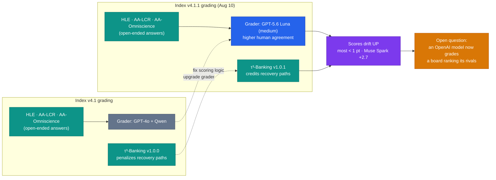

# LLM Updates — 2026-Aug-12

Wednesday brief, written Wed Aug 12 (Los Angeles time). For three straight briefs the spine
was a **frozen closed ceiling**: **Aug-04** put Qwen3.8-Max into the empty middle under a static
top; **Aug-08** described a compressing **near-frontier band (54–57)** pressed against a ceiling of
**Sol 59 / Fable 60 / Opus 61**; **Aug-11** reported Meta shipping the open, on-device Muse Glimmer
30B *below and to the side* of a ceiling that had been static **~2.5 weeks** — no Index-62+ model,
no flagship price cut.

**This window the ceiling number finally moved — and it moved for a reason that has nothing to do
with a new model.** Artificial Analysis shipped **Intelligence Index v4.1.1** (read Aug 10), a
patch that **upgraded its grader models** and refreshed **τ³-Banking**, nudging the whole board up;
the headline now reads **Opus 5 = 63** (was 61), **Fable 5 = 62** (was 60), **GPT-5.6 Sol = 61**
(was 59). No new frontier model shipped. The single fact that matters this window:

> **The ceiling rose 61 → 63, but the *ruler* changed, not the *territory*.** Every number the
> last three briefs cited was on the older v4.1 scale; the "frozen ceiling" didn't thaw — it got
> re-measured. The one model that could raise the ceiling on the *capability* axis — **Gemini 3.5
> Pro** — is still not out, though a rumor (unconfirmed) put its launch at **today, Aug 12.**

Two developments define the window, and a third resolves softer than Aug-11 implied:

1. **Index v4.1.1 rescored the entire leaderboard upward** (grader-model upgrade + τ³-Banking
   v1.0.1). Most models moved **< 1 point**; the **largest single mover was Meta's Muse Spark 1.2
   (+2.7)**. The top-three jump (≈ +2 each) also reflects the board now surfacing Opus 5's
   **max-effort** tier (63) over its **high-effort** tier (61).
2. **The grader change is itself the technique story:** three of the index's hardest evals (HLE,
   AA-LCR, AA-Omniscience) are now graded by **GPT-5.6 Luna**, replacing GPT-4o — an
   **LLM-as-judge** swap that raises the "who grades the graders?" question directly.
3. **Qwen3.8's open weights are still unshipped — but the window is officially open through
   Aug 16**, so Aug-11's "window missed" softens to **"still pending, still not shipped."**

![Diagram showing the top of the Artificial Analysis Intelligence Index leaderboard moving up between two index versions without any new model shipping. Two vertical score scales sit side by side: the left is version 4.1, the scale the previous three briefs used; the right is version 4.1.1, read on August 10 2026. Three closed frontier models are plotted on both and joined by arrows sloping gently upward: Claude Opus 5 moves 61 to 63, Claude Fable 5 60 to 62, and GPT-5.6 Sol 59 to 61. A separate orange point marks Meta's Muse Spark 1.2, the largest single mover at about plus 2.7 points from the grader change alone. A dashed caption states no new model shipped: the ceiling number rose because the ruler changed, from an upgraded grader pipeline in v4.1.1 and the leaderboard surfacing Opus 5's higher max-effort tier of 63 rather than its high-effort tier of 61. A dashed grey marker near the top labelled Gemini 3.5 Pro, still absent, marks the only unshipped model that could raise the ceiling on the capability axis.](ceiling_moved_on_the_ruler.svg)

This report advances only what is **new since Aug-11.** It does **not** re-derive the Muse Glimmer
30B open/on-device release + DFlash distillation recipe (Aug-11 §1–2), the Qwen3.8-Max re-score to
56 (Aug-08 §1), the Muse Spark 1.2 launch + Muse Code (Aug-08 §2), the near-frontier-band
compression map (Aug-08 §3), the DeepSeek V4-Flash-0731 Pareto floor (Aug-03 §1), or the Kimi K3
open-weights lead (Jul-30) — those are unchanged (§4), though **all of their Index numbers are now
on the superseded v4.1 scale** (see §1).

---

## 1. Index v4.1.1 rescored the whole board — the "frozen ceiling" thawed on the ruler, not the model

Every prior brief in this series anchored on a hard number: **Opus 5 = 61, Fable 5 = 60, Sol = 59**,
a near-frontier band of **54–57**, static for ~2.5 weeks. On **Aug 10 Artificial Analysis released
v4.1.1** of the Intelligence Index — a **patch**, explicitly not a new-model event — and the whole
board moved up. The headline leaderboard now reads:

| Model | v4.1 (prior briefs) | v4.1.1 (Aug 10) | Note |
|---|---:|---:|---|
| **Claude Opus 5** | 61 | **63** | still **#1**; headline now cites the **max-effort** tier |
| **Claude Fable 5** | 60 | **62** | #2 |
| **GPT-5.6 Sol** | 59 | **61** | #3 |
| **Claude Opus 4.8** | ~56 | **57** | — |
| **GPT-5.5** | 55 | **56** | — |
| **Muse Spark 1.2** (Meta) | 54 | **≈56.7** | **largest single mover, +2.7** (xhigh) |

- **What actually changed.** v4.1.1 is a **grader/robustness patch**, not a benchmark-set
  overhaul: it keeps the same nine evaluations (GDPval-AA v2, τ³-Banking, Terminal-Bench v2.1,
  SciCode, HLE, GPQA Diamond, CritPt, AA-Omniscience, AA-LCR) but (a) upgrades the **grader
  models** and (b) moves **τ³-Banking to v1.0.1** (Sierra), whose fixed grader pipeline now
  correctly credits agent trajectories that **recover from an unhappy path** instead of penalizing
  them. AA's own note: **most models move < 1 point**, with the **single biggest gain going to
  Muse Spark 1.2 (+2.7 at xhigh)** — because the recovery-path fix rewards exactly the kind of
  agentic retry behavior Meta tuned Spark for.
- **Why the top three jumped ~2, not < 1.** Two effects stack at the top. The v4.1.1 patch itself
  is small, but the leaderboard's **headline figure for Opus 5 shifted from the high-effort tier
  (61) to the max-effort tier (63)** — the same model, a different reasoning-budget setting. So the
  "61 → 63" is **part re-grade, part effort-tier relabel** — both **measurement** choices, neither
  a capability change.
- **The consequence for this series.** Every band number the Aug-03/04/08/11 briefs carried is now
  **on the superseded v4.1 scale.** Read forward, the ceiling is **Opus 5 = 63 / Fable 5 = 62 /
  Sol = 61**, and the near-frontier band shifts up roughly in step. **Nothing about the underlying
  capability ordering changed** — Opus 5 is still narrowly #1, Anthropic still holds the top two —
  but anyone diffing "61 last week, 63 this week" is looking at a **ruler change**, not progress.

**Why it matters.** The headline that will circulate — "the frontier just hit 63" — is an artifact
of a grading patch and an effort-tier relabel. The **capability** ceiling is exactly where Aug-11
left it: **no new frontier model, no flagship price cut.** The lesson the window teaches is a
methodological one — **a leaderboard number is a measurement, and the measurement instrument moves
too.** When a series like this one tracks a number week to week, an index-version bump is a
first-class event to flag, not a silent renumber.

**Sources:**
[Artificial Analysis — Launching v4.1.1 of the Intelligence Index](https://artificialanalysis.ai/articles/artificial-analysis-intelligence-index-v4-1-1) ·
[Artificial Analysis (X) — v4.1.1 patch: upgraded graders + latest τ³-Banking](https://x.com/ArtificialAnlys/status/2085458318269759746) ·
[BenchLM — AA Intelligence Index leaderboard (Aug 2026): Claude Opus 5 leads at 63.0%](https://benchlm.ai/benchmarks/artificialanalysis) ·
[Artificial Analysis — Intelligence Index v4.1: the shift toward agentic workloads (context)](https://artificialanalysis.ai/articles/artificial-analysis-intelligence-index-v4-1) ·
[Artificial Analysis — Opus 5: Fable-5-level intelligence at lower cost per task](https://artificialanalysis.ai/articles/opus-5) ·
[Artificial Analysis — Intelligence benchmarking methodology](https://artificialanalysis.ai/methodology/intelligence-benchmarking)

---

## 2. The technique story — the index now grades itself with GPT-5.6 Luna (LLM-as-judge)

The most interesting *techniques/architecture* content this window isn't in a model — it's in the
**evaluation pipeline** that ranks the models. v4.1.1's headline change is a **grader-model swap**,
and it exposes a structural fact about how the frontier is now measured: several of the hardest
benchmarks are **graded by another LLM**, and the choice of judge moves the scores.

- **What changed in the pipeline.** Three of the index's open-ended evaluations —
  **Humanity's Last Exam (HLE), AA-LCR (long-context reasoning), and AA-Omniscience** — are now
  graded by **GPT-5.6 Luna (medium)**, replacing the prior grader stack (GPT-4o and a Qwen model).
  AA selected Luna for **strong agreement with human judgment** in grader-validation runs. Separately,
  **τ³-Banking v1.0.1** ships a **fixed grader pipeline** that stops penalizing trajectories that
  recover after a wrong turn — a scoring-logic fix, not a task change.
- **Why a grader swap moves scores at all.** For free-form answers there is no exact-match key; a
  judge model decides whether a response is correct. A more capable, better-calibrated judge
  **credits partially-right and recovery answers more accurately**, which is why the patch nudged
  scores **up** across the board and lifted the most **agentic** model (Muse Spark, +2.7) the most.

- **The "who grades the graders?" wrinkle.** Using **GPT-5.6 Luna — an OpenAI model — to grade a
  leaderboard that ranks OpenAI's competitors** is defensible (AA validated it against human
  judgment, and the judge grades open-ended *correctness*, not style) but structurally worth
  flagging: the ranking instrument now has a **vendor** attached to it. AA mitigates this by using
  the judge only where it agrees closely with humans; the point for readers is simply that
  **frontier rankings increasingly rest on LLM-as-judge pipelines**, so a grader release is a
  ranking event.

**Why it matters.** As benchmarks saturate on multiple-choice, the field has moved to open-ended,
agentic tasks that **can't be graded by string-match** — so the grader is now part of the
measurement apparatus, and upgrading it re-prices every model at once. This window is a clean
example: **the same models, the same tasks, a better judge → a higher board.** For a tracker,
grader provenance and version now belong next to the score.

**Sources:**
[Artificial Analysis — v4.1.1: grader-model upgrade + τ³-Banking v1.0.1](https://artificialanalysis.ai/articles/artificial-analysis-intelligence-index-v4-1-1) ·
[Artificial Analysis — Intelligence benchmarking methodology (graders, evals)](https://artificialanalysis.ai/methodology/intelligence-benchmarking) ·
[Sierra — τ-bench / τ³-Banking agent evaluation](https://sierra.ai/blog/benchmarking-ai-agents) ·
[Presenc AI — Artificial Analysis Intelligence Index 2026: scores explained](https://presenc.ai/research/artificial-analysis-intelligence-index-2026) ·
[DataLearner — AA Quality Index leaderboard](https://www.datalearner.com/en/leaderboards/external/aa-quality-index)

---

## 3. Gemini 3.5 Pro — rumored for *today* (Aug 12), still unconfirmed and still not shipped

The one development that would move the ceiling on the **capability** axis (not the measurement
axis of §1) is **Gemini 3.5 Pro**, and this window produced a fresh — but still uncorroborated —
signal: **community rumor now points to an Aug 12 launch** (today). As of this compile Google has
**not** confirmed a date, and the model remains in **limited preview on Vertex AI**.

- **Status.** No public model card, no general API, no price. The **shipped** Google tier is still
  **Gemini 3.1 Pro** ($2/$12) with **Gemini 3.6 Flash** the current cycle's live model; Gemini 3.5
  Pro has now slipped past **I/O's June target and a July rumor**, with Bloomberg (Jul 16) reporting
  a delay tied to **hallucination rates and real-world reliability** falling short of Google's
  internal bar.
- **Rumored specs** (unconfirmed): a **2M-token context window** (double 3.5 Flash's 1M), an
  upgraded **Deep Think** reasoning layer, and large coding/agentic gains — positioned in leaks
  against Fable 5 at the top of the board.
- **Read.** Treat the Aug-12 date as **rumor until Google posts a card/API**. Two prior dates
  (June, July) came and went. This remains the **biggest overhang at the frontier**: the only
  plausible **Index-63+** contestant that isn't a re-grade of an existing model, and Google is
  still the lone frontier lab with no near-ceiling model on the public board.

**Why it matters.** §1 shows the ceiling *number* can move without a new model; Gemini 3.5 Pro is
the thing that would move the ceiling *for real*. Until it ships, "does anyone answer Opus 5 at the
frontier?" is still **no** — and the answer has now been no through a full index-version change.

**Sources:**
[NPowerUser — Gemini 3.5 Pro launch date leaked: Aug 12 release & features](https://nokiapoweruser.com/gemini-3-5-pro-launch-date-leaked-august-12/) ·
[NPowerUser — Gemini 3.5 Pro leak: benchmarks & Antigravity stealth test](https://nokiapoweruser.com/gemini-3-5-pro-leak-release-date-benchmarks-antigravity/) ·
[Coursiv — Gemini 3.5 Pro: release date, rumors, leaks & what Google confirmed](https://coursiv.io/blog/gemini-3-5-pro) ·
[CometAPI — Gemini 3.5 Pro release date & rumored specs (updated Jul 2026)](https://www.cometapi.com/gemini-3-5-pro-release-date-rumored-specifications-all-we-know-in-2026-updated-july-2026/) ·
[FutureSearch — When will Google release Gemini 3.5 Pro publicly?](https://futuresearch.ai/app/p/a/gemini-3-5-pro-public-release-date)

---

## 4. Qwen3.8 open weights — window "open through Aug 16"; softens Aug-11's "missed"

Aug-11 §3 recorded the Qwen3.8-Max + Qwen3.8-27B open-weights drop as a **missed window** (the week
of Aug 10 had passed with no repo). This window adds a nuance: multiple trackers now describe
Alibaba's **official window as running through Aug 16**, so the more precise status on Aug 12 is
**"still pending, still not shipped,"** not "definitively missed."

- **Status as of Aug 12.** The Qwen organization page on Hugging Face still shows **no matching
  `qwen3.8` repository**, **no license text**, and no new firm date — but the vendor's stated
  window has **not fully closed**. Qwen3.8-Max remains **API-only** at **$2/$6 per Mtok** (2.4T-param
  MoE, ~95B active, 1M context, text+image+video in).
- **Read.** Carry it as **overdue-but-not-yet-past-window**: this would be the **first Max-class
  open-weights release** in the Qwen line if it lands. The precedent still cuts both ways — Qwen
  3.5/3.6 were Apache-2.0 and runnable, but Qwen 3.7 shipped API-only. **The license text, when it
  appears, is the tell.**

**Why it matters.** The Aug-11 contrast still holds — **Meta shipped open (Glimmer) while Alibaba's
open pledge sits unfulfilled** — but honesty requires narrowing "missed" to "the clock is still
running, barely." If the weights land by Aug 16 under a permissive license, the near-frontier gets
its first genuinely open **56-class** (v4.1) model; if the window closes empty, it's a second clean
miss.

**Sources:**
[Neomanex — Qwen3.8-Max open-weights countdown: announced, not shipped](https://neomanex.com/news/qwen38-max-open-weights-countdown-aug-2026) ·
[Digital Applied — Qwen3.8 open weights: check this before downloading](https://www.digitalapplied.com/blog/qwen3-8-open-weights-checklist-before-download) ·
[byteiota — Qwen3.8 open weights drop this week: read before you download](https://byteiota.com/qwen3-8-open-weights-drop-this-week-read-before-you-download/) ·
[Yotta Labs — Qwen3.8-Max: specs, pricing, benchmark status & access (2026)](https://www.yottalabs.ai/post/qwen-3-8-max-release-date-specs-how-to-access-2026) ·
[DataCamp — Qwen3.8-Max: features, benchmarks, and pricing](https://www.datacamp.com/blog/qwen3-8-max)

---

## 5. Unchanged since Aug-11 (and what shipped *around* the frontier)

- **No new frontier model; no flagship price cut.** The capability ceiling is exactly Aug-11's:
  **Opus 5 #1** (now read **63** on v4.1.1, **61** on high-effort), **Fable 5 (62)**, **Sol (61)**.
  Static now for **~3 weeks** on capability. **Sonnet 5** keeps its **$2/$10** intro pricing through
  **Aug 31** (reverts to $3/$15 Sep 1).
- **Muse Glimmer 30B** (Meta, Apache-2.0, on-device, Index 35) is Aug-11's headline and now
  **background** — no new Muse release this window. Its **DFlash distillation recipe** (Aug-11 §2)
  stands as the on-device-agentic reference.
- **The near-frontier band** (Kimi K3 open #1, Qwen3.8-Max API-only, GPT-5.5, Muse Spark 1.2,
  Grok 4.5) is unchanged in **ordering**; only its **numbers** shift up under v4.1.1 (§1). No new
  entrant.
- **DeepSeek V4-Flash-0731** (Index 50 / $0.28 / MIT) remains the **Pareto floor** (Aug-03 §1); no
  follow-on. **GPT-5.6 Luna** (the cheap-floor OpenAI model, $1.20 after its −80% cut) picked up a
  **second job this window — grading the index** (§2).
- **Adjacent, not frontier.** The week's other releases were **media/agent tooling**, not new
  frontier LLMs: **ByteDance Seedance 2.5** (video, Aug 8) and **Qwen Image 3.0 Pro** on the media
  side; **Anthropic enabled Claude Code "Auto Mode"** on the agent-autonomy side — continuing the
  "describe it and walk away" push (Jul-31's autonomy axis) rather than moving model capability.
- **Autonomy/policy axis** (AI Kill Switch Act; the OpenAI + Anthropic "Pacing the Frontier"
  endorsement) drew no new action this window.

**Sources:**
[BenchLM — Frontier AI models: live top-10 rankings & pricing (Aug 2026)](https://benchlm.ai/frontier-ai-models) ·
[LLM Gateway — New AI model releases: August 2026 timeline](https://llmgateway.io/timeline) ·
[augusto.digital — LLM news August 2026: agent breakthroughs & price cuts](https://augusto.digital/insights/blogs/monthly-llm-news-august-2026/) ·
[llm-stats — LLM news today (August 2026): AI model releases](https://llm-stats.com/ai-news) ·
[Thunder Compute — Best open-source LLMs (August 2026)](https://www.thundercompute.com/blog/best-open-source-llms)

---

## 6. The through-line — the ceiling moved on the ruler, not the map

Three briefs asked "does anyone answer the frozen ceiling?" This window the ceiling **number** rose
for the first time in ~3 weeks — and the answer to the real question is **still no.** The rise came
from **Artificial Analysis re-grading the board** (v4.1.1) and from the leaderboard surfacing a
**higher effort tier**, not from any lab shipping a model that beats Opus 5. The instrument moved;
the frontier didn't.

| Thread (prior briefs) | Status on Aug 12 | Change |
|---|---|---|
| The frozen ceiling number (61) | Now **63** (Opus 5), Fable 62, Sol 61 — via **Index v4.1.1 re-grade + effort-tier relabel** (§1) | **moved on the ruler, not the model (§1)** |
| A new frontier-adjacent *model* | **None** — no new model at the top; ordering unchanged (§1, §5) | unchanged (§5) |
| How the frontier is measured | Grader upgraded to **GPT-5.6 Luna**; τ³-Banking v1.0.1 credits recovery paths (§2) | **new — LLM-as-judge is now a ranking event (§2)** |
| Gemini 3.5 Pro | **Rumored today (Aug 12)**, still unconfirmed, still limited-preview (§3) | **fresh signal, still unshipped (§3)** |
| Qwen3.8 open weights | **Window open through Aug 16**, still not shipped (§4) | **softened from "missed" to "pending" (§4)** |
| Meta two-track / Muse Glimmer | Background; no new Muse release (§5) | unchanged (§5) |
| Cheapest useful model | DeepSeek V4-Flash-0731: 50 / $0.28 / MIT (§5) | unchanged (§5) |
| Does anyone answer at the frontier? | **No** — no Index-63+ *model*, no flagship cut, ~3 weeks (§3, §5) | unchanged — still open (§5) |

The net: Aug-11 the interesting motion had moved **off the leaderboard and onto the user's GPU**
(on-device agents). Aug-12 the motion moved **into the leaderboard itself** — the ranking
instrument got an upgrade that re-priced every model, so the headline "the frontier hit 63" is true
of the **scale** and false of the **models.** The capability stalemate at the top is now three
weeks old and has survived a full index-version bump; the only thing that breaks it is a real new
model, and the nearest candidate — Gemini 3.5 Pro — is, once again, rumored-not-shipped.

---

## Watch next

- **Did Gemini 3.5 Pro actually ship on/around Aug 12?** The single highest-value watch-item. A
  real Index-63+ (v4.1.1) launch would be the first capability move at the ceiling in ~3 weeks;
  another slip extends the stalemate. Watch for a **model card, an API, and a price** — not a rumor.
- **Do the Qwen3.8 weights land by Aug 16?** The stated window closes this week. Watch the Hugging
  Face / ModelScope repos and, above all, the **license text** (Apache-2.0 vs gated).
- **Does anyone re-benchmark against v4.1.1 explicitly?** Now that the board rescored, watch whether
  vendors quote **v4.1.1** numbers (and effort tier) or keep citing the older v4.1 figures — the
  version/effort-tier ambiguity is exactly where marketing numbers will drift.
- **Grader provenance as a live issue.** With **GPT-5.6 Luna** now grading three hard evals, watch
  for third-party scrutiny of LLM-as-judge bias, and whether AA rotates or ensembles graders to
  neutralize the "vendor grades rivals" optics.
- **Does the capability ceiling ever move?** The first Index-63+ *model* (not re-grade) or the first
  flagship price cut ends the stalemate. Neither happened this window.

---

*Compiled Wed Aug 12 2026 (Los Angeles time) from public reporting and independent benchmark
trackers. Intelligence Index figures are Artificial Analysis **v4.1.1** as read Aug 10 2026
(Opus 5 63 / high-effort 61; Fable 5 62; GPT-5.6 Sol 61; Opus 4.8 57; GPT-5.5 56; Muse Spark 1.2
≈56.7, +2.7 the largest single mover); prior-brief figures (Opus 5 61, Fable 60, Sol 59, band
54–57) were on the superseded **v4.1** scale and are relabeled here, not re-derived. The v4.1.1
patch (grader-model upgrade to GPT-5.6 Luna for HLE/AA-LCR/AA-Omniscience; τ³-Banking v1.0.1 with a
fixed recovery-path grader) is per Artificial Analysis's own release note and X post; "most models
< 1 pt, Muse Spark +2.7" is quoted from that note. The Gemini 3.5 Pro "Aug 12" launch is an
**unconfirmed community rumor**; Google had posted no model card, API, or price at compile time, and
the shipped Google tiers remain Gemini 3.1 Pro / 3.6 Flash. Qwen3.8 open weights were **not** on
Hugging Face at compile time; the "window through Aug 16" is vendor-/tracker-reported. As in prior
compiles, several primary and publisher domains (Artificial Analysis, BenchLM among them) returned
HTTP 403 / egress-blocked errors to direct fetches, so figures are cited via the search index and
mirrored trackers and corroborated across multiple outlets where a direct read failed. Prior
background is referenced by date/section rather than repeated.*
