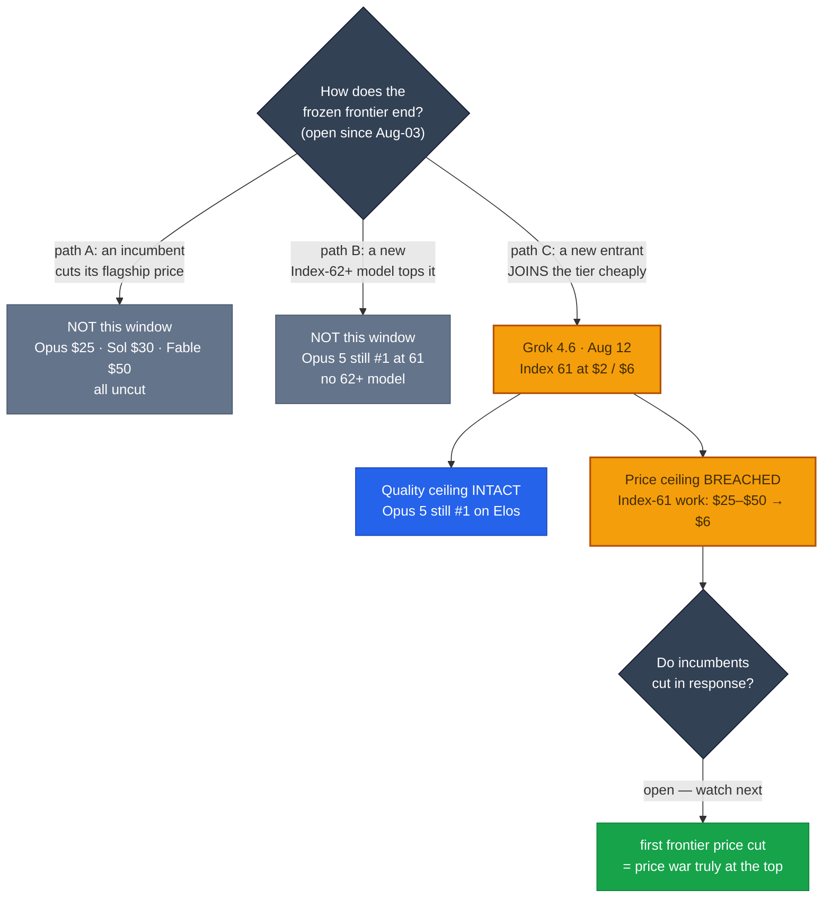

# LLM Updates — 2026-Aug-13

Thursday brief, written Thu Aug 13 (Los Angeles time). For **three straight briefs** the top of
the map did not move. **Aug-08** described a compressing **near-frontier band (Index 54–57)** pressed
against a **frozen closed ceiling** (Sol 59 / Fable 60 / Opus 61) and asked, "**does anyone answer at
the frontier?**" **Aug-11** answered it again with silence — no Index-62+ model, no flagship price
cut, the ceiling static for **~2.5 weeks** — while the window's real motion happened *below and to
the side* (Meta's open, on-device Muse Glimmer 30B).

**This window the stalemate breaks — from the side, on price.** The single fact that matters:
**xAI shipped Grok 4.6 (Aug 12), which reaches the frontier tier at Index 61 — a jump of ~5–7 points
over Grok 4.5 — at an unchanged $2 / $6 per million tokens.** For the first time, **frontier-tier
intelligence is available at near-floor pricing.** The old frontier row (Opus 5 $25, Sol $30, Fable 5
$50) is no longer the only way to buy Index-61 work. This is the answer to the question **Aug-03**
first posed — "*does the price war climb to the frontier?*" — and it climbed there not by an
incumbent cutting price, but by a **new entrant arriving at the top at floor-adjacent cost.**

Two clarifications keep this from being "Grok dethrones Opus":

1. **Opus 5 is still #1.** Grok 4.6 *rounds* even with the top at Index 61, but on the tie-breaking
   agentic Elos it sits **behind only Opus 5** (GDPval-AA Elo 1753; AA-Briefcase 1577, behind the
   Opus 5 family). The **ceiling's #1 did not fall** — its *price premium* did.
2. **No incumbent responded with a cut.** Opus 5 remains **$5 / $25** and #1 on both the Intelligence
   (61) and Agentic (55.3) indices; OpenAI's last move was the **Jul-30 Luna −80%** cut, not a Sol
   cut. So the frontier got cheaper **by addition, not by discount** — for now.

Meanwhile the two standing watch-items stayed open: **Qwen3.8's promised open weights still have not
shipped** (now a **third** missed window), and **Gemini 3.5 Pro is still not generally available**
(Google remains the lone frontier lab off the board).

This report advances only what is **new since Aug-11.** It does **not** re-derive Meta's two-track
fork / Muse Glimmer 30B (Aug-11 §1–2), the near-frontier-band compression map (Aug-08 §3), the
Qwen3.8-Max re-score to 56 (Aug-08 §1), the DeepSeek V4-Flash-0731 Pareto floor (Aug-03 §1), the
Luna −80% cut (Jul-31 §1), or the Kimi K3 open-weights #1 (Jul-30) — those are unchanged (§4).

![Scatter plot of Artificial Analysis Intelligence Index against output price per million tokens on a logarithmic axis, as of August 13 2026. A shaded frontier-tier band across the top (Index 59 to 61) previously held only three expensive models — Claude Opus 5 at Index 61 and 25 dollars, GPT-5.6 Sol at 59 and 30 dollars, and Claude Fable 5 at 60 and 50 dollars. On August 12 xAI's Grok 4.6 entered that same band at Index 61 but at only 6 dollars output, far to the cheap left of the incumbents. A bold vertical arrow rises from Grok 4.5's old position — Index 54 at 6 dollars, in the near-frontier band — straight up to Grok 4.6 at Index 61 at the same 6 dollars, showing xAI vaulting five to seven Index points into the frontier tier without raising price. Also plotted: the near-frontier band around Index 54 to 57 (Kimi K3 57 at 15 dollars, Qwen3.8-Max 56 at 6 dollars, Muse Spark 1.2 54 at 4.25 dollars) and the cheap floor (DeepSeek V4-Flash-0731 at Index 50 and 28 cents). The takeaway: frontier-tier intelligence, previously priced at 25 to 50 dollars, is now available at 6 dollars.](grok46_frontier_price_collapse.svg)

---

## 1. xAI ships Grok 4.6 (Aug 12) — frontier-tier intelligence at near-floor price

SpaceXAI / xAI released **Grok 4.6** on **Aug 12, 2026**, ~one month after Grok 4.5. Artificial
Analysis scores it **61 on the Intelligence Index — a +5 gain over Grok 4.5** — which it summarized as
"**Grok 4.6 returns SpaceXAI to the intelligence frontier and leads on cost efficiency**," "joining
the frontier in line with GPT-5.6 Sol." That +5 vaults xAI **out of the near-frontier band (54–57)
and into the frontier tier (59–61)** in a single point release — the first model to enter that tier
in ~2.5 weeks.

| Attribute | Grok 4.6 |
|---|---|
| Vendor / date | **SpaceXAI (xAI)**, released **Aug 12, 2026** (~1 month after Grok 4.5) |
| Intelligence | **Index 61** on Artificial Analysis — **+5 over Grok 4.5**; rounds even with the top tier |
| Rank | **Behind only Opus 5** on GDPval-AA Elo (**1753**); AA-Briefcase Elo **1577** (behind the Opus 5 family) |
| Price | **$2 in / $6 out** per Mtok (unchanged from Grok 4.5); cache hits **$0.50** |
| Long-context toll | Above **200k** prompt tokens, rates **double to $4 / $12** and apply to the *whole* request |
| Context | **500k tokens**; knowledge cutoff **Feb 1, 2026**; text + image in, text out |
| Base | Refinement of the **same ~1.5T-param foundation** as Grok 4.5 — a longer post-train, **not a bigger base** |
| New control | Adds an **`xhigh`** reasoning-effort tier (now low / medium / high / xhigh) |
| Availability | Live day-one in **Cursor** and **Grok Build**; API at console.x.ai; OpenRouter / Vercel / Cloudflare partners |

**Why it lands as "frontier at floor price."** The frontier tier was, until Aug-11, defined as much
by *cost* as by capability: Index-59-to-61 quality meant **$25–$50 output** (Opus 5 $25, Sol $30,
Fable 5 $50). Grok 4.6 delivers **the same Index tier at $6** — the same output price as the
near-frontier band it just left, and cheaper per token than every incumbent above it. AA's framing:
it is **"the cheapest model at the intelligence frontier."** The scatter above shows the move as a
vertical arrow — same $6 x-position, ~5–7 Index points higher on y.

**The gains are concentrated in agentic / coding**, not raw knowledge — consistent with xAI aiming
Grok 4.6 at long-running agents and coding harnesses:

| Benchmark | Grok 4.5 → Grok 4.6 |
|---|---|
| DeepSWE | **54 → 65.9** (+11.9) |
| APEX-Agents | **47.1 → 57.5** (+10.4) |
| Terminal-Bench | **+10.3** points |
| Intelligence Index | **+5** points |

**Cost efficiency compounds the headline price.** On AA's agentic harness Grok 4.6 resolves tasks in
**~53 turns and ~0.5B input tokens** on average, versus **~103 turns and ~2.0B input tokens** for
Claude Opus 5 (max). So even at *comparable* headline pricing it would be cheaper per completed task;
at **one-quarter to one-fifth** the output price *and* fewer tokens per task, the **effective cost of
a finished agentic job** drops by close to an order of magnitude versus the incumbent frontier. The
$6 sticker understates the gap.

*Caveats, flagged as the series does.* (a) **Index rebasing.** AA states Grok 4.6 = 61 and "+5 over
Grok 4.5"; prior briefs carried **Grok 4.5 at 54**, which would make the base 56 under AA's current
scale — a ~2-point rebasing difference. Either way the *move* is a ~5–7-point jump into the frontier
tier; the exact base is the only thing in question. (b) **Rounded ties.** On the finer percentage
scale some trackers separate the tier (Opus ~63.0 / Fable ~62.1 / Grok 4.6 ~60.9), so "Index 61" is a
rounded tie, not a literal dead heat — Opus 5 remains ahead. (c) **The 200k toll.** The $6 rate only
holds **below 200k** prompt tokens; long-context agent runs that cross 200k pay **$12 out on the whole
request**, which erodes the cost-efficiency edge exactly in the long-horizon workloads Grok 4.6 is
marketed for.

## 2. The ceiling's #1 and price both held — the frontier got cheaper by *addition*

The prediction the running narrative kept making — "the regime ends when the **first flagship price
cut** *or* the **first Index-62+ model** appears" — was **half-right and half-wrong.** Neither of those
happened. Instead a **third path** ended the stalemate: a **new entrant reached the existing top tier
(61, not 62+) at a radically lower price**, without any incumbent moving.

- **Opus 5 is unchanged and still #1** — Index **61**, Agentic Index **55.3**, **$5 / $25**, uncut. On
  the tie-breaking Elos it stays ahead of Grok 4.6. The **quality ceiling did not move.**
- **No incumbent cut its price** this window. OpenAI's last cut was **Luna −80% (Jul-30)**; Sol
  ($30) and Fable 5 ($50) are unchanged. So the *frontier price premium* was undercut **from outside**,
  not surrendered from within — the incumbents' response, if any, is the next thing to watch (§Watch).
- **The near-frontier band lost its top.** Grok 4.5 (54) leaving for the frontier tier thins the
  54–57 band to Kimi K3 (57, open), Qwen3.8-Max (56), GPT-5.5 (55), Muse Spark 1.2 (54) — and widens
  the visible gap between "cheap-and-frontier" (Grok 4.6) and "cheap-but-near-frontier" (the rest).

Net: **Aug-11** the frontier was a stalemate the price war hadn't reached. **Aug-13** the price war
**arrived at the frontier** — quality tier intact, **price floor of that tier cut by ~75–90%** by a
newcomer. Whether that forces the first incumbent frontier cut is the open question the last three
briefs kept deferring.

The mechanism, as a flow — the stalemate ends by a **third path** the running narrative hadn't priced
in (neither a cut nor an Index-62+ model, but a new entrant *joining* the top tier cheaply):

## 3. Still open — Qwen3.8 open weights (3rd miss) and Gemini 3.5 Pro (still no GA)

Both standing watch-items stayed unresolved, exactly as in the prior two briefs:

- **Qwen3.8 open weights — still not shipped.** Alibaba's pledge to publish **Qwen3.8-Max + a
  Qwen3.8-27B** on Hugging Face / ModelScope (originally "next week" after the Aug-3 API launch, then
  "the week of Aug 10") remains **unfulfilled**: **no matching repository** on the Qwen org page, and
  the license still undisclosed (Qwen 3.5/3.6 were Apache-2.0, but that is a pattern, not a
  commitment). This is now the **third** consecutive missed window. A `Qwen/Qwen3.8-2.4T-A95B` repo
  *path* is referenced by trackers, but no live weights/card were retrievable at compile time — treat
  as a placeholder, not a shipment.
- **Gemini 3.5 Pro — still not GA.** Google remains the **lone frontier lab off the board**. The
  shipped Gemini models stay **3.5 Flash (Index ~50)** and **3.1 Pro Preview (~46)**; 3.5 Pro (rumored
  2M context, "Deep Think" layer) has slipped repeatedly — no model card, no API, no firm date. Its
  continued absence is the biggest **potential** frontier mover still unaccounted for.

**Also this window (minor, non-frontier), for completeness:** ByteDance **Seed 2.1 Turbo** (Aug 10)
and InclusionAI **Ling 3.0 Flash** (Aug 2) appeared on release trackers, and xAI shipped **Grok
Imagine Image 2.0** (Aug 8) — none are frontier-tier language models and none change the map above.

## 4. Unchanged since Aug-08 / Aug-11 (background, not re-derived)

- **Opus 5** #1 — Index 61 / Agentic 55.3 / **$5–$25**, uncut (§2).
- **Meta's two-track fork** — closed/hosted **Muse Spark 1.2** (54, API-only) + open/on-device
  **Muse Glimmer 30B** (Apache-2.0, Index 35 high, 256k, distilled + 4-bit quant + DFlash block
  speculation). Aug-11 §1–2 — no change.
- **Near-frontier band** — Kimi K3 **57** (open #1), Qwen3.8-Max **56** (API-only), GPT-5.5 **55**,
  Muse Spark 1.2 **54**. Grok 4.5 (54) **exited upward** this window (§1–2).
- **Cheap floor** — DeepSeek **V4-Flash-0731** 50 / **$0.28** / MIT, with its mHC/CSA/DSA/HCA
  long-context backbone as standing background (Aug-03 §1).
- **Sonnet 5** $2/$10 intro **through Aug 31**; **Fable 5** tier split; **Kill Switch / Pacing**
  policy axis quiet. No change.

---

## 5. The through-line — the price war finally reached the top

For five briefs the frontier was described the same way: an **expensive, static ceiling** that the
competition kept **failing to reach**. Aug-03 asked whether the price war would "climb to the
frontier"; it dug into the **floor** instead. Aug-04 → Aug-11 the middle filled and compressed, but
the **top stayed a premium-priced stalemate** no one answered. **Aug-13 is the answer, ten days late
and from an unexpected direction:** xAI's Grok 4.6 did not *undercut* the frontier from below or
*top* it from above — it **joined it and detonated its price**, bringing Index-61 quality to $6.

| Thread (prior briefs) | Status on Aug 13 | Change |
|---|---|---|
| Does anyone answer at the frontier? | **Yes** — Grok 4.6 reaches Index 61 (§1) | **resolved — first frontier entrant in ~2.5 wks (§1)** |
| Does the price war climb to the frontier? (Aug-03) | **Yes** — frontier tier now buyable at $6, not $25–$50 (§1–2) | **resolved — via a new entrant, not a cut (§2)** |
| Does the ceiling's **#1** move? | **No** — Opus 5 still #1 on tie-break Elos (§2) | unchanged at the very top (§2) |
| Does an incumbent **cut price**? | **No** — Opus $25 / Sol $30 / Fable $50 uncut (§2) | unchanged — response still pending (§2) |
| First **Index-62+** model? | **No** — Grok 4.6 is 61, not 62+ (§1) | unchanged — stalemate ended a different way (§2) |
| Qwen3.8 open weights (3rd window) | **Still not shipped** — no repo, no license, no date (§3) | unchanged — pledge lapsed again (§3) |
| Gemini 3.5 Pro | **Still no GA** — no card / API / date (§3) | unchanged (§3) |
| Cheapest useful model | DeepSeek V4-Flash-0731 · 50 / $0.28 / MIT (§4) | unchanged (§4) |

The net: the frontier is **no longer only expensive**. Its **quality ceiling is intact** (Opus 5
still #1) but its **price ceiling has a hole in it** — punched not by a discount but by a competitor
arriving at the top for $6. The next question writes itself: **do the incumbents finally cut, now
that "frontier" and "cheap" describe the same model?**

---

## Watch next

- **Do the incumbents finally cut?** Grok 4.6 puts Index-61 work at **$6** while Opus 5 ($25), Sol
  ($30), and Fable 5 ($50) hold. The last three briefs' "will the ceiling ever move?" now has a
  concrete trigger. Watch for the **first frontier price cut** — it would be the clearest sign the
  price war has genuinely reached the top, not just brushed it.
- **Does Grok 4.6's cost-efficiency claim survive third-party agent benches?** AA's "~53 turns /
  ~0.5B tokens vs Opus 5's ~103 / ~2.0B" is the load-bearing number behind "cheapest at the
  frontier." Watch whether independent long-horizon harnesses reproduce it — and how much the **200k
  toll** ($12 out on the whole request) erodes it on real long-context agent runs.
- **Qwen3.8 open weights — do they *ever* ship?** Now **three** missed windows. Watch the repos, the
  **license text**, and whether Grok 4.6's frontier-at-$6 pressure changes Alibaba's calculus.
- **Gemini 3.5 Pro — the last unshipped frontier card.** Still the only plausible Index-61+ model not
  on the board. Its absence is now the single biggest overhang, with Google the lone frontier lab
  silent while xAI just re-joined the top.
- **Does xAI's "refine, don't enlarge" recipe hold?** Grok 4.6 reached the frontier by a **longer
  post-train on the same 1.5T base**, not a bigger model — mirroring the efficiency turn elsewhere
  (Meta's distilled Glimmer, DeepSeek's re-post-trained V4-Flash). Watch whether the next frontier
  gains keep coming from **post-training** rather than scale.

---

*Compiled Thu Aug 13 2026 (Los Angeles time) from public reporting and independent benchmark
trackers. Grok 4.6 figures — Intelligence Index 61 (+5 over Grok 4.5), GDPval-AA Elo 1753 (behind
only Opus 5), AA-Briefcase 1577, $2/$6 (doubling to $4/$12 above 200k), $0.50 cache, 500k context,
Feb-1-2026 cutoff, ~1.5T base, xhigh tier, DeepSWE 54→65.9, APEX-Agents 47.1→57.5, Terminal-Bench
+10.3, ~53 turns/0.5B tokens vs Opus 5's ~103/2.0B — are from Artificial Analysis' Grok 4.6 analysis
and model page, corroborated across MarkTechPost, DEV Community, DigitalApplied, Kingy, BenchLM,
XenoSpectrum, and the vendor launch table. Opus 5 (61 / 55.3 / $5–$25) and the "no incumbent cut this
window" read are from Artificial Analysis and VentureBeat/pricing trackers. The Qwen3.8 open-weights
miss (no repo / no license / no date) and Gemini 3.5 Pro's continued absence are as of Thu Aug 13 per
release trackers and vendor pages. Index numbers are on Artificial Analysis' current (rebased)
Intelligence Index; the Grok 4.5 base (54 in prior briefs vs 56 implied by AA's "+5") is flagged as a
minor rebasing ambiguity in §1. As in prior compiles, several primary/publisher domains (Artificial
Analysis, the-decoder, MarkTechPost among them) returned HTTP 403 / egress-blocked errors to direct
fetches during compilation, so figures are cited via the search index and mirrored trackers where a
direct read failed; each number is corroborated across multiple outlets. Prior background is
referenced by date/section rather than repeated.*

## Sources

- [Artificial Analysis — Grok 4.6 (high): Intelligence, Performance & Price](https://artificialanalysis.ai/models/grok-4-6)
- [Artificial Analysis — "Grok 4.6 returns SpaceXAI to the intelligence frontier and leads on cost efficiency"](https://artificialanalysis.ai/articles/grok-4-6-benchmarks-and-analysis)
- [Artificial Analysis on X — Grok 4.6 scores 61, "joining the frontier in line with GPT-5.6 Sol," +5 over Grok 4.5](https://x.com/ArtificialAnlys/status/2087564648325530099)
- [MarkTechPost — SpaceXAI Releases Grok 4.6: a 500K-context frontier model tuned for long-running agents, coding, and knowledge work](https://www.marktechpost.com/2026/08/12/spacexai-releases-grok-4-6/)
- [DEV Community — Grok 4.6 Released: Benchmarks, Pricing, and What It Means for Agent Builders](https://dev.to/jamilxt/grok-46-released-benchmarks-pricing-and-what-it-means-for-agent-builders-28ob)
- [DigitalApplied — Grok 4.6 Lands: Same Price as 4.5, Frontier Parity](https://www.digitalapplied.com/blog/grok-4-6-launch-pricing-agentic-benchmarks-2026)
- [Kingy AI — Grok 4.6: Price, Benchmarks, 500K Context & Access](https://kingy.ai/blog/grok-4-6-price-benchmarks-api-cursor-context-window/)
- [BenchLM.ai — Grok 4.6 Benchmarks & Pricing (August 2026)](https://benchlm.ai/models/grok-4-6)
- [XenoSpectrum — Grok 4.6 Ties GPT-5.6 Sol on Overall Index — Agent Selection Should Look at Execution Conditions and Cost](https://xenospectrum.com/en/grok-46-benchmark-cost-agentic/)
- [BenchLM.ai — Artificial Analysis Intelligence Index Leaderboard (Aug 2026): Claude Opus 5 Leads](https://benchlm.ai/benchmarks/artificialanalysis)
- [VentureBeat — AI price wars: OpenAI cuts GPT-5.6 Luna prices by 80% (context for "no cut this window")](https://venturebeat.com/technology/ai-price-wars-openai-cuts-gpt-5-6-luna-prices-by-80-as-model-competition-shifts-toward-cost)
- [felloAI — Best AI Models in August 2026](https://felloai.com/best-ai-models/)
- [Hugging Face — Qwen/Qwen3.8-2.4T-A95B (referenced repo path; no live weights at compile time)](https://huggingface.co/Qwen/Qwen3.8-2.4T-A95B)
- [Neomanex — Qwen3.8-Max Open Weights Countdown: Announced, Not Shipped](https://neomanex.com/news/qwen38-max-open-weights-countdown-aug-2026)
- [eesel AI — Gemini 3.5 Pro: is it out yet? (still no GA)](https://www.eesel.ai/blog/gemini-3-5-pro)
- [LLM Gateway — New AI Model Releases, August 2026 Timeline (Seed 2.1 Turbo, Ling 3.0 Flash, Grok Imagine 2.0)](https://llmgateway.io/timeline)
