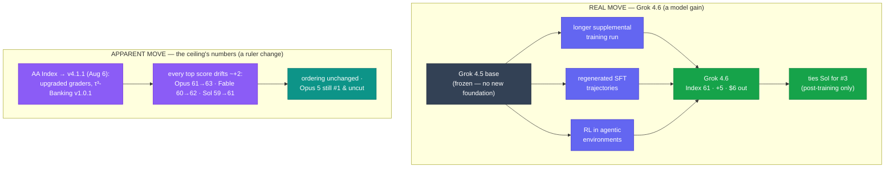

# LLM Updates — 2026-Aug-14

Friday brief, written Fri Aug 14 (Los Angeles time). For roughly three weeks the series has
tracked two frozen questions. **Does anyone answer at the frontier?** — no Index‑62+ model and no
flagship price cut since Opus 5 took #1 on Jul 24 (Jul‑25 → Aug‑11, "the ceiling never moves").
And **does the open‑weights promise land?** — Alibaba pledged to open Qwen3.8‑Max's weights, then
missed the window twice (Aug‑04 "pledge, not a shipment" → Aug‑08 "targeted week of Aug 10" →
Aug‑11 "window missed"). Aug‑11 added a third thread: Meta had just opened the *side* door with the
on‑device Muse Glimmer 30B, so the interesting competition had partly moved off the leaderboard.

**This window both frozen questions finally thaw — and each answer lands exactly one tier short of
what the narrative was watching for.**

1. **Grok 4.6 (SpaceXAI, Aug 6; benchmarked Aug 12) reaches the ceiling band — at #3, not #1.** It
   scores **Index 61**, tying **GPT‑5.6 Sol** for **world's #3**, one point behind Fable 5 and two
   behind Opus 5 — a **+5 jump over Grok 4.5** achieved by **post‑training alone** (the base is
   unchanged), at **$2 / $6 per Mtok**, roughly **five times cheaper** on output than Sol at the
   same score. It is the **first model to enter the 61+ band in ~3 weeks** — but it enters the
   *shared #3 slot*, and **no model has beaten Opus 5**, still #1 and **still uncut.**
2. **Qwen3.8‑Max's open weights finally shipped (~Aug 12–13) — degraded and gated.** After two
   missed windows the Max‑class flagship's weights landed on Hugging Face / ModelScope, resolving
   Aug‑11's negative watch‑item **positive** — but the open release is **text‑only, without the 1M
   context**, under a **new revenue‑share license** (not the permissive Apache‑2.0 / MIT the thesis
   assumed), and the **runnable Qwen3.8‑27B everyone actually wanted is still delayed** (a ModelScope
   countdown now points at Aug 15).

Two things make the frontier "move" less than the leaderboard suggests. First, the top's absolute
numbers rose **~+2 across the board** (Opus 61→**63**, Fable 60→**62**, Sol 59→**61**) — but that is
the **Artificial Analysis Index recalibrating to v4.1.1 on Aug 6** (upgraded grader models), **not**
new model gains. **The ruler moved, not the ceiling.** Second, Google shipped **Gemini 3.7 Flash
(Aug 13)** — its **second Flash in three weeks** — while **Gemini 3.5 Pro's delay continues**
(Forbes, Aug 13). The lone frontier lab off the board is still off it.

This report advances only what is **new since Aug‑11.** It does **not** re‑derive the Muse Glimmer
30B on‑device release / DFlash recipe (Aug‑11 §1–§2), the near‑frontier‑band map (Aug‑08 §3), the
DeepSeek V4‑Flash‑0731 Pareto floor (Aug‑03 §1), the Kimi K3 open‑weights release (Jul‑30), or the
Opus 5 "top quality at mid price" reshuffle (Jul‑25) — those are unchanged (§5).

![Scatter plot of the Artificial Analysis Intelligence Index (v4.1.1) against output price per million tokens on a log axis as of Aug 14 2026. A shaded band at the top marks the closed ceiling tier, Index 61 to 63. Claude Opus 5 is at 63 and about 25 dollars, still number one and uncut; Claude Fable 5 at 62 and 50 dollars; GPT-5.6 Sol at 61 and 30 dollars. The new model Grok 4.6 from SpaceXAI sits at 61 but only 6 dollars output, tying Sol for third place at roughly one-fifth the price, on the cheap left side of the band; a green arrow rises from a faded Grok 4.5 ghost marker at 56 and 6 dollars straight up five points to Grok 4.6 at the same price, showing the gain was post-training only at constant cost. Kimi K3 open weights sits at 59 and 15 dollars; Qwen3.8-Max, whose weights shipped this window, at 58 and 6 dollars; GPT-5.5 near 57; Muse Spark 1.2 near 56. A dashed note explains the whole top rose about two points versus Aug 11 only because the Index recalibrated to v4.1.1 on Aug 6 with upgraded graders, so the higher ceiling numbers are a changed ruler, not new gains, and Opus 5 remains number one and uncut.](grok46_enters_ceiling_band.svg)

---

## 1. Grok 4.6 (Aug 6) reaches the ceiling band — the first upward move in ~3 weeks, at #3

For three briefs the ceiling band (61+) had exactly three occupants and no new ones: Opus 5, Fable
5, GPT‑5.6 Sol. **SpaceXAI** — the entity **formerly known as xAI** — put a fourth model into it.
Grok 4.6 launched Aug 6 and, once Artificial Analysis published its full Intelligence Index run
(~Aug 12), landed at **61**, **tied with GPT‑5.6 Sol for #3 worldwide**, ahead of open‑weights
leader Kimi K3 and every Google / Meta model. VentureBeat framed it as "overtaking Kimi K3 and
matching GPT‑5.6 Sol for world's third best"; AA's own writeup titled it "Grok 4.6 returns SpaceXAI
to the intelligence frontier and leads on cost efficiency."

| Attribute | Grok 4.6 |
|---|---|
| Intelligence | **Index 61 (v4.1.1)** — **T‑#3** with GPT‑5.6 Sol; **+5** over Grok 4.5 (~56) |
| Rank vs top | Behind **Opus 5 (63, #1)** and **Fable 5 (62, #2)**; level with **Sol (61)** |
| Price | **$2 in / $6 out** per Mtok — a **fast** variant at 2× per token |
| Context | **500k tokens**; text + image in, text out; knowledge cutoff **Feb 1 2026** |
| Effort tiers | low / medium / high (default) / **new xhigh** |
| Focus | **long‑running agents**, coding, knowledge work |
| Availability | API, **Cursor**, SpaceXAI's own **Grok Build** tool |

- **The gain is a *post‑training* gain, not a bigger model.** SpaceXAI kept the **Grok 4.5 base
  frozen** and spent the improvement on **(a)** a longer supplemental training run, **(b)**
  regenerated supervised fine‑tuning trajectories, and **(c)** reinforcement learning in **agentic
  environments.** That is the whole recipe: no new foundation, +5 Index. It mirrors this week's
  broader theme (an Aug‑12 industry newsletter literally titled "AI models shrink, agents grow up")
  — the frontier is being contested through **post‑training and agent tuning**, not through scaling
  a new base.
- **Coding is genuinely up but still mixed.** Reported: **CursorBench v3.2 69.9%** (just behind
  Fable 5's 70.5, ahead of Sol's 67.2); **DeepSWE v1.1 65.9%** (up ~12 pts generationally, but
  behind Sol's 73); **Terminal‑Bench v3.0 26%** (nearly double Grok 4.5's 15.7, still last of the
  four). So: strong interactive‑coding, weaker autonomous‑terminal — a near‑frontier model, not a
  frontier‑topping one.
- **The real headline is price, not rank.** At **$6 output** it sits at the *same Index height as
  Sol* ($30) and just below Fable 5 ($50). A #3‑class model at **~1/5 the output cost of the model
  it ties** is the first genuine **downward pressure on the ceiling band's economics** the series
  has seen — even though the band's *scores* didn't fall.

**Why it matters.** The three‑week question "does anyone reach the ceiling band?" is now **answered
— partly.** Someone did reach it (Grok 4.6, from below, via post‑training), and did it **cheaply**.
But the answer to the *sharper* question — "does anyone beat **Opus 5**, or force a flagship price
cut at the very top?" — is **still no.** The band gained an occupant and a price floor; the **#1
seat and the top‑tier prices did not move.**

**Sources:**
[Artificial Analysis — Grok 4.6 returns SpaceXAI to the intelligence frontier and leads on cost efficiency](https://artificialanalysis.ai/articles/grok-4-6-benchmarks-and-analysis) ·
[VentureBeat — SpaceXAI debuts Grok 4.6, overtaking Kimi K3 and matching GPT‑5.6 Sol for world's third best](https://venturebeat.com/technology/spacexai-debuts-grok-4-6-overtaking-kimi-k3s-performance-and-matching-gpt-5-6-sol-for-worlds-third-best-on-artificial-analysis) ·
[MarkTechPost — SpaceXAI releases Grok 4.6: a 500K‑context frontier model tuned for long‑running agents](https://www.marktechpost.com/2026/08/12/spacexai-releases-grok-4-6/) ·
[The Decoder — SpaceXAI's Grok 4.6 matches OpenAI's best model and undercuts it on price](https://the-decoder.com/spacexais-grok-4-6-matches-openais-best-model-and-undercuts-it-on-price/) ·
[Neowin — SpaceXAI's Grok 4.6 beats OpenAI's GPT‑5.6 Sol in several AI benchmarks](https://www.neowin.net/news/spacexais-grok-46-model-beats-openais-gpt-56-sol-in-several-ai-benchmarks/) ·
[officechai — SpaceXAI releases Grok 4.6, benchmarks show performance comparable to Fable, GPT‑5.6 Sol](https://officechai.com/ai/grok-4-6-benchmarks/) ·
[Unite.AI — SpaceXAI launches Grok 4.6 for long‑running agents](https://www.unite.ai/spacexai-launches-grok-4-6-for-long-running-agents/) ·
[Appwrite — What's new in Grok 4.6, from 500K context to pricing](https://appwrite.io/blog/post/whats-new-in-grok-46-from-500k-context-to-pricing) ·
[explainx.ai — Grok 4.6 launch: ties Sol, trails Fable](https://explainx.ai/blog/spacexai-grok-4-6-launch-evals-cursor-august-2026)

---

## 2. The ceiling reads higher — but that's a v4.1.1 recalibration, not the models moving

Anyone comparing this brief's leaderboard to Aug‑11's will notice the whole top is **~2 points
higher**: Opus 5 **61 → 63**, Fable 5 **60 → 62**, Sol **59 → 61**. **None of that is a model
update.** On **Aug 6**, Artificial Analysis shipped **Intelligence Index v4.1.1**, a patch that
**upgraded the grader models** and moved τ³‑Banking to Sierra's v1.0.1 (fixing scoring of
trajectories that recover from "unhappy paths"). AA's own note: rankings stayed "largely
consistent, with a slight increase in scores due to improved grading robustness." In other words,
**every model's number drifted up together** — the ordering at the top is unchanged.

This matters for reading the series correctly:

- **The ceiling did not "move."** Opus 5 is **still #1**, the gap to #2 (Fable) is **still ~1 pt**,
  and there has **still been no flagship price cut** at the top. "63" is the same Opus 5 the series
  has carried at 61, re‑graded. Treat the +2 as a **units change**, and compare *within* v4.1.1 (as
  this brief does) rather than across the Aug‑6 boundary.
- **Grok 4.6's jump is *real* on top of that.** Grok 4.5 also re‑graded up (to ~56), and Grok 4.6
  still sits **+5 above it** at 61. So the recalibration inflates the ceiling's *label* but does not
  manufacture Grok's climb — the climb is the model's own post‑training gain (§1).
- **Timing caveat.** v4.1.1 is dated Aug 6, yet Aug‑11's brief still carried the pre‑patch numbers
  (Opus 61) — trackers propagated the re‑grade unevenly, and the higher figures are only now
  consistent across leaderboards. Carry the v4.1.1 numbers going forward.

**Why it matters.** Two different kinds of "the top went up" happened in the same week, and
conflating them would misread the market. The **model story** is Grok 4.6 climbing into the band on
post‑training. The **measurement story** is v4.1.1 lifting all labels ~+2. Only the first is
competitive movement; the second is a recalibrated scale. Net at the very top: **still Opus 5, still
uncut, still unbeaten.**

**Sources:**
[Artificial Analysis — Launching v4.1.1 of the Artificial Analysis Intelligence Index](https://artificialanalysis.ai/articles/artificial-analysis-intelligence-index-v4-1-1) ·
[Artificial Analysis — Intelligence Index v4.1: a shift toward agentic workloads](https://artificialanalysis.ai/articles/artificial-analysis-intelligence-index-v4-1) ·
[Artificial Analysis — Intelligence benchmarking methodology](https://artificialanalysis.ai/methodology/intelligence-benchmarking) ·
[BenchLM — Artificial Analysis leaderboard (Aug 2026): Claude Opus 5 leads at 63.0%](https://benchlm.ai/benchmarks/artificialanalysis) ·
[felloai — Best AI models in August 2026](https://felloai.com/best-ai-models/)

---

## 3. Qwen3.8‑Max's open weights finally shipped — text‑only, revenue‑share, and the 27B is still missing

Aug‑11 §3 carried, as a resolved‑negative item, that Qwen3.8's promised weights had missed their
window twice. **This window the Max‑class weights actually shipped.** Around **Aug 12–13**,
**Qwen3.8‑2.4T‑A95B** — the 2.4‑trillion‑parameter sparse‑MoE flagship — appeared on **Hugging Face
and ModelScope**. The two‑missed‑windows pledge is, at last, **partly fulfilled** — but the release
is materially **thinner** than the thesis that rode on it:

- **It's the giant, not the runnable one.** The open drop is **Qwen3.8‑Max** (2.4T params,
  ~95B active) — a **multi‑node datacenter** model, not something a workstation runs. The
  **Qwen3.8‑27B** — the small, genuinely local model the "open, runnable mid‑tier" thesis was
  actually about — **did not ship.** ModelScope is running a **countdown to Aug 15** for the 27B;
  third‑party trackers still list it with **no repo, no card, no license.**
- **Degraded vs the hosted flagship.** The open weights are reported **text‑only** (the hosted
  Qwen3.8‑Max is text + vision) and **without the 1M‑token context** of the API model — a capability
  step‑down between the paid endpoint and the open checkpoint.
- **A new revenue‑share license — not permissive.** The weights ship under a **new revenue‑share
  license**, not the Apache‑2.0 of Qwen 3.5/3.6 nor a clean MIT. It sits closer to Kimi K3's gated
  custom terms than to the "download and do anything" openness the narrative assumed. This is the
  precedent Aug‑04 flagged (Qwen 3.7 broke the Apache pattern) partly recurring: **open weights, but
  conditioned.**

**Why it matters.** The counterpoint to Aug‑11 is now complete in an ironic way. Aug‑11: **Meta**
(written off for open source) shipped clean **Apache‑2.0** on‑device weights, while **Alibaba**
(whose pledge was the thing to watch) lapsed. Aug‑14: **Alibaba finally delivered** — but shipped
the **2.4T behemoth under a conditioned license without vision or long context**, and **withheld the
small model** that would have made "open + runnable" real. So the open‑weights leader by *ethos*
this fortnight is still **Meta's Glimmer** (small, permissive, on‑device); Alibaba's drop is **big,
gated, and incomplete.** Whether the Aug‑15 27B countdown resolves is the single cleanest open
watch‑item going into next week.

**Sources:**
[explainx.ai — Qwen3.8‑Max open weights are live (August 2026)](https://www.explainx.ai/blog/qwen3-8-max-open-weights-live-hugging-face-august-2026) ·
[orcarouter — Qwen3.8‑27B open weights: Max shipped, 27B delayed](https://www.orcarouter.ai/blog/qwen-3-8-27b-open-weights-leak) ·
[orcarouter — Qwen3.8‑27B release date: Aug 15 countdown & what's known](https://www.orcarouter.ai/blog/qwen-3-8-27b-release-date) ·
[Spheron — Qwen3.8‑Max GPU requirements: VRAM and cluster sizing (2026)](https://www.spheron.network/blog/deploy-qwen3-8-max-gpu-cloud/) ·
[Neomanex — Qwen3.8‑Max open weights countdown: announced, not shipped](https://neomanex.com/news/qwen38-max-open-weights-countdown-aug-2026) ·
[Digital Applied — Qwen3.8 open weights: check this before downloading](https://www.digitalapplied.com/blog/qwen3-8-open-weights-checklist-before-download)

---

## 4. Google ships Gemini 3.7 Flash (Aug 13) — a second Flash in three weeks; Pro's delay continues

Google's cadence this cycle stays **Flash, not Pro.** On **Aug 13** it released **Gemini 3.7 Flash**
— **just three weeks after 3.6 Flash** (Jul 21) — a coding‑ and agent‑focused speed model. AI
Studio's Logan Kilpatrick pitched a "strong intelligence increase in ~three weeks" from algorithmic
gains. Reported figures: **FrontierCode 1.1 Main 43.6%** (tops Sonnet 5's 42.7 and GPT‑5.6 Terra's
41.3); **DeepSWE v1.1 65.3%** (vs 49.0 for 3.6 Flash); **AutomationBench 30.4%** (up from 17.0);
**WebDev Arena Elo 1588** (up from 1538). Pricing is aggressive: an **introductory $0.75 in / $3.75
out** per Mtok through end‑2026 (half the prior model's launch price), rising to $1.50 / $7.50 on
Jan 1 2027. It's live in the **API, AI Studio, Antigravity**, and the Gemini app.

But the model that would put Google **in the ceiling band remains unshipped.** **Gemini 3.5 Pro's
delay continues** — Forbes ran "Gemini 3.5 Pro Delay Continues" on **Aug 13**, and reporting still
cites **coding shortfalls and a disappointing training‑data refresh** leaving it "months behind."
Prediction markets have now been wrong on June, Jul 31, and Aug 7 launch dates. Google keeps
**shipping cheap, capable Flash models on a fast clock while its frontier contestant stays off the
board** — the exact pattern the series has flagged since Jul‑17, now with a second data point.

**Why it matters.** Gemini 3.7 Flash is a real, well‑priced release that strengthens Google at the
**Flash tier** and undercuts rivals on coding‑per‑dollar. It does **nothing** for the frontier
question: the only unshipped model that could plausibly land Index 61+ is **still** Gemini 3.5 Pro,
and its absence is now the biggest single overhang at the top — the one lab that could contest
Opus 5's #1 seat continues to decline the board.

**Sources:**
[SiliconANGLE — Google launches Gemini 3.7 Flash for coding, AI agent projects](https://siliconangle.com/2026/08/13/google-launches-gemini-3-7-flash-coding-ai-agent-projects/) ·
[9to5Google — Gemini 3.7 Flash launches three weeks after last model, live in Spark](https://9to5google.com/2026/08/13/gemini-3-7-flash-launch/) ·
[Seeking Alpha — Gemini 3.7 Flash beats Sonnet 5 and GPT‑5.6 in coding evals](https://seekingalpha.com/news/4632681-google-launches-gemini-37-flash-which-beat-sonnet-5-and-gpt-56-in-coding-evals) ·
[officechai — Google releases Gemini 3.7 Flash, competes with GPT‑5.6 Terra & Muse Spark 1.2](https://officechai.com/ai/gemini-3-7-flash-benchmarks/) ·
[Forbes — Gemini 3.5 Pro delay continues](https://www.forbes.com/sites/johnwerner/2026/08/13/gemini-35-pro-delay-continues/) ·
[eesel AI — Gemini 3.5 Pro: is it out yet? (2026)](https://www.eesel.ai/blog/gemini-3-5-pro)

---

## 5. Unchanged / minor since Aug‑11

- **Opus 5 is still #1 and still uncut.** At **Index 63 (v4.1.1), $5/$25**, unbeaten; Fable 5 (62,
  $50) and Sol (61, $30) unchanged in ordering. **No model has passed Opus 5, and no flagship price
  cut this window** — the top‑of‑market economics have now been static since Jul 24. Sonnet 5 keeps
  its **$2/$10** intro pricing through **Aug 31** (reverts to $3/$15 on Sep 1).
- **The near‑frontier band re‑labels but doesn't re‑order.** Under v4.1.1: Kimi K3 ~59 (open),
  Qwen3.8‑Max ~58, GPT‑5.5 ~57, Muse Spark 1.2 ~56, and **Grok 4.5 ~56** now superseded by Grok 4.6
  (61, §1). Grok 4.6 is the only band‑structure change; the rest is the +2 recalibration (§2).
- **Muse Glimmer 30B (Meta, Aug 10)** — the Apache‑2.0 on‑device agent model and its distill →
  4‑bit → DFlash recipe (Aug‑11 §1–§2) — no follow‑on this window; still the most permissive notable
  open release of the fortnight.
- **DeepSeek V4‑Flash‑0731** (~50–52 post‑recal, $0.28, MIT) remains the **Pareto floor**; no
  follow‑on. **GPT‑5.6 Luna** (~$1.20 after its −80% cut) and the cheap floor unchanged.
- **Smaller/adjacent releases this week** fit the "models shrink, agents grow up" theme and don't
  touch the top: **ByteDance Seed 2.1 Turbo** (Aug 10), **InclusionAI Ling 3.0 Flash** (Aug 2),
  **Microsoft MAI‑Code‑1.1‑Flash** — efficiency/coding‑tier models, not frontier entrants.
- **Autonomy/policy axis** (AI Kill Switch Act; the OpenAI + Anthropic "Pacing the Frontier"
  endorsement) drew no new action this window.

**Sources:**
[Artificial Analysis — Intelligence Index leaderboard (Opus 5 leads; ceiling figures)](https://artificialanalysis.ai/) ·
[LLM Gateway — New AI model releases, August 2026 timeline](https://llmgateway.io/timeline) ·
[digitalsteplab — AI newsletter, 12 August 2026: AI models shrink, agents grow up](https://digitalsteplab.com/newsletter/2026-08-12) ·
[felloai — Best AI models in August 2026](https://felloai.com/best-ai-models/) ·
[llm-stats — AI updates today (August 2026)](https://llm-stats.com/llm-updates)

---

## 6. The through-line — both frozen questions thaw, each one tier short

For ~3 weeks the two live questions were "**does anyone answer at the frontier?**" and "**does the
open‑weights promise land?**" This window is the first in which **both got answers** — and both
answers are **partial in the same direction:** the thing that was supposed to happen happened, but
**one rung lower** than the narrative was watching for.

| Thread (prior briefs) | Status on Aug 14 | Change |
|---|---|---|
| Does anyone reach the ceiling band (61+)? | **Yes — Grok 4.6 (61), first band entrant in ~3 weeks** (§1) | **resolved — but at #3, via post‑training (§1)** |
| Does anyone beat **Opus 5** / cut top prices? | **No** — Opus 5 still #1 (63) and uncut; no flagship cut (§1, §5) | unchanged — still open (§5) |
| Why did the ceiling's numbers rise? | **v4.1.1 recalibration (Aug 6), ~+2 to all** — ruler, not models (§2) | **new — measurement change, not a move (§2)** |
| Qwen3.8 open weights + license (Aug‑11 top watch) | **Max weights shipped** — text‑only, no 1M ctx, revenue‑share license (§3) | **resolved positive — but degraded & gated (§3)** |
| The *runnable* open mid‑tier (Qwen3.8‑27B) | **Still not shipped** — Aug‑15 countdown, no license (§3) | **still open — the cleanest next watch‑item (§3)** |
| Gemini 3.5 Pro — the missing ceiling contestant | **Still no card / API / date**; 3.7 Flash shipped instead (§4) | unchanged — Flash again, Pro delayed (§4) |
| Who owns open weights by ethos? | Meta's Glimmer (permissive, on‑device) vs Qwen's big/gated drop (§3, §5) | **revised — Meta still the permissive leader (§3)** |
| Cheapest useful model | DeepSeek V4‑Flash‑0731 (~50, $0.28, MIT) | unchanged (§5) |

The net: Aug‑11 the story was "the frontier is a stalemate; the interesting competition moved off
the leaderboard." Aug‑14 the stalemate **partly breaks** — but the breaks are **sideways and
downward, not at the peak.** Grok 4.6 reaches the band **from below and cheaply** (post‑training,
$6), so the band gains an occupant and a price floor while **the #1 seat and top‑tier prices stay
exactly where they were.** Qwen's weights land **big and gated**, so "open" advances on paper while
"open **and** runnable" stays unshipped. And Google adds a second **Flash** while its **Pro** stays
dark. The frontier's very top is still frozen — but for the first time in three weeks, the tier just
beneath it, and the open‑weights map, both moved.

---

## Watch next

- **Does the Qwen3.8‑27B countdown (Aug 15) actually resolve — and under what license?** This is
  the single cleanest binary next week. The Max weights shipped **gated**; the 27B is the model that
  makes "open + runnable" real. Watch for the repo, the **license text**, and whether it, too,
  arrives text‑only.
- **Does Grok 4.6's cheap #3 force any top‑tier price response?** A 61‑class model at **$6 output**
  now sits beside Sol ($30) and Fable ($50). The series' longest‑running unanswered question — the
  **first flagship price cut** — has a new source of pressure. Watch Opus 5 / Fable / Sol pricing.
- **Does anyone actually beat Opus 5?** Grok 4.6 answered the *band* question but not the *#1*
  question. The only plausible challenger on the horizon is still **Gemini 3.5 Pro** — unshipped.
- **Gemini 3.5 Pro — the frontier's biggest overhang.** Two Flash releases in three weeks, Pro still
  "months behind" (Forbes, Aug 13). Its continued absence is the reason the very top can't move.
- **Post‑training as the frontier lever.** Grok 4.6 (+5 from a frozen base) is this window's
  clearest evidence that the near‑frontier is now contested through **agent‑environment RL and SFT
  regeneration**, not new foundations. Watch whether the next Opus / GPT / Gemini step is framed the
  same way ("shrink the base, grow the agent").

---

*Compiled Fri Aug 14 2026 (Los Angeles time) from public reporting and independent benchmark
trackers. Independent Intelligence Index figures are from Artificial Analysis under **Index v4.1.1**
(recalibrated Aug 6; the ~+2 rise vs Aug‑11's v4.1 numbers is a grading change, not model gains):
Opus 5 63 (#1), Fable 5 62, GPT‑5.6 Sol 61, Grok 4.6 61 (T‑#3), Kimi K3 ~59, Qwen3.8‑Max ~58,
GPT‑5.5 ~57, Muse Spark 1.2 ~56, Grok 4.5 ~56, DeepSeek V4‑Flash‑0731 ~50; near‑band numbers marked
"~" are approximate post‑recalibration estimates. Grok 4.6 specifics (Index 61, +5 over 4.5, $2/$6,
500k context, Feb‑1‑2026 cutoff, xhigh tier, post‑training‑only recipe, CursorBench 69.9 /
DeepSWE 65.9 / Terminal‑Bench 26), Qwen3.8‑Max open‑weights details (2.4T‑A95B, shipped ~Aug 12–13,
text‑only, no 1M context, revenue‑share license, 27B delayed to an Aug‑15 countdown), and Gemini 3.7
Flash figures (FrontierCode 43.6 / DeepSWE 65.3 / AutomationBench 30.4 / WebDev Elo 1588, $0.75/$3.75
intro) are vendor‑/press‑reported and flagged as such. "SpaceXAI" is used as reported (formerly xAI).
As in prior compiles, several primary and publisher domains (Artificial Analysis, BenchLM,
VentureBeat, The Decoder among them) returned HTTP 403 / egress‑blocked errors to direct fetches
during compilation, so figures are cited via the search index and corroborated across multiple
outlets rather than a single direct read; each number is cross‑checked against two or more sources.
Prior background is referenced by date/section rather than repeated.*
