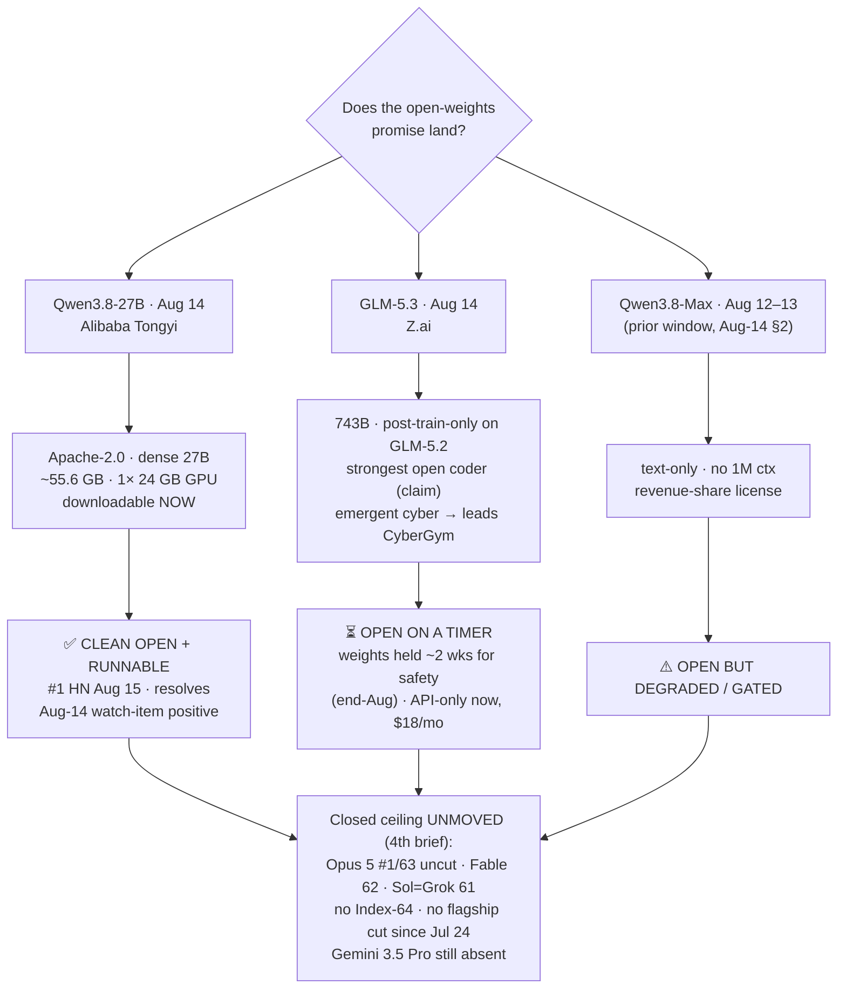

# LLM Updates — 2026-Aug-16

Sunday brief, written Sun Aug 16 (Los Angeles time). For three weeks the series has tracked two
frozen questions. **Does anyone answer at the frontier?** — no Index-64 model and no flagship price
cut since Opus 5 took #1 on Jul 24. And **does the open-weights promise land?** — first "open but
not runnable" (Kimi K3, hardware-gated, Jul-30), then "open, on-device, from the West" (Meta Muse
Glimmer 30B, Aug-11), then Aug-14's twist: Alibaba's Qwen3.8-Max weights finally shipped but
**degraded and gated** (text-only, no 1M context, revenue-share license), while the *runnable*
Qwen3.8-27B "everyone actually wanted" was **still delayed**, its ModelScope countdown pointing at
Aug 15.

**This window that watch-item resolves — cleanly — and the open-weights axis splits into three
distinct release patterns in a single day.**

1. **Qwen3.8-27B shipped (Aug 14; #1 on Hacker News Aug 15) — Apache-2.0, runnable now on one
   consumer GPU.** This is the clean open release the thesis kept waiting for: a **dense 27B**,
   **permissive Apache-2.0** (not the Max flagship's revenue-share license), **~55.6 GB** of BF16
   weights downloadable today, running quantized on a **single 24 GB GPU** (an ~$1,600 RTX 4090).
   It resolves Aug-14's negative watch-item **positive**.
2. **GLM-5.3 (Z.ai, Aug 14) — a frontier open-weights *coder*, but the weights are on a safety
   timer.** Pitched as the **strongest open-weights coding model**, built by scaling **post-training
   only** on the 743B GLM-5.2 base (no new pretrain — the same trick as Grok 4.6's Aug-6 jump), with
   an **"emergent" cyber capability** that leads CyberGym / AutomationBench. But the **weights are
   held ~2 weeks** for a safety evaluation (expected end-Aug); today it's **API-only** via the
   $18/mo GLM Coding Plan. A new pattern: *open, on a timer.*

Two framing points. First, these are **two Chinese labs on the same day** landing at opposite ends
of an openness spectrum — small/clean/runnable-now (Qwen 27B) vs large/frontier-coder/held (GLM-5.3)
— so "the open-weights promise" no longer has one shape. Second, the **closed ceiling stays frozen
for a 4th straight brief**: **Opus 5 still #1 at Index 63, uncut** ($5/$25), Fable 5 at 62, Sol and
Grok 4.6 tied at 61, **no Index-64 model and no flagship price cut since Jul 24**, and **Gemini 3.5
Pro is still off the board** (delayed again — Forbes, Aug 13).

This report advances only what is **new since Aug-14.** It does **not** re-derive Grok 4.6's entry to
the ceiling band (Aug-14 §1), the Qwen3.8-**Max** degraded/gated open release (Aug-14 §2), the
v4.1.1 grader recalibration (Aug-14), Muse Glimmer's on-device recipe (Aug-11), the Kimi K3 open
release (Jul-30), or the Opus 5 "top quality at mid price" reshuffle (Jul-25) — those are unchanged
(§5).

![Diagram of the open-weights axis splitting into three release patterns on Aug 14 2026, under a frozen closed ceiling. Across the top, a dashed band marks the closed ceiling, unchanged for a fourth brief: Claude Opus 5 at Index 63, still number one and uncut at 5 slash 25 dollars; Fable 5 at 62; Sol and Grok 4.6 tied at 61; and Gemini 3.5 Pro still absent, delayed again per Forbes on August 13, with no Index 64 model and no flagship cut since July 24. Below, an openness spectrum runs from gated-or-held on the left to open-plus-runnable-now on the right. Qwen3.8-Max, on the left, is open but degraded: text-only, no 1 million context, revenue-share license. GLM-5.3 from Z.ai, in the middle, is a frontier open coder built by post-training only on the 743 billion parameter GLM-5.2 base, with an emergent cyber capability, but its weights are held about two weeks for safety and it is API-only for now at 18 dollars a month. Qwen3.8-27B, on the far right, is the clean win: a dense 27 billion parameter Apache 2.0 model, 55.6 gigabytes, downloadable now and runnable quantized on a single 24 gigabyte consumer GPU, resolving the August 14 watch-item positively.](open_weights_lands_three_patterns.svg)

---

## 1. Qwen3.8-27B (Aug 14) — the clean, runnable open release the series kept waiting for

The Aug-14 brief closed the Qwen3.8-**Max** thread as "open but degraded/gated" and flagged the
*runnable* 27B as the piece that actually mattered — "still delayed, a ModelScope countdown now
points at Aug 15." It shipped **a day early**: the [`Qwen/Qwen3.8-27B`](https://huggingface.co/Qwen/Qwen3.8-27B)
repo went live on Hugging Face **Aug 14**, and the release hit **#1 on Hacker News on Aug 15** (893
points). Latent Space called the Max + 27B pair ["new open weights models for Coding and Cowork"](https://www.latent.space/p/ainews-qwen-38-max24t-and-27b-new).

What makes it the *clean* release the two prior open-weights briefs never quite delivered:

| Attribute | Qwen3.8-27B |
|---|---|
| License | **Apache-2.0** — permissive, free commercial use (contrast the Max's **revenue-share** license) |
| Params | **Dense 27B** (not MoE) — the whole model runs, no expert-routing surprises |
| Download | **~55.6 GB** BF16, 18 safetensors shards + tokenizer/chat template/config |
| Runs on | **A single 24 GB consumer GPU**, quantized (~$1,600 RTX 4090); 64 GB+ for headroom |
| Lineage | Alibaba **Tongyi Lab**; the consumer-size sibling of the 2.4T-param Qwen3.8-Max flagship |

The point of comparison from every prior open-weights brief was **runnability**. Kimi K3 (Jul-30)
was open but needed a *multi-node datacenter* to serve (~1.4 TB, ≥8 GB300). Muse Glimmer 30B (Aug-11)
solved on-device runnability but is a *distilled child* of a closed teacher, from a US lab. Qwen3.8-27B
is the first release this cycle that is **big-lab, near-generation, permissively licensed, AND runs
on one card you can buy today** — all four at once.

**On capability, be precise about what is and isn't measured.** No independent Artificial Analysis
Intelligence Index score for the **27B specifically** had been published at compile time (the
generation's measured ceiling is the **Max** at ~56–58; the prior-gen [Qwen3.6-27B scored 38](https://artificialanalysis.ai/models/qwen3-6-27b),
already far above its class median of ~9). What we have so far is **vendor-reported** agent-bench
gains over Qwen3.6, which are large:

| Agent benchmark (vendor-reported) | Qwen3.6-27B → Qwen3.8-27B |
|---|---|
| Terminal-Bench v2.1 | 63.4 → **73.0** |
| SWE-bench Pro | 53.5 → **61.7** |
| QwenSWEBench | 49.3 → **79.0** |

Treat those as vendor numbers pending a third-party Index run; the honest read is "**the most
convincing dense, locally-deployable ~30B model yet**, awaiting an outside score." Alibaba's own
framing is that the 27B narrows the lag to closed frontier models to **~6 months** — a claim, not a
measurement. Sources: [BigGo](https://finance.biggo.com/news/b3b5cb0c-d942-401f-ba61-2923b0c81857),
[explainX](https://www.explainx.ai/blog/qwen-3-8-27b-open-weight-model-claude-opus-comparison-august-2026),
[Yotta Labs](https://www.yottalabs.ai/post/qwen-3-8-27b-specs-hardware-requirements-how-to-run-2026),
[Kingy AI](https://kingy.ai/blog/qwen3-8-27b-specs-benchmarks-local-hardware/),
[BenchLM](https://benchlm.ai/models/qwen3-8-27b).

## 2. GLM-5.3 (Z.ai, Aug 14) — a frontier open coder, but "open on a timer"

The same day, **Z.ai** shipped **GLM-5.3** and pitched it as the **strongest open-weights coding
model on the market**. Two things make it the *opposite* release pattern to Qwen's 27B, despite
sharing the "Chinese open weights" label and the launch date.

- **It's frontier-tier, not consumer-tier.** GLM-5.3 is a **743B** model — and, like Grok 4.6's
  Aug-6 jump, **every reported gain comes from extended post-training** on the existing GLM-5.2
  base, not a new pretrain or architecture. Decrypt reported Z.ai
  [calling it the top open-weight coding model](https://decrypt.co/375684/china-z-ai-glm-5-3-top-open-weight-coding-model);
  Unite.AI led with the [cyber capability "that outgrew its training"](https://www.unite.ai/z-ai-launches-glm-5-3-with-frontier-coding-and-a-cyber-capability-that-outgrew-its-training/)
  — GLM-5.3 leads **CyberGym / AutomationBench**, an emergent-capability story with obvious
  safety weight.
- **The weights are held.** Unlike Qwen's download-now 27B, GLM-5.3's **open weights are staged**:
  Z.ai says they'll be downloadable **after a ~two-week safety-evaluation and hardening period**
  (expected around **end of August**). For now it's **API-only**, bundled into the **GLM Coding
  Plan from $18/mo** across every tier, with **no per-token price** published at launch.

So GLM-5.3 introduces a release pattern the series hasn't logged before: **"open, but on a safety
timer."** It's neither the hardware-gate of Kimi K3 nor the license-gate of Qwen3.8-Max — the weights
are *promised open and permissive-ish*, just **deliberately delayed** while the lab runs a
cyber-capability safety pass. That directly echoes the policy axis this series tracked in late July
(Amodei's Jul-27 "non-dangerous open models are a public good, but test them first" position): here a
Chinese lab is **self-imposing** exactly that test-before-release discipline on an emergent-cyber
model. No independent AA Index for GLM-5.3 had posted at compile time; treat the "strongest open
coder" claim as vendor framing pending a third-party run. Further reading:
[Interconnects "how Chinese labs keep stride with the frontier"](https://www.interconnects.ai/p/glm-53-how-chinese-labs-keep-stride),
[explainX](https://explainx.ai/blog/glm-5-3-launch-cyber-defense-benchmarks-august-2026),
[FelloAI "the held-back weights"](https://felloai.com/glm-5-3/).

## 3. Around the edges — a speed tier, and a third geography

Two smaller moves this window, neither disturbing the ceiling:

- **GPT-5.6 Sol Ultrafast (preview, Aug 13).** OpenAI previewed a **Cerebras-powered** Sol tier
  claimed **up to 14× faster** than Standard, **~750 output tok/s** — the *speed* axis again, not
  intelligence or price (Sol's quality/price are unchanged at Index 61 / $5/$30). It slots next to
  Grok 4.6's fast variant and OpenAI's earlier "2.5× faster, same intelligence" Sol update: the
  frontier labs keep competing on **latency** because they aren't moving the **Index** or the
  **price**. ([Spheron](https://www.spheron.network/blog/gpt-5-6-sol-pricing-api-cost-vs-self-hosted-llms-2026/))
- **Solar Pro 4 (Upstage, Korea; scored Aug 6, unveiled ~Aug 14).** A **third geography** in the
  mid-tier agentic race: **Index 42** (well above its price-tier median of ~18), **+27 points over
  Solar Pro 3**, agent-first, ~**$0.30**. Terminal-Bench v2.1 jumped 12→57, AA-LCR 31→71. It's not
  a frontier or near-frontier entrant, but it's a reminder the sub-frontier band isn't only a
  US-vs-China story. ([Artificial Analysis](https://artificialanalysis.ai/articles/upstage-solar-pro-4),
  [Seoul Economic Daily](https://en.sedaily.com/technology/2026/08/14/upstage-unveils-new-ai-model-solar-pro-4))

## 4. The ceiling — still frozen (4th straight brief)

Nothing at the top moved this window. The closed ceiling on the [Artificial Analysis Intelligence
Index](https://artificialanalysis.ai/evaluations/artificial-analysis-intelligence-index) (v4.1.1)
remains:

| Rank | Model | Index (v4.1.1) | Output $/Mtok | State |
|---|---|---|---|---|
| 1 | **Claude Opus 5** | **63** | $25 | **still #1, still uncut** since Jul 24 |
| 2 | Claude Fable 5 | 62 | $50 | — |
| T-3 | GPT-5.6 Sol | 61 | $30 | — |
| T-3 | Grok 4.6 (SpaceXAI) | 61 | $6 | entered the band Aug-14 (cheap end) |

**No Index-64 model. No flagship price cut in ~3.5 weeks.** And **Gemini 3.5 Pro is still absent** —
Forbes reported the [delay continuing on Aug 13](https://www.forbes.com/sites/johnwerner/2026/08/13/gemini-35-pro-delay-continues/)
(coding shortfalls, a disappointing data refresh, "months behind schedule"); Google's live top
remains the **Flash tier** (Gemini 3.7 Flash, Aug 13). Opus 5's continued dominance on the coding /
agentic boards is unchanged — it leads [DeepSWE v1.1](https://codingfleet.com/blog/deepswe-v11-leaderboard-2026/)
(74.0), [HLE](https://benchlm.ai/benchmarks/hle) (64.7), and the [Fullstack Code Arena](https://cryptobriefing.com/opus-5-tops-fullstack-code-arena-leaderboard/)
(1,699), with Fable 5 edging it by 0.1 on FrontierCode v1.1 — the same picture as Jul-25.

So the standing answer to **"does anyone answer at the frontier?"** is, for the fourth brief running,
**no.** All of this window's motion was **below** the ceiling, on the open-weights axis.

## 5. Unchanged since Aug-14 (not re-derived here)

- **Grok 4.6** (SpaceXAI, Aug 6; scored ~Aug 12) at **Index 61**, T-#3 with Sol, $2/$6, +5 over
  Grok 4.5 via **post-training only** — Aug-14 §1.
- **Qwen3.8-Max** open weights (Aug 12–13): **degraded/gated** — text-only, no 1M context,
  revenue-share license (the flagship, distinct from this window's clean 27B) — Aug-14 §2.
- **v4.1.1 grader recalibration** (Aug 6): the top's absolute numbers rose ~+2 (Opus 61→63, Fable
  60→62, Sol 59→61) because the **ruler changed**, not the models — Aug-14.
- **Muse Glimmer 30B** (Meta, Aug 10): open, on-device, distilled-from-Spark agentic model +
  DFlash block-speculation recipe — Aug-11 §1–2.
- **Near-frontier band** (Kimi K3 59 open, Qwen3.8-Max ~56–58, GPT-5.5 ~57, Muse Spark 1.2 ~56) —
  Aug-08 §3.
- **DeepSeek V4-Flash-0731** 50/$0.28 MIT Pareto floor + its long-context architecture — Aug-03 §1.
- **Kimi K3** open weights (Moonshot, Jul-26): 2.8T MoE, Modified-MIT, hardware-gated to serve —
  Jul-30.
- **Opus 5** "top quality at mid price" (Jul-24): the effort dial + paid fast mode; new default on
  Max — Jul-25.
- **Sonnet 5** $2/$10 intro pricing through Aug 31; **Kill Switch / Pacing** policy axis quiet.

## Watch-items into the next brief

1. **Qwen3.8-27B's first independent AA Index score** — does the generation's gain survive at
   consumer size, or does the 27B land well below the Max's ~56–58? (Vendor agent numbers are
   strong; no third-party Index yet.)
2. **GLM-5.3's weights actually shipping** (targeted end-Aug) — does "open on a timer" hold, or does
   the safety hold slip the way Qwen's did twice? And an independent Index / cyber-bench verification
   of the "strongest open coder" + "emergent cyber" claims.
3. **The frozen ceiling** — a 4th brief with no Index-64 and no flagship cut. Gemini 3.5 Pro's delay
   is now the single most overdue frontier event; a ship (or a credible date) would be the first
   top-tier move since Jul 24.
4. **Sol Ultrafast** general availability + pricing — whether the Cerebras speed tier arrives as a
   product or stays a preview.

---

### Method & caveats

- **Compiled** Sun Aug 16 2026 (Los Angeles time). Advances only items **new since the Aug-14
  brief**; unchanged threads are listed in §5 with pointers, not re-derived.
- **Scraping resilience.** Several publisher and lab domains return 403 / are egress-blocked on
  direct fetch from this environment; where direct fetch failed, figures were taken from the search
  index and **corroborated across multiple independent outlets**. Quantitative claims are labelled
  as **measured** (Artificial Analysis), **vendor-reported**, or **claim** where a third-party number
  was not yet available at compile time — notably: **no independent AA Intelligence Index had posted
  for Qwen3.8-27B or GLM-5.3** by compile time, so their capability claims are vendor/press framing
  pending an outside run.
- **Diagrams** are a standalone theme-neutral SVG (slate text that reads on light and dark, no
  external URLs) and an inline Mermaid flowchart; both render in GitHub-flavored markdown.

### Sources

- Artificial Analysis — [Intelligence Index (leaderboard)](https://artificialanalysis.ai/evaluations/artificial-analysis-intelligence-index) · [Index v4.1.1 launch](https://artificialanalysis.ai/articles/artificial-analysis-intelligence-index-v4-1-1) · [Qwen3.6-27B](https://artificialanalysis.ai/models/qwen3-6-27b) · [Solar Pro 4](https://artificialanalysis.ai/articles/upstage-solar-pro-4)
- Qwen3.8-27B — [Hugging Face repo](https://huggingface.co/Qwen/Qwen3.8-27B) · [BigGo (Aug 15 release)](https://finance.biggo.com/news/b3b5cb0c-d942-401f-ba61-2923b0c81857) · [Latent Space](https://www.latent.space/p/ainews-qwen-38-max24t-and-27b-new) · [explainX comparison](https://www.explainx.ai/blog/qwen-3-8-27b-open-weight-model-claude-opus-comparison-august-2026) · [Yotta Labs specs](https://www.yottalabs.ai/post/qwen-3-8-27b-specs-hardware-requirements-how-to-run-2026) · [Kingy AI](https://kingy.ai/blog/qwen3-8-27b-specs-benchmarks-local-hardware/) · [BenchLM](https://benchlm.ai/models/qwen3-8-27b)
- GLM-5.3 — [Decrypt](https://decrypt.co/375684/china-z-ai-glm-5-3-top-open-weight-coding-model) · [Unite.AI](https://www.unite.ai/z-ai-launches-glm-5-3-with-frontier-coding-and-a-cyber-capability-that-outgrew-its-training/) · [Interconnects](https://www.interconnects.ai/p/glm-53-how-chinese-labs-keep-stride) · [explainX](https://explainx.ai/blog/glm-5-3-launch-cyber-defense-benchmarks-august-2026) · [FelloAI](https://felloai.com/glm-5-3/)
- Ceiling & delays — [Forbes: Gemini 3.5 Pro delay continues](https://www.forbes.com/sites/johnwerner/2026/08/13/gemini-35-pro-delay-continues/) · [Opus 5 tops Fullstack Code Arena](https://cryptobriefing.com/opus-5-tops-fullstack-code-arena-leaderboard/) · [DeepSWE v1.1](https://codingfleet.com/blog/deepswe-v11-leaderboard-2026/) · [HLE leaderboard](https://benchlm.ai/benchmarks/hle)
- Edges — [Spheron: GPT-5.6 Sol pricing/Ultrafast](https://www.spheron.network/blog/gpt-5-6-sol-pricing-api-cost-vs-self-hosted-llms-2026/) · [Seoul Economic Daily: Solar Pro 4](https://en.sedaily.com/technology/2026/08/14/upstage-unveils-new-ai-model-solar-pro-4)
