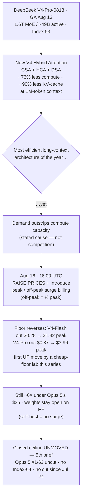

# LLM Updates — 2026-Aug-17

Monday brief, written Mon Aug 17 (Los Angeles time). For a month this series has tracked two frozen
questions — **does anyone answer at the frontier?** (no Index-64 model, no flagship price cut since
Opus 5 took #1 on Jul 24) and **does the open-weights promise land?** (resolved Aug-16 into three
distinct release patterns in a single day). Underneath both has run a quieter third thread since
late July: **the price war at the floor.** Every brief since Jul-30 has quoted the same anchor —
**DeepSeek V4-Flash, Index 50, output $0.28/Mtok, MIT** — as the cheap Pareto floor the whole market
is measured against, and the story was always the floor going *down*: OpenAI cut GPT-5.6 Luna −80%
(Jul-30), and DeepSeek answered not with a matching discount but with *capability at pennies*
(Aug-03).

**This window that thread reverses.** At **16:00 UTC on Aug 16** — hours after Sunday's brief was
compiled — **DeepSeek raised its own prices**, by 50% to as much as ~1,100% depending on token type,
and introduced **peak/off-peak surge billing** for the first time. The $0.28 floor this series has
quoted in every brief is gone; V4-Flash output is now **$1.32 at peak / $0.66 off-peak**. It comes
bundled with a model Sunday's open-weights brief didn't log: **DeepSeek V4-Pro-0813**, a
new-architecture flagship that went **GA on Aug 13** at **Index 53**. The efficiency leader — the lab
whose entire pitch was frontier-adjacent quality for pennies — is telling the market that inference
at that quality **costs money after all**, and it's raising the floor to say so.

Two things this is **not**. It is **not** the ceiling moving — the closed top is frozen for a **5th
straight brief** (§3). And it is **not** competition-driven — DeepSeek's stated cause is **demand
outstripping compute capacity**, not a rival forcing its hand. This is the first time in the series a
cheap-floor operator has moved prices *up*.

This report advances only what is **new since Aug-16.** It does **not** re-derive the open-weights
three-way split (Qwen3.8-27B / GLM-5.3 / Qwen3.8-Max — Aug-16 §1–2), Grok 4.6's entry to the
ceiling band (Aug-14 §1), the v4.1.1 grader recalibration (Aug-14), or the Opus 5 reshuffle
(Jul-25) — those are unchanged (§5).

![Diagram: the floor stops falling. A dashed indigo band across the top marks the frozen closed ceiling for a fifth brief — Opus 5 Index 63 at $25 still #1 and uncut, Fable 5 62/$50, GPT-5.6 Sol 61/$30, Grok 4.6 61/$6, no Index-64 and no flagship cut since Jul 24, Gemini 3.5 Pro still absent. Below, an emerald box shows the downward price-war phase of Jul 30–Aug 3 (Luna cut −80% to $1.20; DeepSeek answering with capability at pennies, V4-Flash Index 50 at $0.28 MIT), and a bent amber arrow turns upward at Aug 16 16:00 UTC into the reversal: DeepSeek ships V4-Pro-0813 at Index 53 on a new V4 hybrid-attention architecture and raises prices with new peak/off-peak surge billing. The bottom band lists the deltas: V4-Flash output $0.28→$1.32 peak/$0.66 off-peak; V4-Pro output $0.87→$3.96 peak/$1.98 off-peak; V4-Pro cached input $0.003625→up to the peak rate (≈+1,100%); cause is demand outstripping compute capacity, not competition, and weights stay open on Hugging Face.](floor_reverses_price_war.svg)

---

## 1. DeepSeek raises the floor — the price war's first reversal (Aug 16, 16:00 UTC)

The headline everyone ran was the percentage: **"DeepSeek raising API prices by up to 1,100%"**
([QZ](https://qz.com/deepseek-api-price-increase-v4-peak-off-peak-081326),
[Cryptobriefing](https://cryptobriefing.com/deepseek-raises-api-prices-1100-percent/),
[Yahoo Finance](https://finance.yahoo.com/technology/ai/articles/deepseek-raising-api-prices-1-174027670.html)),
or, more soberly, **"four times pricier"**
([Engadget](https://www.engadget.com/2236912/deepseek-ai-models-get-four-times-pricier/)) and
**"more than 10x on some V4 prices as AI demand strains capacity"**
([InfoWorld](https://www.infoworld.com/article/4209439/deepseek-raises-some-v4-prices-by-more-than-10x-as-ai-demand-strains-capacity.html)).
The change took effect **16:00 UTC on Aug 16, 2026**, and applies across the V4 lineup.

The exact deltas matter more than the percentage, because the percentage is inflated by one
pathologically cheap tier:

| V4-Pro (per Mtok) | Before | After — off-peak | After — peak | Change |
|---|---|---|---|---|
| Output | $0.87 | $1.98 | **$3.96** | ~4.5× at peak |
| Uncached input | $0.435 | $0.66 | $1.32 | ~3× at peak |
| **Cached input** | **$0.003625** | — | up to peak rate | **≈ +1,100%** (the headline) |

| V4-Flash output (per Mtok) | Before | After — off-peak | After — peak |
|---|---|---|---|
| Output | **$0.28** | $0.66 | **$1.32** |

The four-digit "1,100%" figure comes almost entirely from **cached-input tokens**, which DeepSeek had
priced at an *absurd* $0.003625/Mtok and is now raising to as much as the new peak rate — a large
multiple off a near-zero base ([Hardware Busters](https://hwbusters.com/news/deepseek-api-prices-rise-up-to-1100-on-sunday-and-peak-hours-come-with-them/)).
The honest read is the one Engadget and InfoWorld led with: **output roughly quadrupled at peak, and
a rock-bottom cache tier was normalized.**

**The genuinely new mechanic is peak/off-peak surge pricing.** DeepSeek's own
[announcement](https://x.com/deepseek_ai/status/2087864589895798968) frames it as introducing
**peak and off-peak rates**, with **off-peak set 50% below peak** to "enable more flexible workload
scheduling" / "allocate resources more reasonably." Peak windows are reported as **01:00–04:00 and
06:00–10:00 UTC** (Hardware Busters / QZ). This is the floor's first move toward **demand-based
pricing** — the same lever hyperscalers use for compute — which is the tell for what's actually
happening: the stated cause across every outlet is **demand outstripping compute capacity**, not a
competitor. As InfoWorld put it, "DeepSeek can't keep up with compute requirements."

**Why it matters for the series' through-line.** For a month the floor thread has been "who delivers
frontier-adjacent quality for the fewest pennies," and the direction was always *down*. This is the
**first reversal**: the cheapest credible operator conceding that serving frontier-adjacent quality
at 1M context is capacity-constrained enough to raise prices ~4.5× and meter by time-of-day. The
floor is still far below the West — even at peak, V4-Pro's $3.96 output undercuts Opus 5's $25 by
~6× — but the *slope* flipped. (Fortune, Reuters-syndicated, framed it as DeepSeek
["increasing prices for AI services by multiple times"](https://fortune.com/2026/08/13/deepseek-increases-prices-for-ai-services-by-multiple-times/).)

One important qualifier for anyone reading this as "the cheap era is over": **the weights stay
open.** V4-Pro and V4-Flash are both on Hugging Face ([`deepseek-ai/DeepSeek-V4-Pro`](https://huggingface.co/deepseek-ai/DeepSeek-V4-Pro),
[`deepseek-ai/DeepSeek-V4-Flash`](https://huggingface.co/deepseek-ai/DeepSeek-V4-Flash)); the surge
pricing is on **DeepSeek's hosted inference**, not the model's availability. If you self-host, there
is no peak surcharge — the price hike is a statement about *DeepSeek's own GPUs*, not about what the
model costs to run in principle.

## 2. What got repriced — DeepSeek V4-Pro-0813 and the new V4 architecture

Sunday's brief was busy with the open-weights three-way split and never logged the model this
pricing move is attached to. **DeepSeek V4-Pro-0813 went GA on Aug 13**
([DeepSeek API docs](https://api-docs.deepseek.com/news/news260813/); [QZ launch report](https://qz.com/deepseek-v4-pro-official-launch-081326)),
and Artificial Analysis brought DeepSeek **"back among the leading open-weights models"** with the
V4 pair ([AA article](https://artificialanalysis.ai/articles/deepseek-is-back-among-the-leading-open-weights-models-with-v4-pro-and-v4-flash)).

**Capability — measured, and modest.** V4-Pro-0813 (Reasoning, Max Effort) scores **53 on the
[Artificial Analysis Intelligence Index](https://artificialanalysis.ai/models/deepseek-v4-pro)** —
**one point above V4-Flash** and level with June's GLM-5.2, but **~4 points behind** GPT-5.6's mid
tier and **~6 behind** Kimi K3 ([officechai](https://officechai.com/ai/deepseek-v4-0813-pro-benchmarks/)).
[SCMP's](https://www.scmp.com/tech/big-tech/article/3363895/deepseeks-updated-v4-pro-ai-model-struggles-benchmarks-shines-cybersecurity)
framing was blunt: **"struggles on benchmarks, shines in cybersecurity."** The one standout is
science reasoning — **GPQA Diamond 93%**, tying Opus 5 and Kimi K3 (low) and trailing only Grok 4.6
(high, 95%). So V4-Pro is a *near-floor* model, not a ceiling challenger; the news here is the
**pricing and architecture**, not a new intelligence peak.

**Architecture — this is where V4-Pro earns its "Pro."** The V4 family is DeepSeek's **first new
architecture** since V3, a **1.6T-param MoE with ~49B active** (V4-Flash is 284B / ~13B active),
built around a **Hybrid Attention** design that combines **Compressed Sparse Attention (CSA)**,
**Heavily Compressed Attention (HCA)**, and **DeepSeek Sparse Attention (DSA)** — the same
long-context lineage this series has carried as background since Aug-03, now the headline mechanism.
DeepSeek reports that at a **1M-token context**, V4-Pro needs only **~27% of the inference FLOPs and
~10% of the KV-cache** of V3.2 — roughly a **73% compute reduction and 90% KV-cache reduction** per
token ([DeepSeek V4 overview](https://deepseek.ai/deepseek-v4);
[arXiv: "Towards Highly Efficient Million-Token Context Intelligence"](https://arxiv.org/html/2606.19348v1)).

That efficiency claim is the quiet irony of the window: **the most inference-efficient long-context
architecture shipped this year is the one whose vendor raised prices for capacity reasons three days
later.** Efficiency per token didn't save DeepSeek from demand per second.

## 3. The ceiling — still frozen (5th straight brief)

Nothing at the top moved. The closed ceiling on the
[Artificial Analysis Intelligence Index](https://artificialanalysis.ai/leaderboards/models) (v4.1.1)
is unchanged from Aug-16:

| Rank | Model | Index (v4.1.1) | Output $/Mtok | State |
|---|---|---|---|---|
| 1 | **Claude Opus 5** | **63** | $25 | **still #1, still uncut** since Jul 24 |
| 2 | Claude Fable 5 | 62 | $50 | — |
| T-3 | GPT-5.6 Sol | 61 | $30 | — |
| T-3 | Grok 4.6 (SpaceXAI) | 61 | $6 | — |

**No Index-64 model. No flagship price cut in ~3.5 weeks** (confirmed on the live leaderboard Aug 17:
Opus 5 leads Intelligence at 63 *and* the Agentic Index at 55.3). And **Gemini 3.5 Pro is still
absent** — the [Forbes Aug 13 delay report](https://www.forbes.com/sites/johnwerner/2026/08/13/gemini-35-pro-delay-continues/)
(coding shortfalls, disappointing data refresh, "months behind schedule") is still the last word;
Google's live top remains the **Flash tier**. So the standing answer to *"does anyone answer at the
frontier?"* is, for the **fifth brief running, no** — and, notably, this window's motion wasn't even
on the open-weights axis (Aug-16's story) but on **price**.

## 4. Watch-items from Aug-16 — both still open

Neither of Sunday's two open resolutions landed in 3 days:

- **Qwen3.8-27B's first independent AA Index — still not posted.** Artificial Analysis had **not**
  scored the 27B specifically as of Aug 17; third-party trackers still show "no score yet," with
  informal estimates around **~37–38** (reasoning) by analogy to the prior-gen Qwen3.6-27B's 38, well
  below the Max's ~56–58. The strong vendor agent-bench numbers (Aug-16 §1) remain **unverified**.
  ([OrcaRouter "no score yet"](https://www.orcarouter.ai/blog/qwen-3-8-27b-artificial-analysis))
- **GLM-5.3's weights — still held.** Z.ai's safety-hold is unchanged: weights are staged for
  **~two weeks post-launch (≈ Aug 28)**; as of Aug 17 GLM-5.3 remains **API-only** via the GLM Coding
  Plan, weights not yet on Hugging Face. "Open on a timer" hasn't ticked over yet.
  ([FelloAI](https://felloai.com/glm-5-3/), [modemguides](https://www.modemguides.com/blogs/ai-news/glm-5-3-open-weights-security-findings))

## 5. Unchanged since Aug-16 (not re-derived here)

- **The open-weights three-way split (Aug 14):** Qwen3.8-27B (Apache-2.0, dense 27B, runs on one
  24 GB GPU), GLM-5.3 (frontier open coder, "open on a timer"), Qwen3.8-Max (degraded/gated) —
  Aug-16 §1–2.
- **Grok 4.6** (SpaceXAI) at **Index 61**, T-#3, $2/$6, via post-training only — Aug-14 §1.
- **v4.1.1 grader recalibration** (Aug 6): the top's absolute numbers rose ~+2 because the **ruler**
  changed — Aug-14. (This is why the DeepSeek floor now indexes ~52–53 rather than the "50" carried
  in earlier briefs.)
- **Muse Glimmer 30B** (Meta, Aug 10): open, on-device, distilled-from-Spark + DFlash recipe — Aug-11.
- **Near-frontier band** (Kimi K3 59 open, Qwen3.8-Max ~56–58, GPT-5.5 ~57, Muse Spark 1.2 ~56) —
  Aug-08 §3.
- **Kimi K3** open weights (Moonshot, Jul-26): 2.8T MoE, Modified-MIT, hardware-gated to serve —
  Jul-30.
- **Opus 5** "top quality at mid price" (Jul-24): effort dial + paid fast mode; default on Max — Jul-25.
- **Sonnet 5** $2/$10 intro pricing through Aug 31; **Kill Switch / Pacing** policy axis quiet.

## Watch-items into the next brief

1. **Does the floor keep rising — and does anyone follow?** DeepSeek's surge pricing is the first
   up-move; watch whether the demand/capacity story pulls other cheap operators (Qwen, GLM, the
   OpenRouter Chinese-token pool) up with it, or whether a rival undercuts the newly-raised floor.
2. **A third-party score for V4-Pro's peak-vs-off-peak value.** At $3.96 peak vs $1.98 off-peak for
   the *same* Index-53 model, the Pareto-frontier picture now depends on *when you call the API* —
   the first time time-of-day enters this series' price analysis.
3. **Qwen3.8-27B's first independent AA Index** (still unresolved) and **GLM-5.3's weights actually
   shipping** (~Aug 28) — both carried over from Aug-16.
4. **The frozen ceiling** — now 5 briefs with no Index-64 and no flagship cut. Gemini 3.5 Pro's
   delay is the single most overdue frontier event.

---

### Method & caveats

- **Compiled** Mon Aug 17 2026 (Los Angeles time). Advances only items **new since the Aug-16
  brief**; unchanged threads are listed in §5 with pointers, not re-derived. DeepSeek V4-Pro GA'd
  Aug 13 but was not logged in Sunday's open-weights-focused brief; the **pricing reversal is a
  genuinely new Aug-16 (16:00 UTC) event**, after that brief was compiled.
- **Scraping resilience.** Many publisher and lab domains (pricepertoken, llm-stats, qz.com,
  api-docs.deepseek.com, officechai, and others) return 403 / are egress-blocked on direct fetch from
  this environment. Where direct fetch failed, figures were taken from the search index and
  **corroborated across multiple independent outlets** (Engadget, InfoWorld, Fortune, Yahoo Finance,
  QZ, Cryptobriefing, Hardware Busters, SCMP, Artificial Analysis). Quantitative claims are labelled
  **measured** (AA), **vendor-reported**, or **claim** where no third-party number existed at compile
  time — notably **no independent AA Index for Qwen3.8-27B or GLM-5.3** had posted yet.
- **Pricing precision.** Per-token figures (V4-Pro output $0.87→$3.96 peak; V4-Flash output
  $0.28→$1.32 peak; cached input $0.003625→peak) are corroborated across ≥3 outlets; the exact **peak
  windows (01:00–04:00 & 06:00–10:00 UTC)** come from a single outlet (Hardware Busters) and should be
  confirmed against DeepSeek's own docs once the egress block clears.
- **Diagrams** are a standalone theme-neutral SVG (slate/emerald/amber strokes that read on light and
  dark, no external URLs) and an inline Mermaid flowchart; both render in GitHub-flavored markdown.

### Sources

- DeepSeek pricing — [QZ (up to 1,100%)](https://qz.com/deepseek-api-price-increase-v4-peak-off-peak-081326) · [Engadget (4× pricier)](https://www.engadget.com/2236912/deepseek-ai-models-get-four-times-pricier/) · [InfoWorld (10×, capacity)](https://www.infoworld.com/article/4209439/deepseek-raises-some-v4-prices-by-more-than-10x-as-ai-demand-strains-capacity.html) · [Fortune](https://fortune.com/2026/08/13/deepseek-increases-prices-for-ai-services-by-multiple-times/) · [Yahoo Finance](https://finance.yahoo.com/technology/ai/articles/deepseek-raising-api-prices-1-174027670.html) · [Cryptobriefing](https://cryptobriefing.com/deepseek-raises-api-prices-1100-percent/) · [Hardware Busters (peak windows)](https://hwbusters.com/news/deepseek-api-prices-rise-up-to-1100-on-sunday-and-peak-hours-come-with-them/) · [DeepSeek announcement](https://x.com/deepseek_ai/status/2087864589895798968)
- DeepSeek V4-Pro model — [AA model page (Index 53)](https://artificialanalysis.ai/models/deepseek-v4-pro) · [AA "back among leading open weights"](https://artificialanalysis.ai/articles/deepseek-is-back-among-the-leading-open-weights-models-with-v4-pro-and-v4-flash) · [officechai benchmarks](https://officechai.com/ai/deepseek-v4-0813-pro-benchmarks/) · [SCMP](https://www.scmp.com/tech/big-tech/article/3363895/deepseeks-updated-v4-pro-ai-model-struggles-benchmarks-shines-cybersecurity) · [DeepSeek API docs (GA)](https://api-docs.deepseek.com/news/news260813/)
- V4 architecture — [DeepSeek V4 overview (1.6T, Hybrid Attention)](https://deepseek.ai/deepseek-v4) · [arXiv: Million-Token Context Intelligence](https://arxiv.org/html/2606.19348v1) · [HF: V4-Pro](https://huggingface.co/deepseek-ai/DeepSeek-V4-Pro) · [HF: V4-Flash](https://huggingface.co/deepseek-ai/DeepSeek-V4-Flash)
- Ceiling & delays — [AA leaderboard](https://artificialanalysis.ai/leaderboards/models) · [BenchLM: Opus 5 leads at 63](https://benchlm.ai/benchmarks/artificialanalysis) · [Forbes: Gemini 3.5 Pro delay continues](https://www.forbes.com/sites/johnwerner/2026/08/13/gemini-35-pro-delay-continues/)
- Carried-over watch-items — [OrcaRouter: Qwen3.8-27B no AA score yet](https://www.orcarouter.ai/blog/qwen-3-8-27b-artificial-analysis) · [FelloAI: GLM-5.3 held weights](https://felloai.com/glm-5-3/) · [modemguides: GLM-5.3 open-weights ETA](https://www.modemguides.com/blogs/ai-news/glm-5-3-open-weights-security-findings)
