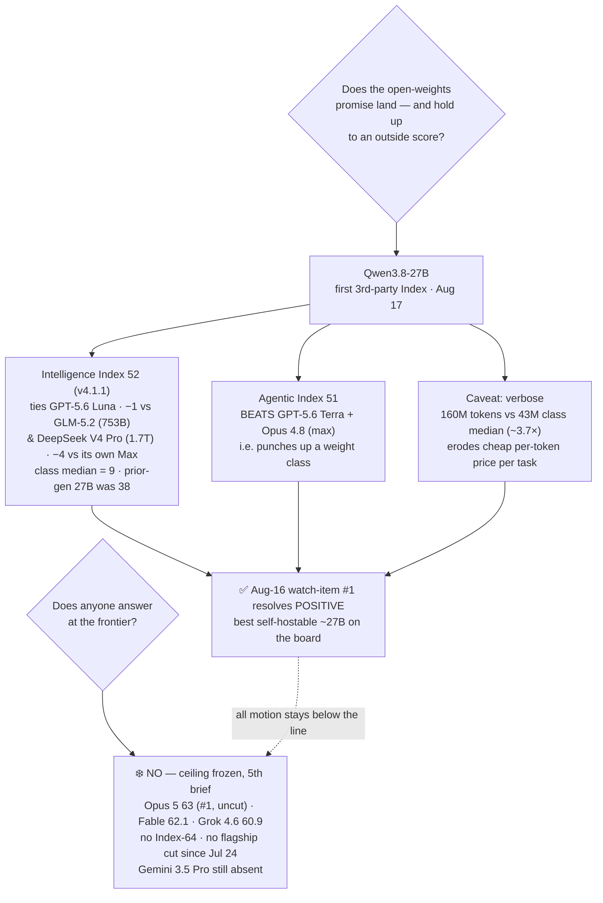

# LLM Updates — 2026-Aug-18

Tuesday brief, written Tue Aug 18 (Los Angeles time). For a month the series has tracked two frozen
questions. **Does anyone answer at the frontier?** — no Index-64 model and no flagship price cut
since Claude Opus 5 took #1 on Jul 24. And **does the open-weights promise land?** — after Kimi K3
("open but not runnable," Jul-30), Meta Muse Glimmer 30B ("open, on-device, from the West," Aug-11),
and Aug-14's three-way split, the Aug-16 brief closed on a clean win — Qwen3.8-27B, dense/Apache-2.0/
runnable on one GPU — but flagged the one thing still missing: **no independent capability score.**
The whole "best open ~30B yet" claim rested on **vendor** agent numbers.

**This window that gap closes.** On **Aug 17**, Artificial Analysis posted its **first third-party
Intelligence Index for Qwen3.8-27B: 52** ([Simon Willison](https://simonwillison.net/2026/Aug/17/qwen-38-27b-scores-52/)).
The number resolves Aug-16's top watch-item **firmly positive**, and the *agentic* half of it is
stronger than the headline: on Artificial Analysis's **Agentic Index the 27B scores 51 — beating
GPT-5.6 Terra and Claude Opus 4.8** (at max effort). A model you can run on a single 24 GB card now
out-agents closed models many times its size. The catch is **verbosity**, and it's a real one (§1).

Meanwhile the **closed ceiling stays frozen for a 5th straight brief**: Opus 5 still #1 at Index
**63**, uncut ($5/$25); Fable 5 **62.1**; Grok 4.6 **60.9**; **no Index-64 model and no flagship
price cut since Jul 24**; and **Gemini 3.5 Pro is still off the board**. This window's only real
motion was, again, **below** the ceiling — and this time it was a *measurement*, not a release.

This report advances only what is **new since Aug-16.** It does **not** re-derive the Qwen3.8-27B
launch (Aug-16 §1), GLM-5.3's "open on a timer" pattern (Aug-16 §2), Sol Ultrafast's preview
(Aug-16 §3), Grok 4.6's ceiling-band entry (Aug-14 §1), or the v4.1.1 grader recalibration (Aug-14)
— those are unchanged and pointed to in §4.

![Scatter of Artificial Analysis Intelligence Index against parameter count on a log scale. A dashed amber band across the top marks the closed ceiling, frozen for a fifth straight brief — Claude Opus 5 at 63 and still number one and uncut, Fable 5 at 62.1, Grok 4.6 at 60.9, with no Index-64 model and no flagship price cut since July 24. Four measured points sit below it: Qwen3.8-Max at Index 56 at 2.4 trillion parameters, DeepSeek V4 Pro 0813 at 53 at 1.7 trillion, GLM-5.2 at 53 at 753 billion, and GPT-5.6 Luna at 52. The highlighted sky-blue point is Qwen3.8-27B, a dense 27-billion-parameter Apache-2.0 open-weights model, landing at Index 52 on August 17 — tying GPT-5.6 Luna, one point behind models 28 to 63 times larger, and only 4 points below its own 2.4-trillion-parameter Max sibling, and far above the open-weights 27B size-class median of 9 marked by a dashed floor. A callout notes the model's Agentic Index of 51, which beats GPT-5.6 Terra and Claude Opus 4.8 at max effort, and a caution that it is verbose, emitting 160 million tokens on the index versus a 43-million class median, which erodes its cheap per-token price at the task level.](open_weights_gets_measured.svg)

---

## 1. Qwen3.8-27B, independently measured — Index 52, Agentic Index 51

Aug-16 called the 27B "the most convincing dense, locally-deployable ~30B model yet, **awaiting an
outside score**." The outside score is in, and it's good.

**Intelligence Index: 52** (v4.1.1). For context on how far that is above its weight class:

| Model | Params | Intelligence Index (v4.1.1) | Note |
|---|---|---|---|
| Qwen3.8-**Max** | ~2.4T MoE | **56** | the flagship sibling — only **4 pts** above the 27B |
| DeepSeek V4 Pro 0813 | ~1.7T | 53 | ~63× larger, **1 pt** ahead |
| GLM-5.2 | 753B | 53 | ~28× larger, **1 pt** ahead |
| GPT-5.6 Luna (max) | closed | 52 | **tie** |
| **Qwen3.8-27B** | **dense 27B** | **52** | **runs on one 24 GB GPU** |
| _open-weights 27B-class median_ | — | **9** | the 27B is **+43 over its class median** |
| Qwen3.6-27B (prior gen) | dense 27B | 38 | **+14 generation-over-generation** |

The story the table tells: **the generation's jump mostly survives at consumer size.** The 2.4T Max
measures 56; the dense 27B measures 52 — a 4-point gap, not the collapse-to-class-median that a
distilled or trimmed sibling usually shows (its own class median is **9**). It **ties GPT-5.6 Luna**
and sits **one point behind** GLM-5.2 (753B) and DeepSeek V4 Pro (1.7T) — models **28× and 63×** its
size. Sources: [Simon Willison](https://simonwillison.net/2026/Aug/17/qwen-38-27b-scores-52/),
[Artificial Analysis model page](https://artificialanalysis.ai/models/qwen3-8-27b),
[Hacker News discussion](https://news.ycombinator.com/item?id=49334544).

**The agentic result is the sharper one.** On Artificial Analysis's **Agentic Index** — the
sub-benchmark for tool-use / multi-step agent tasks — Qwen3.8-27B scores **51, beating GPT-5.6 Terra
and Claude Opus 4.8 (max effort)**. That is a 27B open model out-agenting *closed* flagships several
times its size. It backs the vendor agent numbers Aug-16 could only cite unverified (Terminal-Bench
v2.1 73.0, SWE-bench Pro 61.7, QwenSWEBench 79.0). [GIGAZINE](https://gigazine.net/gsc_news/en/20260818-qwen3-8-27b-performance/)
(Aug 18) led with exactly this — "agent performance exceeding GPT-5.6 Terra… overwhelmingly more
powerful than models of comparable size" — and [VentureBeat](https://venturebeat.com/technology/qwen3-8-27b-runs-frontier-class-coding-agents-and-reasoning-locally-no-cloud-api-required)
framed it as "**frontier-class coding agents and reasoning, run locally, no cloud API required.**"
Be precise about the comparison: it beats **Opus 4.8**, the *prior* Anthropic flagship — **not** the
current Opus 5 (63) that still owns the ceiling. It's a weight-class-punching-up result, not a
frontier-toppling one.

**The catch — verbosity, and it's not cosmetic.** Producing that Index took **160M output tokens**,
versus a **43M median** for open models of its size class — roughly **3.7× the tokens per the same
evaluation**. The 27B's per-token price is low ($0.40 in / $3 out per Mtok on
[OpenRouter](https://openrouter.ai/compare/qwen/qwen3.8-27b/openai/gpt-5.6-terra); ~$0.33/$2.40 on
some hosts; **$0 self-hosted**), but **cost-per-task is token-count × price**, and a 3.7× token
multiplier eats much of the cheap-per-token advantage on hosted inference. Self-hosted, you pay it in
wall-clock and VRAM-seconds instead. So the honest read: **best self-hostable ~27B on the board,
agentic-leading for its size — but talkative, and you budget for that.** Context is 256k
(262,144); text + image in, text out.

**Net:** Aug-16's watch-item #1 resolves **positive**. The open-weights promise didn't just land as a
runnable download — it now has a **third-party number** behind it, and the number is best where it
matters most for the agent era.

## 2. What did *not* move — the ceiling, GLM-5.3's weights, Sol Ultrafast

Everything the series was also watching held still this window.

- **The closed ceiling — frozen a 5th straight brief.** The [Artificial Analysis Intelligence
  Index](https://artificialanalysis.ai/evaluations/artificial-analysis-intelligence-index) top is
  unchanged: **Opus 5 63 (#1, uncut, $5/$25)**, **Fable 5 62.1**, **Grok 4.6 60.9** — across 177
  tested models ([BenchLM](https://benchlm.ai/benchmarks/artificialanalysis)). **No Index-64 model.
  No flagship price cut since Jul 24** (~3.5+ weeks). The answer to "does anyone answer at the
  frontier?" is, for the fifth brief running, **no.**
- **Gemini 3.5 Pro — still absent.** No new ship or date since [Forbes' Aug-13 "delay continues"](https://www.forbes.com/sites/johnwerner/2026/08/13/gemini-35-pro-delay-continues/)
  (coding shortfalls, disappointing data refresh, "months behind schedule"). Google's live top
  remains the Flash tier. It is now the single most overdue frontier event on the board.
- **GLM-5.3's weights — still held.** Z.ai's "open on a timer" release (Aug-16 §2) is **on schedule
  but not yet due**: the safety-hardening hold still points at **~Aug 28**; the model remains
  **API-only** via the $18/mo GLM Coding Plan, weights not yet downloadable
  ([AI Weekly](https://aiweekly.co/alerts/zai-ships-glm-53-holds-open-weights-for-cyber-safety-review)).
  No slip yet — but no ship yet either.
- **Sol Ultrafast — still a preview.** OpenAI's Cerebras-powered ~750 tok/s Sol tier (Aug-16 §3) is
  **still waitlist-only, still no price and no GA date** ([TechTimes](https://www.techtimes.com/articles/324514/20260814/gpt-56-sol-now-runs-real-time-speed-openais-ultrafast-preview-offers-no-price-date.htm),
  [explainX](https://explainx.ai/blog/openai-gpt-5-6-sol-ultrafast-cerebras-august-2026)). The
  frontier labs keep competing on **latency** because they aren't moving the Index or the price.

**No new model shipped in the Aug 15–18 window.** The most recent release remains Gemini **3.7
Flash** (Aug 13); [release trackers](https://llmgateway.io/timeline) show nothing new from OpenAI,
Anthropic, xAI, Meta, DeepSeek, or Moonshot since. The window's entire signal is the **Qwen 27B
measurement**, not a launch.

## 3. Reading the two together

The through-line of the last month sharpens this window. The **bottom of the map keeps improving and
now keeps *proving* it** — an open, Apache-2.0, one-GPU 27B that ties a closed model and leads its
weight class on agents, with an independent score to cite. The **top of the map has not moved in
five briefs** — same three names, same prices, same #1, and the one lab (Google) that could break the
freeze is still delayed. The gap between "what you can run yourself" and "the best you can rent" is
being compressed **entirely from below**. Nothing this window compressed it from above.

## 4. Unchanged since Aug-16 (not re-derived here)

- **Qwen3.8-27B launch** (Aug 14): dense 27B, Apache-2.0, ~55.6 GB, one 24 GB GPU, #1 HN Aug 15 —
  Aug-16 §1. *This brief adds the independent Index (§1); the launch facts are unchanged.*
- **GLM-5.3** (Z.ai, Aug 14): 743B, post-train-only on GLM-5.2, "strongest open coder" + emergent
  cyber, **weights held ~2 wks for safety (≈Aug 28)**, API-only $18/mo — Aug-16 §2.
- **Sol Ultrafast** (Aug 13): Cerebras, ~750 tok/s, ~14× faster, preview/waitlist, no price — Aug-16 §3.
- **Solar Pro 4** (Upstage, Korea; ~Aug 14): Index 42, agent-first, ~$0.30, a third geography — Aug-16 §3.
- **Grok 4.6** (SpaceXAI, Aug 6): Index 60.9, ceiling band (cheap end $2/$6), post-train-only — Aug-14 §1.
- **Qwen3.8-Max** open weights (Aug 12–13): degraded/gated — text-only, no 1M ctx, revenue-share
  license; measured Index **56** — Aug-14 §2.
- **v4.1.1 grader recalibration** (Aug 6): the top's absolute numbers rose ~+2 because the ruler
  changed, not the models — Aug-14.
- **Muse Glimmer 30B** (Meta, Aug 10): open, on-device, distilled-from-Spark agentic + DFlash — Aug-11.
- **DeepSeek V4-Flash-0731** 50/$0.28 MIT Pareto floor — Aug-03 §1.
- **Kimi K3** open weights (Moonshot, Jul-26): 2.8T MoE, Modified-MIT, hardware-gated to serve — Jul-30.
- **Opus 5** "top quality at mid price" (Jul-24): effort dial + paid fast mode — Jul-25.
- **Sonnet 5** $2/$10 intro pricing through Aug 31; **Kill Switch / Pacing** policy axis quiet.

## Watch-items into the next brief

1. **GLM-5.3's weights actually shipping** (targeted ~Aug 28) — the next hard test of the "open on a
   safety timer" pattern. Does it hold to date, or slip the way Qwen3.8-Max's did twice? Plus an
   independent Index / cyber-bench check on the "strongest open coder" + "emergent cyber" claims.
2. **Whether Qwen3.8-27B's verbosity gets priced in** — now that the 160M-vs-43M token gap is on the
   record, does a real cost-per-task (not per-token) comparison change the "cheapest good open 27B"
   framing? Watch for hosted providers surfacing task-cost, and for a follow-up dense sibling.
3. **The frozen ceiling — 5th brief with no Index-64 and no flagship cut.** Gemini 3.5 Pro's delay is
   the single most overdue frontier event; a ship or a credible date would be the first top-tier move
   since Jul 24.
4. **Sol Ultrafast** GA + pricing — whether the Cerebras speed tier becomes a product or stays a
   preview.

---

### Method & caveats

- **Compiled** Tue Aug 18 2026 (Los Angeles time). Advances only items **new since the Aug-16
  brief**; unchanged threads are listed in §4 with pointers, not re-derived.
- **Scraping resilience.** Direct fetch is **broadly egress-blocked** from this environment
  (`simonwillison.net`, `artificialanalysis.ai`, `news.ycombinator.com`, `gigazine.net`,
  `benchlm.ai`, `dataconomy.com` all returned EGRESS_BLOCKED on direct fetch). All figures below were
  therefore taken from the **search index** and **corroborated across multiple independent outlets**;
  no quantitative claim here rests on a single source. Where numbers could not be independently
  confirmed they are labelled **vendor-reported** or **claim**.
- **What is measured vs claimed.** The Qwen3.8-27B **Intelligence Index 52** and **Agentic Index 51**
  are now **third-party measured** (Artificial Analysis, v4.1.1) — the material upgrade over the
  Aug-16 brief, which had only vendor agent numbers. **GLM-5.3** still has **no independent Index** at
  compile time; its "strongest open coder" / "emergent cyber" claims remain **vendor framing** pending
  an outside run and the weight release.
- **Diagrams** are a standalone theme-neutral SVG (slate/amber/sky strokes that read on light and dark
  backgrounds, no external URLs) and an inline Mermaid flowchart; both render in GitHub-flavored
  markdown.

### Sources

- **Qwen3.8-27B independent score** — [Simon Willison "Qwen 3.8 27B scores 52"](https://simonwillison.net/2026/Aug/17/qwen-38-27b-scores-52/) · [Artificial Analysis model page](https://artificialanalysis.ai/models/qwen3-8-27b) · [Hacker News](https://news.ycombinator.com/item?id=49334544) · [GIGAZINE "agent performance exceeding GPT-5.6 Terra"](https://gigazine.net/gsc_news/en/20260818-qwen3-8-27b-performance/) · [VentureBeat "frontier-class coding agents run locally"](https://venturebeat.com/technology/qwen3-8-27b-runs-frontier-class-coding-agents-and-reasoning-locally-no-cloud-api-required) · [OpenRouter compare (price/context)](https://openrouter.ai/compare/qwen/qwen3.8-27b/openai/gpt-5.6-terra)
- **Ceiling & leaderboard** — [Artificial Analysis Intelligence Index](https://artificialanalysis.ai/evaluations/artificial-analysis-intelligence-index) · [BenchLM leaderboard (Opus 5 63.0)](https://benchlm.ai/benchmarks/artificialanalysis) · [Forbes: Gemini 3.5 Pro delay continues](https://www.forbes.com/sites/johnwerner/2026/08/13/gemini-35-pro-delay-continues/)
- **Held / preview threads** — [AI Weekly: GLM-5.3 holds open weights for cyber safety review](https://aiweekly.co/alerts/zai-ships-glm-53-holds-open-weights-for-cyber-safety-review) · [TechTimes: Sol Ultrafast preview, no price/date](https://www.techtimes.com/articles/324514/20260814/gpt-56-sol-now-runs-real-time-speed-openais-ultrafast-preview-offers-no-price-date.htm) · [explainX: Sol Ultrafast 750 tok/s](https://explainx.ai/blog/openai-gpt-5-6-sol-ultrafast-cerebras-august-2026)
- **Release tracking** — [LLM Gateway timeline](https://llmgateway.io/timeline) · [aireleasetracker latest](https://aireleasetracker.com/latest)
