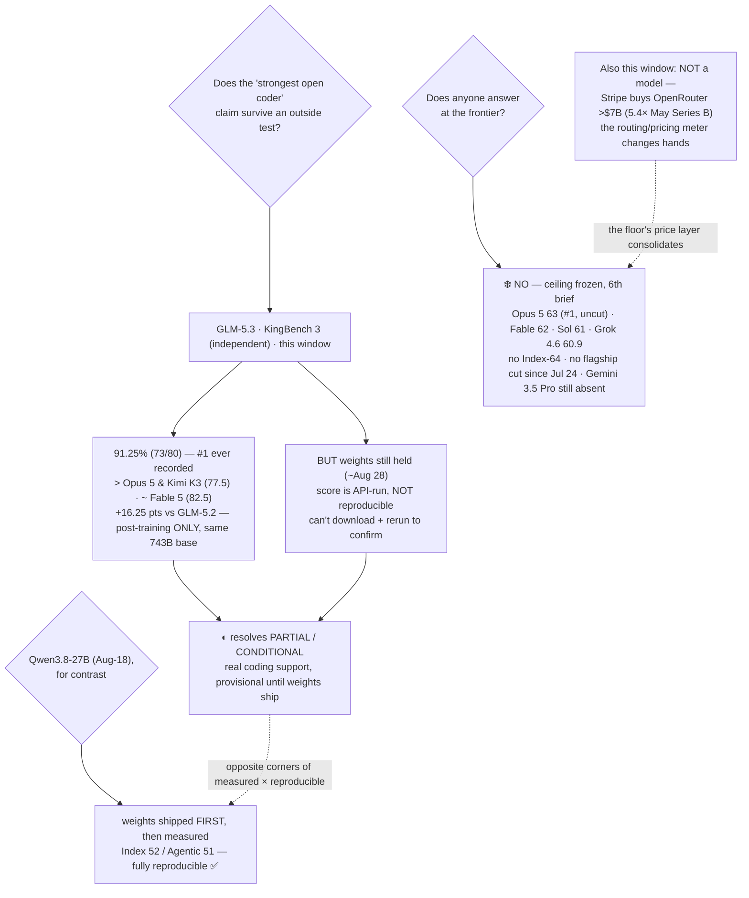

# LLM Updates — 2026-Aug-19

Wednesday brief, compiled Wed Aug 19 (Los Angeles time). The series has spent a month tracking two
frozen questions — **does anyone answer at the frontier?** (no, five briefs running) and **does the
open-weights promise land?** (Aug-16: Qwen3.8-27B ships runnable; Aug-18: it gets a third-party
Intelligence Index). Aug-18 closed by naming the next hard test: **GLM-5.3**, Z.ai's "strongest open
coder," had **no independent number** and its weights were **held for a safety review** (~Aug 28).

**This window that half-resolves — and in a revealing order.** GLM-5.3 now has an **independent
coding score**: on **KingBench 3**, a fixed third-party harness, it scored **73/80 = 91.25%, the
highest result ever recorded on that test** — ahead of Opus 5, Kimi K3, and Qwen3.8-Max, roughly
level with Fable 5 ([MindStudio](https://www.mindstudio.ai/blog/glm-5-3-benchmark-test-results),
[daily.dev](https://daily.dev/posts/glm-5-3-review-zai-s-new-open-model-tops-my-coding-and-agentic-benchmark-61vfxby1s)).
But the score is **API-run, not weight-reproducible**: the weights are still held, so the one check
that would normally *confirm* an open model — download the checkpoint and rerun — **cannot be done
yet.** GLM-5.3 is thus **measured before it is reproducible** — the exact mirror image of Aug-18's
Qwen 27B, which was reproducible *and* measured. Two open flagships, opposite corners of the same map
(§1).

**The second move this window is not a model at all — it's the meter.** Stripe finalized its
**>$7 billion acquisition of OpenRouter** (Bloomberg, Aug 16), the model-routing marketplace whose
per-token prices this series quotes every brief and whose token-mix is the standing evidence for the
"cheap Chinese floor." The layer where **cost-per-task** is actually priced and billed just
consolidated into a payments giant (§2).

**Everything at the top held.** The **closed ceiling is frozen for a 6th straight brief** — Opus 5
#1 at Index **63** (uncut, $5/$25), Fable 5 **62**, GPT-5.6 Sol **61**, Grok 4.6 **60.9**; **no
Index-64 model and no flagship price cut since Jul 24**; **Gemini 3.5 Pro still absent**; **Sol
Ultrafast still a waitlist preview**; and **no new model shipped in the Aug 15–19 window.** The motion
this window was **measurement and money, not models** (§3).

This report advances only what is **new since Aug-18.** It does **not** re-derive the Qwen3.8-27B
launch or its independent Index (Aug-16 §1, Aug-18 §1), the GLM-5.3 *launch* facts (Aug-16 §2),
DeepSeek's peak/off-peak repricing (now live, noted in §3), Grok 4.6 (Aug-14 §1), or the v4.1.1 grader
recalibration (Aug-14) — those are unchanged and pointed to in §5.

![A two-by-two map placing open challengers on two axes. The horizontal axis asks whether a model has an independent third-party score, from no on the left to yes on the right. The vertical axis asks whether outsiders can reproduce that score by downloading the weights and rerunning, from no at the bottom to yes at the top. Qwen3.8-27B sits in the top-right prize quadrant: independently scored by Artificial Analysis at Intelligence Index 52 and Agentic 51, and fully reproducible because its Apache-2.0 weights ship and run on a single 24GB GPU. GLM-5.3 sits in the lower-right: it now has an independent coding score of 91.25 percent on KingBench 3, the highest ever recorded on that test, but its weights are held for a safety review until about August 28, so a dashed arrow shows it rising into the reproducible quadrant only when the weights ship. Kimi K3 sits mid-right as weights-out but datacenter-only to serve. Qwen3.8-Max sits lower-mid-right as measured at Index 56 with degraded, gated weights. An amber dashed band along the bottom-right holds the closed ceiling — Opus 5 at 63, Fable 5 62, GPT-5.6 Sol 61, Grok 4.6 60.9 — measured but never reproducible because it is API-only, and frozen for a sixth straight brief.](measured_before_reproducible.svg)

---

## 1. GLM-5.3, measured before it's reproducible — KingBench 3 91.25%, weights still held

Aug-18's watch-item #1 asked for "an independent Index / cyber-bench check on the 'strongest open
coder' claim." A check arrived — a strong one — but it arrived through the **API**, not through the
weights, and that distinction is the whole story.

**The number.** On **KingBench 3** — an independent, fixed harness of coding, simulation, math and
generative tasks, run against every major model on identical prompts — GLM-5.3 scored **73/80 =
91.25%, the highest result ever recorded on that benchmark**
([MindStudio](https://www.mindstudio.ai/blog/glm-5-3-benchmark-test-results)). The comparison table,
same harness:

| Model | KingBench 3 | Note |
|---|---|---|
| **GLM-5.3** | **91.25%** | **#1 ever recorded on this bench** — open-weight (held) |
| Fable 5 | 82.5% | closed flagship, ~9 pts behind |
| Qwen3.8-Max | 81.25% | open-ish (gated), 2.4T |
| Opus 4.8 | 80% | prior Anthropic flagship |
| Opus 5 | 77.5% | current #1 on AA's *Intelligence* Index (63) — but 4th here |
| Kimi K3 | 77.5% | open (hardware-gated) |

Two honest caveats on the table before drawing anything from it. First, **KingBench 3 is one coding-
weighted benchmark, not the AA Intelligence Index** — Opus 5 landing 4th here while owning the AA
ceiling at 63 is a reminder that a single harness ranks differently from a 10-benchmark aggregate;
this is a *coding-agent* result, not a general-intelligence reordering. Second — and this is the
sharp one — **the score is not yet reproducible.**

**The technique story is real and clean.** GLM-5.2 scored **75%** on this same benchmark ~two months
ago; GLM-5.3 scores **91.25%** — **+16.25 points** on a fixed test, from the **same 743B MoE base and
the same architecture**, with **only post-training changed** (Aug-16 §2 established GLM-5.3 as
post-train-only on GLM-5.2). That is one of the cleanest public demonstrations of the year that
**post-training alone still moves the coding-agent frontier by double digits** — no bigger model, no
new pre-train. (One more independent anchor exists: GDPval-AA v2 was scored by **Artificial
Analysis** itself; the rest of Z.ai's card — including the CyberGym **84.5%** cyber claim — remains
**vendor-reported**, [explainX](https://explainx.ai/blog/glm-5-3-cybergym-84-5-independent-validation-august-2026).)

**Why "measured before reproducible" is the point.** For a *closed* model, an API-run third-party
score is the best anyone ever gets — that's how the whole AA ceiling is measured. For an *open* model,
the gold standard is different and higher: download the published checkpoint and rerun it yourself.
GLM-5.3 has cleared the *closed*-model bar (an outside number exists) but **not** the *open*-model bar
(no one can reproduce it), because **the weights are still held for a safety review until ~Aug 28**
([AI Weekly](https://aiweekly.co/node/9959),
[explainX launch](https://www.explainx.ai/blog/glm-5-3-launch-cyber-defense-benchmarks-august-2026)).
So GLM-5.3 is a genuinely new data point that is also genuinely **provisional** — the number is out,
the artifact that would let the community *confirm* it is not.

**Contrast with Qwen3.8-27B (Aug-18).** The 27B did both in the right order — weights shipped
(Apache-2.0, one 24 GB GPU), *then* Artificial Analysis measured it (Index 52, Agentic 51). GLM-5.3
did them in the reverse order — measured first, weights pending. Same "open flagship" category, two
opposite corners of the measured × reproducible map (see diagram). The Aug-18 watch-item resolves
**partially positive**: the "strongest open coder" claim now has real outside support on coding
specifically — but it stays a **conditional** win until ~Aug 28 makes it reproducible.

## 2. Stripe buys OpenRouter (>$7B) — the meter changes hands

The window's other real development is infrastructure, not a model. **Stripe finalized a deal to
acquire OpenRouter for more than $7 billion** (Bloomberg, Aug 16;
[TechCrunch](https://techcrunch.com/2026/08/16/stripe-will-reportedly-acquire-ai-gateway-startup-openrouter-for-7b/),
[Fortune](https://fortune.com/2026/08/16/stripe-7-billion-deal-ai-firm-openrouter-acquisition/),
[Dataconomy](https://dataconomy.com/2026/08/17/stripe-acquire-openrouter-deal-7-billion/)).

Why a payments story belongs in an LLM brief: **OpenRouter is the price index this series quotes.**
Every "$0.40 in / $3 out" the last few briefs cited for the Qwen 27B, every per-task comparison, and
the standing "**Chinese-origin models = ~46% of US enterprise tokens**" figure (CNBC, Jul 7) — all of
it is *OpenRouter* data. It is the neutral routing layer where a developer picks a model "by need and
budget," and where the cheap-open-floor vs. expensive-closed-ceiling economics this series tracks are
actually transacted.

- **The price:** >$7B is a **~5.4× markup** on the **$1.3B** valuation OpenRouter set in its **May
  2026 Series B** ($113M raised) — three months earlier. The routing/metering layer is being valued
  like frontier infrastructure, not a thin API proxy.
- **The through-line:** Aug-18 ended on **cost-per-task** — the Qwen 27B's 3.7× verbosity eroding its
  cheap per-token price *at the task level*. Cost-per-task is exactly what a routing/billing layer
  computes. The layer that could make "cheapest good open model" a **measured, billed** claim rather
  than a per-token sticker price just became part of a payments company. Worth watching whether
  neutrality (model-agnostic routing) survives the owner (a firm that profits from the payment flow).

This is a market/infrastructure move, not a capability advance — but it sits directly on the axis the
series has tracked all summer (the floor, its price, its token-share), so it's noted here rather than
buried.

## 3. What did *not* move — the ceiling, Gemini, Sol Ultrafast, the release slate

- **The closed ceiling — frozen a 6th straight brief.** The [Artificial Analysis Intelligence
  Index](https://artificialanalysis.ai/evaluations/artificial-analysis-intelligence-index) top is
  unchanged: **Opus 5 63 (#1, uncut, $5/$25)**, **Fable 5 62**, **GPT-5.6 Sol 61**, **Grok 4.6 60.9**
  ([BenchLM](https://benchlm.ai/benchmarks/artificialanalysis)). On the **Agentic Index**: Opus 5
  55.3, Sol 54.0, Fable 52.8. **No Index-64 model. No flagship price cut since Jul 24** (~4 weeks).
  The answer to "does anyone answer at the frontier?" is, a sixth brief running, **no.**
- **Gemini 3.5 Pro — still absent.** No ship and no firm date since [Forbes' Aug-13 "delay
  continues"](https://www.forbes.com/sites/johnwerner/2026/08/13/gemini-35-pro-delay-continues/):
  coding shortfalls, a disappointing training-data refresh, reports of a possible from-scratch
  retrain, now **>67 days past** its first target ([tech-insider](https://tech-insider.org/au/gemini-3-5-pro-67-days-delay-2026/)).
  Google's live top remains the Flash tier (3.7 Flash, Aug 13). It is the single most overdue frontier
  event on the board.
- **Sol Ultrafast — still a preview.** OpenAI's Cerebras-powered ~750 tok/s tier (~14× faster) is
  **still waitlist-only, still no price and no GA date**; the Sol standard rate stays $5/$30
  ([TechTimes](https://www.techtimes.com/articles/324514/20260814/gpt-56-sol-now-runs-real-time-speed-openais-ultrafast-preview-offers-no-price-date.htm),
  [Cerebras](https://www.cerebras.ai/blog/accelerating-gpt-5-6-sol-ultrafast-with-openai)). Latency
  is where the frontier labs keep competing, because they aren't moving the Index or the price.
- **No new model in the Aug 15–19 window.** [Release trackers](https://llmgateway.io/timeline) show
  the most recent launches remain **GLM-5.3 and Qwen3.8-27B (Aug 14)** and **Gemini 3.7 Flash (Aug
  13)**; nothing new from OpenAI, Anthropic, xAI, Meta, DeepSeek, or Moonshot since.
- **DeepSeek's repricing — now live (context, not new this brief).** DeepSeek's **peak/off-peak
  dynamic pricing** took effect **Aug 16** (V4-Flash to ~$1.32 / V4-Pro ~$3.96 per Mtok output at
  peak; increases of ~4× up to ~1,100% depending on model/time), narrowing but not closing its gap to
  rivals ahead of a possible IPO ([Bloomberg](https://www.bloomberg.com/news/articles/2026-08-13/deepseek-increases-prices-for-ai-services-by-multiple-times),
  [InfoWorld](https://www.infoworld.com/article/4209439/deepseek-raises-some-v4-prices-by-more-than-10x-as-ai-demand-strains-capacity.html)).
  The cheap floor is still the cheapest, but less cheap than it was — relevant background to §2's
  cost-per-task lens.

## 4. Reading it together — measurement and money, not models

The through-line of the month sharpens again, and this window it does so **without a single new model
shipping.** The **top of the map has not moved in six briefs** — same names, same prices, same #1,
Gemini still the one lab that could break the freeze and still delayed. What moved was **how we score
the open challengers** and **who owns the layer that prices them**:

- **Scoring:** the open challengers are now being *measured before they're even downloadable*
  (GLM-5.3), which is a new failure mode of the "open" story — you can get an outside number without
  getting the artifact that makes the number *checkable*. The healthy version (Qwen 27B: ship, then
  measure) and the provisional version (GLM-5.3: measure, ship later) now sit side by side.
- **Money:** the meter itself (OpenRouter) got bought for frontier money, which says the market now
  values the **routing/pricing layer** — the place cost-per-task lives — as strategically as the
  models.

The gap between "what you can run yourself" and "the best you can rent" is still being compressed
**entirely from below**. This window it wasn't compressed by a new model — it was **re-measured** (an
independent coder claim, still one artifact-release short of proof) and **re-priced** (the floor's
metering layer consolidating). The ceiling did nothing, again.

## 5. Unchanged since Aug-18 (not re-derived here)

- **Qwen3.8-27B** — dense 27B, Apache-2.0, one 24 GB GPU; **third-party Index 52 / Agentic 51**, verbose
  (160M vs 43M-token class median) — Aug-16 §1, Aug-18 §1.
- **GLM-5.3 launch** (Z.ai, Aug 14) — 743B MoE, post-train-only on GLM-5.2, API-only via $18/mo GLM
  Coding Plan, weights held for safety ~Aug 28 — Aug-16 §2. *This brief adds the independent KingBench 3
  coding score (§1); launch facts unchanged.*
- **Sol Ultrafast** (Aug 13) — Cerebras, ~750 tok/s, preview/waitlist, no price/GA — Aug-16 §3.
- **Grok 4.6** (Aug 6) — Index 60.9, ceiling band, cheap end ($2/$6), post-train-only — Aug-14 §1.
- **Qwen3.8-Max** open weights (Aug 12–13) — degraded/gated (text-only, no 1M ctx); measured Index **56** — Aug-14 §2.
- **v4.1.1 grader recalibration** (Aug 6) — the top's absolute numbers rose ~+2 because the ruler changed — Aug-14.
- **Seed 2.1 Turbo** (ByteDance, Aug 10) — GPT-5.5-class agentic coding at ~$0.41/$2.07, most specs unpublished — background.
- **DeepSeek V4** peak/off-peak repricing live Aug 16; **V4-Flash-0731** 50/$0.28 MIT still the Pareto floor — Aug-03 §1.
- **Kimi K3** (Moonshot, Jul-26) — 2.8T MoE, Modified-MIT, hardware-gated to serve — Jul-30.
- **Opus 5** "top quality at mid price" (Jul-24) — effort dial + paid fast mode — Jul-25.
- **Sonnet 5** $2/$10 intro through Aug 31; **Kill Switch / Pacing** policy axis quiet.

## Watch-items into the next brief

1. **GLM-5.3's weights actually shipping** (targeted ~Aug 28) — the step that converts §1's KingBench
   3 result from *measured* to *reproducible*. Does it hold to date (or slip like Qwen3.8-Max did
   twice), and does a community rerun of the checkpoint confirm the 91.25% and the 84.5% CyberGym
   claim?
2. **KingBench 3 breadth** — one coding-weighted harness put GLM-5.3 above Opus 5; watch whether a
   full AA Intelligence Index run (10-benchmark aggregate) agrees, or whether this stays a
   coding-specific result.
3. **The OpenRouter meter under Stripe** — does model-agnostic routing and the public token-share /
   price data (the series' floor evidence) stay neutral and open, or change under a payments owner?
4. **The frozen ceiling — 6th brief with no Index-64 and no flagship cut.** Gemini 3.5 Pro's delay is
   the single most overdue frontier event; a ship or a credible date would be the first top-tier move
   since Jul 24.
5. **Sol Ultrafast** GA + pricing — whether the Cerebras speed tier becomes a product or stays a preview.

---

### Method & caveats

- **Compiled** Wed Aug 19 2026, 06:25 PDT (Los Angeles time). Advances only items **new since the
  Aug-18 brief**; unchanged threads are listed in §5 with pointers, not re-derived.
- **Scraping resilience.** Direct fetch remains **broadly egress-blocked** from this environment
  (`llm-stats.com` returned EGRESS_BLOCKED on direct fetch; prior briefs saw the same for
  `artificialanalysis.ai`, `simonwillison.net`, `news.ycombinator.com`, and others). All figures were
  therefore taken from the **search index** and **corroborated across multiple independent outlets**;
  no quantitative claim rests on a single source.
- **What is measured vs claimed.** GLM-5.3's **KingBench 3 = 91.25%** is **third-party** (independent
  fixed harness) but **API-run and not weight-reproducible** — read it as a strong provisional coding
  result, not a confirmed open-weights number, until the weights ship (~Aug 28); **GDPval-AA v2** is
  independently scored by Artificial Analysis; **CyberGym 84.5%** and the rest of the card remain
  **vendor-reported**. The **Stripe–OpenRouter** deal is **finalized/agreed** per Bloomberg (Aug 16),
  not yet closed/regulator-cleared. The closed-ceiling Index numbers are **third-party** (Artificial
  Analysis / BenchLM).
- **Dating.** The two developments here broke **Aug 16** (Stripe/OpenRouter) and around the GLM-5.3
  launch window with independent scoring surfacing since; both are **new relative to the Aug-18
  brief**, which noted neither. No model shipped in the Aug 15–19 window itself.
- **Diagrams** are a standalone theme-neutral SVG (slate/amber/sky/emerald strokes and low-opacity
  tints that read on light and dark backgrounds, no external URLs) and an inline Mermaid flowchart;
  both render in GitHub-flavored markdown.

### Sources

- **GLM-5.3 independent coding score** — [MindStudio: GLM-5.3 benchmark results (KingBench 3 91.25%)](https://www.mindstudio.ai/blog/glm-5-3-benchmark-test-results) · [daily.dev: GLM-5.3 tops my coding & agentic benchmark](https://daily.dev/posts/glm-5-3-review-zai-s-new-open-model-tops-my-coding-and-agentic-benchmark-61vfxby1s) · [explainX: CyberGym 84.5% independent-validation status](https://explainx.ai/blog/glm-5-3-cybergym-84-5-independent-validation-august-2026) · [emergent.sh: what the GLM-5.3 numbers show and don't](https://emergent.sh/learn/glm-5-3-benchmarks)
- **GLM-5.3 launch / weights held** — [AI Weekly: Z.ai holds open weights for cyber-safety review](https://aiweekly.co/node/9959) · [explainX: GLM-5.3 launch, benchmarks & access](https://www.explainx.ai/blog/glm-5-3-launch-cyber-defense-benchmarks-august-2026)
- **Stripe acquires OpenRouter** — [Bloomberg: Stripe finalizes >$7B OpenRouter deal](https://www.bloomberg.com/news/articles/2026-08-16/stripe-nears-deal-to-buy-ai-firm-openrouter-for-over-7-billion) · [TechCrunch](https://techcrunch.com/2026/08/16/stripe-will-reportedly-acquire-ai-gateway-startup-openrouter-for-7b/) · [Fortune](https://fortune.com/2026/08/16/stripe-7-billion-deal-ai-firm-openrouter-acquisition/) · [Dataconomy](https://dataconomy.com/2026/08/17/stripe-acquire-openrouter-deal-7-billion/)
- **Ceiling & leaderboard** — [Artificial Analysis Intelligence Index](https://artificialanalysis.ai/evaluations/artificial-analysis-intelligence-index) · [BenchLM leaderboard (Opus 5 63.0)](https://benchlm.ai/benchmarks/artificialanalysis)
- **Held / preview / delayed threads** — [Forbes: Gemini 3.5 Pro delay continues](https://www.forbes.com/sites/johnwerner/2026/08/13/gemini-35-pro-delay-continues/) · [tech-insider: Gemini 3.5 Pro at 67 days](https://tech-insider.org/au/gemini-3-5-pro-67-days-delay-2026/) · [TechTimes: Sol Ultrafast preview, no price/date](https://www.techtimes.com/articles/324514/20260814/gpt-56-sol-now-runs-real-time-speed-openais-ultrafast-preview-offers-no-price-date.htm) · [Cerebras: accelerating GPT-5.6 Sol Ultrafast](https://www.cerebras.ai/blog/accelerating-gpt-5-6-sol-ultrafast-with-openai)
- **DeepSeek repricing (context)** — [Bloomberg: DeepSeek increases prices multiple times](https://www.bloomberg.com/news/articles/2026-08-13/deepseek-increases-prices-for-ai-services-by-multiple-times) · [InfoWorld: some V4 prices up 10x+](https://www.infoworld.com/article/4209439/deepseek-raises-some-v4-prices-by-more-than-10x-as-ai-demand-strains-capacity.html)
- **Release tracking** — [LLM Gateway timeline](https://llmgateway.io/timeline) · [aireleasetracker latest](https://aireleasetracker.com/latest)
