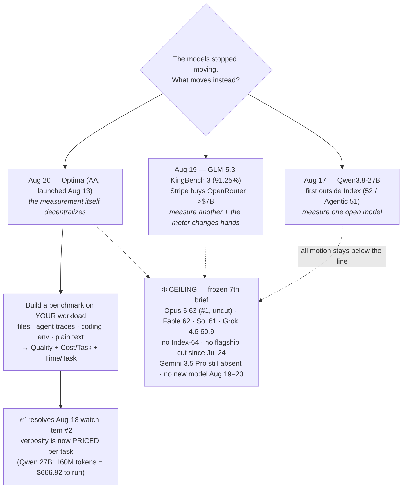

# LLM Updates — 2026-Aug-20

Thursday brief, compiled Thu Aug 20 (Los Angeles time). For a month this series has tracked two
frozen questions — **does anyone answer at the frontier?** (no, six briefs running) and **does the
open-weights promise land?** (Aug-16: Qwen3.8-27B ships runnable; Aug-18: it gets a third-party
Intelligence Index; Aug-19: GLM-5.3 gets an independent coding score before its weights ship). The
last two windows shipped **no new model** — the motion was **measurement and money, not models**
(Aug-19 §4). This window continues that streak, and sharpens what "measurement" means.

**The move this window is a measurement *tool*, not another measured model.** Artificial Analysis
shipped **Optima** — a platform that lets **anyone build a custom benchmark for their own workload**
(from their own files, their agent traces, a coding environment, or a plain-text description of the
task), run every leading model against it in one click, and read back not one number but **three:
quality, cost per task, and time per task** ([Artificial Analysis](https://artificialanalysis.ai/articles/optima),
[AlphaSignal](https://alphasignal.ai/news/artificial-analysis-optima-lets-any-team-build-custom-ai-benchmarks)).
It launched **Aug 13** — the Aug-18 and Aug-19 briefs both missed it — and surfaced into view this
window through third-party coverage and early adoption. It belongs in *this* brief for a specific
reason: it is the direct resolution of **Aug-18's watch-item #2** ("whether Qwen3.8-27B's verbosity
gets *priced in* — a real cost-per-task, not per-token, comparison") and the natural next step of
**Aug-19's cost-per-task / OpenRouter thread** (§1).

**Everything at the top held — again.** The **closed ceiling is frozen for a 7th straight brief** —
Opus 5 #1 at Index **63** (uncut, $5/$25), Fable 5 **62**, GPT-5.6 Sol **61**, Grok 4.6 **60.9**; **no
Index-64 model and no flagship price cut since Jul 24** (now ~4 weeks); **Gemini 3.5 Pro still
absent**; **GLM-5.3's weights still held** on the ~Aug 28 safety timer (8 days out); **Sol Ultrafast
still a waitlist preview**; and **no new model shipped in the Aug 19–20 window** (§2).

This report advances only what is **new since Aug-19.** It does **not** re-derive GLM-5.3's KingBench 3
score (Aug-19 §1), the Stripe–OpenRouter acquisition (Aug-19 §2), the Qwen3.8-27B launch or its Index
(Aug-16 §1, Aug-18 §1), DeepSeek's peak/off-peak repricing (Aug-19 §3), or the v4.1.1 grader
recalibration (Aug-14) — those are unchanged and pointed to in §4.

![A left-to-right comparison of how models get scored. On the left, the public Intelligence Index reports a single quality number, Qwen3.8-27B at 52, on one fixed workload shared by everyone; a caution notes the number hides cost, because producing that 52 took 160 million output tokens, roughly 3.7 times the class median, costing 666 dollars and 92 cents to run, so a cheap per-token price is not a cheap per-task price and a quality-only score cannot show it. A central hub is Optima, Artificial Analysis's custom-benchmark platform launched August 13, fed by your own files, agent traces imported from Arize, Braintrust or Langfuse, a coding environment, or a plain-text description of the task. On the right, Optima reports three numbers on your own workload instead of one: quality, cost per task, and time per task, and surfaces an equally good model at up to ten times lower cost or time per task, with custom agent stacks competing against frontier models in the same run. Along the bottom, an amber dashed band marks the closed ceiling, frozen for a seventh straight brief: Opus 5 at 63 and still number one and uncut, Fable 5 at 62, GPT-5.6 Sol at 61, Grok 4.6 at 60.9, with no Index-64 model, no flagship price cut since July 24, and no new model in the August 19 to 20 window.](the_index_decentralizes.svg)

---

## 1. Optima — the benchmark decentralizes, and verbosity finally gets a price

For most of this series the "score" has been a **single public number** — the Artificial Analysis
Intelligence Index — computed on **one fixed workload** and handed down to everyone. That number is
what froze at the top (Opus 5 = 63) and what the open challengers have been chasing (Qwen3.8-27B = 52,
GLM-5.3's KingBench proxy). **Optima inverts the direction of measurement**: instead of one benchmark
for all models, it gives every team the machinery to build **their own** benchmark for **their own**
task, and score the models against *that*.

**What it is.** Optima lets you assemble a benchmark from any of four inputs and run it across leading
models in a single click ([Artificial Analysis](https://artificialanalysis.ai/articles/optima),
[AlphaSignal](https://alphasignal.ai/news/artificial-analysis-optima-lets-any-team-build-custom-ai-benchmarks)):

- **upload a dataset** (your own files / examples);
- **import agent traces** from Arize, Braintrust or Langfuse;
- **point it at a coding environment**;
- or **describe the use case in plain text** and let it construct the benchmark.

Grading is **research-grade** and reuses Artificial Analysis's own methodology — the same **pairwise
judging** used in **AA-Briefcase** and **GDPval-AA**, plus rubric grading — priced transparently at
**$0.25 / criterion** (rubric) and **$0.75 / match** (pairwise), usage-based, **no markup on raw model
token costs, no subscription** (AA added a limited-time **$10 sign-up credit**). Crucially, a **custom
agent stack can compete against frontier models in the same run over HTTP** — so you benchmark your
*system*, not just a bare model.

**Why it's the story: it reports the two numbers a single Index can't.** Every Optima run surfaces
**Cost per Task** and **Time per Task** *alongside* quality. That is exactly the gap the last three
briefs kept hitting:

- **Aug-18** measured Qwen3.8-27B at Index 52 but flagged that producing that score took **160M output
  tokens vs a 43M class median (~3.7×)** — the model is **verbose**, so its cheap **per-token** price
  ($0.40/$3) does **not** translate to a cheap **per-task** cost. A quality-only Index number *hides*
  this. Concretely, it cost **$666.92** to evaluate Qwen3.8-27B on the Intelligence Index — a hard
  dollar figure that only a cost-aware harness ever surfaces
  ([Artificial Analysis model page](https://artificialanalysis.ai/models/qwen3-8-27b)).
- **Aug-19** ended on the same lens — "**cost-per-task** is exactly what a routing/billing layer
  computes" — and noted the layer that computes it (OpenRouter) had just been **bought by Stripe**.

Optima is the measurement side of that same coin: it makes **cost-per-task a first-class, graded
output** rather than something you back out of a token bill after the fact. Aug-18's watch-item #2
("does the verbosity get priced in?") resolves **yes — there's now a standard tool that prices it.**

**The adoption signal is a practitioner making exactly this point.** Max Weinbach moved his
**DiligenceStack** agent evals onto Optima this window — "**a far better way to run these evals vs.
what I was doing before**" — and, tellingly, stressed that **per-task cost is a metric eval harnesses
routinely overlook**, and that **cost variance across seeds can be large in agent runs**
([Max Weinbach on X](https://x.com/mweinbach/status/2088081314784092637)). That is the verbosity
problem restated by someone running real agents: the number that decides which model you ship isn't
the leaderboard rank, it's cost-and-time per task **on your own traces** — and until now there was no
turnkey way to get it.

**What it doesn't change — read honestly.** Optima is **infrastructure**, not a capability advance:
no model got better this window, and the public Intelligence Index (where the ceiling is frozen) is
untouched. Two cautions worth keeping: (1) it is an **Artificial Analysis product** — the same
organization whose public Index this series quotes now also sells the custom-benchmark layer, so
"who grades the graders" (Aug-12's question about an OpenAI model grading rivals) gains a commercial
edge; and (2) a per-team private benchmark is only as representative as the traces you feed it —
Optima makes cost-per-task **measurable**, not automatically **comparable across teams**. Still, the
direction is unambiguous: when the models stall, the **evaluation** market moves, and it's moving
from *one number for everyone* toward *your number, with a price on it*.

## 2. What did *not* move — the ceiling, Gemini, GLM-5.3's weights, Sol Ultrafast, the slate

A seventh straight brief, the top of the map is exactly where it was.

- **The closed ceiling — frozen a 7th straight brief.** The [Artificial Analysis Intelligence
  Index](https://artificialanalysis.ai/evaluations/artificial-analysis-intelligence-index) top is
  unchanged across 177 tested models: **Opus 5 63 (#1, uncut, $5/$25)**, **Fable 5 62**, **GPT-5.6 Sol
  61**, **Grok 4.6 60.9** ([BenchLM](https://benchlm.ai/benchmarks/artificialanalysis)). On the
  **Agentic Index**: Opus 5 55.3, Sol 54.0, Fable 52.8. **No Index-64 model. No flagship price cut
  since Jul 24** (~4 weeks / 27 days). The answer to "does anyone answer at the frontier?" is, a
  seventh brief running, **no.**
- **Gemini 3.5 Pro — still absent.** No ship and no firm date since [Forbes' Aug-13 "delay
  continues"](https://www.forbes.com/sites/johnwerner/2026/08/13/gemini-35-pro-delay-continues/):
  coding shortfalls, a disappointing data refresh, reports of a possible from-scratch retrain — now
  **~68 days past** its first (June I/O) target. Google's live top remains the Flash tier (3.7 Flash,
  Aug 13). It is the single most overdue frontier event on the board.
- **GLM-5.3's weights — still held.** Z.ai's "open on a timer" release is **on schedule but not yet
  due**: the safety-hardening hold still points at **~Aug 28**, and independent trackers confirm
  **GLM-5.2 remains the newest GLM you can actually download** — GLM-5.3 is still API-only via the
  $18/mo GLM Coding Plan ([GMI Cloud](https://www.gmicloud.ai/en/blog/ai-model-benchmarks-august-2026-open-weight-models-catch-the-frontier)).
  Its KingBench 3 coding score (Aug-19 §1) therefore stays **measured but not reproducible**. No slip
  yet — but no ship yet either.
- **Sol Ultrafast — still a preview.** OpenAI's Cerebras-powered ~750 tok/s tier (~14× faster) is
  **still waitlist-only, still no price and no GA date**; the Sol standard rate stays $5/$30
  ([TechTimes](https://www.techtimes.com/articles/324514/20260814/gpt-56-sol-now-runs-real-time-speed-openais-ultrafast-preview-offers-no-price-date.htm)).
  Latency is where the frontier labs keep competing, because they aren't moving the Index or the price.
- **No new model in the Aug 19–20 window.** [Release trackers](https://llmgateway.io/timeline) show
  the most recent launches remain **GLM-5.3 and Qwen3.8-27B (Aug 14)** and **Gemini 3.7 Flash (Aug
  13)**; nothing new from OpenAI, Anthropic, xAI, Meta, DeepSeek, or Moonshot since.

## 3. Reading it together — three windows of measurement, and now the ruler itself is handed out

The through-line of the month has now held for **three consecutive windows without a single new
frontier model** and is getting *more* specific each time:

- **Aug-17** put an outside number on **one** open model (Qwen3.8-27B).
- **Aug-19** put an outside number on **another** (GLM-5.3, coding) and saw the **meter** that prices
  the whole floor (OpenRouter) get bought for frontier money.
- **Aug-20** hands out the **ruler itself**: Optima lets anyone generate their *own* outside number,
  on their *own* workload, with **cost and time per task** built in.

Put the three together and the shape is clear. When the **top of the map** freezes — same names, same
prices, same #1, for seven briefs — competitive energy doesn't disappear; it moves **downstream of the
models**, into how they're *scored*, *priced*, and *chosen*. The single public Intelligence Index was
the right tool for a fast-moving frontier ("who's #1 this week?"). A **frozen** frontier where the
real differences are **cost-per-task and latency on your specific job** needs a different tool — and
Optima is the market supplying it. The gap between "what you can run yourself" and "the best you can
rent" is still being compressed **entirely from below**; this window it wasn't compressed by a model
at all, but by making the **cost** half of that comparison finally measurable.

## 4. Unchanged since Aug-19 (not re-derived here)

- **GLM-5.3** — KingBench 3 **91.25%** (independent, API-run, **not yet reproducible**); 743B MoE,
  post-train-only on GLM-5.2; weights held for safety **~Aug 28**, API-only ($18/mo) — Aug-19 §1,
  Aug-16 §2. *This brief adds only that the weights are still held (8 days out); score unchanged.*
- **Stripe acquires OpenRouter (>$7B)** — the routing/pricing "meter" this series quotes changed hands
  (Bloomberg, Aug 16); ~5.4× its May-2026 $1.3B Series B — Aug-19 §2.
- **Qwen3.8-27B** — dense 27B, Apache-2.0, one 24 GB GPU; **third-party Index 52 / Agentic 51**,
  verbose (160M vs 43M-token class median; ~$666.92 to run the Index) — Aug-16 §1, Aug-18 §1.
- **Qwen3.8-Max** open weights (Aug 12–13) — degraded/gated (text-only, no 1M ctx); measured Index
  **56** — Aug-14 §2.
- **Sol Ultrafast** (Aug 13) — Cerebras, ~750 tok/s, preview/waitlist, no price/GA — Aug-16 §3.
- **Grok 4.6** (Aug 6) — Index 60.9, ceiling band, cheap end ($2/$6), post-train-only — Aug-14 §1.
- **v4.1.1 grader recalibration** (Aug 6) — the top's absolute numbers rose ~+2 because the ruler
  changed, not the models — Aug-14.
- **DeepSeek V4** peak/off-peak repricing live Aug 16; **V4-Flash-0731** 50/$0.28 MIT still the Pareto
  floor — Aug-03 §1, Aug-19 §3.
- **Kimi K3** (Moonshot, Jul-26) — 2.8T MoE, Modified-MIT, hardware-gated to serve — Jul-30.
- **Opus 5** "top quality at mid price" (Jul-24) — effort dial + paid fast mode — Jul-25.
- **Sonnet 5** $2/$10 intro through Aug 31; **Kill Switch / Pacing** policy axis quiet.

## Watch-items into the next brief

1. **GLM-5.3's weights actually shipping** (targeted ~Aug 28, now 8 days out) — the step that converts
   Aug-19's KingBench 3 result from *measured* to *reproducible*. Does it hold to date (or slip like
   Qwen3.8-Max did twice), and does a community rerun confirm the 91.25% and the 84.5% CyberGym claim?
2. **Whether Optima shifts the conversation from Index rank to cost-per-task.** Now that a turnkey
   cost-and-time-per-task tool exists, watch for model comparisons (especially Qwen3.8-27B's verbosity,
   and the frozen-ceiling models' price/latency) being argued on **task cost** rather than leaderboard
   position — and for AA's neutrality being questioned now that it both runs the public Index and sells
   the private one.
3. **The OpenRouter meter under Stripe** — does model-agnostic routing and the public token-share /
   price data (the series' floor evidence) stay neutral under a payments owner?
4. **The frozen ceiling — 7th brief with no Index-64 and no flagship cut.** Gemini 3.5 Pro's delay
   (~68 days) is the single most overdue frontier event; a ship or a credible date would be the first
   top-tier move since Jul 24.
5. **Sol Ultrafast** GA + pricing — whether the Cerebras speed tier becomes a product or stays a
   preview.

---

### Method & caveats

- **Compiled** Thu Aug 20 2026 (Los Angeles time). Advances only items **new since the Aug-19 brief**;
  unchanged threads are listed in §4 with pointers, not re-derived.
- **Scraping resilience.** Direct fetch remains **broadly egress-blocked** from this environment
  (`artificialanalysis.ai` and `alphasignal.ai` both returned EGRESS_BLOCKED on direct fetch this run;
  prior briefs saw the same for `simonwillison.net`, `news.ycombinator.com`, `benchlm.ai` and others).
  All figures were therefore taken from the **search index** and **corroborated across multiple
  independent outlets**; no quantitative claim here rests on a single source.
- **Dating.** Optima **launched Aug 13** — it is **not** an Aug 19–20 release, and the Aug-18 and
  Aug-19 briefs did not cover it. It is carried here because it surfaced into view this window (via
  AlphaSignal's write-up and early adoption such as DiligenceStack's) and because it is the direct
  resolution of Aug-18's cost-per-task watch-item and the extension of Aug-19's OpenRouter thread.
  This is stated plainly rather than back-dated.
- **What is measured vs claimed.** Optima's **features, grading methodology, and pricing** ($0.25/
  criterion, $0.75/match; no markup; $10 sign-up credit) are **vendor-described** (Artificial
  Analysis), corroborated by AlphaSignal and practitioner posts; the **$666.92 / 160M-token** figure
  for Qwen3.8-27B is from Artificial Analysis's own model page. The closed-ceiling Index numbers are
  **third-party** (Artificial Analysis / BenchLM). GLM-5.3's KingBench 3 score remains **API-run, not
  weight-reproducible**.
- **Diagrams** are a standalone theme-neutral SVG (slate/amber/sky/emerald strokes and low-opacity
  tints that read on light and dark backgrounds, no external URLs) and an inline Mermaid flowchart;
  both render in GitHub-flavored markdown.

### Sources

- **Optima (custom benchmarks, cost/task, time/task)** — [Artificial Analysis: Announcing Optima](https://artificialanalysis.ai/articles/optima) · [Optima product page](https://artificialanalysis.ai/optima) · [AlphaSignal: Optima lets any team build custom AI benchmarks](https://alphasignal.ai/news/artificial-analysis-optima-lets-any-team-build-custom-ai-benchmarks) · [Artificial Analysis on X (launch)](https://x.com/ArtificialAnlys/status/2087930781050322977) · [Max Weinbach on X (DiligenceStack adoption)](https://x.com/mweinbach/status/2088081314784092637)
- **Verbosity / cost-per-task tie-in** — [Artificial Analysis: Qwen3.8-27B model page ($666.92 / 160M tokens)](https://artificialanalysis.ai/models/qwen3-8-27b) · [Artificial Analysis: measuring time per task in AA-Briefcase](https://artificialanalysis.ai/articles/aa-briefcase-time-per-task)
- **Ceiling & leaderboard** — [Artificial Analysis Intelligence Index](https://artificialanalysis.ai/evaluations/artificial-analysis-intelligence-index) · [BenchLM leaderboard (Opus 5 63.0)](https://benchlm.ai/benchmarks/artificialanalysis)
- **Held / delayed / preview threads** — [Forbes: Gemini 3.5 Pro delay continues](https://www.forbes.com/sites/johnwerner/2026/08/13/gemini-35-pro-delay-continues/) · [GMI Cloud: GLM-5.2 still the newest downloadable GLM](https://www.gmicloud.ai/en/blog/ai-model-benchmarks-august-2026-open-weight-models-catch-the-frontier) · [TechTimes: Sol Ultrafast preview, no price/date](https://www.techtimes.com/articles/324514/20260814/gpt-56-sol-now-runs-real-time-speed-openais-ultrafast-preview-offers-no-price-date.htm)
- **Release tracking** — [LLM Gateway timeline](https://llmgateway.io/timeline) · [aireleasetracker latest](https://aireleasetracker.com/latest)
