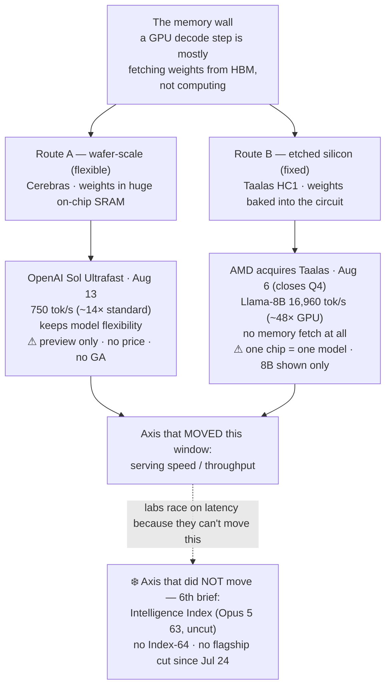

# LLM Updates — 2026-Aug-21

Friday brief, written Fri Aug 21 (Los Angeles time). For a month the series has tracked two frozen
questions — **does anyone answer at the frontier?** and **does the open-weights promise land?** The
second one resolved on Aug-18 (Qwen3.8-27B got its third-party Index of 52). The first is still open,
and this window it stays open in the most literal way possible: **almost nothing shipped.**

**This is a quiet window, and the honest lead is that quiet.** Between Aug 19 and Aug 21 there was
**no new frontier model, no price cut, and no independent Index that moved the top of the board.** The
closed ceiling is now **frozen for a 6th straight brief** — Opus 5 **63** (#1, uncut, $5/$25), Fable 5
**62.1**, Grok 4.6 **60.9**, across **180** tested models (up from 177 on Aug-18), with **no Index-64
model and no flagship price cut since Jul 24** — now roughly **four weeks**
([Artificial Analysis](https://artificialanalysis.ai/evaluations/artificial-analysis-intelligence-index),
[BenchLM](https://benchlm.ai/benchmarks/artificialanalysis)). The one lab that could break the freeze,
Google, is **still** delayed on Gemini 3.5 Pro (§1).

The only actual *release* in range is **GLM-5.2 Turbo** (Z.ai, shipped **Aug 17**, surfaced on the
gateways **Aug 20**) — which quietly **corrects the Aug-18 brief's "no new model shipped in the Aug
15–18 window."** But it's a **serving variant**, not new capability (§2), so it doesn't change the
picture at the top either.

So the substantive "advance" to actually *explain* this window — the one the mandate's
"techniques and architectures" half asks for — is **not a model at all. It's where the competition
went when the Index stopped moving: serving speed, and the memory wall.** Two threads the
model-focused series has under-covered now clearly form one story — OpenAI's **Cerebras-powered Sol
Ultrafast** (750 tok/s) and AMD's acquisition of **Taalas**, whose chips **etch a model's weights
physically into silicon** (Llama-8B at ~17,000 tok/s, ~48× a GPU). With *how smart* stuck, the labs
are racing on *how fast* (§3). This is flagged honestly as **synthesized background** — both events
predate Aug-18 — because it is the real technical motion while the model market sits still.

![Horizontal log-scale bar chart of output tokens per second for three ways of serving a model, under a caption noting the Intelligence Index is frozen for a sixth straight brief (Opus 5 63 number one and uncut, Fable 5 62.1, Grok 4.6 60.9, no Index-64 and no flagship price cut since July 24). A GPU-served frontier model runs at about 100 tokens per second — the status quo, bottlenecked by fetching weights from memory, the memory wall. OpenAI's GPT-5.6 Sol Ultrafast on Cerebras wafer-scale chips runs at 750 tokens per second, about 14 times standard, but has no published price or general-availability date since its August 13 preview. Taalas HC1, the etched-silicon startup AMD agreed to buy on August 6, runs Llama 8B at 16,960 tokens per second, roughly 48 times a GPU, by burning the weights permanently into the circuit so there is no memory fetch — at the cost that one chip runs only the one model it was fabricated for, and only a small 8-billion-parameter model has been demonstrated. The through-line: motion this window is on the horizontal (speed) axis, not the vertical (intelligence) one.](the_race_moves_to_speed.svg)

---

## 1. The frozen ceiling — 6th straight brief, and Google is still off the board

Nothing at the top moved.

- **The Intelligence Index top is unchanged.** **Opus 5 63** (#1, uncut, $5/$25), **Fable 5 62.1**,
  **Grok 4.6 60.9** — now across **180** tested models, with the most recent data stamped **Aug
  18–20** ([Artificial Analysis](https://artificialanalysis.ai/evaluations/artificial-analysis-intelligence-index),
  [BenchLM](https://benchlm.ai/benchmarks/artificialanalysis),
  [DataLearner](https://www.datalearner.com/en/leaderboards/external/aa-quality-index)). **No
  Index-64 model. No flagship price cut since Jul 24** (~4 weeks). The answer to "does anyone answer
  at the frontier?" is, for the **sixth** brief running, **no.**
- **Gemini 3.5 Pro — still absent, now three missed targets.** Google's announced flagship (unveiled
  at I/O May 19: 2M-token context, built-in Deep Think) has missed its **late-June**, **Jul 17**, and
  **early-August** dates and remains in **limited Vertex AI enterprise preview**, not GA
  ([The AI Rankings](https://theairankings.com/google/gemini-3-5-pro/),
  [Forbes, Aug 13](https://www.forbes.com/sites/johnwerner/2026/08/13/gemini-35-pro-delay-continues/)).
  Reporting still ties the delay to **coding shortfalls and a disappointing training-data refresh**;
  and the leadership backdrop is now part of the story — in the first week of August Google
  **restructured its AI leadership** (Demis Hassabis stepped back from running DeepMind day-to-day,
  Sergey Brin returned to drive commercialization)
  ([Coursiv](https://coursiv.io/blog/gemini-3-5-pro),
  [Wikipedia: Gemini](https://en.wikipedia.org/wiki/Gemini_(language_model))). It is the single most
  overdue frontier event on the board.

The freeze is the headline precisely because it has lasted long enough to be a *pattern*, not a lull.

## 2. The only release: GLM-5.2 Turbo — and it corrects last brief's "nothing shipped"

The Aug-18 brief wrote "**No new model shipped in the Aug 15–18 window.**" That was wrong by a day:
**Z.ai shipped GLM-5.2 Turbo on Aug 17**, and it only became visible on the release trackers on
**Aug 20** ([LLM Gateway timeline](https://llmgateway.io/timeline),
[llm-stats AI news](https://llm-stats.com/ai-news)). So it's logged here as a **correction**.

The correction is small on purpose, because **GLM-5.2 Turbo is a serving variant, not a capability
jump.** It's a **latency/cost-optimized** SKU on top of the same **743B-parameter MoE (~40B active),
1M-context** GLM-5.2 base that has been on the board since June ([OpenRouter: GLM-5 Turbo](https://openrouter.ai/z-ai/glm-5-turbo),
[Artificial Analysis: GLM-5-Turbo](https://artificialanalysis.ai/models/glm-5-turbo)). **Be careful
with numbers here:** at compile time the trackers still mostly report the *base* GLM-5.2 family
(max ≈ Index 53 @ ~98 tok/s; standard/non-reasoning tiers lower), and a **clean, independently
measured Index for the specific Aug-17 "Turbo" SKU is not yet published** — so its exact position is
**not yet third-party verified.** Read it as **Z.ai widening the price/speed menu of an existing
open-weights model**, not as a new point on the intelligence frontier. It also fits the §3 pattern:
even the open labs are now shipping *speed/cost* variants rather than smarter ones.

**And the bigger Z.ai story — GLM-5.3's open weights — is still held.** Watch-item #1 from Aug-18 has
**not** resolved. Five-plus days after the Aug-14 launch, the Hugging Face repo `zai-org/GLM-5.3`
still returns **401** on the API while `GLM-5.2` returns **200** — i.e. the weights are genuinely not
downloadable yet ([Distk](https://distk.in/blog/glm-5-3-zai-open-weights-delay-2026.html),
[Modem Guides](https://www.modemguides.com/blogs/ai-news/glm-5-3-open-weights-security-findings)).
The target is still **~Aug 28** (two weeks post-launch), and the **stated reason sharpened**: Z.ai
says the model's **cyber capability grew further and faster than training intended — reaching
multi-stage exploit-chain reasoning the company did not plan for** — hence "its most extensive risk
review to date" before release ([AI Weekly](https://aiweekly.co/alerts/zai-ships-glm-53-holds-open-weights-for-cyber-safety-review),
[apidog](https://apidog.com/blog/what-is-glm-5-3/)). For context on why that matters: GLM-5.3's vendor
cyber numbers are **CyberGym 84.5%** (edging Claude Mythos 5 83.8 and GPT-5.6 Sol 83.6) and a claimed
**2,436 vulnerabilities across 269 open-source projects, 1,097 rated critical/high**, with
**Terminal-Bench 3.0 lifted 4.6 → 28.3 via post-training alone**
([Decrypt](https://decrypt.co/375684/china-z-ai-glm-5-3-top-open-weight-coding-model),
[Eigent](https://www.eigent.ai/blog/glm-5-3-coding-cyber-model)). **No slip yet — but no ship yet
either,** and still **no independent Index.**

## 3. Where the motion actually went — serving speed and the memory wall

When the Index stops moving for a month, the interesting engineering doesn't stop; it moves to a
different axis. This window that axis is **inference throughput**, and two developments the
model-centric briefs skated past now clearly rhyme. **Both predate Aug-18** (flagged as background),
but together they are the clearest *technique/architecture* advance to explain right now, and they
directly extend the Aug-18 read that "the frontier labs keep competing on latency because they aren't
moving the Index or the price."

Two escape routes from the same bottleneck — **the memory wall**, where a GPU spends most of a decode
step *fetching weights from HBM* rather than computing:

- **Wafer-scale (flexible): OpenAI Sol Ultrafast on Cerebras.** Previewed **Aug 13**, this is a new
  **API service tier** (not a new model) running GPT-5.6 Sol at up to **750 tok/s — ~14× standard**,
  on Cerebras wafer-scale chips that keep weights in enormous on-chip SRAM ([Cerebras](https://www.cerebras.ai/blog/accelerating-gpt-5-6-sol-ultrafast-with-openai),
  [TechTimes](https://www.techtimes.com/articles/324514/20260814/gpt-56-sol-now-runs-real-time-speed-openais-ultrafast-preview-offers-no-price-date.htm)).
  It keeps a normal model's flexibility — but it is **still limited preview, still no price, still no
  GA date** (standard rates stay Sol $5/$30, Terra $2/$12, Luna $0.20/$1.20).
- **Etched silicon (fixed): AMD → Taalas.** On **Aug 6** AMD signed a definitive agreement to acquire
  Toronto startup **Taalas** (deal expected to close **Q4 2026**), whose **HC1 ("Hardcore 1")** chip
  does something structurally different: it **etches a specific model's weights and architecture
  permanently into the silicon** during fabrication — a mask-ROM "recall fabric" where **the weights
  *are* the circuit**, so there is **no memory fetch at all.** The demonstrated result is **Llama-8B
  at 16,960 tok/s (~48× an Nvidia GPU)** ([The Register](https://www.theregister.com/systems/2026/08/06/amd-acquires-ai-chip-startup-taalas-to-boost-inference-performance-by-etching-models-into-silicon/5284344),
  [TechTimes](https://www.techtimes.com/articles/323482/20260807/amd-buys-taalas-hardwire-ai-models-silicon-bypassing-gpu-memory-wall.htm),
  [Forbes](https://www.forbes.com/sites/jonmarkman/2026/08/09/amd-buys-taalas-the-startup-that-carves-ai-models-into-silicon/)).
  **The trade-off is the whole point:** a chip can run **only the one model it was baked for**, and so
  far only a **small 8B model** has been shown — the opposite of a general-purpose GPU.

The two are the same insight from opposite ends of the flexibility/speed dial. Put next to the frozen
Index, the message is blunt: **in a month with no smarter frontier model, the frontier that moved was
how fast you can serve one.**

## 4. Reading it together

Three windows ago the story was the *bottom* of the map improving (cheap open models) while the top
sat still. Aug-18 gave that bottom an independent number (Qwen3.8-27B at 52). This window the map
barely moved on the intelligence axis **at all** — top *or* bottom. What moved instead was the
**third axis the series has mostly treated as a footnote: speed.** The frozen Index isn't a pause in
progress so much as **progress changing lanes** — from "make it smarter" (stalled ~4 weeks) to "make
it faster and cheaper to serve" (Sol Ultrafast, Taalas, and even GLM-5.2 *Turbo* all point the same
way). Whether that lane produces a *product* — a priced Sol Ultrafast, a shipped AMD-Taalas part — is
the thing to watch, because right now every fast thing on the board is a **preview, a pending
acquisition, or an unbenchmarked SKU.**

## 5. Unchanged since Aug-18 (not re-derived here)

- **Qwen3.8-27B, independently measured** — Index **52**, Agentic Index **51** (beats GPT-5.6 Terra &
  Opus 4.8 at max effort); verbose (**160M vs ~45M** class-median tokens on the Index). Fresh price
  detail this window: **$0.40/$3.00** on [OpenRouter](https://openrouter.ai/qwen/qwen3.8-27b), self-host
  from **~$1.07/hr** for an H100/A100 ([Akash](https://akash.network/the-bid/qwen3-8-27b-managed-api-vs-self-hosting-gpu-cloud/)) —
  the cost-per-task-vs-per-token question (watch-item #2) is still unpriced by the market. — Aug-18 §1.
- **The v4.1.1 grader recalibration** (Aug 6): the top's absolute numbers rose ~+2 because the ruler
  changed, not the models — Aug-14.
- **Grok 4.6** (SpaceXAI, Aug 6): Index 60.9, ceiling band, cheap end ($2/$6), post-train-only — Aug-14 §1.
- **Qwen3.8-Max** open weights (Aug 12–13): degraded/gated release; measured Index **56** — Aug-14 §2.
- **Sol Ultrafast** (Aug 13): Cerebras, ~750 tok/s preview — **now read as part of the §3 speed
  thread**; still no price/GA — Aug-16 §3.
- **Solar Pro 4** (Upstage, Korea; ~Aug 14): Index 42, agent-first, ~$0.30, a third geography — Aug-16 §3.
- **Muse Glimmer 30B** (Meta, Aug 10): open, on-device, distilled-from-Spark agentic + DFlash — Aug-11.
- **DeepSeek V4-Flash-0731** 50/$0.28 MIT Pareto floor — Aug-03 §1.
- **Kimi K3** open weights (Moonshot, Jul-26): 2.8T MoE, Modified-MIT, hardware-gated to serve — Jul-30.
- **Opus 5** "top quality at mid price" (Jul-24): effort dial + paid fast mode — Jul-25.
- **Sonnet 5** $2/$10 intro pricing through Aug 31; **Kill Switch / Pacing** policy axis quiet.
- **OpenAI "Astra"** (next model family, named Aug 1–4): an internal version published proofs for 10
  long-open math problems (Lean 4, ~$2,000 of Sol compute) — **still unreleased, no date/price/API**,
  so not a shipped model; noted here as standing background the series had not logged.

## Watch-items into the next brief

1. **GLM-5.3's weights (targeted ~Aug 28)** — now inside a week of the target. Does the "open on a
   safety timer" pattern hold to date, or slip the way Qwen3.8-Max's did twice? Plus the still-missing
   **independent Index** and an outside check on the CyberGym 84.5 / "multi-stage exploit-chain" claims.
2. **Does the speed axis become a product?** A **priced, GA Sol Ultrafast**; the **AMD-Taalas close**
   (Q4) and any HC1 part beyond an 8B demo; and whether an independently benchmarked **GLM-5.2 Turbo**
   SKU appears. Right now every fast thing is a preview or a pending deal.
3. **The frozen ceiling — 6th brief, ~4 weeks with no Index-64 and no flagship cut.** Gemini 3.5 Pro
   is the single most overdue frontier event; a ship or a credible date (post-reshuffle) would be the
   first top-tier move since Jul 24.
4. **Qwen3.8-27B's verbosity getting priced in** (Aug-18 watch-item #2) — still open; watch for a
   hosted provider surfacing real cost-per-task, or a follow-up dense sibling.

---

### Method & caveats

- **Compiled** Fri Aug 21 2026 (Los Angeles time). Advances only items **new since the Aug-18 brief**;
  unchanged threads are in §5 with pointers, not re-derived.
- **This was a quiet window, and the report says so rather than manufacturing a headline.** The one
  genuinely new *release* (GLM-5.2 Turbo, Aug 17) is logged as a **correction** to Aug-18's
  "nothing shipped" line. The §3 speed/architecture thread (Cerebras Sol Ultrafast, Aug 13; AMD-Taalas,
  Aug 6) is explicitly **synthesized background** — both predate Aug-18 — surfaced because it is the
  substantive *technique/architecture* motion while the model market is frozen, and prior briefs
  under-covered it.
- **Scraping resilience.** Direct fetch is broadly **egress-blocked** from this environment, so all
  figures were taken from the **search index** and **corroborated across multiple independent
  outlets**; no quantitative claim here rests on a single source. Where a number could not be
  independently confirmed it is labelled **vendor-reported** / **claim**.
- **What is measured vs claimed.** The **frozen top-3 Index** (Opus 5 63 / Fable 5 62.1 / Grok 4.6
  60.9) is third-party (Artificial Analysis, v4.1.1). **GLM-5.2 Turbo's** specific Index is **not yet
  independently published** (numbers shown are for the base GLM-5.2 family). **GLM-5.3's** cyber/coding
  figures and the "cyber grew faster than intended" reason are **vendor framing** pending the weight
  release and an outside run. The **Taalas 16,960 tok/s** and **Sol Ultrafast 750 tok/s** figures are
  **vendor/press-reported** and are **not size-matched** (Taalas's is a small 8B model on fixed
  silicon; treat cross-stack throughput as illustrative, not a like-for-like benchmark).
- **Diagrams** are a standalone theme-neutral SVG (slate/amber/sky strokes that read on light and dark
  backgrounds, no external URLs) and an inline Mermaid flowchart; both render in GitHub-flavored
  markdown.

### Sources

- **Frozen ceiling & leaderboard** — [Artificial Analysis Intelligence Index](https://artificialanalysis.ai/evaluations/artificial-analysis-intelligence-index) · [BenchLM (Opus 5 63.0, 180 models)](https://benchlm.ai/benchmarks/artificialanalysis) · [DataLearner AA quality index](https://www.datalearner.com/en/leaderboards/external/aa-quality-index)
- **Gemini 3.5 Pro delay** — [Forbes: delay continues (Aug 13)](https://www.forbes.com/sites/johnwerner/2026/08/13/gemini-35-pro-delay-continues/) · [The AI Rankings: three delays, still unreleased](https://theairankings.com/google/gemini-3-5-pro/) · [Coursiv: release date & what Google confirmed](https://coursiv.io/blog/gemini-3-5-pro) · [Wikipedia: Gemini](https://en.wikipedia.org/wiki/Gemini_(language_model))
- **GLM-5.2 Turbo (Aug 17)** — [LLM Gateway timeline](https://llmgateway.io/timeline) · [llm-stats AI news](https://llm-stats.com/ai-news) · [OpenRouter: GLM-5 Turbo](https://openrouter.ai/z-ai/glm-5-turbo) · [Artificial Analysis: GLM-5-Turbo](https://artificialanalysis.ai/models/glm-5-turbo)
- **GLM-5.3 weights still held** — [AI Weekly: Z.ai holds open weights for cyber review](https://aiweekly.co/alerts/zai-ships-glm-53-holds-open-weights-for-cyber-safety-review) · [Distk: shipped without its weights](https://distk.in/blog/glm-5-3-zai-open-weights-delay-2026.html) · [Modem Guides: open weights / bug ledger](https://www.modemguides.com/blogs/ai-news/glm-5-3-open-weights-security-findings) · [Decrypt: top open-weight coding model](https://decrypt.co/375684/china-z-ai-glm-5-3-top-open-weight-coding-model) · [Eigent: benchmarks & weights](https://www.eigent.ai/blog/glm-5-3-coding-cyber-model)
- **Serving-speed / architecture (§3)** — [The Register: AMD acquires Taalas, etches models into silicon](https://www.theregister.com/systems/2026/08/06/amd-acquires-ai-chip-startup-taalas-to-boost-inference-performance-by-etching-models-into-silicon/5284344) · [TechTimes: bypassing the GPU memory wall](https://www.techtimes.com/articles/323482/20260807/amd-buys-taalas-hardwire-ai-models-silicon-bypassing-gpu-memory-wall.htm) · [Forbes: carves AI models into silicon](https://www.forbes.com/sites/jonmarkman/2026/08/09/amd-buys-taalas-the-startup-that-carves-ai-models-into-silicon/) · [Cerebras: accelerating Sol Ultrafast](https://www.cerebras.ai/blog/accelerating-gpt-5-6-sol-ultrafast-with-openai) · [TechTimes: Sol Ultrafast, no price/date](https://www.techtimes.com/articles/324514/20260814/gpt-56-sol-now-runs-real-time-speed-openais-ultrafast-preview-offers-no-price-date.htm)
- **Qwen3.8-27B price/verbosity (background)** — [OpenRouter: Qwen3.8-27B](https://openrouter.ai/qwen/qwen3.8-27b) · [Akash: managed API vs self-hosting](https://akash.network/the-bid/qwen3-8-27b-managed-api-vs-self-hosting-gpu-cloud/) · [Artificial Analysis: Qwen3.8-27B](https://artificialanalysis.ai/models/qwen3-8-27b)
- **OpenAI Astra (background)** — [SiliconANGLE: Astra solves 10 open math problems](https://siliconangle.com/2026/08/02/openais-astra-solves-10-long-open-math-problems-publishes-proofs/) · [The Decoder: OpenAI names Astra](https://the-decoder.com/openai-announces-its-next-major-model-astra-by-dropping-ten-previously-unsolved-math-solutions/)
- **Release tracking** — [LLM Gateway timeline](https://llmgateway.io/timeline) · [aireleasetracker latest](https://aireleasetracker.com/latest) · [explainx: catch up on AI (Aug 19)](https://explainx.ai/catch-up-on-ai/2026-08-19)
