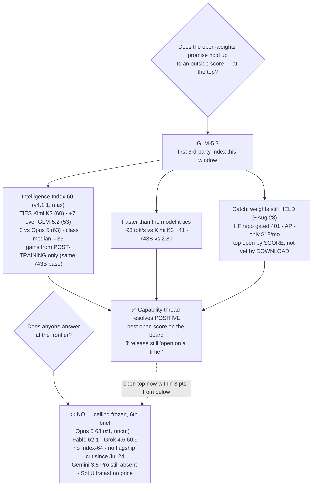

# LLM Updates — 2026-Aug-22

Saturday brief, written Sat Aug 22 (Los Angeles time). For a month the series has tracked two frozen
questions. **Does anyone answer at the frontier?** — no Index-64 model and no flagship price cut
since Claude Opus 5 took #1 on Jul 24. And **does the open-weights promise land — and hold up to an
outside score?** — Kimi K3 ("open but not runnable," Jul-30), Muse Glimmer 30B ("open, on-device,"
Aug-11), Qwen3.8-27B (independently scored 52, Aug-18). The Aug-18 brief closed with one open thread
on that second question: **GLM-5.3 had shipped its "strongest open coder" claim on Aug 14 but had no
independent Index** — the whole story rested on Z.ai's own benchmark table.

**This window that thread resolves — and it resolves high.** Artificial Analysis has now scored
**GLM-5.3 at Intelligence Index 60** (max effort, v4.1.1), **tying Kimi K3** as the top open-weights
model and landing **just 3 points below the frozen Opus 5 ceiling (63)** — a **+7 jump over GLM-5.2
(53) achieved by post-training alone**, on the same 743B base. The catch, and it is the whole shape
of the story: **the weights are still locked.** Z.ai's safety-hold still points at **~Aug 28**, and
the Hugging Face repo `zai-org/GLM-5.3` exists but returns a gated **401**. So the best *open* score
on the board is, for now, the top open model **by score, not yet by download** (§1).

The window's second real development is a *cost* one: **Qwen3.8-27B's verbosity got priced** —
Aug-18's watch-item #2. Artificial Analysis's own run cost **$591.30 and emitted 160M tokens vs a
~45M class median**, confirming the 27B is "particularly expensive" *for its size class* despite a
cheap per-token rate — with one softening nuance for agent use (§2).

Meanwhile the **closed ceiling stays frozen for a 6th straight brief**: Opus 5 still #1 at Index
**63**, uncut ($5/$25); Fable 5 **62.1**; Grok 4.6 **60.9**; **no Index-64 model and no flagship
price cut since Jul 24**; **Gemini 3.5 Pro still off the board** (a 4th missed target); and **Sol
Ultrafast still a no-price preview**. Every point of motion this window was, again, **below** the
line — and this time the top of the *open* stack climbed to within arm's reach of it.

This report advances only what is **new since Aug-18.** It does **not** re-derive the GLM-5.3 launch
and its vendor benches (Aug-16 §2, Aug-18 §4), the Qwen3.8-27B launch or its Index-52 (Aug-16 §1,
Aug-18 §1), Sol Ultrafast's preview (Aug-16 §3), or Grok 4.6's ceiling-band entry (Aug-14 §1) —
those are unchanged and pointed to in §4.

![Intelligence Index chart. A dashed amber band across the top marks the closed ceiling, frozen for a sixth straight brief: Claude Opus 5 at 63 and still number one and uncut, Fable 5 at 62.1, and Grok 4.6 at 60.9, with no Index-64 model and no flagship price cut since July 24. A dashed sky-blue line sits three points below the ceiling at Index 60, where the top open-weights score now lives: Kimi K3 at 60, shown as a solid dot because it is downloadable, and GLM-5.3 at 60, shown as a hollow ring because it was independently measured but its weights stay locked until about August 28. An arrow rises from GLM-5.2 at 53 up to GLM-5.3 at 60, labelled plus 7, post-training only, on the same 743-billion-parameter base. Qwen3.8-27B is marked at 52 for reference. A note records that the open-model class median is about 35, so both open leaders sit roughly 25 points above it. The takeaway line reads: the open top jumped plus 7 to tie Kimi K3 at 60, within 3 of the frozen closed ceiling, but GLM-5.3's weights stay locked until about August 28.](open_top_reaches_the_ceiling.svg)

---

## 1. GLM-5.3, independently measured — Index 60, tying Kimi K3, 3 below the ceiling

Aug-18 §4 carried GLM-5.3 as "released Aug 14, strongest-open-coder + emergent-cyber **claims**,
weights held ~2 wks for safety (≈Aug 28), **no independent Index at compile time**." The independent
Index is now in, and it is the strongest open number the series has recorded.

**Intelligence Index: 60** (v4.1.1, max effort) — the setting Z.ai recommends for coding. Artificial
Analysis's own summary: *"GLM-5.3 achieves 60 on the Artificial Analysis Intelligence Index, on par
with Kimi K3 and up 7 points from GLM-5.2. Once the weights are released it will be tied as the
leading open-weights model."* Where that lands:

| Model | Params | Intelligence Index (v4.1.1, max) | License / access | Note |
|---|---|---|---|---|
| Claude Opus 5 | closed | **63** | closed, $5/$25 | #1, uncut — the frozen ceiling |
| Claude Fable 5 | closed | 62.1 | closed | |
| Grok 4.6 | closed | 60.9 | closed | cheap end of the ceiling band |
| **GLM-5.3 (max)** | **743B MoE** | **60** | **open license — weights held ~Aug 28** | **+7 over GLM-5.2, post-training only** |
| Kimi K3 (max) | 2.8T MoE | 60 | open (Modified-MIT), **downloadable** | prior top open model, ties GLM-5.3 |
| GLM-5.2 (max) | 743B MoE | 53 | open weights (shipped) | the same base GLM-5.3 post-trains |
| Qwen3.8-27B | dense 27B | 52 | open (Apache-2.0), downloadable | Aug-18's headline; one-GPU |
| _open-model class median_ | — | **≈35** | — | both open leaders sit **~25 pts above** it |

Three things make this the window's headline:

1. **It ties the open ceiling and closes the gap to the closed ceiling to 3 points.** GLM-5.3 (60)
   matches Kimi K3 (60) as the top *open* score and sits just **3 below Opus 5 (63)** — the smallest
   open-to-closed gap the series has seen. [officechai](https://officechai.com/ai/glm-5-3-scores-60-on-aa-intelligence-index-three-chinese-labs-now-right-behind-us-frontier/)
   framed it as "**three Chinese labs now right behind the US frontier**" (Moonshot, Z.ai, and the
   DeepSeek/Qwen tier just below).
2. **The +7 came from post-training alone.** GLM-5.3 reuses GLM-5.2's exact **743B MoE base** — no
   new pretraining run — and still gained 7 Index points (53→60). The vendor benches behind it are
   large: Terminal-Bench 3.0 **4.6→28.3**, DeepSWE v1.1 **46.2→66.9**, CyberGym **84.5%** (Z.ai says
   it leads the open field, edging Mythos 5 and GPT-5.6 Sol). Those specific numbers remain
   **vendor-reported**; only the *aggregate* Index-60 is third-party. Sources:
   [Unite.AI "GLM-5.3 scores 60… matching Kimi K3"](https://www.unite.ai/glm-5-3-scores-60-on-artificial-analysis-intelligence-index-matching-kimi-k3/),
   [Artificial Analysis model page](https://artificialanalysis.ai/models/glm-5-3),
   [AA on X](https://x.com/ArtificialAnlys/status/2089830890709135426),
   [Hacker News](https://news.ycombinator.com/item?id=49353407).
3. **It is faster than the model it ties.** At the same Index-60, GLM-5.3 generates **~93 tok/s** vs
   Kimi K3's **~41 tok/s** — and it is a 743B MoE (~40B active) against Kimi's 2.8T, i.e. far cheaper
   to serve. On paper GLM-5.3 Pareto-dominates the prior open leader on both cost and speed at equal
   quality.

**The catch is the whole shape of the story: you cannot download it yet.** The weights remain **held
until ~Aug 28** behind Z.ai's "most extensive risk review to date"; the Hugging Face repo
`zai-org/GLM-5.3` is created but returns a **gated 401**, not a 404 — staged, not shipped
([apidog](https://apidog.com/blog/self-host-glm-5-3-open-weights/),
[Distk "the open model that shipped without its weights"](https://distk.in/blog/glm-5-3-zai-open-weights-delay-2026.html)).
So the honest read: **GLM-5.3 is the top open model by *score*, and tied-top by *license intent*, but
Kimi K3 is still the top open model you can actually run today.** Access right now is **API-only** via
the $18/mo GLM Coding Plan.

**Net:** Aug-18's GLM-5.3 thread resolves **positive on capability** — the independent number backs
the "strongest open coder" framing and lands frontier-adjacent — but the release itself is still
**"open on a timer,"** and the timer (≈Aug 28) is now the single most concrete near-term event on the
board.

## 2. Qwen3.8-27B's verbosity, now priced — Aug-18 watch-item #2

Aug-18 §1 flagged the 27B as "best self-hostable ~27B on the board… **but talkative, and you budget
for that**," recording 160M output tokens vs a 43M class median (~3.7×) but no task-cost. This window
Artificial Analysis's own cost data fills that in:

- **It cost $591.30 to evaluate Qwen3.8-27B (xhigh) on the Intelligence Index**, generating **160M
  tokens vs a ~45M median** for comparable open models. AA's own model page calls it
  *"amongst the leading models in intelligence, but **particularly expensive** when comparing to
  other open-weight models of similar size… also **notably slow and very verbose**."*
  ([Artificial Analysis](https://artificialanalysis.ai/models/qwen3-8-27b))
- **The softening nuance for agent use:** in an agent loop most input is a **cache read**, so the
  effective input rate is about **$0.15/M** rather than the $0.40–$0.50/M list, which recovers part
  of the cost the verbosity gives away. Verbosity hits the **output** side (unchanged at ~$3/M), so
  the penalty is real for long generations but partially offset in cache-heavy multi-turn agents.

The framing that survives: **cheapest-good-open-27B on a *per-token* basis, but not on a *per-task*
basis** — the 3.7× token multiplier means a nominally cheap model can cost more to *finish a task*
than a pricier, terser peer. Self-hosted, you pay it in wall-clock and VRAM-seconds. Watch-item #2
resolves: **the verbosity is priced, it is material, and it does not erase the value — it just moves
the 27B from "obvious default" to "default if you budget output tokens."**

## 3. What did *not* move — the ceiling, Gemini 3.5 Pro, Sol Ultrafast

- **The closed ceiling — frozen a 6th straight brief.** The [Artificial Analysis Intelligence
  Index](https://artificialanalysis.ai/evaluations/artificial-analysis-intelligence-index) top is
  unchanged: **Opus 5 63 (#1, uncut, $5/$25)**, **Fable 5 62.1**, **Grok 4.6 60.9** — now across
  **180 tested models** (up from 177 at Aug-18) ([BenchLM](https://benchlm.ai/benchmarks/artificialanalysis)).
  **No Index-64 model. No flagship price cut since Jul 24** (~4 weeks). The answer to "does anyone
  answer at the frontier?" is, for the sixth brief running, **no** — and this time GLM-5.3 pulled the
  best open score to within **3 points** of it without the ceiling itself moving at all.
- **Gemini 3.5 Pro — still absent, now a 4th missed target.** No new ship or date; trackers record
  the model missing its late-June, ~Jul-17, early-August, and a rumored Aug-12 window, still in
  limited Vertex AI enterprise preview ([The AI Rankings "three delays and still unreleased"](https://theairankings.com/google/gemini-3-5-pro/)).
  Google's live top remains the Flash tier. It is the single most overdue frontier event on the board.
- **Sol Ultrafast — still a no-price preview.** OpenAI's Cerebras-powered ~750 tok/s Sol tier
  (Aug-16 §3) is **still waitlist/invitation-only, still no price, still no GA date** as of Aug 19;
  the CS-4 hardware behind it remains early-access ([explainX](https://explainx.ai/blog/openai-gpt-5-6-sol-ultrafast-cerebras-august-2026),
  [orcarouter](https://www.orcarouter.ai/blog/gpt-5-6-sol-ultrafast)). It is a *service tier*, not a
  new model.
- **Only minor release in-window: GLM-5.2 Turbo.** Z.ai's cheaper/faster Turbo variant of GLM-5.2
  (shipped Aug 17, surfaced on release trackers Aug 20) is the sole new listing since Gemini 3.7
  Flash (Aug 13); it carries **no independent Index** at compile time
  ([LLM Gateway timeline](https://llmgateway.io/timeline)). No new *frontier* model shipped in the
  Aug 18–22 window — the window's signal is the **two measurements** (GLM-5.3 Index, Qwen cost), not
  a launch.

## 4. Reading it together

The through-line of the last month sharpens again. The **bottom and now the top of the open stack
keep climbing** — an open-license 743B model, gaining +7 Index points from post-training alone, has
tied the prior open leader at 60 and pulled the best open score to within **3 points** of a closed
ceiling that **has not moved in six briefs**. The compression of the gap between "the best you can
run yourself" and "the best you can rent" is now happening at the *very top* of the open field, not
just the floor. Two frictions keep it from being a clean "open catches the frontier" story: GLM-5.3's
**weights are still locked** (score, not download), and the one closed lab that could break the freeze
from above (Google) is **still delayed**. The frontier isn't being answered — it's being *approached
from below*, one measurement at a time.

## 5. Unchanged since Aug-18 (not re-derived here)

- **GLM-5.3 launch** (Z.ai, Aug 14): 743B MoE base shared with GLM-5.2, post-train-only, 1M ctx,
  "strongest open coder" + emergent cyber, weights held ~Aug 28, API-only $18/mo — Aug-16 §2 / Aug-18
  §4. *This brief adds the independent Index 60 and the cost/speed comparison (§1).*
- **Qwen3.8-27B** (Aug 14): dense 27B, Apache-2.0, one 24 GB GPU, Index 52 / Agentic 51 — Aug-16 §1,
  Aug-18 §1. *This brief adds the $591 cost-to-eval and the agent-cache nuance (§2).*
- **Qwen3.8-Max** open weights (Aug 12–13): degraded/gated, measured Index **56** — Aug-14 §2.
- **Grok 4.6** (SpaceXAI, Aug 6): Index 60.9, ceiling band (cheap end $2/$6), post-train-only — Aug-14 §1.
- **Sol Ultrafast** (Aug 13): Cerebras, ~750 tok/s, preview/waitlist, no price — Aug-16 §3.
- **Gemini 3.7 Flash** (Aug 13): last frontier-lab release before this window — Aug-18 §2.
- **Solar Pro 4** (Upstage, Korea; ~Aug 14): Index 42, agent-first, ~$0.30 — Aug-16 §3.
- **v4.1.1 grader recalibration** (Aug 6): top absolute numbers rose ~+2 because the ruler changed — Aug-14.
- **Muse Glimmer 30B** (Meta, Aug 10): open, on-device, distilled-from-Spark + DFlash — Aug-11.
- **DeepSeek V4-Flash-0731** 50/$0.28 MIT Pareto floor — Aug-03 §1.
- **Kimi K3** open weights (Moonshot, Jul-26): 2.8T MoE, Modified-MIT, Index 60, hardware-gated to
  serve but **downloadable** — Jul-30. *Still the top open model you can actually run.*
- **Opus 5** "top quality at mid price" (Jul-24): effort dial + paid fast mode — Jul-25.
- **Sonnet 5** $2/$10 intro pricing kept (the planned $3/$15 Sep tier was scrapped); **Kill Switch /
  Pacing** policy axis quiet.

## Watch-items into the next brief

1. **GLM-5.3's weights actually shipping (~Aug 28).** Now the single most concrete near-term event:
   the HF repo is staged and gated (401). Does the timer hold — making GLM-5.3 the outright top *and*
   downloadable open model — or slip the way Qwen3.8-Max's open release did twice? And do the
   independent Index-60 numbers survive once outside labs can re-run the coding/cyber benches under
   their own harness (the sub-scores are still vendor-reported)?
2. **The frozen ceiling — 6th brief, now with an open model 3 points away.** Gemini 3.5 Pro's 4th
   miss is the most overdue frontier event; a ship, a credible date, or *any* flagship price cut
   would be the first top-tier move since Jul 24.
3. **Whether GLM-5.3's Pareto claim survives a real serving comparison** — ~93 tok/s and 743B vs
   Kimi K3's ~41 tok/s and 2.8T suggests it dominates the prior open leader on cost *and* speed at
   equal quality; watch for hosted providers and a real cost-per-task head-to-head once weights drop.
4. **Sol Ultrafast** GA + pricing — whether the Cerebras speed tier becomes a product or stays a
   preview.

---

### Method & caveats

- **Compiled** Sat Aug 22 2026 (Los Angeles time). Advances only items **new since the Aug-18 brief**;
  unchanged threads are listed in §5 with pointers, not re-derived.
- **Scraping resilience.** Direct fetch is **broadly egress-blocked** from this environment
  (`artificialanalysis.ai`, `unite.ai`, `news.ycombinator.com`, `x.com`, `officechai.com`,
  `benchlm.ai` were not directly fetchable). All figures below were therefore taken from the **search
  index** and **corroborated across multiple independent outlets**; no quantitative claim here rests
  on a single source. Where numbers could not be independently confirmed they are labelled
  **vendor-reported** or **claim**.
- **What is measured vs claimed.** GLM-5.3's **aggregate Intelligence Index 60** and its **speed
  (~93 tok/s)** are now **third-party measured** (Artificial Analysis, v4.1.1) — the material upgrade
  over the Aug-18 brief. Its component benches (Terminal-Bench 3.0, DeepSWE, CyberGym 84.5%) remain
  **vendor-reported** pending independent re-runs. GLM-5.3's **weights are not yet released** (gated
  401, ≈Aug 28), so the "leading open-weights model" status is **by score/intent, not by download**.
  Qwen3.8-27B's **$591 cost-to-eval / 160M tokens** is Artificial Analysis's own figure. GLM-5.2
  Turbo has **no independent Index** at compile time.
- **Diagrams** are a standalone theme-neutral SVG (slate/amber/sky strokes that read on light and dark
  backgrounds, no external URLs) and an inline Mermaid flowchart; both render in GitHub-flavored
  markdown.

### Sources

- **GLM-5.3 independent Index 60** — [Unite.AI "GLM-5.3 scores 60… matching Kimi K3"](https://www.unite.ai/glm-5-3-scores-60-on-artificial-analysis-intelligence-index-matching-kimi-k3/) · [Artificial Analysis model page](https://artificialanalysis.ai/models/glm-5-3) · [AA on X (60, +7 over 5.2, tied leading open once weights ship)](https://x.com/ArtificialAnlys/status/2089830890709135426) · [officechai "three Chinese labs right behind US frontier"](https://officechai.com/ai/glm-5-3-scores-60-on-aa-intelligence-index-three-chinese-labs-now-right-behind-us-frontier/) · [Hacker News](https://news.ycombinator.com/item?id=49353407) · [GLM-5.3 vs Kimi K3 comparison](https://artificialanalysis.ai/models/comparisons/glm-5-3-vs-kimi-k3)
- **GLM-5.3 weights held / staged** — [apidog: self-hosting GLM-5.3, the open-weights drop](https://apidog.com/blog/self-host-glm-5-3-open-weights/) · [Distk: "the open model that shipped without its weights"](https://distk.in/blog/glm-5-3-zai-open-weights-delay-2026.html) · [explainX: GLM-5.3 launch, benchmarks, access](https://www.explainx.ai/blog/glm-5-3-launch-cyber-defense-benchmarks-august-2026)
- **Qwen3.8-27B cost / verbosity** — [Artificial Analysis model page (xhigh)](https://artificialanalysis.ai/models/qwen3-8-27b) · [OpenRouter pricing](https://openrouter.ai/qwen/qwen3.8-27b)
- **Ceiling & leaderboard** — [Artificial Analysis Intelligence Index v4.1.1](https://artificialanalysis.ai/evaluations/artificial-analysis-intelligence-index) · [BenchLM leaderboard (Opus 5 63.0, 180 models)](https://benchlm.ai/benchmarks/artificialanalysis)
- **Gemini 3.5 Pro delay** — [The AI Rankings: "three delays and still unreleased"](https://theairankings.com/google/gemini-3-5-pro/)
- **Sol Ultrafast preview** — [explainX: 750 tok/s, no price](https://explainx.ai/blog/openai-gpt-5-6-sol-ultrafast-cerebras-august-2026) · [orcarouter: 14× speed, price TBD](https://www.orcarouter.ai/blog/gpt-5-6-sol-ultrafast)
- **In-window minor release / tracking** — [LLM Gateway timeline (GLM-5.2 Turbo)](https://llmgateway.io/timeline) · [Sonnet 5 pricing kept](https://www.thestack.technology/anthropic-follows-openai-with-frontier-model-price-cuts/)
