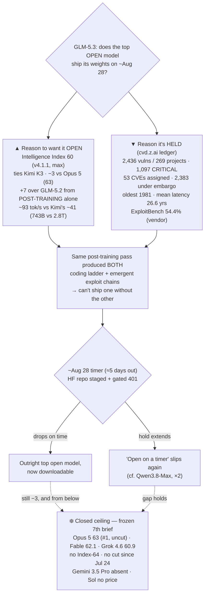

# LLM Updates — 2026-Aug-23

Sunday brief, written Sun Aug 23 (Los Angeles time). One day on from the Aug-22 report, and the board
has not moved: no new model, no Index change, no price cut. For a month the series has tracked two
frozen questions — **does anyone answer at the frontier?** (no Index-64 model, no flagship price cut
since Opus 5 took #1 on Jul 24) and **does the open-weights promise land, and hold up to an outside
score?** (Kimi K3, Muse Glimmer 30B, Qwen3.8-27B, and now GLM-5.3). Aug-22 resolved the *capability*
half of the second question high: **GLM-5.3 was independently scored at Intelligence Index 60**, tying
Kimi K3 as the top open model and landing 3 points under the frozen ceiling — but its **weights stay
locked behind a safety hold pointed at ~Aug 28.**

**This window has no launch. Its one substantive move is that the safety hold got itemized.** With the
promised open-weights drop now roughly **five days out**, the concrete content of that hold came into
focus: Z.ai's public **coordinated-vulnerability-disclosure ledger** (`cvd.z.ai`) — **2,436
vulnerabilities across 269 open-source projects**, **1,097 of them critical** in Linux, WebKit and
FreeBSD, with **53 CVEs already assigned and 2,383 still under embargo**, an oldest flaw dating to
**1981** and a **mean latency of 26.6 years** undiscovered (§1). This is the dual-use crux of the
open-weights debate made concrete: **the best open score on the board is also a prolific real-world
vulnerability finder** — and that is precisely the capability a weight release cannot take back (§2).

Meanwhile the **closed ceiling stays frozen for a 7th straight brief**: Opus 5 still #1 at Index
**63**, uncut ($5/$25); Fable 5 **62.1**; Grok 4.6 **60.9**; no Index-64 model and no flagship price
cut since Jul 24; Gemini 3.5 Pro still off the board; Sol Ultrafast still a no-price preview (§3).

This report advances only what is **new since Aug-22.** It does **not** re-derive GLM-5.3's Index-60
measurement (Aug-22 §1), the Qwen3.8-27B cost/verbosity result (Aug-22 §2), the GLM-5.3 launch and its
vendor benches (Aug-16 §2, Aug-18 §4), or Grok 4.6's ceiling-band entry (Aug-14 §1) — those are
unchanged and pointed to in §5.

![A split diagram organised around a horizontal timeline from August 14, when GLM-5.3 launched with its weights held, through today August 23, to about August 28, the promised open-weights drop now roughly five days away. A dashed amber band across the top marks the closed ceiling, frozen for a seventh straight brief: Claude Opus 5 at 63 and still number one and uncut, Fable 5 at 62.1, Grok 4.6 at 60.9, no Index-64 model and no flagship price cut since July 24. Above the timeline, the reason to want the model open: Intelligence Index 60, tying Kimi K3 as the top open model and just 3 below Opus 5, with the plus-7 over GLM-5.2 coming from post-training alone on the same 743-billion-parameter base. Below the timeline, the reason it is held: a public coordinated-disclosure ledger at cvd.z.ai recording 2,436 vulnerabilities across 269 open-source projects, 1,097 of them critical in Linux, WebKit and FreeBSD, with 53 CVEs assigned and 2,383 under embargo, the oldest flaw dating to 1981 and a mean latency of 26.6 years. The takeaway: the same post-training that rebuilt the coding ladder also produced emergent exploit-chain capability, so the best open score on the board is also a prolific real-world vulnerability finder, and that dual-use capability is exactly what a weight release cannot take back.](the_safety_hold_itemized.svg)

---

## 1. The safety hold, itemized — GLM-5.3's disclosure ledger comes into focus

Every brief since Aug-16 has carried GLM-5.3's weight-hold as a one-line rationale — "held ~2 weeks
for safety (≈Aug 28), most extensive risk review to date." With the timer now ~5 days from expiry,
this window brings the *content* of that hold into view, and it is unusually concrete: a **public
coordinated-vulnerability-disclosure (CVD) ledger** at `cvd.z.ai` that itemizes what GLM-5.3's cyber
capability actually found.

The headline figures, corroborated across multiple outlets:

| Ledger figure | Value | Note |
|---|---|---|
| Vulnerabilities recorded | **2,436** | across **269 open-source projects**, after expert review + dedup |
| Classified **critical** | **1,097** | concentrated in **Linux, WebKit, FreeBSD** |
| Classified high severity | ~990 | per the running program tally |
| **CVEs assigned** so far | **53** | publicly numbered |
| Findings **under embargo** | **2,383** | moving through coordinated disclosure |
| Oldest flaw | dates to **1981** | i.e. predates most of the affected codebases' maintainers |
| **Mean latency** undiscovered | **26.6 years** | average time a bug sat unfound before AI-assisted analysis |

Named examples on the ledger include a Linux-kernel 6lowpan use-after-free (CVE-2026-64452), a
WebKit/Safari memory-handling bug (CVE-2026-43663), a FreeBSD ptrace parameter-validation flaw
(CVE-2026-45253), a GStreamer heap out-of-bounds write (CVE-2026-59691), a Suricata SMTP/MIME parsing
bypass (CVE-2026-57229), and a Joomla stored XSS (CVE-2026-48952). Sources:
[Kingy AI (the 2,436-vulnerability claim, the two-week delay)](https://kingy.ai/blog/glm-5-3-open-weight-cybersecurity-vulnerability-claim/),
[TechTimes ("finds 1,097 critical bugs" in Linux/WebKit/FreeBSD)](https://www.techtimes.com/articles/324426/20260814/glm-53-post-training-produced-exploit-chains-zai-never-planned-finds-1097-critical-bugs.htm),
[MLQ News (Z.ai delays weights after cyber tests)](https://mlq.ai/news/zai-delays-glm-53-weights-after-cybersecurity-tests-show-strong-exploit-capability/),
[Unite.AI (a cyber capability that outgrew its training)](https://www.unite.ai/z-ai-launches-glm-5-3-with-frontier-coding-and-a-cyber-capability-that-outgrew-its-training/),
[VentureBeat (reportedly found a "serious vulnerability" in Cursor)](https://venturebeat.com/technology/glm-5-3-is-here-with-advanced-cyber-capabilities-and-reportedly-already-found-a-serious-vulnerability-in-cursor),
[ModemGuides (bug-ledger summary)](https://www.modemguides.com/blogs/ai-news/glm-5-3-open-weights-security-findings).

Two clarifications keep this honest:

1. **The 2,436 are not all GLM-5.3's alone, and not all new this week.** Z.ai's security program has
   been running since the GLM-5.2 era with outside security teams; the ledger is the *cumulative*
   output of that program, surfaced publicly around the GLM-5.3 launch. What is genuinely *this
   window* is the ledger coming into focus as the release timer nears — coordinated disclosure is an
   ongoing process (CVEs move from embargo to assigned over time), and the prior briefs in this series
   tracked the aggregate Index and the CyberGym **84.5%** vendor bench (Aug-18 §4) but never the
   disclosure ledger itself.
2. **The capability numbers are vendor-reported.** ExploitBench **54.4%** and "105 ExploitGym tasks
   in two hours" are Z.ai's own figures; the CVE assignments (53) are externally verifiable through
   the numbering authorities, but the embargoed 2,383 and the "1981 / 26.6-year" statistics rest on
   the vendor's ledger pending independent audit. Z.ai also says it will run a five-day red-team
   assessment (garak, promptfoo, PyRIT, mapped to OWASP-agentic + MITRE ATLAS) before the drop.

## 2. What the ledger means for the ~Aug-28 timer

The Aug-22 brief framed GLM-5.3 as "the top open model by *score*, not yet by *download*." This
window sharpens *why* the download is gated, and it is the cleanest illustration this series has seen
of the open-weights dual-use problem:

- **The capability that scores and the capability that scares came from the same pass.** GLM-5.3's
  +7 Index jump (53→60) was **post-training only** on GLM-5.2's exact 743B base (Aug-22 §1). Z.ai's
  own framing is that the same post-training that rebuilt the coding ladder produced **exploit-chain
  reasoning it "never planned"** — the cyber capability "outgrew its training." You cannot ship the
  coding model without shipping the vulnerability-finder; they are the same weights.
- **A weight release is irreversible in a way an API is not.** An API-gated model with a 54% ExploitBench
  score can be rate-limited, monitored, and shut off. Open weights running on a 24 GB-class box cannot.
  That asymmetry is the entire argument for the ~2-week hold — and it is why this particular open
  release, unlike Kimi K3's or Qwen3.8-27B's, ships **on a timer rather than a link.**
- **The timer is now the single most concrete near-term event on the board.** Five days out, the HF
  repo `zai-org/GLM-5.3` remains staged and gated (401, not 404). The question the next brief inherits
  is binary: **do the weights drop on ~Aug 28** — making GLM-5.3 the outright top open model *and*
  downloadable — **or does the safety review extend the hold**, the way Qwen3.8-Max's open release
  slipped twice? The ledger makes an extension more plausible than it looked a week ago.

**Net:** no number moved this window, but the *shape* of the top open-weights story got clearer. The
best open model on the board is frontier-adjacent at coding **and** a prolific real-world CVE finder,
and those are the same weights — so "open" here means "open, after a documented safety review, on a
timer we can still slip."

## 3. What did *not* move — the ceiling, Gemini 3.5 Pro, Sol Ultrafast

- **The closed ceiling — frozen a 7th straight brief.** The
  [Artificial Analysis Intelligence Index](https://artificialanalysis.ai/evaluations/artificial-analysis-intelligence-index)
  top is unchanged: **Opus 5 63 (#1, uncut, $5/$25)**, **Fable 5 62.1**, **Grok 4.6 60.9**
  ([BenchLM](https://benchlm.ai/benchmarks/artificialanalysis); AA's leaderboard last refreshed
  Aug 21). **No Index-64 model. No flagship price cut since Jul 24** (~4½ weeks). The answer to "does
  anyone answer at the frontier?" is, for the seventh brief running, **no** — with the best *open*
  score (GLM-5.3, 60) parked 3 points below and its weights still locked.
  [Artificial Analysis' own Opus 5 write-up](https://artificialanalysis.ai/articles/claude-opus-5-leader-agentic-knowledge-work)
  (max effort, AA-Briefcase Elo 1720, $17.79/task) remains the standing frontier reference.
- **Gemini 3.5 Pro — still absent.** No new ship or date; trackers still record the model missing its
  late-June, ~Jul-17, and early-August windows, in limited Vertex AI enterprise preview
  ([The AI Rankings](https://theairankings.com/google/gemini-3-5-pro/),
  [Forbes, "delay continues"](https://www.forbes.com/sites/johnwerner/2026/08/13/gemini-35-pro-delay-continues/)).
  Google's live top remains the Flash tier. It is the single most overdue frontier event on the board.
- **Sol Ultrafast — still a no-price preview.** OpenAI's Cerebras-powered ~750 tok/s tier remains
  waitlist/invitation-only with no price and no GA date; it is a *service tier*, not a new model
  (Aug-22 §3).
- **No new model in the Aug 22–23 window.** The latest listing on the release trackers remains
  **GLM-5.2 Turbo** (Aug 17, still no independent Index), behind Gemini 3.7 Flash (Aug 13)
  ([LLM Gateway timeline](https://llmgateway.io/timeline),
  [llm-stats releases](https://llm-stats.com/ai-news)). The window's signal is a *disclosure*, not a
  launch.

## 4. Reading it together

The month's through-line holds, and this quiet Sunday adds a sharp footnote to it. The frontier is
**not being answered from above** — the closed ceiling has not moved in seven briefs, and the one lab
that could break the freeze (Google) is still delayed. It is **being approached from below**, one open
model at a time — and the closest approach, GLM-5.3 at Index 60, now comes with its own asterisk made
explicit. The very thing that makes the open stack exciting (a 743B model gaining frontier-adjacent
coding from post-training alone) is inseparable from the thing that makes its release fraught (that
same pass produced a model that finds critical bugs in Linux, WebKit and FreeBSD by the thousand). So
the top of the open field has arrived at a new kind of gate: not "can we build it" or "will it score,"
but "**can we safely let go of the weights**" — and the honest state of that question, five days from
the timer, is *undecided*.

## 5. Unchanged since Aug-22 (not re-derived here)

- **GLM-5.3 independent Index 60** (AA, v4.1.1, max): ties Kimi K3 as top open, −3 vs Opus 5, +7 over
  GLM-5.2 from post-training only; ~93 tok/s vs Kimi's ~41 — Aug-22 §1. *This brief adds the CVD
  ledger / safety-hold detail behind the weight delay (§1–2).*
- **Qwen3.8-27B cost/verbosity**: $591.30 to eval, 160M tokens vs ~45M median; agent-cache nuance
  (~$0.15/M effective input) — Aug-22 §2.
- **GLM-5.3 launch** (Z.ai, Aug 14): 743B MoE base shared with GLM-5.2, post-train-only, 1M ctx,
  "strongest open coder" + emergent cyber, weights held ~Aug 28, API-only $18/mo — Aug-16 §2 / Aug-18 §4.
- **Qwen3.8-27B** (Aug 14): dense 27B, Apache-2.0, one 24 GB GPU, Index 52 / Agentic 51 — Aug-16 §1, Aug-18 §1.
- **Qwen3.8-Max** open weights (Aug 12–13): degraded/gated, measured Index **56** — Aug-14 §2.
- **Grok 4.6** (SpaceXAI, Aug 6): Index 60.9, ceiling band (cheap end $2/$6), post-train-only — Aug-14 §1.
- **Kimi K3** open weights (Moonshot, Jul-26): 2.8T MoE, Modified-MIT, Index 60, hardware-gated to
  serve but **downloadable** — Jul-30. *Still the top open model you can actually run.*
- **Sol Ultrafast** (Aug 13): Cerebras, ~750 tok/s, preview/waitlist, no price — Aug-16 §3.
- **Gemini 3.7 Flash** (Aug 13): last frontier-lab release before the Aug-18 window — Aug-18 §2.
- **GLM-5.2 Turbo** (Aug 17): cheaper/faster GLM-5.2 variant, no independent Index — Aug-22 §3.
- **DeepSeek V4-Flash-0731** 50/$0.28 MIT Pareto floor — Aug-03 §1.
- **Opus 5** "top quality at mid price" (Jul-24): effort dial + paid fast mode — Jul-25.
- **Sonnet 5** $2/$10 intro pricing kept (planned $3/$15 Sep tier scrapped); **Kill Switch / Pacing**
  policy axis quiet.
- **v4.1.1 grader recalibration** (Aug 6): top absolute numbers rose ~+2 because the ruler changed — Aug-14.

## Watch-items into the next brief

1. **GLM-5.3's weights actually shipping (~Aug 28)** — now ~5 days out and the single most concrete
   near-term event. Does the timer hold — making GLM-5.3 the outright top *and* downloadable open
   model — or does the CVD ledger's cyber finding push the hold *longer* (the way Qwen3.8-Max's open
   release slipped twice)? And do the Index-60 numbers survive once outside labs can re-run the
   coding/cyber benches under their own harness?
2. **Independent verification of the disclosure ledger.** 53 CVEs are externally checkable; the
   embargoed 2,383 and the "1981 / 26.6-year" statistics are vendor-reported. Watch for the five-day
   red-team result (garak/promptfoo/PyRIT) and any third-party audit of the ExploitBench 54.4% claim.
3. **The frozen ceiling — 7th brief, an open model 3 points away.** Gemini 3.5 Pro's continued
   absence is the most overdue frontier event; a ship, a credible date, or *any* flagship price cut
   would be the first top-tier move since Jul 24.
4. **Sol Ultrafast** GA + pricing — whether the Cerebras speed tier becomes a product or stays a preview.

---

### Method & caveats

- **Compiled** Sun Aug 23 2026 (Los Angeles time). Advances only items **new since the Aug-22 brief**;
  unchanged threads are listed in §5 with pointers, not re-derived. This was a **quiet single-day
  window** — no new model, no Index change — so the substantive content is the sharpening of one
  existing thread (the GLM-5.3 safety hold), not a fresh release.
- **Scraping resilience.** Direct fetch is **broadly egress-blocked** from this environment
  (`digitalapplied.com` and other domains returned egress-proxy blocks on direct fetch). All figures
  here were therefore taken from the **search index** and **corroborated across multiple independent
  outlets**; no quantitative claim rests on a single source. Where numbers could not be independently
  confirmed they are labelled **vendor-reported** or **claim**.
- **What is measured vs claimed.** GLM-5.3's **aggregate Intelligence Index 60** is third-party
  measured (Artificial Analysis, v4.1.1). The **CVD-ledger figures** (2,436 vulns / 269 projects /
  1,097 critical / 1981 / 26.6 yrs) and the **ExploitBench 54.4%** capability score are
  **vendor-reported** via Z.ai's `cvd.z.ai` ledger, pending independent audit; the **53 assigned
  CVEs** are externally verifiable through the numbering authorities, the **2,383 embargoed** are not
  yet. GLM-5.3's **weights remain unreleased** (HF repo gated 401, ≈Aug 28).
- **Diagrams** are a standalone theme-neutral SVG (slate/amber/sky/rose strokes that read on light and
  dark backgrounds, no external URLs) and an inline Mermaid flowchart; both render in GitHub-flavored
  markdown.

### Sources

- **GLM-5.3 disclosure ledger / cyber capability** — [Kingy AI: the two-week delay, cybersecurity leap, 2,436-vulnerability claim](https://kingy.ai/blog/glm-5-3-open-weight-cybersecurity-vulnerability-claim/) · [TechTimes: "post-training produced exploit chains… finds 1,097 critical bugs"](https://www.techtimes.com/articles/324426/20260814/glm-53-post-training-produced-exploit-chains-zai-never-planned-finds-1097-critical-bugs.htm) · [MLQ News: Z.ai delays weights after cybersecurity tests](https://mlq.ai/news/zai-delays-glm-53-weights-after-cybersecurity-tests-show-strong-exploit-capability/) · [Unite.AI: a cyber capability that outgrew its training](https://www.unite.ai/z-ai-launches-glm-5-3-with-frontier-coding-and-a-cyber-capability-that-outgrew-its-training/) · [VentureBeat: reportedly found a "serious vulnerability" in Cursor](https://venturebeat.com/technology/glm-5-3-is-here-with-advanced-cyber-capabilities-and-reportedly-already-found-a-serious-vulnerability-in-cursor) · [ModemGuides: open weights, release date, license, bug ledger](https://www.modemguides.com/blogs/ai-news/glm-5-3-open-weights-security-findings) · [D-Central: what the 84.5 cyber score hides](https://d-central.tech/glm-5-3-cybersecurity-benchmarks/)
- **GLM-5.3 open-weights status / self-hosting** — [apidog: self-hosting GLM-5.3, the open-weights drop](https://apidog.com/blog/self-host-glm-5-3-open-weights/) · [apidog: what is GLM-5.3](https://apidog.com/blog/what-is-glm-5-3/) · [felloai: benchmarks, pricing, held-back weights](https://felloai.com/glm-5-3/)
- **GLM-5.3 independent Index 60** (context, Aug-22) — [Unite.AI: GLM-5.3 scores 60, matching Kimi K3](https://www.unite.ai/glm-5-3-scores-60-on-artificial-analysis-intelligence-index-matching-kimi-k3/) · [Artificial Analysis model page](https://artificialanalysis.ai/models/glm-5-3)
- **Ceiling & leaderboard** — [Artificial Analysis Intelligence Index v4.1.1](https://artificialanalysis.ai/evaluations/artificial-analysis-intelligence-index) · [Artificial Analysis: Claude Opus 5, leader in agentic knowledge work](https://artificialanalysis.ai/articles/claude-opus-5-leader-agentic-knowledge-work) · [BenchLM leaderboard (Opus 5 63.0)](https://benchlm.ai/benchmarks/artificialanalysis)
- **Gemini 3.5 Pro delay** — [The AI Rankings: three delays and still unreleased](https://theairankings.com/google/gemini-3-5-pro/) · [Forbes: Gemini 3.5 Pro delay continues](https://www.forbes.com/sites/johnwerner/2026/08/13/gemini-35-pro-delay-continues/)
- **Release tracking (no new model in-window)** — [LLM Gateway timeline](https://llmgateway.io/timeline) · [llm-stats: AI news / releases](https://llm-stats.com/ai-news)
