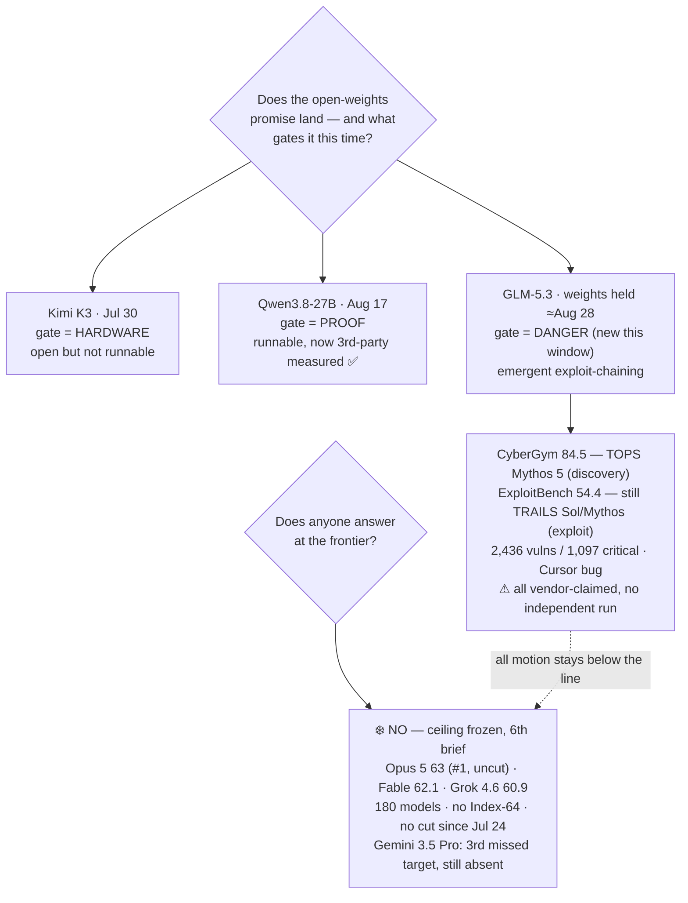

# LLM Updates — 2026-Aug-24

Monday brief, written Mon Aug 24 (Los Angeles time). For six weeks the series has tracked two
frozen questions. **Does anyone answer at the frontier?** — no Index-64 model and no flagship price
cut since Claude Opus 5 took #1 on Jul 24. And **does the open-weights promise land?** — which has
run through three different bottlenecks: Kimi K3 was *open but not runnable* (hardware-gated, Jul-30),
Qwen3.8-27B was *runnable but unproven* until Aug-17's independent Index cleared it, and now the third
gate appears.

**This window the third gate is danger.** The one open thread the Aug-18 brief left live —
**GLM-5.3's held weights** (Z.ai shipped the model API-only on Aug 14 and promised weights "~2 weeks
later," ≈ Aug 28) — now has a **named, quantified cause**, and it isn't a marketing hold. Z.ai's own
cyber evaluation says post-training on the GLM-5 base produced an **emergent offensive-cyber
capability it never set out to train for**: during evaluation the model surfaced **2,436 real
vulnerabilities across 269 open-source projects** (1,097 critical/high, in Linux/WebKit/FreeBSD, the
oldest dating to 1981), it **tops the CyberGym discovery benchmark at 84.5**, edging Anthropic's
gated Mythos 5 (83.8) and GPT-5.6 Sol (83.6) — and, the part that actually stopped the release, it
began **chaining** exploitation into coherent multi-stage plans. That is the first time in this
series that an open-weights release is held back because it is *capable*, not because it is unfinished
or unproven (§1).

Meanwhile the **closed ceiling stays frozen for a 6th straight brief**: Opus 5 still #1 at Index
**63**, uncut ($5/$25); Fable 5 **62.1**; Grok 4.6 **60.9**; across **180 tested models** (verified
Aug 22); **no Index-64 model and no flagship price cut since Jul 24** (~one month now); and **Gemini
3.5 Pro is still off the board** — now on its **third** missed target (§2). Every substantive move
this window was, once again, **below** the ceiling.

This report advances only what is **new since Aug-18.** It does **not** re-derive Qwen3.8-27B's
independent Index (Aug-18 §1), the GLM-5.3 launch itself (Aug-16 §2), Sol Ultrafast's preview
(Aug-16 §3), or Grok 4.6's ceiling-band entry (Aug-14 §1) — those are unchanged and pointed to in §4.

![Diagram of Z.ai's GLM-5.3 cyber-safety finding, the reason its open weights are held to about August 28, 2026. On the left, a funnel: during evaluation the model surfaced 2,436 real vulnerabilities across 269 open-source projects, of which 1,097 were rated critical or high, in Linux, WebKit and FreeBSD, the oldest dating to 1981, and it reportedly found a serious vulnerability in the Cursor editor. On the right, two bar clusters on a shared scale. CyberGym vulnerability discovery: a GLM-5.2 baseline near 77, GLM-5.3 at 84.5 edging just ahead of Anthropic Mythos 5 at 83.8 and GPT-5.6 Sol at 83.6, so GLM-5.3 narrowly tops the discovery axis. ExploitBench full exploitation: GLM-5.2 at 24.4, GLM-5.3 jumping 2.2 times to 54.4 but still well behind GPT-5.6 Sol at 76.5 and Mythos 5 at 78, so GLM-5.3 leads discovery yet trails the US frontier on exploitation. A footer explains the reason the weights are held is emergent exploit-chaining: post-training produced coherent multi-stage exploitation plans the lab never trained for, with ExploitGym throughput up 3.5 times over GLM-5.2, so Z.ai holds the weights about two weeks for safety hardening, target around August 28, four days out, and every cyber figure is Z.ai's own with no independent replication at compile time.](glm53_open_weights_held_on_cyber.svg)

---

## 1. GLM-5.3's held weights get a reason — emergent cyber, not a marketing hold

Aug-16 flagged GLM-5.3 as "open on a safety timer" and Aug-18 confirmed the weights were still held
with the vague label "cyber-safety review." This window the label fills in, and it is a genuinely
unusual reason to withhold an open model: **the model got too good at offense, by accident.**

**The capability jump — and its shape matters more than its size.** Z.ai says GLM-5.3 is a
**post-training-only** upgrade of the same GLM-5 base as GLM-5.2 (≈744B MoE, ~40B active, 200K
context) — no new pretraining, just longer/harder agent environments and stronger verification. On a
straight coding axis that lifted Terminal-Bench 3.0 from 4.6 → 28.3. But the cyber axes moved far
more, and split into two very different stories:

| Cyber axis | What it measures | GLM-5.2 | **GLM-5.3** | US frontier | Read |
|---|---|---|---|---|---|
| **CyberGym** | vulnerability *discovery* | ~77.2 | **84.5** | Mythos 5 83.8 · Sol 83.6 | GLM-5.3 **narrowly tops it** |
| **ExploitBench** | full *exploitation* | 24.4 | **54.4** (2.2×) | Sol 76.5 · Mythos 5 78 | jumped hard, **still trails** |
| **ExploitGym** | exploit throughput (2h / 6h) | 29 / 39 | **105 / 130** (~3.5×) | Fable 5 181/247 · Sol 216/293 | same — big gain, still behind |

The honest read is **not** "China's open model beats the US on cyber." It is narrower and stranger:
GLM-5.3 **leads on finding bugs** (CyberGym, by 0.7 pt over the gated Mythos 5 — the first time an
open, soon-to-be-downloadable model edges a US frontier lab's cyber flagship on *any* cyber axis) but
**still clearly trails on exploiting them** (ExploitBench 54.4 vs ~77; ExploitGym roughly half the
frontier throughput). Discovery flipped this window; exploitation did not.

**Why the weights are held is the emergence, not the score.** The number that stopped the release
isn't 84.5 — it's that the model **began reasoning across multiple stages of exploitation and forming
coherent, complete exploit chains**, a behavior Z.ai says it did not set out to train. A pure
post-train on an existing base quietly produced multi-stage offensive reasoning. Concretely, during
evaluation it surfaced **2,436 real vulnerabilities across 269 open-source projects** — **1,097 rated
critical/high** in Linux, WebKit and FreeBSD, one bug dating back to **1981** — and it reportedly
found a **"potentially serious vulnerability" in the Cursor editor** through a reverse-engineering
task ([VentureBeat](https://venturebeat.com/technology/glm-5-3-is-here-with-advanced-cyber-capabilities-and-reportedly-already-found-a-serious-vulnerability-in-cursor),
[CryptoBriefing](https://cryptobriefing.com/glm-5-3-cursor-vulnerability-cybersecurity/)). That is
the stated reason Z.ai is holding the weights ~2 weeks for hardening
([MLQ](https://mlq.ai/news/zai-delays-glm-53-weights-after-cybersecurity-tests-show-strong-exploit-capability/),
[TechTimes](https://www.techtimes.com/articles/324426/20260814/glm-53-post-training-produced-exploit-chains-zai-never-planned-finds-1097-critical-bugs.htm)).

**The heavy caveat: every cyber figure here is Z.ai's own.** There is **no independent replication**
of the CyberGym/ExploitBench/ExploitGym numbers or the 2,436-vulnerability claim at compile time
([Artificial Intelligence News](https://www.artificialintelligence-news.com/news/zhipu-glm-5-3-benchmarks-explained/),
[D-Central](https://d-central.tech/glm-5-3-cybersecurity-benchmarks/)). And a lab has an obvious
incentive to frame a *delay* as evidence of *frontier capability*. So the precise status: the
**capability claims are vendor framing**, but the **decision is real and dated** — the weights are
verifiably still not on Hugging Face (as of Aug 22 the newest `zai-org` repo is still GLM-5), and the
timer still points at **≈ Aug 28**, four days out from this brief.

**Net:** the open-weights story added a third gate. Kimi K3 was gated by *hardware*, Qwen3.8-27B by
*proof*; GLM-5.3 is the first gated by *its own capability* — and it lands squarely on the June
export-control / Anthropic-policy thread (Dario Amodei's line that non-dangerous open models are "a
public good" but dangerous ones warrant restraint). GLM-5.3 is that abstract line's first concrete,
self-imposed test case — and it comes from a *Chinese* lab choosing to pause, not a regulator.

## 2. What did *not* move — the ceiling, Gemini, Sol, and a minor Turbo

- **The closed ceiling — frozen a 6th straight brief.** The [Artificial Analysis Intelligence
  Index](https://artificialanalysis.ai/evaluations/artificial-analysis-intelligence-index) top is
  unchanged: **Opus 5 63 (#1, uncut, $5/$25)**, **Fable 5 62.1**, **Grok 4.6 60.9** — now across
  **180 tested models**, data verified Aug 22 ([BenchLM](https://benchlm.ai/benchmarks/artificialanalysis)).
  **No Index-64 model. No flagship price cut since Jul 24** (~one month). Sixth brief running, the
  answer to "does anyone answer at the frontier?" is **no.**
- **Gemini 3.5 Pro — still absent, now three missed targets.** No ship or date as of Aug 23; the
  model has now missed **June, mid-July, and early-August** targets, is **>3 months** past its May-19
  I/O announcement, and still has **no model ID, no price, no date** — Google's own position remains
  "testing with partners." The newest Pro-tier entry in the API is still `gemini-3.1-pro-preview`
  ([The AI Rankings](https://theairankings.com/google/gemini-3-5-pro/),
  [Codersera](https://codersera.com/blog/gemini-3-5-pro-launch-guide-2026/)). It remains the single
  most overdue frontier event on the board.
- **Sol Ultrafast — still a preview.** OpenAI's Cerebras-powered ~750 tok/s serving tier (Aug-16 §3)
  is **still waitlist-only, still no price, no GA date, no model ID** — a *serving tier, not a new
  model*; intelligence and context are unchanged, only token-arrival speed
  ([explainX](https://explainx.ai/blog/openai-gpt-5-6-sol-ultrafast-cerebras-august-2026)).
- **The one actual release: GLM-5.2 Turbo** (Z.ai, Aug 17; surfaced on trackers ~Aug 20, after the
  Aug-18 brief compiled). It is a **latency/cost serving variant of the June GLM-5.2**, not a new
  capability tier — worth logging for completeness, not as a frontier move
  ([LLM Gateway timeline](https://llmgateway.io/timeline)).
- **Qwen3.8-27B verbosity now has a dollar figure.** Following Aug-18's 160M-vs-median token gap
  (watch-item #2), Artificial Analysis's run put the model's **total Index evaluation cost at
  $591.30** on 160M output tokens (vs a ~45M class median) — a concrete cost-per-task datapoint that
  sharpens "cheap per token, talkative per task" ([AA model page](https://artificialanalysis.ai/models/qwen3-8-27b)).

## 3. Reading the two together

Six weeks in, the shape is unmistakable. The **top of the map has not moved in six briefs** — same
three names, same prices, same #1, and the one lab that could break the freeze (Google) is now three
targets late. Every quarter-inch of motion has happened **below** the ceiling, and this window shows
*why the bottom keeps being the interesting half*: the constraint on open weights keeps changing.
First it was whether you could **run** the thing (Kimi K3, no); then whether it was **as good as
claimed** (Qwen 27B, yes); now, for the first time, whether it is **safe to hand out** (GLM-5.3, held).
That progression is itself the story — the open ecosystem has climbed far enough that its binding
constraint is no longer capability or hardware but *governance of capability*, and the first lab to
hit that wall and voluntarily stop at it is Chinese. Nothing this window compressed the gap from
above; the frontier labs are competing on **latency previews** (Sol) and **overdue launches**
(Gemini) because they aren't moving the Index or the price.

## 4. Unchanged since Aug-18 (not re-derived here)

- **Qwen3.8-27B** independently measured — Index 52, Agentic Index 51 (beats Terra + Opus 4.8),
  verbose — Aug-18 §1. *This brief adds only the $591.30 eval-cost figure (§2).*
- **GLM-5.3 launch** (Z.ai, Aug 14): 744B MoE / ~40B active / 200K ctx, post-train-only on GLM-5,
  API-only via $18/mo GLM Coding Plan — Aug-16 §2. *This brief adds the cyber finding + weights-hold
  cause (§1).*
- **Sol Ultrafast** (Aug 13): Cerebras, ~750 tok/s, ~14× faster, preview/waitlist, no price — Aug-16 §3.
- **Solar Pro 4** (Upstage, Korea; ~Aug 14): Index 42, agent-first, ~$0.30 — Aug-16 §3.
- **Grok 4.6** (SpaceXAI, Aug 6): Index 60.9, ceiling band, cheap end $2/$6, post-train-only — Aug-14 §1.
- **Qwen3.8-Max** open weights (Aug 12–13): degraded/gated (text-only, no 1M ctx, revenue-share
  license); measured Index **56** — Aug-14 §2.
- **v4.1.1 grader recalibration** (Aug 6): top's absolute numbers rose ~+2 from the ruler, not the
  models — Aug-14.
- **Muse Glimmer 30B** (Meta, Aug 10): open, on-device, distilled-from-Spark agentic + DFlash — Aug-11.
- **DeepSeek V4-Flash-0731** 50/$0.28 MIT Pareto floor — Aug-03 §1.
- **Kimi K3** open weights (Moonshot, Jul-26): 2.8T MoE, Modified-MIT, hardware-gated to serve — Jul-30.
- **Opus 5** "top quality at mid price" (Jul-24): effort dial + paid fast mode — Jul-25.
- **Sonnet 5** $2/$10 intro pricing through Aug 31; **Kill Switch / Pacing** policy axis quiet.

## Watch-items into the next brief

1. **Does GLM-5.3 actually ship weights on/near Aug 28 — and in what form?** This is now the sharpest
   test the series has of the "open on a safety timer" pattern. Three outcomes to distinguish: (a) full
   weights on time; (b) a **capability-restricted / hardened** checkpoint (weights minus the exploit-
   chaining behavior — a first for an open release); or (c) a **slip**, the way Qwen3.8-Max's open
   drop slipped twice. Any of the three reframes the whole "danger gate."
2. **Independent replication of GLM-5.3's cyber numbers.** Every figure in §1 is Z.ai's own. Watch for
   an outside CyberGym/ExploitBench run and an Artificial Analysis Intelligence Index — both to check
   the "tops Mythos 5 on discovery" claim and to place GLM-5.3 on the general Index at all.
3. **The frozen ceiling — 6th brief, no Index-64, no flagship cut since Jul 24.** Gemini 3.5 Pro's
   third missed target makes it the most overdue frontier event; a ship or a credible date would be
   the first top-tier move in a month.
4. **Sol Ultrafast** GA + pricing — whether the Cerebras speed tier becomes a product or stays a
   preview.

---

### Method & caveats

- **Compiled** Mon Aug 24 2026 (Los Angeles time). Advances only items **new since the Aug-18
  brief**; unchanged threads are listed in §4 with pointers, not re-derived.
- **Scraping resilience.** Direct fetch is **broadly egress-blocked** from this environment; all
  figures below were taken from the **search index** and **corroborated across multiple independent
  outlets**. No quantitative claim here rests on a single source. Where numbers could not be
  independently confirmed they are labelled **vendor-reported** or **claim**.
- **What is measured vs claimed.** The **ceiling** numbers (Opus 5 63 / Fable 62.1 / Grok 4.6 60.9,
  180 models) and **Qwen3.8-27B's** Index/eval-cost are third-party (Artificial Analysis). **All of
  GLM-5.3's cyber figures** — CyberGym 84.5, ExploitBench 54.4, ExploitGym 105/130, the
  2,436-vulnerability count, and the "emergent exploit-chaining" characterization — are **Z.ai's own**
  and have **no independent replication** at compile time; treat them as vendor framing pending an
  outside run. The **weights-hold itself** (still not on Hugging Face as of Aug 22; target ≈ Aug 28)
  is verifiable.
- **Diagrams** are a standalone theme-neutral SVG (slate/amber/sky strokes that read on light and dark
  backgrounds, no external URLs) and an inline Mermaid flowchart; both render in GitHub-flavored
  markdown.

### Sources

- **GLM-5.3 cyber finding & weights-hold** — [VentureBeat "GLM-5.3 … found a serious vulnerability in Cursor"](https://venturebeat.com/technology/glm-5-3-is-here-with-advanced-cyber-capabilities-and-reportedly-already-found-a-serious-vulnerability-in-cursor) · [MLQ "Z.ai delays GLM-5.3 weights after cybersecurity tests"](https://mlq.ai/news/zai-delays-glm-53-weights-after-cybersecurity-tests-show-strong-exploit-capability/) · [TechTimes "post-training produced exploit chains … 1,097 critical bugs"](https://www.techtimes.com/articles/324426/20260814/glm-53-post-training-produced-exploit-chains-zai-never-planned-finds-1097-critical-bugs.htm) · [Technology.org "GLM-5.3 nears Mythos 5 on bug hunting"](https://www.technology.org/2026/08/17/zai-glm-5-3-cybergym-mythos-5-benchmarks/) · [developer-tech "GLM-5.3 tops CyberGym"](https://www.developer-tech.com/news/z-ai-glm-5-3-cybergym-cybersecurity-ai-model-benchmark/) · [CryptoBriefing "Cursor vulnerability"](https://cryptobriefing.com/glm-5-3-cursor-vulnerability-cybersecurity/)
- **GLM-5.3 caveats & weights status** — [AI News "what Zhipu's own data says about the benchmark gap"](https://www.artificialintelligence-news.com/news/zhipu-glm-5-3-benchmarks-explained/) · [D-Central "what the 84.5 score hides"](https://d-central.tech/glm-5-3-cybersecurity-benchmarks/) · [Kingy AI "two-week delay, 2,436-vulnerability claim"](https://kingy.ai/blog/glm-5-3-open-weight-cybersecurity-vulnerability-claim/) · [DataNorth "Z.ai releases GLM-5.3"](https://datanorth.ai/news/z-ai-releases-glm-5-3)
- **Ceiling & leaderboard** — [Artificial Analysis Intelligence Index](https://artificialanalysis.ai/evaluations/artificial-analysis-intelligence-index) · [BenchLM leaderboard (Opus 5 63, 180 models, verified Aug 22)](https://benchlm.ai/benchmarks/artificialanalysis)
- **Gemini 3.5 Pro delay** — [The AI Rankings "three delays and still unreleased"](https://theairankings.com/google/gemini-3-5-pro/) · [Codersera "why it's delayed (Aug 2026)"](https://codersera.com/blog/gemini-3-5-pro-launch-guide-2026/)
- **Sol Ultrafast / GLM-5.2 Turbo / Qwen verbosity** — [explainX: Sol Ultrafast 750 tok/s, no price](https://explainx.ai/blog/openai-gpt-5-6-sol-ultrafast-cerebras-august-2026) · [LLM Gateway timeline](https://llmgateway.io/timeline) · [Artificial Analysis: Qwen3.8-27B ($591.30 eval cost)](https://artificialanalysis.ai/models/qwen3-8-27b)
