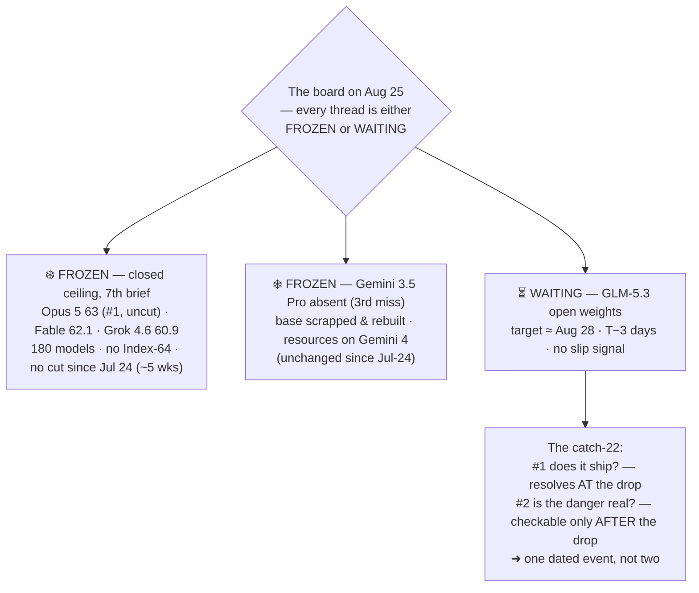

# LLM Updates — 2026-Aug-25

Tuesday brief, written Tue Aug 25 (Los Angeles time). This is the **quietest window the series
has had.** Since the Aug-24 brief: **no model shipped, no price moved, and the Artificial Analysis
Intelligence Index top is unchanged** — Opus 5 **63**, Fable 5 **62.1**, Grok 4.6 **60.9**, a **7th
straight frozen brief**. The one thing worth a report is not a new event but an *imminent* one: the
single live thread on the board, **GLM-5.3's held open weights**, is now **three days from its
≈ Aug 28 deadline** — and looking at it up close surfaces a genuine catch-22 that the earlier briefs
implied but never named.

**The sharpening this window: the two open GLM-5.3 questions are the same question.** Aug-24 left two
watch-items — *(1) does GLM-5.3 ship weights on/near Aug 28?* and *(2) does anyone independently
replicate its cyber numbers?* They looked like separate threads. They are not. **You cannot
independently verify the cyber claims until the weights are public — and the weights are being held
*because of* those cyber claims.** The safety hold is simultaneously a verification hold. So the drop
itself is both the resolution of #1 and the *first possible moment* to attempt #2; nobody outside
Z.ai can check "tops Mythos 5 on discovery" or "emergent exploit-chaining" until the thing said to be
too dangerous to release is released (§1). As of today the weights are still not on Hugging Face and
there is **no slip signal**, so the Aug-28 target still stands — three days out.

This report advances only what is **new since Aug-24.** It does **not** re-derive the GLM-5.3 cyber
finding (Aug-24 §1), the launch itself (Aug-16 §2), Qwen3.8-27B's independent Index (Aug-18 §1), or
the Gemini 3.5 Pro → Gemini 4 pivot (Jul-24 §1–§2) — those are unchanged and pointed to in §4.

![Diagram of the quiet window of August 25, 2026. A frozen closed-model ceiling band across the top holds Claude Opus 5 at Index 63, Fable 5 at 62.1 and Grok 4.6 at 60.9, unchanged for a seventh brief with no Index-64 model and no flagship price cut since July 24. Below it a countdown timeline runs from August 14, GLM-5.3 launched API-only, through August 25 today marked T minus 3 days with no slip signal, to the August 28 open-weights gate. Beneath the timeline a two-node catch-22 loop: node one, the weights are held for safety over an emergent exploit-chaining capability; node two, the vendor cyber claims cannot be independently verified until the weights are public. An arrow from node one to node two reads the hold blocks the check; an arrow back reads the check needs the release — so the two open watch-items collapse into a single dated event. A footer notes nothing shipped in the window and the whole board waits on one date three days out.](glm53_deadline_and_catch22.svg)

---

## 1. The GLM-5.3 weights gate is three days out — and the safety hold is also a verification hold

Nothing about GLM-5.3 *changed* this window: the weights are still API-only, the ≈ Aug 28 target
still stands, and the newest `zai-org` repo on Hugging Face is still GLM-5 (no GLM-5.3 checkpoint,
license, shard manifest, or hashes have appeared)
([MindStudio](https://www.mindstudio.ai/blog/glm-5-3-open-weights-release-timing),
[modemguides](https://www.modemguides.com/blogs/ai-news/glm-5-3-open-weights-security-findings)).
What is worth stating plainly, now that the deadline is close, is the **structure** of the two open
questions — because they turn out to be one.

**The catch-22.** Z.ai is holding the weights ~2 weeks for safety hardening on the grounds that
post-training on the GLM-5 base produced an **emergent offensive-cyber capability** — the exploit-
chaining behavior and the CyberGym-84.5 discovery lead detailed in the Aug-24 brief. But **every one
of those cyber figures is Z.ai's own, and the normal mechanism that would confirm them requires the
weights.** As one benchmark write-up puts it, the scores "cannot be reproduced by the exact mechanism
that would normally confirm them … the weights are not out, which means the benchmarks cannot yet be
checked by anyone outside Z.ai"
([emergent.sh](https://emergent.sh/learn/glm-5-3-benchmarks),
[D-Central](https://d-central.tech/glm-5-3-cybersecurity-benchmarks/)). So:

- **Watch-item #1 — "does it ship?"** resolves only *at* the drop.
- **Watch-item #2 — "is the danger real?"** can *begin* only *after* the drop.

They are the **same dated event**, and it runs in a loop: the hold blocks the check, and the check
needs the release. The uncomfortable implication is that the public has to take the safety
justification **on faith right up until the moment the safety justification is (or isn't) acted on** —
you find out whether the model was too dangerous to release by releasing it. This is the concrete
edge of the "open on a safety timer" pattern the series has tracked since Aug-16, and it is why the
Aug-28 outcome matters beyond a calendar tick.

**Three outcomes, three meanings — unchanged from Aug-24 but now three days out, not four:**

| Aug-28 outcome | What it would mean |
|---|---|
| **(a) Full weights, on time** | The hold was a genuine-but-brief hardening pause; independent CyberGym/ExploitBench runs and an Artificial Analysis Index become possible within days. |
| **(b) Hardened / capability-restricted checkpoint** | A **first for an open release** — weights shipped *minus* the exploit-chaining behavior; verifies the concern was real, but means the released model ≠ the evaluated one, so the vendor cyber numbers stay unverifiable. |
| **(c) A slip** | The safety framing starts to read like the Qwen3.8-Max open drop that slipped twice; raises the question of whether "held for safety" is partly "not ready." |

There is **no signal yet** distinguishing these — as of Aug 25 the repo is simply empty and the timer
still points at Aug 28. That resolution is the next brief's job.

## 2. What did *not* move — the ceiling, Gemini, Sol, and the ship log

- **The closed ceiling — frozen a 7th straight brief.** The [Artificial Analysis Intelligence
  Index](https://artificialanalysis.ai/evaluations/artificial-analysis-intelligence-index) top is
  identical to Aug-24: **Opus 5 63 (#1, uncut, $5/$25)**, **Fable 5 62.1**, **Grok 4.6 60.9**, across
  **180 tested models** ([BenchLM](https://benchlm.ai/benchmarks/artificialanalysis), verified through
  Aug 24–25). **No Index-64 model. No flagship price cut since Jul 24** — now ~5 weeks. Seventh brief
  running, the answer to "does anyone answer at the frontier?" is still **no.**
- **Gemini 3.5 Pro — still absent, and the reason is unchanged, not new.** No ship or date as of
  Aug 24. The cause has been on the board since Jul-24: DeepMind found structural failures (recursive
  tool-calling, SVG generation), **scrapped the base model and restarted pretraining**, and has openly
  **redirected resources to Gemini 4** ("most ambitious pre-training run yet," begun Jul 21, late-2026
  target) ([The AI Rankings](https://theairankings.com/google/gemini-3-5-pro/),
  [Medium/AI Engineering Simplified](https://medium.com/ai-engineering-simplified/gemini-3-5-pro-release-date-2026-why-google-delayed-it-3-times-and-started-training-gemini-4-427f55207e5b)).
  Nothing about that moved this window — it remains the single most overdue frontier event, now on its
  **third missed target**, with the live Pro model still `gemini-3.1-pro-preview`.
- **Sol Ultrafast — still a preview.** OpenAI's Cerebras-powered ~750 tok/s serving tier is still
  waitlist-only: no price, no GA date, no model ID. A *serving tier, not a new model*
  ([explainX](https://explainx.ai/blog/openai-gpt-5-6-sol-ultrafast-cerebras-august-2026)).
- **The ship log is empty for the window.** No model released Aug 19–25; the most recent remains
  **GLM-5.2 Turbo** (Z.ai, Aug 17), a latency/cost serving variant already logged in the Aug-24 brief
  ([LLM Gateway timeline](https://llmgateway.io/timeline)).

## 3. Reading it: a genuine pause, and one decision that unfreezes it

Seven weeks in, the map has reached a real standstill. The **top has not moved in seven briefs**
(same three names, same prices, same #1), and the one lab that could break the freeze has said out
loud that it is spending its effort a *generation* ahead — Gemini 3.5 Pro is a rebuild, and the frontier
answer Google is actually building is Gemini 4, months out. That is why this window produced no
event: the frontier labs have nothing to ship *this* week, and the sub-ceiling ecosystem's most
interesting release is sitting behind a self-imposed safety gate. **Almost the entire board is
waiting on a single decision three days away.** GLM-5.3's Aug-28 outcome is the one thing that can
turn a frozen map back into a moving one — not because it would touch the ceiling (it won't; its
cyber lead is discovery-only and its general Index is still unmeasured), but because it is the first
real test of whether "we held it because it was dangerous" survives contact with the release. A quiet
week, then, but a loaded one.

## 4. Unchanged since Aug-24 (not re-derived here)

- **GLM-5.3 cyber finding** — CyberGym 84.5 (tops Mythos 5 on *discovery*), ExploitBench 54.4 (still
  trails), 2,436 vulns / 1,097 critical, Cursor bug, emergent exploit-chaining — all vendor-claimed —
  Aug-24 §1. *This brief adds only the verification catch-22 and the T−3 countdown (§1).*
- **GLM-5.3 launch** (Z.ai, Aug 14): 744B MoE / ~40B active / 200K ctx, post-train-only on GLM-5,
  API-only via $18/mo GLM Coding Plan — Aug-16 §2.
- **Qwen3.8-27B** independently measured — Index 52, Agentic 51 (beats Terra + Opus 4.8), verbose
  ($591.30 eval cost) — Aug-18 §1, Aug-24 §2.
- **Gemini 3.5 Pro → Gemini 4 pivot** — base scrapped/rebuilt; Gemini 4 pretraining begun Jul 21,
  late-2026 target — Jul-24 §1–§2.
- **Sol Ultrafast** (Aug 13): Cerebras, ~750 tok/s, preview/waitlist, no price — Aug-16 §3.
- **GLM-5.2 Turbo** (Aug 17): latency/cost serving variant of June's GLM-5.2 — Aug-24 §2.
- **Grok 4.6** (SpaceXAI, Aug 6): Index 60.9, ceiling band, $2/$6, post-train-only — Aug-14 §1.
- **Qwen3.8-Max** open weights (Aug 12–13): degraded/gated, measured Index 56 — Aug-14 §2.
- **Muse Glimmer 30B** (Meta, Aug 10): open, on-device, distilled-from-Spark agentic + DFlash — Aug-11.
- **DeepSeek V4-Flash-0731** 50/$0.28 MIT Pareto floor — Aug-03 §1.
- **Kimi K3** open weights (Moonshot, Jul-26): 2.8T MoE, Modified-MIT, hardware-gated to serve — Jul-30.
- **Opus 5** "top quality at mid price" (Jul-24): effort dial + paid fast mode — Jul-25.
- **Sonnet 5** $2/$10 intro pricing through Aug 31; **Kill Switch / Pacing** policy axis quiet.

## Watch-items into the next brief

1. **The Aug-28 outcome — the single most consequential item on the board.** Does GLM-5.3 ship full
   weights, a hardened/restricted checkpoint, or slip? (§1's three-outcome table.) Whatever lands,
   the *same* event is also the first chance to begin watch-item #2.
2. **Independent replication of GLM-5.3's cyber numbers** — structurally impossible until #1 resolves.
   Once weights are public, watch for an outside CyberGym/ExploitBench run and an Artificial Analysis
   Index (GLM-5.3 has *no* general-Index score yet, only vendor cyber figures).
3. **The frozen ceiling — 7th brief, no Index-64, no cut since Jul 24 (~5 weeks).** Gemini 3.5 Pro's
   third missed target keeps it the most overdue frontier event; Google's own answer is Gemini 4,
   months out. Any top-tier ship or credible date would be the first frontier move in over a month.
4. **Sol Ultrafast** GA + pricing — preview or product.

---

### Method & caveats

- **Compiled** Tue Aug 25 2026 (Los Angeles time). Advances only items **new since the Aug-24 brief**;
  unchanged threads are listed in §4 with pointers, not re-derived. This was a deliberately short brief
  because the window was quiet — no manufactured novelty.
- **Scraping resilience.** Direct fetch is **broadly egress-blocked** from this environment (e.g.
  `collectivebrain.de` returned EGRESS_BLOCKED on direct fetch); all figures were taken from the
  **search index** and **corroborated across multiple independent outlets**. No quantitative claim
  here rests on a single source.
- **What is measured vs claimed.** The **ceiling** numbers (Opus 5 63 / Fable 62.1 / Grok 4.6 60.9,
  180 models) are third-party (Artificial Analysis / BenchLM). **All of GLM-5.3's cyber figures** are
  **Z.ai's own** with **no independent replication** — and, as §1 argues, cannot have any until the
  weights ship. The **weights-hold itself** (still not on Hugging Face as of Aug 25; target ≈ Aug 28)
  is verifiable. The Gemini base-rebuild / Gemini 4 items are prior-reported (Jul-24) and unchanged.
- **Diagrams** are a standalone theme-neutral SVG (slate/amber/sky/rose strokes that read on light and
  dark backgrounds, no external URLs) and an inline Mermaid flowchart; both render in GitHub-flavored
  markdown.

### Sources

- **GLM-5.3 weights status & verification catch-22** — [MindStudio "when will GLM-5.3 open weights be released"](https://www.mindstudio.ai/blog/glm-5-3-open-weights-release-timing) · [modemguides "release date, license, bug ledger"](https://www.modemguides.com/blogs/ai-news/glm-5-3-open-weights-security-findings) · [emergent.sh "what the numbers show & what they don't"](https://emergent.sh/learn/glm-5-3-benchmarks) · [D-Central "what the 84.5 score hides"](https://d-central.tech/glm-5-3-cybersecurity-benchmarks/) · [MLQ "Z.ai delays GLM-5.3 weights after cybersecurity tests"](https://mlq.ai/news/zai-delays-glm-53-weights-after-cybersecurity-tests-show-strong-exploit-capability/)
- **Ceiling & leaderboard** — [Artificial Analysis Intelligence Index](https://artificialanalysis.ai/evaluations/artificial-analysis-intelligence-index) · [BenchLM leaderboard (Opus 5 63, 180 models)](https://benchlm.ai/benchmarks/artificialanalysis)
- **Gemini 3.5 Pro absence / Gemini 4 pivot (prior-reported, unchanged)** — [The AI Rankings "three delays and still unreleased"](https://theairankings.com/google/gemini-3-5-pro/) · [Medium/AI Engineering Simplified "why Google delayed it 3 times and started Gemini 4"](https://medium.com/ai-engineering-simplified/gemini-3-5-pro-release-date-2026-why-google-delayed-it-3-times-and-started-training-gemini-4-427f55207e5b) · [Codersera "why it's delayed (Aug 2026)"](https://codersera.com/blog/gemini-3-5-pro-launch-guide-2026/)
- **Sol Ultrafast / ship log** — [explainX: Sol Ultrafast 750 tok/s, no price](https://explainx.ai/blog/openai-gpt-5-6-sol-ultrafast-cerebras-august-2026) · [LLM Gateway timeline](https://llmgateway.io/timeline)
