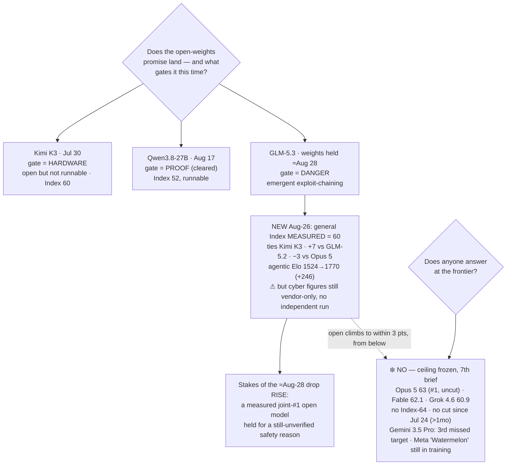

# LLM Updates — 2026-Aug-26

Wednesday brief, written Wed Aug 26 (Los Angeles time). For six-and-a-half weeks the series has tracked
two frozen questions. **Does anyone answer at the frontier?** — no Index-64 model and no flagship price
cut since Claude Opus 5 took #1 on Jul 24. And **does the open-weights promise land?** — which has run
through three gates: Kimi K3 was *open but not runnable* (hardware, Jul-30), Qwen3.8-27B was *runnable
but unproven* until Aug-17 cleared it, and GLM-5.3 is *held because it's dangerous* — its weights kept
back on a safety timer (≈ Aug 28) after Z.ai's own evaluation surfaced emergent offensive-cyber
capability (Aug-24 §1).

**This window resolves the half of GLM-5.3 that was still a vendor claim — and the number is big.**
The Aug-24 brief's second watch-item asked for an *independent* read on GLM-5.3, whose every published
figure to that point was Z.ai's own. Artificial Analysis has now posted one: **GLM-5.3 scores 60 on the
Intelligence Index** ([Artificial Analysis on
X](https://x.com/ArtificialAnlys/status/2089830890709135426);
[Unite.AI](https://www.unite.ai/glm-5-3-scores-60-on-artificial-analysis-intelligence-index-matching-kimi-k3/)).
That is **up 7 points from GLM-5.2 (53) on post-training alone**, it **ties Kimi K3 (60)** for the top
of the open-weights table, and it sits **just 3 points behind Opus 5 (63)** — inside 1 point of Grok
4.6 (60.9), the bottom of the closed ceiling. An open model (once its weights ship) has been *measured*
to within three points of the closed frontier. The catch is precise and matters: the **60 is the
general Index and is now third-party**; the **cyber numbers that caused the weights-hold are still
Z.ai's own**, with no independent run (§1). So watch-item #2 resolves — but only halfway.

**Meanwhile the closed ceiling stays frozen for a 7th straight brief.** Opus 5 still #1 at Index
**63**, uncut ($5/$25); Fable 5 **62.1**; Grok 4.6 **60.9**; **no Index-64 model and no flagship price
cut since Jul 24** (now over a month); and **Gemini 3.5 Pro is still off the board**, its third missed
target unmoved as of Aug 25 (§2). Every substantive move this window was, once again, **below** the
ceiling — the gap is compressing entirely from below, and this window it got *measured*.

This report advances only what is **new since Aug-24.** It does **not** re-derive GLM-5.3's cyber
finding and weights-hold cause (Aug-24 §1), the GLM-5.3 launch itself (Aug-16 §2), Qwen3.8-27B's Index
(Aug-18 §1), or Grok 4.6's ceiling-band entry (Aug-14 §1) — those are unchanged and pointed to in §4.

![Horizontal bar chart of the Artificial Analysis Intelligence Index in a zoomed 42-to-63 range. A shaded amber band across the top three bars marks the closed ceiling, frozen for a seventh straight brief: Claude Opus 5 at 63 (number one, uncut), Claude Fable 5 at 62.1, and Grok 4.6 at 60.9. Just below the band, highlighted in sky blue, is GLM-5.3 newly measured at 60, up seven points from GLM-5.2, tagged as weights still held and not yet on Hugging Face with a target of about August 28. Tied with it at 60 is Kimi K3, the previous top open model; a bracket labels the pair the joint top open-weights models at 60, now only three points behind Opus 5. Below them, faded, are Qwen3.8-Max at 56, GLM-5.2 at 53, and DeepSeek V4 Pro at 44, showing the ground GLM-5.3 covered on post-training alone. A footer notes the standout is agentic: GLM-5.3's GDPval-AA v2 Elo rose from 1524 to 1770, a 246-point jump placing it among frontier models, at the cost of more verbosity at about 18,700 output tokens per task; the general Index is now third-party measured, while the cyber-security figures remain vendor-claimed with no independent replication.](glm53_measured_60_ties_kimi_under_frozen_ceiling.svg)

---

## 1. GLM-5.3 gets its independent number — Index 60, joint top open-weights, 3 points off #1

Aug-24 closed with the honest caveat that *everything* Z.ai had published about GLM-5.3 — the 84.5
CyberGym score, the 2,436-vulnerability count, the "emergent exploit-chaining" — was the lab's own,
with no outside replication, and that the model had **no independent general Index at all**. That second
gap is now filled. Artificial Analysis ran GLM-5.3 on the same infrastructure and methodology it uses
across providers, and scored it **60 on the Intelligence Index** ([AA on
X](https://x.com/ArtificialAnlys/status/2089830890709135426);
[Unite.AI](https://www.unite.ai/glm-5-3-scores-60-on-artificial-analysis-intelligence-index-matching-kimi-k3/)).

**Where 60 puts it.** The number is the whole story, so place it precisely against the standing board:

| Model | Index | Class | Read |
|---|---|---|---|
| Claude Opus 5 | **63** | closed, #1 (uncut $5/$25) | frozen ceiling, 7th brief |
| Claude Fable 5 | **62.1** | closed | ceiling |
| Grok 4.6 | **60.9** | closed | ceiling, cheap end |
| **GLM-5.3** | **60** | **open** (weights held ≈Aug 28) | **ties for top open, −3 vs #1** |
| Kimi K3 | **60** | open (shipped, hardware-gated) | previous top open |
| Qwen3.8-Max | 56 | open (gated) | — |
| GLM-5.2 (prev.) | 53 | open | GLM-5.3's own base line |
| DeepSeek V4 Pro | 44 | open | — |

Three things fall out of the row. **First, the jump is +7 over GLM-5.2 (53) with no new pretraining** —
GLM-5.3 is a post-training-only upgrade of the same GLM-5 base (≈744B MoE, ~40B active, 200K context),
so seven Index points came from harder agent environments and stronger verification alone. **Second, it
is a *tie for the lead*, not a solo lead**: GLM-5.3 and Kimi K3 both land at 60, so the top of the
open-weights table is now a two-model dead heat, and officechai frames the broader picture as **three
Chinese labs now sitting right behind the US frontier** ([officechai](https://officechai.com/ai/glm-5-3-scores-60-on-aa-intelligence-index-three-chinese-labs-now-right-behind-us-frontier/)).
**Third, the distance to the ceiling is now a single-digit number that is mostly *below one point*** —
GLM-5.3 is 0.9 behind Grok 4.6 and 3 behind Opus 5. The near-frontier band has effectively merged with
the ceiling's lower edge.

**The standout axis is agentic, and it is where the gain is largest.** AA's breakdown shows GLM-5.3's
biggest move is in agentic capability: its **GDPval-AA v2 Elo rose from 1524 to 1770 — a 246-point
jump** — which AA places "amongst frontier models"
([Unite.AI](https://www.unite.ai/glm-5-3-scores-60-on-artificial-analysis-intelligence-index-matching-kimi-k3/)).
That is consistent with the whole GLM-5.3 thesis (Aug-16): a coding/agent-focused post-train, not a
general-knowledge one.

**The cost is verbosity — the summer's recurring open-model tax.** GLM-5.3 is *less* token-efficient
than its predecessor: **~18,700 output tokens per task**, up ~20% from GLM-5.2 (15,700) and ~27% more
than Kimi K3 (14,700). It is faster to *serve* (GLM-5.3 max ~90 tok/s vs Kimi K3 max ~35 tok/s), but
the same "cheap per token, talkative per task" pattern that dogged Qwen3.8-27B (Aug-18/Aug-24) shows up
again: the headline 60 is bought with more tokens than the model it ties.

**What is now measured vs still claimed — the line moved, but only halfway.** After this window:

- **Measured (third-party, AA):** the **general Intelligence Index 60**, the agentic Elo, token
  efficiency, and serving speed.
- **Still vendor-claimed (Z.ai only, no independent run):** *all* the cyber figures — CyberGym 84.5,
  ExploitBench 54.4, ExploitGym 105/130, the 2,436-vulnerability / 1,097-critical count, and the
  "emergent exploit-chaining" characterization that is the stated reason for the weights-hold
  ([explainx summary](https://explainx.ai/blog/glm-5-3-cybergym-84-5-independent-validation-august-2026);
  [D-Central](https://d-central.tech/glm-5-3-cybersecurity-benchmarks/)). Reporting notes the CyberGym
  margin over Mythos 5 (0.7 pt) is well inside the noise a different harness could produce, so it needs
  an outside run to stand.

So the sharper framing of GLM-5.3 after Aug-26 is: **a *measured* joint-#1 open model, held back for a
*claimed* safety reason.** The general capability is real and outside-verified; the danger that stopped
the release is not yet. That raises the stakes of the ≈Aug-28 decision rather than settling them — this
is not a marginal model being paused, it is a model AA ranks level with the best open weights and within
three points of the closed #1.

**Weights status, unchanged:** still **not on Hugging Face** as of Aug 26 — the newest `zai-org` repo
remains GLM-5.2 — with the ~2-week safety timer still pointing at **≈ Aug 28, now two days out**
([evolink "what shipped and what's still staged"](https://evolink.ai/blog/glm-5-3-release);
[apidog "self-hosting GLM-5.3: get ready for the drop"](https://apidog.com/blog/self-host-glm-5-3-open-weights/)).
AA's own note is explicit that the ranking is provisional on the drop: *"once the weights are released
it will be tied as the leading open-weights model."*

## 2. What did *not* move — the ceiling, Gemini, and a Meta rumor named Watermelon

- **The closed ceiling — frozen a 7th straight brief.** The [Artificial Analysis Intelligence
  Index](https://artificialanalysis.ai/evaluations/artificial-analysis-intelligence-index) top is
  unchanged: **Opus 5 63 (#1, uncut, $5/$25)**, **Fable 5 62.1**, **Grok 4.6 60.9** — reflected in the
  daily trackers through Aug 25 ([BenchLM](https://benchlm.ai/benchmarks/artificialanalysis);
  [collectivebrain daily leaderboard, Aug 25](https://collectivebrain.de/en/ai-leaderboard/)). **No
  Index-64 model. No flagship price cut since Jul 24** (over a month). Seventh brief running, the answer
  to "does anyone answer at the frontier?" is **no** — and now the interesting fact is that the thing
  climbing toward that frozen line is an open model, not a closed one.
- **Gemini 3.5 Pro — still absent, still three missed targets.** No ship or date as of Aug 25; still no
  `gemini-3.5-pro` entry in the API (newest Pro-tier is `gemini-3.1-pro-preview`), still "testing with
  partners," still >3 months past the May-19 I/O announcement
  ([The AI Rankings](https://theairankings.com/google/gemini-3-5-pro/);
  [Codersera](https://codersera.com/blog/gemini-3-5-pro-launch-guide-2026/)). It remains the single most
  overdue frontier event on the board.
- **New, but not a release — Meta's "Watermelon."** Trackers logged **Watermelon** on Aug 25 — the
  internal codename for **Meta Superintelligence Labs' next flagship**, successor to April's Muse Spark
  (codename "Avocado"). It is **still in training, unreleased, with no published benchmark**; Meta's AI
  chief has only *claimed* it reaches ~GPT-5.5 on internal numbers
  ([Vasundhara "Meta's Watermelon explained"](https://www.vasundhara.io/blogs/meta-watermelon-ai-model-explained);
  [LLM Gateway timeline](https://llmgateway.io/timeline)). Worth logging as the next thing to watch, not
  as a move — a codename and a claim, no card, no score, no date.
- **Minor releases in the window.** IBM's **Granite 4.2** shipped Aug 25 (enterprise/small-model tier,
  not a frontier entry), alongside other small trackers-only updates
  ([LLM Gateway timeline](https://llmgateway.io/timeline)). Nothing in the Aug 24–26 window landed near
  the ceiling.

## 3. Reading the two together

The shape sharpens rather than changes. The **top of the map has not moved in seven briefs** — same
three names, same prices, same #1, and the one lab that could break the freeze (Google) is three targets
late while Meta's answer (Watermelon) is still a codename in training. What *did* change this window is
the character of the motion below the line: for the first time the open frontier isn't just *claimed* to
be near the ceiling, it has been **independently measured** there. GLM-5.3 at 60 — third-party, tying
Kimi K3, three points behind Opus 5 — turns "the gap is closing from below" from a narrative into a
number. And it does so on **post-training alone**, +7 over its own base, which is the efficiency story
underneath the ranking: the open labs are extracting frontier-adjacent gains without new pretraining
runs. The irony holds from Aug-24: the single model that closed the measured gap to three points is also
the one being **withheld** — so the same release is simultaneously the best evidence that open weights
have reached the frontier's doorstep *and* the first case of an open model held at that doorstep for
safety. The ≈Aug-28 decision now governs the release of a measured joint-#1 open model, and its cyber
justification is still the one major figure no outside party has checked.

## 4. Unchanged since Aug-24 (not re-derived here)

- **GLM-5.3 cyber finding & weights-hold cause** (Z.ai, Aug 14 eval): CyberGym 84.5 (tops Mythos 5 on
  discovery), ExploitBench 54.4 (trails frontier), emergent exploit-chaining, 2,436 vulns / 1,097
  critical, reported Cursor bug — **all still vendor-claimed, no independent run** — Aug-24 §1. *This
  brief adds the independent general Index 60 (§1), which does not cover the cyber numbers.*
- **GLM-5.3 launch** (Z.ai, Aug 14): 744B MoE / ~40B active / 200K ctx, post-train-only on GLM-5,
  API-only via $18/mo GLM Coding Plan — Aug-16 §2.
- **Qwen3.8-27B** independently measured — Index 52, Agentic Index 51 (beats Terra + Opus 4.8), verbose
  (160M Index tokens, $591.30 eval cost) — Aug-18 §1 / Aug-24 §2.
- **Sol Ultrafast** (Aug 13): Cerebras, ~750 tok/s, preview/waitlist, no price/GA — Aug-16 §3.
- **GLM-5.2 Turbo** (Z.ai, Aug 17): latency/cost serving variant of June GLM-5.2, not a new tier —
  Aug-24 §2.
- **Grok 4.6** (SpaceXAI, Aug 6): Index 60.9, ceiling band, cheap end $2/$6, post-train-only — Aug-14 §1.
- **Qwen3.8-Max** open weights (Aug 12–13): degraded/gated; measured Index **56** — Aug-14 §2.
- **v4.1.1 grader recalibration** (Aug 6): top's absolute numbers rose ~+2 from the ruler, not the
  models — Aug-14.
- **Muse Glimmer 30B** (Meta, Aug 10): open, on-device, distilled-from-Spark agentic + DFlash — Aug-11.
- **DeepSeek V4-Flash-0731** 50/$0.28 MIT Pareto floor — Aug-03 §1.
- **Kimi K3** open weights (Moonshot, Jul-26): 2.8T MoE, Modified-MIT, hardware-gated to serve, Index 60
  — Jul-30.
- **Opus 5** "top quality at mid price" (Jul-24): effort dial + paid fast mode — Jul-25.
- **Sonnet 5** $2/$10 intro pricing through Aug 31; **Kill Switch / Pacing** policy axis quiet.

## Watch-items into the next brief

1. **Does GLM-5.3 actually ship weights on/near Aug 28 — and in what form?** Two days out at compile
   time, and the stakes are now higher: this is a *measured* joint-#1 open model, not a marginal one.
   Three outcomes to distinguish: (a) full weights on time — an open model lands 3 points off the closed
   #1; (b) a **capability-restricted / hardened** checkpoint (weights minus the exploit-chaining — a
   first for an open release); or (c) a **slip**, the way Qwen3.8-Max's open drop slipped twice.
2. **Independent replication of GLM-5.3's *cyber* numbers — still zero.** The general Index is now
   third-party (§1), but CyberGym 84.5 / ExploitBench 54.4 / the 2,436-vulnerability claim remain
   unverified. This is the one major figure no outside party has checked, and it's the stated reason for
   the hold. An outside CyberGym/ExploitBench run is the missing piece.
3. **The frozen ceiling — 7th brief, no Index-64, no flagship cut since Jul 24.** Gemini 3.5 Pro's third
   missed target makes it the most overdue frontier event; a ship or a credible date would be the first
   top-tier move in over a month.
4. **Meta "Watermelon."** New this window as a codename + claim. Watch for a first published benchmark
   or a card — whether Meta's next flagship is a real ceiling challenger or another sub-frontier entry.

---

### Method & caveats

- **Compiled** Wed Aug 26 2026 (Los Angeles time). Advances only items **new since the Aug-24 brief**;
  unchanged threads are listed in §4 with pointers, not re-derived.
- **Scraping resilience.** Direct fetch is **broadly egress-blocked** from this environment (explainx,
  officechai and others returned egress errors on direct fetch this run); all figures were taken from
  the **search index** and **corroborated across multiple independent outlets**. No quantitative claim
  here rests on a single source.
- **What is measured vs claimed.** GLM-5.3's **general Intelligence Index 60**, its agentic Elo
  (1524→1770), token efficiency (~18.7k/task) and serving speed are **third-party (Artificial
  Analysis)**, corroborated by AA's own post, Unite.AI and officechai. GLM-5.3's **cyber figures**
  (CyberGym 84.5, ExploitBench 54.4, ExploitGym 105/130, 2,436 vulnerabilities, "emergent
  exploit-chaining") remain **Z.ai's own with no independent replication** — treat as vendor framing.
  The **weights-hold itself** (still not on Hugging Face as of Aug 26; target ≈ Aug 28) is verifiable.
  **Meta "Watermelon"** is a **codename + vendor claim**, unreleased, with no published benchmark.
- **Diagrams** are a standalone theme-neutral SVG (slate/amber/sky/teal strokes that read on light and
  dark backgrounds, no external URLs) and an inline Mermaid flowchart; both render in GitHub-flavored
  markdown.

### Sources

- **GLM-5.3 independent Index 60** — [Artificial Analysis on X "GLM-5.3 achieves 60 … on par with Kimi K3, up 7 from GLM-5.2"](https://x.com/ArtificialAnlys/status/2089830890709135426) · [Unite.AI "GLM-5.3 scores 60, matching Kimi K3"](https://www.unite.ai/glm-5-3-scores-60-on-artificial-analysis-intelligence-index-matching-kimi-k3/) · [officechai "GLM-5.3 scores 60 … three Chinese labs now right behind US frontier"](https://officechai.com/ai/glm-5-3-scores-60-on-aa-intelligence-index-three-chinese-labs-now-right-behind-us-frontier/) · [Artificial Analysis GLM-5.3 vs Kimi K3 comparison](https://artificialanalysis.ai/models/comparisons/glm-5-3-vs-kimi-k3)
- **GLM-5.3 cyber figures still unreplicated** — [explainX "CyberGym 84.5%: independent validation status"](https://explainx.ai/blog/glm-5-3-cybergym-84-5-independent-validation-august-2026) · [D-Central "what the 84.5 score hides"](https://d-central.tech/glm-5-3-cybersecurity-benchmarks/)
- **GLM-5.3 weights still held** — [evolink "what shipped and what's still staged"](https://evolink.ai/blog/glm-5-3-release) · [apidog "self-hosting GLM-5.3: get ready for the drop"](https://apidog.com/blog/self-host-glm-5-3-open-weights/)
- **Ceiling & leaderboard** — [Artificial Analysis Intelligence Index](https://artificialanalysis.ai/evaluations/artificial-analysis-intelligence-index) · [BenchLM leaderboard (Opus 5 63)](https://benchlm.ai/benchmarks/artificialanalysis) · [collectivebrain daily leaderboard (Aug 25)](https://collectivebrain.de/en/ai-leaderboard/)
- **Gemini 3.5 Pro delay** — [The AI Rankings "three delays and still unreleased"](https://theairankings.com/google/gemini-3-5-pro/) · [Codersera "why it's delayed (Aug 2026)"](https://codersera.com/blog/gemini-3-5-pro-launch-guide-2026/)
- **Meta "Watermelon" & minor releases** — [Vasundhara "Meta's Watermelon AI model explained"](https://www.vasundhara.io/blogs/meta-watermelon-ai-model-explained) · [LLM Gateway August 2026 timeline](https://llmgateway.io/timeline)
