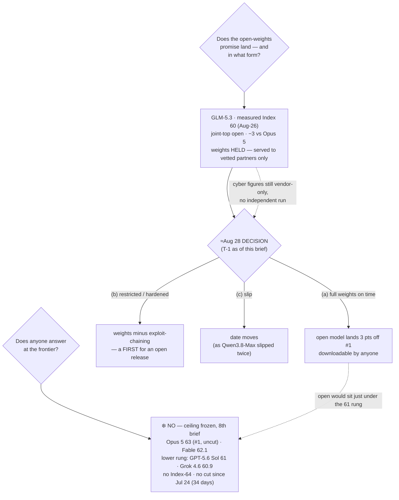

# LLM Updates — 2026-Aug-27

Thursday brief, written Thu Aug 27 (Los Angeles time). For nearly seven weeks the series has tracked
two frozen questions. **Does anyone answer at the frontier?** — no Index-64 model and no flagship price
cut since Claude Opus 5 took #1 on Jul 24. And **does the open-weights promise land?** — which has run
through three gates: Kimi K3 was *open but not runnable* (hardware, Jul-30), Qwen3.8-27B was *runnable
but unproven* until Aug-17 cleared it, and GLM-5.3 is *held because it's dangerous* — weights kept back
on a safety timer (≈ Aug 28) after Z.ai's own evaluation surfaced emergent offensive-cyber capability
(Aug-24 §1).

**This is the eve-of-decision brief: everything is now staged, and nothing new moved.** The Aug-24
window asked for an independent number on GLM-5.3; Aug-26 delivered it (general Index **60**, third-party,
joint-top open weights). What was still outstanding after that was the event the whole two-week clock was
counting toward — **the weights decision itself**. As of today that clock reads **T-1**: the ~2-week
hold ends **≈ Aug 28**, and **GLM-5.3's weights are still not on Hugging Face** — the `zai-org/GLM-5.3`
repo exists only as an *"upcoming release"* placeholder, and during the hold access remains limited to
**vetted security partners** via the GLM Coding Plan / ZCode agent, with Z.ai's stated plan to make the
model *"downloadable to anyone"* after the review closes ([betanews](https://betanews.com/article/zai-glm-5-3-cybersecurity-delay/);
[apidog "get ready for the drop"](https://apidog.com/blog/self-host-glm-5-3-open-weights/); [Distk "the
open model that shipped without its weights"](https://distk.in/blog/glm-5-3-zai-open-weights-delay-2026.html)).
So the single most consequential item on the board resolves — or slips — **tomorrow**.

**Meanwhile the closed ceiling stays frozen for an 8th straight brief.** Opus 5 still #1 at Index **63**
(63.1 on the live tracker), uncut ($5/$25); Fable 5 **62.1**; and the band's lower rung is now cleanly a
**GPT-5.6 Sol (max) 61 / Grok 4.6 60.9** pair — AA's top-5 shows GPT-5.6 Sol (max) at **61**, level with
Grok 4.6 ([AA GPT-5.6 Sol card](https://artificialanalysis.ai/models/gpt-5-6-sol);
[BenchLM leaderboard](https://benchlm.ai/benchmarks/artificialanalysis)). **No Index-64 model. No flagship
price cut since Jul 24 — now 34 days.** GLM-5.3's measured 60 (Aug-26) sits just under that lower rung,
still knocking.

This report advances only what is **new since Aug-26.** It does **not** re-derive GLM-5.3's independent
Index 60 (Aug-26 §1), its cyber finding and weights-hold cause (Aug-24 §1), the GLM-5.3 launch itself
(Aug-16 §2), Qwen3.8-27B's Index (Aug-18 §1), or Grok 4.6's ceiling-band entry (Aug-14 §1) — those are
unchanged and pointed to in §4.

![Horizontal timeline of the GLM-5.3 two-week open-weights clock, headlined "T-1 to the GLM-5.3 open-weights decision — everything staged, ceiling frozen an 8th brief." Aug 14: launched API-only, weights held for a safety review. Aug 24: Z.ai's offensive-cyber finding surfaces, CyberGym 84.5 vendor-claimed, no independent number yet. Aug 26: Artificial Analysis measures the general Index at 60, tying Kimi K3 as joint-top open weights, three points under Opus 5, third-party. Today, Aug 27, is marked T-minus-1 and highlighted in sky blue: weights still not on Hugging Face, the zai-org GLM-5.3 repo is only an upcoming-release placeholder, and during the hold access is limited to vetted security partners. Aug 28 is the decision point, branching three ways: (a) full weights on time, an open model lands three points off the closed number one; (b) a capability-restricted or hardened checkpoint, which would be a first for an open release; or (c) a slip, the way Qwen3.8-Max's open drop slipped twice. A footer strip shows the frozen closed ceiling — Opus 5 at 63 and number one, Fable 5 at 62.1, then a lower rung of GPT-5.6 Sol at 61 tying Grok 4.6 at 60.9 — with GLM-5.3's measured 60 knocking just below it, and notes no Index-64 model and no flagship price cut since July 24, now 34 days, across an eighth straight brief.](glm53_t_minus_1_weights_decision_ceiling_frozen_8th.svg)

---

## 1. GLM-5.3 weights — T-1, and still held

The entire GLM-5.3 arc has been building to one binary event, and this brief lands on its eve. Recall
the shape: launched Aug 14 **API-only**, with Z.ai promising open weights ~2 weeks later after "its most
extensive risk review to date," because post-training pushed offensive-cyber capability up faster than
expected (Aug-16 §2, Aug-24 §1). Aug-26 filled the one gap that made the model hard to place — the
**independent general Index, measured at 60** (Aug-26 §1). So as of tomorrow, the two things that were
missing at launch — an outside number, and the weights — are down to just the second.

**Status, as of Aug 27 (new this window):**

- **Weights are still not on Hugging Face.** The newest `zai-org` repo remains GLM-5.2; the
  `zai-org/GLM-5.3` page is an **"upcoming release" placeholder** with a waiting/following count, not a
  live weights drop ([apidog](https://apidog.com/blog/self-host-glm-5-3-open-weights/); [modemguides
  "release date, license, bug ledger"](https://www.modemguides.com/blogs/ai-news/glm-5-3-open-weights-security-findings)).
  The expected day-one form is unchanged from prior GLM-5 releases: paired **BF16 + FP8** repos, with
  community GGUF quants lagging days-to-weeks.
- **The clock still points at ≈ Aug 28.** The ~2-week hold from the Aug 14 launch ends tomorrow; Z.ai
  has said it "plans to make the model downloadable to anyone" once the review closes
  ([betanews](https://betanews.com/article/zai-glm-5-3-cybersecurity-delay/); [MLQ
  News](https://mlq.ai/news/zai-delays-glm-53-weights-after-cybersecurity-tests-show-strong-exploit-capability/)).
- **The hold mechanics are now clearer (new detail).** During the hold, access isn't zero — it's
  **restricted to vetted security partners** through the GLM Coding Plan and ZCode agent, i.e. the model
  is being *served under monitoring* while the *downloadable weights* are what's gated
  ([betanews](https://betanews.com/article/zai-glm-5-3-cybersecurity-delay/)). That distinction —
  serve-under-watch now, release-to-all later — is exactly the lever a "hardened checkpoint" outcome
  would pull on.

**Why this is the pivotal event and not a formality.** Aug-26 established what is being held: not a
marginal model, but one AA measures at **Index 60 — joint-top open weights (tied with Kimi K3) and three
points under the closed #1** (Aug-26 §1). So tomorrow's decision governs whether an *independently
measured* frontier-adjacent open model actually reaches the public, and **in what form**. Three outcomes
are worth distinguishing in advance:

| Outcome | What it would mean |
|---|---|
| **(a) Full weights, on time** | An open model lands **3 points off the closed #1**, downloadable by anyone — the open-weights promise lands at its strongest point all summer. |
| **(b) Restricted / hardened checkpoint** | Weights ship but with the exploit-chaining capability trimmed or gated — a **first for an open release**, and a template other labs would study. |
| **(c) Slip** | The date moves, the way Qwen3.8-Max's open drop slipped twice (Aug-14 §2). "≈ Aug 28" is a soft target, not a committed calendar date. |

The one figure that would most change how outcome (b) reads — an **independent** run of GLM-5.3's *cyber*
benchmarks (CyberGym 84.5, ExploitBench 54.4) — is **still zero** (Aug-26 §1, unchanged). The general
Index is third-party; the danger that justifies the hold remains vendor-claimed. That gap is what makes
tomorrow's decision consequential in either direction: if the weights ship in full, the public gets a
model whose *headline capability* is measured but whose *stated risk* never was; if they're held or
hardened, that's a lab acting on a number no outside party has checked.

## 2. What did *not* move — the ceiling, and a sharper read on its lower rung

- **The closed ceiling — frozen an 8th straight brief.** The [Artificial Analysis Intelligence
  Index](https://artificialanalysis.ai/evaluations/artificial-analysis-intelligence-index) top is
  unchanged: **Opus 5 63 (#1, uncut, $5/$25)** — the live tracker reads 63.1 — **Fable 5 62.1**, then
  the lower rung. **No Index-64 model. No flagship price cut since Jul 24** (now **34 days**). Eighth
  brief running, the answer to "does anyone answer at the frontier?" is **no**
  ([BenchLM](https://benchlm.ai/benchmarks/artificialanalysis)).
- **The ceiling band's lower rung, resolved (sharper this window).** Prior briefs listed the band as
  Opus 5 / Fable 5 / Grok 4.6. AA's current top-5 makes the lower rung explicit: **GPT-5.6 Sol (max) at
  61**, level with **Grok 4.6 (60.9)**, both a step under Fable
  ([AA GPT-5.6 Sol card](https://artificialanalysis.ai/models/gpt-5-6-sol)). It's not a new model — GPT-5.6
  has been on the board — but it pins the band's floor at ~61, which is the exact line GLM-5.3's measured
  **60** is knocking on from below. The whole ceiling remains a five-name affair (Opus 5, Fable 5,
  GPT-5.6 Sol, Grok 4.6, Kimi K3) with no one crossing 63.
- **Gemini 3.5 Pro — still absent, still three missed targets.** No ship or date; still no
  `gemini-3.5-pro` in the API, still in limited Vertex AI enterprise preview, still >3 months past the
  May-19 I/O announcement ([The AI Rankings](https://theairankings.com/google/gemini-3-5-pro/);
  [Codersera](https://codersera.com/blog/gemini-3-5-pro-launch-guide-2026/)). Still the single most
  overdue frontier event on the board.
- **Meta "Watermelon" — codename + claim, unchanged.** Still in training, still on the ~GPT-5.5-parity
  internal claim (town-hall, Jul 2), now reported as targeting an **October 2026** release and paired
  with Meta's "Hatch" consumer-agent platform — but **no published benchmark, no card, no independent
  eval** ([Benzinga](https://www.benzinga.com/markets/tech/26/07/60264651/metas-upcoming-watermelon-ai-model-matches-openais-gpt-5-5-on-key-benchmarks-alexandr-wang-reportedly-tells-employees);
  [Forkast "Hatch + Watermelon"](https://forkast.news/metas-hatch-agent-platform-and-watermelon-model-signal-a-consumer-ai-monetization-push/)).
  A direction, not a move.
- **No new frontier release in the window.** The only launch near the calendar — Thomson Reuters'
  "Thomson" (Aug 24) — is a domain/enterprise model, not a frontier entry, and lands nowhere near the
  ceiling ([Thomson Reuters](https://www.thomsonreuters.com/en/press-releases/2026/august/thomson-reuters-leverages-its-world-class-data-assets-to-launch-its-own-frontier-model.html);
  [LLM Gateway timeline](https://llmgateway.io/timeline)).

## 3. Reading the two together

The map didn't move this window — and that is itself the story on the eve of a decision. Seven weeks in,
the **top is unchanged for an eighth brief** (same five names, same #1, same prices, same absent Google,
same in-training Meta), and the open frontier is *parked* exactly where Aug-26 left it: measured at 60,
tied for the open lead, three points under the ceiling, and **held**. What's different about today is
purely temporal — the two-week clock has run down to **T-1**. Every substantive fact needed to read
tomorrow's outcome is already on the table: the capability is measured (60), the stated risk is not
(cyber figures still unreplicated), and the release form is undecided (full / hardened / slip). So the
Aug-28 decision is the first event in weeks that can actually change the shape of the board rather than
just confirm the freeze — and it does so on the *open* side, not the closed one. The closed ceiling will
almost certainly still read 63 tomorrow; whether an open model becomes freely downloadable three points
under it is the live question, and it's decided by a lab acting on a danger number no outside party has
yet checked.

## 4. Unchanged since Aug-26 (not re-derived here)

- **GLM-5.3 independent general Index = 60** (Artificial Analysis): +7 vs GLM-5.2 on post-training alone,
  ties Kimi K3 for top open weights, −3 vs Opus 5; agentic GDPval-AA v2 Elo 1524→1770 (+246); verbosity
  ~18.7k output tokens/task — Aug-26 §1.
- **GLM-5.3 cyber finding & weights-hold cause** (Z.ai, Aug 14 eval): CyberGym 84.5, ExploitBench 54.4,
  emergent exploit-chaining, 2,436 vulns / 1,097 critical — **all still vendor-claimed, no independent
  run** — Aug-24 §1.
- **GLM-5.3 launch** (Z.ai, Aug 14): 744B MoE / ~40B active / 200K ctx, post-train-only on GLM-5,
  API-only via $18/mo GLM Coding Plan — Aug-16 §2.
- **Qwen3.8-27B** independently measured — Index 52, Agentic Index 51, verbose — Aug-18 §1 / Aug-24 §2.
- **Grok 4.6** (SpaceXAI, Aug 6): Index 60.9, ceiling band, cheap end $2/$6, post-train-only — Aug-14 §1.
- **GPT-5.6 Sol (max)** Index 61, $4/$20 — on the board; pinned to the ceiling's lower rung this brief (§2).
- **Qwen3.8-Max** open weights (Aug 12–13): degraded/gated; measured Index **56** — Aug-14 §2.
- **Kimi K3** open weights (Moonshot, Jul-26): 2.8T MoE, Modified-MIT, hardware-gated to serve, Index 60
  — Jul-30.
- **DeepSeek V4-Flash-0731** 50/$0.28 MIT Pareto floor — Aug-03 §1.
- **Opus 5** "top quality at mid price" (Jul-24): effort dial + paid fast mode — Jul-25.
- **Sonnet 5** $2/$10 intro pricing through Aug 31; **Kill Switch / Pacing** policy axis quiet.
- **Meta "Watermelon"** codename + GPT-5.5-parity claim — first logged Aug-26 §2; still in training.

## Watch-items into the next brief

1. **THE decision — does GLM-5.3 ship weights on/near Aug 28, and in what form?** T-1 at compile time.
   Distinguish the three outcomes from §1: (a) full weights on time — an open model lands 3 points off
   the closed #1; (b) a **capability-restricted / hardened** checkpoint (a first for an open release); or
   (c) a **slip**. This is the one event that can change the board's shape, and it's due tomorrow.
2. **Independent replication of GLM-5.3's *cyber* numbers — still zero.** The general Index is
   third-party (Aug-26 §1), but CyberGym 84.5 / ExploitBench 54.4 / the 2,436-vulnerability claim remain
   unverified. This is the stated reason for the hold and the one major figure no outside party has
   checked — it becomes *more* urgent the moment weights ship.
3. **The frozen ceiling — 8th brief, no Index-64, no flagship cut since Jul 24 (34 days).** Gemini 3.5
   Pro's third missed target makes it the most overdue frontier event; a ship or a credible date would be
   the first top-tier move in over a month.
4. **Meta "Watermelon."** Watch for a first published benchmark or a card — whether Meta's next flagship
   is a real ceiling challenger or another sub-frontier entry; now reported as ~October + a "Hatch" agent
   platform, still no numbers.

---

### Method & caveats

- **Compiled** Thu Aug 27 2026 (Los Angeles time). Advances only items **new since the Aug-26 brief**;
  unchanged threads are listed in §4 with pointers, not re-derived. The genuinely new facts this window
  are the **T-1 weights status** (still not on Hugging Face; hold mechanics = vetted-partners-only) and
  the **sharper read on the ceiling's lower rung** (GPT-5.6 Sol 61 ≈ Grok 4.6 60.9).
- **Scraping resilience.** Direct fetch is **broadly egress-blocked** from this environment
  (huggingface.co returned an egress error on direct fetch this run); all figures were taken from the
  **search index** and **corroborated across multiple independent outlets**. No quantitative claim here
  rests on a single source.
- **What is measured vs claimed.** GLM-5.3's **general Intelligence Index 60** is third-party (Artificial
  Analysis, Aug-26). GLM-5.3's **cyber figures** (CyberGym 84.5, ExploitBench 54.4, 2,436 vulnerabilities,
  "emergent exploit-chaining") remain **Z.ai's own with no independent replication** — treat as vendor
  framing. The **weights-hold itself** (still not on Hugging Face as of Aug 27; target ≈ Aug 28; served
  to vetted partners during the hold) is verifiable across outlets. **Meta "Watermelon"** is a
  **codename + vendor claim**, unreleased, with no published benchmark.
- **Diagrams** are a standalone theme-neutral SVG (slate/amber/sky/teal strokes that read on light and
  dark backgrounds, no external URLs) and an inline Mermaid flowchart; both render in GitHub-flavored
  markdown.

### Sources

- **GLM-5.3 weights still held (T-1)** — [betanews "Z.ai delays GLM-5.3 over cybersecurity risks"](https://betanews.com/article/zai-glm-5-3-cybersecurity-delay/) · [apidog "self-hosting GLM-5.3: get ready for the drop"](https://apidog.com/blog/self-host-glm-5-3-open-weights/) · [Distk "the open model that shipped without its weights"](https://distk.in/blog/glm-5-3-zai-open-weights-delay-2026.html) · [modemguides "release date, license, bug ledger"](https://www.modemguides.com/blogs/ai-news/glm-5-3-open-weights-security-findings) · [MLQ News "Z.ai delays GLM-5.3 weights after cybersecurity tests"](https://mlq.ai/news/zai-delays-glm-53-weights-after-cybersecurity-tests-show-strong-exploit-capability/)
- **GLM-5.3 independent Index 60 (Aug-26, referenced)** — [Unite.AI "GLM-5.3 scores 60, matching Kimi K3"](https://www.unite.ai/glm-5-3-scores-60-on-artificial-analysis-intelligence-index-matching-kimi-k3/) · [Artificial Analysis GLM-5.3 vs Kimi K3](https://artificialanalysis.ai/models/comparisons/glm-5-3-vs-kimi-k3)
- **Ceiling & lower rung** — [Artificial Analysis Intelligence Index](https://artificialanalysis.ai/evaluations/artificial-analysis-intelligence-index) · [BenchLM leaderboard (Opus 5 63.1)](https://benchlm.ai/benchmarks/artificialanalysis) · [AA GPT-5.6 Sol (max) card — Index 61](https://artificialanalysis.ai/models/gpt-5-6-sol)
- **Gemini 3.5 Pro delay** — [The AI Rankings "three delays and still unreleased"](https://theairankings.com/google/gemini-3-5-pro/) · [Codersera "why it's delayed (Aug 2026)"](https://codersera.com/blog/gemini-3-5-pro-launch-guide-2026/)
- **Meta "Watermelon" & minor releases** — [Benzinga "Watermelon matches GPT-5.5 on key benchmarks"](https://www.benzinga.com/markets/tech/26/07/60264651/metas-upcoming-watermelon-ai-model-matches-openais-gpt-5-5-on-key-benchmarks-alexandr-wang-reportedly-tells-employees) · [Forkast "Hatch agent platform and Watermelon"](https://forkast.news/metas-hatch-agent-platform-and-watermelon-model-signal-a-consumer-ai-monetization-push/) · [LLM Gateway August 2026 timeline](https://llmgateway.io/timeline)
