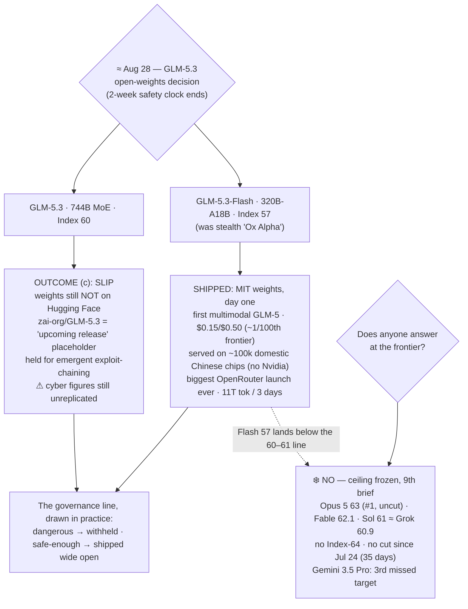

# LLM Updates — 2026-Aug-28

Friday brief, written Fri Aug 28 (Los Angeles time). For seven weeks the series has tracked two frozen
questions. **Does anyone answer at the frontier?** — no Index-64 model and no flagship price cut since
Claude Opus 5 took #1 on Jul 24. And **does the open-weights promise land?** — which has run through
gates: Kimi K3 *open but not runnable* (hardware, Jul-30), Qwen3.8-27B *runnable but unproven* until
Aug-17 cleared it, and GLM-5.3 *held because it's dangerous* — its weights kept back on a safety timer
after Z.ai's own evaluation surfaced emergent offensive-cyber capability (Aug-24 §1). That timer pointed
at **≈ Aug 28**. Aug-27 was T-1, with everything staged and nothing moved.

**Today the decision date arrived — and it split in two.** The single most-watched item on the board
did *both* things at once, on two different models from the same lab:

- **The 744B GLM-5.3's weights slipped.** As of this Aug-28 compile the weights are **still not on
  Hugging Face**; `zai-org/GLM-5.3` remains an *"upcoming release"* placeholder and nothing has been
  published against the ≈ Aug 28 target ([apidog](https://apidog.com/blog/self-host-glm-5-3-open-weights/);
  [modemguides](https://www.modemguides.com/blogs/ai-news/glm-5-3-open-weights-security-findings)). The
  emergent-cyber safety hold (Aug-24 §1) holds; this is outcome **(c)**, the slip the Aug-27 brief
  pre-distinguished — the Qwen3.8-Max pattern, a top open model that still ships on a timer, not a link.
- **A *different* open GLM shipped wide open instead.** The viral stealth model **"Ox Alpha"** — which
  had quietly topped OpenRouter for about six days — was **revealed as GLM-5.3-Flash** and released with
  **MIT-licensed weights day one**: a **320B-total / 18B-active** mixture-of-experts, the **first
  natively multimodal** model in the GLM-5 series, scoring **57 on the Artificial Analysis Intelligence
  Index** (level with Claude Opus 4.8), priced at **$0.15 / $0.50 per Mtok** ("~1/100th of frontier"),
  and — the headline within the headline — **served entirely on ~100,000 domestically-produced Chinese
  chips, no Nvidia** ([SCMP](https://www.scmp.com/tech/big-tech/article/3365433/zhipu-ai-shares-jump-viral-ox-alpha-model-revealed-glm-53-flash-chinese-chips);
  [TechNode](https://technode.com/2026/08/27/zhipu-identifies-ox-alpha-as-glm-5-3-flash-and-releases-model-weights/)).

So the open-weights promise **slipped and landed on the same day** — the dangerous model held, a safe,
cheaper, multimodal sibling shipped — and the one that shipped carries the larger geopolitical charge.

**Meanwhile the closed ceiling stays frozen for a 9th straight brief.** Opus 5 still #1 at Index **63**,
uncut ($5/$25); Fable 5 **62.1**; GPT-5.6 Sol (max) **61** ≈ Grok 4.6 **60.9**; **no Index-64 model and
no flagship price cut since Jul 24** (now 35 days); **Gemini 3.5 Pro still absent** (§3). GLM-5.3-Flash's
57 lands in the near-frontier band, *below* the 60–61 line — so, once again, every substantive move this
window was **below** the ceiling.

This report advances only what is **new since Aug-27.** It does **not** re-derive GLM-5.3's cyber finding
and hold cause (Aug-24 §1), its measured Index 60 (Aug-26 §1), the launch specs (Aug-16 §2), or the
ceiling composition (Aug-27) — those are unchanged and pointed to in §4.

![Two-branch diagram from a central "Aug 28 — the decision date" node. The left branch, dashed amber, is the big GLM-5.3, a 744-billion-parameter mixture-of-experts: its open weights were due about August 28 but the date arrived with nothing published — the zai-org GLM-5.3 repo is still only an "upcoming release" placeholder, so the drop slipped (outcome c). It remains held for a safety review over emergent exploit-chaining; its general Index of 60 is measured but the download is gated and its cyber figures are still unreplicated. The right branch, solid teal, is GLM-5.3-Flash, the stealth "Ox Alpha" that topped OpenRouter for six days: a 320-billion-total, 18-billion-active multimodal MoE shipped with MIT weights day one, Intelligence Index 57 (level with Opus 4.8, above DeepSeek V4 Pro at 53), priced $0.15 and $0.50 per million tokens (about one-hundredth of frontier price), served on roughly 100,000 domestic Chinese chips with no Nvidia, and the biggest launch in OpenRouter history at more than 11 trillion tokens in three days, with Zhipu's Hong Kong shares up 12 percent. A footer strip shows the frozen closed ceiling — Opus 5 at 63 and number one, Fable 5 at 62.1, GPT-5.6 Sol at 61 tying Grok 4.6 at 60.9 — with the two open leaders (held GLM-5.3 at 60 and Kimi K3 at 60) just below and GLM-5.3-Flash at 57 in the near-frontier band; no Index-64 model and no flagship price cut since July 24, now 35 days, a ninth straight brief.](glm53_decision_splits_held_big_vs_shipped_flash.svg)

---

## 1. The decision date split — the big GLM-5.3 held, GLM-5.3-Flash shipped

The two-week clock the whole series counted toward ended today, and it resolved into a fork rather than a
single answer. The two branches are worth taking one at a time because they are genuinely opposite calls.

### 1a. GLM-5.3 (744B) — the weights slipped (outcome c)

Aug-27 pre-distinguished three outcomes for today: **(a)** full weights on time, **(b)** a
capability-restricted / hardened checkpoint, or **(c)** a slip. As of this compile it is **(c)**. The
≈ Aug 28 target has arrived and the downloadable weights are **still not on Hugging Face** — the
`zai-org/GLM-5.3` repository remains an *"upcoming release"* placeholder, and the newest actually-published
`zai-org` repo is still GLM-5.2 ([apidog "get ready for the drop"](https://apidog.com/blog/self-host-glm-5-3-open-weights/);
[modemguides](https://www.modemguides.com/blogs/ai-news/glm-5-3-open-weights-security-findings)). The
stated cause is unchanged from Aug-24: post-training on the GLM-5 base produced an emergent capability to
**chain vulnerability discovery, validation and exploitation into a single multi-stage process**, beyond
what Z.ai says it targeted, and the weights are held for additional safety review
([miraflow](https://miraflow.ai/blog/glm-5-3-explained-zai-coding-cyber-defense-benchmarks-2026)).

Two things make the slip more than a calendar footnote. **First, it is the first time in this series that
a self-imposed open-weights safety hold has actually outrun its own announced date** — Z.ai set the timer
publicly and then let it lapse, which is different from the ordinary logistics slips (Qwen3.8-Max) the
series has logged before. **Second, the one figure that would let outsiders judge whether the hold is
warranted — an *independent* run of GLM-5.3's cyber benchmarks (CyberGym 84.5, ExploitBench 54.4) — is
still exactly zero.** The general Index 60 is third-party (Aug-26); the danger that justifies the hold
remains the vendor's own number. So the model that reached within three points of the closed frontier
stays download-gated on a still-unverified rationale, past its own deadline.

### 1b. GLM-5.3-Flash — "Ox Alpha" unmasked, MIT weights day one

The actual *release* this window is a different model. Since about Aug 20 a free, anonymous model called
**"Ox Alpha"** had been climbing OpenRouter, and by mid-week it was the platform's top model by token
volume. On Aug 26–27 Z.ai confirmed **Ox Alpha is GLM-5.3-Flash** and published the weights
([TechNode](https://technode.com/2026/08/27/zhipu-identifies-ox-alpha-as-glm-5-3-flash-and-releases-model-weights/);
[ZeroHedge](https://www.zerohedge.com/technology/viral-sensation-ox-alpha-model-revealed-glm-53-flash-running-entirely-chinese-chips)).
What shipped:

| Attribute | GLM-5.3-Flash |
|---|---|
| Architecture | **320B total / 18B active** MoE (320B-A18B); new hybrid linear+sparse attention |
| Modality | **First natively multimodal** GLM-5 model (text / image / video); 1M-token context target |
| License | **MIT — weights downloadable day one** ([HF `zai-org`](https://huggingface.co/zai-org/GLM-5.3)) |
| Intelligence | **AA Index 57** — level with Claude Opus 4.8; above DeepSeek V4 Pro (53) |
| Price | **$0.15 / $0.50 per Mtok** — Z.ai's Jie Tang: *"~1/100th of frontier"* |
| Hardware | **Served entirely on ~100,000 domestic Chinese chips, no Nvidia** |
| Adoption | **Biggest OpenRouter launch ever — 11T+ tokens in first 3 days** |

Three things fall out of that row.

**First, it is a real capability entry, not a serving variant.** Unlike GLM-5.2 Turbo (Aug-17, a latency
SKU of an existing model), Flash is a **new base** at a new size point: 18B active parameters delivering
**Index 57**, which *matches Anthropic's prior flagship Opus 4.8* and beats DeepSeek's V4 Pro (53)
([KuCoin](https://www.kucoin.com/news/flash/zhipu-s-glm-5-3-flash-matches-claude-opus-4-8-in-ai-benchmark-drives-9-stock-surge)).
It is the strongest open model you can **actually download and run today** — the two higher-scoring open
models (the held GLM-5.3 at 60 and Kimi K3 at 60) are respectively gated and datacenter-scale.

**Second, the hardware story is the one that moved markets.** Z.ai says the stealth run served across
tens of thousands of *domestically-produced* accelerators — reported around **100,000 Chinese chips** —
at per-token cost comparable to Nvidia GPUs, with **zero Nvidia hardware in the pipeline**
([implicator.ai](https://www.implicator.ai/zai-glm-5-3-flash-chinese-chips-nvidia-cost/);
[officechai](https://officechai.com/ai/ox-alpha-glm-5-3-flash-was-powered-by-pure-chinese-chips-is-priced-at-1-100th-of-frontier-z-ai-founder-jie-tang/)).
This is the first time a **globally-popular, top-of-OpenRouter** model has been shown to run its entire
inference load on non-Nvidia Chinese silicon — a concrete data point on China's ability to serve
large-scale global inference under export controls. Zhipu's Hong Kong shares closed **more than 12%
higher** on the reveal ([SCMP](https://www.scmp.com/tech/big-tech/article/3365433/zhipu-ai-shares-jump-viral-ox-alpha-model-revealed-glm-53-flash-on-chinese-chips)).
*Caveat kept honest:* Z.ai's own materials say "Chinese AI chips" / "domestically developed accelerators"
and stop there; the specific vendor mix for this cluster is **not on the record** (the widely-cited
100k-Huawei-Ascend-910B figure describes the GLM-5 *base* training stack, not confirmed for the Flash
serving cluster).

**Third, the stealth-launch mechanic is itself the point.** Flash proved its quality **anonymously, at
scale, before anyone knew who built it** — 11T+ tokens in three days is OpenRouter's largest launch on
record, and Z.ai's combined OpenRouter token share jumped to ~23–24% for the week, with Flash alone
accounting for ~19 points once unmasked ([SCMP](https://www.scmp.com/tech/big-tech/article/3365433/zhipu-ai-shares-jump-viral-ox-alpha-model-revealed-glm-53-flash-on-chinese-chips);
[Webcoda](https://ai-checker.webcoda.com.au/articles/ox-alpha-glm-5-3-flash-chinese-chips-2026)). The
adoption is a blind-tested result, not a launch-day marketing number.

## 2. The two GLMs, read together — a split that is the whole story

The clean way to hold this window is that **one lab made two opposite open-weights calls in the same
week**, and the split maps exactly onto the danger axis this series has been tracking:

- The model that is **frontier-adjacent and dangerous** (GLM-5.3, Index 60, emergent exploit-chaining)
  is the one being **withheld** — past its own date.
- The model that is **cheaper, safer, multimodal and merely near-frontier** (GLM-5.3-Flash, Index 57) is
  the one shipped **wide open under MIT**, on Chinese silicon, at 1/100th frontier price.

That is not a contradiction; it is the governance line drawn in practice. Aug-24 framed GLM-5.3's binding
constraint as no longer hardware or credibility but **governance of capability**. Today shows the *other
side* of that same line: capability that is *safe enough* ships with maximum openness and maximum
distribution (MIT, cheap, blind-launched to the top of the market), while capability judged *unsafe*
stays gated even at the cost of missing a public deadline. The open ecosystem isn't choosing between open
and closed — it's **sorting its own releases by risk**.

## 3. What did *not* move — the ceiling and Gemini

- **The closed ceiling — frozen a 9th straight brief.** The [Artificial Analysis Intelligence
  Index](https://artificialanalysis.ai/leaderboards/models) top is unchanged: **Opus 5 63 (#1, uncut,
  $5/$25)**, **Fable 5 62.1**, then **Opus 5 (high) 61** and **GPT-5.6 Sol (max) 61**, **Grok 4.6 60.9**,
  across 181 models ([BenchLM](https://benchlm.ai/benchmarks/artificialanalysis)). **No Index-64 model.
  No flagship price cut since Jul 24** (now 35 days). GLM-5.3-Flash's 57 sits *below* the band — it does
  not challenge the ceiling; it crowds the near-frontier tier alongside Qwen3.8-Max (56) and Opus 4.8
  (56). Ninth brief running, the answer to "does anyone answer at the frontier?" is **no**.
- **Gemini 3.5 Pro — still absent.** No ship or date; still not in the AA top 5 (Google's newest live
  entry remains Gemini 3.7 Flash, the price/performance model, not a frontier Pro), still >3 months past
  the May-19 I/O announcement ([Green Flag Digital "top models ranked, Aug 2026"](https://greenflagdigital.com/top-ai-models-ranked/)).
  It remains the single most overdue frontier event on the board.
- **Meta "Watermelon"** — unchanged from Aug-27: still in training, now reported ~Oct, no card, no
  benchmark. Not a move.

## 4. Unchanged since Aug-27 (not re-derived here)

- **GLM-5.3 (744B) launch & specs** (Z.ai, Aug 14): post-train-only on GLM-5, ≈744B MoE / ~40B active /
  200K ctx, API-only via the $18/mo GLM Coding Plan — Aug-16 §2.
- **GLM-5.3 measured Index 60** (Artificial Analysis, Aug 26): +7 over GLM-5.2 on post-training alone,
  ties Kimi K3, −3 vs Opus 5; agentic GDPval-AA Elo 1524→1770 (+246); verbosity ~18.7k tok/task — Aug-26 §1.
- **GLM-5.3 cyber finding & weights-hold cause** (Z.ai eval): CyberGym 84.5, ExploitBench 54.4, 2,436
  vulns / 1,097 critical, "emergent exploit-chaining" — **all still vendor-claimed, no independent run**
  — Aug-24 §1.
- **Hold mechanics**: during the hold, access via vetted security partners / GLM Coding Plan; stated plan
  to make weights "downloadable to anyone" once review closes — Aug-27.
- **Ceiling composition** — Opus 5 63 / Fable 62.1 / Sol 61 / Grok 60.9 — Aug-27.
- **Qwen3.8-27B** independently measured — Index 52, Agentic 51, verbose ($591.30 eval cost) — Aug-18.
- **Grok 4.6** (Aug 6): Index 60.9, ceiling band, cheap end $2/$6, post-train-only — Aug-14 §1.
- **Kimi K3** (Moonshot, Jul-26): 2.8T MoE, Modified-MIT, hardware-gated to serve, Index 60 — Jul-30.
- **Opus 5** #1 (Jul-24, effort dial + paid fast mode); **Sonnet 5** $2/$10 intro through Aug 31;
  **Kill Switch / Pacing** policy axis quiet.

## Watch-items into the next brief

1. **Does the 744B GLM-5.3 ever ship — and in what form?** The ≈ Aug 28 target is now *missed*. Watch for
   (a) a rescheduled date, (b) a hardened / capability-restricted checkpoint (still a first for an open
   release), or (c) an indefinite hold. The slip having happened, "when and whether" is now the live
   question, not "does the timer hold."
2. **Independent replication of GLM-5.3's cyber numbers — still zero.** CyberGym 84.5 / ExploitBench 54.4
   remain unverified, and they are the *stated reason* the big weights are held. This is the one figure
   whose confirmation (or refutation) would most change how the slip reads.
3. **GLM-5.3-Flash's independent Index and the chip claim.** The 57 is press/vendor-reported; watch for
   Artificial Analysis to place Flash formally, and for any independent confirmation of the
   *pure-domestic-chip* serving claim (which vendor, what silicon) — the geopolitically loaded part is
   the least independently verified.
4. **The frozen ceiling — 9th brief, no Index-64, no flagship cut since Jul 24 (35 days).** Gemini 3.5
   Pro's continued absence makes it the most overdue frontier event; a ship or credible date would be the
   first top-tier move in over five weeks.

---

### Method & caveats

- **Compiled** Fri Aug 28 2026 (Los Angeles time). Advances only items **new since the Aug-27 brief**;
  unchanged threads are listed in §4 with pointers, not re-derived.
- **Scraping resilience.** Direct fetch is **broadly egress-blocked** from this environment (Hugging Face
  and several outlets returned egress errors on direct fetch this run); all figures were taken from the
  **search index** and **corroborated across multiple independent outlets**. No quantitative claim here
  rests on a single source.
- **What is measured vs claimed.**
  - **GLM-5.3 (744B):** general Index **60** is **third-party** (Artificial Analysis, Aug-26); the
    **cyber figures** (CyberGym 84.5 etc.) remain **Z.ai's own, unreplicated**; the **weights-hold and
    the missed ≈ Aug 28 date** are verifiable (repo still an "upcoming release" placeholder at compile).
  - **GLM-5.3-Flash:** architecture (320B-A18B, multimodal), **MIT weights**, price ($0.15/$0.50), and
    the **OpenRouter adoption** (11T tokens / 3 days, top-of-platform) are **vendor- and press-reported
    and cross-corroborated**; its **Index 57** is press/vendor-reported pending a formal AA listing; the
    **pure-domestic-chip serving claim** is **Z.ai's own**, with the specific chip vendor mix *not on the
    record* — treat the 100k-Ascend figure as describing GLM-5's base-training stack, not confirmed for
    the Flash cluster.
- **Diagrams** are a standalone theme-neutral SVG (slate/amber/sky/teal strokes that read on light and
  dark backgrounds, no external URLs) and an inline Mermaid flowchart; both render in GitHub-flavored
  markdown.

### Sources

- **Ox Alpha revealed as GLM-5.3-Flash; MIT weights; Chinese chips** — [SCMP "Zhipu shares jump as viral Ox Alpha revealed as GLM-5.3-Flash on Chinese chips"](https://www.scmp.com/tech/big-tech/article/3365433/zhipu-ai-shares-jump-viral-ox-alpha-model-revealed-glm-53-flash-on-chinese-chips) · [TechNode "Zhipu identifies Ox Alpha as GLM-5.3-Flash and releases model weights"](https://technode.com/2026/08/27/zhipu-identifies-ox-alpha-as-glm-5-3-flash-and-releases-model-weights/) · [ZeroHedge "Viral sensation Ox Alpha revealed as GLM-5.3-Flash, running entirely on Chinese chips"](https://www.zerohedge.com/technology/viral-sensation-ox-alpha-model-revealed-glm-53-flash-running-entirely-chinese-chips)
- **GLM-5.3-Flash specs, Index 57, price, adoption** — [KuCoin "GLM-5.3-Flash matches Claude Opus 4.8, drives 9% stock surge"](https://www.kucoin.com/news/flash/zhipu-s-glm-5-3-flash-matches-claude-opus-4-8-in-ai-benchmark-drives-9-stock-surge) · [OpenRouter GLM-5.3-Flash model page](https://openrouter.ai/z-ai/glm-5.3-flash) · [AiCybr "the 320B/18B model behind OpenRouter's biggest stealth launch"](https://aicybr.com/blog/ox-alpha-openrouter-opencode-omp-guide)
- **Chinese-chip serving claim & pricing** — [implicator.ai "Z.ai served GLM-5.3-Flash entirely on Chinese AI chips"](https://www.implicator.ai/zai-glm-5-3-flash-chinese-chips-nvidia-cost/) · [officechai "Ox Alpha = GLM-5.3-Flash, pure Chinese chips, 1/100th of frontier: Jie Tang"](https://officechai.com/ai/ox-alpha-glm-5-3-flash-was-powered-by-pure-chinese-chips-is-priced-at-1-100th-of-frontier-z-ai-founder-jie-tang/) · [wccftech "run entirely on Chinese GPUs while serving 100T tokens/day"](https://wccftech.com/zhipu-z-ai-unmasks-the-mystery-ox-alpha-model-as-glm-5-3-flash-revealing-that-it-was-run-entirely-on-chinese-gpus-while-serving-100-trillion-tokens-day/)
- **Big GLM-5.3 weights slip / still held** — [apidog "self-hosting GLM-5.3: get ready for the drop"](https://apidog.com/blog/self-host-glm-5-3-open-weights/) · [modemguides "GLM-5.3 open weights: release date, license, bug ledger"](https://www.modemguides.com/blogs/ai-news/glm-5-3-open-weights-security-findings) · [zai-org/GLM-5.3 (HF, "upcoming release")](https://huggingface.co/zai-org/GLM-5.3) · [miraflow "post-training-only update"](https://miraflow.ai/blog/glm-5-3-explained-zai-coding-cyber-defense-benchmarks-2026)
- **Ceiling & leaderboard** — [Artificial Analysis LLM leaderboard](https://artificialanalysis.ai/leaderboards/models) · [BenchLM (Opus 5 63)](https://benchlm.ai/benchmarks/artificialanalysis) · [Green Flag Digital "top models ranked, Aug 2026"](https://greenflagdigital.com/top-ai-models-ranked/)
