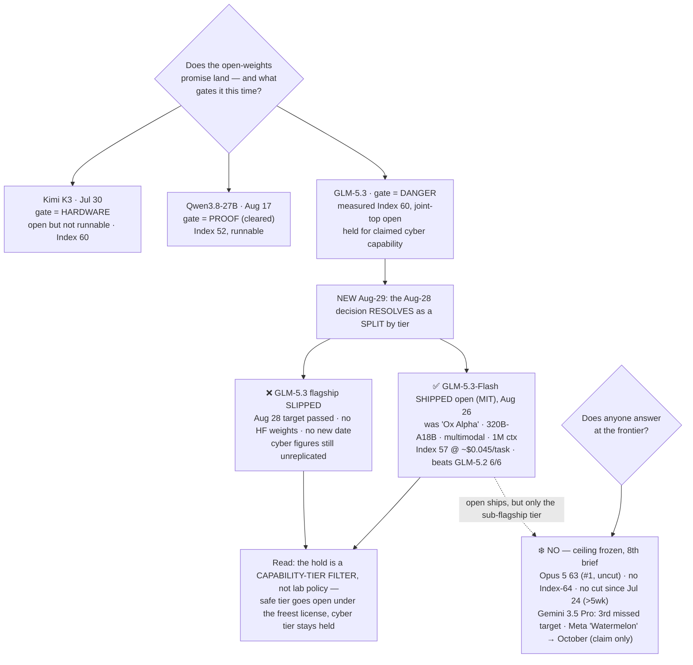

# LLM Updates — 2026-Aug-29

Saturday brief, written Sat Aug 29 (Los Angeles time). For nearly seven weeks the series has tracked
two frozen questions. **Does anyone answer at the frontier?** — no Index-64 model and no flagship price
cut since Claude Opus 5 took #1 on Jul 24. And **does the open-weights promise land?** — which ran
through three gates: Kimi K3 was *open but not runnable* (hardware, Jul-30), Qwen3.8-27B was *runnable
but unproven* until Aug-17 cleared it, and GLM-5.3 was *held because it's dangerous* — its weights kept
back on a safety timer (≈Aug 28) after Z.ai's own evaluation surfaced emergent offensive-cyber capability
(Aug-24 §1), a model Artificial Analysis then *measured* at Index 60, joint-top open weights and three
points off the closed #1 (Aug-26 §1).

**This window resolves the Aug-28 decision — and the answer is a split, not a yes or no.** The Aug-26
brief's first watch-item asked whether GLM-5.3 would actually ship weights on/near Aug 28, and named three
outcomes to distinguish: full weights on time, a hardened checkpoint, or a slip. What happened is none of
those cleanly — it is **two things at once, split by capability tier.** The **flagship GLM-5.3 (Index 60,
~744B, the cyber model) missed Aug 28**: its `zai-org/GLM-5.3` Hugging Face placeholder counted down to
that date, the date passed, and **no weights were published and no new date was confirmed** — a slip (§1).
But on **Aug 26, Z.ai shipped a *different* GLM-5.3 model open**: **GLM-5.3-Flash**, revealed as the
anonymous "Ox Alpha" endpoint developers had been hammering all week — a **320B-A18B MoE, natively
multimodal, 1M-context model, weights on Hugging Face under an MIT license**, measured by AA at **Index 57**
(§1). So the open-weights promise didn't fail and didn't fully land: **the smaller, safe model went open
under the most permissive license there is, while the dangerous flagship stayed held.** The gate turned
out to be selective by tier — Z.ai released the model it could and held the one it couldn't.

**Meanwhile the closed ceiling stays frozen for an 8th straight brief.** Opus 5 still #1 at Index **63**,
uncut ($5/$25); **no Index-64 model and no flagship price cut since Jul 24** (now over five weeks); and
**Gemini 3.5 Pro is still off the board**, its third missed target unmoved (§2). The only movement on the
Meta thread is a *date*: "Watermelon" now reported for **October**, still a codename with no card (§2).
Every substantive move this window was, once again, **below** the ceiling — and this window the open side
both *shipped* something (Flash) and *slipped* something (the flagship).

This report advances only what is **new since Aug-26.** It does **not** re-derive GLM-5.3's independent
Index 60 and agentic Elo (Aug-26 §1), its cyber finding and weights-hold cause (Aug-24 §1), the GLM-5.3
launch itself (Aug-16 §2), or the frozen-ceiling composition (Aug-26 §2) — those are unchanged and pointed
to in §4.

![Two-lane diagram of Z.ai's GLM-5.3 open-weights promise resolving in a split by capability tier. A source node on the left, GLM-5.3 with a Hugging Face target of about August 28, branches into two lanes. The top lane, shaded amber and marked held, is the GLM-5.3 flagship: Intelligence Index 60, about 744 billion parameters, vendor-claimed offensive-cyber capability with CyberGym 84.5, gate labelled danger; its outcome is that August 28 passed with no weights on Hugging Face and no new date, a slip. The bottom lane, shaded teal and marked shipped, is the new GLM-5.3-Flash, formerly the anonymous Ox Alpha endpoint: Intelligence Index 57 at about 0.045 dollars per task, a 320-billion-parameter mixture-of-experts with 18 billion active, natively multimodal, one-million-token context, gate labelled safe; its outcome is that weights shipped open on Hugging Face under an MIT license on August 26, beating the larger GLM-5.2 across all six reported benchmarks at about one-tenth the serving cost. A center label reads that the safety gate is selective by tier: the lab released the model it could and held the one it could not. A footer notes the closed ceiling stayed frozen for an eighth straight brief with Opus 5 at 63 still number one and uncut, no Index-64 model and no flagship price cut since July 24, while Gemini 3.5 Pro stays absent on a third missed target and Meta's Watermelon now carries an October date.](glm53_open_weights_drop_splits_flash_ships_flagship_slips.svg)

---

## 1. The Aug-28 decision resolves as a split — Flash ships open (MIT), the flagship slips

Aug-26 closed with the ≈Aug 28 weights decision two days out and the stakes raised: AA had just measured
GLM-5.3 at a joint-top-open Index 60, so this was "a *measured* joint-#1 open model, held for a *claimed*
safety reason." The decision has now landed, and it landed as **two separate events on two different
models in the GLM-5.3 line.**

**The flagship slipped.** Z.ai's own Hugging Face placeholder, `zai-org/GLM-5.3`, counted down to **Aug 28**;
**that date passed with no weights published and no new date confirmed**
([implicator.ai](https://www.implicator.ai/z-ai-delays-glm-5-3-weights-two-weeks-after-cyber-score-beats-mythos-5/);
[MindStudio](https://www.mindstudio.ai/blog/glm-5-3-open-weights-release-timing)). The stated reason is
unchanged from Aug-24 — the CyberGym-84.5 / offensive-cyber capability that triggered the safety-hardening
hold. So of the three outcomes the last brief flagged, this is **outcome (c), a slip**, and the sharpest
one: not a hardened checkpoint, not a delay-with-a-date, but the placeholder date passing in silence. The
measured joint-#1 open model is still not downloadable, and now without even a target.

**But a *different* GLM-5.3 model shipped open — the "Ox Alpha" mystery, revealed.** On **Aug 26**, Z.ai
confirmed that the free, anonymous **"Ox Alpha"** endpoint developers had been testing since ~Aug 20 was
**GLM-5.3-Flash**, and published its weights on Hugging Face **under an MIT license the same day**
([explainX](https://www.explainx.ai/blog/glm-5-3-flash-ox-alpha-official-launch-august-2026);
[MarkTechPost](https://www.marktechpost.com/2026/08/26/z-ai-releases-glm-5-3-flash-a-320b-a18b-natively-multimodal-moe-with-a-1m-token-context/);
[kingy.ai](https://kingy.ai/blog/ox-alpha-glm-5-3-flash-evidence/)). This is a real open-weights landing —
just of the *Flash* tier, not the flagship.

**What GLM-5.3-Flash is.** It is a genuinely different animal from the held flagship:

| Attribute | GLM-5.3 (flagship, **held**) | GLM-5.3-Flash (**shipped, MIT**) |
|---|---|---|
| Params | ~744B MoE / ~40B active | **320B MoE / 18B active** (45 layers) |
| Modality | text | **natively multimodal** — text, image, video (first GLM-5 to) |
| Context | 200K | **1M tokens** |
| AA Intelligence Index | **60** (joint-top open) | **57** @ ~**$0.045/task** |
| Weights | not on HF, Aug 28 slipped, no date | **on HF, MIT, Aug 26** |
| Gate | DANGER (cyber) → held | SAFE → released |

Three things fall out. **First, Flash is an efficiency release, not a cut-down.** Z.ai reports it **beats
the much larger GLM-5.2 across all six reported benchmarks while costing ~1/10th as much to serve**, and
it posts **84.3 on Terminal-Bench 2.1**
([Chubby/X](https://x.com/kimmonismus/status/2092619561505865866);
[MarkTechPost](https://www.marktechpost.com/2026/08/26/z-ai-releases-glm-5-3-flash-a-320b-a18b-natively-multimodal-moe-with-a-1m-token-context/)).
On the open-weights index table it slots at **57** — below the held GLM-5.3 / Kimi K3 pair at 60, but
**above Qwen3.8-Max (56) and its own GLM-5.2 base (53)** — a runnable, multimodal, million-context open
model at flash pricing. **Second, it is natively multimodal** — the first GLM-5 model to take image and
video input directly rather than through a bolted-on vision adapter, trained on a 30T-token multimodal
corpus. **Third, the license is MIT** — the most permissive of the summer's open drops (looser than Kimi
K3's Modified-MIT), i.e. the *safe* model got the *freest* terms.

**Why the split is the story.** The last two briefs framed GLM-5.3 as a single object — a measured joint-#1
open model held for a claimed danger. This window shows the hold is **not lab-wide policy but a
capability-tier filter**: the same lab, in the same week, shipped its 320B multimodal Flash model to Hugging
Face under MIT *and* let its 744B cyber-capable flagship's release date lapse in silence. That is the first
clean, same-lab demonstration of a **selective open-weights hold** — the sub-frontier tier flows out freely
while the frontier-adjacent, cyber-capable tier is the thing being gated. It converts the abstract "held
because it's dangerous" narrative into a concrete pattern: **Z.ai released exactly the model it judged safe
to release, and held exactly the one it didn't.**

**What is now shipped vs still held/claimed, after this window:**

- **Shipped & open (verifiable):** GLM-5.3-**Flash** weights on HF under MIT (Aug 26); its Index 57 is
  third-party (AA).
- **Still held (verifiable non-event):** GLM-5.3 **flagship** weights — Aug 28 slipped, no HF publish, no
  new date.
- **Still vendor-claimed (no independent run):** *all* the flagship cyber figures — CyberGym 84.5,
  ExploitBench 54.4, the 2,436-vulnerability count, "emergent exploit-chaining" — the stated reason for the
  hold, still unreplicated (Aug-24 §1 / Aug-26 §1). Flash's own benchmark sweep (six-for-six over GLM-5.2,
  Terminal-Bench 84.3) is likewise **vendor-reported** apart from the AA Index 57.

## 2. What did *not* move — the ceiling, Gemini, and Meta's "Watermelon" gets an October date

- **The closed ceiling — frozen an 8th straight brief.** The [Artificial Analysis Intelligence
  Index](https://artificialanalysis.ai/leaderboards/models) top is unchanged: **Opus 5 63 (#1, uncut,
  $5/$25)**, **Fable 5 ~62** ([BenchLM, Opus 5 63.1 across 153
  models](https://benchlm.ai/benchmarks/artificialanalysis)). **No Index-64 model. No flagship price cut
  since Jul 24** — now over five weeks. Eighth brief running, the answer to "does anyone answer at the
  frontier?" is still **no**, and the only things climbing toward the frozen line remain open or
  sub-flagship, not a new closed #1. (For reference on the second tier, GPT-5.6 Sol — a Jul-9 model, not
  new this window — sits ~59–61 on AA depending on the run; it is below the ceiling band and unchanged
  here: [AA GPT-5.6 Sol](https://artificialanalysis.ai/models/gpt-5-6-sol).)
- **Gemini 3.5 Pro — still absent, still three missed targets.** No ship or date; still no
  `gemini-3.5-pro` in the API (newest Pro-tier remains `gemini-3.1-pro-preview`), still "testing," still
  past three targets (June, mid-July, early August)
  ([The AI Rankings](https://theairankings.com/google/gemini-3-5-pro/);
  [Codersera](https://codersera.com/blog/gemini-3-5-pro-launch-guide-2026/)). It remains the single most
  overdue frontier event on the board.
- **Meta "Watermelon" — now with a month, still no card.** The codename logged Aug-26 firmed up this
  window: The Information (Aug 24) reports Meta Superintelligence Labs plans to roll out **Watermelon in
  October**, alongside a consumer-agent platform, **"Hatch,"** said to be "weeks" away — agents that
  navigate sites like DoorDash, Etsy and Outlook
  ([PYMNTS](https://www.pymnts.com/news/artificial-intelligence/2026/metas-consumer-focused-ai-agent-could-be-weeks-from-launch/);
  [Yahoo Finance / The Information](https://finance.yahoo.com/technology/ai/articles/meta-hatch-agent-platform-watermelon-113350203.html)).
  The performance claim is unchanged and still internal: **~GPT-5.5 parity on Meta's own numbers, at ~10×
  the compute of Muse Spark** — no card, no benchmark, no third-party score. What's new is only the *date*
  (October) and the *productization* angle (Hatch); it is still a claim, not a move.
- **No new closed-frontier release in the window.** Nothing landed at or above the ceiling between Aug 26
  and Aug 29; the only concrete release was GLM-5.3-Flash (open, sub-flagship, §1).

## 3. Reading the two together

The top of the map still hasn't moved in eight briefs — same #1, same price, same absent Google, same Meta
codename (now with an October date but still no card). What sharpened this window is the *shape of the open
side*. For two briefs GLM-5.3 read as one object: a measured joint-#1 open model held for a claimed danger.
The Aug-28 decision has now split that object cleanly in two, and the split is more informative than either
a plain "shipped" or "held" would have been. **The safe, sub-frontier tier (Flash, 57, multimodal, 1M
context) flowed straight out under MIT — the freest license of the summer — while the frontier-adjacent,
cyber-capable flagship (60) had its release date lapse in silence.** That is the first same-lab, same-week
demonstration that an open-weights hold can be *selective by capability*, not all-or-nothing: a lab can be
maximally open with what it judges safe and simultaneously withhold what it doesn't. The irony from Aug-24
holds and deepens — the single model that closed the *measured* open-to-closed gap to three points is still
the one being withheld, now without even a target date, while its safe sibling ships freely. So the
open-weights question resolves not as landed or failed but as **bifurcated**: the promise is being kept for
the tier below the frontier and quietly deferred for the tier that touches it. Against that, the closed
ceiling's eight-brief freeze looks less like the whole story and more like the *stable half* — the motion
that matters is entirely on the open side, and this window it moved in two directions at once.

## 4. Unchanged since Aug-26 (not re-derived here)

- **GLM-5.3 flagship independent Index 60** (AA): +7 vs GLM-5.2 on post-training alone, ties Kimi K3 for
  top open, −3 vs Opus 5; agentic GDPval-AA v2 Elo 1524→1770 (+246); verbose ~18.7k output tok/task —
  Aug-26 §1. *This brief adds only that its **weights** slipped (§1); the measured number is unchanged.*
- **GLM-5.3 cyber finding & weights-hold cause** (Z.ai, Aug 14 eval): CyberGym 84.5 (tops Mythos 5 on
  discovery), ExploitBench 54.4, emergent exploit-chaining, 2,436 vulns / 1,097 critical — **all still
  vendor-claimed, no independent run** — Aug-24 §1.
- **GLM-5.3 flagship launch** (Z.ai, Aug 14): 744B MoE / ~40B active / 200K ctx, post-train-only on GLM-5,
  API-only via $18/mo GLM Coding Plan — Aug-16 §2.
- **Qwen3.8-27B** independently measured — Index 52, Agentic Index 51 (beats Terra + Opus 4.8), verbose —
  Aug-18 §1 / Aug-24 §2.
- **Grok 4.6** (SpaceXAI, Aug 6): Index 60.9, ceiling band, cheap end $2/$6, post-train-only — Aug-14 §1.
- **Qwen3.8-Max** open weights (Aug 12–13): degraded/gated; measured Index **56** — Aug-14 §2.
- **Kimi K3** open weights (Moonshot, Jul-26): 2.8T MoE, Modified-MIT, hardware-gated to serve, Index 60
  — Jul-30.
- **v4.1.1 grader recalibration** (Aug 6): top's absolute numbers rose ~+2 from the ruler, not the models
  — Aug-14.
- **Muse Glimmer 30B** (Meta, Aug 10): open, on-device, distilled-from-Spark agentic + DFlash — Aug-11.
- **DeepSeek V4-Flash-0731** 50/$0.28 MIT Pareto floor — Aug-03 §1.
- **Opus 5** "top quality at mid price" (Jul-24): effort dial + paid fast mode — Jul-25.
- **Meta "Watermelon"** as a codename + ~GPT-5.5-parity claim — Aug-26 §2. *This brief adds the October
  target and the "Hatch" agent platform (§2); still no card.*
- **Sonnet 5** $2/$10 intro pricing through Aug 31; **Kill Switch / Pacing** policy axis quiet.

## Watch-items into the next brief

1. **Does the GLM-5.3 *flagship* ever ship — and does the slip get a new date or a hardened form?** The
   Aug 28 target lapsed silently (§1). Three things to distinguish next: (a) a **new date** appears; (b) a
   **capability-restricted / hardened** checkpoint ships (weights minus the exploit-chaining — the thing
   Aug-26 flagged as a possible first); or (c) an **indefinite hold** — the release quietly becomes "Flash
   is the open GLM-5.3, the flagship stays API-only." The selective-by-tier read (§1/§3) makes (c) more
   plausible than it looked a week ago.
2. **Independent numbers for GLM-5.3-Flash beyond the AA Index 57.** Its six-for-six-over-GLM-5.2 sweep and
   Terminal-Bench 84.3 are vendor-reported; a third-party agentic/coding run and a real-world read on the
   native multimodality + 1M context would confirm whether "frontier intelligence, flash cost" holds up
   outside Z.ai's own numbers.
3. **Independent replication of the flagship's *cyber* numbers — still zero.** CyberGym 84.5 / ExploitBench
   54.4 / the 2,436-vulnerability claim remain unverified, and they are the stated reason the flagship is
   held. An outside CyberGym/ExploitBench run is still the missing piece — and now the only thing that
   would justify or undercut the selective hold.
4. **The frozen ceiling — 8th brief, no Index-64, no flagship cut since Jul 24.** Gemini 3.5 Pro's third
   missed target makes it the most overdue frontier event; Meta's "Watermelon" now points at October. A
   ship or credible date from either would be the first top-tier move in over five weeks.

---

### Method & caveats

- **Compiled** Sat Aug 29 2026 (Los Angeles time). Advances only items **new since the Aug-26 brief**;
  unchanged threads are listed in §4 with pointers, not re-derived.
- **Scraping resilience.** Direct page fetch is broadly egress-limited from this environment; all figures
  were taken from the **search index** and **corroborated across multiple independent outlets**. No
  quantitative claim here rests on a single source.
- **What is measured vs claimed.** **Verifiable events:** GLM-5.3-Flash weights are **on Hugging Face under
  MIT (Aug 26)**; the GLM-5.3 **flagship** Aug-28 target **passed with no publish and no new date**.
  **Third-party (AA):** GLM-5.3-Flash **Index 57**; the flagship's **Index 60** (from Aug-26). **Vendor-
  reported (Z.ai, no independent run):** GLM-5.3-Flash's six-benchmark sweep over GLM-5.2 and Terminal-Bench
  **84.3**; and *all* the flagship **cyber figures** (CyberGym 84.5, ExploitBench 54.4, 2,436 vulns,
  "emergent exploit-chaining"). **Meta "Watermelon"** — codename + internal claim (~GPT-5.5 parity, ~10×
  Muse Spark compute) with an **October** target and a "Hatch" agent platform — is unreleased with **no
  published benchmark**.
- **Diagrams** are a standalone theme-neutral SVG (slate/amber/teal strokes that read on light and dark
  backgrounds, no external URLs) and an inline Mermaid flowchart; both render in GitHub-flavored markdown.

### Sources

- **GLM-5.3 flagship weights slipped past Aug 28** — [implicator.ai "Z.ai delays GLM-5.3 weights after cyber score beats Mythos 5"](https://www.implicator.ai/z-ai-delays-glm-5-3-weights-two-weeks-after-cyber-score-beats-mythos-5/) · [MindStudio "when will GLM-5.3 open weights be released?"](https://www.mindstudio.ai/blog/glm-5-3-open-weights-release-timing) · [evolink "what shipped and what's still staged"](https://evolink.ai/blog/glm-5-3-release)
- **GLM-5.3-Flash shipped open (MIT), was "Ox Alpha"** — [explainX "Ox Alpha was Zhipu (MIT)"](https://www.explainx.ai/blog/glm-5-3-flash-ox-alpha-official-launch-august-2026) · [MarkTechPost "Z.ai releases GLM-5.3-Flash: 320B-A18B natively multimodal MoE, 1M context"](https://www.marktechpost.com/2026/08/26/z-ai-releases-glm-5-3-flash-a-320b-a18b-natively-multimodal-moe-with-a-1m-token-context/) · [kingy.ai "Ox Alpha confirmed as GLM-5.3-Flash: specs & price"](https://kingy.ai/blog/ox-alpha-glm-5-3-flash-evidence/) · [Chubby/X "GLM-5.3-Flash official benchmarks, Terminal-Bench 84.3"](https://x.com/kimmonismus/status/2092619561505865866)
- **Ceiling & leaderboard** — [Artificial Analysis LLM leaderboard](https://artificialanalysis.ai/leaderboards/models) · [BenchLM (Opus 5 63.1, 153 models)](https://benchlm.ai/benchmarks/artificialanalysis) · [AA GPT-5.6 Sol (reference, Jul-9 model)](https://artificialanalysis.ai/models/gpt-5-6-sol)
- **Gemini 3.5 Pro delay** — [The AI Rankings "three delays and still unreleased"](https://theairankings.com/google/gemini-3-5-pro/) · [Codersera "why it's delayed (Aug 2026)"](https://codersera.com/blog/gemini-3-5-pro-launch-guide-2026/)
- **Meta "Watermelon" → October + "Hatch"** — [PYMNTS "Meta's consumer-focused AI agent could be weeks from launch"](https://www.pymnts.com/news/artificial-intelligence/2026/metas-consumer-focused-ai-agent-could-be-weeks-from-launch/) · [Yahoo Finance / The Information "Hatch agent platform and Watermelon model"](https://finance.yahoo.com/technology/ai/articles/meta-hatch-agent-platform-watermelon-113350203.html)
