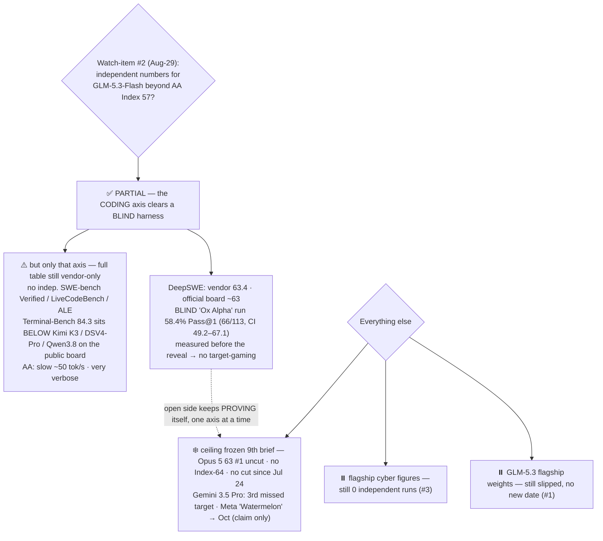

# LLM Updates — 2026-Aug-30

Sunday brief, written Sun Aug 30 (Los Angeles time). One day past the Aug-29 brief that resolved the
GLM-5.3 open-weights decision as a **split** — the safe 320B **GLM-5.3-Flash** shipped open under MIT
(revealed as the anonymous "Ox Alpha" endpoint), while the cyber-capable **744B flagship** let its Aug 28
date lapse in silence. Against a closed ceiling that has now been frozen for nine straight briefs, this is a
thin window with a **single substantive move**, and it is a *verification* move, not a release.

**The one thing new since Aug-29: GLM-5.3-Flash's headline coding claim got its first genuinely
*independent, blind* corroboration.** The Aug-29 brief's watch-item #2 asked for numbers on Flash beyond
Artificial Analysis's Index 57 — its six-for-six-over-GLM-5.2 sweep and Terminal-Bench 84.3 were all
vendor-reported. This window one axis of that table cleared an outside harness: a **StealthModelWatch
community run of the DeepSWE coding suite scored 58.4% Pass@1 (66/113 solved, 95% CI 49.2–67.1)** — and it
was run against the endpoint **while it was still the anonymous "Ox Alpha," before Z.ai claimed it** (§1).
Because the run was *blind* — nobody knew which model they were scoring, so no one could tune to it — it is
the strongest form of corroboration, and it lands **inside the confidence band** of Z.ai's self-reported
63.4; the **official DeepSWE leaderboard** now carries a `glm-5.3-flash` entry at ~63 as well
([StealthModelWatch via glm5.app](https://glm5.app/blog/glm-5-3-flash-benchmarks);
[LumaDock](https://lumadock.com/blog/glm-5-3-flash)). The honest read stays narrow: **this corroborates the
*coding* axis only.** The rest of the vendor table (SWE-bench Verified, LiveCodeBench, Agents' Last Exam)
still has **no independent Flash number**, and on the *public* Terminal-Bench 2.1 board Flash's 84.3 sits
*below* three larger open models — so "near Opus 4.8/Terra" is a curated comparison, not a leaderboard fact
(§1).

**Everything else HELD, exactly as Aug-29 left it.** The closed ceiling is frozen for a **9th straight
brief** — Opus 5 **63** (#1, uncut, $5/$25), Fable ~62.1, Grok 4.6 60.9; **no Index-64 model and no flagship
price cut since Jul 24** (over five weeks). The **GLM-5.3 flagship weights are still slipped with no new
date** (watch-item #1, unmoved). The flagship's **cyber figures still have zero independent replication**
(watch-item #3, unmoved). **Gemini 3.5 Pro is still absent** on its third missed target, and **Meta's
"Watermelon"** still points at October with no card (§2). No new closed-frontier model landed between Aug 27
and Aug 30.

This report advances only what is **new since Aug-29.** It does **not** re-derive the Aug-28 split itself,
GLM-5.3-Flash's specs (320B-A18B, natively multimodal, 1M context, MIT), the flagship's Index 60 / cyber
finding / weights-hold cause, or the frozen-ceiling composition — those are unchanged and pointed to in §4.

![Verification ledger for GLM-5.3-Flash as of August 30. Four rows show which benchmark claims now have independent backing. The Artificial Analysis Intelligence Index of 57 is third-party measured (teal). The DeepSWE coding row, highlighted as new this window, shows a vendor self-report of 63.4, an official DeepSWE leaderboard entry now near 63, and a blind StealthModelWatch community run on the pre-reveal Ox Alpha endpoint scoring 58.4 percent Pass at 1 (66 of 113, 95 percent CI 49.2 to 67.1) inside the same band — marked blind-corroborated. Terminal-Bench 2.1 at 84.3 is vendor-reported and sits below Kimi K3 88.3, DeepSeek V4 Pro 87.9, and Qwen3.8 86.6 on the public board (amber, vendor plus context). SWE-bench Verified, LiveCodeBench, and Agents Last Exam have no independent Flash number yet (slate, not yet measured). A note records Flash is measured slow at about 50 tokens per second with 1.47 second TTFT and very verbose. A footer states the closed ceiling stayed frozen a ninth brief with Opus 5 at 63 number one and uncut, no Index-64 model and no cut since July 24; the GLM-5.3 flagship weights are still slipped with no new date and its cyber figures still have zero independent runs; and Gemini 3.5 Pro is still absent while Meta's Watermelon points at October.](flash_coding_claim_gets_blind_corroboration.svg)

---

## 1. Watch-item #2 moves — Flash's coding claim clears a *blind* harness (the rest of the table doesn't)

Aug-29 flagged GLM-5.3-Flash's numbers as almost entirely vendor-reported: the AA Index 57 was third-party,
but the six-benchmark sweep over GLM-5.2 and the Terminal-Bench 84.3 were Z.ai's own. Watch-item #2 asked
for outside confirmation. This window, one axis got it — and got it in the most credible way available.

**The blind DeepSWE run.** A **StealthModelWatch** community evaluation ran the full 113-task DeepSWE coding
suite against the free anonymous **"Ox Alpha"** endpoint *during its stealth phase* — i.e. **before Z.ai
revealed on Aug 26 that Ox Alpha was GLM-5.3-Flash.** It scored **58.4% Pass@1 (66 of 113 solved, 95% CI
49.2–67.1%)**
([glm5.app "vendor claims vs independent numbers"](https://glm5.app/blog/glm-5-3-flash-benchmarks);
[LumaDock](https://lumadock.com/blog/glm-5-3-flash)). Two things make this the strongest corroboration in
the GLM-5.3 story so far:

- **It was blind.** The evaluators did not know which model they were scoring, so the result cannot have
  been tuned or cherry-picked to a known target. Vendor tables "usually shrink on contact with independent
  harnesses" — this one didn't; the pre-reveal number lands **inside the confidence band** of Z.ai's
  self-reported **63.4**, not below it.
- **The official leaderboard agrees.** The public **DeepSWE leaderboard** now carries a `glm-5.3-flash`
  entry at **~63**, matching the vendor figure within margin
  ([glm5.app](https://glm5.app/blog/glm-5-3-flash-benchmarks)).

So on the **coding / SWE-agent axis**, Flash's claim is no longer vendor-only — it is independently and
*blindly* corroborated. That resolves the coding slice of watch-item #2 **positive.**

**Why it stays narrow — the rest of the table did *not* clear.** The move is real but it is one row, and the
Aug-30 read has to keep three caveats sharp:

1. **The full vendor table is still unreproduced.** There is **no independent GLM-5.3-Flash number** on
   SWE-bench Verified, LiveCodeBench, or Agents' Last Exam — benchmarks where its budget rival DeepSeek
   V4-Flash *has* been reproduced (79.0 / 91.6 / 25.2). "Treat the whole table as a maker-set ceiling" is
   still the right posture for everything except the AA Index (57) and now DeepSWE
   ([glm5.app](https://glm5.app/blog/glm-5-3-flash-benchmarks)).
2. **Terminal-Bench 84.3 is a *curated* comparison.** Z.ai frames Flash as "close to Claude Opus 4.8 / GPT-
   5.6 Terra," but on the **public Terminal-Bench 2.1 leaderboard** its 84.3 sits **below** Kimi K3 (88.3),
   DeepSeek V4 Pro (87.9) and Qwen3.8 (86.6) — i.e. among open peers it is **mid-pack** on that board, not
   leading. The vendor scorecard picks the comparison models
   ([glm5.app](https://glm5.app/blog/glm-5-3-flash-benchmarks);
   [officechai](https://officechai.com/ai/glm-5-3-flash-benchmarks/)).
3. **The verbosity/speed tax is confirmed, not cosmetic.** AA measures Flash at **~50 output tok/s with a
   1.47 s TTFT and "very verbose"** — the same task-level tax that ate Qwen3.8-27B's (Aug-18) and the GLM-5.3
   flagship's (Aug-26) cheap per-token prices. The $0.045/task headline is a per-token figure; verbosity
   raises the real per-task cost ([DataCamp](https://www.datacamp.com/blog/glm-5-3-flash)).

**The architecture note behind the price (technique angle).** Flash's "beats GLM-5.2 at ~1/10th the serving
cost" is not just a discount — it is a sparsity story. Both GLM-5.3 models are post-trained on the **GLM-5**
base, whose technical report ("GLM-5: from Vibe Coding to Agentic Engineering," arXiv 2602.15763) describes a
**DSA + IndexShare sparse-attention MoE** that unifies **A**gentic, **R**easoning and **C**oding (ARC) in one
model, with a reasoning-RL stage over math, science, code and tool-integrated reasoning
([arXiv:2602.15763](https://arxiv.org/abs/2602.15763);
[Raschka on GLM-5.2 IndexShare](https://sebastianraschka.com/blog/2026/glm-5-2-indexshare.html)). Flash
activates **~18B of 320B** parameters per token vs the flagship's **~40B of 744B**; the 10× cost gap is
mostly that active-parameter and attention-sparsity gap, which is why a *smaller* model can beat the larger
GLM-5.2 on Z.ai's own benchmarks while serving far cheaper. (The GLM-5 report is background from February,
not new this window — cited here only to ground the efficiency claim.)

## 2. What did *not* move — ceiling (9th brief), the flagship, cyber, Gemini, Meta

- **The closed ceiling — frozen a 9th straight brief.** The [Artificial Analysis Intelligence
  Index](https://artificialanalysis.ai/leaderboards/models) top is unchanged: **Opus 5 63 (#1, uncut,
  $5/$25)**, **Fable 5 ~62.1**, **Grok 4.6 60.9** — now across **183 models** on AA (**153** on
  [BenchLM, Opus 5 63.1](https://benchlm.ai/benchmarks/artificialanalysis)). **No Index-64 model. No flagship
  price cut since Jul 24** — over five weeks. Ninth brief running, "does anyone answer at the frontier?" is
  still **no**. The two top open-weights models remain **Kimi K3 (60)** and the **held GLM-5.3 flagship
  (60)**; Flash slots at 57 below them.
- **GLM-5.3 flagship — weights still slipped, still no new date.** The `zai-org/GLM-5.3` Aug-28 placeholder
  lapsed (Aug-29 §1) and **nothing published or re-dated since**; the stated cause remains the
  safety-hardening hold over the cyber capability
  ([MindStudio](https://www.mindstudio.ai/blog/glm-5-3-open-weights-release-timing);
  [modemguides](https://www.modemguides.com/blogs/ai-news/glm-5-3-open-weights-security-findings)).
  Watch-item #1 is unmoved: the measured joint-#1 open model is still not downloadable, and still without a
  target.
- **The flagship's cyber figures — still zero independent replication.** CyberGym 84.5, ExploitBench 54.4,
  the 2,436-vulnerability count and "emergent exploit-chaining" — the *stated reason* the flagship is held —
  remain **entirely Z.ai's own numbers with no outside run** (Aug-24 §1). Watch-item #3 unmoved.
- **Gemini 3.5 Pro — still absent, still three missed targets.** No ship, no date; newest Pro-tier in the
  API remains `gemini-3.1-pro-preview`, Google still "testing with partners," still past June / mid-July /
  early-August targets ([Codersera](https://codersera.com/blog/gemini-3-5-pro-launch-guide-2026/);
  [evolink](https://evolink.ai/blog/gemini-3-5-pro-api-release-watch)). Still the single most overdue
  frontier event on the board.
- **Meta "Watermelon" — October, still no card.** Unchanged from Aug-29: The Information's October target
  and the "Hatch" consumer-agent platform ("weeks" away) stand; the ~GPT-5.5-parity claim is still internal,
  with no benchmark or third-party score. A date and a productization angle, not a move.

## 3. Reading it — the open side keeps *proving itself* while the top stays still

The top of the map still hasn't moved in nine briefs — same #1, same price, same absent Google, same Meta
codename. What moved this window fits the summer's dominant pattern precisely: **the action on the open side
is increasingly *verification*, not release.** Qwen3.8-27B got independently *measured* (Aug-18); the GLM-5.3
flagship got independently *measured* to Index 60 (Aug-26); and now GLM-5.3-Flash's headline coding claim
gets independently — and *blindly* — *checked* (Aug-30). Trust in the near-frontier open tier is being built
from below, one benchmark at a time, precisely because these models arrive from labs the market scrutinizes
harder. The blind DeepSWE run is the cleanest instance yet: a number produced when nobody knew what they were
scoring, landing inside the vendor's own band, is worth more than any polished scorecard. But the same
window shows the ceiling of that trust: **one axis cleared, the rest of the table did not**, and on the one
public leaderboard where Flash faces its open peers head-to-head (Terminal-Bench), it is mid-pack, not
leading. So the sharpened Aug-30 read is that the open tier's story is now **credibility, granular and
axis-by-axis** — some claims verified, some curated, some unmeasured — against a closed frontier that neither
answers nor gets challenged. The motion that matters is still entirely below the line; this window it was a
single, well-earned point of it.

## 4. Unchanged since Aug-29 (not re-derived here)

- **The Aug-28 split** — GLM-5.3-Flash shipped open (MIT, Aug 26, was "Ox Alpha"); GLM-5.3 flagship slipped
  Aug 28 with no new date — Aug-29 §1. *This brief adds only that Flash's coding claim now has a blind
  independent check (§1); the split itself is unchanged.*
- **GLM-5.3-Flash specs** — 320B MoE / 18B active (45 layers), natively multimodal (text/image/video, first
  GLM-5 to), 1M context, AA Index 57 @ ~$0.045/task, MIT — Aug-29 §1.
- **GLM-5.3 flagship** — 744B MoE / ~40B active / 200K ctx, independent Index 60 (joint-top open, ties Kimi
  K3, −3 vs Opus 5), agentic GDPval-AA v2 Elo 1524→1770, verbose ~18.7k tok/task, API-only via $18/mo Coding
  Plan — Aug-16 §2 / Aug-26 §1.
- **GLM-5.3 flagship cyber finding & weights-hold cause** — CyberGym 84.5, ExploitBench 54.4, emergent
  exploit-chaining, 2,436 vulns / 1,097 critical — **all still vendor-claimed, no independent run** — Aug-24 §1.
- **Qwen3.8-27B** independently measured — Index 52, Agentic 51 (beats Terra + Opus 4.8), verbose — Aug-18 §1.
- **Grok 4.6** (SpaceXAI, Aug 6): Index 60.9, ceiling band, $2/$6, post-train-only — Aug-14 §1.
- **Qwen3.8-Max** open weights (Aug 12–13): degraded/gated; measured Index 56 — Aug-14 §2.
- **Kimi K3** open weights (Moonshot, Jul-26): 2.8T MoE, Modified-MIT, hardware-gated to serve, Index 60 — Jul-30.
- **v4.1.1 grader recalibration** (Aug 6): top's absolute numbers rose ~+2 from the ruler, not the models — Aug-14.
- **Muse Glimmer 30B** (Meta, Aug 10): open, on-device, distilled-from-Spark agentic + DFlash — Aug-11.
- **DeepSeek V4-Flash-0731** 50/$0.28 MIT Pareto floor — Aug-03 §1.
- **Opus 5** "top quality at mid price" (Jul-24): effort dial + paid fast mode — Jul-25.
- **Meta "Watermelon"** — October target + "Hatch" agent platform + ~GPT-5.5-parity claim; still no card — Aug-29 §2.
- **Gemini 3.5 Pro** — three missed targets, "testing with partners," no date — Aug-29 §2.
- **Sonnet 5** $2/$10 intro pricing through Aug 31; **Kill Switch / Pacing** policy axis quiet.

## Watch-items into the next brief

1. **Does the GLM-5.3 *flagship* ever ship — new date, hardened form, or indefinite hold?** The Aug 28 target
   lapsed silently and nothing has re-dated it (§2). Still three outcomes to distinguish: (a) a new date,
   (b) a capability-restricted / hardened checkpoint, or (c) an indefinite hold in which "Flash *is* the open
   GLM-5.3." The selective-by-tier read makes (c) the growing default.
2. **The *rest* of Flash's table, independently.** The coding axis is now blind-corroborated (§1); an
   independent **SWE-bench Verified / LiveCodeBench** run, plus a real-world read on the native multimodality
   and 1M context, is what would confirm the *full* "frontier intelligence, flash cost" claim — or shrink it.
3. **Independent replication of the flagship's *cyber* numbers — still zero.** CyberGym 84.5 / ExploitBench
   54.4 / the 2,436-vulnerability claim remain unverified, and they are the stated reason the flagship is
   held. An outside CyberGym/ExploitBench run is still the missing piece.
4. **The frozen ceiling — 9th brief, no Index-64, no flagship cut since Jul 24.** Gemini 3.5 Pro's third
   missed target is the most overdue frontier event; Meta's "Watermelon" points at October. A ship or
   credible date from either would be the first top-tier move in over five weeks.

---

### Method & caveats

- **Compiled** Sun Aug 30 2026 (Los Angeles time). This is a **one-day window** past the Aug-29 brief and a
  deliberately thin one; it advances only items **new since Aug-29**, with unchanged threads listed in §4 as
  pointers, not re-derived.
- **Scraping resilience.** Direct page fetch is broadly egress-limited from this environment (glm5.app,
  kingy.ai and others returned `EGRESS_BLOCKED` on direct fetch); all figures were taken from the **search
  index** and **corroborated across multiple independent outlets**. No quantitative claim here rests on a
  single source.
- **What is measured vs claimed.** **New third-party (blind):** GLM-5.3-Flash **DeepSWE 58.4% Pass@1**
  (StealthModelWatch, on pre-reveal "Ox Alpha," 66/113, 95% CI 49.2–67.1), plus an official DeepSWE
  leaderboard entry ~63. **Third-party (AA):** Flash **Index 57**; the held flagship's **Index 60**.
  **Vendor-reported (Z.ai, no independent run):** Flash's Terminal-Bench 84.3 and the rest of its
  six-benchmark sweep; *all* the flagship **cyber figures**. **Verifiable non-events:** the GLM-5.3 flagship
  Aug-28 target **passed with no publish and no new date**; the closed ceiling top is **unchanged** since
  Jul 24. **Meta "Watermelon"** — codename + internal claim (~GPT-5.5 parity) with an **October** target,
  no published benchmark.
- **Diagrams** are a standalone theme-neutral SVG (slate / teal / amber strokes that read on light and dark
  backgrounds, no external URLs) and an inline Mermaid flowchart; both render in GitHub-flavored markdown.

### Sources

- **GLM-5.3-Flash independent / blind numbers** — [glm5.app "GLM-5.3-Flash benchmarks: vendor claims vs independent numbers" (StealthModelWatch DeepSWE 58.4% blind, official board ~63, Terminal-Bench context)](https://glm5.app/blog/glm-5-3-flash-benchmarks) · [LumaDock "GLM-5.3-Flash explained"](https://lumadock.com/blog/glm-5-3-flash) · [DataCamp "GLM-5.3-Flash: features, benchmarks, pricing" (AA speed/verbosity)](https://www.datacamp.com/blog/glm-5-3-flash) · [officechai "Ox Alpha is GLM-5.3-Flash, competes with Opus 4.8 & Terra"](https://officechai.com/ai/glm-5-3-flash-benchmarks/)
- **GLM-5 architecture (technique background)** — [arXiv:2602.15763 "GLM-5: from Vibe Coding to Agentic Engineering"](https://arxiv.org/abs/2602.15763) · [Sebastian Raschka "GLM-5.2 IndexShare architecture note"](https://sebastianraschka.com/blog/2026/glm-5-2-indexshare.html)
- **GLM-5.3 flagship weights still slipped** — [MindStudio "when will GLM-5.3 open weights be released?"](https://www.mindstudio.ai/blog/glm-5-3-open-weights-release-timing) · [modemguides "GLM-5.3 open weights: release date, license, bug ledger"](https://www.modemguides.com/blogs/ai-news/glm-5-3-open-weights-security-findings)
- **Ceiling & leaderboard** — [Artificial Analysis LLM leaderboard](https://artificialanalysis.ai/leaderboards/models) · [BenchLM (Opus 5 63.1, 153 models)](https://benchlm.ai/benchmarks/artificialanalysis)
- **Gemini 3.5 Pro delay** — [Codersera "why it's delayed (Aug 2026)"](https://codersera.com/blog/gemini-3-5-pro-launch-guide-2026/) · [evolink "Gemini 3.5 Pro API release watch"](https://evolink.ai/blog/gemini-3-5-pro-api-release-watch)
