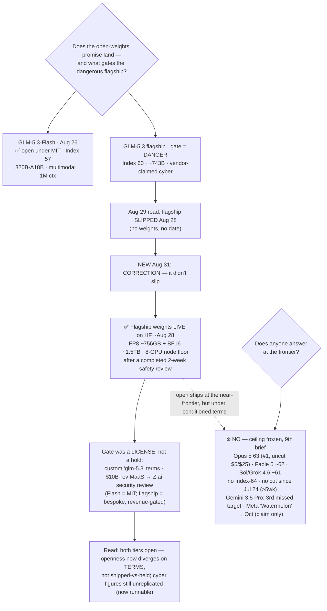

# LLM Updates — 2026-Aug-31

Monday brief, written Mon Aug 31 (Los Angeles time). For seven weeks the series has tracked two
frozen questions. **Does anyone answer at the frontier?** — no Index-64 model and no flagship price
cut since Claude Opus 5 took #1 on Jul 24. And **does the open-weights promise land?** — which ran
through a chain of gates: Kimi K3 was *open but not runnable* (hardware, Jul-30), Qwen3.8-27B was
*runnable but unproven* until Aug-17 cleared it, and GLM-5.3 was the hard case — *held because it's
dangerous*, its weights kept back on a safety timer after Z.ai's own evaluation surfaced emergent
offensive-cyber capability (Aug-24 §1), a model Artificial Analysis then *measured* at Index 60,
joint-top open weights and three points off the closed #1 (Aug-26 §1). The Aug-29 brief read the
≈Aug-28 decision as a **split**: GLM-5.3-**Flash** shipped open under MIT (Aug 26), while the
**flagship** appeared to miss its Aug-28 date — reported as a *slip*, no weights, no new date.

**This window resolves that decision, and it revises the Aug-29 read.** The flagship did **not** stay
held. `zai-org/GLM-5.3` went from a countdown placeholder to a **real, downloadable checkpoint** —
FP8 (~756 GB) and BF16 (~1.5 TB) builds in safetensors — **timestamped ~15:22–16:00 UTC on Aug 28**,
with Z.ai's own post announcing "GLM-5.3 is now open-weight… our most capable model for agentic coding
and cyber defense" and citing a **completed two-week safety review** (§1). So the Aug-29 §1 "slip"
call is **superseded**: reporting at that moment showed no publish, but the checkpoint was in fact
posted essentially *on* the Aug-28 target, and the index has since caught up (§1, correction note).
The open-weights question therefore resolves not as *split by shipped-vs-held* but as **split by
license**: **both GLM-5.3 tiers are now open — Flash under MIT, the flagship under a bespoke
"glm-5.3" license** whose commercial grant carries a **$10B-trailing-12-month-revenue trigger**: any
Model-as-a-Service operator above that line must **pass a Z.ai security review** before commercial use
(§1). The danger gate, in the end, **didn't block release — it shaped the terms.** The safe tier got
the freest license there is; the frontier-adjacent, cyber-capable tier got a revenue-gated,
safety-conditioned one. And a second gate persists on the flagship regardless of license: at ~756 GB
FP8 it needs an **8-GPU Hopper-or-newer node** to run — open, but not casually runnable, like Kimi K3.

**Meanwhile the closed ceiling stays frozen for a 9th straight brief.** Opus 5 still #1 at Index
**63**, uncut ($5/$25); **no Index-64 model and no flagship price cut since Jul 24** — now over five
weeks; **Fable 5 ~62**, **GPT-5.6 Sol / Grok 4.6 ~61** below it (§2). **Gemini 3.5 Pro is still off the
board** — a "coming soon" marker and a third missed target, unmoved (§2). Meta's "Watermelon" holds its
**October** date, its "Hatch" consumer-agent platform now reported "weeks" away at up to **$199.99/mo** —
still a claim, no card (§2). Every substantive move this window was, once again, **below** the ceiling.

This report advances only what is **new since Aug-29.** It does **not** re-derive GLM-5.3's independent
Index 60 and agentic Elo (Aug-26 §1), its cyber finding and the weights-hold cause (Aug-24 §1),
GLM-5.3-Flash's shape and MIT drop (Aug-29 §1), the GLM-5.3 launch (Aug-16 §2), or the frozen-ceiling
composition (Aug-26 §2 / Aug-29 §2) — those are unchanged and pointed to in §4.

![Two-lane diagram showing Z.ai's GLM-5.3 open-weights question resolving fully: both capability tiers are now open, on divergent licenses. The top lane, amber and marked "shipped, conditioned," is the GLM-5.3 flagship — Intelligence Index 60, about 743 billion parameters with 39 billion active, vendor-claimed offensive-cyber capability; its Hugging Face repository went from placeholder to a real downloadable checkpoint, an FP8 build near 756 gigabytes and a BF16 build near 1.5 terabytes, timestamped about 15:22 to 16:00 UTC on August 28, under a custom "glm-5.3" license rather than MIT, with a completed two-week safety review and a clause requiring any Model-as-a-Service operator above 10 billion dollars trailing-twelve-month revenue to pass a Z.ai security review before commercial use, and an eight-GPU node needed to run it. A correction note states this supersedes the prior brief's slip call: the weights did land, essentially on the August 28 target, and reporting has since caught up. The bottom lane, teal and marked "shipped, MIT," is GLM-5.3-Flash, formerly the anonymous Ox Alpha endpoint — Index 57, a 320-billion-parameter mixture-of-experts with 18 billion active, natively multimodal, one-million-token context, open under MIT since August 26. A center label states the danger gate did not block release; it shaped the license — the safe tier gets MIT and the frontier-adjacent cyber tier gets bespoke, revenue-gated terms. A footer notes the closed ceiling stayed frozen for a ninth straight brief, with Opus 5 at 63 still number one and uncut at five and twenty-five dollars, no Index-64 model and no flagship price cut since July 24, Gemini 3.5 Pro still absent on a third missed target, and Meta's Watermelon holding an October date with a Hatch consumer-agent platform priced up to 199.99 dollars a month.](glm53_flagship_ships_gate_was_a_license.svg)

---

## 1. The flagship shipped — the gate was a *license*, not a hold (correcting Aug-29 §1)

Aug-29 closed the ≈Aug-28 decision as a split: Flash open under MIT, the flagship apparently slipping
its date "with no weights published and no new date confirmed." **That flagship half was wrong, and
this brief corrects it.** The `zai-org/GLM-5.3` repository is now a **real checkpoint, not a
placeholder** — Z.ai published the flagship's open weights, and its own account announced it directly:
"GLM-5.3 is now open-weight" ([Z.ai / X](https://x.com/Zai_org/status/2093354097122455713);
[Decrypt "China's Z.AI ships GLM-5.3, calling it the top open-weight coding model"](https://decrypt.co/375684/china-z-ai-glm-5-3-top-open-weight-coding-model);
[Yahoo/Decrypt syndication](https://tech.yahoo.com/ai/gemini/articles/chinas-z-ai-ships-glm-200113836.html)).

**What actually landed, and when.** Multiple independent trackers put the repo's transition from
countdown to downloadable safetensors at **~15:22–16:00 UTC on Aug 28** — i.e. **essentially on the
target the Aug-29 brief reported as missed**
([kingy.ai "GLM-5.3 weights are out — but running them takes eight GPUs"](https://kingy.ai/blog/glm-5-3-specs-benchmarks-api-how-to-use/);
[digitalapplied "GLM-5.3's weights are out. The licence is not MIT"](https://www.digitalapplied.com/blog/glm-5-3-weights-bespoke-license-not-mit)).
The checkpoint ships in **both FP8 (~756 GB) and BF16 (~1.5 TB)** builds
([Spheron GPU-cloud deploy guide](https://www.spheron.network/blog/deploy-glm-5-3-gpu-cloud/)). So the
verifiable event is now the opposite of Aug-29's: **the weights are on Hugging Face, downloadable, on
or about the promised date.** The most likely explanation for the earlier read is timing — at Aug-29
compilation the search index still carried the pre-publish "delay" reporting (implicator.ai / MindStudio,
cited Aug-29), and the checkpoint (timestamped Aug 28) had not yet propagated. *This is a correction:
the flagship is open.*

**The license is the real story — and it's not MIT.** Where Flash shipped under plain MIT, the
flagship ships under a **bespoke "glm-5.3" license**. Commercial use is permitted for the overwhelming
majority of users, but the text adds a **revenue-gated safety trigger**: if a licensee (or its
affiliates) runs a *Model-as-a-Service* business and their **aggregate revenue exceeds $10 billion over
any trailing 12 months**, they must **pass a Z.ai security review** before any commercial use of the
weights or derivatives — with the scope and method of that review "reasonably determined by Z.ai," and
**no published criteria, timeline, or appeal** in the text
([The New Stack "Z.ai's GLM-5.3 goes open weight, but its new license aims at hyperscalers"](https://thenewstack.io/zai-glm-weights-license/);
[GLM-5.3 LICENSE on Hugging Face](https://huggingface.co/zai-org/GLM-5.3/raw/main/LICENSE);
[digitalapplied](https://www.digitalapplied.com/blog/glm-5-3-weights-bespoke-license-not-mit)). In
practice this is a **hyperscaler clause** — a narrower cousin of the user-count triggers in licenses
like Llama's — that touches essentially no self-hosting team but conditions the largest MaaS operators.

**Why this reframes the whole open-weights question.** For three briefs GLM-5.3 read as a single hard
case: a measured joint-#1 open model *held* for a claimed danger. Aug-29 split it into shipped-Flash /
held-flagship. **This window collapses that split on the shipped axis and re-opens it on the license
axis:** *both* tiers are open, but the danger gate that looked like a hold turned out to be a **licensing
decision plus a two-week safety review**, after which the weights went out. The lab didn't withhold its
cyber-capable frontier model — it **shipped it under terms** (revenue-gated, safety-conditioned) that MIT
doesn't carry. So the summer's open drops now **diverge on *terms*, not on shipped-vs-held**:

| | GLM-5.3-Flash | GLM-5.3 (flagship) |
|---|---|---|
| Status | **open** (Aug 26) | **open** (Aug 28) |
| License | **MIT** | **custom "glm-5.3"** ($10B-rev MaaS → Z.ai security review) |
| Params | 320B MoE / 18B active | **~743B MoE / ~39B active** |
| AA Intelligence Index | 57 | **60** (joint-top open) |
| Modality / context | multimodal / 1M | text / 200K |
| Weights size | (Flash tier) | **~756 GB FP8 / ~1.5 TB BF16** |
| Run floor | 4× H200 / 8× H100 | **8-GPU Hopper+ node** |

**The hardware gate persists on the flagship regardless of the license.** At ~756 GB in FP8 the
checkpoint already exceeds two H200s (282 GB) before any KV cache; the realistic floor is an **8-GPU
Hopper-or-newer node**, which is also what Z.ai's own serving guidance targets
([kingy.ai](https://kingy.ai/blog/glm-5-3-specs-benchmarks-api-how-to-use/);
[Spheron](https://www.spheron.network/blog/deploy-glm-5-3-gpu-cloud/)). So the flagship joins Kimi K3 in
the *open-but-heavy* bucket: the weights are free to download, but running them is a data-center exercise,
not a workstation one. Nathan Lambert's read frames the broader pattern — three Chinese frontier labs
(DeepSeek V4-Pro, GLM-5.3, Kimi K3) now shipping near-frontier open weights on a weekly cadence, but with
their **openness models diverging rather than converging**
([Interconnects "GLM-5.3: how Chinese labs keep stride with the frontier"](https://www.interconnects.ai/p/glm-53-how-chinese-labs-keep-stride)).
GLM-5.3's license is the sharpest instance of that divergence to date.

**What is now shipped vs still claimed, after this window:**

- **Shipped & open (verifiable):** GLM-5.3 **flagship** weights on HF (FP8 + BF16), **~Aug 28**, under
  the **custom "glm-5.3" license** with the $10B-revenue security-review trigger — *and* GLM-5.3-**Flash**
  under MIT (Aug 26, from Aug-29 §1). The Index 60 (flagship) and 57 (Flash) are third-party (AA).
- **Still vendor-claimed (no independent run):** *all* the flagship **cyber figures** — CyberGym 84.5,
  ExploitBench 54.4, the 2,436-vulnerability count, "emergent exploit-chaining" — the stated reason for
  the license clause and the safety review, **still unreplicated** (Aug-24 §1). *New angle:* now that the
  weights are downloadable, an outside CyberGym/ExploitBench run is finally **possible** — the thing that
  justifies the bespoke license can, for the first time, be checked by anyone with the hardware (watch-item #2).

## 2. What did *not* move — the ceiling, Gemini, and Meta's "Watermelon"

- **The closed ceiling — frozen a 9th straight brief.** The [Artificial Analysis Intelligence
  Index](https://artificialanalysis.ai/leaderboards/models) top is unchanged: **Opus 5 63 (#1, uncut,
  $5/$25)**, **Fable 5 ~62**, **GPT-5.6 Sol / Grok 4.6 ~61**
  ([BenchLM "Opus 5 leads at 63.0"](https://benchlm.ai/benchmarks/artificialanalysis)). **No Index-64
  model. No flagship price cut since Jul 24** — Opus 5's $5/$25 is identical to Opus 4.8's and has not
  moved in over five weeks
  ([CloudZero "same sticker, different bill"](https://www.cloudzero.com/blog/claude-opus-5-pricing/)).
  Ninth brief running, the answer to "does anyone answer at the frontier?" is still **no**, and the only
  things climbing toward the frozen line remain open or sub-flagship, not a new closed #1.
- **Gemini 3.5 Pro — still absent, still three missed targets.** No ship, no date; the DeepMind models
  page still lists **Gemini 3.1 Pro** as the current Pro tier with a "3.5 Pro coming soon" marker, still
  "testing," still past three targets (June, mid-July, early August)
  ([The AI Rankings](https://theairankings.com/google/gemini-3-5-pro/);
  [Codersera](https://codersera.com/blog/gemini-3-5-pro-launch-guide-2026/)). It remains the single most
  overdue frontier event on the board. (Google *did* ship **Gemini 3.7 Flash** to stable GA on Aug 13 —
  a Flash-tier model, not the missing Pro; noted for completeness, not a ceiling move.)
- **Meta "Watermelon" — October date holds, "Hatch" gets a price.** The codename is unchanged; what
  firmed this window is the **productization**: The Information reports Meta plans to launch its **"Hatch"**
  consumer-agent platform — a consumer version of the OpenClaw agent that taps DoorDash, Etsy, Reddit,
  Yelp and Outlook — "in the coming weeks," with a tiered plan running **up to $199.99/mo**, and to release
  the **Watermelon** model in **October**
  ([The Decoder](https://the-decoder.com/metas-paid-ai-agent-hatch-launches-soon-with-a-new-model-called-watermelon-due-in-october/);
  [The Next Web "$199.99 subscription"](https://thenextweb.com/news/meta-hatch-ai-agent-watermelon-199-subscription);
  [The Information](https://www.theinformation.com/articles/meta-plans-launch-hatch-ai-agent-platform-coming-weeks)).
  The performance claim is unchanged and still internal — **~GPT-5.5 parity on Meta's own numbers, ~10×
  the compute of Muse Spark** — no card, no benchmark, no third-party score. What's new is only the
  *pricing/positioning* (a $199.99 OpenClaw rival), not a move.
- **No new closed-frontier release in the window.** Nothing landed at or above the ceiling between Aug 29
  and Aug 31; the only concrete open-weights event was the GLM-5.3 flagship publish (§1).

## 3. Reading the two together

The top of the map still hasn't moved in nine briefs — same #1, same price, same absent Google, same
Meta codename. What sharpened this window is, again, the *open side* — but in a direction that revises
last brief's read. Aug-29 framed the ≈Aug-28 decision as a clean split: the safe tier ships (Flash,
MIT), the dangerous tier stays held. **That held-half was premature.** The flagship shipped too, on or
about its date — so the danger gate that read like a hold was, in the end, a **licensing decision**: the
cyber-capable frontier model went open under **bespoke, revenue-gated, safety-conditioned terms** after a
two-week review, while its safe sibling went open under MIT. The open-weights question therefore resolves
more completely than either "held" or "slip" implied: **both tiers are open, and the meaningful axis is
no longer *whether* a near-frontier model ships but *under what license*.** That is the first same-lab
demonstration that a lab can be maximally permissive (MIT) with the tier it judges safe and simultaneously
ship the frontier-adjacent, cyber-capable tier open *under conditioned terms* — openness differentiated by
capability, expressed through the license rather than through a hold. The irony from Aug-24 finally
releases: the single model that closed the *measured* open-to-closed gap to three points is now
downloadable — just under a license that names a $10B-revenue security-review gate, and behind a hardware
floor (8 GPUs) that keeps it a data-center object. Against that, the closed ceiling's nine-brief freeze
looks less like the whole story and more like the *stable half*: the motion that matters is still entirely
on the open side, and this window it moved from "held" to "open, on terms."

## 4. Unchanged since Aug-29 (not re-derived here)

- **GLM-5.3-Flash** — open under **MIT** (Aug 26), was "Ox Alpha"; 320B-A18B, natively multimodal, 1M
  ctx, AA Index **57**, beats GLM-5.2 across all six reported benchmarks at ~1/10 the serving cost,
  Terminal-Bench 84.3 — Aug-29 §1. *This brief adds only that its flagship sibling also shipped (§1);
  Flash's own numbers are unchanged, and third-party reviews (buildfastwithai, DataCamp, CometAPI) so far
  echo the AA Index 57 + Z.ai's coding table rather than adding an independent agentic run (watch-item #3).*
- **GLM-5.3 flagship independent Index 60** (AA): +7 vs GLM-5.2 on post-training alone, ties Kimi K3 for
  top open, −3 vs Opus 5; agentic GDPval-AA v2 Elo 1524→1770 (+246); verbose ~18.7k output tok/task —
  Aug-26 §1. *Measured on the API pre-open; the number is unchanged now that weights are out.*
- **GLM-5.3 cyber finding & the hold/license cause** (Z.ai, Aug 14 eval): CyberGym 84.5, ExploitBench
  54.4, emergent exploit-chaining, 2,436 vulns / 1,097 critical — **all still vendor-claimed, no
  independent run** — Aug-24 §1. *This brief adds that the "hold" resolved into a license clause + a
  completed 2-week review (§1); the cyber numbers themselves remain unreplicated.*
- **GLM-5.3 flagship launch** (Z.ai, Aug 14): ~743B MoE / ~39B active / 200K ctx, post-train-only on
  GLM-5, API-first via the $18/mo GLM Coding Plan — Aug-16 §2.
- **Qwen3.8-27B** independently measured — Index 52, Agentic Index 51 (beats Terra + Opus 4.8), verbose —
  Aug-18 §1 / Aug-24 §2.
- **Grok 4.6** (SpaceXAI, Aug 6): Index ~61, ceiling band, cheap end $2/$6, post-train-only — Aug-14 §1.
- **Qwen3.8-Max** open weights (Aug 12–13): degraded/gated; measured Index **56** — Aug-14 §2.
- **Kimi K3** open weights (Moonshot, Jul-26): 2.8T MoE, Modified-MIT, hardware-gated to serve, Index 60
  — Jul-30.
- **v4.1.1 grader recalibration** (Aug 6): top's absolute numbers rose ~+2 from the ruler, not the models
  — Aug-14.
- **Muse Glimmer 30B** (Meta, Aug 10): open, on-device, distilled-from-Spark agentic + DFlash — Aug-11.
- **DeepSeek V4-Flash-0731** 50/$0.28 MIT Pareto floor — Aug-03 §1.
- **Opus 5** "top quality at mid price" (Jul-24): effort dial + paid fast mode, $5/$25 — Jul-25.
- **Sonnet 5** $2/$10 pricing made permanent Aug 11 (planned September increase cancelled) — Aug-11 thread.
- **Meta "Watermelon"** codename + ~GPT-5.5-parity / ~10×-Muse-Spark claim — Aug-26 §2 / Aug-29 §2. *This
  brief adds the "Hatch" pricing (up to $199.99/mo) and OpenClaw-rival positioning (§2); still no card.*

## Watch-items into the next brief

1. **The flagship's license in practice — does the $10B-revenue security-review clause bite, and does
   Z.ai clarify the review's criteria?** The clause is novel (a revenue-gated safety gate embedded in an
   otherwise-open license) and its scope/method are "reasonably determined by Z.ai" with no published
   process (§1). Whether any hyperscaler actually trips it — and whether Z.ai publishes criteria — is the
   first real test of "open weights, conditioned terms."
2. **Independent replication of the flagship's *cyber* numbers — now finally possible.** CyberGym 84.5 /
   ExploitBench 54.4 / the 2,436-vulnerability claim remain vendor-only (Aug-24 §1), but the weights are
   now **downloadable**, so an outside CyberGym/ExploitBench run is no longer blocked by access — only by
   the 8-GPU hardware floor. This is the piece that would justify or undercut the bespoke license, and it
   is now the single most consequential open measurement on the board.
3. **Independent numbers for GLM-5.3-Flash beyond AA Index 57.** Third-party reviews so far echo the AA
   Index and Z.ai's own coding table (Terminal-Bench 84.3, DeepSWE 63.4, etc.); a genuinely independent
   agentic/coding run and a real-world read on the native multimodality + 1M context would confirm whether
   "frontier intelligence, flash cost" holds outside Z.ai's numbers.
4. **The frozen ceiling — 9th brief, no Index-64, no flagship cut since Jul 24.** Gemini 3.5 Pro's third
   missed target makes it the most overdue frontier event; Meta's "Watermelon" points at October with
   "Hatch" reportedly weeks away. A ship or credible date from either would be the first top-tier move in
   over five weeks.

---

### Method & caveats

- **Compiled** Mon Aug 31 2026 (Los Angeles time). Advances only items **new since the Aug-29 brief**;
  unchanged threads are listed in §4 with pointers, not re-derived.
- **Correction.** This brief **supersedes the Aug-29 §1 "slip" finding** on the GLM-5.3 flagship: the
  weights are on Hugging Face, downloadable, timestamped ~Aug 28 — the earlier "no weights, no date" read
  reflected pre-publish reporting that the search index has since caught up on. The corrected event is
  reflected in §1, §3, the diagram, and the mermaid flow.
- **Scraping resilience.** Direct page fetch is broadly egress-limited from this environment (Hugging Face
  and others block the proxy); all figures were taken from the **search index** and **corroborated across
  multiple independent outlets**. No quantitative claim here rests on a single source.
- **What is measured vs claimed.** **Verifiable events:** GLM-5.3 **flagship** weights on Hugging Face
  (FP8 ~756 GB + BF16 ~1.5 TB) under the **custom "glm-5.3" license** (~Aug 28); GLM-5.3-**Flash** on HF
  under **MIT** (Aug 26). **Third-party (AA):** flagship **Index 60**, Flash **Index 57**. **Vendor-
  reported (Z.ai, no independent run):** *all* the flagship **cyber figures** (CyberGym 84.5, ExploitBench
  54.4, 2,436 vulns, "emergent exploit-chaining"), and Flash's six-benchmark sweep / Terminal-Bench 84.3.
  **Meta "Watermelon"** — codename + internal claim (~GPT-5.5 parity, ~10× Muse Spark compute), October
  target, "Hatch" platform up to $199.99/mo — is unreleased with **no published benchmark**.
- **Diagrams** are a standalone theme-neutral SVG (slate/amber/teal strokes that read on light and dark
  backgrounds, no external URLs) and an inline Mermaid flowchart; both render in GitHub-flavored markdown.

### Sources

- **GLM-5.3 flagship weights now open on Hugging Face (~Aug 28)** — [Z.ai / X "GLM-5.3 is now open-weight"](https://x.com/Zai_org/status/2093354097122455713) · [Decrypt "China's Z.AI ships GLM-5.3, calling it the top open-weight coding model"](https://decrypt.co/375684/china-z-ai-glm-5-3-top-open-weight-coding-model) · [kingy.ai "GLM-5.3 weights are out — but running them takes eight GPUs"](https://kingy.ai/blog/glm-5-3-specs-benchmarks-api-how-to-use/)
- **The bespoke "glm-5.3" license ($10B-revenue MaaS → Z.ai security review)** — [The New Stack "Z.ai's GLM-5.3 goes open weight, but its new license aims at hyperscalers"](https://thenewstack.io/zai-glm-weights-license/) · [GLM-5.3 LICENSE (Hugging Face raw)](https://huggingface.co/zai-org/GLM-5.3/raw/main/LICENSE) · [digitalapplied "GLM-5.3's weights are out. The licence is not MIT"](https://www.digitalapplied.com/blog/glm-5-3-weights-bespoke-license-not-mit)
- **Weights size & the 8-GPU run floor** — [Spheron "deploy GLM-5.3 GPU cloud: setup, VRAM & cost"](https://www.spheron.network/blog/deploy-glm-5-3-gpu-cloud/) · [kingy.ai](https://kingy.ai/blog/glm-5-3-specs-benchmarks-api-how-to-use/) · [Interconnects "GLM-5.3: how Chinese labs keep stride with the frontier"](https://www.interconnects.ai/p/glm-53-how-chinese-labs-keep-stride)
- **GLM-5.3-Flash (unchanged, MIT)** — [buildfastwithai "GLM-5.3-Flash review: benchmarks, price"](https://www.buildfastwithai.com/blogs/glm-5-3-flash-review-benchmarks-price-is-it-worth-it-2026) · [DataCamp "GLM-5.3-Flash: features, benchmarks, pricing"](https://www.datacamp.com/blog/glm-5-3-flash)
- **Ceiling & leaderboard** — [Artificial Analysis LLM leaderboard](https://artificialanalysis.ai/leaderboards/models) · [BenchLM (Opus 5 63.0, #1)](https://benchlm.ai/benchmarks/artificialanalysis) · [CloudZero "Opus 5 pricing: same sticker" ($5/$25, no cut)](https://www.cloudzero.com/blog/claude-opus-5-pricing/)
- **Gemini 3.5 Pro delay** — [The AI Rankings "three delays and still unreleased"](https://theairankings.com/google/gemini-3-5-pro/) · [Codersera "why it's delayed (Aug 2026)"](https://codersera.com/blog/gemini-3-5-pro-launch-guide-2026/)
- **Meta "Watermelon" → October + "Hatch" ($199.99/mo)** — [The Decoder "Meta's paid AI agent Hatch launches soon, Watermelon due in October"](https://the-decoder.com/metas-paid-ai-agent-hatch-launches-soon-with-a-new-model-called-watermelon-due-in-october/) · [The Next Web "Meta's Hatch, $199 subscription"](https://thenextweb.com/news/meta-hatch-ai-agent-watermelon-199-subscription) · [The Information "Meta plans to launch Hatch in coming weeks"](https://www.theinformation.com/articles/meta-plans-launch-hatch-ai-agent-platform-coming-weeks)
