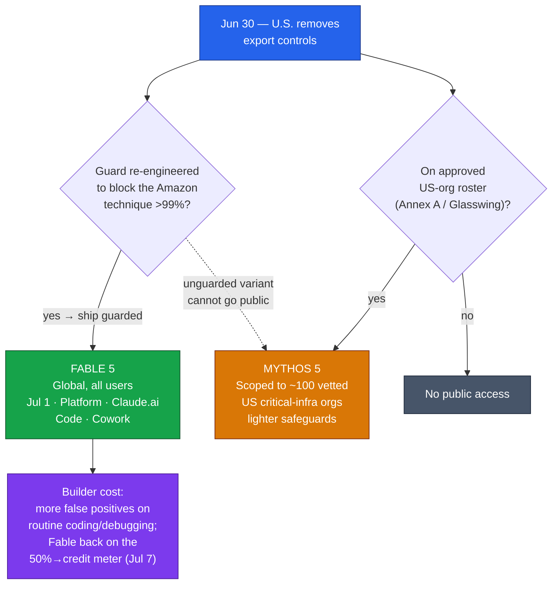

# LLM Updates — 2026-Jul-01

Wednesday brief, written Wed Jul 1 (Los Angeles time). The running story — the
Jun-12 BIS/Commerce export order and the global suspension of **Fable 5 /
Mythos 5** — has ended. It is **Day 19**, and the "no restoration date" line
that dominated three weeks of briefs is now fully obsolete: **U.S. export
controls were removed on Jun 30**, and **Fable 5 is returning globally today,
Jul 1**. The Jun-30 brief's open question — Fable 5 "on track this week,"
gated on Pentagon + NSA sign-off — resolved to *yes*.

There are two developments today, and the smaller-looking one may matter more
for builders in the long run:

1. **The suspension is over.** Fable 5 is back **worldwide** across Claude
   Platform, Claude.ai, Claude Code, and Claude Cowork. **Mythos 5 stays
   scoped** — restored only to the roster of approved U.S. critical-infra
   organizations from the Jun-26 partial lift. The *price of return* is a
   **more conservative safety classifier**.
2. **Anthropic shipped Claude Sonnet 5 on Jun 30** — the same day controls
   lifted, and largely buried under the restoration coverage. It's the new
   **default** model on claude.ai Free/Pro, positioned as a cheap agentic
   workhorse approaching **Opus 4.8** quality — with a **tokenizer change**
   that quietly erodes the "cheaper" headline.

This report does **not** re-derive the established thread. The Jun-12 export
order and the full suspension timeline (Jun-15 → Jun-30), the **Amazon
jailbreak trigger** (Jun-19 §1), the **shared-weights + cyber/bio/distillation
classifier-gate architecture that routes flagged queries to Opus 4.8** (Jun-11
§2, Jun-13), **Project Glasswing** (Jun-08 §7, Jun-24 §1), the **EAR §744.22 vs
IEEPA** legal-basis debate (Jun-25 §2), the **Jun-26 first partial lift**
(Mythos 5 → ~100 defenders via an Annex A license exception, Jun-30 §1), the
**free → usage-credit pricing cliff** (Jun-22 §1), and the **Sakana Fugu /
Fugu Ultra** orchestration story (Jun-25 §1) are all covered earlier. Here we
advance only what is **new or sharpened since Tuesday**.

---

## 1. The suspension ends — Fable 5 global, Mythos 5 scoped, guarded harder

On **Jun 30** the U.S. government **removed the export controls** that forced
the June suspension. Anthropic's response is a **two-track restoration** whose
asymmetry is the whole story:

- **Fable 5 — global, guarded product.** Returns worldwide **today (Jul 1)**
  across Claude Platform, Claude.ai, Claude Code, and Claude Cowork. This is
  the model millions actually used, the one that had been dark everywhere.
- **Mythos 5 — scoped, lighter-safeguard variant.** *Not* returning to the
  public. It remains restricted to the set of approved U.S. organizations
  cleared in the **Jun-26** partial lift, with Anthropic "continuing
  discussions to expand the list of **Project Glasswing** partners." Mythos 5
  is the more capable, lighter-guarded build for identifying security flaws,
  and is "not intended for the general public."

Note the **inversion has completed and now reads cleanly**. On Jun 26 the
*safeguard-free* Mythos 5 came back **first** (to ~100 vetted defenders,
license-free); on Jul 1 the *guarded* Fable 5 comes back to **everyone**. In
hindsight the ordering is exactly what the mechanism implies: Mythos-to-
defenders was a scoped **EAR license exception** to a trusted roster and needed
no product change; **Fable-to-the-world required re-engineering the guard
first**. You cannot ship the unguarded model to the public, and you cannot ship
the public model until its guard is fixed.

**What actually changed to earn the global return — the strengthened
classifier.** The suspension trigger (Jun-19 §1) was an Amazon finding that a
prompt could bypass Fable 5's safeguards to identify a vulnerability and, in
one case, produce exploit code. Anthropic says it worked with the U.S.
government, Amazon, and other partners to harden the model before restoring it.
The concrete result:

- The new classifier now **blocks the flagged technique in more than 99% of
  cases** (up from a guard the Amazon report defeated).
- It is **deliberately more conservative** than its predecessor and will
  **produce more false positives on routine coding and debugging** — tasks that
  previously passed without issue.

That second bullet is the builder-facing cost, and it is worth stating plainly:
**the price of Fable 5's return is a more trigger-happy guard.** The Jun-11/13
architecture thread described a classifier-gate that routes flagged queries to
Opus 4.8; that gate is now tuned tighter. Teams that leaned on Fable 5 for
security-adjacent or low-level code work should expect more refusals and
fallbacks than in the pre-Jun-12 era, and should budget for it.

**Pricing on return — the free→credit cliff, revisited.** Consistent with the
Jun-22 §1 thread: Fable 5 is included for up to **50% of weekly usage limits**
on Pro, Max, Team, and select Enterprise plans **through Jul 7**, after which
it **moves to usage credits**. The restoration does not reset that meter — it
resumes it.

**Net:** the three-week export saga closes with the guarded model global and the
unguarded model fenced — the resolution shape the briefs predicted (scoped,
verified access for the dangerous build; open access for the safe one), reached
via a roster rather than the once-floated Jul-8 Persona ID door.

---

## 2. Claude Sonnet 5 — the launch the restoration overshadowed

Also on **Jun 30**, Anthropic shipped **Claude Sonnet 5** (`claude-sonnet-5`),
its "most agentic Sonnet yet." It is the **new default for Free and Pro** users
on claude.ai and is live in **Claude Code, the Claude API, Cursor, VS Code, and
GitHub Copilot**. The pitch: near-**Opus 4.8** quality at a fraction of the
cost, aimed squarely at long-horizon agent workloads.

**Specs and price:**

- **1M-token context**; **128k max output** (raisable to **300k** via the
  batch-API beta header `output-300k-2026-03-24`).
- **Introductory pricing $2 / $10** per million input/output tokens **through
  Aug 31, 2026**, then **$3 / $15** — the same rate card Sonnet 4.6 carried.

**Benchmarks (vendor-reported):**

| Benchmark | Sonnet 5 | Comparison |
|---|---|---|
| SWE-bench Pro | **63.2** | GPT-5.5 58.6 · Gemini 3.5 Flash 55.1 |
| Terminal-Bench 2.1 | **80.4** | GPT-5.5 **83.4** (edges Sonnet 5) |
| GDPval-AA v2 (knowledge work) | **1,618** | Opus 4.8 1,615 (Sonnet 5 nudges ahead) |
| OSWorld-Verified (computer use) | **81.2%** | Sonnet 4.6 78.5% |

The headline for agent builders is the **+20.7-point Terminal-Bench jump** over
its predecessor — real-terminal, multi-step tool-use is exactly the workload
Sonnet 5 is tuned for. On knowledge work (GDPval) it edges **Opus 4.8**, which
is the "approaching the flagship for less" claim made concrete.

**The catch — the tokenizer.** Sonnet 5 ships a **new tokenizer** that emits
roughly **1.0–1.35× more tokens** for the same text (about **30%** more on
typical content). So even though the **per-token rate card is unchanged** from
Sonnet 4.6, **real per-task spend can be higher**. The "cheaper agent" framing
is true against Opus 4.8, but against Sonnet 4.6 the savings are partly a
tokenizer illusion — model the token delta before assuming a cost cut.

**Where it sits vs the running coding thread.** On the *standardized* SWE-bench
Pro axis the briefs have tracked (Jun-23 §, Jun-30 §4), Sonnet 5's **63.2**
trails Sakana's **Fugu Ultra (73.7)** and Fable 5's **80.0** — consistent with
its positioning. Sonnet 5 is not the frontier scorer; it's the **cheap,
fast, agentic default** meant to run the loop, not top the leaderboard. The
frontier-vs-workhorse split inside Anthropic's own lineup is now explicit:
Opus 4.8 / Fable 5 for peak capability, Sonnet 5 for volume.

---

## 3. Frontier & open-weights watch (brief)

Nothing here displaces the two headliners; recap-only items (DeepSeek V4,
GLM-5.2, MiniMax M3, Fugu) live in prior briefs. New/sharpened data points:

- **Open-weights leaderboard, unchanged at the top.** On Artificial Analysis's
  Intelligence Index, **GLM-5.2 (max)** remains the leading open-weights model
  at **51**, ahead of **MiniMax-M3 (44)** and **DeepSeek V4-Pro (44)** — the
  same ordering the Jun-19 §2 brief established, still holding two weeks on.
- **Nemotron 3 Ultra (NVIDIA)** is the notable open-model mention this cycle:
  a hybrid-architecture MoE with **~55B active of ~550B total**, praised for its
  capability-to-efficiency ratio. It slots into the same **hybrid-attention /
  long-context-efficiency** trend (Mamba-2 + attention interleaving, KV
  sharing, compressed attention) the architecture briefs have been tracking.
  Not a frontier-topping score, but a strong efficiency data point.

The through-line for the quarter is stable: **the open-weights band keeps
tightening under the vendor frontier**, while the closed frontier (Opus 4.8,
Fable 5, and now the cheaper Sonnet 5) competes on agentic reliability and
cost, not raw benchmark peaks.

---

## Bottom line

- **The export saga is over (Day 19).** Controls removed **Jun 30**; **Fable 5
  global today**; **Mythos 5 stays scoped** to approved U.S. defenders. The
  guarded model went worldwide, the unguarded one stayed fenced — as predicted.
- **The cost of return is a tighter guard.** Fable 5's new classifier blocks the
  flagged technique **>99%** of the time but is **more conservative** — expect
  **more false positives** on routine coding. And it's back on the **50%→credit**
  meter (Jul 7).
- **Sonnet 5 is the quiet-but-real story.** New **default** agentic model, near
  Opus 4.8 on knowledge work, **+20.7** on Terminal-Bench — but the **new
  tokenizer (~30% more tokens)** means "cheaper than Sonnet 4.6" needs checking
  per workload.

---

## Sources

**Fable 5 / Mythos 5 restoration (Jun 30 – Jul 1):**
- [CoinDesk — Anthropic restores AI models Fable, Mythos after the U.S. lifts export controls](https://www.coindesk.com/tech/2026/07/01/anthropic-restores-ai-models-fable-mythos-after-the-u-s-lifts-export-controls)
- [Anthropic — Statement on the US government directive to suspend access to Fable 5 and Mythos 5](https://www.anthropic.com/news/fable-mythos-access)
- [The Hacker News — Anthropic Restores Claude Fable 5 After U.S. Lifts Jailbreak-Linked Export Controls](https://thehackernews.com/2026/07/anthropic-restores-claude-fable-5-after.html)
- [The Next Web — US lifts export controls on Anthropic's Fable 5, clearing the model's return](https://thenextweb.com/news/anthropic-fable-5-export-controls-lifted)
- [The New Stack — How Anthropic is bringing Fable 5 back — and when it'll cost you](https://thenewstack.io/how-anthropic-is-bringing-fable-5-back/)
- [Let's Data Science — Anthropic Restores Claude Fable 5 with Tighter Safeguards](https://letsdatascience.com/news/anthropic-restores-claude-fable-5-with-tighter-safeguards-d2af0550)
- [UC Today — Anthropic Restores Fable 5 and Mythos: What Enterprises Need to Know](https://www.uctoday.com/security-compliance-risk/anthropic-restores-fable-5-and-mythos-what-enterprises-need-to-know/)
- [Digital Trends — Anthropic finally brings back Claude Fable 5, with a temporary usage limit](https://www.digitaltrends.com/computing/youll-be-able-to-use-claude-fable-5-again-starting-july-1/)
- [MediaNama — US Lifts Export Controls on Anthropic Claude Fable 5 and Mythos 5](https://www.medianama.com/2026/07/223-us-government-anthropic-claude-fable-5-export-controls-lifted/)

**Claude Sonnet 5 (Jun 30):**
- [TechCrunch — Anthropic launches Claude Sonnet 5 as a cheaper way to run agents](https://techcrunch.com/2026/06/30/anthropic-launches-claude-sonnet-5-as-a-cheaper-way-to-run-agents/)
- [MarkTechPost — Claude Sonnet 5 vs Sonnet 4.6 vs Opus 4.8: agentic coding benchmarks, pricing, tradeoffs](https://www.marktechpost.com/2026/06/30/anthropic-claude-sonnet-5-vs-sonnet-4-6-vs-opus-4-8-agentic-coding-benchmarks-api-pricing-and-cost-performance-tradeoffs-compared/)
- [Claude Platform Docs — What's new in Claude Sonnet 5](https://platform.claude.com/docs/en/about-claude/models/whats-new-sonnet-5)
- [Yellow.com — Claude Sonnet 5 Challenges Opus 4.8, But Token Costs Complicate The Math](https://yellow.com/news/claude-sonnet-opus-token-costs)
- [InfoWorld — Claude Sonnet 5 boosts coding, reasoning, and tool use](https://www.infoworld.com/article/4191331/claude-sonnet-5-boosts-coding-reasoning-and-tool-use.html)
- [DataCamp — Claude Sonnet 5: Features, Benchmarks, and Pricing](https://www.datacamp.com/blog/claude-sonnet-5)

**Frontier & open-weights watch:**
- [Artificial Analysis — LLM Leaderboard](https://artificialanalysis.ai/leaderboards/models)
- [MindStudio — DeepSeek V4 Launch: specs of the most disruptive open-weight model of 2026](https://www.mindstudio.ai/blog/deepseek-v4-launch-specs-open-weight-2026)
- [Sebastian Raschka — Recent Developments in LLM Architectures: KV Sharing, mHC, and Compressed Attention](https://magazine.sebastianraschka.com/p/recent-developments-in-llm-architectures)

*Note: several publisher URLs (CoinDesk, The New Stack, TechCrunch, MarkTechPost,
Anthropic newsroom) returned HTTP 403 to automated fetching in this session;
their factual content above is drawn from search-result summaries and is cited
for the reader. Figures are vendor-reported unless otherwise stated.*
