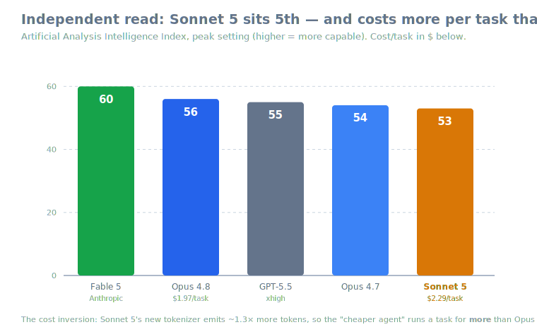

# LLM Updates — 2026-Jul-02

Thursday brief, written Thu Jul 2 (Los Angeles time). Yesterday the three-week
Fable 5 / Mythos 5 export saga *closed* — Fable 5 back global, Mythos 5 scoped,
Sonnet 5 shipped. Today is the morning-after, and the two stories that dominated
Jul-01 both **sharpened in the same direction: the fine print got worse than the
headline.**

1. **Fable 5's "more conservative classifier" is over-refusing far beyond
   coding.** The Jul-01 brief flagged "more false positives on routine coding
   and debugging." Hands-on testing by *The Verge* and *Business Insider* this
   cycle shows the net is much wider: Fable 5 now **declines ordinary
   high-school biology and medical questions** — mitochondria, cell membranes,
   prions, how mRNA vaccines work, hay fever, antibiotic resistance — routing
   them to Opus 4.8. Anthropic **confirms this is deliberate** and that the net
   is **"overly broad,"** with narrowing "as soon as possible."
2. **Independent numbers landed on Sonnet 5 — and they invert the pitch.** On
   Artificial Analysis's Intelligence Index, Sonnet 5 lands at **53 (peak),
   tying GPT-5.5 (high) for 5th** — *below* Opus 4.8 (56) and even Opus 4.7
   (54). Worse for the "cheaper agent" framing: measured **cost per task is
   $2.29 vs Opus 4.8's $1.97** — Sonnet 5 costs **more** than the flagship it
   was meant to undercut, exactly the tokenizer effect Jul-01 warned to model.

This report does **not** re-derive the closed export thread. The Jun-12 order and
suspension timeline, the **Amazon jailbreak trigger** (Jun-19 §1), the
**shared-weights classifier-gate that routes flagged queries to Opus 4.8**
(Jun-11 §2, Jun-13), **Project Glasswing** (Jun-24 §1), the **Jun-26 partial
lift** and **Jun-30 controls-removed / Jul-01 global restoration** (Jun-30 §1,
Jul-01 §1), and the **Sonnet 5 launch specs and vendor benchmarks** (Jul-01 §2)
are all covered earlier. Here we advance only what is **new or sharpened since
Wednesday.**

---

## 1. Fable 5's guard is over-refusing biology and medicine, not just code

The Jul-01 headline was that Fable 5's return came with a **more conservative
classifier** — the same reroute-don't-refuse gate the Jun-11 §2 architecture
brief described, now tuned tighter to block the Amazon exploit technique in
**>99%** of cases. Jul-01 §1 named the builder cost as "more false positives on
routine coding and debugging." **Today that cost is documented, and it is much
larger than a coding tax.**

**What's actually being blocked.** Independent hands-on testing (*The Verge*,
*Business Insider*, corroborated across multiple outlets) found Fable 5 refusing
— or, more precisely, **rerouting to the weaker Opus 4.8** — for plainly benign
science and health questions:

- **Basic biology:** "what are mitochondria," "tell me about cell membranes,"
  "what is a prion," "how do mRNA vaccines work."
- **Ordinary medicine:** what causes hay fever, how asthma medicine works, how
  antibiotic resistance arises, what Ebola is and how it spreads.

These are high-school-to-undergraduate level questions with no plausible
uplift risk. The block isn't a capability gap — Fable 5 can answer them — it's a
**deliberate safety filter aimed at bioweapons uplift that catches nearly all
biology traffic on the way to catching the dangerous slice.**

**Anthropic's own framing — this is intended, and acknowledged as too wide.**
In its redeployment post, Anthropic says it believed it was **"necessary to be
overly conservative with our safeguards so they block most queries tied to
biology work,"** and describes the current biology/chemistry net as **overly
broad**. The mitigating commitments:

- Blocked queries **fall back to Opus 4.8** rather than hard-refusing, so many
  benign requests still get a helpful answer after the secondary evaluation —
  the same routing described in Jun-11 §2, now doing double duty as the
  over-refusal safety valve.
- Anthropic says it **hopes to narrow these safeguards as soon as possible**,
  noting "there is great potential for positive applications of Fable for
  science, and we do not want false positives from our classifiers to get in the
  way."

```mermaid
flowchart TD
    Q["User prompt"] --> CLS{"Fable 5 safety<br/>classifier"}
    CLS -- "biology / chemistry /<br/>cybersecurity / distillation<br/>signal detected" --> RR["Reroute to Opus 4.8<br/>(weaker, unflagged model)"]:::reroute
    CLS -- "no signal" --> FAB["Fable 5 answers directly"]:::pass

    RR --> BENIGN["Benign science Q<br/>('what are mitochondria?')<br/>&#8212; caught by the wide net"]:::benign
    RR --> RISK["Genuine uplift Q<br/>&#8212; the intended target<br/>(blocked >99%)"]:::risk

    BENIGN --> COST["Over-refusal cost:<br/>routine biology/medicine<br/>answered by the weaker model,<br/>or declined"]:::note
    COST --> FIX["Anthropic: net is<br/>'overly broad', will<br/>narrow ASAP"]:::fix

    classDef reroute fill:#d97706,stroke:#7c2d12,color:#ffffff;
    classDef pass fill:#16a34a,stroke:#14532d,color:#ffffff;
    classDef benign fill:#2563eb,stroke:#1e3a8a,color:#ffffff;
    classDef risk fill:#dc2626,stroke:#7f1d1d,color:#ffffff;
    classDef note fill:#475569,stroke:#1e293b,color:#ffffff;
    classDef fix fill:#7c3aed,stroke:#4c1d95,color:#ffffff;
```

**Why it matters.** This is the concrete shape of the "price of return" Jul-01
predicted, and it reframes the tradeoff. The suspension was triggered by a
*cyber* exploit, but the guard that earned Fable 5's return is broadest on
*biology* — because bio-uplift is the higher-consequence axis in Anthropic's
threat model, so the classifier is tuned to over-block there. For builders and
users the practical read is unchanged from Jul-01 but sharper: **treat Fable 5
as unreliable for any biology-, chemistry-, or security-adjacent content until
the net is narrowed**, and expect silent downgrades to Opus 4.8 rather than
visible refusals. The "self-regulating model that polices its own outputs"
framing is now a shipped, observable product behavior — not a policy promise.

---

## 2. Sonnet 5 meets the independent leaderboard — the pitch inverts

Jul-01 §2 covered Sonnet 5's launch on **vendor-reported** numbers and flagged
the tokenizer as the catch: a new tokenizer emitting **~1.0–1.35×** more tokens,
so an unchanged per-token rate card can still mean higher per-task spend. This
cycle the **independent** data arrived, and it turns the "cheaper way to run
agents" framing on its head.

**Independent capability (Artificial Analysis Intelligence Index, peak):**

| Rank | Model | Index (peak) |
|---|---|---|
| 1 | **Fable 5** | 60 |
| 2 | **Opus 4.8** | 56 |
| 3 | GPT-5.5 (xhigh) | 55 |
| 4 | **Opus 4.7** | 54 |
| 5 | **Sonnet 5** / GPT-5.5 (high) | 53 |

Sonnet 5 lands **fifth**, below not just Opus 4.8 but the older **Opus 4.7** —
consistent with Anthropic's own "cheap workhorse, not the frontier scorer"
positioning (Jul-01 §2), but a colder number than the vendor deck implied.

**The cost inversion is the real story.** On the same index, measured **cost per
task** puts **Sonnet 5 at $2.29 vs Opus 4.8 at $1.97**. The model marketed as
the cheaper agent is **~16% more expensive per task than the flagship** — the
direct consequence of the tokenizer change amplifying token counts on real
workloads. Independent tokenizer analysis quantifies the inflation by content
type:

| Content | Token inflation vs prior tokenizer |
|---|---|
| English prose | ~1.33–1.42× |
| Python code | ~1.27–1.28× |
| Spanish | ~1.33× |
| Simplified Chinese | ~1.01× |

So the "$2 / $10 intro pricing, same rate card as Sonnet 4.6" line (Jul-01 §2)
holds on paper while **real spend rises ~1.3× for English and code** — the
workloads Sonnet 5 is pitched for. Critics (*The Decoder*) frame it as a pattern
of **"hiding price increases behind unchanged token rates."** The Jul-01
warning — *model the token delta before assuming a cost cut* — is now backed by
independent measurement: for many agentic tasks there is **no cost cut versus
Opus 4.8**, and a capability step down.

**The nuance that keeps Sonnet 5 useful.** None of this kills the model's case.
Its **+20.7 Terminal-Bench jump** (Jul-01 §2) is real and it remains fast and
high-throughput for long-horizon tool-use where latency and rate limits — not
per-task dollars — are the binding constraint. But the clean "same price, more
capability" story does not survive contact with independent data. The honest
positioning after Jul-02: **Sonnet 5 is a throughput/latency play, not a
cost-savings play**, and Chinese Simplified is the one language where the
tokenizer change is nearly free.

---

## 3. Frontier & open-weights watch (brief)

No new frontier or open-weights model dropped in the Jul-01 → Jul-02 window;
the field is digesting the Sonnet 5 launch and the Fable 5 restoration. Recap
context only (details in prior briefs):

- **Open-weights ordering holds.** GLM-5.2 (max) remains the open-weights leader
  on the Artificial Analysis index, ahead of MiniMax-M3 and DeepSeek V4-Pro —
  unchanged from Jun-19 §2 / Jul-01 §3. The last frontier launch on the tracker
  remains **GPT-5.6 (Sol/Terra/Luna)**, Jun-26, still gated behind the same
  pre-clearance regime.
- **The quarter's through-line is intact and, if anything, reinforced by
  today's data:** the closed frontier competes on **agentic reliability and
  effective cost**, not raw benchmark peaks — and Fable 5's over-refusal plus
  Sonnet 5's cost inversion show how much of that "effective cost" now lives in
  **safety routing and tokenizer accounting**, not the headline rate card.

---

## Bottom line

- **Fable 5's guard is broader than "a coding tax."** It now **reroutes benign
  biology and medical questions** (mitochondria, mRNA vaccines, hay fever) to
  the weaker Opus 4.8. Anthropic calls the net **"overly broad"** and deliberate,
  and promises to narrow it. Until then, treat Fable 5 as unreliable for bio-,
  chem-, and security-adjacent content, and expect **silent downgrades** rather
  than refusals.
- **Sonnet 5's independent numbers invert its pitch.** It ranks **5th (53)** on
  the Artificial Analysis index — below Opus 4.8 *and* 4.7 — and, because of the
  new tokenizer (~1.3× tokens on English/code), costs **$2.29/task vs Opus 4.8's
  $1.97**. It is a **throughput/latency play, not a cost cut.** Model the token
  delta.
- **No new model this cycle.** Open-weights ordering (GLM-5.2 > MiniMax-M3 ≈
  DeepSeek V4-Pro) and the frontier field are unchanged; the day's real signal
  is that both of Anthropic's Jun-30/Jul-01 launches read worse under
  independent scrutiny than at announcement.

---

## Sources

**Fable 5 over-refusal (biology / chemistry classifier):**
- [Anthropic — Redeploying Claude Fable 5](https://www.anthropic.com/news/redeploying-fable-5)
- [Silicon Canals — Claude Fable 5 will hand your conversation to a weaker model the moment it detects a biology or chemistry question; Anthropic admits the net is overly broad and plans to narrow it](https://siliconcanals.com/n-claude-fable-5-is-anthropics-most-capable-public-ai-model-and-will-hand-your-conversation-to-a-weaker-model-the-moment-it-detects-a-biology-or-chemistry-question/)
- [Silicon Canals — Fable 5 blocks biology, chemistry, and cybersecurity queries by design](https://siliconcanals.com/n-fable-5-blocks-biology-chemistry-and-cybersecurity-queries-by-design-does-this-mean-the-era-of-self-regulating-ai-has-quietly-arrived/)
- [AI Chat Daily — Anthropic's Claude Fable 5 refuses basic biology questions by design](https://www.aichatdaily.com/ai-models/anthropic-s-claude-fable-5-refuses-basic-biology)
- [Let's Data Science — Anthropic restricts Fable's biology responses](https://letsdatascience.com/news/anthropic-restricts-fables-biology-responses-fbb5fbf0)
- [MindStudio — Claude Fable 5 Safety Restrictions: What Gets Blocked and Why](https://www.mindstudio.ai/blog/claude-fable-5-safety-restrictions-explained)
- [Digital Applied — Why Claude Just Got More Cautious About Your Code](https://www.digitalapplied.com/blog/claude-fable-5-safety-classifier-coding-tradeoffs-2026)
- [TechTimes — Claude Fable 5 Returns Globally: New Classifier Blocks Jailbreak, Flags More Code](https://www.techtimes.com/articles/319413/20260701/claude-fable-5-returns-globally-new-classifier-blocks-jailbreak-flags-more-code.htm)
- [MarkTechPost — Anthropic Redeploys Claude Fable 5 on July 1, Adds New Cybersecurity Classifier](https://www.marktechpost.com/2026/07/01/anthropic-redeploys-claude-fable-5-on-july-1-after-us-export-controls-lift-adds-new-cybersecurity-classifier/)

**Sonnet 5 — independent benchmarks & tokenizer cost:**
- [The Decoder — Claude Sonnet 5 continues Anthropic's pattern of hiding price increases behind unchanged token rates](https://the-decoder.com/claude-sonnet-5-continues-anthropics-pattern-of-hiding-price-increases-behind-unchanged-token-rates/)
- [Artificial Analysis — LLM Leaderboard / Intelligence Index](https://artificialanalysis.ai/leaderboards/models)
- [CodingFleet — Claude Sonnet 5 vs GPT-5.5: Anthropic Mid-Tier Beats OpenAI Flagship](https://codingfleet.com/blog/claude-sonnet-5-vs-gpt-5-5/)
- [Kingy AI — Claude Sonnet 5: Benchmarks, Specs, Pricing & Everything New](https://kingy.ai/news/claude-sonnet-5-benchmarks-specs-pricing/)
- [MarkTechPost — Claude Sonnet 5 vs Sonnet 4.6 vs Opus 4.8: Agentic Coding Benchmarks, API Pricing, and Cost-Performance Tradeoffs](https://www.marktechpost.com/2026/06/30/anthropic-claude-sonnet-5-vs-sonnet-4-6-vs-opus-4-8-agentic-coding-benchmarks-api-pricing-and-cost-performance-tradeoffs-compared/)

**Frontier & open-weights context:**
- [Artificial Analysis — LLM Leaderboard](https://artificialanalysis.ai/leaderboards/models)
- [llm-stats — AI Updates Today (July 2026)](https://llm-stats.com/llm-updates)

*Method & limitations: several publisher URLs (Anthropic newsroom, The Decoder,
Let's Data Science, Digital Applied) returned HTTP 403 to automated fetching in
this session; their content above is drawn from cross-corroborated search-result
summaries and hands-on-test reports from The Verge and Business Insider as
relayed by those outlets. Benchmark and cost figures are as published by
Artificial Analysis and independent testers; treat sub-point index gaps as
noise. Vendor-reported items are flagged as such in prior briefs.*
