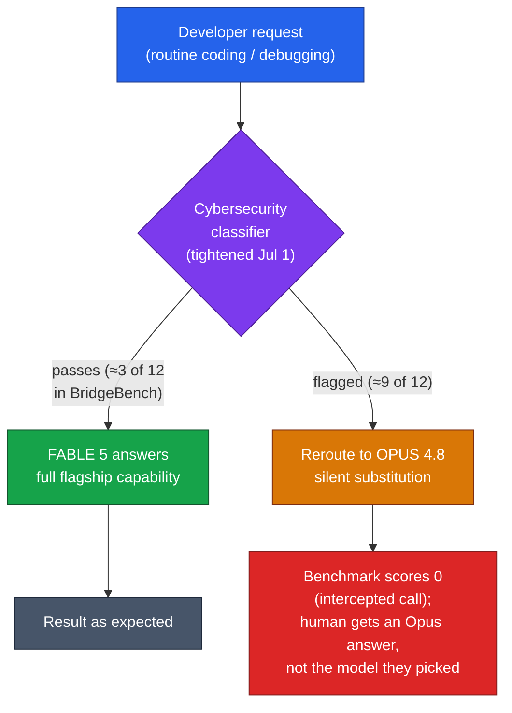
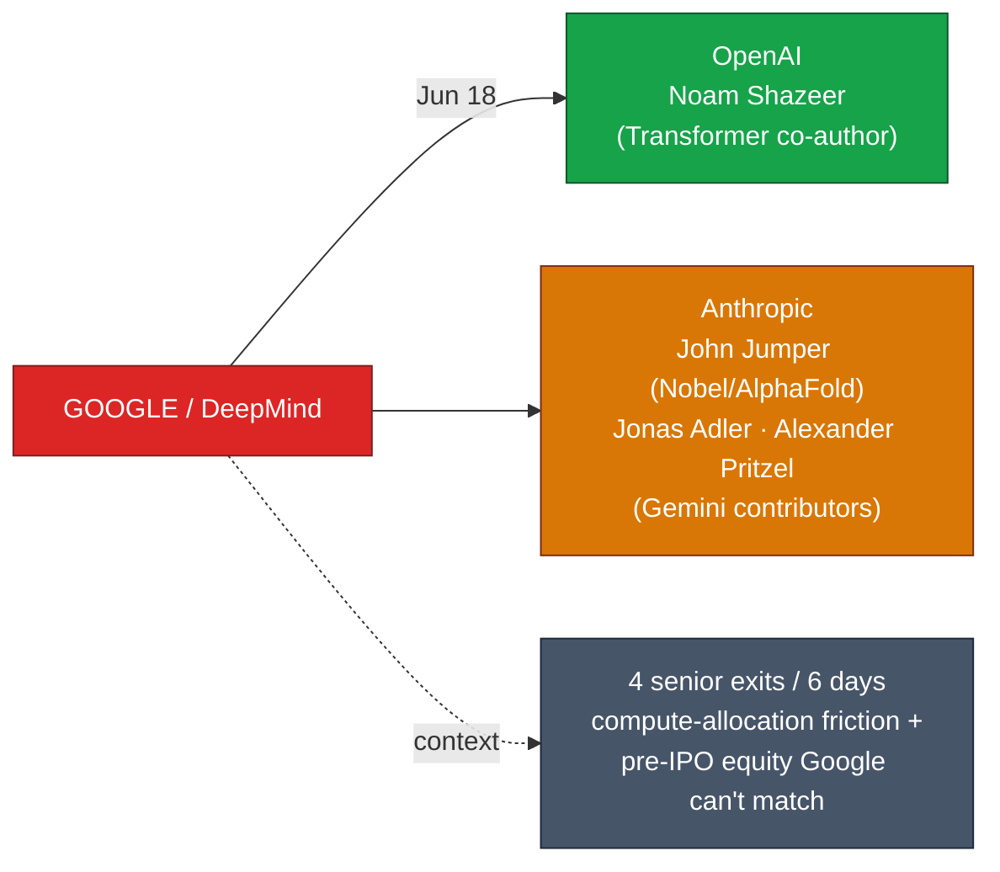

# LLM Updates — 2026-Jul-03

Friday brief, written Fri Jul 3 (Los Angeles time). Two days ago the three-week
**Fable 5 / Mythos 5** export saga closed: controls removed Jun 30, **Fable 5
back globally Jul 1** with a hardened classifier (Jul-01 §1). That brief made
one concrete prediction — the price of return would be **more false positives
on routine coding** — and left it as a forecast. It is no longer a forecast.
**Independent benchmarks published Jul 2 now measure the cost, and it is larger
than Anthropic's "small fraction" framing.**

Three things advanced since Wednesday:

1. **The guard's cost is measured, and it's steep.** BridgeMind's BridgeBench
   re-ran Fable 5 on Jul 1–2: TypeScript **debugging fell 70%** (86.2 → 25.9)
   and the model dropped from **9th to 41st of 42** — not because Fable 5 got
   worse, but because the new classifier **rerouted 9 of 12 tasks to Opus 4.8**
   before Fable 5 could answer.
2. **Google's Gemini brain drain accelerated.** Four senior AI researchers left
   in six days — **Noam Shazeer** ("Attention Is All You Need") to OpenAI,
   Nobel laureate **John Jumper** plus two Gemini contributors to **Anthropic** —
   against the backdrop of Gemini 3.5 Pro's slip and a pre-IPO-upside gap Google
   can't match.
3. **The gated-frontier pattern is generalizing.** **Gemini 3.5 Pro** is cleared
   for a **July GA** (out of Vertex enterprise preview, 2M-token context), while
   **GPT-5.6** (Sol/Terra/Luna) stays fenced behind a ~20-org preview. Staged,
   restricted frontier access — the shape Mythos 5 took — is becoming the norm.

This report does **not** re-derive the established thread. The Jun-12 BIS export
order and the full suspension arc (Jun-15 → Jul-1), the **Amazon jailbreak
trigger** (Jun-19 §1), the **shared-weights + classifier-gate architecture that
routes flagged queries to Opus 4.8** (Jun-11 §2, Jun-13), **Project Glasswing**
(Jun-08 §7, Jun-24 §1), the **Jun-30 controls removal + Jul-1 restoration**
(Jul-01 §1), **Claude Sonnet 5** and its tokenizer caveat (Jul-01 §2), and the
open-weights ordering (GLM-5.2 > MiniMax-M3 ≈ DeepSeek V4-Pro; Jul-01 §3) are all
covered earlier. Here we advance only what is **new or sharpened since Wednesday**.

---

## 1. The measured aftermath — Fable 5's guard over-flags in the wild

Wednesday's brief flagged the builder-facing cost of Fable 5's return as a
prediction: a "more conservative classifier" that would "produce more false
positives on routine coding and debugging." Two days of live use have turned that
into data — and the data is worse than the vendor's language implied.

**What Anthropic said.** In its Jul-1 redeployment post (and a same-day X thread),
Anthropic said it was shipping "a new set of classifiers to target and block more
cybersecurity tasks," and that "in the near term, some routine tasks like coding
and debugging will fall back to Opus 4.8." An Anthropic engineer (Thariq)
clarified that, **as with the original classifiers, only a small fraction of
routine coding/debugging would be flagged** — you *can* still use Fable 5 for
coding. The company said it would **keep refining the classifier over the coming
weeks** to reduce false positives, but gave **no timeline and no target trigger
rate**.

**What the benchmark found.** On **Jul 2**, AI-testing platform **BridgeMind**
published re-run results on its BridgeBench suite:

| BridgeBench metric | Pre-suspension Fable 5 | After Jul-1 relaunch | Change |
|---|---|---|---|
| TypeScript debugging | 86.2 | 25.9 | **−70%** |
| Refactoring | 73.6 | 38.4 | −48% |
| Overall rank | 9th of 42 | **41st of 42** | −32 places |
| Debugging tasks completed on Fable 5 | — | **3 of 12** | 9 rerouted |

The crucial finding is the *mechanism*, not the number. **The collapse does not
reflect degraded reasoning.** Only **3 of 12** debugging tasks ran to completion
on Fable 5; the classifier intercepted the other **9 and rerouted them to Opus
4.8**, which — in the benchmark harness — **scored zero** on the intercepted
calls. BridgeMind's summary: *"The new guardrails are kicking in on way too many
tasks and falling back to Opus 4.8."* Developer reports across Claude Code in the
first 48 hours echo an over-flag rate well above "some."

**The nuance that keeps this honest.** The **fallback-to-Opus architecture is not
new** — it shipped with the original Fable 5 on **Jun 9**. What changed on Jul 1
is the **sensitivity of the cybersecurity trigger**, not the existence of the
gate. So the "70% drop" is partly a **benchmark artifact**: a rerouted task
scores zero in BridgeBench even though a *human* developer would have received a
working Opus 4.8 answer, not a failure. The real-world harm is subtler than
"debugging got 70% worse" — it's **silent capability substitution**: you asked
for Fable 5, you got Opus 4.8, and unless you inspect the response metadata you
may not know the swap happened.

**Builder takeaway.** If you route production traffic to Fable 5 for
security-adjacent or low-level work, **instrument which model actually served each
call** — the header/metadata will tell you when a reroute happened. Budget for a
non-trivial reroute rate on debugging and refactoring until Anthropic's promised
"coming weeks" tuning lands, and don't benchmark Fable 5 as if every call reaches
it. The saga's resolution shape (Jul-01) holds; the **operational cost is now
quantified and higher than billed**.

---

## 2. The talent war — Google's Gemini brain drain

The most consequential non-model story of the cycle is a **hiring one**. Over a
six-day window in late June, **four senior AI researchers left Google**, three of
them straight to Anthropic:

- **Noam Shazeer → OpenAI.** Co-author of *"Attention Is All You Need"* — the 2017
  paper that introduced the Transformer underpinning essentially every model in
  these briefs. Announced his move on X on **Jun 18**.
- **John Jumper → Anthropic.** Google DeepMind director and **Nobel laureate**
  (AlphaFold). A signal hire for Anthropic's next-model effort.
- **Jonas Adler & Alexander Pritzel → Anthropic.** Both Gemini contributors —
  Adler on Google's AI coding work, Pritzel on model training.

**Why now.** Reporting ties the exodus to two forces. First, **resource
allocation friction**: shortly before Shazeer's departure, compute dedicated to
one of his projects was reassigned to a London DeepMind team. Second, and more
structural, the **pre-IPO upside gap**: Anthropic recently raised **$65B at a
~$965B valuation** and OpenAI has filed confidential IPO paperwork. Google can
match salary; it cannot match equity in a company approaching a trillion-dollar
valuation *before* it goes public.

**Why it matters for models.** Talent flows are a leading indicator of where the
next capability jumps originate. Losing the Transformer's co-author *and* an
AlphaFold Nobel laureate in one week — with the coding/training bench thinning
toward Anthropic — lands precisely as **Gemini 3.5 Pro slips** (see §3) on
grounds of coding and long-task reasoning quality. The connection is
circumstantial, not causal, but the pattern is unmistakable: the lab that owns
the frontier increasingly is the one that can offer pre-IPO equity, and Google is
on the wrong side of that trade this quarter.

---

## 3. The gated frontier — Gemini 3.5 Pro clears July, GPT-5.6 stays fenced

The Mythos-5 pattern — a frontier model released to a **restricted, vetted
roster** rather than the open public — is no longer an export-control anomaly.
Two of the three big-lab pipelines are now staged the same way.

**Gemini 3.5 Pro — cleared for July GA, out of enterprise preview.** Unveiled at
Google I/O on **May 19** targeting a June launch, it **slipped to July** and has
been held in a **Vertex AI enterprise-only preview**. Reporting attributes the
delay to quality refinements after early enterprise testing — specifically
**token-efficiency, coding performance, and long-horizon multi-step reasoning**
not yet at flagship bar. Headline spec: a **2,000,000-token context window**,
roughly **double Opus 4.8** and most competitors. Its already-shipped sibling,
**Gemini 3.5 Flash**, sets the expectation floor:

| Gemini 3.5 Flash (vendor) | Score |
|---|---|
| Terminal-Bench 2.1 | 76.2% |
| GDPval-AA | 1,656 Elo |
| MCP Atlas | 83.6% |
| CharXiv Reasoning (multimodal) | 84.2% |

For reference against Wednesday's Sonnet 5 table: Flash's Terminal-Bench **76.2**
trails Sonnet 5's **80.4**, but Flash's GDPval **1,656** edges Sonnet 5's
**1,618** — and Gemini 3.5 **Pro** is expected to sit meaningfully above Flash.

**GPT-5.6 — still fenced.** OpenAI's **GPT-5.6** family (codenames **Sol / Terra
/ Luna**) was previewed **Jun 26** but remains gated behind a **~20-organization
access list**; it is **not publicly available**. The GA default remains **GPT-5.5**
($5/$30 per M tokens, free in ChatGPT), shipped in April.

**The through-line.** Between Mythos 5 (scoped to ~100 defenders), GPT-5.6 (~20
orgs), and Gemini 3.5 Pro (Vertex enterprise preview before GA), **the frontier
is increasingly reached through a gate first and the public second** — whether the
gate is an export license, a safety roster, or an enterprise preview. The open
public now routinely runs a **tier below** the true frontier. That is the
competitive backdrop against which the open-weights band (GLM-5.2 still leading at
~51 on the Artificial Analysis index; Jul-01 §3) keeps its appeal: unlike the
gated closed frontier, **open weights are available to everyone the day they ship**.

---

## Bottom line

- **Fable 5's guard is over-flagging, and now it's measured.** BridgeMind's Jul-2
  BridgeBench run: debugging **−70%** (86.2 → 25.9), Fable 5 down to **41st of
  42**, because **9 of 12 tasks rerouted to Opus 4.8**. The "small fraction"
  framing undershot reality. The reroute *mechanism* isn't new (shipped Jun 9);
  the **trigger sensitivity** is. Instrument which model serves each call and
  budget for silent substitution until Anthropic's "coming weeks" tuning lands.
- **Google is bleeding frontier talent.** Four senior exits in six days —
  **Shazeer → OpenAI**, **Jumper + two Gemini researchers → Anthropic** — driven
  by compute friction and a **pre-IPO equity gap** Google can't close. It lands
  as **Gemini 3.5 Pro slips** on coding/reasoning quality.
- **The frontier is gated by default.** **Gemini 3.5 Pro** clears a **July GA**
  (2M context) after a Vertex-preview hold; **GPT-5.6** stays locked to **~20
  orgs**. Mythos-style staged access is now the norm — and the reason **open
  weights** stay attractive: they ship to everyone at once.

---

## Sources

**Fable 5 post-restoration reality (Jul 1–2):**
- [TechTimes — Claude Fable 5 Debugging Scores Drop 70%: Safety Classifier Reroutes Tasks to Weaker Fallback Model](https://www.techtimes.com/articles/319576/20260702/claude-fable-5-debugging-scores-drop-70-safety-classifier-reroutes-tasks-weaker-fallback-model.htm)
- [The Deep Dive — AI Coding Group Flags Anthropic's Claude Fable 5 Performance Collapse After Relaunch](https://thedeepdive.ca/claude-fable-5-bridgebench-drop/)
- [TechTimes — Claude Fable 5 Returns Globally: New Classifier Blocks Jailbreak, Flags More Code](https://www.techtimes.com/articles/319413/20260701/claude-fable-5-returns-globally-new-classifier-blocks-jailbreak-flags-more-code.htm)
- [Digital Applied — Why Claude Just Got More Cautious About Your Code](https://www.digitalapplied.com/blog/claude-fable-5-safety-classifier-coding-tradeoffs-2026)
- [BeInCrypto — Claude Fable 5 Backlash Grows as Users Say Anthropic 'Caged' Its Flagship AI](https://beincrypto.com/claude-fable-5-backlash-guardrails/)
- [Anthropic (X) — "Claude Fable 5 will be available again globally tomorrow… redeploying with a new set of classifiers"](https://x.com/AnthropicAI/status/2072163884430229756)
- [BridgeMind (X) — "FABLE 5 CAME BACK NERFED. We re-ran the July 1st…"](https://x.com/bridgemindai/status/2072662214704533888)
- [Anthropic — Redeploying Claude Fable 5](https://www.anthropic.com/news/redeploying-fable-5)
- [Developers Digest — Fable 5 Is Back: The Anthropic Model the Government Switched Off](https://www.developersdigest.tech/blog/fable-5-returns-what-changed)

**Google talent departures:**
- [TechCrunch — AI researchers continue to leave Google for its rivals](https://techcrunch.com/2026/06/24/ai-researchers-continue-to-leave-google-for-its-rivals/)
- [Bloomberg — Google Poised to Lose Two More High-Profile AI Staffers to Anthropic](https://www.bloomberg.com/news/articles/2026-06-24/google-poised-to-lose-two-more-high-profile-ai-staffers-to-anthropic)
- [Inc. — Why Google Just Lost 4 Key Staffers to Anthropic and OpenAI](https://www.inc.com/moses-jeanfrancois/why-google-just-lost-4-key-staffers-to-anthropic-and-openai/91365820)
- [Search Engine Journal — Google Loses Two Top AI Researchers To OpenAI & Anthropic](https://www.searchenginejournal.com/google-loses-two-top-ai-researchers-to-openai-anthropic/580201/)

**Gemini 3.5 Pro & GPT-5.6 (gated frontier):**
- [TechTimes — Gemini 3.5 Pro Cleared for July Launch as Fable 5 Nears Return, GPT-5.6 Stays Locked](https://www.techtimes.com/articles/319318/20260629/gemini-35-pro-cleared-july-launch-fable-5-nears-return-gpt-56-stays-locked.htm)
- [Bind AI — Gemini 3.5 Pro Slips to July, and Four Senior Google Researchers Just Left for Anthropic](https://blog.getbind.co/gemini-3-5-pro-slips-to-july-and-four-senior-google-researchers-just-left-for-anthropic/)
- [Google — Gemini 3.5: frontier intelligence with action](https://blog.google/innovation-and-ai/models-and-research/gemini-models/gemini-3-5/)
- [OpenAI — Introducing GPT-5.5](https://openai.com/index/introducing-gpt-5-5/)

**Frontier & open-weights watch:**
- [Artificial Analysis — LLM Leaderboard](https://artificialanalysis.ai/leaderboards/models)
- [LLM-Stats — AI Updates Today (July 2026)](https://llm-stats.com/llm-updates)

*Note: several publisher URLs (Anthropic newsroom, TechTimes, The Deep Dive,
Digital Applied, LLM-Stats) returned HTTP 403 to automated fetching in this
session; their factual content above is drawn from search-result summaries and
is cited for the reader. Benchmark figures are vendor- or third-party-reported
(BridgeMind for BridgeBench) unless otherwise stated, and are point-in-time as of
Jul 3, 2026.*
