# LLM Updates — 2026-Jul-04

Saturday brief, written Sat Jul 4 (Los Angeles time) — US Independence Day, and
the model-release wire is quiet: **no major new model shipped Jul 3–4**, and the
aggregator trackers are recycling week-old launches (Sonnet 5 on Jun 30, Fable 5's
Jul-1 return). So this is a single-thread brief, and the thread is a **correction
to yesterday's lead**.

Thursday's brief (Jul-03 §1) opened with BridgeMind's BridgeBench result: Fable 5's
TypeScript debugging **down 70%** (86.2 → 25.9), the model falling **9th → 41st of
42**. It flagged — correctly — that this was *partly a benchmark artifact*, because
the collapse came from the classifier rerouting work to Opus 4.8, not from degraded
reasoning. **Jul 3 turned that footnote into the headline.** A second benchmark
using a completely different method — **Arena.ai's blind human-preference test** —
measured Fable 5 as **essentially flat** when it actually answers. The two results
don't contradict each other; they measure two different things, and reading them
together is the story.

This brief does **not** re-derive the established thread: the Jun-12 BIS export
order and full suspension arc (Jun-15 → Jul-1), the **Amazon "fix this code"
jailbreak trigger** (Jun-19 §1), the **shared-weights + classifier-gate that routes
flagged queries to Opus 4.8** (Jun-11 §2, Jun-13), the **Jul-1 global restoration**
and Sonnet 5's tokenizer caveat (Jul-01 §1–2), the **over-refusal spilling into
biology/medical questions** (Jul-02 §1), and BridgeMind's Jul-2 collapse (Jul-03
§1). Here we advance only what is **new or sharpened since Thursday**.

---

## 1. The "nerf" debate resolves: it's the router, not the model

Two benchmarks, opposite headlines, one underlying truth.

**BridgeMind (Jul 2) — the pipeline collapsed.** Re-running its coding suite against
the Jul-1 endpoint, BridgeBench recorded debugging **86.2 → 25.9** (−70%),
refactoring **73.6 → 38.4** (−48%), and hallucination-resistance **75.9 → 61.7**.
The mechanism (Jul-03 §1): only **3 of 12** debugging tasks reached Fable 5; the
new classifier intercepted the other **9 and routed them to Opus 4.8**, and
BridgeBench **counts each fallback as a zero**. So BridgeBench is measuring the
*delivered pipeline* — model **plus** router — and scoring "you got Opus instead"
as an outright failure.

**Arena.ai (reported Jul 3) — the model held.** Arena ran **thousands of blind
human-preference votes** comparing the June build to the Jul-1 relaunch. Because a
human only votes on the answer they actually receive, Arena effectively measures
**Fable 5 when it does answer**. The verdict was **essentially flat**, and mixed
rather than down:

| Arena.ai category | Elo change (Jun build → Jul-1) |
|---|---|
| Document | **+34** |
| Expert text | **+25** |
| Creative writing | **+9** |
| Hard prompts | −3 |
| Coding | −18 |
| Frontend code | −27 (1650 → 1623) |

Every category sits inside **±~30 Elo**, and Arena noted the frontend-code dip
**remained within the confidence interval** as votes accumulated. Two categories
*improved*. This is not the profile of a lobotomized model.

**The reconciliation.** Both benchmarks are correct because they answer different
questions:

- **"Is the model I picked degraded?"** → No. When Fable 5 responds, it responds
  like Fable 5 (Arena).
- **"What does a security-adjacent coding request actually return today?"** →
  Often an Opus 4.8 answer you didn't ask for, which a pass/fail harness books as a
  failure (BridgeBench).

The industry framing landed hard on the second reading in the first 48 hours —
Decrypt's Jul-3 piece put it bluntly: *"Claude Fable 5 Isn't Nerfed. The Router Is
Just Paranoid."* The harm is **real but mis-located**: it's a routing/UX problem
(silent capability substitution; Jul-03 §1), not model decay.

```mermaid
flowchart TD
    Q["Same Fable 5 request"]:::user
    Q --> R{"Tightened<br/>cybersecurity<br/>classifier"}:::gate

    R -- "passes" --> F["FABLE 5 answers"]:::pub
    R -- "flagged" --> O["Reroute to OPUS 4.8"]:::vet

    F --> BM1["BridgeBench: scored normally"]:::note
    O --> BM2["BridgeBench: scored 0<br/>(fallback = failure)"]:::warn
    F --> AR1["Arena: human votes on it<br/>&#8594; flat vs June"]:::note
    O --> AR2["Arena: human votes on the<br/>Opus answer &#8594; not a Fable 0"]:::note

    BM1 --> C1["Pipeline view:<br/>&#8722;70% debugging, 41st/42"]:::warn
    BM2 --> C1
    AR1 --> C2["Model view:<br/>essentially flat, &#177;~30 Elo"]:::pub
    AR2 --> C2

    classDef user fill:#2563eb,stroke:#1e3a8a,color:#ffffff;
    classDef gate fill:#7c3aed,stroke:#4c1d95,color:#ffffff;
    classDef pub fill:#16a34a,stroke:#14532d,color:#ffffff;
    classDef vet fill:#d97706,stroke:#7c2d12,color:#ffffff;
    classDef note fill:#475569,stroke:#1e293b,color:#ffffff;
    classDef warn fill:#dc2626,stroke:#7f1d1d,color:#ffffff;
```

**The new mechanistic detail.** Reporting on the router's behavior adds something
Thursday didn't have: the classifier appears to over-trigger on **surface
keywords** — prompts containing terms like **"vulnerability," "exploit," "hook,"
or "fix"** are disproportionately diverted, even in benign contexts. Note the last
one: **"fix"** is exactly the verb in the **Amazon "fix this code" jailbreak**
that triggered the whole export episode (Jun-19 §1). The guard trained to stop that
attack now flinches at the ordinary English word at its center — which is precisely
how a keyword-weighted classifier produces the biology/medical false positives from
Jul-02 §1 and the coding reroutes from Jul-03 §1 out of one root cause. Anthropic
reiterates the classifier blocks the reported jailbreak in **>99%** of cases and
that it will keep narrowing false positives, still with **no published timeline**.

**Builder takeaway (updated).** Thursday's advice stands and sharpens: **instrument
which model served each call**, and don't benchmark Fable 5 with a pass/fail harness
that books reroutes as zeros — you'll measure the router, not the model. If your
prompts are security-adjacent, expect diversion and consider **rephrasing to avoid
trigger keywords** ("resolve"/"repair" over "fix"; "harden" over "exploit") until
the "coming weeks" tuning lands. The capability you paid for is intact; the gate in
front of it is the variable.

---

## 2. Quiet on releases — what did *not* happen this weekend

Holiday weekends are slow, and this one is honest about it. A scan of the release
trackers (llm-stats, Price Per Token, LLM Gateway timeline) turns up **no new
frontier or open-weights model dated Jul 3–4**. The most recent genuine launches
remain **Claude Sonnet 5** (Jun 30) and the **Fable 5 global return** (Jul 1),
both covered. The gated-frontier queue is unchanged from Thursday (Jul-03 §3):
**Gemini 3.5 Pro** cleared for a July GA out of Vertex preview; **GPT-5.6**
(Sol/Terra/Luna) still fenced to ~20 orgs; open-weights band still led by GLM-5.2.

One caution worth recording: several low-quality aggregator pages this weekend
assert a "GPT-5 Turbo / o4-mini July checkpoint," an "early-July Sonnet 5 quality
bump," and a "Fable 5 retakes the coding crown at 80.3% SWE-Bench Pro." **None of
these is confirmed by a primary source**, and the numbers drift between pages;
treat them as tracker noise, not events, until a vendor or reputable outlet
substantiates them. (The Fable-5 SWE-Bench Pro figure most consistently reported
in prior briefs is **80.0**, Jun-30 §; the "80.3" variant is unverified.)

---

## Bottom line

- **The "Fable 5 is nerfed" story is a routing story, now confirmed by a second
  method.** BridgeMind's −70% debugging measures the *pipeline* (fallbacks scored
  as zeros); Arena.ai's blind human-preference test measures the *model* and finds
  it **flat — every category within ±~30 Elo, two up**. Both are right; they answer
  different questions. Decrypt's summary: *"Isn't Nerfed. The Router Is Just
  Paranoid."*
- **One root cause, three symptoms.** Keyword-weighted over-triggering
  (**"vulnerability / exploit / hook / fix"**) explains the coding reroutes
  (Jul-03), the biology/medical false positives (Jul-02), and the benchmark
  collapse (Jul-02) at once — and it flinches at **"fix,"** the very word from the
  Amazon jailbreak it was built to stop (Jun-19). Anthropic still cites >99%
  jailbreak block with no timeline to narrow the net.
- **Operator move:** instrument the served-model header, avoid pass/fail harnesses
  that penalize reroutes, and rephrase security-adjacent prompts off the trigger
  keywords until tuning lands. The model is intact; the gate is the variable.
- **Nothing new shipped over the holiday weekend.** Discount aggregator claims of
  unannounced GPT/Sonnet/Fable checkpoints — no primary source.

---

## Sources

**Fable 5 — "not nerfed / router paranoid" (Jul 3):**
- [Decrypt — Claude Fable 5 Isn't Nerfed. The Router Is Just Paranoid](https://decrypt.co/372750/claude-fable-5-not-nerfed-router-paranoid)
- [Yahoo/Tech (Decrypt syndication) — Claude Fable 5 Isn't Nerfed. The Router Is Just Paranoid](https://tech.yahoo.com/ai/claude/articles/claude-fable-5-isnt-nerfed-210603276.html)
- [GN Crypto — Claude Fable 5 Not Nerfed, Safety Classifier Overly Cautious](https://www.gncrypto.news/news/claude-fable-5-not-nerfed-safety-classifier-overly-cautious/)
- [Yellow — Claude Fable 5 Coding Drop Reveals A Router Problem, Not Model Decay](https://yellow.com/news/claude-fable-router-problem)
- [Yellow — Fable 5 Returns With Every Power Except The One Hackers Wanted Most](https://yellow.com/news/fable-5-returns-without-hacker-power)
- [TechTimes — Claude Fable 5 Is Back: Safety Classifiers Now Reroute Security Agent Loops](https://www.techtimes.com/articles/319665/20260703/claude-fable-5-back-safety-classifiers-now-reroute-security-agent-loops.htm)
- [ModemGuides — Is Claude Fable 5 Nerfed? What the Benchmarks Really Show](https://www.modemguides.com/blogs/ai-news/is-claude-fable-5-nerfed)

**Benchmark data (BridgeBench vs Arena.ai):**
- [The Deep Dive — AI Coding Group Flags Anthropic's Claude Fable 5 Performance Collapse After Relaunch](https://thedeepdive.ca/claude-fable-5-bridgebench-drop/)
- [BridgeMind (X) — "FABLE 5 CAME BACK NERFED. We re-ran the July 1st…"](https://x.com/bridgemindai/status/2072662214704533888)
- [Artificial Analysis — Claude Fable 5 (with fallback)](https://artificialanalysis.ai/models/claude-fable-5)

**Anthropic classifier statements:**
- [Anthropic — Redeploying Claude Fable 5](https://www.anthropic.com/news/redeploying-fable-5)
- [Anthropic (X) — "…redeploying the model with a new set of classifiers to target and block more cybersecurity tasks"](https://x.com/AnthropicAI/status/2072163884430229756)

**Release-tracker scan (no new Jul 3–4 model):**
- [LLM-Stats — AI Updates Today (July 2026)](https://llm-stats.com/llm-updates)
- [Price Per Token — New Models Today](https://pricepertoken.com/news/model-releases)
- [LLM Gateway — LLM Release Timeline](https://llmgateway.io/timeline)

*Note: several publisher URLs (Decrypt, Yahoo, GN Crypto, TechTimes, Price Per
Token, Anthropic newsroom) returned HTTP 403 to automated fetching in this session;
their factual content above is drawn from search-result summaries and cited for the
reader. Arena.ai and BridgeMind figures are third-party-reported and point-in-time
as of Jul 4, 2026; benchmark scores are vendor- or platform-reported unless
otherwise stated.*
