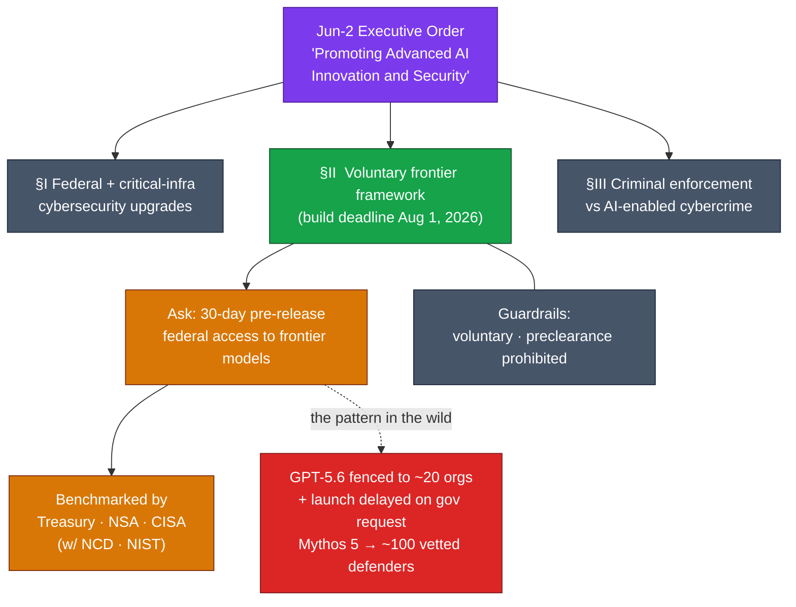

# LLM Updates — 2026-Jul-05

Sunday brief, written Sun Jul 5 (Los Angeles time). The last two briefs traced
two halves of one shape. Friday (Jul-03 §3) named the **gated frontier** —
GPT-5.6 fenced to ~20 orgs, Gemini 3.5 Pro held in Vertex preview, Mythos 5
scoped to ~100 defenders — and the whole three-week Fable 5 arc traced the
**export wall** the US built around its own flagship. This weekend closes the
loop on both: **the wall runs in both directions**, and **the US gate has a
name, a mechanism, and an August deadline**.

Three things advanced that were *not* in the prior briefs:

1. **China shipped a near-frontier coding model trained without a single
   Western chip.** Meituan open-sourced **LongCat-2.0** (Jun 30) — 1.6T-parameter
   MoE, 1M context — trained end-to-end on a **~50,000-card domestic cluster**
   with no Nvidia or AMD silicon, and it had already been quietly **leading
   OpenRouter** for two months under a codename.
2. **The gated frontier is now codified policy, not vendor discretion.** The
   Jun-2 executive order's **voluntary frontier-model framework** — the thing that
   explains GPT-5.6's ~20-org fence and OpenAI's launch delay — has a **build
   deadline of Aug 1** and a concrete ask: **30-day pre-release federal access**
   to frontier models.
3. **The capability frontier got re-measured as "research taste."** OpenAI's
   **GeneBench-Pro** (Jun 30) scores models on messy, iterative computational
   biology where the answer isn't lookup-able — and even the gated flagship
   **GPT-5.6 Sol tops out at 31.5%**, with Opus 4.8 at 16.0%.

This report does **not** re-derive the established thread. The Jun-12 BIS export
order and the full Fable 5 suspension arc (Jun-15 → Jul-1), the **Amazon
jailbreak trigger** (Jun-19 §1), the **shared-weights + classifier-gate
architecture** and its measured over-flagging (Jun-11 §2, Jul-03 §1),
**Project Glasswing** (Jun-24 §1), **Claude Sonnet 5** (Jul-01 §2), the Google
**talent drain** (Jul-03 §2), and the prior open-weights ordering (GLM-5.2 >
MiniMax-M3 ≈ DeepSeek V4-Pro; Jul-01 §3) are all covered earlier. Here we
advance only what is **new or sharpened since Friday**.

---

## 1. LongCat-2.0 — the export wall runs both ways

The dominant thread of these briefs has been the wall the US built around its
*own* frontier — Fable 5 pulled offline, Mythos 5 scoped to vetted defenders,
GPT-5.6 fenced. This weekend China answered the implicit question that wall
raised: **can a frontier-class model be built with no access to leading Western
accelerators at all?** Meituan's answer, shipped **Jun 30**, is yes.

**What it is.** **LongCat-2.0** is a **1.6-trillion-parameter Mixture-of-Experts**
model that activates only **~48B parameters per token** (dynamic range 33B–56B),
with a native **1,000,000-token context window**, purpose-built for **agentic
coding and tool use**. It nearly triples its predecessor's parameter count in
under a year.

**The part that matters.** It was **trained entirely on domestically produced
Chinese chips** — a **~50,000-card cluster** with **no Nvidia H100s or A100s and
no AMD MI300X**, across **35T+ tokens** of pretraining. This is the first time an
open-weights model at this scale and this benchmark tier has been trained
end-to-end on sanction-proof domestic silicon. The export-control regime that
frames every Fable 5 brief assumes compute is the chokepoint; LongCat-2.0 is a
data point that the chokepoint is **leakier than assumed** — at least for
inference-heavy agentic-coding workloads.

**It was already winning before anyone knew.** For roughly **two months**
LongCat-2.0 ran on OpenRouter under the anonymous codename **"Owl Alpha,"** where
it became one of the platform's most-used models — handling on the order of
**10.1 trillion tokens per month** — *before* Meituan revealed the identity on
Jun 30. Real-world usage, not a launch-day benchmark, established it.

**Where it lands on capability.** On the vendor's own numbers:

| LongCat-2.0 (vendor-reported) | Score | Reference |
|---|---|---|
| SWE-bench Pro | **59.5** | edges GPT-5.5 (58.6) |
| Terminal-Bench 2.1 | **70.8** | — |
| Active params / token | ~48B (of 1.6T) | 1M context |
| Promo API price (input) | **$0.30 / M tokens** | free context-cache hits |

At ~$0.30 per million input tokens with free cache hits, it undercuts GPT-5.5 by
a wide margin. Against the open-weights ladder these briefs track — Kimi
K2.7-Code (Jun 12), GLM-5.2, and now LongCat-2.0 — it slots in as another rung,
each with different harness fit and, crucially now, **different hardware
provenance**.

**The honest caveat.** The MIT-license framing outran the artifact. Meituan
announced the weights under a permissive **MIT license**, but at publication the
Hugging Face and GitHub weights are listed **"coming soon"** — the model is
effectively **API-only for now** despite the open-weights billing. Treat "open
weights" here as a stated intent, not a downloadable reality yet, and the
benchmark figures as **vendor-reported** pending third-party replication (the
same discipline Jun-23 applied to vendor-vs-standardized SWE-Bench gaps).

**Why it matters.** Two of the load-bearing assumptions in the export-control
narrative take a hit at once: that the frontier requires Western accelerators,
and that gating US models meaningfully caps global capability. A 1.6T MoE trained
on domestic chips, already carrying production traffic at OpenRouter scale,
argues the wall is porous in the direction that matters most for developers —
**cheap, long-context, agentic coding is now available from a lab the export
regime cannot reach.**

---

## 2. The gate has a name — the voluntary framework becomes policy

Friday's brief observed that "the frontier is increasingly reached through a gate
first and the public second" and left the *why* as pattern-recognition. The
weekend supplied the mechanism: the gate is **not** ad-hoc vendor caution. It is
the operational shape of **Section II of the Jun-2 executive order**,
*"Promoting Advanced Artificial Intelligence Innovation and Security,"* which the
White House is now in **advanced talks to finalize**.

**What the framework requires.** Federal agencies must **design a voluntary
framework by Aug 1, 2026** for frontier developers to engage the government
**before** model release. The headline ask: developers give the federal
government **access to leading-edge frontier models 30 days before releasing them
to any other organization**. Benchmarking is jointly owned by **Treasury, the
NSA (under the Dept. of War), and CISA (DHS)**, in consultation with the National
Cyber Director, the science advisor, and **NIST**.

**The two guardrails on it.** The framework is **expressly voluntary**, and
**preclearance is prohibited** — companies are *not* required to participate and
*not* required to get government pre-approval before releasing. On paper it is
opt-in. In practice, the events of the last three weeks show what "voluntary"
looks like when the government also holds export-control authority.

**The through-line to Friday.** GPT-5.6's ~20-org fence and OpenAI's decision to
**delay the full public launch after the US government requested early access and
additional oversight** are no longer isolated vendor choices — they are early,
informal enactments of the §II framework *before it is even finalized*. The
gated frontier Friday described is the framework's shadow. And it sharpens the
contrast §1 draws: while the US frontier moves behind a 30-day government preview,
**LongCat-2.0 shipped to everyone at once, from a jurisdiction the framework
cannot touch.** Open weights (or intended-open weights) remain the one lane that
routes around both the export wall and the pre-release gate.

---

## 3. GeneBench-Pro — the frontier re-measured as judgment, not knowledge

The third advance is a **benchmark**, and it matters because it moves the goalposts
from *recall* to *research taste*. OpenAI released **GeneBench-Pro** on **Jun 30**:
**129 synthetic computational-biology problems** across **ten domains** —
statistical genetics, cancer genomics, clinical diagnostics, pharmacogenomics,
and more.

**Why it's different.** Each problem hands the model a **realistic, deliberately
messy dataset**, brief experimental context, and a target to estimate. To score,
the model must **explore the data iteratively, pick an appropriate analytical
approach, and commit to an answer** — without exploiting shortcuts or pattern-
matching to arbitrary author preferences. OpenAI estimates a single problem would
take a **human expert 20–40 hours**. This is not a knowledge test; it is a test of
whether a model can *do research* under ambiguity.

**The scores — a wide-open frontier.**

| Model | GeneBench-Pro pass rate |
|---|---|
| GPT-5.6 Sol (Pro mode) | **31.5%** |
| GPT-5.6 Sol (high reasoning) | 28.7% |
| Claude Opus 4.8 (best non-GPT) | **16.0%** |
| Best model at original GeneBench launch | **< 5%** |

```mermaid
flowchart LR
    P["Messy bio dataset<br/>+ target to estimate"]:::user --> M{"Model must:<br/>explore → choose method<br/>→ commit, no shortcuts"}:::gate
    M --> R1["GPT-5.6 Sol (Pro)<br/>31.5%"]:::pub
    M --> R2["Opus 4.8<br/>16.0%"]:::vet
    M --> R3["Human expert<br/>~20&#8211;40 hrs / problem"]:::note
    classDef user fill:#2563eb,stroke:#1e3a8a,color:#ffffff;
    classDef gate fill:#7c3aed,stroke:#4c1d95,color:#ffffff;
    classDef pub fill:#16a34a,stroke:#14532d,color:#ffffff;
    classDef vet fill:#d97706,stroke:#7c2d12,color:#ffffff;
    classDef note fill:#475569,stroke:#1e293b,color:#ffffff;
```

**Two readings, both true.** The optimistic one: from **<5%** at the original
GeneBench to **31.5%** is a steep climb in capability on genuinely hard,
long-horizon scientific reasoning. The sober one: the **best model on Earth still
fails ~two-thirds of the time** on tasks a domain expert would grind through in a
day or two — and it is a **gated** model (§2), so the public-facing frontier
(GPT-5.5, Sonnet 5, Opus 4.8) sits below even that ceiling. GeneBench-Pro is
useful precisely because it refuses to saturate: it re-establishes headroom at a
moment when coding benchmarks (SWE-bench, Terminal-Bench) are crowding into the
high-70s/80s and losing their power to discriminate.

**Dual-use footnote.** A benchmark that rewards autonomous, iterative reasoning
over messy genomics and translational-medicine data sits close to the exact
capability surface the §2 cybersecurity/biosecurity framework is built to
watch — which is why the same agencies (NSA, CISA) that benchmark for cyber risk
are the ones the frontier framework routes models through. The three threads of
this brief are one story: **capability, who can build it, and who gets to see it
first.**

---

## Bottom line

- **China trained a near-frontier coding model on zero Western chips.**
  Meituan's **LongCat-2.0** (Jun 30) — 1.6T MoE, ~48B active, 1M context, MIT
  (weights "coming soon") — was trained on a **~50,000-card domestic cluster**
  (no Nvidia/AMD) over 35T+ tokens, and had already been **leading OpenRouter**
  as anonymous "Owl Alpha" (~10.1T tokens/mo). Vendor scores: **SWE-bench Pro
  59.5** (> GPT-5.5's 58.6), **Terminal-Bench 2.1 70.8**, at **$0.30/M** input.
  The export wall is porous where it counts.
- **The gated frontier is now written policy.** The Jun-2 EO's **voluntary
  frontier-model framework** (build deadline **Aug 1**) asks for **30-day pre-release federal
  access** to frontier models, benchmarked by **Treasury/NSA/CISA**. It's
  voluntary and bars preclearance — but GPT-5.6's ~20-org fence and delayed launch
  are it operating in advance. Friday's "gated frontier" now has a mechanism.
- **The frontier re-measured as research taste.** OpenAI's **GeneBench-Pro**
  (129 messy comp-bio problems, 20–40 human-hours each) tops out at **31.5%
  (GPT-5.6 Sol Pro)** vs **16.0% (Opus 4.8)** and **<5%** at the original
  GeneBench — a real climb, but a frontier that still fails two of every three
  research-grade tasks, and only visible through the gate.

---

## Sources

**LongCat-2.0 (Meituan, open-weights, domestic silicon):**
- [VentureBeat — Meituan open sources LongCat-2.0, the 1.6T near-frontier agentic coding model that's been leading OpenRouter — trained entirely on Chinese chips](https://venturebeat.com/technology/meituan-open-sources-longcat-2-0-the-1-6t-near-frontier-agentic-coding-model-thats-been-leading-openrouter-trained-entirely-on-chinese-chips)
- [CryptoBriefing — Meituan open sources LongCat-2.0, a 1.6 trillion parameter coding model trained entirely on Chinese chips](https://cryptobriefing.com/meituan-longcat-2-coding-model/)
- [FelloAI — LongCat-2.0: China's 1.6T Open-Source Coding Model](https://felloai.com/longcat-2-0/)
- [WinBuzzer — Meituan Opens LongCat-2.0 Coding Model With 1M Context](https://winbuzzer.com/2026/06/30/meituan-opens-longcat-20-coding-model-with-1m-context-xcxwbn/)
- [Meituan LongCat — official model page & benchmarks](https://www.longcatai.org/models/longcat-2)
- [Hugging Face — meituan-longcat/LongCat-2.0](https://huggingface.co/meituan-longcat/LongCat-2.0)

**Voluntary frontier framework (Jun-2 Executive Order §II):**
- [The White House — Promoting Advanced Artificial Intelligence Innovation and Security](https://www.whitehouse.gov/presidential-actions/2026/06/promoting-advanced-artificial-intelligence-innovation-and-security/)
- [Latham & Watkins — President Trump Signs Executive Order Establishing AI Cybersecurity and Frontier Model Framework](https://www.lw.com/en/insights/president-trump-signs-executive-order-establishing-ai-cybersecurity-and-frontier-model-framework)
- [Crowell & Moring — Executive Order Creates Voluntary Regulatory Regime of Frontier AI Models](https://www.crowell.com/en/insights/client-alerts/executive-order-creates-voluntary-regulatory-regime-of-frontier-ai-models)
- [Freshfields — Trump Executive Order on AI: Voluntary Framework, Cybersecurity Focus, and Key Takeaways](https://www.freshfields.com/en/our-thinking/blogs/a-fresh-take/trump-executive-order-on-ai-voluntary-framework-cybersecurity-focus-and-key-ta-102n18b)
- [Dark Reading — Trump AI Order Seeks Voluntary Frontier Model Testing](https://www.darkreading.com/cybersecurity-operations/trump-ai-order-seeks-voluntary-frontier-model-testing)

**GeneBench-Pro (OpenAI):**
- [OpenAI — Introducing GeneBench-Pro](https://openai.com/index/introducing-genebench-pro/)
- [Digital Watch Observatory — OpenAI launches GeneBench-Pro for AI biology research](https://dig.watch/updates/openai-genebench-pro-ai-biology-research)
- [BigGo Finance — OpenAI Unveils Computational Biology Benchmark Targeting 'Research Intuition' — Top AI Scores Just 32%](https://finance.biggo.com/news/54551f17-49bf-4edc-8aa3-d83338f32d77)
- [AI Weekly — OpenAI's GeneBench-Pro stumps top models, GPT-5.6 tops at 31.5%](https://aiweekly.co/alerts/openais-genebench-pro-stumps-top-models-gpt-56-tops-at-315)
- [TechTimes — OpenAI Genomics Benchmark: AI Judgment Gap Exposed in Research-Grade Tasks](https://www.techtimes.com/articles/319495/20260702/openai-genomics-benchmark-ai-judgment-gap-exposed-research-grade-tasks.htm)

**Frontier & open-weights watch:**
- [Artificial Analysis — LLM Leaderboard](https://artificialanalysis.ai/leaderboards/models)
- [LLM-Stats — AI Updates Today (July 2026)](https://llm-stats.com/llm-updates)

*Note: several publisher URLs (VentureBeat, FelloAI, TechTimes, LLM-Stats)
returned HTTP 403 to automated fetching in this session; their factual content
above is drawn from search-result summaries and is cited for the reader.
LongCat-2.0's coding scores are vendor-reported (Meituan) pending third-party
replication, and its MIT-licensed weights were listed "coming soon" (API-only)
at publication. GeneBench-Pro figures are OpenAI-reported. All figures are
point-in-time as of Jul 5, 2026 (Los Angeles).*
