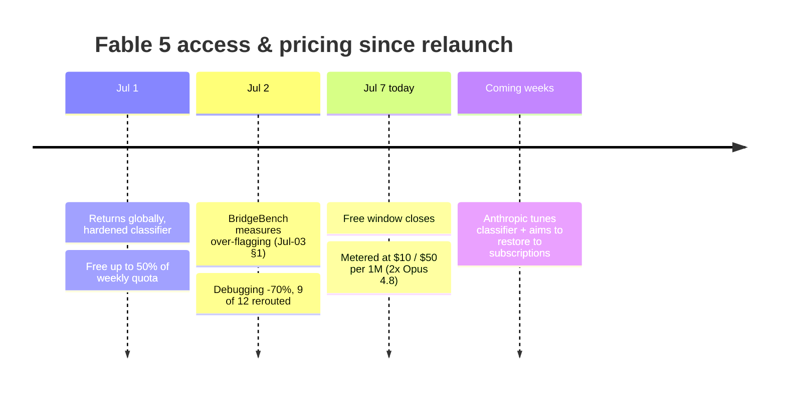

# LLM Updates — 2026-Jul-07

Tuesday brief, written Tue Jul 7 (Los Angeles time). Two things the Jul-3 brief
left as forecasts resolve **today**, and both resolved against the optimistic
reading:

1. **Fable 5's free window closes today.** The 50%-of-weekly-quota grace period
   Anthropic opened when Fable 5 returned Jul 1 **ends July 7.** From today,
   keeping Fable 5 on Pro/Max/Team/Enterprise requires **usage credits at
   $10 / $50 per million tokens** — **exactly double Opus 4.8** and the most
   expensive pricing Anthropic has ever listed for a generally available model.
2. **Gemini 3.5 Pro did not clear its "July GA."** Jul-3 reported it "cleared
   for a July GA." Entering the **second week of July it is still in preview** —
   no GA date, **no published benchmarks, no final pricing** — with testers on
   Vertex, Antigravity and LMArena flagging the same long-horizon-reasoning gaps
   that caused the original slip.

Because the export saga's core narrative is now stable, this brief also does
what the task asks and the recent run of business-heavy briefs has under-served:
it goes **under the hood.** Section 3 is a proper look at the **2026 efficiency
wave** — the KV-cache and attention-cost techniques (compressed attention,
cross-layer KV sharing, mHC, hybrid Mamba-2 MoE) that are quietly doing more for
real-world model economics right now than any single flagship launch.

This report does **not** re-derive the established thread. The Jun-12 BIS export
order and the suspension arc (Jun-15 → Jul-1), the **Amazon jailbreak trigger**
(Jun-19 §1), the **shared-weights + classifier-gate architecture** that routes
flagged queries to Opus 4.8 (Jun-11 §2, Jul-03 §1), **Project Glasswing**
(Jun-08 §7, Jun-24 §1), **Claude Sonnet 5** (Jul-01 §2), the **BridgeBench
over-flag measurement** (Jul-03 §1), **Google's Gemini brain drain** (Jul-03 §2),
and the open-weights ordering (GLM-5.2 > MiniMax-M3 ≈ DeepSeek V4-Pro; Jul-01 §3)
are all covered earlier. Here we advance only what is **new or sharpened since
Friday**.

---

## 1. Fable 5's price cliff — the credit meter turns on today

When Fable 5 returned globally on Jul 1, Anthropic softened the landing with a
**temporary grace period**: Pro, Max, Team and select Enterprise subscribers
could use Fable 5 at no extra charge for **up to 50% of their weekly usage
limits**. That window was always dated **through July 7** — and today it closes.

**What changes today.** From Jul 7, any paid subscriber who wants to keep using
Fable 5 must buy **Anthropic usage credits**, metered at a confirmed:

| Fable 5 metered rate (from Jul 7) | Per 1M tokens |
|---|---|
| Input | **$10** |
| Output | **$50** |
| vs Claude Opus 4.8 | **2× the rate** |

That $10 / $50 line is, by multiple accounts, **the most expensive pricing
Anthropic has ever published for a GA model** — and it sits on top of the
capability caveat from Jul-03: because the hardened cybersecurity classifier
**silently reroutes** a meaningful share of security-adjacent coding/debugging
calls to Opus 4.8, a subscriber can now **pay the 2× Fable premium and still be
served by Opus** on the intercepted calls unless they inspect the response
metadata.

**Anthropic's framing.** The company is positioning the credit meter as
**temporary and capacity-driven**, not a permanent repricing: it says it "aims
to restore Fable as a standard part of its subscriptions as soon as capacity
allows." That is a demand-management signal — Fable 5 is compute-constrained
post-relaunch — more than a pricing philosophy. Note also that this credit
move is distinct from the broader **Claude credit overhaul** that Anthropic
**paused** earlier (the abandoned Jun-15 change); this is Fable-specific.

**Builder takeaway.** Three concrete effects from today:
- **Recheck your default model.** If a workflow silently defaulted to Fable 5
  during the free window, it now bills at 2× Opus. For most routine coding,
  Opus 4.8 (or Sonnet 5 for agentic/tool-heavy loops) is the cheaper, and often
  functionally equivalent, pick — especially given the reroute behaviour.
- **Instrument the reroute** (carried over from Jul-03): log the serving model
  per call so you aren't paying the Fable premium for an Opus answer.
- **Treat the price as a ceiling, not a floor.** Anthropic's "as capacity
  allows" language means the meter could relax; don't rebuild your cost model
  around $10/$50 as permanent.

---

## 2. Gemini 3.5 Pro — the "July GA" that keeps not shipping

Jul-3 recorded Gemini 3.5 Pro as **"cleared for a July GA"** out of Vertex
enterprise preview. That framing has not held. Entering the **second week of
July**, the model is **still in limited preview**, and — importantly — the
public still has **no model card, no published benchmarks, and no final
pricing.**

**Where it actually stands (Jul 7):**
- **Not GA.** Not a generally available public API model as of today.
- **Preview surface widening, not opening.** Access remains a **limited Vertex
  AI enterprise preview** for approved customers, plus testers on Google's
  **Antigravity** platform and the **LMArena** benchmarking site. That is a
  vetted-tester pool, not a launch.
- **The delay reasons are unchanged from the original slip** — early testers
  flagged (a) **token-efficiency**, (b) **coding performance below flagship
  bar**, and (c) **long-horizon, multi-step reasoning** shortfalls. That the
  *same* three gaps are still the story in July suggests the refinements are
  hard, not cosmetic.
- **The 2M-token context, a "July 17" date, and every leaked benchmark remain
  unconfirmed by Google.** Treat them as rumor until a model card ships.

**Why it matters.** This sharpens — and partly corrects — the Jul-03 "gated
frontier" read. The point is no longer just that the frontier ships to a gate
first; it is that **the gate itself keeps sliding**. Gemini 3.5 Pro was
"next month" at I/O (May 19), then June, then July, and July is now looking
soft. Set against the Jul-03 talent-drain thread (Shazeer out, Jumper + two
Gemini researchers to Anthropic), a flagship that cannot clear its own repeated
launch windows is the most tangible symptom yet of the pressure on Google's
model org. Meanwhile the already-shipped **Gemini 3.5 Flash** (Terminal-Bench
76.2, GDPval 1,656; Jul-03 §3) remains the only 3.5-series model builders can
actually deploy.

---

## 3. Under the hood — the 2026 efficiency wave

Away from the launch-and-export drama, the most durable 2026 development is
architectural: a cluster of techniques that **cut the cost of attention and the
KV cache** rather than scaling parameters. Sebastian Raschka's architecture
survey collated the wave — cross-layer **KV sharing**, per-layer embeddings,
attention budgeting, **compressed attention**, and **mHC** — and the through-line
is consistent: *the frontier is increasingly reached by making each token
cheaper to serve, not by making the model bigger.* This is what actually moves
inference economics for everyone running these models.

### 3a. Compressed attention — operate *in* the compressed space

The sharpest single idea is **Compressed Convolutional Attention (CCA)**, from
Zyphra's **ZAYA1-8B** reasoning MoE (an 8B model notable for being trained
end-to-end on **AMD Instinct MI300** hardware). Unlike MLA-style designs that
keep a compact latent only as a *KV-cache format* and decompress to attend, CCA
**performs the attention operation directly in the compressed latent space.**
Combined with a GQA layout (**CCGQA** — 2 KV heads for 8 query heads, on top of
2× query compression), ZAYA1 reports an **8× KV-cache compression** versus full
multi-head attention: a context that needed ~8 GB of KV cache now needs ~1 GB.
CCA's machinery — low-rank projections, short + grouped head-wise convolutions
for sequence mixing, a one-token value-head time delay — is the kind of change
that lets an 8B model punch far above its class on long-context reasoning.

### 3b. Cross-layer KV sharing & attention budgeting

The cheaper, more portable cousins of CCA are **cross-layer KV sharing** (reuse
one layer's key/value projections across several layers, shrinking the cache
near-linearly in the number of layers that share) and **layer-wise attention
budgeting** (spend expensive full attention only where it pays off, and cheaper
mechanisms elsewhere), alongside **per-layer embeddings**. None is a new
flagship; together they are why 2026's mid-size open models fit long contexts on
commodity memory.

### 3c. mHC — a better residual stream

**mHC (Manifold-Constrained Hyper-Connections)**, introduced by the DeepSeek team
(paper posted end of Dec 2025) and used in **DeepSeek V4**, modernizes the
transformer's residual connection. Hyper-connections replace the single residual
stream with **several parallel streams and learned mappings** between them; mHC
projects that mixing matrix onto the **manifold of doubly-stochastic matrices**
(non-negative, every row and column sums to 1) so the residual mixing behaves
like a **stable redistribution** of information across streams rather than an
unconstrained blend — improving training stability at depth.

### 3d. Hybrid Mamba-2 + attention MoE — the throughput play

NVIDIA's open **Nemotron 3** family (Nano / Super / Ultra) is the wave's
throughput story. The architecture is **predominantly interleaved Mamba-2 and
MoE layers with only a few self-attention layers** (and those use GQA with just
2 KV heads). By minimizing expensive self-attention, Nemotron 3 shrinks both
attention cost and KV footprint, and the reported gains are large: **Nano ~3.3×**
throughput vs Qwen3-30B-A3B; **Super up to 7.5×** vs Qwen3.5-122B (at 8k in /
64k out) at on-par-or-better accuracy; **Ultra ~5×** vs other SOTA open models at
comparable accuracy.

```mermaid
flowchart TD
    GOAL["2026 goal:<br/>cheaper tokens, not bigger models"]:::goal

    GOAL --> MEM["Cut the KV cache"]:::mem
    GOAL --> CMP["Cut attention compute"]:::cmp
    GOAL --> STAB["Train deeper, stably"]:::stab

    MEM --> CCA["Compressed Convolutional Attention<br/>ZAYA1-8B / CCGQA &#8212; 8&#215; KV compression"]:::pub
    MEM --> KV["Cross-layer KV sharing<br/>+ per-layer embeddings"]:::pub
    CMP --> HYB["Hybrid Mamba-2 + MoE<br/>Nemotron 3 &#8212; up to 7.5&#215; throughput"]:::pub
    CMP --> BUD["Attention budgeting<br/>full attention only where it pays"]:::pub
    STAB --> MHC["mHC<br/>DeepSeek V4 &#8212; doubly-stochastic residual streams"]:::pub

    classDef goal fill:#7c3aed,stroke:#4c1d95,color:#ffffff;
    classDef mem fill:#2563eb,stroke:#1e3a8a,color:#ffffff;
    classDef cmp fill:#16a34a,stroke:#14532d,color:#ffffff;
    classDef stab fill:#d97706,stroke:#7c2d12,color:#ffffff;
    classDef pub fill:#475569,stroke:#1e293b,color:#ffffff;
```

**Builder takeaway.** If you self-host or price by token, these are the levers
that matter more than the next flagship: a hybrid Mamba/attention MoE or a
compressed-attention model can serve long contexts at a fraction of the memory
and several times the throughput of a dense transformer of similar quality. The
open ecosystem (ZAYA1, Nemotron 3, DeepSeek V4, GLM-5.2) is where these ship
first and unrestricted — the same "available to everyone the day they ship"
advantage the gated closed frontier (§2) keeps handing them.

---

## Bottom line

- **Fable 5 gets expensive today.** The free 50%-of-quota window closes Jul 7;
  Fable 5 now meters at **$10 / $50 per 1M tokens — 2× Opus 4.8**, Anthropic's
  priciest GA model ever, and (per Jul-03) you may still be silently served
  Opus on rerouted calls. Anthropic calls the meter temporary/capacity-driven.
  Recheck your default model and instrument the reroute.
- **Gemini 3.5 Pro's "July GA" slipped again.** Second week of July, **still
  preview** — no benchmarks, no pricing, no date — on the *same* token-efficiency
  / coding / long-horizon-reasoning gaps. The gate isn't just first; it keeps
  sliding. Flash remains the only deployable 3.5-series model.
- **The real 2026 story is efficiency, not size.** Compressed attention
  (ZAYA1, **8× KV compression**), cross-layer KV sharing, **mHC** (DeepSeek V4),
  and hybrid **Mamba-2 + MoE** (Nemotron 3, **up to 7.5×** throughput) are
  cutting the cost per token across the open ecosystem — the levers that move
  inference economics more than any single flagship, and they ship unrestricted.

---

## Sources

**Fable 5 pricing cliff (Jul 7):**
- [TechTimes — Fable 5 Subscription Ends Tomorrow: Per-Token Costs and Who Gets Hit Hardest](https://www.techtimes.com/articles/319767/20260706/fable-5-subscription-ends-tomorrow-per-token-costs-who-gets-hit-hardest.htm)
- [Digital Applied — Claude Fable 5 Pricing: The July 7 Usage-Credits Switch](https://www.digitalapplied.com/blog/claude-fable-5-usage-credits-july-7-pricing-guide-2026)
- [MyHostNews — Claude Fable 5 becomes paid: Anthropic changes its billing model starting July 7](https://myhostnews.com/claude-fable-5-becomes-paid-anthropic-completely-changes-its-billing-model-starting-july-7/)
- [BleepingComputer — Claude Fable 5 isn't permanently leaving subscriptions, Anthropic says](https://www.bleepingcomputer.com/news/artificial-intelligence/claude-fable-5-isnt-permanently-leaving-subscriptions-anthropic-says/)
- [Windows Report — Anthropic Says Claude Fable 5 Credit Access Is Temporary Amid High Demand](https://windowsreport.com/anthropic-says-claude-fable-5-credit-access-is-temporary-amid-high-demand/)
- [TweakTown — Anthropic brings Fable 5 back, but customers get fewer free days than originally offered](https://www.tweaktown.com/news/112412/anthropic-brings-fable-5-back-but-customers-get-fewer-free-days-than-originally-offered/index.html)
- [Claude — Plans & Pricing](https://claude.com/pricing)

**Gemini 3.5 Pro (still in preview):**
- [MarketScale — Gemini 3.5 Pro Is Still in Preview Entering the Second Week of July](https://www.marketscale.com/industries/software-and-technology/gemini-3-5-pro-still-in-preview-what-enterprise-teams-evaluating-a-model-should-do-now)
- [Bind AI — Gemini 3.5 Pro Slips to July (and four senior Google researchers just left)](https://blog.getbind.co/gemini-3-5-pro-slips-to-july-and-four-senior-google-researchers-just-left-for-anthropic/)
- [inews.zoombangla — Google's Gemini 3.5 Pro Nears General Availability Release](https://inews.zoombangla.com/googles-gemini-3-5-pro-nears-general-availability-release/)
- [Google — Gemini 3.5: frontier intelligence with action](https://blog.google/innovation-and-ai/models-and-research/gemini-models/gemini-3-5/)

**Efficiency-wave architectures:**
- [Sebastian Raschka — Recent Developments in LLM Architectures: KV Sharing, mHC, and Compressed Attention](https://magazine.sebastianraschka.com/p/recent-developments-in-llm-architectures)
- [Sebastian Raschka — LLM Architecture Gallery Changelog](https://sebastianraschka.com/llm-architecture-gallery/changelog/)
- [arXiv 2512.24880 — mHC: Manifold-Constrained Hyper-Connections](https://arxiv.org/abs/2512.24880)
- [MarkTechPost — Zyphra Releases ZAYA1-8B: A Reasoning MoE Trained on AMD Hardware](https://www.marktechpost.com/2026/05/06/zyphra-releases-zaya1-8b-a-reasoning-moe-trained-on-amd-hardware-that-punches-far-above-its-weight-class/)
- [VentureBeat — Meet ZAYA1-8B, a super efficient open reasoning model trained on AMD Instinct MI300 GPUs](https://venturebeat.com/technology/meet-zaya1-8b-a-super-efficient-open-reasoning-model-trained-on-amd-instinct-mi300-gpus)
- [arXiv 2605.05365 — ZAYA1-8B Technical Report](https://arxiv.org/abs/2605.05365)
- [arXiv 2606.15007 — Nemotron 3 Ultra: Hybrid Mamba-Transformer MoE for Agentic Reasoning](https://arxiv.org/abs/2606.15007)
- [arXiv 2604.12374 — Nemotron 3 Super Technical Report](https://arxiv.org/abs/2604.12374)
- [arXiv 2606.19348 — DeepSeek-V4: Towards Highly Efficient Million-Token Context Intelligence](https://arxiv.org/abs/2606.19348)

**Frontier & open-weights watch:**
- [Artificial Analysis — LLM Leaderboard](https://artificialanalysis.ai/leaderboards/models)
- [LLM-Stats — AI Updates Today (July 2026)](https://llm-stats.com/llm-updates)

*Note: many publisher and arXiv URLs (Anthropic newsroom, TechTimes, MarketScale,
Digital Applied, arXiv abstract pages, Gigazine, LLM-Stats) returned HTTP 403 to
automated fetching in this session; their factual content above is drawn from
search-result summaries and is cited for the reader. Benchmark and pricing
figures are vendor- or third-party-reported and are point-in-time as of
Jul 7, 2026 (Los Angeles time); efficiency multipliers use each vendor's own
baseline and metric, as labeled in the chart.*
