# LLM Updates — 2026-Jul-08

Wednesday brief, written Wed Jul 8 (Los Angeles time). For three weeks these
reports tracked one story: the **Fable 5 / Mythos 5** export saga (Jun-12 BIS
order → Jun-30 controls removed → **Jul-1 global return** with a hardened
cybersecurity classifier; Jul-01 §1, Jul-03 §1). That arc is closed. **The story
since Friday is no longer regulatory — it's a crowded three-week launch window.**
Google, DeepSeek, OpenAI, and xAI are all trying to land frontier releases inside
mid-July, and the first concrete thing to hit developers is not a new capability
but a **breaking API change**.

Four things advanced since Friday's brief:

1. **DeepSeek set a hard API cutoff — and it lands on Claude Code users too.** On
   **Jul 24, 15:59 UTC**, the legacy `deepseek-chat` and `deepseek-reasoner`
   model IDs are retired. Alongside it DeepSeek quietly shipped an
   **Anthropic-format endpoint** that reroutes `claude-opus*` / `claude-sonnet*`
   calls onto DeepSeek V4 — an open, cheap drop-in path aimed straight at
   Anthropic's own clients (§1).
2. **Gemini 3.5 Pro is locked to Jul 17 — and Google threw away the base model.**
   The delay is not polish: DeepMind **scrapped the Gemini 2.5 Pro base and ran a
   new pre-training cycle from scratch** (hundreds of millions of dollars), adding
   a **Deep Think reasoning layer** and a **2M-token** context (§2).
3. **Grok 4.5's public launch looks imminent.** A **Jul 6** UI string —
   *"Unlock the full power of Chat with Grok 4.5"* — surfaced in the Grok web app;
   the 1.5T **V9** model trained on Cursor data is still beta-only, with **no
   independent benchmark** behind Musk's "close to, perhaps exceeding Opus" claim
   (§3).
4. **The China-model share of US enterprise traffic is now a measured number.**
   A **Jul 7 CNBC** investigation puts Chinese open models at **30–46% of
   enterprise API tokens** flowing through US developer gateways, with **GLM-5.2**
   posting the fastest adoption Vercel tracked all year (§4).

And the epilogue the Jul-1 brief predicted arrived on schedule: **as of today,
Jul 8, Fable 5 has fallen off subscription-included access onto usage credits**
at $10 / $50 per million tokens (§5).

This report does **not** re-derive the export saga, the shared-weights +
classifier-gate architecture that routes flagged queries to Opus 4.8 (Jun-11 §2,
Jun-13), the Amazon jailbreak trigger (Jun-19 §1), Project Glasswing (Jun-24 §1),
or Claude Sonnet 5's launch and tokenizer caveat (Jul-01 §2). Those are covered
earlier. Here we advance only what is **new or sharpened since Friday**.

![Timeline of the July 2026 launch window. Jul 1: Fable 5 returns globally under its hardened guard. Jul 8 (today): Fable 5 shifts to usage-credit pricing at $10/$50 per million tokens, and DeepSeek's Jul 24 retirement deadline reaches developers. Jul 17: Gemini 3.5 Pro targeted for general availability after a from-scratch rebuild with a 2M-token context. Jul 24, 15:59 UTC: DeepSeek retires the deepseek-chat and deepseek-reasoner model IDs. Undated but expected in the same window: GPT-5.6 broad access and a Grok 4.5 public launch.](july_launch_window.svg)

---

## 1. DeepSeek's Jul-24 cutoff — a breaking change with an Anthropic-shaped trap

The single most actionable item this week is not a launch; it's a **deprecation
with a hard date**. After **Jul 24, 2026, 15:59 UTC**, DeepSeek retires the
`deepseek-chat` and `deepseek-reasoner` model names entirely — calls to them will
fail, not degrade. Both were the interfaces to the V4 family (shipped Apr 24
under an MIT license); today they already route silently to **V4 Flash**, so the
change is a rename plus an explicit tiering decision developers must now make.

**The migration itself is mechanical:**

| Legacy model ID | Replace with | Notes |
|---|---|---|
| `deepseek-chat` | `deepseek-v4-flash` (non-thinking) | fast/cheap tier |
| `deepseek-reasoner` | `deepseek-v4-flash` (thinking) | same tier, reasoning on |
| *(capability tier)* | `deepseek-v4-pro` | 1.6T-param MoE, 49B active |

Action items are boring but real: grep your codebase, gateway configs, and IaC
for the two legacy IDs; decide Flash-vs-Pro per route rather than inheriting the
silent Flash default; and re-key any billing that aggregates by model ID, mapping
historical `deepseek-chat` rows to V4 Flash for trend continuity.

**The part worth flagging** is what DeepSeek shipped *alongside* the deprecation:
a dedicated **Anthropic-format endpoint** at `https://api.deepseek.com/anthropic`.
It accepts Anthropic-native clients — Claude Code included — and maps Claude model
names onto DeepSeek weights:

```mermaid
flowchart LR
    subgraph client["Anthropic-native client (e.g. Claude Code)"]
      A["model: claude-opus-*"]:::opus
      B["model: claude-sonnet-* / claude-haiku-*"]:::sonnet
    end

    A -->|"POST /anthropic"| EP{"api.deepseek.com<br/>/anthropic<br/>(routing shim)"}:::gate
    B -->|"POST /anthropic"| EP

    EP -->|"claude-opus&#42; &rarr;"| PRO["deepseek-v4-pro<br/>1.6T MoE &middot; 49B active<br/>MIT-licensed weights"]:::pub
    EP -->|"claude-sonnet&#42; / haiku&#42; &rarr;"| FLASH["deepseek-v4-flash<br/>284B MoE &middot; 13B active"]:::pub

    classDef opus fill:#7c3aed,stroke:#4c1d95,color:#ffffff;
    classDef sonnet fill:#2563eb,stroke:#1e3a8a,color:#ffffff;
    classDef gate fill:#d97706,stroke:#7c2d12,color:#ffffff;
    classDef pub fill:#16a34a,stroke:#14532d,color:#ffffff;
```

The strategic read: DeepSeek is offering a **one-line base-URL swap** that turns
any Claude-native workflow into a DeepSeek-served one at open-weight prices. It
lands the same week Anthropic's Fable 5 moves *onto* metered credits (§5) and the
week CNBC quantified how much enterprise traffic has already moved to Chinese
models (§4). Whether or not a given team migrates, the option now exists as a
supported, documented path — that's the news.

*Caveat:* the routing-behavior specifics (which Claude prefixes map where) come
from third-party migration write-ups and a router vendor, not a first-party
DeepSeek page we could fetch directly (several publisher pages returned 403 to
automated fetches). Treat the exact prefix mapping as reported-but-unverified; the
Jul-24 retirement date and the Flash/Pro rename are consistently sourced.

**Sources:**
[DeepSeek V4 preview / API docs](https://api-docs.deepseek.com/news/news260424) ·
[Developers Digest — Jul-24 migration guide](https://www.developersdigest.tech/blog/deepseek-chat-to-v4-migration-guide) ·
[TheRouter.ai — deprecation + Anthropic-endpoint routing playbook](https://therouter.ai/news/deepseek-chat-reasoner-deprecation-v4-migration-routing/) ·
[DEV — migration guide before the Jul-24 deadline](https://dev.to/agdex_ai/deepseek-v4-api-migration-guide-everything-before-the-july-24-2026-deadline-4m30)

---

## 2. Gemini 3.5 Pro — locked to Jul 17, rebuilt from scratch

Friday's brief noted Gemini 3.5 Pro was "cleared for a July GA." It now has a
**date — Jul 17** — and the reason for the slip is the substantive part: this is
not a tuned checkpoint of Gemini 2.5 Pro. **DeepMind scrapped the 2.5 Pro base
model and ran a fresh pre-training cycle.**

Rebuilding a frontier base from zero costs **hundreds of millions of dollars** and
forfeits months. Labs don't do that for polish; they do it when the existing
candidate either **failed internal quality thresholds** or was judged unable to
clear the bar set by the models arriving in the *same window* (GPT-5.6, Grok 4.5,
DeepSeek V4). Reporting cites both performance-degradation concerns in earlier
iterations and the recent senior-researcher turnover flagged in Jul-03 §2.

What the rebuild is engineered to fix, per leaks:

- **A "Deep Think" reasoning layer** for hard multi-step problems.
- **A 2M-token context window** (2× the working ceiling of most rivals).
- Targeted gains in **math**, **SVG scene generation**, and **frontend/UI
  generation** — areas where the prior candidate reportedly lagged.

Note the pattern from Jul-03 §3 still holds: because Gemini 3.5 Pro has **not**
crossed the US cybersecurity-capability threshold that fenced Fable 5 and GPT-5.6
Sol, it is expected to ship **freely at GA** rather than behind a gated preview.
Same-day competition, opposite regulatory posture. Jul 17 is a *target*, and
Google has declined to confirm it — treat it as the current plan, not a promise.

**Sources:**
[BigGo — delay to Jul 17 for a full rebuild](https://finance.biggo.com/news/6f0c6bb2-795f-4c57-9d09-6db691d7638a) ·
[Geeky Gadgets — base model scrapped](https://www.geeky-gadgets.com/gemini-pro-scraps-base-model/) ·
[Geeky Gadgets — Deep Think reasoning leak](https://www.geeky-gadgets.com/google-gemini-3-5-pro-leaks/) ·
[TechTimes — Jul-17 target (Jul 8)](https://www.techtimes.com/articles/319877/20260708/gemini-35-pro-targets-july-17-deepseeks-july-24-deadline-hits-developers-now.htm)

---

## 3. Grok 4.5 — launch signals, still no independent number

xAI's **Grok 4.5** entered private beta at SpaceX and Tesla on Jun 28, built on
the **1.5-trillion-parameter V9** foundation (~3× the ~500B v8-small that powers
today's public Grok) with **Cursor developer data** folded into supplemental
training — a coding "data flywheel" play. On **Jul 6**, a string reading *"Unlock
the full power of Chat with Grok 4.5"* appeared in the Grok web UI, the usual tell
that a public launch is staged and close.

The caution is the same one that applies to every vendor self-eval: Musk's claim
that Grok 4.5 performs *"close to, perhaps exceeding Opus"* comes from **SpaceX and
Tesla engineers running their own evaluation**. As of today **no independent
harness** — LMArena, Artificial Analysis, SWE-bench, Humanity's Last Exam — has
scored it, and there is **no public API** to run one on. File the capability claim
under unverified until there's a third-party number; the *launch-imminent* signal
is the reportable fact.

**Sources:**
[TechTimes — private beta, no public benchmark (Jun 29)](https://www.techtimes.com/articles/319314/20260629/grok-45-enters-private-beta-spacex-tesla-no-public-access-no-independent-benchmark.htm) ·
[Digital Applied — V9 / Cursor data flywheel](https://www.digitalapplied.com/blog/grok-4-5-cursor-data-flywheel-spacex-private-beta-2026) ·
[BuildFast — Grok 4.5 V9 beta review](https://www.buildfastwithai.com/blogs/grok-4-5-review-xai-v9-beta-2026) ·
[TestingCatalog — Jul-6 UI string / launch signal](https://www.testingcatalog.com/spacexai-gearing-up-for-upcoming-grok-4-5-release/)

---

## 4. The China-model share is now measured, not asserted

The open-weights thread these reports have tracked (GLM-5.2 > MiniMax-M3 ≈
DeepSeek V4-Pro on capability; Jul-01 §3) got a hard demand-side number this week.
A **Jul 7 CNBC** investigation reports that **Chinese AI models account for
30–46% of enterprise API token usage** routed through US developer platforms, and
that the Chinese share has stayed **above 30% of gateway tokens every week since
Feb 8, 2026**. The driver CNBC names is cost: as OpenAI and Anthropic frontier
pricing climbed, teams routed volume to cheaper open models.

The adoption curve underneath it is steep. **Z.ai's GLM-5.2**, released in June,
posted the **fastest adoption of any model Vercel tracked in 2026** — daily token
volume up **~27×** in its first full week and customer count up **~80×**. Read
against §1 (DeepSeek's one-line Claude-Code migration path) and §5 (Fable 5 moving
onto metered credits today), the three form a single picture: **the cheap, open,
substitutable tier is where a large and growing fraction of real production
traffic already lives**, independent of which lab holds the benchmark crown.

**Sources:**
[CNBC — Chinese models gain US enterprise share (Jul 7)](https://www.cnbc.com/2026/07/07/chinese-ai-models-costs-us-openai-anthropic.html) ·
[BuildFast — AI news, Jul 6 (GLM-5.2 adoption)](https://www.buildfastwithai.com/blogs/ai-news-today-july-6-2026) ·
[BuildFast — AI news, Jul 8](https://www.buildfastwithai.com/blogs/ai-news-today-july-8-2026)

---

## 5. Epilogue — Fable 5's price cliff arrived on schedule

The Jul-1 brief forecast that Fable 5's subscription-included access would expire
Jul 7 and flip to metered credits. **That happened.** Since **Jul 8**, Fable 5 is
billed to Pro/Max/Team subscribers via **usage credits at $10 / $50 per million
input/output tokens** — the subscription-included window (up to 50% of weekly
limits) closed Jul 7. Nothing about the model changed; the free-tier ramp simply
ended as announced.

The classifier story from Jul-03 §1 is still open: Anthropic has committed to
**refining the cybersecurity classifier over the coming weeks** to cut false
positives on routine coding and debugging, but has published **no timeline and no
target trigger rate**, and we found **no measured reduction** since the Jul-2
BridgeBench results. The next thing worth watching there is a *second* independent
re-run showing whether the over-flag rate has actually come down — until then the
Jul-2 numbers stand as the last measurement.

**Sources:**
[MarkTechPost — redeployment + classifier (Jul 1)](https://www.marktechpost.com/2026/07/01/anthropic-redeploys-claude-fable-5-on-july-1-after-us-export-controls-lift-adds-new-cybersecurity-classifier/) ·
[Search Engine Journal — usage limits & safeguards](https://www.searchenginejournal.com/anthropics-claude-fable-5-is-back-with-new-usage-limits-and-safeguards/581231/) ·
[Anthropic — Redeploying Fable 5 (official)](https://www.anthropic.com/news/redeploying-fable-5)

---

## The through-line

Three weeks ago the constraint on frontier LLMs was **regulatory** — could a model
ship at all. This week the constraints are **commercial and competitive**: a
hard-dated API deprecation that doubles as a cheap-substitute on-ramp (§1), a
lab spending nine figures to rebuild rather than ship a weak checkpoint into a
crowded date (§2), a launch hyped on a self-eval with no public number (§3), and a
measured migration of production traffic toward cheap open models (§4). The
gated-frontier pattern hasn't gone away — GPT-5.6 is still fenced, Fable 5 still
routes flagged work to Opus 4.8 — but the action moved from *whether* models ship
to *what they cost and whom they displace*.

**Watch next:** Jul 17 (Gemini 3.5 Pro target GA), Jul 24 (DeepSeek legacy-ID
cutoff, 15:59 UTC), and — undated but staged — GPT-5.6 broad access and the Grok
4.5 public launch.

---

*Compiled Wed Jul 8 2026 (Los Angeles time). Several publisher pages returned 403
to automated fetches; where a first-party page could not be retrieved directly,
claims were cross-checked across multiple secondary sources and flagged inline as
reported-but-unverified. Model names, dates, and benchmark figures reflect
reporting available as of the compile time and may be revised.*
