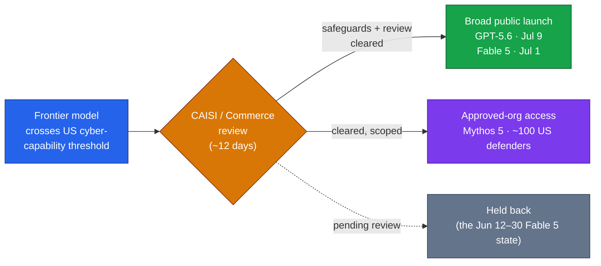

# LLM Updates — 2026-Jul-09

Thursday brief, written Thu Jul 9 (Los Angeles time). Yesterday's report closed
with a watch list: *"undated but staged — GPT-5.6 broad access and the Grok 4.5
public launch"* (Jul-08, "Watch next"). **Both landed today, within hours of each
other.** OpenAI shipped **GPT-5.6** (Sol, Terra, Luna) to every ChatGPT user and
API developer, and **SpaceXAI** (the rebranded xAI) opened **Grok 4.5** to the
public on grok.com and in the X app. With Anthropic's Fable 5 already back since
Jul 1, **today is the first day three frontier labs have a new, publicly
available frontier model live at the same time.**

Two things make today more than a coincidence of release calendars:

1. **The Washington gate *released* GPT-5.6 — it didn't fence it.** For three
   weeks these reports tracked GPT-5.6 as "fenced to ~20 orgs" behind a US
   cybersecurity review (Jul-03 §3, Jul-08 §2). Today the **Commerce Department's
   CAISI cleared it for a broad, global launch with no staged rollout** — and it
   cleared *ahead of schedule*, despite GPT-5.6 Sol reportedly matching a
   classified-tier model on offensive-cyber evals (§1). The gate is a ~12-day
   delay, not a wall.
2. **Grok 4.5 finally has an independent number.** Yesterday's brief filed Musk's
   "close to, perhaps exceeding Opus" under *unverified* because only a vendor
   self-eval existed (Jul-08 §3). Artificial Analysis has now scored it: **54 on
   the Intelligence Index, 4th overall** — Opus-adjacent, not Opus-beating, and
   priced to compete on cost rather than crown (§2, §3).

The competitive center of gravity, in other words, moved exactly where the last
few briefs pointed: **away from "can it ship" and toward "what does it cost and
where does it rank."** The one holdout is Google — **Gemini 3.5 Pro is still in
preview**, now the only unlaunched member of the mid-July cohort (§4).

This report does **not** re-derive the Fable 5 / Mythos 5 export saga and its
shared-weights + classifier-gate architecture (Jun-11 §2, Jul-01 §1), Fable 5's
move onto usage credits (Jul-08 §5), DeepSeek's Jul-24 legacy-ID cutoff and
Anthropic-format endpoint (Jul-08 §1), or Gemini 3.5 Pro's from-scratch rebuild
(Jul-08 §2). Those stand as written. Here we advance only what is **new since
yesterday.**

---

## 1. GPT-5.6 goes public — and the cyber gate opens

OpenAI launched the **GPT-5.6** family today across ChatGPT, the API, and Codex,
one day ahead of its own Jul-8 "this Thursday" teaser. Three tiers plus a
high-compute mode:

| Model | Role | Terminal-Bench 2.1 | Price (in / out per Mtok) |
|---|---|---|---|
| **Sol Ultra** | high-effort mode over Sol (more compute/request) | **91.9%** | (Sol pricing, higher token spend) |
| **Sol** | flagship — long-horizon coding, cyber, biology | 88.8% | $5 / $30 |
| **Terra** | balanced everyday work | 84.3% | $2.50 / $15 |
| **Luna** | new fast/budget tier | 82.5% | $1 / $6 |

For reference, **GPT-5.5 scored 83.4%** on the same benchmark — so even Terra, the
mid tier, edges the prior flagship, and Luna introduces a genuinely cheap tier
OpenAI didn't previously field.

**The regulatory story is the headline, though.** GPT-5.6 was the model these
briefs described as fenced behind a US-government review since late June. Today
the **Commerce Department's Center for AI Standards and Innovation (CAISI)**
cleared it for a **broad public launch, globally, with no staged rollout** — and,
per reporting, cleared it *ahead of the expected 30-day window* after direct
technical engagement between OpenAI and officials in Washington. What's notable is
that it cleared *despite* crossing the same capability line that gated Fable 5:
OpenAI reports GPT-5.6 Sol scored **96.7% on an internal cyberattack evaluation**
and hit **ExploitBench performance comparable to Anthropic's classified-tier
Mythos Preview at roughly one-third the inference cost.** A model that strong on
offensive-cyber evals shipping *openly* is the clearest sign yet that the June
export-control posture has softened into a **review-then-release** process rather
than a fence.

*Caveats:* the 96.7% cyberattack figure and the ExploitBench-vs-Mythos comparison
are **OpenAI's own numbers**, not independently reproduced — treat them as vendor
claims. Sol Ultra's exact incremental pricing over base Sol was not published in a
first-party page we could fetch; the tier structure and the Terminal-Bench figures
are consistently reported across multiple secondary sources.

**Sources:**
[OpenAI — Previewing GPT-5.6 Sol](https://openai.com/index/previewing-gpt-5-6-sol/) ·
[MLQ — Commerce clears GPT-5.6 for broad launch Jul 9](https://mlq.ai/news/commerce-department-clears-openais-gpt-56-for-broad-public-launch-on-july-9/) ·
[TechTimes — GPT-5.6 public after 12-day White House gate (Jul 9)](https://www.techtimes.com/articles/319979/20260709/gpt-56-goes-public-after-12-day-white-house-gate-tests-voluntary-ai-framework.htm) ·
[ExplainX — GPT-5.6 tiers, benchmarks, pricing](https://explainx.ai/blog/gpt-5-6-release-date-features-benchmarks-2026) ·
[DataCamp — Sol / Terra / Luna overview](https://www.datacamp.com/blog/gpt-5-6-sol-luna-terra)

---

## 2. Grok 4.5 ships publicly — and gets its first independent score

SpaceXAI (Musk rebranded xAI to **SpaceXAI** around the launch) shipped **Grok
4.5** to developers on Jul 8 via Grok Build, Cursor, and the API, then opened it to
the public on **grok.com and the X app today, Jul 9.** The pitch is explicitly a
**price play**: Musk positions it as "an Opus-class model, but faster, more
token-efficient and lower cost."

The numbers behind the pitch:

- **API pricing: $2 / $6 per Mtok** (input / output), with **cached input at $0.50**
  (a 75% discount) and higher-context pricing above 200K tokens.
- **500K-token context window**, configurable reasoning.
- SpaceXAI claims **4.2× token efficiency over Opus 4.8** on SWE-Bench Pro — i.e.
  a task that costs 4.2× more in Opus output tokens costs the same dollar amount
  as one Grok 4.5 run. (Vendor claim.)

**The independent number that was missing yesterday now exists.** Artificial
Analysis scored Grok 4.5 at **54 on the Intelligence Index, ranking it 4th
overall** — behind Opus 4.8 (56) and GPT-5.5 (55), ahead of much of the field but
short of Musk's "exceeding Opus" framing. The benchmark picture is genuinely
mixed: Grok 4.5 **leads Opus 4.8 on DeepSWE 1.0 and Terminal-Bench 2.1** but
**trails on DeepSWE 1.1 and SWE-Bench Pro.** The honest read is *Opus-adjacent
capability at roughly one-third to one-half the price* — which is a strong
commercial position without being a benchmark upset.

**Sources:**
[SpaceXAI — Introducing Grok 4.5](https://x.ai/news/grok-4-5) ·
[MarkTechPost — Grok 4.5, Cursor-trained, $2/M input (Jul 8)](https://www.marktechpost.com/2026/07/08/spacexai-releases-grok-4-5/) ·
[VentureBeat — launches at half the price of rivals](https://venturebeat.com/technology/spacexs-grok-4-5-launches-at-half-the-price-of-rivals-heres-why-that-could-rattle-anthropic-and-openai) ·
[Decrypt — Musk says it competes with last year's Opus](https://decrypt.co/373094/grok-4-5-elon-musk-claude-opus) ·
[ChatForest — builder evaluation: $2 input, 4.2× efficiency](https://chatforest.com/builders-log/grok-45-launch-pricing-benchmarks-cursor-training-builder-evaluation-july-2026/)

---

## 3. The independent leaderboard snapshot

With Grok 4.5 now scored, the **Artificial Analysis Intelligence Index** (v4.1,
which weights agents / coding / general capability / scientific reasoning at 25%
each across nine evals) gives a clean same-scale ranking of the frontier as of
today:

| Rank | Model | Index | Availability note |
|---|---|---|---|
| — | **Claude Fable 5** (max-effort, Opus-fallback config) | **60** | highest score, but this is the gated adaptive-reasoning configuration |
| 1 | **Claude Opus 4.8** (max) | **56** | most intelligent *generally available* model |
| 2 | **GPT-5.5** (xhigh) | **55** | within a point of Opus 4.8 |
| 3 | **Grok 4.5** | **54** | new today; the price-per-point leader |

Two honest caveats on this table. First, **GPT-5.6 is too new to be indexed** — it
launched today, so its Terminal-Bench 2.1 numbers (§1) are the only fresh signal
and they aren't directly comparable to the composite Index. Expect GPT-5.6 Sol /
Sol Ultra to reshuffle the top of this list once Artificial Analysis runs it.
Second, the **Fable 5 = 60** entry reflects its highest adaptive-reasoning
configuration (the one that can fall back to Opus 4.8), which is why it sits above
the "generally available" line rather than being ranked #1 outright.

The through-line the price chart above makes visual: **capability at the very top
is separated by a couple of Index points, but price spans an order of magnitude.**
Grok 4.5 and GPT-5.6 Luna clear the same work as the leaders for a fraction of the
per-token cost — which is exactly why the competition has moved to price.

**Sources:**
[Artificial Analysis — Intelligence Index](https://artificialanalysis.ai/evaluations/artificial-analysis-intelligence-index) ·
[Artificial Analysis — Index v4.1 (agentic weighting)](https://artificialanalysis.ai/articles/artificial-analysis-intelligence-index-v4-1) ·
[BenchLM — AA Intelligence Index leaderboard, July 2026](https://benchlm.ai/benchmarks/artificialAnalysis)

---

## 4. The through-line — the gate releases, and Gemini is the lone holdout

For three weeks the recurring pattern in these briefs was a **gated frontier**:
a model crosses a US cybersecurity-capability threshold, disappears behind a
review, and either stays dark (Fable 5, Jun 12–30) or ships to a tiny approved
list (GPT-5.6, "~20 orgs"). Today's GPT-5.6 clearance completes the shape of that
pattern — and it turns out to be a **valve, not a wall**:

The precedent is now explicit, and one line from today's coverage captures it:
*in the United States in 2026, releasing a frontier AI model runs through
Washington first — whether the law strictly requires it or not.* Both GPT-5.6 and
the Jul-1 Fable 5 return show the review resolves in **days, not months**, and
resolves toward **release**. That's a materially different environment from the
Jun-12 export-ban shock these reports opened on.

**The one lab still on the other side of the gate is Google.** Gemini 3.5 Pro
remains **in limited Vertex AI preview** as the second week of July begins — it
missed its June GA commitment and is now **roughly five weeks past** that target,
with GA aimed at **Jul 17** after the from-scratch rebuild (Jul-08 §2). Notably,
Google's delay is *self-imposed quality* (token-efficiency, coding, long-horizon
reasoning not yet at flagship bar), **not** a regulatory hold — so Gemini is the
mirror image of the GPT-5.6 story: cleared to ship, choosing not to yet.

**Sources:**
[TechTimes — GPT-5.6 public, "release runs through Washington" (Jul 9)](https://www.techtimes.com/articles/319979/20260709/gpt-56-goes-public-after-12-day-white-house-gate-tests-voluntary-ai-framework.htm) ·
[BigGo — Gemini 3.5 Pro delayed to Jul 17 for rebuild](https://finance.biggo.com/news/6f0c6bb2-795f-4c57-9d09-6db691d7638a) ·
[MarketScale — Gemini 3.5 Pro still in preview, week two of July](https://www.marketscale.com/industries/software-and-technology/gemini-3-5-pro-still-in-preview-what-enterprise-teams-evaluating-a-model-should-do-now)

---

## The bottom line

The mid-July launch window the last two briefs mapped out is now half-resolved,
and it resolved *fast*: **two frontier models went public on the same day**,
Washington's cyber review turned out to be a ~12-day valve rather than a wall, and
the fight visibly shifted from availability to **price and independent ranking**.
The top of the capability leaderboard is compressed into a few Index points
(Fable 5 60 / Opus 4.8 56 / GPT-5.5 55 / Grok 4.5 54), while the price axis spans
10× — so the pressure on the incumbents is a **cost** pressure, led by Grok 4.5
($2/$6) and GPT-5.6 Luna ($1/$6) undercutting Fable 5's $10/$50 credit meter.

**Watch next:** GPT-5.6's first *independent* Intelligence Index score (it will
likely reshuffle the top of §3); **Jul 17** — Gemini 3.5 Pro's target GA, the last
mid-July shoe to drop; **Jul 24, 15:59 UTC** — DeepSeek's legacy-ID cutoff
(Jul-08 §1); and whether Anthropic responds to the two same-day cheaper Opus-class
launches on price rather than capability.

---

*Compiled Thu Jul 9 2026 (Los Angeles time). Benchmark and pricing figures reflect
launch-day reporting and vendor disclosures; internal-eval numbers (GPT-5.6's
96.7% cyberattack score, SpaceXAI's 4.2× efficiency claim) are vendor-reported and
not independently reproduced. Several first-party pages returned 403 to automated
fetches; where a primary page could not be retrieved directly, claims were
cross-checked across multiple secondary sources and flagged inline. Model names,
dates, and figures may be revised as independent testing lands.*
