# LLM Updates — 2026-Jul-10

Friday brief, written Fri Jul 10 (Los Angeles time). Yesterday's report closed
its watch list with one item at the top: *"GPT-5.6's first **independent**
Intelligence Index score (it will likely reshuffle the top of §3)"* (Jul-09,
"Watch next"). **It landed, and it did exactly that.** Artificial Analysis has now
published its own numbers for the GPT-5.6 family, and the verdict is the sharpest
data point yet for the thesis these briefs have tracked all week — that the
frontier fight has moved from *"can it ship"* to *"what does it cost."*

Two things define today:

1. **GPT-5.6 Sol is essentially Fable-5-class intelligence at a third of the
   cost.** On the Artificial Analysis Intelligence Index at max reasoning effort,
   **Sol scores 59 — one single point behind Claude Fable 5's 60, and now #2
   overall** — while costing roughly **⅓ as much per task** ($1.04/task at max
   effort). That is not a "close second"; it is a near-tie at the top of the
   capability axis with a 3× gap on the cost axis (§1).
2. **Sol also *takes* the top of the new Coding Agent Index.** Artificial Analysis
   launched a harness-paired coding benchmark today, and **GPT-5.6 Sol leads it at
   80** in OpenAI's Codex harness — ahead across all three sub-evals (§2). And
   OpenAI paired the model launch with a **platform pivot**: ChatGPT Work, a
   long-horizon work agent, plus a rebuilt desktop app that folds Codex into
   ChatGPT — a "super app" move that reframes the contest from *best model* to
   *best agent that does your job* (§3).

The competitive picture yesterday was "the top is compressed into a few index
points, the price axis spans 10×." Today the independent scoring makes that
concrete and *names the value leader*: **OpenAI, not Anthropic, now owns the
best intelligence-per-dollar at the frontier** — while Anthropic keeps the
outright capability crown by a single point, at 3× the cost (§1, chart).

This report does **not** re-derive the Fable 5 / Mythos 5 export saga (Jun-11 §2,
Jul-01 §1), the Washington review-then-release valve (Jul-09 §5), Fable 5's move
onto usage credits (Jul-08 §5), or GPT-5.6's public launch and cyber-gate
clearance (Jul-09 §1). Those stand as written. Here we advance only what is
**new since yesterday** — chiefly the arrival of the independent number.

![Scatter plot of Artificial Analysis Intelligence Index (max reasoning effort, vertical axis, higher is smarter) against output price per million tokens (horizontal axis, cheaper to the left) for the frontier field on July 10 2026. Claude Fable 5 sits top-right at index 60 and $50 output. GPT-5.6 Sol sits almost level with it at index 59 but far to the left at $30 output, marked as #2, with a dashed connector noting the two are one index point apart while Sol costs about one third the per-task price. Claude Opus 4.8 is at 56 and $25, GPT-5.6 Terra at 55 and $15, Grok 4.5 at 54 and $6, and GPT-5.6 Luna at 51 and $6.](intelligence_vs_cost.svg)

---

## 1. The independent number lands: Sol at 59, one point behind Fable 5, at ⅓ the cost

Yesterday's brief filed OpenAI's launch-day framing under *vendor claims* and
flagged the missing piece explicitly: there was no arm's-length Intelligence Index
score for GPT-5.6 yet. That score is now published.

**Artificial Analysis Intelligence Index (max reasoning effort):**

| Rank | Model | Index | Price (in / out per Mtok) | Note |
|---|---|---|---|---|
| 1 | **Claude Fable 5** | **60** | $10 / $50 (credits) | capability crown, held by 1 pt |
| 2 | **GPT-5.6 Sol** | **59** | $5 / $30 | new #2 — ~⅓ Fable's per-task cost |
| 3 | Claude Opus 4.8 | 56 | $5 / $25 | |
| 4 | GPT-5.5 | 55 | — | prior OpenAI flagship |
| 4 | **GPT-5.6 Terra** | 55 | $2.50 / $15 | ties GPT-5.5, half the price of Sol |
| 6 | Grok 4.5 | 54 | $2 / $6 | Jul-8 launch (Jul-09 §2) |
| 7 | **GPT-5.6 Luna** | 51 | $1 / $6 | budget tier |

The single most important line: **Sol lands at 59 versus Fable 5's 60 — a
one-point gap — while Artificial Analysis measures its cost at $1.04 per Index
task, roughly a third of what Anthropic's top model runs.** The gap is driven by
*both* a lower per-token price ($30 vs $50 output) *and* better token efficiency:
Sol at max effort consumes ~15,000 tokens per Index task, down from GPT-5.5's
~16,000. Sol carries a 1M-token context and text+image input.

Set against yesterday's leaderboard (Fable 5 60 / Opus 4.8 56 / GPT-5.5 55 /
Grok 4.5 54), the reshuffle is exactly the one Jul-09 predicted: **GPT-5.6 Sol
slots directly into #2**, pushing Opus 4.8, GPT-5.5, and Grok 4.5 each down a
rung. The top of the table is now *two labs' flagships separated by a single
point* — with a 3× cost spread between them.

*Caveat worth stating plainly:* Artificial Analysis disclosed that it **supported
OpenAI with pre-release evaluation** of Sol, Terra, and Luna. The scores are still
run on AA's published methodology, but this is not a fully arm's-length,
after-the-fact measurement — treat the pre-release-partner relationship as a mild
asterisk on an otherwise-independent number.

**Sources:**
[Artificial Analysis — "GPT-5.6 has landed" (benchmarks across Intelligence, Speed, Cost)](https://artificialanalysis.ai/articles/gpt-5-6-has-landed) ·
[the-decoder — Sol nearly matches Fable 5 at one-third the cost](https://the-decoder.com/gpt-5-6-sol-nearly-matches-fable-5-on-aggregated-benchmarks-at-one-third-the-cost/) ·
[officechai — GPT-5.6 Sol places second right behind Claude Fable](https://officechai.com/ai/gpt-5-6-sol-places-second-right-behind-claude-fable-on-artificial-analysis-intelligence-index/) ·
[Artificial Analysis on X — $1.04/task at max effort, close second to Fable 5](https://x.com/ArtificialAnlys/status/2075268970492657905) ·
[Artificial Analysis — GPT-5.6 Sol (max) model page](https://artificialanalysis.ai/models/gpt-5-6-sol)

---

## 2. A new coding benchmark — and Sol tops it

Artificial Analysis also introduced a **Coding Agent Index** today: a benchmark
that *pairs each model with an agentic harness* and aggregates three frontier
coding evaluations — **DeepSWE, Terminal-Bench v2, and SWE-Atlas-QnA**.

**GPT-5.6 Sol (max) in OpenAI's Codex harness leads the new index at 80**,
topping all three sub-evaluations (tying Grok 4.5, running in xAI's Grok Build
harness, only on SWE-Atlas-QnA). This is the independent coding counterpart to
yesterday's vendor-reported Terminal-Bench figures (Jul-09 §1), and it points the
same direction: **Sol is the strongest coding agent measured so far**, which
matters more than the raw Index for the developer segment these launches target.

*Caveat:* by design the Coding Agent Index measures **model + harness**, not the
model in isolation — GPT models run in Codex, Grok in Grok Build. It is a fair
proxy for "what a developer actually gets," but it is *not* an apples-to-apples
model-only comparison, and harness quality is part of the score.

**Sources:**
[Artificial Analysis — "GPT-5.6 has landed" (Coding Agent Index)](https://artificialanalysis.ai/articles/gpt-5-6-has-landed) ·
[MarkTechPost — GPT-5.6 three-tier family, programmatic tool calling in Responses API](https://www.marktechpost.com/2026/07/09/openai-releases-gpt-5-6-a-three-tier-model-family-with-programmatic-tool-calling/) ·
[Latent Space — GPT-5.6 launch, Codex becomes ChatGPT superapp](https://www.latent.space/p/ainews-openai-launches-gpt-56-solterraluna)

---

## 3. The platform move: ChatGPT Work + a Codex-fused desktop "super app"

OpenAI didn't ship only models. Alongside GPT-5.6 it launched a set of products
that reposition the company from *model vendor* to *work platform*:

- **ChatGPT Work** — an agent, built on GPT-5.6 + Codex technology, that runs
  **autonomously for hours** across a user's apps and files and returns *finished
  deliverables* (e.g. a populated Excel or Word document) rather than chat turns.
- **A rebuilt desktop app that folds Codex into ChatGPT.** The former Codex app
  is now the ChatGPT desktop app — same icon, same feel — hosting both **ChatGPT
  Work** and **ChatGPT Codex**, which share plug-ins. Coverage reads this as the
  explicit **merge of ChatGPT and Codex into a single "super app."**
- **A hosted-sites service** for OpenAI customers, and **programmatic tool
  calling** in the Responses API (developer-facing surface for the agent stack).

The strategic read: the same day the *independent* score confirmed GPT-5.6 wins
on intelligence-per-dollar, OpenAI moved the goalposts past the model entirely —
toward **the agent that uses it to complete whole workflows.** Grok 4.5 (Jul-8)
and GPT-5.6 (Jul-9) already pushed the fight onto price; the ChatGPT Work / Codex
merge pushes it onto **product surface and long-horizon autonomy**, where a raw
per-token comparison stops capturing what's being sold.

**Sources:**
[the-decoder — OpenAI pairs GPT-5.6 rollout with ChatGPT Work agent](https://the-decoder.com/openai-pairs-its-gpt-5-6-public-rollout-with-chatgpt-work-a-new-agent-that-handles-entire-workflows/) ·
[Forbes — GPT-5.6 lands with work agents and a desktop pivot (Jul 10)](https://www.forbes.com/sites/anishasircar/2026/07/10/openais-gpt-56-lands-with-work-agents-and-a-desktop-pivot/) ·
[Cryptobriefing — ChatGPT Work launches, Codex merges into desktop app](https://cryptobriefing.com/chatgpt-work-launches-with-gpt-5-6-as-openai-merges-codex-into-desktop-app/) ·
[MacObserver — GPT-5.6, ChatGPT Work, new desktop app with built-in Codex](https://www.macobserver.com/news/openai-launches-gpt-5-6-chatgpt-work-and-new-desktop-app-with-built-in-codex/) ·
[9to5Mac — OpenAI unveils ChatGPT Work agent, GPT-5.6 available](https://9to5mac.com/2026/07/09/openai-announcing-the-next-chapter-for-chatgpt-today-watch-here/)

---

## 4. Where that leaves the incumbents

```mermaid
flowchart TB
    subgraph AXIS["The axis the week moved along"]
      direction LR
      CAP["CAPABILITY<br/>who scores highest"]:::head
      PRICE["PRICE / VALUE<br/>intelligence per dollar"]:::head
      PLAT["PLATFORM<br/>agent that does the work"]:::head
      CAP --> PRICE --> PLAT
    end

    CAP --> A["Anthropic Fable 5<br/>Index 60 &mdash; still #1<br/>but by 1 pt, at 3&times; cost"]:::anthropic
    PRICE --> O["OpenAI GPT-5.6 Sol<br/>Index 59 at &#8531; the cost<br/>value leader at the frontier"]:::openai
    PRICE --> X["xAI Grok 4.5<br/>Index 54 at $2/$6<br/>cheapest Opus-class"]:::xai
    PLAT --> O2["OpenAI ChatGPT Work<br/>+ Codex desktop super app"]:::openai
    G["Google Gemini 3.5 Pro<br/>still in preview &mdash; GA target Jul 17"]:::google -.->|"not yet on the board"| CAP

    classDef head fill:#334155,stroke:#0f172a,color:#ffffff;
    classDef anthropic fill:#6d28d9,stroke:#4c1d95,color:#ffffff;
    classDef openai fill:#1e40af,stroke:#1e3a8a,color:#ffffff;
    classDef xai fill:#0d9488,stroke:#115e59,color:#ffffff;
    classDef google fill:#64748b,stroke:#334155,color:#ffffff;
```

- **Anthropic** keeps the outright capability crown — Fable 5 at 60 is still #1 —
  but the margin is now a **single index point**, defended at **double Opus 4.8's
  price and ~3× Sol's per-task cost**, and Fable is on a usage-credit meter
  (Jul-08 §5) with included access expiring **Jul 12**. Yesterday's open question
  — *"whether Anthropic responds to the two same-day cheaper Opus-class launches on
  price"* — is now sharper, because the independent score removes any "but it's
  clearly smarter" defense at the top. **As of today there is no Anthropic price
  response.**
- **OpenAI** owns the two axes that moved this week: **best intelligence-per-dollar**
  (Sol) *and* **the most aggressive platform play** (ChatGPT Work + Codex merge).
- **xAI/SpaceXAI** remains the **cheapest Opus-class option** (Grok 4.5, 54 at
  $2/$6) — undercut on raw index by Sol, but still the price floor for
  ~Opus-tier capability.
- **Google** is still the missing entrant: **Gemini 3.5 Pro remains in preview**,
  GA targeted **Jul 17** (Jul-08 §2, Jul-09 §4). Every day it stays out, the
  "value frontier" narrative hardens without its input.

---

## The bottom line

The independent number arrived and it rewrote the top of the leaderboard the way
Jul-09 said it would — but the more durable story is *which* axis it settled.
**GPT-5.6 Sol is a statistical tie with Claude Fable 5 on intelligence (59 vs 60)
at roughly one-third the per-task cost, and it tops the new independent coding
benchmark.** For the first time this cycle, the *value* leader at the frontier is
clearly named, and it isn't the capability leader. Anthropic still holds #1 — by
one point, at 3× the cost, on a metered plan whose free window closes in two days.
And OpenAI, not content to win on price alone, spent the same day merging Codex
into ChatGPT and shipping a long-horizon work agent — moving the fight to a
surface where per-token price tables stop telling the whole story.

**Watch next:** whether **Anthropic responds on price** now that the "it's simply
smarter" defense has narrowed to one point (still no move as of today); **Jul 12**
— Fable 5's included-access window closes and full usage-credit pricing bites;
**Jul 17** — Gemini 3.5 Pro's GA target, the last mid-July entrant; **Jul 24,
15:59 UTC** — DeepSeek's legacy-ID cutoff (Jul-08 §1); and early independent
reads on **ChatGPT Work's** long-horizon reliability (the vendor demo is
hours-long autonomy; the field number is not in yet).

---

*Compiled Fri Jul 10 2026 (Los Angeles time). Index and pricing figures reflect
Artificial Analysis's published leaderboard and launch-week reporting; Sol/Terra/
Luna were evaluated by Artificial Analysis with pre-release access supplied by
OpenAI (noted in §1). The Coding Agent Index measures model + harness, not model
in isolation (§2). Several first-party and secondary pages (openai.com,
artificialanalysis.ai, Forbes, Simon Willison) returned 403 to automated fetches;
where a primary page could not be retrieved directly, figures were cross-checked
across multiple secondary sources and flagged inline. Model names, dates, and
figures may be revised as further independent testing lands.*
