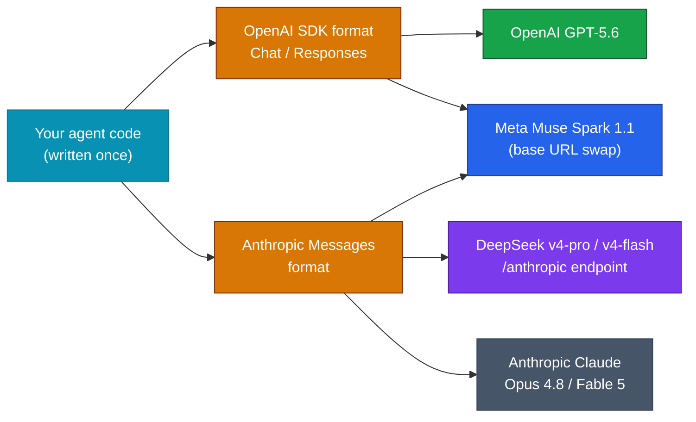

# LLM Updates — 2026-Jul-11

Saturday brief, written Sat Jul 11 (Los Angeles time). Two days ago the report
closed with a four-item watch list; the top item was *"GPT-5.6's first
**independent** Intelligence Index score — it will likely reshuffle the top of §3"*
(Jul-09, "Watch next"). **That score has now landed, and it did reshuffle the
top.** Artificial Analysis has run the GPT-5.6 family, and the result is the
sharpest confirmation yet of the thesis these briefs have tracked all week: at the
frontier, **capability is compressed into a handful of index points while price
spans an order of magnitude — and the value leader has changed hands.**

Three things are genuinely new since Wednesday:

1. **GPT-5.6 Sol is now independently the #2 model in the world and the #1 coding
   agent.** On the Artificial Analysis Intelligence Index it scores **59**, slotting
   in immediately behind Anthropic's gated Fable 5 (60) and *ahead of* the
   best generally-available model, Opus 4.8 (56). On the separate **Coding Agent
   Index it takes outright first at 80.0 — 2.8 points above Fable 5 — at roughly
   one-third the cost per task** (§1).
2. **A fourth frontier entrant slipped into the same week: Meta's Muse Spark 1.1
   (Jul 9).** It is agent-native (built-in primary/subagent orchestration, computer
   use), priced at **$1.25 / $4.25 per Mtok** — about a quarter of OpenAI's and
   Anthropic's headline rates — and its API **speaks both the OpenAI and the
   Anthropic Messages formats** (§2). That extends the interop pattern DeepSeek
   started on Jul 8 into something that now looks like a de-facto standard (§3).
3. **Anthropic's answer to the week's cheaper Opus-class launches is a demand-side
   one, and the clock runs out tomorrow.** The included-access window for Fable 5
   was extended Jul 7 from a Jul-7 cutoff to **Jul 12**; the **$10 / $50 metered
   rate begins Jul 13** (§4). Today, Jul 11, is the last full day before the most
   expensive model Anthropic has ever listed goes back on the meter — on the same
   weekend an independent benchmark showed a rival beating it at coding for a third
   of the price.

This report does **not** re-derive the Fable 5 / Mythos 5 export saga and the
shared-weights + classifier-gate architecture (Jun-11 §2, Jul-01 §1), the
GPT-5.6 tier structure and cyber-review clearance (Jul-09 §1), Grok 4.5's launch
and pricing (Jul-09 §2), DeepSeek's Jul-24 legacy-ID cutoff and Anthropic-format
endpoint (Jul-08 §1), or Gemini 3.5 Pro's from-scratch rebuild (Jul-08 §2). Those
stand as written. Here we advance only what is **new since Wednesday.**

---

## 1. GPT-5.6 Sol gets its number — #2 overall, #1 in coding, at a third of the cost

Artificial Analysis has published its independent evaluation of the GPT-5.6 family,
resolving the open question from Wednesday's brief. The headline figures:

| Rank | Model | Intelligence Index | Note |
|---|---|---|---|
| — | **Claude Fable 5** (gated adaptive config) | **60** | highest score, but the fenced Opus-fallback configuration |
| 2 | **GPT-5.6 Sol** (max) | **59** | new — now the most capable model with a public API |
| 3 | **Claude Opus 4.8** (max) | **56** | previously the top *generally available* model |
| 4 | **GPT-5.6 Terra** | **55** | mid tier ties the prior flagship |
| 4 | **GPT-5.5** (xhigh) | **55** | prior OpenAI flagship |
| 6 | **Grok 4.5** | **54** | the price-per-point leader on cost |

Two readings matter here. First, **the "generally available" crown moved.** For
weeks these briefs qualified every leaderboard with a footnote that Fable 5's 60
reflects a *gated* adaptive-reasoning configuration, leaving Opus 4.8 (56) as the
most capable model anyone could freely buy. GPT-5.6 Sol at **59** now takes that
practical top spot — it is openly available on the API today, and it beats Opus by
three index points.

Second, and more pointed for the price story, is the **Coding Agent Index** — the
agentic-coding composite that most closely tracks real developer work. OpenAI
reports, and Artificial Analysis's numbers support, that **GPT-5.6 Sol sets a new
state of the art at 80.0, 2.8 points above Claude Fable 5 (~77.2)** — while using
**less than half the output tokens, taking less than half the time, and costing
about one-third less.** On Artificial Analysis's per-task cost measure, **Sol (max)
runs ~$1.04 per task versus Fable 5 (max) at ~$2.75.**

The picture is not a clean sweep, and the honest caveat is that **Fable 5 still
leads on some coding evals** — GPT-5.6 Sol scores **64.6% on SWE-Bench Pro**, below
Fable 5's mark on that specific benchmark. So the accurate summary is not "Sol is
better than Fable everywhere," but the sharper commercial claim: **Sol matches or
beats the top model on the aggregate coding and intelligence indices, and does it
at roughly a third of the cost.** That is exactly the axis — value, not raw ceiling
— on which this week's competition has been fought.

**Sources:**
[Artificial Analysis — GPT-5.6 Sol (max) model page](https://artificialanalysis.ai/models/gpt-5-6-sol) ·
[Artificial Analysis — "GPT-5.6 has landed"](https://artificialanalysis.ai/articles/gpt-5-6-has-landed) ·
[The Decoder — Sol nearly matches Fable 5 at one-third the cost](https://the-decoder.com/gpt-5-6-sol-nearly-matches-fable-5-on-aggregated-benchmarks-at-one-third-the-cost/) ·
[OfficeChai — Sol places 2nd, right behind Claude Fable](https://officechai.com/ai/gpt-5-6-sol-places-second-right-behind-claude-fable-on-artificial-analysis-intelligence-index/) ·
[OpenAI on X — Coding Agent Index SOTA at 80.0](https://x.com/OpenAI/status/2075271425548795909) ·
[CodingFleet — GPT-5.6 Sol vs Claude Fable 5 benchmarks](https://codingfleet.com/blog/gpt-5-6-sol-vs-claude-fable-5/)

---

## 2. The week's fourth entrant — Meta's Muse Spark 1.1

Overshadowed on Jul 9 by the GPT-5.6 and Grok 4.5 launches, **Meta shipped Muse
Spark 1.1** the same day — its **first paid agent-native model**, and the fourth
new frontier-adjacent release of a single week. What distinguishes it is less a
benchmark line than a *posture*: it is built to be the cheap orchestration layer
other people's agents run on.

- **Pricing: $1.25 input / $4.25 output per Mtok** — roughly **a quarter** of the
  headline OpenAI and Anthropic rates, undercutting even Grok 4.5 ($2/$6) and
  GPT-5.6 Luna ($1/$6) on the output side relative to its capability tier. New API
  accounts get **$20 in free credits**; the preview is US-developers-only at launch.
- **1M-token context**, multimodal, with **native primary-agent and subagent
  orchestration** — as a main agent it plans and delegates across parallel
  subagents; as a subagent it stays scoped and escalates back. **MCP and
  custom-skill support** are built in, plus computer use.
- **Dual-format API:** the Meta Model API speaks **both** the OpenAI SDK (Chat
  Completions *and* Responses) **and** the Anthropic Messages format. Point the base
  URL at `api.meta.ai/v1`, set the model to `muse-spark-1.1`, and existing
  OpenAI- or Claude-native code runs largely unchanged.

Muse Spark 1.1 is not competing for the top of the intelligence leaderboard — it is
competing to be the **default, cheapest agent runtime**, and its design (orchestration
primitives + drop-in API compatibility) is aimed squarely at that role.

**Sources:**
[Meta AI — Introducing Muse Spark 1.1](https://ai.meta.com/blog/introducing-muse-spark-meta-model-api/) ·
[DataCamp — Muse Spark 1.1: Meta's agentic model and API](https://www.datacamp.com/blog/muse-spark-1-1) ·
[TechTimes — Muse Spark 1.1 opens paid API at a quarter of rivals' rates (Jul 10)](https://www.techtimes.com/articles/320088/20260710/metas-muse-spark-11-opens-paid-api-one-quarter-anthropic-openai-rates.htm) ·
[BigGo — Muse Spark 1.1 targets OpenAI and Anthropic on price and context](https://finance.biggo.com/news/202607092050_Meta-Muse-Spark-1.1-launch)

---

## 3. The quiet architecture story — everyone now speaks Claude's API dialect

Step back from the individual launches and a genuine *interop* trend is now visible.
In the space of three days, **two more frontier providers made the Anthropic
Messages format a first-class way to call their models:**

- **DeepSeek** (Jul 8) shipped an Anthropic-format endpoint (`api.deepseek.com/anthropic`)
  that reroutes `claude-opus*` → v4-pro and `claude-sonnet*/haiku*` → v4-flash
  (Jul-08 §1).
- **Meta** (Jul 9) shipped Muse Spark 1.1 with an API that natively accepts the
  Anthropic Messages format alongside OpenAI's (§2).

Combined with the OpenAI-format compatibility nearly everyone already offers, the
practical result is that the **API surface is converging into two lingua francas —
OpenAI Chat/Responses and Anthropic Messages — and a growing number of models
accept both.** For a developer, switching the model behind an agent increasingly
means changing a base URL and a model string, not rewriting the integration.

The strategic irony is worth naming: **the more the ecosystem standardizes on
Anthropic's API dialect, the easier it becomes to route a Claude-native workflow to
a cheaper competitor** — precisely the substitution pressure §1 and §4 describe, now
lowered to a one-line change.

**Sources:**
[DataCamp — Muse Spark 1.1 (dual-format API)](https://www.datacamp.com/blog/muse-spark-1-1) ·
[MarkTechPost — GPT-5.6 family, programmatic tool calling in the Responses API](https://www.marktechpost.com/2026/07/09/openai-releases-gpt-5-6-a-three-tier-model-family-with-programmatic-tool-calling/) ·
[BigGo — Muse Spark 1.1 launch (interop details)](https://finance.biggo.com/news/202607092050_Meta-Muse-Spark-1.1-launch)

---

## 4. Anthropic's response — extend the free window, hold the price

Wednesday's fourth watch item asked *"whether Anthropic responds to the two same-day
cheaper Opus-class launches on price rather than capability."* The answer so far is
**neither a price cut nor a capability counter — it's a deadline extension.**

After online backlash over the original Jul-7 cutoff, Anthropic **extended included
Fable 5 access** — up to 50% of weekly limits on Pro, Max, Team and select
Enterprise plans — **through Jul 12**, saying it acted on customer frustration. The
**metered rate is unchanged: $10 input / $50 output per Mtok, beginning Jul 13** —
still double Opus 4.8's rate and the most expensive generally-available model
Anthropic has ever listed.

The timing is unforgiving. **Today (Jul 11) is the last full day of the included
window.** When the meter turns on Tuesday, it does so into a market where — as of
this weekend — an **independently benchmarked competitor (GPT-5.6 Sol) tops the
coding index and sits one point off Fable 5 on general intelligence, at roughly a
third of the per-task cost** (§1), and where **two more sub-$5 agent-native models
(Grok 4.5, Muse Spark 1.1)** are live. Anthropic's stated intent is to restore Fable
5 to standard subscription pricing "when capacity allows," which frames the $10/$50
meter as a capacity-rationing measure rather than a competitive price — but from a
buyer's seat on Jul 13, it reads as the premium option in a field that just got
materially cheaper.

**Sources:**
[DigitalApplied — Fable 5 usage-credits switch, Jul 7 → Jul 13](https://www.digitalapplied.com/blog/claude-fable-5-usage-credits-july-7-pricing-guide-2026) ·
[Softonic — Anthropic extends free Fable 5 access through Jul 12](https://en.softonic.com/articles/anthropic-extends-free-claude-fable-5-access-through-july-12) ·
[Android Authority — Fable 5 promotion extended after early-cutoff backlash](https://www.androidauthority.com/claude-fable-5-free-extension-3685103/) ·
[Forbes — Fable 5 extends five more days](https://www.forbes.com/sites/sandycarter/2026/07/07/claude-fable-5-extends-by-five-more-days-10-moves-to-make-now/)

---

## 5. Governance backdrop — the AI Safety Index, and SpaceXAI's F

Sitting under the week's launch rush is a governance signal that landed alongside it
and has not been covered in these briefs: the **Future of Life Institute's Summer
2026 AI Safety Index** (released the week of Jul 7), grading nine major developers
across six domains — risk assessment, current harms, safety frameworks, existential
safety, governance, and information disclosure.

- **No company earned an A or a B.** **Anthropic ranked first with a C+**, leading
  five of six domains on transparency, an established safety framework, and
  governance. **OpenAI and Google DeepMind each got a C** (OpenAI leads the
  risk-assessment domain on the breadth of its external testing).
- **SpaceXAI (the rebranded xAI, maker of the just-launched Grok 4.5) received an
  F** — near the bottom of the table, a pointed contrast with its aggressive product
  cadence this week.
- The reviewers' central criticism is systemic: **Anthropic, OpenAI, Google DeepMind
  and Meta have all weakened or voided pledges to unilaterally pause if capability
  "redlines" are approached**, several citing competitor-contingent conditions — a
  "moving-goalposts" dynamic the report says has *"undermined safety frameworks
  across the board."* Policies prohibiting military use have also been successively
  withdrawn.

The index is the counter-melody to the price-and-benchmark story: the same
competitive intensity that produced four frontier releases in a week is, by this
assessment, eroding the pause commitments those labs made when the pace was slower.

**Sources:**
[Future of Life Institute — AI Safety Index, Summer 2026](https://futureoflife.org/ai-safety-index-summer-2026/) ·
[TIME — The latest AI safety rankings are in; nobody gets an A](https://time.com/article/2026/07/07/ai-safety-rankings-openai-anthropic-meta/) ·
[Seeking Alpha — Google, Anthropic, OpenAI lead; SpaceXAI receives F](https://seekingalpha.com/news/4611964-google-anthropic-openai-lead-ai-safety-index-spacexai-receives-f) ·
[GovInfoSecurity — Anthropic tops the index despite a C+](https://www.govinfosecurity.com/anthropic-tops-ai-safety-index-despite-c-grade-a-32192)

---

## 6. The lone holdout, unchanged — Gemini 3.5 Pro

No change on the one member of the mid-July cohort still unlaunched. **Gemini 3.5
Pro remains in limited Vertex AI preview, targeting GA on Jul 17** after Google
DeepMind scrapped the 2.5 Pro base and ran a from-scratch pre-training cycle
(2M-token context, Deep Think reasoning layer; Jul-08 §2). Google has still not
published a model card, API pricing, or a firm confirmation beyond the Jul-17
target, and — as noted Wednesday — the hold is **self-imposed quality, not a
regulatory gate.** Six days out, it is the last shoe of the mid-July window.

**Sources:**
[BigGo — Gemini 3.5 Pro delayed to Jul 17 for full rebuild](https://finance.biggo.com/news/6f0c6bb2-795f-4c57-9d09-6db691d7638a) ·
[TechTimes — Gemini 3.5 Pro targets Jul 17](https://www.techtimes.com/articles/319877/20260708/gemini-35-pro-targets-july-17-deepseeks-july-24-deadline-hits-developers-now.htm)

---

## The bottom line

The week that opened with "two frontier models shipped on the same day" now closes
with the **independent scoreboard catching up to the launches — and it moved the
value crown.** GPT-5.6 Sol is, by Artificial Analysis's numbers, the most capable
model you can buy on an open API (#2 overall at 59, above Opus 4.8) and the
**outright leader in agentic coding (80.0) at roughly a third of Fable 5's per-task
cost.** A fourth entrant, Meta's Muse Spark 1.1, arrived priced at a quarter of the
incumbents and speaking Claude's own API dialect — deepening an interop convergence
that makes swapping to a cheaper model a one-line change. And Anthropic's reply to
all of it is a demand-side one: a free-window extension that expires **tomorrow**,
after which its flagship goes back on a $10/$50 meter into a visibly cheaper field.
The through-line the whole week has been drawing is now explicit — **the frontier is
compressed on capability and stretched on price, and this weekend the cheapest
credible option is also, on the metric that matters most to developers, the best.**

**Watch next:** **Jul 12** — the last day of Fable 5's included window before the
Jul-13 meter; whether Anthropic blinks on the $10/$50 rate; **Jul 17** — Gemini 3.5
Pro's GA target, the final mid-July shoe; **Jul 24, 15:59 UTC** — DeepSeek's
legacy-ID cutoff (Jul-08 §1); GPT-5.6 Sol Ultra's independent index score (only the
base Sol has been run so far); and whether Muse Spark 1.1's orchestration pitch
translates into real agent-runtime adoption once the preview opens beyond US
developers.

---

*Compiled Sat Jul 11 2026 (Los Angeles time). Benchmark and pricing figures reflect
launch-window reporting and vendor disclosures; where a first-party page returned a
403 to automated fetches (several did — Artificial Analysis model pages, some vendor
blogs), figures were cross-checked across multiple secondary sources and flagged
inline. Vendor-reported efficiency and cost-per-task claims (OpenAI's "<half tokens,
<half time," the ~$1.04-vs-$2.75 per-task figures) are as published by Artificial
Analysis and OpenAI and not separately reproduced here. Model names, dates, and
figures may be revised as further independent testing lands.*
