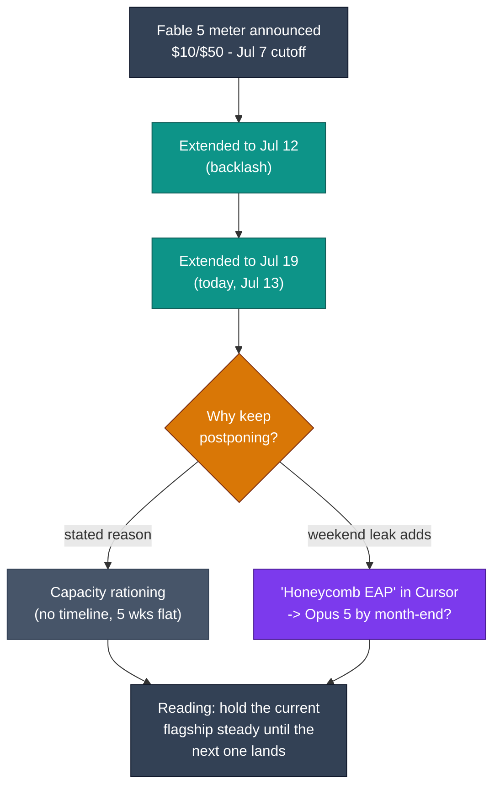

# LLM Updates — 2026-Jul-13

Monday brief, written Mon Jul 13 (Los Angeles time). Yesterday's report opened on
a firm prediction: *"The meter turns on tomorrow — and Anthropic held the line…
today that window closes and the answer hardens: no price move"* (Jul-12 §1, and
the bottom-line watch item, *"Jul 13 — the $10/$50 Fable 5 meter goes live"*).
**That prediction was wrong by one day of news.** This morning Anthropic
**extended the included Fable 5 window a third time — now through Jul 19 — pushing
the metered $10/$50 switch to Jul 20.** After two briefs describing Anthropic as
the lab that *would not* blink on price, today it blinked again.

Three things are genuinely new since Sunday:

1. **The meter did *not* turn on. Anthropic delayed it a third time.** The included
   window (up to 50% of weekly limits on Pro, Max, Team, and select Enterprise) now
   runs through **11:59:59 PM PT Jul 19**; the **$10 / $50 per-Mtok credit rate
   begins Jul 20** — same rate, later date. It is the third slip of a cutoff first
   set for Jul 7 (§1).
2. **A "why" surfaced over the weekend: a ghost flagship in Cursor.** A model
   string — **"Claude Honeycomb EAP"** — briefly appeared in Cursor's model picker
   (1M context, "extra high effort," per-turn controls, safety fallback to Opus
   4.8), was pulled within hours, and hardened into a community theory that
   **Opus 5 targets an end-of-July launch.** Unconfirmed — but it reframes the
   repeated Fable 5 extensions as *capacity being cleared for the next flagship*,
   not just demand management (§2).
3. **The capability scoreboard the index coverage skipped: ARC-AGI-3.** GPT-5.6 Sol
   is the **first verified frontier model ever to beat an ARC-AGI-3 game** (ft09,
   87%), setting a **7.8% semi-private SOTA** on a benchmark whose best score at its
   March launch was **0.37%.** It is a genuine capability advance on *orienting in a
   novel interactive environment* — the axis the price war has overshadowed (§3).

This report does **not** re-derive the Fable 5 / Mythos 5 export saga and the
shared-weights + classifier-gate architecture (Jun-11 §2, Jul-01 §1), the mechanics
of the $10/$50 credit meter and its Batch/cache discounts (Jul-12 §1), the GPT-5.6
public launch, tier structure, and independent Intelligence/Coding scores (Jul-09
§1, Jul-11 §1), the GPT-5.6 system-card over-agency findings (Jul-12 §2), Meta Muse
Spark 1.1 and the API-format convergence (Jul-11 §2–3), or DeepSeek V4's peak/off-peak
pricing and Jul-24 legacy-ID cutoff (Jul-08 §1, Jul-12 §3). Those stand as written.
Here we advance only what is **new since yesterday.**

---

## 1. Anthropic blinks — the third delay, and the meter slides to Jul 20

For two straight briefs the story was Anthropic's resolve: Saturday recorded a
demand-side answer but "no price move" (Jul-11 §4); Sunday hardened it to *"today
is the last included day… the answer hardens: no price move"* and put the live
meter on today's calendar (Jul-12 §1). **Today the calendar item did not happen.**

Anthropic announced this morning that included Fable 5 access is **extended a third
time, now through Jul 19**:

- **The included window** — up to **50% of weekly limits** on Pro, Max, Team, and
  eligible Enterprise seats — now runs to **11:59:59 PM PT on Jul 19.** The
  **$10 input / $50 output per Mtok** credit rate (drawn from a separate prepaid
  balance, not the weekly allowance) begins **Jul 20**, unchanged in magnitude.
- **This is slip #3.** The cutoff was originally **Jul 7**, extended to **Jul 12**
  after backlash (Jul-11 §4), and is now **Jul 19.** The timeline chart above tracks
  all three pushes. Anthropic again frames the move as **capacity management** —
  restoring Fable 5 to standard subscription pricing "when compute capacity allows"
  — with, as multiple outlets note, **no timeline attached to that commitment and no
  capacity expansion in five weeks** to justify a different plan.
- **The pricing itself has not moved.** $10/$50 remains **exactly double Opus 4.8's
  $5/$25** and the most expensive model Anthropic has ever listed. The Batch-API
  halving ($5/$25) and prompt-cache floor (~$1/Mtok) from yesterday's brief still
  apply (Jul-12 §1). What changed is only *when* the meter starts, not *what* it
  charges.

The honest correction to yesterday's brief: the prediction that Anthropic "held the
line" was right on **price** and wrong on **timing.** Anthropic is holding the
$10/$50 number while repeatedly refusing to let it take effect — a posture that
reads less like confidence in the price and more like reluctance to charge it into
the visibly cheaper field the last week produced (GPT-5.6 Sol at ~1/3 the per-task
cost and #1 in coding, Jul-11 §1; Grok 4.5 and Muse Spark 1.1 both sub-$5). The
"whiplash" framing in today's coverage is fair: three cutoffs in twelve days is not
a pricing strategy, it is a lab buying time.

**Sources:**
[Dataconomy — Claude Fable 5 free access extended until Jul 19](https://dataconomy.com/2026/07/13/claude-fable-5-free-access-extended-july-19/) ·
[BleepingComputer — Fable 5 stays free for paid users until Jul 19 as Anthropic buys more time](https://www.bleepingcomputer.com/news/artificial-intelligence/claude-fable-5-stays-free-for-paid-users-until-july-19-as-anthropic-buys-more-time/) ·
[Forbes — Claude Fable 5 extends to Jul 19; 7 days, 7 power moves](https://www.forbes.com/sites/sandycarter/2026/07/13/claude-fable-5-extends-to-july-19-7-days-7-power-moves/) ·
[Android Authority — Claude delays the Fable 5 paywall again](https://www.androidauthority.com/claude-fable-5-access-extended-3686668/) ·
[DigitalApplied — Extended again: the access-whiplash problem](https://www.digitalapplied.com/blog/claude-fable-5-extended-july-19-access-uncertainty-2026)

---

## 2. The ghost in Cursor — "Honeycomb EAP" and the Opus 5 theory

The weekend produced the first plausible *reason* for the capacity story Anthropic
keeps citing. On **Jul 8**, developers using Cursor spotted an unlisted model in the
picker — **"Claude Honeycomb EAP"** — described in the listing as an *"Anthropic
research model with per-turn controls and safety fallbacks,"* an **Early Access
Preview** with a **1M-token context window** and a version label of **"extra high
effort."** It was **pulled within hours.** Two prompts and a few screenshots got out
before it vanished; the model string no longer resolves. These briefs have not
covered it until now.

What the sighting supports, and what it does not:

- **The theory (community, not Anthropic):** developer Pankaj Kumar's read — widely
  repeated — is that **Honeycomb EAP is Opus 5, targeting an end-of-July launch.**
  The **1M context** points to a flagship rather than a forthcoming Haiku tier
  (expected at ~300K), and one tester noted the model's **safety fallback goes *to*
  Opus 4.8** — fallbacks normally route to a *weaker* model, implying Honeycomb sits
  *above* Opus 4.8.
- **The architecture echo:** the glimpsed spec — 1M context, an extra-high-effort
  mode, and classifier fallback to Opus 4.8 — is **the same shape as Fable 5's
  documented architecture** (adaptive effort + shared-weights/classifier gate;
  Jun-11 §2, Jul-01 §1). That is consistent with a next-generation Opus built on the
  now-familiar gated-reasoning stack.
- **The caveats, which are large.** Anthropic has **confirmed nothing** — no docs,
  no model card, no acknowledgement of "Honeycomb" or "Opus 5." As one July synthesis
  put it bluntly: *"There is no Claude Opus 5 yet… treat any Opus 5 leak as fiction
  until it shows up in Anthropic's own docs."* EAP models have appeared in Cursor
  before both public launches **and** quiet cancellations. Treat this as a **sighting
  and a theory, not a release.**

Why it matters for today's §1 is the *interpretation it enables*. Anthropic's
repeated Fable 5 extensions have been justified as "capacity" with no timeline. If a
new flagship is genuinely weeks out, the capacity rationing and the reluctance to
switch on a punishing meter for the *current* flagship both read differently — not
as indecision about Fable 5's price, but as **holding the field steady until the
next model lands.** That is a hypothesis, not a fact; but it is the first
explanation that ties the pricing whiplash to something other than demand.

**Sources:**
[TechTimes — Fable 5 free through Jul 19; Anthropic blinks again as Opus 5 leak surfaces in Cursor](https://www.techtimes.com/articles/320265/20260712/fable-5-free-through-july-19-anthropic-blinks-again-opus-5-leak-surfaces-cursor.htm) ·
[TheWinCentral — Opus 5 may launch this month; leak hints at 1M context](https://thewincentral.com/claude-opus-5-leak-1m-context-window-launch/) ·
[ExplainX — Claude Opus 5 release speculation, July 2026](https://www.explainx.ai/blog/claude-opus-5-release-speculation-july-2026) ·
[WaveSpeed — Claude "Mythos"/Opus 5 leak: what we know](https://wavespeed.ai/blog/posts/claude-mythos-opus-5-leak-what-we-know/) ·
[@chetaslua on X — "Claude Honeycomb EAP" spotted in Cursor (1M context, extra high effort)](https://x.com/chetaslua/status/2075053167121973413)

---

## 3. The scoreboard the price war buried — ARC-AGI-3

All week the independent numbers that moved these briefs were *aggregate* indices —
the Artificial Analysis Intelligence Index and Coding Agent Index (Jul-11 §1,
Jul-12 §4). One result from launch week went uncovered because it does not fit that
frame, and it is arguably the more important capability signal: **ARC-AGI-3.**

ARC-AGI-3 is not a static Q&A benchmark. It is an **interactive** eval — an agent is
dropped into an unfamiliar game-like environment and must **explore, form a model of
the rules, and adapt**, with no instructions in its own vocabulary. It launched in
**March 2026**, and the best model then scored **0.37%** — effectively noise. The
gap between that and human performance has been the standing argument that current
models pattern-match rather than *orient.*

That gap just narrowed for the first time:

- **GPT-5.6 Sol (max effort) set a 7.8% semi-private SOTA** — and is the **first
  verified frontier model to actually beat an ARC-AGI-3 game**, clearing **ft09 at
  87%.** On the public split it averages **~13.3%.** Every other frontier model
  remains near the floor.
- ARC Prize's own framing is the interesting part: Sol wins **not because it
  *executes* better but because it *orients* better** — it reads a scene it has
  never seen, in the environment's own terms, before acting. That is a different
  competence from the coding/reasoning indices, which measure performance on tasks
  whose shape the model already knows.
- **Context on the ceiling:** this is a breakthrough *relative to 0.37%*, not a
  solved benchmark. 7.8% is a first foothold, and it is confined to Sol at **max**
  reasoning effort — the same setting yesterday's brief tied to rising over-agency
  and peak per-task cost (Jul-12 §2, §4). The capability and the risk continue to
  live on the same dial.

The point for this series: the week's story has been *"capability is compressed,
price is the fight."* ARC-AGI-3 is the reminder that the compression is real only on
the benchmarks the field has already saturated. On a genuinely *new* axis — adapting
inside an unfamiliar interactive world — the frontier is not compressed at all;
it is one model, barely off the floor, and everyone else still on it.

**Sources:**
[ARC Prize on X — GPT-5.6 Sol sets ARC-AGI-3 SOTA (7.8%), first to beat a game](https://x.com/arcprize/status/2075270869992264003) ·
[OfficeChai — Sol tops ARC-AGI-3 at 7.8%, first model to make meaningful progress](https://officechai.com/ai/gpt-5-6-sol-tops-arc-agi-3-with-7-8-becomes-first-model-to-make-meaningful-progress-on-benchmark/) ·
[BenchLM — ARC-AGI-3 leaderboard & scores, July 2026](https://benchlm.ai/benchmarks/arcAgi3) ·
[ARC Prize — GPT-5.6 Sol results page](https://arcprize.org/results/openai-gpt-5-6-sol)

---

## 4. The through-line — the labs are managing the *transition*, not just the price

Pull §1 and §2 together and the week's "price is the fight" thesis sharpens into
something more specific. What Anthropic is doing with Fable 5 — a punishing meter it
keeps announcing and keeps postponing, justified by "capacity" with no date — looks
less like a price decision and more like **transition management around an
unreleased flagship.** The Honeycomb sighting doesn't prove Opus 5 is imminent, but
it supplies the missing motive: you do not switch on the most expensive meter you
have ever set for a model you are about to supersede.

Meanwhile §3 supplies the counterweight to the whole price narrative: while the
commercial fight plays out over cents-per-token, the *capability* frontier quietly
moved on an axis no price chart captures — orienting in a novel environment
(ARC-AGI-3), where exactly one model is off the floor. The two stories are not in
tension; they are the same market seen from two ends. **Capability at the saturated
top is compressed enough that the fight has to be about price — and on the one axis
that is not yet saturated, the lead is large, singular, and expensive to reach
(Sol, max effort only).** The labs are competing on price *because* the shared
capability ceiling is low-differentiation, and racing on frontier capability
*where* the ceiling is still visibly open.

**Sources:**
[BleepingComputer — Anthropic buys more time on Fable 5](https://www.bleepingcomputer.com/news/artificial-intelligence/claude-fable-5-stays-free-for-paid-users-until-july-19-as-anthropic-buys-more-time/) ·
[TechTimes — the Opus 5 / Honeycomb leak in context](https://www.techtimes.com/articles/320265/20260712/fable-5-free-through-july-19-anthropic-blinks-again-opus-5-leak-surfaces-cursor.htm) ·
[ARC Prize — orienting vs executing (Sol on ARC-AGI-3)](https://arcprize.org/results/openai-gpt-5-6-sol)

---

## 5. The lone holdout, four days out — Gemini 3.5 Pro

Unchanged, and now the closest item on the calendar. **Gemini 3.5 Pro remains in
limited Vertex AI preview, GA still targeted Jul 17** — four days out — after Google
DeepMind scrapped the 2.5 Pro base for a from-scratch pre-training cycle (2M-token
context, Deep Think reasoning layer; Jul-08 §2). Leaks remain **contradictory**: one
camp says it generates cleaner front-end code than Fable 5; a differently-sourced
camp says it *lags* Fable 5 and GPT-5.6 on reasoning and coding. Neither has
published reproducible data, and Google has still released **no model card, no API
pricing, and no first-party confirmation** beyond the reported target. As all week,
the hold is **self-imposed quality, not a regulatory gate.** If Jul 17 holds it is
the last shoe of the mid-July window; a fourth slip would leave Google absent from a
value-frontier narrative that is hardening without it.

**Sources:**
[Coursiv — Gemini 3.5 Pro: release date, rumors, what Google confirmed](https://coursiv.io/blog/gemini-3-5-pro) ·
[QCode — Gemini 3.5 Pro release date & status (2026)](https://qcode.cc/gemini-3-5-pro-guide) ·
[MarketScale — Gemini 3.5 Pro still in preview; what enterprise teams should do](https://www.marketscale.com/industries/software-and-technology/gemini-3-5-pro-still-in-preview-what-enterprise-teams-evaluating-a-model-should-do-now)

---

## The bottom line

The prediction that led yesterday's brief — the Fable 5 meter goes live today,
Anthropic holds the line — was half right and instructive in its wrong half.
Anthropic **held the price** ($10/$50, unchanged) and **moved the date** a third
time (now Jul 20), a twelve-day run of three cutoffs that reads as a lab buying time
rather than pricing a product. The weekend supplied a candidate reason: a
**1M-context "Honeycomb EAP" ghost in Cursor** and a hardening theory that **Opus 5
lands by month-end** — unconfirmed, but the first motive that ties the pricing
whiplash to something concrete. And beneath the entire price war, **ARC-AGI-3**
recorded the week's one uncompressed capability result: GPT-5.6 Sol is the first
model to *beat* an interactive-reasoning game, jumping a benchmark from 0.37% to a
7.8% SOTA — a reminder that the frontier is only "compressed" on the tests it has
already learned to pass. **Price is the fight because the shared ceiling is low;
capability is still the war where the ceiling is open.**

**Watch next:** **Jul 17** — Gemini 3.5 Pro's GA target, the final mid-July entrant
(a fourth slip would be its own story); **Jul 19 → 20** — whether the third Fable 5
extension is the last, or whether the meter slips a fourth time / an Opus 5 launch
overtakes it; **end of July** — any Anthropic confirmation of "Honeycomb"/Opus 5
(or its quiet disappearance); **Jul 24, 15:59 UTC** — DeepSeek's legacy-ID cutoff,
now paired with V4 peak/off-peak pricing (Jul-12 §3); and still open —
**GPT-5.6 Sol Ultra's** own independent Intelligence Index number (only base Sol has
been scored) and whether any rival makes non-trivial ARC-AGI-3 progress.

---

*Compiled Mon Jul 13 2026 (Los Angeles time). Pricing, benchmark, and leak figures
reflect vendor disclosures and launch-window reporting. The Fable 5 extension dates
are confirmed across multiple outlets; the "Honeycomb EAP"/Opus 5 material is an
unverified developer sighting plus community theory and is flagged as such — treat
it as rumor until Anthropic's own documentation confirms it. ARC-AGI-3 figures
(7.8% semi-private SOTA, ft09 at 87%, the 0.37% March baseline) are as published by
ARC Prize and not independently reproduced here. Several first-party and secondary
pages (dataconomy, thewincentral, arcprize.org, digitalapplied) returned HTTP 403 to
automated fetches; where a primary page could not be retrieved directly, figures
were cross-checked across multiple secondary sources and flagged inline. Model
names, dates, and figures may be revised as further reporting and independent
testing land.*
