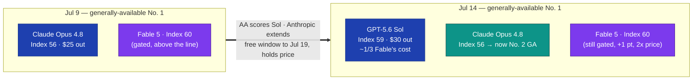

# LLM Updates — 2026-Jul-14

Tuesday brief, written Tue Jul 14 (Los Angeles time). Five days ago the Jul-9
report closed on a four-item watch list: *"GPT-5.6's first independent
Intelligence Index score (it will likely reshuffle the top of §3); Jul 17 —
Gemini 3.5 Pro's target GA; Jul 24 — DeepSeek's legacy-ID cutoff; and whether
Anthropic responds to the two same-day cheaper Opus-class launches on price
rather than capability."* Two of those four have now resolved — and they
resolved in the direction the last three briefs kept pointing.

**The headline is a crown changing hands.** On Jul 9, Anthropic's Claude Opus
4.8 (Index 56) was the highest-scoring *generally available* model, with the
gated Fable 5 adaptive configuration (60) sitting above the line. Artificial
Analysis has now scored **GPT-5.6 Sol at 59 (max effort)** — one point under
gated Fable 5, comfortably above Opus 4.8, and at **roughly a third of the
per-token cost.** For the first time in this series' run, the most intelligent
model you can actually buy without a gate is **not** an Anthropic model.

**Anthropic's answer, so far, is not a price cut.** The Jul-9 brief asked whether
Anthropic would respond "on price rather than capability." The Jul-14 answer is
*neither yet*: instead of touching Fable 5's $10/$50 credit meter, Anthropic
**extended Fable 5's free-included window for a third time — now through Jul 19**
(Jul 7 → Jul 12 → Jul 19) — and shipped it straight into a new product war, as
OpenAI launched **ChatGPT Work** against Anthropic's Cowork the same week (§2).
Meanwhile the *real* answer appears to be leaking: an unreleased Anthropic model
codenamed **"Honeycomb"** surfaced briefly inside Cursor on Jul 12, carrying the
same route-sensitive-prompts-to-Opus-4.8 gate architecture these reports have
tracked since June (§3).

This report does **not** re-derive the Fable 5 / Mythos 5 export saga and its
shared-weights + classifier-gate architecture (Jun-11 §2, Jul-01 §1), the Jul-9
GPT-5.6 public launch and Sol/Terra/Luna tier structure (Jul-09 §1), Grok 4.5's
public launch and pricing (Jul-09 §2), or DeepSeek's Anthropic-format endpoint
(Jul-08 §1). Those stand as written. Here we advance only what is **new since
Jul 9.**

![Scatter plot of Artificial Analysis Intelligence Index score against output price per million tokens for the mid-July 2026 field. Claude Fable 5 scores 60 at $50 output but sits above a dashed line marking the gated adaptive-reasoning ceiling. GPT-5.6 Sol scores 59 at $30 output and is labelled the new generally-available leader. Claude Opus 4.8 scores 56 at $25, the former generally-available leader. GPT-5.6 Terra scores 55 at $15. Grok 4.5 scores 54 at $6, the cheapest top-tier model. The vertical spread across the field is only six Index points while output price spans more than eight times.](intelligence_vs_price.svg)

---

## 1. GPT-5.6 Sol gets its number — and takes the generally-available crown

The Jul-9 brief flagged that GPT-5.6 was "too new to be indexed" and predicted its
first independent score would "reshuffle the top." Artificial Analysis has now run
it, and the reshuffle is real. GPT-5.6 Sol's Intelligence Index scales cleanly with
reasoning effort:

| GPT-5.6 Sol effort | Intelligence Index |
|---|---|
| **max** | **59** |
| xhigh | 58 |
| high | 56 |
| medium | 54 |

Placed against the Jul-9 leaderboard, Sol (max) at **59** slots **one point below
the gated Fable 5 adaptive-reasoning configuration (60)** and **above Claude Opus
4.8 (≈56)** — which means the title of *most intelligent generally available
model* passes from Opus 4.8 to GPT-5.6 Sol. The BenchLM leaderboard snapshot
(verified Jul 12) records the same shape on the generally-available slice: **GPT-5.6
Sol 58.9, Opus 4.8 55.7, GPT-5.6 Terra 55.0.** The Index composite here is v4.1's
nine-eval, agentic-weighted blend (GDPval-AA v2, τ³-Banking, Terminal-Bench v2.1,
SciCode, Humanity's Last Exam, GPQA Diamond, CritPt, AA-Omniscience, AA-LCR).

The part that matters commercially is the **price attached to that score.** Sol
delivers 59 at **$5 / $30 per Mtok** — versus Fable 5's **$10 / $50 credit meter**
for a single point more, and it does so with **no gate**. Multiple write-ups land
on the same phrase: Sol "nearly matches Fable 5 on aggregated benchmarks at one
third the cost." The scatter above makes the geometry visual — the whole top of
the field is compressed into **six Index points (54–60)** while output price spans
**more than 8× ($6 → $50).**

*Caveats:* the two independent sources differ by rounding — Artificial Analysis's
per-model page reports Sol (max) = **59**, BenchLM's leaderboard reports **58.9**;
treat "59, essentially tied one point under gated Fable" as the robust claim. The
"one third the cost" comparison is against Fable 5's credit rate, which is itself a
moving target this week (§2).

**Sources:**
[Artificial Analysis — GPT-5.6 Sol (max) model page](https://artificialanalysis.ai/models/gpt-5-6-sol) ·
[Artificial Analysis — "GPT-5.6 has landed"](https://artificialanalysis.ai/articles/gpt-5-6-has-landed) ·
[BenchLM — AA Intelligence Index leaderboard, July 2026](https://benchlm.ai/benchmarks/artificialAnalysis) ·
[The Decoder — Sol nearly matches Fable 5 at one-third the cost](https://the-decoder.com/gpt-5-6-sol-nearly-matches-fable-5-on-aggregated-benchmarks-at-one-third-the-cost/) ·
[OfficeChai — Sol places second, right behind Fable 5](https://officechai.com/ai/gpt-5-6-sol-places-second-right-behind-claude-fable-on-artificial-analysis-intelligence-index/)

---

## 2. Anthropic's response: extend the free window, don't cut the price

The Jul-9 brief asked whether Anthropic would answer the two same-day cheaper
Opus-class launches "on price rather than capability." The Jul-14 answer is a
third option: **keep Fable 5 free a little longer and defend the funnel.**

Anthropic has now **extended free Fable 5 access on paid plans for a third time —
through Jul 19.** The sequence these reports have tracked runs Jul 7 (original
subscription-included cutoff, Jul-01 §1 / Jul-08 §5) → Jul 12 → **Jul 19**. When
that window finally closes, the plan is still the same **$10 / $50 per-Mtok credit
meter** — the highest published rate for any generally available Anthropic model
and exactly double Opus 4.8's $5 / $25. In other words, **the sticker price hasn't
moved; the date it starts applying has.**

The timing reads as competitive, not coincidental. The same week:

- **GPT-5.6 Sol** landed one Index point under Fable at a third of the cost (§1).
- **OpenAI launched ChatGPT Work** on Jul 9 — an autonomous agent inside ChatGPT
  that takes an outcome, gathers context across connected apps, and works
  multi-hour projects by decomposing them into steps — a **direct answer to
  Anthropic's Cowork.** OpenAI also announced the Codex app is merging into a new
  ChatGPT desktop app that puts Chat, Work, and Codex on every plan including Free.
- **Grok 4.5** ($2 / $6) and **GPT-5.6 Luna** ($1 / $6) continue to anchor the
  bottom of the price range (Jul-09 §2–3).

The read: with the paid per-token tier now clearly undercut on price *and*
matched on the leaderboard, Anthropic is choosing to protect **adoption** (keep
Fable in front of users for free) rather than defend **margin** (cut the credit
rate). That is a defensive posture, and a temporary one — the Jul 19 date just
moves the same cliff four briefs down the road.

**Sources:**
[ExplainX — Fable 5 extended to July 19](https://www.explainx.ai/blog/fable-5-extended-july-19-2026-anthropic-announcement) ·
[Neowin — Anthropic extends Fable 5 promo as GPT-5.6 launch widens](https://www.neowin.net/news/anthropic-extends-claude-fable-5-promo-as-openai-prepares-wider-gpt-56-launch/) ·
[Simon Willison — "Fable gets another bump" (Jul 12)](https://simonwillison.net/2026/Jul/12/bump/) ·
[Bloomberg — OpenAI launches ChatGPT Work agent](https://www.bloomberg.com/news/articles/2026-07-09/openai-unveils-chatgpt-work-agent-to-field-tasks-for-hours) ·
[Forbes — ChatGPT Work debuts with GPT-5.6](https://www.forbes.com/sites/madhulika-pathak/2026/07/09/openai-debuts-chatgpt-work-workplace-ai-agent-with-gpt-56/)

---

## 3. The "Honeycomb" leak — Opus 5, and the gate architecture, surface in Cursor

The more consequential Anthropic story this week wasn't announced — it leaked. On
**Jul 12**, an unreleased model labelled **"Claude Honeycomb EAP"** (early-access
program) briefly appeared inside **Cursor** for some users before disappearing.
Community reporting treats it as an accidental early preview of Anthropic's next
flagship, widely assumed to be **Opus 5.** The leaked details, all unconfirmed:

- a **1-million-token context window**;
- a dedicated **high-reasoning mode** for complex tasks;
- advanced safety protocols — and, notably, screenshots that **appeared to show
  Honeycomb routing certain sensitive prompts to Claude Opus 4.8** rather than
  answering them directly.

That last detail is the one worth flagging, because it is the **exact gate
architecture** these briefs have documented since June: a frontier model wired to
**silently reroute flagged requests to a more conservative fallback** (the Fable 5
classifier that reroutes to Opus 4.8, Jun-09 / Jul-03 §1; the shared-weights +
classifier-gate design, Jun-11 §2). If the leak is real, Anthropic's next flagship
ships with the reroute gate **built in from day one**, not bolted on under export
pressure — a sign the June regulatory episode has hardened into a permanent design
pattern rather than a one-off compliance measure.

**Treat this as a leak, not a launch.** Anthropic's own docs and channels contain
no reference to "Honeycomb" or "Opus 5" as of this writing, and the standing advice
from the coverage is blunt: *treat any Opus 5 leak as fiction until it shows up in
Anthropic's own docs.* A community theory that Opus 5 ships by month-end is
unconfirmed. What is *not* speculative: an EAP build with a 1M window was live
enough inside Cursor to be screenshotted, which is a stronger signal than a rumor.

**Sources:**
[The Win Central — Opus 5 leak hints at 1M context window](https://thewincentral.com/claude-opus-5-leak-1m-context-window-launch/) ·
[Geeky Gadgets — Opus 5 leaks detail high-reasoning mode](https://www.geeky-gadgets.com/claude-opus-5-leaks/) ·
[The New Stack — Anthropic extends Fable 5 again; what developers found in Cursor](https://thenewstack.io/fable-5-honeycomb-opus/) ·
[WaveSpeed — Claude "Mythos"/Opus 5 leak: what we know](https://wavespeed.ai/blog/posts/claude-mythos-opus-5-leak-what-we-know/)

---

## 4. Meta's quiet entry — Muse Spark 1.1, built to orchestrate

Lost in the Jul-9 double launch of GPT-5.6 and Grok 4.5 was a third release the
same day: **Meta Superintelligence Labs shipped Muse Spark 1.1** to public preview
for US developers on the Meta Model API. It didn't make the Jul-9 brief; it belongs
here because its *positioning* is the genuinely novel thing in the mid-July field.

Muse Spark 1.1 is a **natively multimodal reasoning model** — text, image, video,
PDF, and audio in, text out — with a **1M-token context window** and up to **256K
output tokens.** Its design goal is **orchestration**, not single-shot accuracy:
Meta trained it to run **multi-agent systems**, acting as the main agent (gather
context, plan, delegate to parallel subagents) *or* as a subagent (stay in scope,
use its tools, escalate back when stuck).

| Muse Spark 1.1 | Score |
|---|---|
| MCP Atlas (tool use) | **88.1** |
| Humanity's Last Exam (with tools) | 62.1 |
| SWE-Bench Pro | 61.5 |
| JobBench | 54.7 |
| DeepSWE 1.1 | 53.3 |
| Terminal-Bench 2.1 | 80.0 |

The pattern in those numbers: Muse Spark **leads the tool-use / tool-augmented
reasoning rows and places roughly third on raw coding and multimodal** — exactly
what you'd expect from a model built to *coordinate* other models rather than to
top a coding leaderboard itself. Pricing is aggressive at **$1.25 / $4.25 per
Mtok** with $20 in signup credits, which lands it firmly in the cheap tier
alongside Grok 4.5 and GPT-5.6 Luna.

It's a different bet from the frontier-crown race in §1: while OpenAI, Anthropic,
and SpaceXAI fight over the top few Index points, Meta is pricing an
**orchestration layer** — the model you put *above* the others — into the budget
tier. Whether "orchestration-as-a-model" is a durable category or a feature that
gets absorbed into the flagships is the open question (it echoes the Sakana Fugu
"orchestration-as-a-model" framing from Jun-25).

**Sources:**
[Meta AI — Introducing Muse Spark 1.1](https://ai.meta.com/blog/introducing-muse-spark-meta-model-api/) ·
[MarkTechPost — Muse Spark 1.1, multimodal reasoning for agentic tasks](https://www.marktechpost.com/2026/07/09/meta-superintelligence-labs-releases-muse-spark-1-1/) ·
[Kingy AI — Muse Spark 1.1 benchmarks, specs, evals](https://kingy.ai/blog/muse-spark-1-1-benchmarks-specs-evals/) ·
[Artificial Analysis Release Tracker — Muse Spark 1.1](https://aireleasetracker.com/model/meta/muse-spark-1.1)

---

## 5. The through-line — the fight moved to price, and price is now winning

Three briefs ago the story was a *gated frontier* (can Washington's review let a
model ship). Two briefs ago it became *availability* (both GPT-5.6 and Grok 4.5
went public the same day). This week it is unambiguously **price and ranking** —
and the incumbent lost the round. The generally-available crown changed hands:

The compression is the whole point: **six Index points separate the entire top of
the field, while price spans more than 8×.** When the #1 generally-available model
costs a third of the #2-by-a-hair gated model, "which is smartest" stops being the
question buyers ask. Anthropic's non-price response — extend the free window,
defend Cowork against ChatGPT Work, and (if the Honeycomb leak is real) prepare a
next flagship with the reroute gate built in — is a bet that **capability lead plus
distribution** outlasts a **price gap.** The next two briefs test that bet.

**Two clocks are still ticking, both from the Jul-9 watch list:**

- **Gemini 3.5 Pro — target GA Jul 17 (3 days out).** As of Jul 13 it remains in
  limited Vertex AI preview, and *every* headline spec (the 2M context window,
  pricing) is still **unconfirmed by Google** — no model card, no API docs. Google
  is the lone frontier lab yet to ship into this cohort, and its delay is
  self-imposed quality after a from-scratch rebuild (Jul-08 §2), not a regulatory
  hold. Jul 17 is the fourth attempt at a date; treat it as a target, not a
  commitment.
- **DeepSeek legacy-ID cutoff — Jul 24, 15:59 UTC (10 days out).** `deepseek-chat`
  and `deepseek-reasoner` stop resolving; calls must use `deepseek-v4-flash`
  (284B/13B-active) or `deepseek-v4-pro` (1.6T/49B-active) directly. Note the
  mapping trap flagged before: `deepseek-reasoner` → **v4-flash thinking mode**,
  *not* v4-pro (Jul-08 §1) — reasoning-dependent code should test the substitution
  before the deadline, not after.

**Sources:**
[TechTimes — Gemini 3.5 Pro targets Jul 17, every spec unconfirmed (Jul 13)](https://www.techtimes.com/articles/320308/20260713/gemini-35-pro-targets-july-17-after-full-rebuild-every-spec-remains-unconfirmed.htm) ·
[MarketScale — Gemini 3.5 Pro still in preview, week two of July](https://www.marketscale.com/industries/software-and-technology/gemini-3-5-pro-still-in-preview-what-enterprise-teams-evaluating-a-model-should-do-now) ·
[Developers Digest — DeepSeek retires chat/reasoner Jul 24, V4 migration](https://www.developersdigest.tech/blog/deepseek-chat-to-v4-migration-guide) ·
[Enterprise DNA — DeepSeek API migration, Jul 24 deadline](https://enterprisedna.co/resources/news/deepseek-api-migration-july-24-deadline-2026/)

---

## The bottom line

The mid-July window the last three briefs mapped is now mostly resolved, and it
resolved against the incumbent. **GPT-5.6 Sol (Index 59, $5/$30, no gate) is the
new most-intelligent generally-available model**, one point under the gated Fable 5
(60, $10/$50) at a third of the cost — the first time in this run that the best
model you can simply buy isn't Anthropic's. Anthropic's counter has been to **hold
price and extend Fable 5's free window a third time (now Jul 19)** while defending
Cowork against OpenAI's new **ChatGPT Work**, with its real reply apparently
leaking through Cursor as **"Honeycomb" (Opus 5)** — 1M context, high-reasoning
mode, and the same reroute-to-Opus-4.8 gate architecture baked in. Meta slipped in
the same week with **Muse Spark 1.1**, a cheap, orchestration-first multimodal
model that competes on a different axis entirely.

**Watch next:** **Jul 17** — Gemini 3.5 Pro's fourth target GA (still every-spec-
unconfirmed, still preview as of Jul 13); **month-end** — whether "Honeycomb"/Opus
5 shows up in Anthropic's own docs or stays a Cursor screenshot; **Jul 24, 15:59
UTC** — DeepSeek's legacy-ID cutoff, now inside 10 days; and whether Anthropic ever
touches the $10/$50 credit meter, or lets the free-window extensions keep buying
time instead.

---

*Compiled Tue Jul 14 2026 (Los Angeles time). Benchmark and pricing figures reflect
launch-week reporting and vendor disclosures. Independent-eval numbers (the
Artificial Analysis Index scores in §1, Muse Spark's benchmark table in §4) are
cross-checked across sources but differ by rounding where noted. The "Honeycomb" /
Opus 5 material in §3 is an unconfirmed leak and is flagged as such throughout;
Gemini 3.5 Pro's Jul-17 date and specs are unconfirmed by Google. Several
first-party and paywalled pages (TechTimes, The New Stack, first-party vendor
blogs) returned 403 to automated fetches; where a primary page could not be
retrieved directly, claims were cross-checked across multiple secondary sources and
flagged inline. Model names, dates, and figures may be revised as independent
testing lands.*
