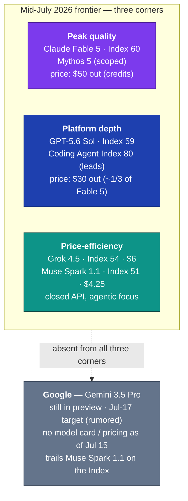

# LLM Updates — 2026-Jul-15

Wednesday brief, written Wed Jul 15 (Los Angeles time). Last week's report
(Jul-09) closed on two open questions: *when GPT-5.6 gets an independent
Intelligence Index score it will "reshuffle the top of this list"* (Jul-09 §3),
and *Gemini 3.5 Pro is the "lone holdout"* still in preview (Jul-09 §4). In the
six days since, **the first question resolved and the second did not.**

Three things define the mid-July window:

1. **The reshuffle happened — and it was small.** Artificial Analysis has now
   scored the GPT-5.6 family. **GPT-5.6 Sol (max) lands at 59 on the Intelligence
   Index — one point below Claude Fable 5's 60, above the most-intelligent
   *generally available* model (Opus 4.8 at 56), at roughly one-third the cost —
   and it *leads* the Coding Agent Index at 80** (§1). The Jul-08/09 thesis, that
   competition had moved from "can it ship" to "what does it cost," is now a
   measured fact rather than a forecast.
2. **Meta closed the frontier.** Meta Superintelligence Labs shipped **Muse Spark
   1.1** on Jul 9 through a new, metered **Meta Model API** — **no open-weights
   release.** The company that built the open-weights playbook with Llama fielded
   its strongest model to date as a closed, hosted, pay-per-token product (§2).
3. **The credit cliff slipped again.** Anthropic extended Fable 5's
   subscription-included access — and Claude Code's 50%-higher weekly limits —
   **through Jul 19** (from the Jul-7 date these briefs had been tracking). The
   $10/$50-per-Mtok credit meter is now a Jul-20 event (§3).

The competitive picture that emerges is a **three-corner standoff**: peak quality
(Fable 5 / Mythos 5), platform depth (GPT-5.6), and price-efficiency (Grok 4.5,
Muse Spark 1.1) — with Google conspicuously absent from all three while Gemini
3.5 Pro sits two days from its rumored Jul-17 target with no model card (§4).

This report does **not** re-derive the Fable 5 / Mythos 5 export saga and the
shared-weights + classifier-gate architecture (Jun-11 §2, Jul-01 §1), the
CAISI review-then-release pattern (Jul-09 §4), DeepSeek's Jul-24 legacy-ID cutoff
and Anthropic-format endpoint (Jul-08 §1), or Grok 4.5's launch mechanics
(Jul-09 §2). Those stand as written. Here we advance only what is **new since
Jul-09.**

![Scatter plot of Artificial Analysis Intelligence Index (vertical axis, 48 to 62) against output price in dollars per million tokens (horizontal axis, 0 to 55) for the mid-July 2026 frontier. Claude Fable 5 sits top-right at Index 60 and $50 output. GPT-5.6 Sol is just below and to the left at 59 and $30. GPT-5.6 Terra is at 55 and $15. Grok 4.5 at 54 and $6, GPT-5.6 Luna at 51 and $6, and Meta Muse Spark 1.1 at 51 and $4.25 cluster at the lower-left. A dashed reference line marks Opus 4.8 at Index 56 as the most intelligent generally available model. The points occupy a narrow nine-point capability band while output price spans roughly twelve-fold.](intelligence_vs_price.svg)

---

## 1. GPT-5.6 gets its number — the reshuffle is real but marginal

When GPT-5.6 launched on Jul 9 it was too new to be indexed (Jul-09 §3). Artificial
Analysis has now run the full family, and the result confirms the direction of the
last two briefs while shrinking the magnitude:

| Model (effort) | Intelligence Index | Output $/Mtok | Note |
|---|---|---|---|
| **Claude Fable 5** (max) | **60** | $50 (credits) | highest score; gated adaptive-reasoning config |
| **GPT-5.6 Sol** (max) | **59** | $30 | one point off the top, ~⅓ the cost |
| **Claude Opus 4.8** (max) | **56** | — | most intelligent *generally available* model |
| **GPT-5.6 Sol** (high) | **56** | $30 | ties Opus 4.8 at a lower effort tier |
| **GPT-5.5** (xhigh) | **55** | — | prior OpenAI flagship |
| **GPT-5.6 Terra** (max) | **55** | $15 | mid tier, matches last-gen flagship |
| **Grok 4.5** (high) | **54** | $6 | the Jul-9 price-per-point leader |
| **GPT-5.6 Luna** (max) | **51** | $6 | new budget tier |
| **Muse Spark 1.1** (xhigh) | **51** | $4.25 | see §2 |

Two findings matter more than the ranking itself:

- **Coding is where GPT-5.6 actually wins.** GPT-5.6 Sol (max) **leads the
  Artificial Analysis Coding Agent Index v1.1 at 80**, topping all three of its
  sub-evaluations. Artificial Analysis measured its **per-task cost in Claude
  Code at ~40% below Fable 5 (max) and ~10% below Opus 4.8 (max)** — the price
  advantage holds even on the agentic workloads where Anthropic has led.
- **The capability gap at the top is now ~1 Index point; the price gap is ~12×.**
  The scatter above makes the point visually: every frontier model sits in a
  nine-point band (51–60) while output price runs from $4.25 to $50. As
  *the-decoder* put it, GPT-5.6 Sol "nearly matches Fable 5 on aggregated
  benchmarks at one-third the cost." That is the whole story of the mid-July
  market.

*Caveats:* the Fable 5 = 60 entry is its highest adaptive-reasoning configuration
(the one that can fall back to Opus 4.8), which is why it sits above the
"generally available" line rather than being ranked as a shipping product. Index
values are the max/xhigh effort tiers unless noted; lower-effort tiers score
several points below and cost the same per token.

**Sources:**
[Artificial Analysis — GPT-5.6 has landed](https://artificialanalysis.ai/articles/gpt-5-6-has-landed) ·
[the-decoder — GPT-5.6 Sol nearly matches Fable 5 at one-third the cost](https://the-decoder.com/gpt-5-6-sol-nearly-matches-fable-5-on-aggregated-benchmarks-at-one-third-the-cost/) ·
[BenchLM — AA Intelligence Index leaderboard, July 2026](https://benchlm.ai/benchmarks/artificialAnalysis) ·
[llm-stats — Coding Agent Index v1.1](https://llm-stats.com/benchmarks/artificial-analysis-coding-agent-index-v1.1) ·
[trendingtopics — "Almost Fable 5 performance for 60% less"](https://www.trendingtopics.eu/almost-fable-5-performance-for-60-less-gpt-5-6-finally-gets-the-green-light/)

---

## 2. Meta closes the frontier — Muse Spark 1.1 ships as a metered API, not open weights

The genuinely new entrant since Jul-09 is **Meta**. On Jul 9, **Meta
Superintelligence Labs** released **Muse Spark 1.1** and, alongside it, the **Meta
Model API** — a hosted, pay-per-token endpoint. The strategic headline is what is
*missing*: **there is no open-weights release.** Muse Spark 1.1 is closed, hosted,
and metered. For the company whose Llama line defined the open-weights era, this
is a deliberate pivot toward the closed-API model that OpenAI and Anthropic run.

The specs frame it squarely as the **efficiency corner** of the market:

| Attribute | Muse Spark 1.1 |
|---|---|
| Builder | Meta Superintelligence Labs |
| Release | Jul 9, 2026 (developer public preview) |
| Context | 1M tokens, actively managed by the model |
| Modalities | text · image · video · document **in** → text **out** |
| Focus | agentic tasks — tool use, computer use, coding, multimodal understanding |
| Pricing | **$1.25 in / $4.25 out per Mtok** (+ $20 free credits) |
| Intelligence Index (xhigh) | **51** — up 8 points from Muse Spark 1.0's 43 in three months |
| Coding Agent Index | **69** — rivaling GPT-5.5 at a fraction of the cost |

Two things are notable. First, **51 on the Index puts Muse Spark 1.1 ahead of
every Google model** currently scored — a pointed result given Gemini 3.5 Pro's
delay (§4). Second, the **8-point jump in three months** (1.0 → 1.1) is one of the
steeper single-quarter gains any lab has posted this year, which is what makes the
closed pivot strategically legible: Meta now has a model good enough that metering
it looks more valuable than giving the weights away.

*Caveats:* the Coding Agent Index figure is reported as **69** by some trackers and
**71** by others (both describe it as "roughly one-third the cost of rivals" and
"rivaling GPT-5.5") — treat it as high-60s / low-70s. "Ahead of all Google models"
reflects the models Artificial Analysis has scored to date and will change the
moment Gemini 3.5 Pro is indexed.

**Sources:**
[Meta AI — Introducing Muse Spark 1.1](https://ai.meta.com/blog/introducing-muse-spark-meta-model-api/) ·
[MarkTechPost — Muse Spark 1.1, a multimodal reasoning model for agentic tasks](https://www.marktechpost.com/2026/07/09/meta-superintelligence-labs-releases-muse-spark-1-1/) ·
[Artificial Analysis — Muse Spark 1.1: Meta gains 8 Index points in three months](https://artificialanalysis.ai/articles/muse-spark-1-1-everything-you-need-to-know) ·
[officechai — Muse Spark 1.1 scores 51, ahead of all Google models](https://officechai.com/ai/metas-muse-spark-1-1-scores-51-on-artificial-analysis-intelligence-index-ahead-of-all-google-models/) ·
[cryptobriefing — Muse Spark 1.1 scores 69 on Coding Agent Index](https://cryptobriefing.com/muse-spark-coding-agent-index-score/) ·
[FourWeekMBA — the closed-API pivot that rewrites the open-weights playbook](https://fourweekmba.com/ai-meta-muse-spark-1-1-meta-model-api-closed-pivot/)

---

## 3. Fable 5's credit cliff slips to Jul 20

The Fable 5 pricing timeline these briefs have tracked since Jul-01 moved again.
On Jul 13, Anthropic **extended the subscription-included Fable 5 window through
Jul 19 (11:59:59 PM PT)** — the fourth such extension of a date that was
originally Jul 7 (Jul-01 §1) and then Jul 8 (Jul-08 §5). The terms are unchanged:

- Fable 5 remains usable for **up to 50% of weekly subscription limits at no extra
  cost** on Pro, Max, Team, and enabled seat-based Enterprise plans — drawing from
  the same weekly pool as other Claude models, and burning it faster.
- The **50% increase to Claude Code's weekly usage limits** is extended to the same
  Jul 19 date.
- **After Jul 19, Fable 5 transitions to credit-based usage at $10 in / $50 out per
  Mtok** — the pricing already reflected in the scatter above.

The read here is unchanged from Jul-08: the repeated extensions look like Anthropic
**buying time** rather than a change of plan — keeping Fable 5's headline-topping
Index score in front of subscribers while the price signal (and the GPT-5.6 Sol
comparison in §1) sharpens. Separately, the **classifier false-positive fix**
promised after the Jul-01 redeployment (Jul-03 §1) **still has no shipped date or
independent re-measurement** as of today; Anthropic reiterates that refinements are
"in progress."

**Sources:**
[BleepingComputer — Fable 5 stays free for paid users until Jul 19 as Anthropic buys more time](https://www.bleepingcomputer.com/news/artificial-intelligence/claude-fable-5-stays-free-for-paid-users-until-july-19-as-anthropic-buys-more-time/) ·
[officechai — Anthropic extends Fable 5 access on paid plans until Jul 19](https://officechai.com/ai/anthropic-extends-claude-fable-5s-access-on-paid-plans-until-19th-july/) ·
[Dataconomy — Fable 5 free access extended until Jul 19](https://dataconomy.com/2026/07/13/claude-fable-5-free-access-extended-july-19/) ·
[Anthropic — Redeploying Fable 5](https://www.anthropic.com/news/redeploying-fable-5)

---

## 4. The through-line — a three-corner standoff, with Google still off the board

With GPT-5.6 scored (§1) and Muse Spark 1.1 shipped (§2), the mid-July frontier
resolves into three distinct strategies rather than one leaderboard race. The
independent numbers now separate the labs by *what they optimize for*, not by a
single "best model" line:

**The Google story is the negative space.** Gemini 3.5 Pro was announced at I/O on
May 19 targeting June GA, slipped to July after a from-scratch rebuild (Jul-08 §2),
and as of **Jul 15 remains in limited Vertex preview** — **no model card, no
pricing page, and no `gemini-3.5-pro` listing in the public API docs.** The widely
cited **Jul-17 target is a leak, not a signed launch post**; developers planning
around it are planning around reporting. Meanwhile Meta's Muse Spark 1.1 scoring 51
"ahead of all Google models" (§2) is the sharpest expression of Google's position:
the one frontier lab whose latest model *isn't on the board at all* is now being
out-scored by a three-month-old lab's newest release.

If Jul-17 holds, the next brief writes the moment all four Western frontier labs
have a current, publicly scored model live at once — the completion of the arc
these reports have tracked since the Jun-12 export-ban shock. If it slips again,
Google's absence becomes the story.

**Sources:**
[TechTimes — Gemini 3.5 Pro targets Jul 17 after full rebuild; every spec unconfirmed (Jul 13)](https://www.techtimes.com/articles/320308/20260713/gemini-35-pro-targets-july-17-after-full-rebuild-every-spec-remains-unconfirmed.htm) ·
[BigGo — Google delays Gemini 3.5 Pro to Jul 17 for architectural rebuild](https://finance.biggo.com/news/6f0c6bb2-795f-4c57-9d09-6db691d7638a) ·
[MarketScale — Gemini 3.5 Pro still in preview entering the second week of July](https://www.marketscale.com/industries/software-and-technology/gemini-3-5-pro-still-in-preview-what-enterprise-teams-evaluating-a-model-should-do-now) ·
[kingy.ai — GPT-5.6 vs Claude, Grok, Muse & Gemini comparison](https://kingy.ai/blog/gpt-5-6-sol-vs-claude-fable-5-vs-grok-4-5-vs-muse-spark-1-1/)

---

## Watch next

- **Gemini 3.5 Pro GA (Jul 17, rumored).** A model card + pricing + an Artificial
  Analysis score would move Google from "off the board" (§4) to a fourth corner
  — or the date slips a fifth time and the absence hardens.
- **Fable 5 credit meter (Jul 20).** The subscription-included window closes Jul 19
  (§3); watch whether the $10/$50 credit pricing sticks this time or gets a fifth
  extension, and whether the classifier false-positive fix finally ships and is
  re-measured.
- **GPT-5.6 Sol Ultra on the Index.** The high-compute mode (Terminal-Bench 2.1
  = 91.9%, Jul-09 §1) has not yet been scored on the composite Index; if it clears
  60 it would displace Fable 5 at the top with a *generally available* model.
- **Meta's next move.** Whether the closed Meta Model API (§2) stays preview-only
  or opens to GA — and whether any Llama-style open-weights release follows, or
  the pivot is permanent.

---

*Compiled Wed Jul 15 2026 (Los Angeles time) from public reporting and independent
benchmark trackers. Vendor-reported figures are flagged as such; independent
Intelligence Index and Coding Agent Index numbers are from Artificial Analysis as
relayed by secondary trackers (the Artificial Analysis site returned HTTP 403 to
direct fetches during compilation, so its figures are cited via BenchLM, officechai,
cryptobriefing, the-decoder, and trendingtopics). Prior background is referenced by
date/section rather than repeated.*
