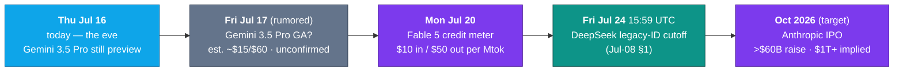

# LLM Updates — 2026-Jul-16

Thursday brief, written Thu Jul 16 (Los Angeles time). Yesterday's report
(Jul-15) closed on two **dated catalysts**: *Gemini 3.5 Pro GA (Jul-17,
rumored)* and *Fable 5's credit meter (Jul-20)* (Jul-15 §"Watch next"). Jul-16
is the **eve** — a countdown day, one before the first of those dates. On a
quiet news day the honest report is short, and two things are genuinely new in
the last 24 hours:

1. **Google re-enters the frame from two directions.** A fresh leak puts Gemini
   3.5 Pro's public launch **as soon as tomorrow (Jul-17)** with a
   community-estimated **~$15 in / $60 out per Mtok** — still *unconfirmed*, no
   model card (§1). And a closer read of the Artificial Analysis board **corrects
   the Jul-15 framing**: Google is *not* entirely "off the board." Its shipping
   **Gemini 3.5 Flash scores 55 on the Intelligence Index — above Meta's Muse
   Spark 1.1 at 51** — while registrations for **Gemini 3.6 Flash** and **Gemini
   3.5 Flash Light** suggest a stopgap ladder is being filled *below* the delayed
   flagship (§1).
2. **The race moves to capital markets.** *CNBC* (Jul 15) reports **Anthropic is
   lining up IPO investor meetings**, targeting a listing **as soon as October**
   that — at a raise reported above $60B against a ~$965B valuation — would be
   **the largest IPO in history**. The "pre-IPO equity gap" that these briefs
   treated as a *recruiting* subplot (Jul-03) is now a **headline event** and a
   direct sprint against OpenAI to the public markets (§2).

This report does **not** re-derive settled background: the Fable 5 / Mythos 5
export saga and shared-weights + classifier-gate architecture (Jun-11 §2,
Jul-01 §1), the GPT-5.6 family mechanics and its Index/Coding-Agent scores
(Jul-15 §1), Muse Spark 1.1's closed-API pivot (Jul-15 §2), Grok 4.5's launch
(Jul-09 §2), or DeepSeek's Jul-24 legacy-ID cutoff (Jul-08 §1). The **Fable 5
credit meter is unchanged** — still Jul-20 as set on Jul-13 (Jul-15 §3) — and
appears only under "Watch next." Here we advance only what is **new since
Jul-15.**

---

## 1. Google, from two directions — the eve of Pro, and a Flash correction

### The eve of Gemini 3.5 Pro

The single most-watched date in these briefs since late June arrives tomorrow.
As of **Thu Jul 16** the state is exactly what it was on Jul-15, one day
shorter: **Gemini 3.5 Pro remains in limited Vertex preview**, with **no model
card, no pricing page, and no `gemini-3.5-pro` listing** in the public API docs.
What is new is a **fresh leak** — reported Jul 15/16 — that the public launch
could land **"tomorrow," i.e. Jul 17**, alongside a **community-estimated price
of roughly $15 in / $60 out per Mtok** (cited as ~£12/£48). Both remain
**rumor**: Google has confirmed neither the date, the 2M-token context window,
the Deep Think reasoning layer, nor any price.

The read is unchanged from Jul-15 and now simply time-boxed: **if Jul-17 holds**,
the next brief writes the moment all four Western frontier labs have a current,
publicly scored flagship live at once; **if it slips a fifth time**, Google's
flagship absence hardens into the story. Developers planning around tomorrow are
still planning around reporting, not a signed post.

### The correction — Google was never fully "off the board"

The Jul-15 brief leaned on a sharp line: Muse Spark 1.1's Index of 51 was "ahead
of every Google model currently scored," and Google was "the one frontier lab
whose latest model isn't on the board at all" (Jul-15 §2, §4). A closer look at
the Artificial Analysis board this week shows that overstated Google's absence.
**Gemini 3.5 Flash — shipped at I/O and generally available across the Gemini
API, AI Studio, the Gemini app, and Vertex — scores 55 on the Intelligence
Index** (up 9 points from Gemini 3 Flash), which places it **above Muse Spark
1.1's 51** and level with GPT-5.6 Terra:

The precise, defensible version of the claim is therefore: **it is Google's
*flagship* that is off the board, not Google.** Its Flash tier is present,
mid-pack, and — on Artificial Analysis's own vendor-reported sub-scores —
competitive on agentic work (Terminal-Bench 2.1 76.2%, MCP Atlas 83.6%, CharXiv
Reasoning 84.2%) at roughly **4× the output speed** of frontier rivals. The
"efficiency corner" the Jul-15 brief assigned to Grok 4.5 and Muse Spark 1.1 has
a fourth occupant Google already shipped.

### A Flash ladder is being filled while the flagship slips

The other new signal is downstream of the delay: **model registrations for
`Gemini 3.6 Flash` and `Gemini 3.5 Flash Light`** have been spotted, which
reporting reads as **stopgap releases** — cheaper, faster tiers Google can ship
*now* to keep its lineup moving while the Pro rebuild finishes. It is the mirror
image of Meta's Jul-9 move (Jul-15 §2): where Meta closed a *frontier* model
behind a metered API, Google is **widening the bottom of its ladder** to hold
developer attention through a flagship gap. Neither has shipped a
public-confirmed spec, so treat the two names as **leaked registrations, not
products** — but the direction is consistent with a company managing a delay by
competing on price and speed rather than peak capability.

**Sources:**
[NPowerUser — Gemini 3.5 Pro could launch tomorrow: new leak reveals major upgrades](https://nokiapoweruser.com/gemini-3-5-pro-launch-tomorrow-leak/) ·
[TechTimes — Gemini 3.5 Pro targets Jul 17 after full rebuild; every spec unconfirmed (Jul 13)](https://www.techtimes.com/articles/320308/20260713/gemini-35-pro-targets-july-17-after-full-rebuild-every-spec-remains-unconfirmed.htm) ·
[geeky-gadgets — Stopgap Gemini 3.6 Flash may launch during Gemini 3.5 Pro delay](https://www.geeky-gadgets.com/gemini-3-5-pro-delayed-again/) ·
[Artificial Analysis — Gemini 3.5 Flash: the new leader in intelligence vs. speed](https://artificialanalysis.ai/articles/gemini-3-5-flash-everything-you-need-to-know) ·
[BenchLM — Gemini 3.5 Flash benchmarks & Intelligence Index](https://benchlm.ai/models/gemini-3-5-flash) ·
[Google DeepMind — Gemini 3.5 Flash model card](https://deepmind.google/models/model-cards/gemini-3-5-flash/) ·
[AIToolsReview — Gemini 3.5 Pro: what's confirmed, benchmarks & pricing (July 2026)](https://aitoolsreview.co.uk/insights/gemini-3-5-pro)

---

## 2. Anthropic's IPO clock starts — the race goes to capital markets

The competition these briefs have tracked at the *model* layer acquired a new
front on Jul 15. *CNBC* reports **Anthropic is lining up investor meetings ahead
of a public offering**, with a listing on Nasdaq or NYSE possible **as soon as
October 2026** — a sprint to **beat OpenAI to the public markets.** The company
filed **confidential IPO paperwork on Jun 1**; the offering is reportedly led by
**Goldman Sachs, JPMorgan, and Morgan Stanley.**

The numbers are what make this a frontier-AI story and not just a finance one:

| Figure | Value | Note |
|---|---|---|
| Last private valuation | **~$965B** | Series H-1, May 2026 (Jul-03 referenced the raise) |
| Run-rate revenue | **~$30B** annualized (Apr 2026); ~$47B reported mid-May | ~32× revenue at $965B |
| Lead underwriters | **Goldman Sachs · JPMorgan · Morgan Stanley** | per reporting |
| Target window | **as early as Oct 2026** | Nasdaq or NYSE |
| Reported raise | **>$60B** | would exceed Saudi Aramco's $29.4B (2019) as the largest IPO ever |
| Implied cap | **past $1T** on secondary-market pricing | trillion-dollar debut |

Two threads from earlier briefs converge here. First, the **"pre-IPO equity
gap"** that Jul-03 identified as *why Google was losing researchers to Anthropic
and OpenAI* (Shazeer → OpenAI; Jumper, Adler, Pritzel → Anthropic) is now
concrete: Anthropic's equity is about to become **publicly priced and liquid**,
which sharpens exactly the recruiting advantage Google could not match. Second,
the **Fable 5 credit meter** (Jul-20, §"Watch next") reads differently against an
October IPO backdrop — the repeated extensions and the eventual $10/$50 metered
pricing are being set by a company optimizing a revenue story for public-market
investors, not only a product roadmap.

*Caveats:* the October window, the >$60B raise, and the $1T+ implied cap are
**reported/estimated, not filed figures** — a confidential S-1's terms emerge
only through bookbuilding. Revenue figures span a range ($30B annualized in
April to a ~$47B run-rate cited mid-May) and should be treated as directional.

**Sources:**
[CNBC — Anthropic moves closer to mega-IPO as bankers line up investor meetings (Jul 15)](https://www.cnbc.com/2026/07/15/anthropic-ipo-banks-investor-meetings.html) ·
[Yahoo Finance — Anthropic is said to plan IPO investor meetings as listing nears](https://finance.yahoo.com/markets/stocks/articles/anthropic-said-plan-ipo-investor-152850812.html) ·
[BitMEX — Anthropic IPO guide: price, date, and valuation](https://www.bitmex.com/blog/anthropic-ipo-guide) ·
[indmoney — Anthropic IPO filed confidentially: valuation, revenue, risks](https://www.indmoney.com/blog/us-stocks/anthropic-ipo-valuation-revenue-risks-indian-investors) ·
[Sacra — Anthropic revenue, valuation & funding](https://sacra.com/c/anthropic/)

---

## The through-line — a calendar of catalysts, not a leaderboard

Mid-July 2026 is no longer being decided by a single "best model" number. The
Jul-15 brief framed the field as a three-corner standoff (quality / platform /
efficiency); Jul-16 shows that the *pending* moves are now **dated events on a
calendar** — one product launch, one price change, one legacy cutoff, and one
IPO — with Google and Anthropic driving the two nearest ones:

The shape of the next week is set: **tomorrow tests Google**, **Monday tests
Anthropic's pricing nerve**, and **October tests whether the frontier's
capability race and its capital race resolve in the same direction.** On Jul-16
itself, nothing shipped — which is the accurate finding for a countdown day.

---

## Watch next

- **Gemini 3.5 Pro GA (Jul-17, rumored).** A model card + pricing + an Artificial
  Analysis flagship score would move Google from "flagship off the board" (§1) to
  a full fourth corner — or the date slips a fifth time and the absence hardens.
  Watch whether the leaked ~$15/$60 price is real (it would sit *above* GPT-5.6
  Sol's $30 output and near Fable 5 territory).
- **The Flash ladder.** Whether `Gemini 3.6 Flash` and `Gemini 3.5 Flash Light`
  (§1) ship as confirmed products with specs, or stay leaked registrations.
- **Fable 5 credit meter (Jul-20).** Unchanged since Jul-13 (Jul-15 §3): the
  subscription-included window closes Jul 19, $10/$50 metering begins Jul 20.
  Watch whether it sticks this time or gets a fifth extension — and whether the
  long-promised classifier false-positive fix (Jul-03 §1) finally ships.
- **Anthropic IPO (Oct, target).** Any move from confidential S-1 to a public
  filing, a priced range, or a confirmed exchange/date (§2).
- **GPT-5.6 Sol Ultra on the Index.** The high-compute four-agent mode
  (Terminal-Bench 2.1 = 91.9%) is still unscored on the composite Intelligence
  Index (Jul-15 §"Watch next"); if it clears 60 it displaces Fable 5 at the top
  with a generally available product.
- **DeepSeek legacy-ID cutoff (Jul-24).** `deepseek-chat` / `deepseek-reasoner`
  retire at 15:59 UTC (Jul-08 §1); eight days out.

---

*Compiled Thu Jul 16 2026 (Los Angeles time) from public reporting and
independent benchmark trackers. Rumored and community-estimated figures (the
Jul-17 Gemini date, its ~$15/$60 price, the Gemini 3.6 Flash / 3.5 Flash Light
registrations, and Anthropic's October / >$60B IPO figures) are flagged as such
and are not confirmed by the vendors. Independent Intelligence Index numbers are
from Artificial Analysis as relayed by secondary trackers; several primary
sources (Artificial Analysis, TechTimes, CNBC, Yahoo Finance, and some vendor
blogs) returned HTTP 403 to direct fetches during compilation, so their figures
are cited via search-indexed summaries and mirror trackers (BenchLM, DeepMind
model card, BitMEX, indmoney, Sacra). Prior background is referenced by
date/section rather than repeated.*
