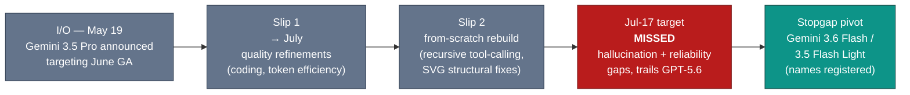

# LLM Updates — 2026-Jul-17

Friday brief, written Fri Jul 17 (Los Angeles time). Wednesday's report (Jul-15)
ended on a conditional: *"If Jul-17 holds, the next brief writes the moment all
four Western frontier labs have a current, publicly scored model live at once… If
it slips again, Google's absence becomes the story"* (Jul-15 §4). Two days later
**both halves of that bet came due — and the surprise came from outside the four.**

Three things define the window since Jul-15:

1. **The open frontier arrived — from China, and it isn't cheap.** Moonshot AI
   shipped **Kimi K3** on Jul 16: a **2.8-trillion-parameter** (≈A50B active)
   multimodal MoE that lands at **57 on the Artificial Analysis Intelligence Index
   — the #3 model *family*, on par with Opus 4.8** — and *beats* both Claude Fable 5
   and GPT-5.6 Sol on several individual coding benchmarks. Weights are promised
   **open by Jul 27.** The catch: at **$3/$15 per Mtok** it is priced like a Western
   mid-tier model, not the sub-dollar Chinese models these briefs have tracked (§1).
2. **Gemini 3.5 Pro missed the Jul-17 target — the absence hardened.** The rumored
   launch these reports flagged as "a leak, not a signed post" (Jul-15 §4) came and
   went. Reporting on Jul 15–16 says the rebuilt model **still fails hallucination
   and reliability thresholds**, and Google is now **pivoting to a stopgap Flash
   release** (registered names: *Gemini 3.6 Flash*, *3.5 Flash Light*) rather than
   shipping the Pro it promised at I/O in May (§2).
3. **The Fable 5 credit cliff still lands Jul 20** — now with a sharper price
   reference point sitting right next to it (§3).

The through-line: the mid-July "three-corner standoff" (Jul-15 §4) has gained a
**fourth axis — open weights — and lost none of its price pressure.** Kimi K3 puts a
near-frontier, soon-downloadable model into the field at Sonnet-5 pricing; Google is
the only one of five labs whose current-generation model still isn't on the board (§4).

This report does **not** re-derive the Fable 5 / Mythos 5 export saga and the
shared-weights + classifier-gate architecture (Jun-11 §2, Jul-01 §1), the GPT-5.6
family launch and tiering (Jul-09 §1, Jul-15 §1), Meta's Muse Spark 1.1 closed-API
pivot (Jul-15 §2), or DeepSeek's Jul-24 legacy-ID cutoff (Jul-08 §1). Those stand as
written. Here we advance only what is **new since Jul-15.**

![Grouped bar chart of coding-agent benchmark scores for Kimi K3, Claude Fable 5, and GPT-5.6 Sol across four benchmarks on a truncated 50 to 90 axis. On DeepSWE, GPT-5.6 Sol leads at 73.0, Fable 5 is at 70.0, and Kimi K3 is at 67.5. On Program Bench, Kimi K3 tops the group at 77.8, GPT-5.6 Sol is at 77.6, and Fable 5 at 76.8. On Terminal Bench 2.1, GPT-5.6 Sol leads at 88.8 with Kimi K3 essentially tied at 88.3 and Fable 5 at 84.6. On FrontierSWE, Fable 5 leads clearly at 86.6, Kimi K3 is at 81.2, and GPT-5.6 Sol trails at 71.3. No single model wins every benchmark; the open Kimi K3 wins one, ties one, and stays within a few points on the rest.](coding_split_decision.svg)

---

## 1. Kimi K3 — the open frontier arrives, and the price signal is the story

The genuinely new entrant since Jul-15 is **Kimi K3**, released by China's **Moonshot
AI** on **Jul 16**. Independent trackers place it as **the #3 model family on the
Artificial Analysis Intelligence Index at ~57** (57.1 on the v4.1 leaderboard),
behind only Claude Fable 5 (59.9, with Opus 4.8 fallback) and GPT-5.6 Sol (58.9), and
**level with Opus 4.8 and GPT-5.5** — while sitting *ahead* of Sonnet 5 and GLM-5.2.
This is the first time an open-weights-class model has entered the top tier of the
Index this year.

| Attribute | Kimi K3 |
|---|---|
| Builder | Moonshot AI (China) |
| Release | Jul 16, 2026 (API + first-party apps); **weights open by Jul 27** |
| Parameters | **~2.8 T total**, ≈**50 B active** (very sparse MoE: 16 of 896 experts routed) |
| Architecture | Kimi Delta Attention · Attention Residuals · Gated MLA · **Stable LatentMoE** |
| Context | **1,048,576 tokens** (1M) |
| Modalities | text · image · video **in** → text **out** |
| Intelligence Index | **57** (≈#3 family; on par with Opus 4.8 / GPT-5.5) |
| Pricing | **$3 in / $15 out per Mtok** · cached input $0.30 · per-task ≈$0.94 |

**Two findings matter more than the ranking.**

- **On coding, K3 trades wins with the two closed leaders rather than trailing them**
  (see chart). It **tops Program Bench (77.8** vs Sol's 77.6, Fable's 76.8), is
  **essentially tied for the Terminal Bench 2.1 lead (88.3** vs Sol's 88.8, well
  ahead of Fable's 84.6), and **leads the long-horizon SWE Marathon at 42.0.** It
  gives ground on **DeepSWE (67.5** vs Sol 73.0 / Fable 70.0) and **FrontierSWE
  (81.2**, where Fable pulls clear at 86.6). On the two Elo agentic boards
  (GDPval-AA v2, AA-Briefcase) both closed models still finish ahead — K3 scores
  **1668 on GDPval-AA v2** against Fable's 1760 and Sol's 1748. The honest summary:
  Fable 5 keeps a narrow edge on aggregate intelligence and the hardest agentic
  suites, but the task, harness, and budget can flip the pick.
- **The price signal is the real headline.** At **$3/$15** K3 is roughly **on par
  with Sonnet 5's standard rate** ($3/$15; Sonnet's intro $2/$10 runs to Aug 31) and
  about **half the per-task cost of Opus 4.8** — but it is *dramatically* more
  expensive than its own predecessor. Moonshot's prior model billed cents per Mtok;
  K3 is priced like a Western mid-tier product. As *the-decoder* framed it, K3
  "signals the end of super-cheap Chinese AI": the Chinese labs that won share on
  rock-bottom pricing (GLM-5.2, DeepSeek — Jul-08 §3) are now **pricing frontier
  quality at frontier-adjacent rates.**

*Caveats:* weights are **not yet public** — the Jul-27 open-weights date is a
promise, and at least one tracker notes the release is paired with a **"harness
contract"** (terms attached to how the model may be served), so "open" may carry
conditions. Index and benchmark figures are independent (Artificial Analysis via
secondary trackers) but K3 is one day old; expect revisions. Parameter routing
(16/896 experts, ≈50 B active) is vendor-reported.

**Sources:**
[Simon Willison — Kimi K3, and what we can still learn from the pelican benchmark](https://simonwillison.net/2026/Jul/16/kimi-k3/) ·
[Axios — China's open-weight Kimi model stuns AI world with frontier-level results](https://www.axios.com/2026/07/16/moonshot-kimi-ai-china-model-openai-anthropic) ·
[Latent Space — Kimi K3 2.8T-A50B: the largest open model ever released; Opus 4.8-class at Sonnet 5 pricing](https://www.latent.space/p/ainews-kimi-k3-28t-a50b-the-largest) ·
[the-decoder — Kimi's K3 nears GPT-5.6 Sol and Fable 5 while signaling the end of super-cheap Chinese AI](https://the-decoder.com/kimis-open-model-k3-nears-gpt-5-6-sol-and-fable-5-while-signaling-the-end-of-super-cheap-chinese-ai/) ·
[officechai — Kimi K3 beats Fable 5, GPT-5.6 on some benchmarks](https://officechai.com/ai/kimi-k3-benchmarks/) ·
[Mervin Praison — Kimi K3 explained: 2.8T open MoE, 1M context, pricing and benchmarks](https://mer.vin/2026/07/kimi-k3-explained-2-8t-open-moe-1m-context-api-pricing-and-benchmarks/) ·
[rohitai — Kimi K3: open model and a hidden harness contract](https://rohitai.com/blog/kimi-k3-open-model-harness-contract) ·
[BenchLM — AA Intelligence Index leaderboard, July 2026](https://benchlm.ai/benchmarks/artificialAnalysis)

---

## 2. Gemini 3.5 Pro misses Jul-17 — the stopgap-Flash pivot

The Jul-17 target these briefs flagged as unconfirmed (Jul-15 §4) **passed without a
launch.** Reporting on Jul 15–16 is consistent: Google DeepMind's **rebuilt** Gemini
3.5 Pro — the from-scratch pre-training cycle noted in Jul-08 §2 — has **missed a
third consecutive internal deadline**, and the reasons have escalated from the
earlier "coding / token-efficiency / multi-step reasoning" refinements to a harder
problem: the model **still fails hallucination-rate and real-world reliability
thresholds and trails GPT-5.6 in benchmark testing.**

The strategically new element is the **pivot to a stopgap**:

- Google has **registered model names** including **Gemini 3.6 Flash** and **Gemini
  3.5 Flash Light**, and reporting (9to5Google, Jul 16) says an **upgraded Flash
  model is in testing** — pointing to a *Flash* release shipping **before** the Pro.
- **Gemini 3.5 Flash** (GA since the May 19 I/O launch) is described as carrying
  production workloads in the interim and beating the older Gemini 3.1 Pro on several
  coding/agent metrics — the practical hedge while Pro slips.
- There has been **no official Google confirmation** of any Jul-17 Pro date at any
  point; developers who planned around it were planning around leaks.

The read: this is the "absence hardens" branch of the Jul-15 bet. Google is the only
one of the five frontier labs tracked here (Anthropic, OpenAI, xAI, Meta, Google)
whose **current-generation flagship still isn't on the public board** — and shipping
a *Flash* stopgap concedes the top of the market for the near term rather than
contesting it. Name registrations are not products (they "sometimes reflect canceled
directions entirely"), so treat *3.6 Flash* / *3.5 Flash Light* as signals of intent,
not a shipping roadmap.

**Sources:**
[TechTimes — Rebuilt Gemini 3.5 Pro misses third deadline; Google eyes stopgap release (Jul 16)](https://www.techtimes.com/articles/320736/20260716/rebuilt-gemini-35-pro-misses-third-deadline-google-eyes-stopgap-release.htm) ·
[9to5Google — Gemini 3.5 Pro delays due to coding performance; upgraded Flash model in testing (Jul 16)](https://9to5google.com/2026/07/16/gemini-3-5-pro-delays/) ·
[Geeky Gadgets — Stopgap Gemini 3.6 Flash may launch during the Gemini 3.5 Pro delay](https://www.geeky-gadgets.com/gemini-3-5-pro-delayed-again/) ·
[AIToolsRecap — Gemini 3.5 Pro delayed a third time; Google considers stopgap 3.6 Flash](https://aitoolsrecap.com/Blog/gemini-3-5-pro-delayed-third-time-3-6-flash-2026) ·
[coursiv — Gemini 3.5 Pro: what Google confirmed vs. leaked](https://coursiv.io/blog/gemini-3-5-pro)

---

## 3. Fable 5's credit cliff — Jul 20 still stands, now next to a $3/$15 open model

The Fable 5 pricing timeline (tracked since Jul-01 §1) is **unchanged since the
Jul-15 report**: subscription-included access — and Claude Code's 50%-higher weekly
limits — run **through Jul 19 (11:59:59 PM PT)**, after which Fable 5 transitions to
**credit-based usage at $10 in / $50 out per Mtok** (cache hits $1, 5-min cache write
$12.50, 1-hr cache write $20, with a per-day ceiling). No fifth extension has been
announced as of today.

What changed is the **context around the number.** Two days ago Fable 5's $50 output
rate topped a field where the cheapest frontier option was Muse Spark 1.1 at $4.25
(Jul-15 §2). It now sits next to **Kimi K3 — a #3-Index model at $15 output, with
weights going open Jul 27** (§1). The Jul-08 read ("competition has moved from *can it
ship* to *what does it cost*") sharpens further: the premium tier's price is now
measured not just against cheaper closed APIs but against a **near-peer model you can
soon run yourself.** The classifier false-positive fix promised after the Jul-01
redeployment (Jul-03 §1) **still has no shipped date or independent re-measurement.**

**Sources:**
[BleepingComputer — Fable 5 stays free for paid users until Jul 19 as Anthropic buys more time](https://www.bleepingcomputer.com/news/artificial-intelligence/claude-fable-5-stays-free-for-paid-users-until-july-19-as-anthropic-buys-more-time/) ·
[digitalapplied — Claude Fable 5 pricing: the usage-credits switch ($10/$50)](https://www.digitalapplied.com/blog/claude-fable-5-usage-credits-july-7-pricing-guide-2026) ·
[Anthropic — Redeploying Fable 5](https://www.anthropic.com/news/redeploying-fable-5)

---

## 4. The through-line — a fourth axis (open weights), and Google still off the board

The mid-July frontier was a three-corner standoff — peak quality, platform depth,
price-efficiency (Jul-15 §4). Kimi K3 adds a **fourth axis that cuts across all
three: open weights at frontier-adjacent quality.** The competitive map now reads by
*two* questions, not one — *how good / how expensive*, and *can you run it yourself*:

| Corner | Model(s) | Index | Output $/Mtok | Weights |
|---|---|---|---|---|
| Peak quality | Claude Fable 5 · Mythos 5 (scoped) | 59.9 / 60 | $50 (credits) | closed |
| Platform depth | GPT-5.6 Sol (max) | 58.9 / 59 | $30 | closed |
| **Open frontier** | **Kimi K3** | **57** | **$15** | **open ≤ Jul 27** |
| Price-efficiency | Grok 4.5 · Muse Spark 1.1 | 54 / 51 | $6 / $4.25 | closed |
| **Absent** | **Gemini 3.5 Pro** | **— (unscored)** | **— (no pricing)** | **— (missed Jul-17)** |

**The China story flipped its own script.** For six months these briefs tracked
Chinese open models winning US enterprise token share on price (30–46% of enterprise
API tokens, Jul-08 §3). Kimi K3 keeps the *open* half of that playbook and **abandons
the *cheap* half** — a near-frontier model at Western mid-tier pricing. If the Jul-27
weights land as promised, the pressure on the closed labs is no longer "someone
undercuts you by 10×"; it is "a downloadable model matches you on the tasks your
customers actually run." That is a different kind of threat than a price war.

**Google's absence is now the durable fact, not the open question.** The Jul-15
report gave two branches; Jul-17 resolved onto the harder one. A stopgap *Flash*
(§2) does not put Google back in the quality corner — it concedes it for now. Until a
scored Gemini 3.5 Pro (or a genuinely competitive 3.6 Flash) appears with a model
card and pricing, Google is a spectator to a five-lab race it used to help define.

**Sources:**
[Artificial Analysis Intelligence Index (evaluations)](https://artificialanalysis.ai/evaluations/artificial-analysis-intelligence-index) ·
[BenchLM — AA Intelligence Index leaderboard, July 2026](https://benchlm.ai/benchmarks/artificialAnalysis) ·
[kingy.ai — Kimi K3 benchmarks vs Fable 5 and GPT-5.6 Sol](https://kingy.ai/blog/kimi-k3-benchmarks-specs-price-fable-5-gpt-5-6-sol/) ·
[felloai — Best AI models in July 2026: ChatGPT, Claude, Gemini & Grok](https://felloai.com/best-ai-models/)

---

## Watch next

- **Kimi K3 open weights (Jul 27).** Whether the promised release actually ships,
  under what license, and what the "harness contract" attaches (§1). An unconditional
  open release of a #3-Index model would be the single biggest event of the month.
- **Gemini stopgap.** Whether *Gemini 3.6 Flash* / *3.5 Flash Light* materialize as
  products — and whether Google ever attaches a real date, model card, or Index score
  to the Pro (§2). Name registrations are intent, not shipping.
- **Fable 5 credit meter (Jul 20).** Whether the $10/$50 pricing finally sticks after
  four extensions, and whether the classifier false-positive fix ships and is
  re-measured (§3).
- **The other Chinese labs' response to K3's pricing.** If Moonshot has "ended
  super-cheap Chinese AI," watch whether DeepSeek (v4 cutover Jul-24, Jul-08 §1) and
  Zhipu/GLM follow the pricing up — or undercut K3 to defend the cheap corner.

---

*Compiled Fri Jul 17 2026 (Los Angeles time) from public reporting and independent
benchmark trackers. Vendor-reported figures (parameter counts, routing) are flagged
as such; independent Intelligence Index, Coding Agent Index, and per-benchmark
numbers are from Artificial Analysis as relayed by secondary trackers (the Artificial
Analysis site and several publisher domains returned HTTP 403 to direct fetches
during compilation, so figures are cited via BenchLM, officechai, the-decoder,
Latent Space, kingy.ai, and others). One-day-old benchmark figures for Kimi K3 should
be treated as provisional. Prior background is referenced by date/section rather than
repeated.*
