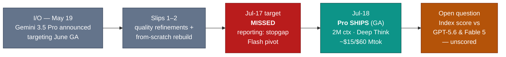

# LLM Updates — 2026-Jul-18

Saturday brief, written Sat Jul 18 (Los Angeles time). Yesterday's report closed on
what it called a settled fact: *"Google's absence is now the durable fact, not the
open question… Until a scored Gemini 3.5 Pro appears with a model card and pricing,
Google is a spectator"* (Jul-17 §4). **That fact lasted about 24 hours.**

Two developments define the window since Jul-17, and both cut against the Jul-17
framing:

1. **Gemini 3.5 Pro shipped — one day after the target it "missed."** After the
   Jul-17 no-show these briefs read as an "absence hardens / stopgap-Flash pivot"
   (Jul-17 §2), Google DeepMind is reported to have taken Gemini 3.5 Pro **generally
   available on Jul 18** via the Gemini API and Vertex AI — the real flagship, not the
   stopgap *Flash* the reporting had pointed to. It arrives with a **2-million-token
   context window**, a strengthened **Deep Think** reasoning mode, and premium pricing
   near **$15 in / $60 out per Mtok** — which makes it the **most expensive frontier
   flagship on the board** (§1).
2. **The open-weights field doubled in one week — and split into two philosophies.**
   Kimi K3 (Jul 16, §Jul-17) was not alone. Three days earlier, **Mira Murati's
   Thinking Machines Lab shipped its first model — *Inkling* (Jul 15)** — a
   975B-parameter open-weights MoE that these briefs had not yet covered. Where Kimi
   K3 is a *frontier-clone* open model priced like a Western mid-tier product, Inkling
   is deliberately **not** frontier: it is a **fine-tuning base** built to be
   customized on Thinking Machines' *Tinker* platform (§2).

The through-line: the Jul-17 map had one empty corner (Google, "absent") and one new
axis with a single occupant (open weights, Kimi K3). **Within 24 hours the empty
corner filled and the new axis gained a second, philosophically opposite entrant.**
The five-lab frontier race is, for the first time this month, one where **every lab
tracked here has a current-generation model live** (§3–4).

This report does **not** re-derive the Kimi K3 launch and its benchmark split
(Jul-17 §1), the Gemini slip history and from-scratch rebuild (Jul-08 §2, Jul-17 §2),
the GPT-5.6 family tiering (Jul-09 §1), Meta's Muse Spark closed-API pivot (Jul-15 §2),
or the Fable 5 export/classifier arc (Jul-01 §1, Jul-03 §1). Those stand as written.
Here we advance only what is **new since Jul-17.**

![Horizontal bar chart of API list output price per million tokens for four frontier flagships. Gemini 3.5 Pro, launched July 18, is the most expensive at $60 per million output tokens. Claude Fable 5 is $50 (metered credits from July 20). GPT-5.6 Sol (max) is $30. The open-weights Kimi K3 is $15. A note records that Kimi K3 weights go open by July 27 and that Thinking Machines' Inkling ships weights now, so self-hosting bypasses per-token pricing. Google's newest flagship arrives as the priciest option, not the cheapest.](flagship_output_price.svg)

---

## 1. Gemini 3.5 Pro ships — the "absence" reversed in a day, at the top of the price sheet

The Jul-17 report tracked Google DeepMind's rebuilt **Gemini 3.5 Pro** missing a
third consecutive deadline and Google apparently **pivoting to a stopgap Flash**
(Jul-17 §2). The window since flips that read: multiple trackers report Gemini 3.5 Pro
reaching **general availability on Jul 18** — the flagship itself, roughly a day after
the target it was said to have missed. So rather than conceding the top of the market
with a *Flash* stopgap, Google shipped the Pro.

| Attribute | Gemini 3.5 Pro |
|---|---|
| Builder | Google DeepMind |
| Release | **Jul 18, 2026** — GA via Gemini API + Vertex AI (reported) |
| Context | **2,000,000 tokens** (largest of any production frontier flagship) |
| Reasoning | **Deep Think** extended-reasoning mode (self-verification before output, aimed at hallucination reduction) |
| Modalities | text · image · video · audio in → text out |
| Pricing | **≈$15 in / $60 out per Mtok** (~10× Gemini 3.5 Flash) |
| Intelligence Index | **not yet independently scored** (GA is one day old; Gemini 3.5 Flash sits at 50–55, Gemini 3.1 Pro at 46) |

**Two things are worth stating plainly.**

- **The price is the surprise.** The story these briefs have told all month is Google
  *behind* — late, rebuilding, off the board. But at **~$60 output per Mtok** Gemini
  3.5 Pro launches as **the single most expensive frontier flagship tracked here** —
  above Claude Fable 5's $50 (which itself starts metering Jul 20, §3), double
  GPT-5.6 Sol's $30, and 4× the open Kimi K3's $15 (see chart). Google is not
  re-entering on price; it is betting the **2M context window and Deep Think** justify
  a premium over every rival. The "10× pricing problem" (vs its own Flash) is being
  discussed as the model's central commercial risk.
- **The benchmarks are not yet independent.** As of this writing there is **no
  Artificial Analysis Intelligence Index score** for Gemini 3.5 Pro — it launched
  today, and the Index will need days to place it. Google's own launch materials lean
  on Deep Think results (the family's prior Deep Think posted ARC-AGI-2 in the mid-80s
  and GPQA in the 90s), but the Jul-16 reporting that the rebuilt model **still
  trailed GPT-5.6 and failed internal hallucination thresholds** (Jul-17 §2) has not
  been reconciled with a shipping model card yet. Whether the launch build cleared
  those bars, or shipped anyway under IPO/competitive pressure, is the open question.

The Jul-17 brief drew the slip as a one-way ramp ending at "MISSED → stopgap pivot."
The window since adds one more node — and it reverses the branch:

*Sourcing caveat:* Google's first-party launch post and Vertex/API pages returned
**HTTP 403** to automated fetches during compilation, and the Jul-18 GA is reported
here via **secondary trackers**, not a fetched first-party model card. Given this
model's history of slipped, leaked, and unconfirmed dates (Jul-08 §2, Jul-13, Jul-17
§2), treat the **specifics** — exact pricing, the 2M window, GA breadth — as reported
rather than first-party-verified, and expect revisions. What is well-corroborated
across sources is the direction: **the Pro, not a Flash stopgap, and priced at a
premium.**

**Sources:**
[Layne McDonald — Google Gemini 3.5 Pro launches with 2M-token context window and Deep Think](https://www.laynemcdonald.com/post/technology-google-gemini-3-5-pro-launches-with-2-million-token-context-window-and-deep-think-reas) ·
[byteiota — Gemini 3.5 Pro: 2M tokens, Deep Think, and the 10× pricing problem](https://byteiota.com/gemini-3-5-pro-2m-tokens-deep-think-and-the-10x-pricing-problem/) ·
[AIToolsReview — Gemini 3.5 Pro: what's confirmed, benchmarks & pricing (July 2026)](https://aitoolsreview.co.uk/insights/gemini-3-5-pro) ·
[TokenCost — Gemini 3.5 Pro release date and pricing](https://tokencost.app/blog/gemini-3-5-pro-release-date-pricing) ·
[Developers Digest — Gemini 3.5 Pro developer guide: 2M context and Deep Think](https://www.developersdigest.tech/blog/gemini-3-5-pro-developer-guide-2026) ·
[TechTimes — Rebuilt Gemini 3.5 Pro misses third deadline (Jul 16 background)](https://www.techtimes.com/articles/320736/20260716/rebuilt-gemini-35-pro-misses-third-deadline-google-eyes-stopgap-release.htm)

---

## 2. Inkling — the second open-weights entrant, and the opposite bet from Kimi K3

The Jul-17 report framed Kimi K3 as *the* open frontier arrival (Jul-17 §1). It was
the second in a week, not the first. On **Jul 15**, **Thinking Machines Lab** — the
company founded by former OpenAI CTO **Mira Murati** — released its debut model,
**Inkling**, and neither the Jul-15 nor Jul-17 briefs covered it. It belongs in the
record because it makes the "fourth axis" (open weights) a two-model field with **two
genuinely different theories of what an open model is for.**

| Attribute | Inkling |
|---|---|
| Builder | Thinking Machines Lab (Mira Murati) |
| Release | **Jul 15, 2026** — full weights on Hugging Face, trained from scratch |
| Parameters | **975 B total**, ≈**41 B active** (sparse MoE) |
| Training | **45 T tokens** of text · image · audio · video |
| Context | up to **1 M tokens** (Tinker offers 64 K / 256 K options) |
| Modalities | text · image · audio · video **in** → text **out** (incl. code, structured data) |
| Reasoning | **controllable thinking effort** (dial reasoning up/down per request) |
| Positioning | **a base for fine-tuning**, *not* a frontier-topping product |

**The key contrast is philosophy, not just score.**

- **Inkling is openly *not* the best model, by design.** Thinking Machines says as
  much: it is "a good open-weights base for customization," not the strongest model
  open or closed. Its benchmark profile fits that — it **leads the open group on
  FORTRESS Adversarial (78.0)**, posts **MMMU Pro 73.5** and **VoiceBench 91.4**, and
  reaches an **Elo of 1,238 on GDPval-AA v2** (ahead of Kimi K2.6's 1,190 and DeepSeek
  v4 Flash's 1,189) — but that agentic Elo sits **far below** the frontier tier the
  Jul-17 report logged (Fable 5 ≈1,760, GPT-5.6 Sol ≈1,748, Kimi K3 ≈1,668). Inkling
  is competing in a different weight class on purpose.
- **The product is the fine-tuning loop, not the base weights.** Inkling ships live on
  **Tinker**, Thinking Machines' model-customization platform; fine-tuned checkpoints
  deploy via **TogetherAI, Fireworks, Modal, Databricks, and Baseten.** The bet is
  that organizations wanting a *specialized* model will start from an open base and
  tune it — the opposite of Kimi K3's bet (a general open model good enough to use
  as-is at frontier-adjacent quality).

So the open-weights axis now carries two poles: **Kimi K3 — download a near-frontier
generalist; Inkling — download a customizable base and make it yours.** Both landed in
72 hours, from a Chinese lab and a marquee US startup respectively. That is a broader
statement about where open weights are going than either release alone.

*Caveats:* benchmark figures are early and drawn from independent write-ups and vendor
materials as relayed by trackers; the GDPval-AA v2 and FORTRESS numbers are days old
and may be revised. Parameter routing (41 B active) is vendor-reported.

**Sources:**
[Thinking Machines Lab — Introducing Inkling (first-party, weights on Hugging Face)](https://thinkingmachines.ai/news/introducing-inkling/) ·
[MarkTechPost — Inkling: a 975B open-weights multimodal MoE with 41B active and controllable thinking effort](https://www.marktechpost.com/2026/07/15/thinking-machines-lab-releases-inkling-a-975b-parameter-open-weights-multimodal-moe-with-41b-active-parameters-and-controllable-thinking-effort/) ·
[TechCrunch — Thinking Machines amps up its bet against one-size-fits-all AI with Inkling](https://techcrunch.com/2026/07/15/thinking-machines-amps-up-its-bet-against-one-size-fits-all-ai-with-its-first-open-model-inkling/) ·
[Fortune — Murati's Thinking Machines releases first AI model for broad use](https://fortune.com/2026/07/15/what-is-mira-murati-thinking-machines-first-ai-model-inkling/) ·
[Axios — Mira Murati's Thinking Machines debuts its first AI model](https://www.axios.com/2026/07/15/mira-murati-thinking-machines-open-weight-model-inkling) ·
[Sebastian Raschka — Inkling: a new open-weight 975B MoE with a few surprises](https://sebastianraschka.com/blog/2026/inkling-architecture-benchmark-notes.html) ·
[HPCwire/AIwire — Thinking Machines launches open-weight Inkling foundation model for fine-tuning](https://www.hpcwire.com/aiwire/2026/07/16/thinking-machines-launches-open-weight-inkling-foundation-model-for-fine-tuning/)

---

## 3. Fable 5's credit meter — Jul 20, two days out, now the *second*-priciest flagship

The Fable 5 pricing timeline (tracked since Jul-01 §1) is **unchanged**:
subscription-included access — and Claude Code's 50%-higher weekly limits — run
**through Jul 19 (11:59:59 PM PT)**, after which Fable 5 transitions to **credit-based
usage at $10 in / $50 out per Mtok** (cache hits ~$1, 5-min cache write $12.50, 1-hr
cache write $20, Batch API halving to $5/$25). The subscription still covers Opus 4.8,
Sonnet 5, and Haiku 4.5 at normal limits; only Fable 5 meters separately. **No fifth
extension has been announced** — the meter is two days out.

What changed since Jul-17 is, again, the **comparison next to the number.** For two
weeks Fable 5's $50 output rate was the top of the price sheet — the premium the
market measured everyone else against. As of Jul 18 it is **no longer the most
expensive flagship**: **Gemini 3.5 Pro launched above it at ~$60 output** (§1). Fable
5's premium now has a *ceiling over it* as well as the Kimi K3 / Inkling open-weights
floor beneath it (§2). The Jul-08 read — "competition has moved from *can it ship* to
*what does it cost*" — holds, but the cost axis is now bracketed on both ends: a
pricier closed flagship above, near-peer downloadable models below. The classifier
false-positive fix promised after the Jul-01 redeployment (Jul-03 §1) **still has no
shipped date or independent re-measurement.**

**Sources:**
[digitalapplied — Claude Fable 5 pricing: the usage-credits switch ($10/$50)](https://www.digitalapplied.com/blog/claude-fable-5-usage-credits-july-7-pricing-guide-2026) ·
[The Agent Report — Fable 5 goes credits-only on Claude subscriptions: what changed](https://the-agent-report.com/2026/07/anthropic-fable-5-credits-only-july-2026/) ·
[Android Headlines — Claude Fable 5 now requires pay-per-use, even for Pro subscribers](https://www.androidheadlines.com/2026/07/claude-fable-5-drops-subscriptions-pay-per-use-credits.html) ·
[MindStudio — Claude Fable 5 pricing, access, and usage limits](https://www.mindstudio.ai/blog/claude-fable-5-pricing-access-usage-limits)

---

## 4. The through-line — everyone is on the board, and the open axis has two poles

Yesterday's map had a hole and a single-occupant new axis. Both closed in a day:

| Corner | Model(s) | Output $/Mtok | Weights | Status vs Jul-17 |
|---|---|---|---|---|
| **Priciest flagship** | **Gemini 3.5 Pro** (2M ctx, Deep Think) | **≈$60** | closed | **NEW — shipped Jul 18** |
| Peak quality | Claude Fable 5 · Mythos 5 (scoped) | $50 (credits Jul 20) | closed | unchanged |
| Platform depth | GPT-5.6 Sol (max) | $30 | closed | unchanged |
| **Open frontier (generalist)** | **Kimi K3** | **$15** | open ≤ Jul 27 | unchanged |
| **Open base (fine-tune)** | **Inkling** (Thinking Machines) | self-host | **open now** | **NEW to this record** |
| Price-efficiency | Grok 4.5 · Muse Spark 1.1 | $6 / $4.25 | closed | unchanged |

**Two structural shifts land together.**

- **The five-lab race is fully populated for the first time this month.** Anthropic,
  OpenAI, xAI, Meta, and now **Google** all have a current-generation model live and
  reachable. The Jul-17 "Google is a spectator" line is retired; the open question is
  no longer *whether* Google ships but *whether $60 buys enough* — the Index score,
  when it lands, will answer it.
- **Open weights is now a spectrum, not a point.** A week ago there were no
  frontier-class open models in these briefs; now there are two, and they disagree
  about the product. **Kimi K3** says the open model *is* the product — use it as-is at
  near-frontier quality. **Inkling** says the open model is *raw material* — a base you
  tune into something specialized. Closed labs now face pressure from both directions
  at once: "a downloadable model matches you on real tasks" (Kimi) **and** "a
  downloadable base lets your customers build exactly what they need" (Inkling).

The honest caveat on the whole picture: **the newest, most expensive entrant is also
the least independently measured.** Gemini 3.5 Pro's premium is a claim until the Index
and the coding boards score it. This month has repeatedly shown launch-day framing
revised within 48 hours (the Jul-17 "durable absence" being the freshest example), so
the Jul-18 map should be read as provisional.

**Sources:**
[Artificial Analysis Intelligence Index (evaluations)](https://artificialanalysis.ai/evaluations/artificial-analysis-intelligence-index) ·
[BenchLM — AA Intelligence Index leaderboard, July 2026 (Fable 5 59.9 / GPT-5.6 Sol 58.9 / Kimi K3 57.1)](https://benchlm.ai/benchmarks/artificialAnalysis) ·
[VentureBeat — Moonshot releases Kimi K3, largest open-source model ever (Jul-17 background)](https://venturebeat.com/technology/chinas-moonshot-ai-releases-kimi-k3-the-largest-open-source-model-ever-rivaling-top-u-s-systems) ·
[DataCamp — Inkling: Thinking Machines' open-weights model](https://www.datacamp.com/blog/thinking-machines-inkling)

---

## Watch next

- **Gemini 3.5 Pro's first independent number.** Whether Artificial Analysis and the
  coding boards place it above GPT-5.6 Sol and Fable 5 — or confirm the Jul-16 read
  that it trailed GPT-5.6. A #1 Index at $60 is a very different story from a #4 at $60
  (§1).
- **Whether the Jul-18 GA specifics hold.** First-party pricing, the 2M window, and GA
  breadth were reported via secondary trackers under a 403 wall; watch for Google's
  model card to confirm or revise them (§1).
- **Kimi K3 open weights (Jul 27).** Still the month's biggest pending event — an
  unconditional open release of a #3-Index model, and the "harness contract" terms
  (Jul-17 §1).
- **Fable 5 credit meter (Jul 20).** Whether $10/$50 finally sticks after four
  extensions, now that a pricier flagship sits above it, and whether the classifier
  false-positive fix ships and is re-measured (§3).
- **The Inkling/Tinker fine-tuning loop.** Whether a "download-and-tune" open base
  finds real enterprise adoption against Kimi K3's "download-and-use" generalist — the
  first real test of the two open-weights philosophies (§2).

---

*Compiled Sat Jul 18 2026 (Los Angeles time) from public reporting and independent
benchmark trackers. The Gemini 3.5 Pro Jul-18 GA and its pricing/context specs are
reported via secondary trackers — Google's first-party launch and API pages returned
HTTP 403 to direct fetches during compilation, so those figures are corroborated
across multiple publisher sources rather than first-party-verified, and are flagged
provisional. Inkling figures are drawn from the first-party announcement plus
independent write-ups; benchmark and routing numbers (975B/41B active, agentic Elo,
FORTRESS/MMMU/VoiceBench) are days old and vendor- or tracker-reported. Prior
background is referenced by date/section rather than repeated.*
