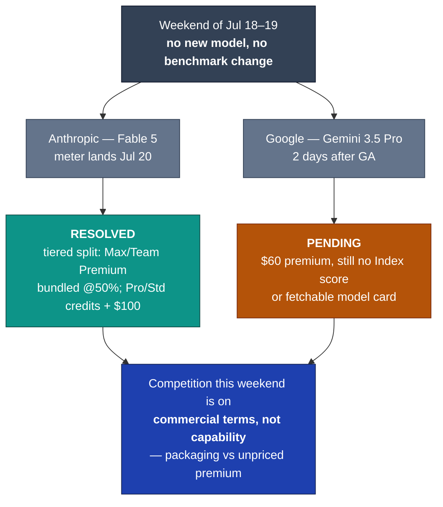

# LLM Updates — 2026-Jul-19

Sunday brief, written Sun Jul 19 (Los Angeles time). No new frontier model shipped in
the window since Jul-18. What moved this weekend is not *capability* but *commercial
terms* — and it moved at both ends of the price sheet:

1. **Fable 5's four-times-slipped meter finally lands tomorrow (Jul 20) — but as a
   *fork*, not the flat cutover the Jul-18 brief assumed.** Anthropic confirmed
   (first-party, @claudeai, Jul 18) that Fable 5 stays **permanently included in Max
   and Team Premium** at 50% of plan limits, while **Pro and Team Standard move to
   usage credits** ($10/$50 per Mtok) with a **one-time $100 credit** softening the
   switch. The month-long "price cliff" resolves into subscriber segmentation (§1).
2. **Gemini 3.5 Pro, now two days old, is still unscored — the $60 premium remains a
   claim.** The top Jul-18 watch item ("Gemini's first independent number") has **not**
   resolved: no Artificial Analysis Intelligence Index score, no fetchable first-party
   model card as of this writing. The most expensive flagship on the board is still the
   least independently measured (§2).

The through-line: **a settlement weekend.** The Jul-18 map had all five labs live and
one open question — "does $60 buy enough?" Nothing this weekend answered it. Instead,
the two things that moved are both about *how you pay*: Anthropic converted its meter
into a tiered subscription split (**resolved**), and Google's premium stayed a
value-unmeasured claim (**still pending**). For the first time in weeks the frontier
did not advance on a benchmark — it re-priced (§3).

This report does **not** re-derive the Gemini 3.5 Pro launch specifics and slip history
(Jul-17 §2, Jul-18 §1), the Kimi K3 / Inkling open-weights pair (Jul-17 §1, Jul-18 §2),
the GPT-5.6 family tiering (Jul-09 §1), or the Fable 5 export/classifier arc
(Jul-01 §1, Jul-03 §1). Those stand as written; here we advance only what is **new
since Jul-18.**

![Diagram of the Claude Fable 5 access change effective July 20, 2026. The four-times-slipped included window resolves into a fork by subscription tier rather than a flat cutover to credits. Claude Max and Team Premium keep Fable 5 included permanently, capped at 50 percent of plan limits with no separate metering. Claude Pro and Team Standard move to usage credits only at $10 per million input and $50 per million output tokens — double the Opus 4.8 rate — with a one-time $100 credit softening the switch. A footnote records the deadline sliding July 7 to 12 to 19 to 20 with no fifth extension.](fable5_tier_fork.svg)

---

## 1. Fable 5's Jul-20 landing is a fork, not a cliff

Every prior brief in this run — including Jul-18 — has treated the Fable 5 meter as a
**flat cutover**: subscription-included access ends, and on the cutover date *all*
subscribers drop to $10/$50 credits (Jul-18 §3 stated it explicitly: "Fable 5
transitions to credit-based usage… No fifth extension has been announced"). On **Jul
18**, Anthropic published the actual mechanism, and it is not that. It is a **permanent
split by subscription tier.**

Per Claude's own announcement (@claudeai, Jul 18):

> *"Beginning July 20, Claude Fable 5 will be included in all Max and Team Premium
> plans, at 50% of limits. Pro and Team Standard users will continue to have access to
> Fable via usage credits, and will receive a one-time $100 credit."*

| Tier | Jul-20 outcome | Terms |
|---|---|---|
| **Claude Max** | **Included — permanently** | Bundled at **50% of plan limits**; no separate metering |
| **Team Premium** | **Included — permanently** | Same 50% cap |
| **Claude Pro** | **Usage credits only** | $10/$50 per Mtok + **one-time $100 credit** |
| **Team Standard** | **Usage credits only** | Same |

Three things are worth stating plainly:

- **It is not a fifth extension, and not a flat meter either.** The included window
  slipped four times (Jul 7 → 12 → 19 → 20); the outcome tomorrow is a *structural*
  resolution rather than another date-shuffle. Anthropic is keeping Fable 5 bundled for
  its highest-paying subscribers indefinitely and metering only the entry tiers. The
  Jul-18 brief's "flat cutover to credits for everyone" read was **incomplete** — this
  corrects it.
- **For Max users, the permanent deal is arguably a *cut*, not a save.** *The Decoder*
  framed the same announcement as Anthropic "slashing" Fable 5 limits: the permanent
  50%-of-limits cap is **tighter** than the elevated allowance Max/Team Premium users
  had during the promotional window (Claude Code's "50% higher weekly limits," Jul-18
  §3, expire tonight). So the headline "included permanently" cuts both ways — the
  bundle survives, but the allowance inside it shrinks.
- **The $100 credit is a transition subsidy, not a price change.** Pro/Team Standard
  users still face the **$10 in / $50 out per Mtok** rate — 2× Opus 4.8, Anthropic's
  priciest GA rate ever, unchanged since Jul-07. The one-time credit buys roughly
  2M output tokens' worth of runway before pay-per-token begins; the underlying meter
  is exactly what was set on Jul-01.

**Why it matters.** The "Fable 5 price cliff" has been a running thread since Jul-01,
usually told as *"the best model gets a paywall."* The actual Jul-20 shape is subtler
and more strategic: **subscriber segmentation.** Anthropic is using Fable 5 as a Max/
Team-Premium *retention lever* (bundle the flagship, keep the premium tiers sticky) and
a Pro *upsell lever* (meter the entry tier, dangle a $100 credit, nudge toward Max).
That is a different competitive posture than "raise the price" — and it lands the same
week Gemini 3.5 Pro opened a **$60 ceiling above** Fable's $50 (Jul-18 §1) and the open
Kimi K3 / Inkling pair set a **floor below** it (Jul-17–18). Bracketed on price, the
Fable 5 move is to compete on **where it lives** (inside the subscription) rather than
on the per-token number.

*Sourcing note:* the terms are **first-party** (the @claudeai post, quoted above) and
corroborated across *The Decoder*, *TechTimes* (Jul 18), Simon Willison's write-up,
and *DAWN*. Several of those publisher pages returned **HTTP 403** to automated fetches
during compilation, so quotes are taken from the first-party post and search-surfaced
excerpts; the **cache/Batch sub-rates** (cache hits ~$1, Batch $5/$25) are carried
forward from Jul-18 §3 and were not re-confirmed today.

**Sources:**
[Claude (@claudeai) — Jul 18 announcement of the Jul-20 Fable 5 terms](https://x.com/claudeai/status/2078302415804379218) ·
[The Decoder — Anthropic slashes Claude Fable 5 limits in Max and Team Premium and pushes Pro users toward API pricing](https://the-decoder.com/anthropic-slashes-claude-fable-5-limits-in-max-and-team-premium-and-pushes-pro-users-toward-api-pricing/) ·
[TechTimes — Claude Fable 5 ends subscription limbo: permanent for Max, credits-only for Pro (Jul 18)](https://www.techtimes.com/articles/320905/20260718/claude-fable-5-ends-subscription-limbo-permanent-max-credits-only-pro.htm) ·
[Simon Willison — Claude: make Fable 5 permanent](https://simonwillison.net/2026/Jul/18/claude-make-fable-5-permanent/) ·
[DAWN — Anthropic to add Claude's Fable 5 to Max, Team Premium at 50pc of usage limits](https://www.dawn.com/news/2016483) ·
[AI Pricing Guru — Claude Fable 5 comes to Max and Team Premium: pricing impact](https://www.aipricing.guru/news/claude-fable-5-max-team-premium-subscription-rollout-july-2026/)

---

## 2. Gemini 3.5 Pro — two days in, still the most expensive *and* the least measured

The single biggest question the Jul-18 report left open was whether Gemini 3.5 Pro's
**~$60 output price** would be justified by an independent score. Two days after the
reported Jul-18 GA, **it still has not been answered.** As of this writing (Jul 19):

- **No Artificial Analysis Intelligence Index number for the Pro.** Trackers continue
  to surface only **Gemini 3.5 Flash (~55)** and **Gemini 3.1 Pro (~46)** on the
  Index; the 3.5 *Pro* line is still blank. AA's own guidance has been that a
  day-old GA needs several days of eval runs before it is placed — that window has not
  closed.
- **No fetchable first-party model card.** Google DeepMind's model-cards page and the
  Gemini/Vertex API pages again returned **HTTP 403** to automated fetches today, the
  same wall the Jul-18 brief hit. Everything specific about the Pro — the 2M context
  window, the ~$15/$60 pricing, the GA breadth — remains **secondary-tracker-reported**,
  not first-party-confirmed.
- **The Jul-16 reliability read is still unreconciled.** The reporting that the rebuilt
  model "still trailed GPT-5.6 and failed internal hallucination thresholds"
  (Jul-17 §2) has neither been confirmed nor refuted by a shipping card. Whether the
  launch build cleared those bars or shipped under IPO/competitive pressure is exactly
  as open as it was 48 hours ago.

So the standing of the priciest flagship on the board is unchanged from Jul-18: **a
premium claim awaiting its first independent measurement.** The reference points it
would be scored against are settled — GPT-5.6 Sol at 58.9, Fable 5 at 59.9, Kimi K3
at ~57.1 on the AA Index (Jul-17–18) — so when the Pro's number lands, the
"does $60 buy enough?" question becomes answerable in one line. It simply has not
landed yet. This section exists to record a **non-event**: the watch item is still on
the watch list, and no number should be invented to fill it.

**Sources:**
[Artificial Analysis — Intelligence Index (evaluations; no 3.5 Pro entry as of Jul 19)](https://artificialanalysis.ai/evaluations/artificial-analysis-intelligence-index) ·
[Artificial Analysis — Gemini 3.5 Flash model page (~55 Index, for reference)](https://artificialanalysis.ai/models/gemini-3-5-flash) ·
[Google DeepMind — model cards index (403 to automated fetch; Pro card not confirmed)](https://deepmind.google/models/model-cards/) ·
[AIToolsReview — Gemini 3.5 Pro: what's confirmed, benchmarks & pricing (July 2026)](https://aitoolsreview.co.uk/insights/gemini-3-5-pro) ·
[BenchLM — Gemini 3.1 Pro benchmarks (~46 Index, prior-gen reference)](https://benchlm.ai/models/gemini-3-1-pro)

---

## 3. The through-line — a settlement weekend, priced at both ends

Set the two moving pieces side by side and the shape of the weekend is clear:

| End of the price sheet | What moved (Jul 18–19) | Nature of the move | Status |
|---|---|---|---|
| **Top — $60** | Gemini 3.5 Pro | value still **unmeasured** (no Index score, 403 card) | **pending** |
| **$50** | Claude Fable 5 | meter resolves into a **tiered subscription split** | **resolved** |
| **Floor — $15 / self-host** | Kimi K3 · Inkling | unchanged (open weights, Jul-17–18) | stable |

Two observations tie it together:

- **The competition has fully left the capability axis this weekend.** No model gained
  a point; no benchmark changed hands. The only two developments are **billing
  structure** (Anthropic) and **an unpriced-by-results premium** (Google). After a
  month where the frontier moved almost daily on scores, the Jul-18→19 window is the
  first in weeks where the *product* news is entirely about **terms**, not ability.
  That is itself a signal: at the top of the market, capability is compressed enough
  (Fable 59.9 / Sol 58.9 / Kimi 57.1 within ~3 points) that labs are competing on
  **packaging** — who bundles, who meters, who self-hosts.
- **Anthropic and Google made opposite bets on the same premium tier.** Both sit at
  the top of the price sheet ($50 / $60). Anthropic's move is to **bury the price
  inside a subscription** for its best customers (Fable 5 bundled in Max/Team Premium)
  and meter only the entry tier — competing on *access model*. Google's move is to
  **charge the highest per-token rate on the board** and let the 2M context window and
  Deep Think justify it — competing on *headline capability it has not yet had scored*.
  One is de-emphasizing the sticker; the other is leaning entirely on it. The market
  will read both answers over the coming week — Anthropic's in subscriber behavior at
  the Jul-20 split, Google's in the Index number whenever it posts.

The honest caveat on the whole picture is the same as Jul-18, and it has not improved:
**the newest, most expensive entrant is still the least independently measured.** Until
Gemini 3.5 Pro is scored, the top of this table is a price without a proof, and this
weekend's "settlement" is only half-settled.

**Sources:**
[Claude (@claudeai) — Jul-20 Fable 5 terms](https://x.com/claudeai/status/2078302415804379218) ·
[BenchLM — AA Intelligence Index leaderboard (Fable 5 59.9 / GPT-5.6 Sol 58.9 / Kimi K3 57.1)](https://benchlm.ai/benchmarks/artificialAnalysis) ·
[byteiota — Gemini 3.5 Pro: 2M tokens, Deep Think, and the 10× pricing problem (Jul-18 background)](https://byteiota.com/gemini-3-5-pro-2m-tokens-deep-think-and-the-10x-pricing-problem/) ·
[llm-stats — AI updates today (July 2026 release tracker)](https://llm-stats.com/llm-updates)

---

## Watch next

- **Gemini 3.5 Pro's first independent number** (unchanged from Jul-18, still the top
  item). Whether Artificial Analysis and the coding boards place it above GPT-5.6 Sol
  (58.9) and Fable 5 (59.9) — or confirm the Jul-16 read that it trailed GPT-5.6. A #1
  Index at $60 is a very different story from a #4 at $60 (§2).
- **Whether the Jul-20 Fable 5 split holds as announced** — no last-minute fifth
  extension, the 50% Max/Team-Premium cap as stated, the $100 Pro credit actually
  posting, and whether the metered entry tier meaningfully shifts Pro→Max upgrades (§1).
- **The classifier false-positive fix** promised after the Jul-01 Fable 5 redeployment
  (Jul-03 §1) — still no shipped date or independent re-measurement, now 18 days on.
- **Kimi K3 open weights (Jul 27)** — eight days out; still the month's biggest pending
  event, an unconditional open release of a #3-Index model (Jul-17 §1).
- **DeepSeek's Jul-24 legacy-ID cutoff** — five days out; `deepseek-chat` /
  `deepseek-reasoner` retire in favor of explicit `v4-flash` / `v4-pro` (Jul-08 §1).

---

*Compiled Sun Jul 19 2026 (Los Angeles time) from public reporting, a first-party
Anthropic announcement, and independent benchmark trackers. The Fable 5 Jul-20 terms
are first-party (@claudeai, Jul 18) and corroborated across multiple publishers, some
of which returned HTTP 403 to direct fetches — those quotes are taken from the
first-party post and search-surfaced excerpts. Gemini 3.5 Pro remains
secondary-tracker-reported: no independent Intelligence Index score and no fetchable
first-party model card as of compilation, so its pricing/context specs are carried
forward as reported, not first-party-verified, and are flagged provisional. This is a
deliberately short Sunday brief — no new frontier model shipped in the window, and no
score was invented to fill the pending Gemini item. Prior background is referenced by
date/section rather than repeated.*
