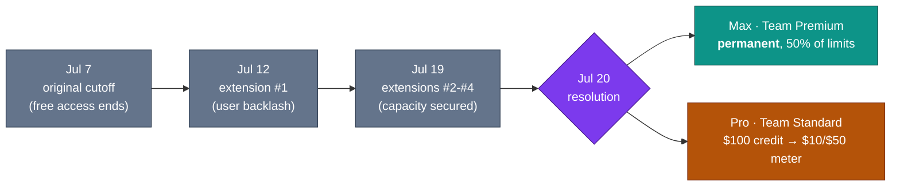

# LLM Updates — 2026-Jul-20

Monday brief, written Mon Jul 20 (Los Angeles time). Friday's report (Jul-17) closed
on three open questions: *would the four-times-extended Fable 5 credit cliff finally
stick on Jul 20; would the "fourth axis — open weights" stay a one-model story; and
would Google ever put a date on the absent Gemini 3.5 Pro* (Jul-17 §4, "Watch next").
Three days later, **two of the three moved — and the open-weights story turned out to
have a second pole the Friday brief missed.**

Three things define the window since Jul-17:

1. **The Fable 5 cliff landed today — but as a *tier split*, not the flat meter these
   briefs forecast.** As of **Jul 20**, Claude Fable 5 is a **permanent inclusion on
   Max and Team Premium plans (at 50% of weekly limits)**, while **Pro and Team
   Standard** move to **usage credits ($10 in / $50 out per Mtok)** cushioned by a
   **one-time $100 credit**. After four extensions, the resolution is a fork in the
   road by subscription tier, and it is being described as *permanent* — not a fifth
   delay (§1).
2. **The open-weights axis grew a second, opposite pole — from a US lab.** Mira
   Murati's **Thinking Machines Lab** shipped **Inkling** on **Jul 15**: a 975B-param
   (41B active) multimodal MoE, **Apache-2.0**, **already downloadable**, at
   **Index 41 — the leading US open-weights model.** Where Kimi K3 is *near-frontier,
   not-cheap, China, weights-still-promised* (Jul-17 §1), Inkling is *mid-tier, cheap,
   US, clean-licensed, live today.* The Friday brief tracked one open model; there are
   two, and they sit at opposite ends of the same axis (§2, §3).
3. **Gemini 3.5 Pro slipped again — the market now prices it for end-July or August.**
   No launch, no date from Google. Prediction markets have moved the leading outcome
   to **Jul 31 (~81%)**, with an **Aug 7** market also live. Google remains the only
   one of the tracked labs with no current-generation flagship on the board (§4).

The through-line: the mid-July map (Jul-15 §4, Jul-17 §4) is stable in shape but
**sharper on two corners.** The premium closed tier just drew an explicit line
between "power users keep it, everyone else meters it," and the open-weights corner
turned from a single Chinese near-frontier bet into a **US/China, cheap/near-frontier,
Apache/uncertain-license spread** (see chart).

This report does **not** re-derive the Fable 5 / Mythos 5 export saga and shared-weights
+ classifier-gate architecture (Jun-11 §2, Jul-01 §1), the GPT-5.6 family launch and
tiering (Jul-09 §1, Jul-15 §1), Kimi K3's architecture and coding-benchmark split
(Jul-17 §1), Meta's Muse Spark 1.1 closed-API pivot (Jul-15 §2), or DeepSeek's Jul-24
legacy-ID cutover (Jul-08 §1). Those stand as written. Here we advance only what is
**new since Jul-17.**

![Scatter plot of Intelligence Index versus output price for six models. Two open-weights models are shown in teal: Inkling at Index 41 and about $4.68/Mtok output (US, Apache-2.0, live now) and Kimi K3 at Index 57 and $15/Mtok (China, weights by Jul 27). Four closed or hosted-API models are in slate-blue and form a steep price curve as Index rises: Muse Spark 1.1 at Index 51 and $4.25, Grok 4.5 at Index 54 and $6, GPT-5.6 Sol at Index 58.9 and $30, and Claude Fable 5 at Index 59.9 and $50. Gemini 3.5 Pro is annotated as absent — unscored and unpriced. The two teal open models anchor opposite ends of the Index range at low price, while closed frontier models get sharply more expensive the smarter they are.](open_weights_two_poles.svg)

---

## 1. The Fable 5 credit cliff resolves — a permanent tier split (Jul 20)

The pricing timeline tracked since Jul-01 (§1) reached its terminus **today**. The
subscription-included window — extended from Jul 7 → Jul 12 → Jul 19 across four
rounds (Jul-08 §epilogue, Jul-15 §3) — expired **Jul 19 at 11:59 PM PT**, and the
Jul 20 transition is **not** the flat "$10/$50 for everyone" meter these briefs had
penciled in. Anthropic split the outcome by plan tier and framed it as **permanent**:

| Plan tier | Fable 5 access from Jul 20 | Cushion |
|---|---|---|
| **Max · Team Premium** | **Permanently included**, up to **50% of weekly limits** | — (draws from plan limit) |
| **Pro · Team Standard** | **Usage credits only** — $10 in / $50 out per Mtok | **One-time $100 credit** |

Anthropic's own announcement makes the logic explicit: *"Beginning July 20, Claude
Fable 5 will be included in all Max and Team Premium plans, at 50% of limits. Pro and
Team Standard users will continue to have access to Fable via usage credits, and will
receive a one-time $100 credit. Demand for Fable has been challenging to predict,
which is why we rolled it out to subscription plans in stages, extending access
several times as we secured additional capacity."*

Three reads:

- **The four extensions were a capacity story, not a pricing-strategy dither.** The
  "challenging to predict" / "as we secured additional capacity" framing recasts the
  Jul 7 → 19 slips (which the Jun-22/Jul-08 briefs read as a free→credit *cliff*) as a
  supply ramp. The endpoint is a durable two-tier structure, not another countdown.
- **The premium tier is now explicitly gated to power users.** A Max subscriber keeps
  Fable 5 bundled (at half their weekly limit); a Pro subscriber gets a $100 taste and
  then pays the priciest rate Anthropic lists — $50/Mtok output, **2× Opus 4.8.** The
  Jul-08 read ("competition has moved from *can it ship* to *what does it cost*")
  lands as a concrete plan-design decision: Anthropic is monetizing Fable at the top
  and rationing it in the middle.
- **The classifier false-positive fix is still unshipped and unmeasured.** The
  reroute-sensitivity issue flagged after the Jul-01 redeployment (Jul-03 §1, measured
  by BridgeBench Jul-2) has **no shipped date or independent re-measurement** as of
  today — now nearly three weeks old. The pricing question resolved; the quality-gate
  question did not.

**Sources:**
[Claude (Anthropic) on X — Fable 5 plan change effective Jul 20](https://x.com/claudeai/status/2078302415804379218) ·
[Simon Willison — "Claude: make Fable 5 permanent" (Jul 18)](https://simonwillison.net/2026/Jul/18/claude-make-fable-5-permanent/) ·
[TechTimes — Fable 5 billing splits today: Max gets it free, Pro pays per token (Jul 20)](https://www.techtimes.com/articles/320999/20260720/claude-fable-5-billing-splits-today-max-gets-it-free-pro-pays-per-token.htm) ·
[TechTimes — Fable 5 ends subscription limbo: permanent for Max, credits-only for Pro (Jul 18)](https://www.techtimes.com/articles/320905/20260718/claude-fable-5-ends-subscription-limbo-permanent-max-credits-only-pro.htm) ·
[Fable5.app — weekly limit, 50% usage cap & credit prices: the July 20 plan split](https://fable5.app/fable-5-usage-limits/)

---

## 2. Inkling — the US open-weights counterweight the Friday brief missed

The Jul-17 report framed the "open frontier" as arriving *from China* (Kimi K3, §1).
It did — but three days earlier, on **Jul 15**, the **US** got its own open-weights
entrant, and these briefs hadn't yet caught it. **Thinking Machines Lab** — the lab
founded by former OpenAI CTO **Mira Murati** — released **Inkling**, its first
in-house model, trained from scratch and shipped **open-weight under Apache 2.0.**

| Attribute | Inkling |
|---|---|
| Builder | Thinking Machines Lab (US) · founder Mira Murati |
| Release | **Jul 15, 2026** — weights **already live** on Hugging Face |
| License | **Apache 2.0** (permissive; commercial use royalty-free) |
| Parameters | **975 B total**, ≈**41 B active** (Mixture-of-Experts transformer) |
| Context | **1,048,576 tokens** (1M) |
| Training | **45 T tokens** across text · image · audio · video |
| Modalities | text · image · audio **in** → text **out** |
| Intelligence Index | **41** — **leading US open-weights model** (+3 vs. Nemotron 3 Ultra's 38) |
| Pricing (TM API) | **≈$1.87 in / $4.68 out per Mtok** (no first-party chat SLA; also via 3rd-party inference + Tinker) |
| Sibling | **Inkling-Small** (preview) — ≈12 B active, same recipe, lower cost/latency |

**What matters about Inkling is not its rank but its *shape*.** Thinking Machines is
unusually candid that this is **not** a frontier model: the launch says outright that
Inkling *"is not the strongest overall model available today, open or closed."* At
Index 41 it sits ~16 points below Kimi K3 and the closed leaders. The pitch is
different:

- **A clean, customizable base.** Apache 2.0 (versus Kimi K3's still-unconfirmed
  "Modified MIT," Jul-17 §1), downloadable *today* (versus Kimi K3's Jul-27 promise),
  multimodal input, and first-class fine-tuning through Thinking Machines' **Tinker**
  API (which meters per-token across prefill/sample/train rather than per-GPU-hour).
  The design goal is a model teams **adapt**, not a leaderboard entry.
- **Cheap by construction.** At ≈$4.68/Mtok output on Thinking Machines' own API it is
  an order of magnitude under Fable 5 ($50) and roughly a third of Kimi K3 ($15). Its
  strong marks come on reasoning/coding suites — **AIME 2026 97.1%, GPQA Diamond
  87.2%, SWE-bench Verified 77.6%, SWE-bench Pro Public 54.3%** — where an efficient,
  fine-tunable base earns its keep, rather than on the aggregate agentic Elo boards
  where the frontier models still win.
- **A stated ideological angle.** Coverage emphasizes Thinking Machines' framing of
  low cost and *"resistance to censorship"* as design values — a deliberately
  different open-weights positioning from the Chinese labs.

The significance for these briefs: the open-weights corner is **no longer a China-only
phenomenon.** A well-capitalized US lab just put a permissively-licensed, immediately
downloadable multimodal model on the board — and did it a full week before Kimi K3's
weights are even due.

**Sources:**
[Thinking Machines Lab — Introducing Inkling](https://thinkingmachines.ai/news/introducing-inkling/) ·
[Artificial Analysis — Inkling, the new leading US open-weights model](https://artificialanalysis.ai/articles/thinking-machines-has-released-inkling-the-new-leading-u-s-open-weights-model) ·
[TechCrunch — Thinking Machines bets against one-size-fits-all AI with Inkling (Jul 15)](https://techcrunch.com/2026/07/15/thinking-machines-amps-up-its-bet-against-one-size-fits-all-ai-with-its-first-open-model-inkling/) ·
[VentureBeat — Thinking Machines open-sources Inkling, focused on low cost and "resistance to censorship"](https://venturebeat.com/technology/thinking-machines-open-sources-first-multimodal-language-model-inkling-focused-on-low-cost-and-resistance-to-censorship) ·
[gHacks — Inkling: 975B open-weights model under Apache 2.0](https://www.ghacks.net/2026/07/16/thinking-machines-lab-releases-inkling-a-975-billion-parameter-open-weights-ai-model-under-apache-2-0/) ·
[Sebastian Raschka — Inkling architecture and benchmark notes](https://sebastianraschka.com/blog/2026/inkling-architecture-benchmark-notes.html) ·
[Tinker Documentation — models & pricing](https://tinker-docs.thinkingmachines.ai/tinker/models/)

---

## 3. The open-weights axis now has two poles

Put Inkling and Kimi K3 side by side and the "fourth axis" the Jul-17 brief added
(§4) resolves into a **spread**, not a point. They agree on exactly one thing — the
weights are (or will be) yours — and diverge on almost everything else:

| | **Inkling** | **Kimi K3** |
|---|---|---|
| Lab / origin | Thinking Machines · **US** | Moonshot AI · **China** |
| Released | **Jul 15** (weights live) | Jul 16 (weights **≤ Jul 27**) |
| License | **Apache 2.0** (permissive, confirmed) | "Modified MIT" (**unconfirmed**) |
| Params (total / active) | 975 B / ~41 B | ~2.8 T / ~50 B |
| Intelligence Index | **41** (US open-weights lead) | **57** (#3 family, ~Opus 4.8) |
| Output $/Mtok | **≈$4.68** | **$15** |
| Positioning | **cheap, customizable base** ("not the strongest") | **near-frontier**, trades coding wins with closed leaders |
| Availability today | **downloadable now** | API now, weights later |

The two poles map to two different competitive threats to the closed labs:

- **Inkling is the "good-enough, own-it, tune-it, cheap" threat** — the model an
  enterprise forks and runs itself for high-volume, cost-sensitive, or
  data-residency-bound workloads. It doesn't need to beat Fable 5; it needs to be
  adaptable and an order of magnitude cheaper, which it is.
- **Kimi K3 is the "near-peer you can soon download" threat** (Jul-17 §4) — a model
  that contests the frontier labs on the *hard* tasks their customers actually run,
  priced like a Western mid-tier product rather than a loss-leader.

Between them they cover the field the closed frontier used to have to itself: the
low-cost/high-volume floor *and* the near-frontier ceiling are both now available in
open weights. That is a materially different pressure than the "someone undercuts you
10×" price war these briefs tracked through the spring.

**Sources:**
[Artificial Analysis Intelligence Index (evaluations)](https://artificialanalysis.ai/evaluations/artificial-analysis-intelligence-index) ·
[techsy.io — Best open-source LLMs: July 2026 leaderboard](https://techsy.io/en/blog/best-open-source-llms-2026) ·
[VentureBeat — Moonshot AI releases Kimi K3, the largest open-source model ever](https://venturebeat.com/technology/chinas-moonshot-ai-releases-kimi-k3-the-largest-open-source-model-ever-rivaling-top-u-s-systems) ·
[Hugging Face — Kimi K3 model overview: 2.8T params, MXFP4 quantization, open weights](https://huggingface.co/blog/ResterChed/kimi-k3-model-overview-mxfp4-quantization-open-wei)

---

## 4. Gemini 3.5 Pro slips again — the market prices end-July or August

The Jul-17 target passed without a launch (Jul-17 §2); Jul 20 arrives with **still no
Gemini 3.5 Pro and still no official date.** The reporting since is a continuation of
the "absence hardens" branch:

- The reasons remain the *hard* ones, not polish: the rebuilt model is reported to
  **still miss GPT-5.6 on key benchmarks**, with **frequent hallucinations** in
  generated output and **inconsistent real-world-workflow** performance — the same
  reliability wall noted Jul-16, not new coding/token-efficiency tweaks.
- **The market has repriced the launch.** Prediction markets now put the leading
  outcome at **Jul 31 (~81%)**, with a separate market carrying an **Aug 7** date —
  i.e. the crowd no longer expects July's *middle*, it expects the **end of July or
  early August**, if not later.
- The **stopgap-Flash** thesis (Jul-17 §2) is unchanged: registered names *Gemini 3.6
  Flash* and *Gemini 3.5 Flash Light* still point to a Flash release arriving before
  the Pro, with **Gemini 3.5 Flash** (GA since the May 19 I/O launch) carrying
  production workloads in the interim. No stopgap has actually shipped yet either.

The read is unchanged from Friday and now simply **more durable**: of the labs these
briefs track (Anthropic, OpenAI, xAI, Meta, Google), Google is the only one whose
current-generation flagship is neither scored nor priced — and the gap is now measured
in *weeks-to-a-month*, on the market's own numbers, rather than days.

**Sources:**
[TechTimes — Rebuilt Gemini 3.5 Pro misses third deadline; Google eyes stopgap (Jul 16)](https://www.techtimes.com/articles/320736/20260716/rebuilt-gemini-35-pro-misses-third-deadline-google-eyes-stopgap-release.htm) ·
[CometAPI — Gemini 3.5 Pro release date & rumored specs (updated Jul 2026)](https://www.cometapi.com/gemini-3-5-pro-release-date-rumored-specifications-all-we-know-in-2026-updated-july-2026/) ·
[coursiv — Gemini 3.5 Pro: what Google confirmed vs. leaked](https://coursiv.io/blog/gemini-3-5-pro) ·
[9to5Google — Gemini 3.5 Pro delays; upgraded Flash model in testing (Jul 16)](https://9to5google.com/2026/07/16/gemini-3-5-pro-delays/)

---

## 5. The through-line — the map holds, two corners sharpen

The mid-July frontier map (Jul-15 §4, Jul-17 §4) keeps its shape; two corners gained
resolution over the weekend:

| Corner | Model(s) | Index | Output $/Mtok | Weights | Change since Jul-17 |
|---|---|---|---|---|---|
| Peak quality | Claude Fable 5 · Mythos 5 (scoped) | 59.9 / 60 | $50 (Pro credits) / bundled (Max) | closed | **Tier split shipped (§1)** |
| Platform depth | GPT-5.6 Sol (max) | 58.9 | $30 | closed | — |
| Open · near-frontier | **Kimi K3** | 57 | $15 | open ≤ Jul 27 | weights still pending |
| Price-efficiency (closed) | Grok 4.5 · Muse Spark 1.1 | 54 / 51 | $6 / $4.25 | closed | — |
| **Open · cheap base** | **Inkling** | **41** | **≈$4.68** | **open (live, Apache-2.0)** | **new to the map (§2)** |
| Absent | Gemini 3.5 Pro | — | — | — | **market → Jul 31 / Aug (§4)** |

Two shifts stand out. **First, the premium tier stopped being one price.** Fable 5 is
now *bundled* at the top (Max) and *metered at 2× Opus* in the middle (Pro) — the
clearest signal yet that the frontier labs will segment their best model by willingness
to pay rather than hold a single headline rate. **Second, "open weights" stopped being
a single data point.** A week ago the open corner was empty; today it is anchored at
*both* ends — Inkling holding the cheap, adaptable floor from a US lab under a clean
permissive license, Kimi K3 contesting the near-frontier ceiling from China. The
closed labs now face open competition across the *whole* quality range, not just at
the bottom.

**Google is still the one lab off the board** — and the market has now put a number on
how long: end-July at the earliest. Until a scored, priced Gemini 3.5 Pro (or a
genuinely competitive 3.6 Flash) appears with a model card, that remains the single
largest unresolved question on the map.

---

## Watch next

- **Kimi K3 open weights (Jul 27).** The Jul-17 headline watch-item still stands:
  whether the promised weights actually land, under what license (the "Modified MIT"
  claim is still unconfirmed), and how the MXFP4-quantized release behaves in the wild.
- **Fable 5 tier split — does it hold, and does anyone follow?** Whether the
  Max-bundled / Pro-metered structure sticks as "permanent," how fast Pro users burn
  the $100 credit, and whether OpenAI/Google segment their premium models the same way.
  The classifier false-positive fix (Jul-03 §1) is now ~3 weeks unshipped and unmeasured.
- **Inkling adoption & the second wave.** Whether a permissively-licensed US
  open-weights base at Index 41 actually pulls enterprise fine-tuning volume (via
  Tinker and third-party inference), and whether Inkling-Small ships from preview to GA.
- **Gemini date.** Whether Google attaches *any* official date, model card, or Index
  score to the Pro before the market's Jul 31 line — or ships a *Gemini 3.6 Flash*
  stopgap first. Name registrations remain intent, not shipping.
- **DeepSeek v4 cutover (Jul 24).** The hard retirement of `deepseek-chat` /
  `deepseek-reasoner` and the Anthropic-format reroute (Jul-08 §1) lands this week —
  and whether DeepSeek/Zhipu answer Kimi K3's pricing up-move or undercut it.

---

*Compiled Mon Jul 20 2026 (Los Angeles time) from public reporting and independent
benchmark trackers. Vendor-reported figures (parameter counts, training-token totals,
routing) are flagged as such; independent Intelligence Index and per-benchmark numbers
are from Artificial Analysis as relayed by secondary trackers. Several publisher and
primary domains (Artificial Analysis, TechTimes, vantagepoint, unite.ai, and others)
returned HTTP 403 to direct fetches during compilation, so figures are cited via the
search index and secondary trackers where a direct read failed; benchmark figures for
one-week-old models (Inkling, Kimi K3) should be treated as provisional. Prior
background is referenced by date/section rather than repeated.*
